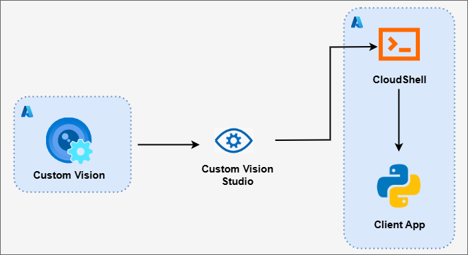
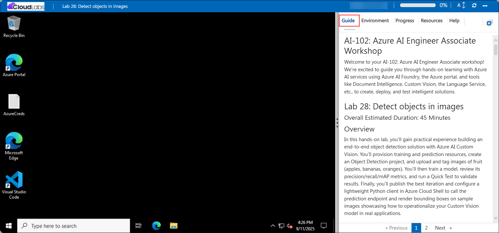

# AI-102: Azure AI Engineer Associate Workshop

Welcome to your AI-102: Azure AI Engineer Associate workshop! We’re excited to guide you through hands-on learning with Azure AI services using Microsoft Foundry, the Azure portal, and tools like Document Intelligence, Custom Vision, the Language Service, etc., to create, deploy, and test intelligent solutions.

# Lab 29: Detect objects in images

### Overall Estimated Duration: 45 Minutes

## Overview

In this hands-on lab, you’ll gain practical experience building an end-to-end object detection solution with Azure AI Custom Vision. You’ll provision training and prediction resources, create an Object Detection project, and upload and tag images of fruit (apples, bananas, oranges). You’ll then train a model, review its precision/recall/mAP metrics, and run a Quick Test to validate results. Finally, you’ll publish the best iteration and configure a lightweight Python client in Azure Cloud Shell to call the prediction endpoint and render bounding boxes on sample images showcasing how to operationalize your Custom Vision model in real applications.

## Objectives

By the end of this lab, you will be able to:

1. **Create Custom Vision resources:** Provision both training and prediction resources in Azure to support object detection workflows.

2. **Set up a Custom Vision project:** Create an Object Detection project in the Custom Vision portal and connect it to your training resource.

3. **Upload and tag images:** Add fruit images (apples, bananas, oranges), draw bounding boxes, and assign the correct tags for each object.

4. **Use the Training SDK from Cloud Shell:** Configure authentication, clone the repo, and run Python code to programmatically upload tagged images from JSON.

5. **Train, evaluate, and validate the detector**: Run a training iteration, review Precision, Recall, and mAP metrics, then use Quick Test to verify predicted boxes, labels, and confidence scores.

6. **Publish the best iteration:** Publish the trained model to the prediction resource and obtain the prediction endpoint and key.

7. **Build and run a client application:** Configure a lightweight Python client to call the prediction API and render bounding boxes on test images for end-to-end inference.

## Pre-requisites

* Basic understanding of **computer vision concepts**
* Familiarity with the **Azure portal**, including how to create and manage resources.
* Experience using **Azure Cloud Shell** for running Python scripts and managing environments.

* Basic knowledge of **Python programming** and working in a terminal or shell environment.

## Architecture

The lab architecture demonstrates how Azure AI Custom Vision enables object detection by combining resource provisioning, model training, and client application integration:

1. **Custom Vision Training and Prediction Resources:** Provision two resources in Azure one for training the object detection model and another for serving predictions (labels, bounding boxes, confidences) through a secure endpoint.

2. **Custom Vision Portal:** Create and manage an Object Detection project, upload images, draw bounding boxes, tag objects, train iterations, and publish the best model.

3. **Azure Cloud Shell:** Configure a development environment to install dependencies, clone the repository, and run Python/SDK scripts for automated data upload, training, and quick testing.

4. **Python Client Application:** Connect to the published prediction resource, submit images, receive detections with labels and confidence scores, and generate annotated output images.

## Architecture Diagram

## Explanation of Components

1. **Custom Vision Training Resource:** Provides the environment to build, train, and manage an object detection model by uploading images and tagging bounding boxes.

2. **Custom Vision Prediction Resource:** Hosts the published model and exposes a secure endpoint and key for serving detections (labels, boxes, confidence scores).

3. **Custom Vision Portal:** Web interface to create Object Detection projects, tag regions, run training iterations, review Precision/Recall/mAP, and publish the best model.

4. **Azure Cloud Shell:** Browser-based terminal used to install dependencies, clone the lab repo, manage the .env configuration, and run Python/SDK scripts end-to-end.

5. **Azure AI Custom Vision SDK (Training):** Python SDK that authenticates to the training resource to create projects and bulk-upload images with region annotations from JSON.

6. **Azure AI Custom Vision SDK (Prediction):** Python SDK that calls the hosted model and returns predicted bounding boxes, tags, and probabilities for input images.

7. **Python Client Application:** Sample app that invokes the prediction endpoint, parses results, draws boxes/labels, and saves an annotated output image for verification.

# Getting Started with lab

Welcome to your AI-102: Azure AI Engineer Associate workshop! We’ve prepared an interactive environment for you to explore generative AI concepts and work with Microsoft Azure services like Microsoft Foundry, Document Intelligence, Custom Vision, Language Service, etc. Let’s get started and make the most of this hands-on experience.

## Accessing Your Lab Environment
 
Once you're ready to dive in, your virtual machine and **Guide** will be right at your fingertips within your web browser.
 

### Virtual Machine & Lab Guide
 
Your virtual machine is your workhorse throughout the workshop. The lab guide is your roadmap to success.

## Lab Guide Zoom In/Zoom Out
 
To adjust the zoom level for the environment page, click the **A↕: 100%** icon located next to the timer in the lab environment.

## Exploring Your Lab Resources
 
To get a better understanding of your lab resources and credentials, navigate to the **Environment** tab.
 

## Utilizing the Split Window Feature
 
For convenience, you can open the lab guide in a separate window by selecting the **Split Window** button from the top right corner.
 

## Lab Progress

You can use the **Progress** tab to track your progress while working on the lab. A score will be provided after successful validation.

## Managing Your Virtual Machine
 
Feel free to **Start, Restart, or Stop (2)** your virtual machine as needed from the **Resources (1)** tab. Your experience is in your hands!
 

## Let's Get Started with Azure Portal
 
1. On your virtual machine, click on the Azure Portal icon as shown below:
 
   

1. In the sign-in window, kindly sign in using the provided Azure credentials

    - **Email/Username:** <inject key="AzureAdUserEmail"></inject>

        

    - **Password:** <inject key="AzureAdUserPassword"></inject>

        

1. If prompted to **Stay signed in?**, you can click **No**.

    

1. If a **Welcome to Microsoft Azure** pop-up window appears, simply click **Cancel** to skip the tour.

    

## Support Contact
 
The CloudLabs support team is available 24/7, 365 days a year, via email and live chat to ensure seamless assistance at any time. We offer dedicated support channels explicitly tailored for both learners and instructors, ensuring that all your needs are promptly and efficiently addressed.
 
Learner Support Contacts:
 
- Email Support: cloudlabs-support@spektrasystems.com
- Live Chat Support: https://cloudlabs.ai/labs-support

Click on **Next** from the lower right corner to move on to the next page.

   

## Happy Learning !!