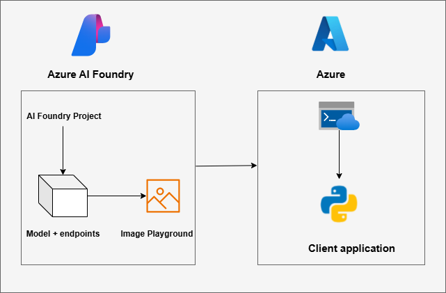
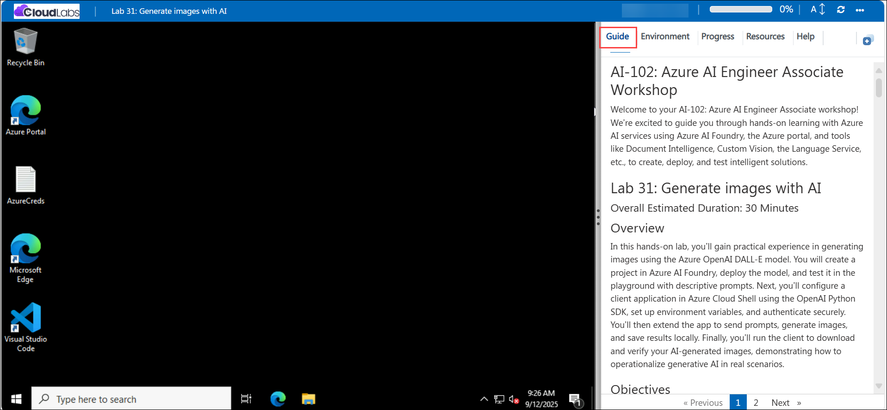

# AI-102: Azure AI Engineer Associate Workshop

Welcome to your AI-102: Azure AI Engineer Associate workshop! We’re excited to guide you through hands-on learning with Azure AI services using Azure AI Foundry, the Azure portal, and tools like Document Intelligence, Custom Vision, the Language Service, etc., to create, deploy, and test intelligent solutions.

# Lab 30: Generate images with AI

### Overall Estimated Duration: 30 Minutes

## Overview

In this hands-on lab, you’ll gain practical experience in generating images using the Azure OpenAI DALL-E model. You will create a project in Azure AI Foundry, deploy the model, and test it in the playground with descriptive prompts. Next, you’ll configure a client application in Azure Cloud Shell using the OpenAI Python SDK, set up environment variables, and authenticate securely. You’ll then extend the app to send prompts, generate images, and save results locally. Finally, you’ll run the client to download and verify your AI-generated images, demonstrating how to operationalize generative AI in real scenarios.

## Objectives

By the end of this lab, you will be able to:

1. **Create a project in Azure AI Foundry:** Deploy the DALL·E model within a workspace for image generation.

2. **Test the model in the playground:** Submit descriptive prompts and refine outputs interactively.

3. **Configure a client application in Cloud Shell:** Install dependencies, set environment variables, and authenticate with your deployment.

4. **Extend the application with code:** Use the OpenAI Python SDK to send prompts, generate images, and save them locally.

5. **Run and validate the client app:** Generate custom AI images, download the results, and verify successful end-to-end execution.

## Pre-requisites

* Basic understanding of **generative AI concepts**

* Experience using **Azure Cloud Shell** for running Python scripts and managing environments.

* Basic knowledge of **Python programming** and working in a terminal or shell environment.

## Architecture

The lab architecture demonstrates how Azure AI Foundry with Azure OpenAI enables text-to-image generation by combining model deployment, SDK integration, and client application development:

1. **Azure AI Foundry Project:** Provides a collaborative workspace to deploy the DALL·E model and manage model endpoints.

2. **Azure AI Foundry Portal:** Web interface to explore models, test prompts in the playground, and retrieve deployment details.

3. **Azure Cloud Shell:** Browser-based terminal used to install dependencies, configure environment variables, and run Python scripts.

4. **OpenAI Python SDK:** Provides programmatic access to the DALL·E model for sending prompts and retrieving generated images.

5. **Python Client Application:** A sample app that connects to the deployed model, generates images from prompts, and saves results locally for verification.

## Architecture Diagram

## Explanation of Components

1. **Azure AI Foundry Project:** The central workspace where you deploy the DALL-E model, manage endpoints, and prepare configurations needed for client applications.

2. **Deployed Model (DALL-E):** The generative AI model that transforms text prompts into images. It is hosted within the Foundry project and accessed via secure endpoints.

3. **Images Playground:** An interactive environment in the Foundry portal used to test prompts, view generated outputs, and capture configuration values (endpoint, API version, deployment name).

4. **Azure Cloud Shell:** Browser-based terminal used to install dependencies, clone the lab repo, manage the .env configuration, and run Python/SDK scripts end-to-end.

5. **OpenAI Python SDK:** A Python library that authenticates with the deployment, sends text prompts to the DALL·E model, and retrieves generated image URLs programmatically.

6. **Python Client Application:** A sample app built in Cloud Shell that calls the deployed model through the SDK, processes responses, downloads images, and saves them locally for verification.

# Getting Started with lab

Welcome to your AI-102: Azure AI Engineer Associate workshop! We’ve prepared an interactive environment for you to explore generative AI concepts and work with Microsoft Azure services like Azure AI Foundry, Document Intelligence, Custom Vision, Language Service, etc. Let’s get started and make the most of this hands-on experience.

## Accessing Your Lab Environment
 
Once you're ready to dive in, your virtual machine and **Guide** will be right at your fingertips within your web browser.
 

### Virtual Machine & Lab Guide
 
Your virtual machine is your workhorse throughout the workshop. The lab guide is your roadmap to success.

## Lab Guide Zoom In/Zoom Out
 
To adjust the zoom level for the environment page, click the **A↕: 100%** icon located next to the timer in the lab environment.

## Exploring Your Lab Resources
 
To get a better understanding of your lab resources and credentials, navigate to the **Environment** tab.
 

## Utilizing the Split Window Feature
 
For convenience, you can open the lab guide in a separate window by selecting the **Split Window** button from the top right corner.
 

## Lab Progress

You can use the **Progress** tab to track your progress while working on the lab. A score will be provided after successful validation.

## Managing Your Virtual Machine
 
Feel free to **Start, Restart, or Stop (2)** your virtual machine as needed from the **Resources (1)** tab. Your experience is in your hands!
 

## Let's Get Started with Azure Portal
 
1. On your virtual machine, click on the Azure Portal icon as shown below:
 
   

1. In the sign-in window, kindly sign in using the provided Azure credentials

    - **Email/Username:** <inject key="AzureAdUserEmail"></inject>

        

    - **Password:** <inject key="AzureAdUserPassword"></inject>

        

1. If prompted to **Stay signed in?**, you can click **No**.

    

1. If a **Welcome to Microsoft Azure** pop-up window appears, simply click **Cancel** to skip the tour.

    

## Support Contact
 
The CloudLabs support team is available 24/7, 365 days a year, via email and live chat to ensure seamless assistance at any time. We offer dedicated support channels explicitly tailored for both learners and instructors, ensuring that all your needs are promptly and efficiently addressed.
 
Learner Support Contacts:
 
- Email Support: cloudlabs-support@spektrasystems.com
- Live Chat Support: https://cloudlabs.ai/labs-support

Click on **Next** from the lower right corner to move on to the next page.

   

## Happy Learning !!