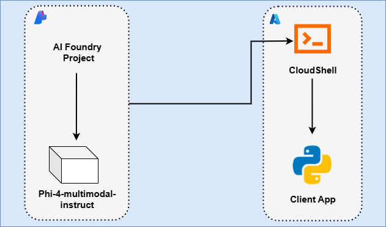
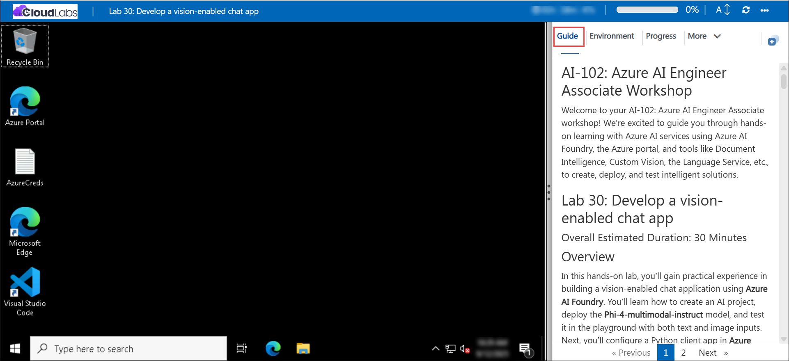

# AI-102: Azure AI Engineer Associate Workshop

Welcome to your AI-102: Azure AI Engineer Associate workshop! We’re excited to guide you through hands-on learning with Azure AI services using Azure AI Foundry, the Azure portal, and tools like Document Intelligence, Custom Vision, the Language Service, etc., to create, deploy, and test intelligent solutions.

# Lab 31: Develop a vision-enabled chat app

### Overall Estimated Duration: 30 Minutes

## Overview

In this hands-on lab, you’ll gain practical experience in building a vision-enabled chat application using Foundry. You’ll learn how to create an AI project, deploy the **gpt-4.1** model, and test it in the playground with both text and image inputs. Next, you’ll configure a Python client app, connect it to your deployed model, and extend it to handle image prompts from both URLs and local files. By the end, you’ll know how to create, deploy, and consume a multimodal AI model, and integrate it into a custom Python application. 

## Objectives

By the end of this lab, you will be able to:

1. **Create an AI project in Azure AI Foundry:** Set up a new project and deploy the **Phi-4-multimodal-instruct** model.

2. **Test the model in the playground:** Combine text and image inputs to review the model’s multimodal reasoning.

3. **Set up a Python client application:** Clone a GitHub repository in **Azure Cloud Shell**, install dependencies, and configure project details.

4. **Connect the client app to your project:** Use the SDK to initialize a project client and create a chat client for your deployed model.

5. **Submit URL-based image prompts:** Extend the app to send both text and image inputs from a web URL.

6. **Upload local image files:** Modify the app to encode and process images stored locally.

7. **Run and interact with the app:** Authenticate with Azure, execute the client app, and review multimodal responses from the model.

## Pre-requisites

* Basic understanding of **custom text analytics concepts**, including sentiment analysis, key phrase extraction, and named entity recognition.
* Familiarity with the **Azure portal**, including creating and managing Cognitive Services resources.
* Experience using **Azure Cloud Shell** or a local CLI for running commands and managing deployments.
* An active Azure subscription with permissions to create and use **Azure AI Language** resources.
* Basic knowledge of **JSON** for handling training data and API responses.
* Comfort with **REST APIs** or SDKs (such as Python or C#) to interact with Azure AI Language services.

## Architecture

The lab architecture demonstrates how **Azure AI Language** enables custom text analytics by combining resource creation, training workflows, and API integration:

1. **Language Studio:** A browser-based interface to create projects, define entity categories, label text samples, train models, and evaluate results.

2. **Azure Portal:** Manages the underlying **Azure AI Language resource** that powers training and prediction requests.

3. **Azure Cloud Shell:** Provides a ready-to-use environment for configuring resources, managing data, and running scripts without local setup.

4. **Azure AI Language REST API:** Offers secure endpoints to submit text for analysis, retrieve model predictions, and manage resources programmatically.

5. **Client Application (Python or C#):** Calls the REST API or SDK to integrate custom text analysis into real-world apps, using JSON responses for insights.

## Architecture Diagram

## Explanation of Components

1. **Language Studio:** Provides a web-based interface to create custom projects, define entity categories, label sample text, train models, and evaluate performance metrics.

2. **Azure Portal:** Manages the **Azure AI Language resource**, including configuration, access permissions, and monitoring of usage and costs.

3. **Azure Cloud Shell:** A browser-based terminal used to configure dependencies, run setup scripts, and interact with the Azure AI Language REST API.

4. **Azure AI Language REST API:** Exposes secure endpoints for submitting text, retrieving model predictions, and programmatically managing resources using authentication keys.

5. **Client Application (Python or C#):** Demonstrates how to consume the REST API or SDK, process JSON responses, and integrate custom text analytics into real-world applications.

# Getting Started with lab

Welcome to your AI-102: Azure AI Engineer Associate workshop! We’ve prepared an interactive environment for you to explore generative AI concepts and work with Microsoft Azure services like Azure AI Foundry, Document Intelligence, Custom Vision, Language Service, etc. Let’s get started and make the most of this hands-on experience.

## Accessing Your Lab Environment
 
Once you're ready to dive in, your virtual machine and **lab guide** will be right at your fingertips within your web browser.
 

### Virtual Machine & Lab Guide
 
Your virtual machine is your workhorse throughout the workshop. The lab guide is your roadmap to success.

## Lab Guide Zoom In/Zoom Out
 
To adjust the zoom level for the environment page, click the **A↕: 100%** icon located next to the timer in the lab environment.

## Exploring Your Lab Resources
 
To get a better understanding of your lab resources and credentials, navigate to the **Environment** tab.
 

## Utilizing the Split Window Feature
 
For convenience, you can open the lab guide in a separate window by selecting the **Split Window** button from the top right corner.
 

## Lab Progress

You can use the **Progress** tab to track your progress while working on the lab. A score will be provided after successful validation.

## Managing Your Virtual Machine
 
Feel free to **Start, Restart, or Stop (2)** your virtual machine as needed from the **Resources (1)** tab. Your experience is in your hands!
 

## Let's Get Started with Azure Portal
 
1. On your virtual machine, click on the Azure Portal icon as shown below:
 
   

1. In the sign-in window, kindly sign in using the provided Azure credentials

    - **Email/Username:** <inject key="AzureAdUserEmail"></inject>

        

    - **Password:** <inject key="AzureAdUserPassword"></inject>

        

1. If prompted to **Stay signed in?**, you can click **No**.

    

1. If a **Welcome to Microsoft Azure** pop-up window appears, simply click **Cancel** to skip the tour.

    

## Support Contact
 
The CloudLabs support team is available 24/7, 365 days a year, via email and live chat to ensure seamless assistance at any time. We offer dedicated support channels explicitly tailored for both learners and instructors, ensuring that all your needs are promptly and efficiently addressed.
 
Learner Support Contacts:
 
- Email Support: cloudlabs-support@spektrasystems.com
- Live Chat Support: https://cloudlabs.ai/labs-support

Click on **Next** from the lower right corner to move on to the next page.

   

## Happy Learning !!