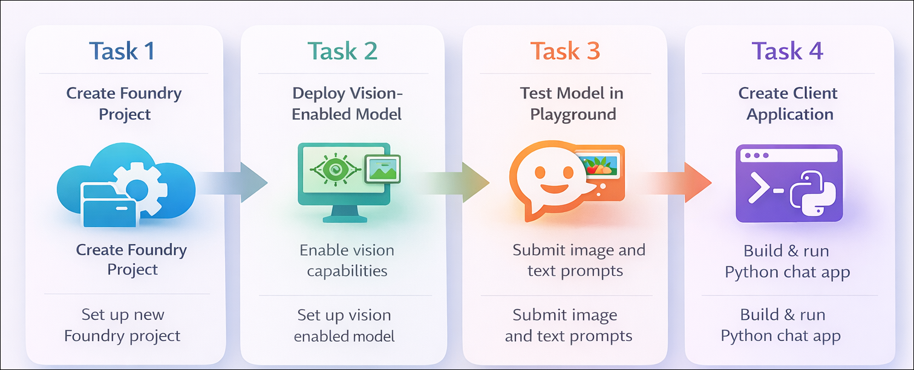

# Getting Started with your AI-102: Azure AI Engineer Associate Workshop

Welcome to your AI-102: Azure AI Engineer Associate workshop! We’re excited to guide you through hands-on learning with Azure AI services using Microsoft Foundry, the Azure portal, and tools like Document Intelligence, Custom Vision, the Language Service, etc., to create, deploy, and test intelligent solutions.

# Lab 31: Develop a vision-enabled chat app

### Overall Estimated Duration: 45 Minutes

## Overview

In this hands-on lab, you will gain practical experience in building a vision-enabled chat application using Azure AI in the Microsoft Foundry environment. You will learn how to create a Foundry project, deploy a multimodal generative AI model, and test its capabilities using image-based prompts in the playground. You will then set up and configure a Python application, authenticate using Azure credentials, and integrate it with the deployed model. By the end of this lab, you will be able to develop an application that processes both images and text to generate intelligent responses using vision-enabled generative AI.

## Objectives

By the end of this lab, you will be able to:

1. **Create a Microsoft Foundry project:** Set up a new project and configure the required Azure resources.

2. **Deploy a vision-enabled generative AI model:** Deploy the **gpt-4.1** model to handle both text and image inputs.

3. **Test the model in the playground:** Use image and text prompts to evaluate the model’s ability to generate relevant responses.

4. **Set up a Python client application:** Clone a GitHub repository, install dependencies, and configure the application environment.

5. **Connect the application to the deployed model:** Authenticate using Azure credentials and create a client to interact with the model.

6. **Submit image-based prompts:** Extend the application to send both URL-based and local image inputs along with text prompts.

## Pre-requisites

- Basic understanding of generative AI concepts and how models can process text and images.

- Familiarity with the Microsoft Foundry portal, including creating and managing projects.

- Experience using Visual Studio Code for editing and running Python applications.
An active Azure subscription with permissions to create and access required resources.

- Basic knowledge of Python programming, working with virtual environments, and running commands in a terminal.

## Architecture

The lab architecture demonstrates how a vision-enabled chat application is built using Azure AI Foundry by combining model deployment, SDK integration, and client application development:

1. **Microsoft Foundry Project:** Create a project that provides access to Azure AI resources, including the endpoint and deployed models required for the application.

2. **Generative AI Model (gpt-4.1):** Deploy a multimodal model capable of processing both text and image inputs to generate intelligent responses.

3. **Python Development Environment:** Configure a local development environment using Visual Studio Code to install dependencies and run the application.

4. **Azure OpenAI SDK Integration:** Use the Python SDK to authenticate with Azure, connect to the deployed model, and send text and image-based prompts.

5. **Python Client Application:** Build and modify a Python application that submits URL-based and local image inputs along with text prompts to receive and display responses from the model.

## Architecture Diagram

## Explanation of Components

1. **Microsoft Foundry Project:** Provides a centralized environment to manage Azure AI resources, including project configuration, endpoints, and access to deployed models.

2. **Generative AI Model (gpt-4.1):** A multimodal model that processes both text and image inputs to generate context-aware and intelligent responses.

3. **Visual Studio Code Environment:** A local development environment used to clone the repository, install dependencies, edit code, and run the Python application.

4. **Azure OpenAI SDK:** A Python SDK that enables authentication with Azure, connects to the deployed model, and sends requests with text and image inputs.

5. **Python Client Application:** A sample application that interacts with the deployed model by submitting prompts with URL-based or local images and displaying the generated responses.

## Accessing Your Lab Environment
 
Once you're ready to dive in, your virtual machine and **Guide** will be right at your fingertips within your web browser.
 

### Virtual Machine & Lab Guide
 
Your virtual machine is your workhorse throughout the workshop. The lab guide is your roadmap to success.

## Lab Guide Zoom In/Zoom Out
 
To adjust the zoom level for the environment page, click the **A↕: 100%** icon located next to the timer in the lab environment.

## Exploring Your Lab Resources
 
To get a better understanding of your lab resources and credentials, navigate to the **Environment** tab.
 

## Utilizing the Split Window Feature
 
For convenience, you can open the lab guide in a separate window by selecting the **Split Window** button from the top right corner.
 

## Lab Progress

You can use the **Progress** tab to track your progress while working on the lab. A score will be provided after successful validation.

## Managing Your Virtual Machine
 
Feel free to **Start, Restart, or Stop (2)** your virtual machine as needed from the **Resources (1)** tab. Your experience is in your hands!
 

## Let's Get Started with Azure Portal
 
1. On your virtual machine, click on the Azure Portal icon as shown below:
 
    

1. In the sign-in window, kindly sign in using the provided Azure credentials

    - **Email/Username:** <inject key="AzureAdUserEmail"></inject>

        

    - **Password:** <inject key="AzureAdUserPassword"></inject>

        

1. If prompted to **Stay signed in?**, you can click **No**.

    

1. If a **Welcome to Microsoft Azure** pop-up window appears, simply click **Maybe later** to skip the tour.

    

## Support Contact
 
The CloudLabs support team is available 24/7, 365 days a year, via email and live chat to ensure seamless assistance at any time. We offer dedicated support channels explicitly tailored for both learners and instructors, ensuring that all your needs are promptly and efficiently addressed.
 
Learner Support Contacts:
 
- Email Support: cloudlabs-support@spektrasystems.com
- Live Chat Support: https://cloudlabs.ai/labs-support

Click on **Next** from the lower right corner to move on to the next page.

   

## Happy Learning !!