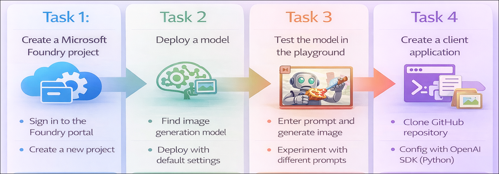

# AI-102: Azure AI Engineer Associate Workshop

Welcome to your AI-102: Azure AI Engineer Associate workshop! We’re excited to guide you through hands-on learning with Azure AI services using Microsoft Foundry, the Azure portal, and tools like Document Intelligence, Custom Vision, the Language Service, etc., to create, deploy, and test intelligent solutions.

# Lab 32: Generate images with AI

### Overall Estimated Duration: 30 Minutes

## Overview

In this hands-on lab, you’ll gain practical experience in generating images using **Microsoft Foundry** and an AI image generation model. You will learn how to sign in to the Foundry portal, create a project, and deploy an image generation model such as **FLUX.1-Kontext-pro**. You’ll then use the playground to generate images from prompts, experiment with different inputs, and refine outputs to better understand how the model responds.

Next, you’ll set up your development environment in **Visual Studio Code**, clone a sample repository, and configure your application using environment variables. Using Python and the **OpenAI SDK**, you’ll build a client application that sends prompts to the deployed model, retrieves base64-encoded image data, and saves the generated images locally. Finally, you’ll authenticate with Azure, run the application, and verify the generated outputs. By the end of this lab, you’ll be proficient in generating images using both the Foundry portal and programmatically through code.

## Objectives

By the end of this lab, you will be able to:

1. **Create a Microsoft Foundry project:** Sign in to the Foundry portal and provision a project with the required Azure resources.

2. **Deploy an image generation model:** Explore the model catalog, select an image generation model, and deploy it using default configurations.

3. **Generate images in the playground:** Use prompts in the playground to create and refine images, and understand how the model responds to different inputs.

4. **Set up a development environment:** Clone a GitHub repository, configure environment variables, and prepare a Python environment in Visual Studio Code.

5. **Build an image generation application:** Use the OpenAI Python SDK to send prompts to the deployed model and retrieve generated image data.

6. **Process and save generated images:** Decode base64 image data and store the generated images locally in your project directory.

7. **Run and test the application:** Authenticate with Azure, execute the application, and validate the generated outputs.

## Pre-requisites

* Basic understanding of **AI image generation concepts**, including prompts and model outputs.
* Familiarity with the **Microsoft Foundry portal**, including navigating and managing projects and resources.
* Experience using **Visual Studio Code** for editing code and working with extensions.
* An active Azure subscription with permissions to create and access **Microsoft Foundry** resources.
* Basic knowledge of **Python programming** and working with virtual environments.
* Understanding of **REST APIs and SDK usage**, particularly for interacting with AI services.
* General familiarity with **command-line tools** for running scripts and installing dependencies.

## Architecture

The lab architecture demonstrates how **Microsoft Foundry** enables AI-based image generation by combining model deployment, SDK integration, and client application development:

1. **Microsoft Foundry Portal:** A web-based interface to create projects, deploy models, and test image generation using the playground with prompt-based inputs.

2. **Image Generation Model (FLUX.1-Kontext-pro):** A deployed AI model that processes text prompts and generates corresponding images as output.

3. **Visual Studio Code Environment:** Provides a development workspace to clone the lab repository, configure files, and write Python code for the application.

4. **OpenAI Python SDK:** Enables programmatic interaction with the deployed model by sending prompts and receiving generated image data.

5. **Azure Identity & Authentication:** Uses Azure credentials to securely authenticate and access the Foundry resource and deployed model.

6. **Python Client Application:** A custom script that accepts user prompts, calls the image generation model, decodes the base64 response, and saves images locally.

7. **Local File System (Images Folder):** Stores the generated images, allowing users to view and validate outputs outside the application.

## Architecture Diagram

## Explanation of Components

1. **Microsoft Foundry Portal:** Provides a web-based environment to create projects, deploy image generation models, and test prompts using the built-in playground.

2. **Image Generation Model (FLUX.1-Kontext-pro):** A foundation model that processes text prompts and generates corresponding images, returning the output as base64-encoded data.

3. **Visual Studio Code:** A development environment used to clone the lab repository, edit configuration files, and write and run the Python application.

4. **OpenAI Python SDK:** Enables communication with the deployed model by sending prompts and receiving generated image responses programmatically.

5. **Azure Identity & Authentication:** Uses Azure credentials to securely authenticate and authorize access to the Foundry resource and model endpoints.

6. **Python Client Application:** A script that accepts user prompts, calls the image generation API, processes the response, and saves the generated images locally.

7. **Local Images Folder:** Stores the generated images in `.png` format, allowing users to view and verify outputs directly from the file system.

# Getting Started with lab

Welcome to your AI-102: Azure AI Engineer Associate workshop! We’ve prepared an interactive environment for you to explore generative AI concepts and work with Microsoft Azure services like Microsoft Foundry, Document Intelligence, Custom Vision, Language Service, etc. Let’s get started and make the most of this hands-on experience.

## Accessing Your Lab Environment
 
Once you're ready to dive in, your virtual machine and **lab guide** will be right at your fingertips within your web browser.
 

### Virtual Machine & Lab Guide
 
Your virtual machine is your workhorse throughout the workshop. The lab guide is your roadmap to success.

## Lab Guide Zoom In/Zoom Out
 
To adjust the zoom level for the environment page, click the **A↕: 100%** icon located next to the timer in the lab environment.

## Exploring Your Lab Resources
 
To get a better understanding of your lab resources and credentials, navigate to the **Environment** tab.
 

## Utilizing the Split Window Feature
 
For convenience, you can open the lab guide in a separate window by selecting the **Split Window** button from the top right corner.
 

## Lab Progress

You can use the **Progress** tab to track your progress while working on the lab. A score will be provided after successful validation.

## Managing Your Virtual Machine
 
Feel free to **Start, Restart, or Stop (2)** your virtual machine as needed from the **Resources (1)** tab. Your experience is in your hands!
 

## Let's Get Started with Azure Portal
 
1. On your virtual machine, click on the Azure Portal icon as shown below:
 
   

1. In the sign-in window, kindly sign in using the provided Azure credentials

    - **Email/Username:** <inject key="AzureAdUserEmail"></inject>

        

    - **Password:** <inject key="AzureAdUserPassword"></inject>

        

1. If prompted to **Stay signed in?**, you can click **No**.

    

1. If a **Welcome to Microsoft Azure** pop-up window appears, simply click **Cancel** to skip the tour.

    

## Support Contact
 
The CloudLabs support team is available 24/7, 365 days a year, via email and live chat to ensure seamless assistance at any time. We offer dedicated support channels explicitly tailored for both learners and instructors, ensuring that all your needs are promptly and efficiently addressed.
 
Learner Support Contacts:
 
- Email Support: cloudlabs-support@spektrasystems.com
- Live Chat Support: https://cloudlabs.ai/labs-support

Click on **Next** from the lower right corner to move on to the next page.

   

## Happy Learning !!