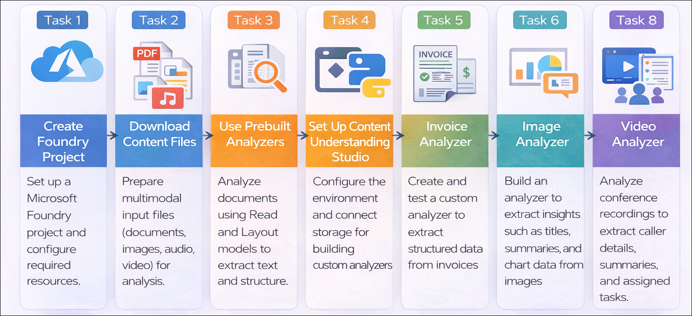
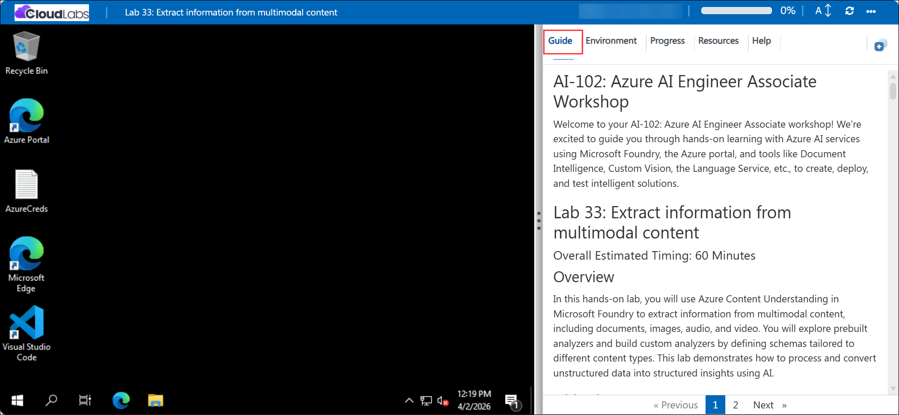

# Getting Started with your AI-102: Azure AI Engineer Associate Workshop

Welcome to your AI-102: Azure AI Engineer Associate workshop! We’re excited to guide you through hands-on learning with Azure AI services using Microsoft Foundry, the Azure portal, and tools like Document Intelligence, Custom Vision, the Language Service, etc., to create, deploy, and test intelligent solutions.

# Lab 33: Extract information from multimodal content

### Overall Estimated Timing: 60 Minutes

## Overview

In this hands-on lab, you will use Azure Content Understanding in Microsoft Foundry to extract information from multimodal content, including documents, images, audio, and video. You will explore prebuilt analyzers and build custom analyzers by defining schemas tailored to different content types. This lab demonstrates how to process and convert unstructured data into structured insights using AI.

## Objectives

By the end of this lab, you will be able to:

1. **Create and configure a Foundry project:** Set up a new project in Microsoft Foundry to work with Azure Content Understanding services.

2. **Explore prebuilt analyzers:** Use Read and Layout analyzers to extract text and structural information from documents.

3. **Build custom analyzers for documents and images:** Define schemas and extract structured data from invoices and slide images.

4. **Process audio and video content:** Create analyzers to extract key insights such as summaries, participants, and actions from voicemail recordings and video files.

5. **Test and validate analyzers:** Run and verify analyzers on different content types to ensure accurate information extraction.

## Pre-requisites
  
* Familiarity with Microsoft Foundry concepts such as projects and AI services.
* Basic understanding of Azure Content Understanding or document analysis concepts.

## Architecture

The lab architecture demonstrates how a Microsoft Foundry project integrates Azure Content Understanding services to analyze and extract structured information from multimodal content such as documents, images, audio, and video:

1. **Microsoft Foundry Project:** A centralized workspace in the Microsoft Foundry portal where AI services and Content Understanding capabilities are configured and managed.

2. **Prebuilt Analyzers (Read & Layout):** Built-in models that extract text, document structure, tables, and layout information from files without requiring custom configuration.

3. **Content Understanding Studio:** A platform used to create, manage, and test custom analyzers by defining schemas for specific content types.

4. **Custom Analyzers:** User-defined analyzers that extract structured fields from invoices, images, audio recordings, and video files based on defined schemas.

5. **Azure Blob Storage:** A storage service used to upload and manage content files that are analyzed and processed by Content Understanding services.

6. **Multimodal Input Files:** Various content types (PDFs, images, audio, and video) that are processed to extract meaningful insights and structured data.

## Architecture Diagram

## Explanation of Components

1. **Microsoft Foundry Project:** The central workspace where Azure Content Understanding services are configured and managed for analyzing multimodal content.

2. **Prebuilt Analyzers (Read & Layout):** Built-in models that extract text, layout, tables, and structural elements from documents without requiring custom setup.

3. **Content Understanding Studio:** A platform used to create, manage, and test custom analyzers by defining schemas for specific content types.

4. **Custom Analyzers:** AI-powered analyzers created by defining schemas to extract structured information from invoices, images, audio recordings, and video files.

5. **Azure Blob Storage:** The storage service used to upload and manage content files that are processed by the analyzers.

6. **Multimodal Content Inputs:** Various file types such as PDFs, images, audio, and video that are analyzed to extract meaningful insights and structured data.

## Accessing Your Lab Environment
 
Once you're ready to dive in, your virtual machine and **Guide** will be right at your fingertips within your web browser.
 

## Virtual Machine & Lab Guide
 
Your virtual machine is your workhorse throughout the workshop. The lab guide is your roadmap to success.

## Exploring Your Lab Resources
 
To get a better understanding of your lab resources and credentials, navigate to the **Environment** tab.
 

## Managing Your Virtual Machine
 
Feel free to **Start, Restart, or Stop (2)** your virtual machine as needed from the **Resources (1)** tab. Your experience is in your hands!
 

## Lab Progress

You can use the **Progress** tab to track your progress while working on the lab. A score will be provided after successful validation.

## Utilizing the Split Window Feature
 
For convenience, you can open the lab guide in a separate window by selecting the **Split Window** button from the top right corner.
 

## Lab Guide Zoom In/Zoom Out
 
To adjust the zoom level for the environment page, click the **A↕: 100%** icon located next to the timer in the lab environment.

## Let's Get Started with Azure Portal
 
1. On your virtual machine, click on the Azure Portal icon as shown below:
 
    

1. In the sign-in window, kindly sign in using the provided Azure credentials

    - **Email/Username:** <inject key="AzureAdUserEmail"></inject>

        

    - **Password:** <inject key="AzureAdUserPassword"></inject>

        

1. If prompted to **Stay signed in?**, you can click **No**.

    

1. If a **Welcome to Microsoft Azure** pop-up window appears, simply click **Maybe later** to skip the tour.

    

## Support Contact
 
The CloudLabs support team is available 24/7, 365 days a year, via email and live chat to ensure seamless assistance at any time. We offer dedicated support channels explicitly tailored for both learners and instructors, ensuring that all your needs are promptly and efficiently addressed.
 
Learner Support Contacts:
 
- Email Support: cloudlabs-support@spektrasystems.com
- Live Chat Support: https://cloudlabs.ai/labs-support

Click on **Next** from the lower right corner to move on to the next page.

   

## Happy Learning !!