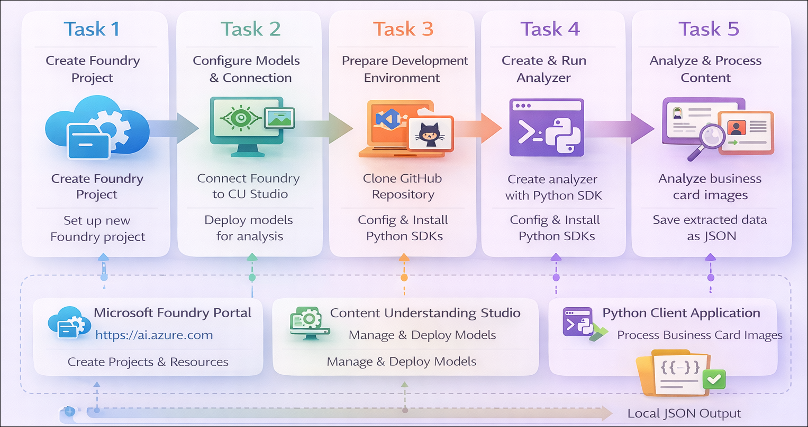

# Getting Started with your AI-102: Azure AI Engineer Associate Workshop

Welcome to your AI-102: Azure AI Engineer Associate workshop! We’re excited to guide you through hands-on learning with Azure AI services using Microsoft Foundry, the Azure portal, and tools like Document Intelligence, Custom Vision, the Language Service, etc., to create, deploy, and test intelligent solutions.

# Lab 34: Develop a Content Understanding client application

### Overall Estimated Duration: 30 Minutes

## Overview

In this hands-on lab, you’ll gain practical experience in building a Content Understanding solution using **Microsoft Foundry**. You will learn how to sign in to the Foundry portal, create a project, and configure resources required for content analysis. You’ll also connect your project to **Content Understanding Studio** to deploy the necessary models used for extracting information from documents and images.

Next, you’ll set up your development environment in **Visual Studio Code**, clone a sample repository, and configure your application using environment variables. Using Python and the **Azure Content Understanding SDK**, you’ll create an analyzer based on a predefined schema and use it to process business card images. Finally, you’ll authenticate with Azure, run the application, and extract structured data such as names, titles, emails, and phone numbers. By the end of this lab, you’ll be proficient in analyzing content using both the Foundry tools and programmatically through code.

## Objectives

By the end of this lab, you will be able to:

1. **Create a Microsoft Foundry resource and project:** Sign in to the Foundry portal and provision a project with the required Azure resources.

2. **Configure Content Understanding models and connection:** Connect your Foundry resource to Content Understanding Studio and deploy the required models for analysis.

3. **Set up a development environment:** Clone a GitHub repository, configure environment variables, and prepare a Python environment in Visual Studio Code.

4. **Create an analyzer using the Python SDK:** Define and implement an analyzer schema to extract structured data from business card images.

5. **Analyze content using the Python SDK:** Use the analyzer to process images, extract key information, and retrieve structured results programmatically.

6. **Process and store analysis results:** Save the extracted data in JSON format and interpret the returned fields.

7. **Run and test the application:** Authenticate with Azure, execute the application, and validate the extracted outputs from different input images.

## Pre-requisites

* Basic understanding of **content understanding concepts**, including extracting structured data from documents and images.
* Familiarity with the **Microsoft Foundry portal**, including creating and managing projects and resources.
* Experience using **Visual Studio Code** for editing code and managing extensions.
* An active Azure subscription with permissions to create and access **Microsoft Foundry** and related AI services.
* Basic knowledge of **Python programming** and working with virtual environments.
* Understanding of **SDK usage**, particularly for interacting with Azure AI services.
* General familiarity with **command-line tools** for running scripts, installing dependencies, and authenticating with Azure.

## Architecture

The lab architecture demonstrates how **Microsoft Foundry** enables content understanding by combining model deployment, SDK integration, and client application development:

1. **Microsoft Foundry Portal:** A web-based interface to create projects, manage resources, and access endpoints required for content understanding solutions.

2. **Content Understanding Studio:** A specialized interface used to configure connections, deploy required models, and manage analyzers for extracting structured data.

3. **Content Understanding Models:** AI models that process documents and images (such as business cards) to extract structured information based on defined schemas.

4. **Visual Studio Code Environment:** Provides a development workspace to clone the lab repository, configure files, and write Python code for the application.

5. **Azure Content Understanding SDK (Python):** Enables programmatic interaction with the service by creating analyzers and submitting content for analysis.

6. **Azure Identity & Authentication:** Uses Azure credentials to securely authenticate and access the Foundry resource and Content Understanding services.

7. **Python Client Application:** A custom script that creates analyzers, processes input images, and retrieves structured outputs such as names, emails, and phone numbers.

8. **Local File System (Results Output):** Stores the generated results (such as JSON files), allowing users to review and validate extracted information.

## Architecture Diagram

## Explanation of Components

1. **Microsoft Foundry Portal:** Provides a web-based environment to create projects, manage resources, and access endpoints required for building content understanding solutions.

2. **Content Understanding Studio:** A dedicated interface used to connect resources, deploy required models, and configure analyzers for extracting structured data from documents and images.

3. **Content Understanding Models:** AI models that analyze input content (such as business cards) and extract structured information based on predefined schemas.

4. **Visual Studio Code:** A development environment used to clone the lab repository, edit configuration files, and write and run the Python application.

5. **Azure Content Understanding SDK (Python):** Enables communication with the service by creating analyzers, submitting content for analysis, and retrieving structured results programmatically.

6. **Azure Identity & Authentication:** Uses Azure credentials to securely authenticate and authorize access to the Foundry resource and Content Understanding services.

7. **Python Client Application:** A script that creates analyzers, processes input images, and extracts structured data such as names, titles, emails, and phone numbers.

8. **Local Output Files (JSON):** Stores the analysis results in `.json` format, allowing users to review and validate the extracted information.

## Accessing Your Lab Environment
 
Once you're ready to dive in, your virtual machine and **lab guide** will be right at your fingertips within your web browser.
 

## Virtual Machine & Lab Guide
 
Your virtual machine is your workhorse throughout the workshop. The lab guide is your roadmap to success.

## Lab Guide Zoom In/Zoom Out
 
To adjust the zoom level for the environment page, click the **A↕: 100%** icon located next to the timer in the lab environment.

## Exploring Your Lab Resources
 
To get a better understanding of your lab resources and credentials, navigate to the **Environment** tab.
 

## Utilizing the Split Window Feature
 
For convenience, you can open the lab guide in a separate window by selecting the **Split Window** button from the top right corner.
 

## Lab Progress

You can use the **Progress** tab to track your progress while working on the lab. A score will be provided after successful validation.

## Managing Your Virtual Machine
 
Feel free to **Start, Restart, or Stop (2)** your virtual machine as needed from the **Resources (1)** tab. Your experience is in your hands!
 

## Let's Get Started with Azure Portal
 
1. On your virtual machine, click on the Azure Portal icon as shown below:
 
    

1. In the sign-in window, kindly sign in using the provided Azure credentials

    - **Email/Username:** <inject key="AzureAdUserEmail"></inject>

        

    - **Password:** <inject key="AzureAdUserPassword"></inject>

        

1. If prompted to **Stay signed in?**, you can click **No**.

    

1. If a **Welcome to Microsoft Azure** pop-up window appears, simply click **Cancel** to skip the tour.

    

## Support Contact
 
The CloudLabs support team is available 24/7, 365 days a year, via email and live chat to ensure seamless assistance at any time. We offer dedicated support channels explicitly tailored for both learners and instructors, ensuring that all your needs are promptly and efficiently addressed.
 
Learner Support Contacts:
 
- Email Support: cloudlabs-support@spektrasystems.com
- Live Chat Support: https://cloudlabs.ai/labs-support

Click on **Next** from the lower right corner to move on to the next page.

   

## Happy Learning !!