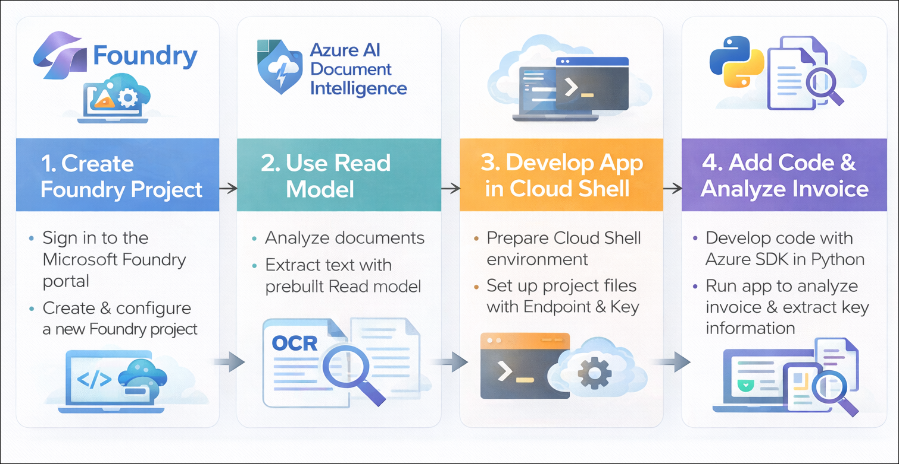
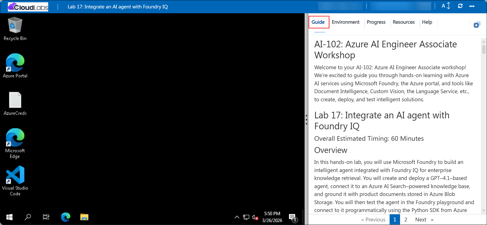

# AI-102: Azure AI Engineer Associate Workshop

Welcome to your AI-102: Azure AI Engineer Associate workshop! We’re excited to guide you through hands-on learning with Azure AI services using Microsoft Foundry, the Azure portal, and tools like Document Intelligence, Custom Vision, the Language Service, etc., to create, deploy, and test intelligent solutions.

# Lab 35: Analyze forms with prebuilt Azure AI Document Intelligence models

### Overall Estimated Timing: 45 Minutes

## Overview

In this hands-on lab, you will use Microsoft Foundry to set up an environment for document analysis using Azure AI Document Intelligence. You will analyze documents using the prebuilt Read model to extract text and review structured results in the portal. You will then connect to the service programmatically using the Python SDK from Azure Cloud Shell to process invoices and retrieve key information.

## Objectives

By the end of this lab, you will be able to:

1. **Create and configure a Microsoft Foundry project:** Set up a new project with the required Azure AI resources for document analysis.

2. **Analyze documents using the Read model:** Use the prebuilt Read model in the portal to extract and review text from documents.

3. **Prepare a development environment in Cloud Shell:** Set up Azure Cloud Shell, clone the repository, and configure environment variables.

4. **Implement document analysis using Python SDK:** Add code to connect to Azure Document Intelligence and analyze documents programmatically.

5. **Extract and interpret key information from documents:** Retrieve and display important fields such as vendor name, customer name, and invoice total with confidence scores.

## Pre-requisites
  
* Familiarity with Microsoft Foundry concepts such as projects and resources.  
* Basic understanding of Azure AI Document Intelligence and its use for document analysis.
* Basic knowledge of Python and running scripts from a command-line environment.   

## Architecture

The lab architecture demonstrates how a Microsoft Foundry project integrates Azure AI Document Intelligence with a Python application to analyze and extract information from documents:

1. **Microsoft Foundry Project:** A centralized workspace where Azure AI resources are created, configured, and managed for document analysis.

2. **Azure AI Document Intelligence Service:** The core service that processes documents using prebuilt models like the Read model to extract text and structured data.

3. **Read (OCR) Model:** A prebuilt model used to analyze documents and extract printed or handwritten text in multiple languages.

4. **Azure Cloud Shell:** A browser-based development environment used to configure the project, install dependencies, and run Python code.

5. **Python Client Application:** A script that connects to the Document Intelligence service using endpoint and API key, submits documents for analysis, and retrieves key information such as invoice details.

## Architecture Diagram

## Explanation of Components

1. **Microsoft Foundry Project:** The central workspace where Azure AI resources are created and managed for document analysis tasks.

2. **Azure AI Document Intelligence Service:** The core service that processes documents and extracts text and structured data using prebuilt models.

3. **Read (OCR) Model:** A prebuilt model used to analyze documents and extract multilingual text content with high accuracy.

4. **Azure Cloud Shell:** A browser-based environment used to configure the project, install required libraries, and run Python scripts.

5. **Python Client Application:** A script that connects to the Document Intelligence service, submits documents for analysis, and retrieves key details such as vendor name, customer name, and invoice total.

# Getting Started with lab

Welcome to your AI-102: Azure AI Engineer Associate workshop! We’ve prepared an interactive environment for you to explore generative AI concepts and work with Microsoft Azure services like Microsoft Foundry, Document Intelligence, Custom Vision, Language Service, etc. Let’s get started and make the most of this hands-on experience.

## Accessing Your Lab Environment
 
Once you're ready to dive in, your virtual machine and **Guide** will be right at your fingertips within your web browser.
 

### Virtual Machine & Lab Guide
 
Your virtual machine is your workhorse throughout the workshop. The lab guide is your roadmap to success.

## Exploring Your Lab Resources
 
To get a better understanding of your lab resources and credentials, navigate to the **Environment** tab.
 

## Managing Your Virtual Machine
 
Feel free to **Start, Restart, or Stop (2)** your virtual machine as needed from the **Resources (1)** tab. Your experience is in your hands!
 

## Lab Progress

You can use the **Progress** tab to track your progress while working on the lab. A score will be provided after successful validation.

## Utilizing the Split Window Feature
 
For convenience, you can open the lab guide in a separate window by selecting the **Split Window** button from the top right corner.
 

## Lab Guide Zoom In/Zoom Out
 
To adjust the zoom level for the environment page, click the **A↕: 100%** icon located next to the timer in the lab environment.

## Let's Get Started with Azure Portal
 
1. On your virtual machine, click on the Azure Portal icon as shown below:
 
    

1. In the sign-in window, kindly sign in using the provided Azure credentials

    - **Email/Username:** <inject key="AzureAdUserEmail"></inject>

        

    - **Password:** <inject key="AzureAdUserPassword"></inject>

        

1. If prompted to **Stay signed in?**, you can click **No**.

    

1. If a **Welcome to Microsoft Azure** pop-up window appears, simply click **Maybe later** to skip the tour.

    

## Support Contact
 
The CloudLabs support team is available 24/7, 365 days a year, via email and live chat to ensure seamless assistance at any time. We offer dedicated support channels explicitly tailored for both learners and instructors, ensuring that all your needs are promptly and efficiently addressed.
 
Learner Support Contacts:
 
- Email Support: cloudlabs-support@spektrasystems.com
- Live Chat Support: https://cloudlabs.ai/labs-support

Click on **Next** from the lower right corner to move on to the next page.

   

## Happy Learning !!
