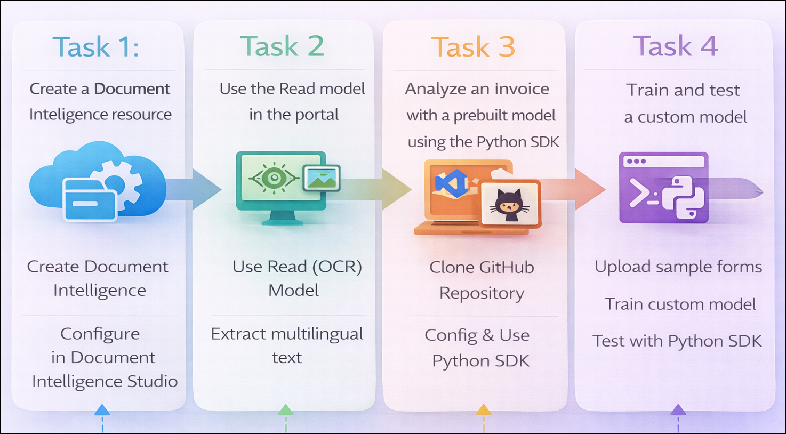

# Getting Started with your AI-102: Azure AI Engineer Associate Workshop

Welcome to your AI-102: Azure AI Engineer Associate workshop! We’re excited to guide you through hands-on learning with Azure AI services using Microsoft Foundry, the Azure portal, and tools like Document Intelligence, Custom Vision, the Language Service, etc., to create, deploy, and test intelligent solutions.

# Lab 36: Extract data with Azure Document Intelligence

### Overall Estimated Duration: 1 Hour

## Overview

In this hands-on lab, you’ll gain practical experience in building a document processing solution using **Azure Document Intelligence**. You will learn how to create and configure a Document Intelligence resource and use **Document Intelligence Studio** to explore and analyze documents using prebuilt models like the Read (OCR) model for multilingual text extraction.

Next, you’ll set up your development environment in **Visual Studio Code**, clone a sample repository, and configure your application using environment variables. Using Python and the **Azure Document Intelligence SDK**, you’ll analyze invoices with a prebuilt model to extract key details such as vendor name, customer name, and totals.

Finally, you’ll create and train a **custom extraction model** using your own dataset in Document Intelligence Studio, and test it programmatically using Python to extract specific fields from documents. By the end of this lab, you’ll be proficient in using both the studio interface and code to build document intelligence solutions.

## Objectives

By the end of this lab, you will be able to:

1. **Create a Document Intelligence resource:** Provision and configure an Azure Document Intelligence resource using Document Intelligence Studio.

2. **Analyze documents using the Read model:** Use the Read (OCR) model in the Studio to extract multilingual text and detect language from documents.

3. **Set up a development environment:** Clone a GitHub repository, configure environment variables, and prepare a Python environment in Visual Studio Code.

4. **Analyze invoices using a prebuilt model:** Use the Azure Document Intelligence Python SDK to extract key fields such as vendor name, customer name, and totals from invoices.

5. **Prepare training data for custom models:** Create and configure a storage account and upload sample forms for model training.

6. **Train a custom extraction model:** Use Document Intelligence Studio to train a model tailored to extract specific fields from your documents.

7. **Test the custom model programmatically:** Run a Python application to analyze documents using the custom model and retrieve structured data.

## Pre-requisites

* Basic understanding of **document processing concepts**, including extracting text and structured data from forms and images.
* Familiarity with the **Azure portal**, including creating and managing resources.
* Experience using **Visual Studio Code** for editing code and managing extensions.
* An active Azure subscription with permissions to create and access **Azure AI services**, including Document Intelligence.
* Basic knowledge of **Python programming** and working with virtual environments.
* Understanding of **SDK usage**, particularly for interacting with Azure AI services.
* General familiarity with **command-line tools** for running scripts, installing dependencies, and authenticating with Azure.

## Architecture

The lab architecture demonstrates how **Azure Document Intelligence** enables document processing by combining resource configuration, model usage, SDK integration, and client application development:

1. **Azure Portal / Document Intelligence Studio:** Web-based interfaces used to create resources, manage configurations, and analyze documents using prebuilt and custom models.

2. **Document Intelligence Models:** Prebuilt models (such as Read and Invoice) and custom-trained models that extract text, key/value pairs, and structured data from documents.

3. **Azure Storage Account:** Stores training data (sample forms) used for building custom Document Intelligence models.

4. **Visual Studio Code Environment:** Provides a development workspace to clone the lab repository, configure files, and write Python code.

5. **Azure Document Intelligence SDK (Python):** Enables programmatic interaction with the service to analyze documents and retrieve structured data.

6. **Azure Identity & Authentication:** Uses Azure credentials to securely authenticate and access Document Intelligence resources.

7. **Python Client Application:** Custom scripts that submit documents for analysis and extract key information such as vendor details, totals, and custom fields.

8. **Output (Console/JSON Results):** Displays or stores extracted data, allowing users to review and validate the results.

## Architecture Diagram

## Explanation of Components

1. **Azure Portal / Document Intelligence Studio:** Provides web-based interfaces to create resources, manage configurations, and analyze documents using prebuilt and custom models.

2. **Document Intelligence Models:** AI models (such as Read and Invoice) that process documents to extract text, key/value pairs, and structured data based on document type or custom training.

3. **Azure Storage Account:** Hosts training data (sample forms) used for building and training custom Document Intelligence models.

4. **Visual Studio Code:** A development environment used to clone the lab repository, edit configuration files, and write and run Python code.

5. **Azure Document Intelligence SDK (Python):** Enables communication with the service by submitting documents for analysis and retrieving structured results programmatically.

6. **Azure Identity & Authentication:** Uses Azure credentials to securely authenticate and authorize access to Document Intelligence resources.

7. **Python Client Application:** A script that analyzes documents using prebuilt or custom models and extracts key information such as vendor details, totals, and other fields.

8. **Output (Console/JSON Results):** Displays or stores the extracted data, allowing users to review and validate the analysis results.

## Accessing Your Lab Environment
 
Once you're ready to dive in, your virtual machine and **lab guide** will be right at your fingertips within your web browser.
 

## Virtual Machine & Lab Guide
 
Your virtual machine is your workhorse throughout the workshop. The lab guide is your roadmap to success.

## Lab Guide Zoom In/Zoom Out
 
To adjust the zoom level for the environment page, click the **A↕: 100%** icon located next to the timer in the lab environment.

## Exploring Your Lab Resources
 
To get a better understanding of your lab resources and credentials, navigate to the **Environment** tab.
 

## Utilizing the Split Window Feature
 
For convenience, you can open the lab guide in a separate window by selecting the **Split Window** button from the top right corner.
 

## Lab Progress

You can use the **Progress** tab to track your progress while working on the lab. A score will be provided after successful validation.

## Managing Your Virtual Machine
 
Feel free to **Start, Restart, or Stop (2)** your virtual machine as needed from the **Resources (1)** tab. Your experience is in your hands!
 

## Let's Get Started with Azure Portal
 
1. On your virtual machine, click on the Azure Portal icon as shown below:
 
    

1. In the sign-in window, kindly sign in using the provided Azure credentials

    - **Email/Username:** <inject key="AzureAdUserEmail"></inject>

        

    - **Password:** <inject key="AzureAdUserPassword"></inject>

        

1. If prompted to **Stay signed in?**, you can click **No**.

    

1. If a **Welcome to Microsoft Azure** pop-up window appears, simply click **Cancel** to skip the tour.

    

## Support Contact
 
The CloudLabs support team is available 24/7, 365 days a year, via email and live chat to ensure seamless assistance at any time. We offer dedicated support channels explicitly tailored for both learners and instructors, ensuring that all your needs are promptly and efficiently addressed.
 
Learner Support Contacts:
 
- Email Support: cloudlabs-support@spektrasystems.com
- Live Chat Support: https://cloudlabs.ai/labs-support

Click on **Next** from the lower right corner to move on to the next page.

   

## Happy Learning !!