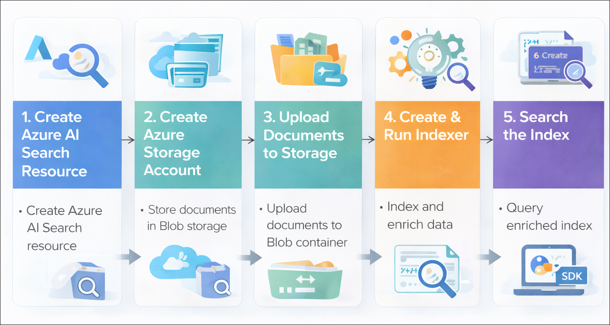
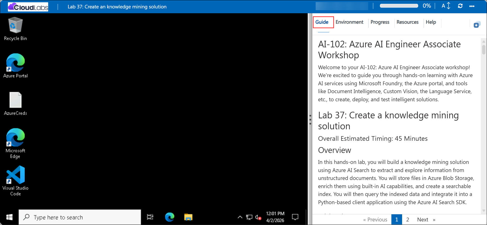

# AI-102: Azure AI Engineer Associate Workshop

Welcome to your AI-102: Azure AI Engineer Associate workshop! We’re excited to guide you through hands-on learning with Azure AI services using Microsoft Foundry, the Azure portal, and tools like Document Intelligence, Custom Vision, the Language Service, etc., to create, deploy, and test intelligent solutions.

# Lab 37: Create a knowledge mining solution

### Overall Estimated Timing: 45 Minutes

## Overview

In this hands-on lab, you will build a knowledge mining solution using Azure AI Search to extract and explore information from unstructured documents. You will store files in Azure Blob Storage, enrich them using built-in AI capabilities, and create a searchable index. You will then query the indexed data and integrate it into a Python-based client application using the Azure AI Search SDK.

## Objectives

By the end of this lab, you will be able to:

1. **Create and configure Azure AI Search:** Set up an Azure AI Search resource to enable indexing and querying of unstructured data.

2. **Prepare and manage data storage:** Create an Azure Storage account and upload documents to a Blob container for processing.

3. **Build a knowledge mining pipeline:** Configure and run an indexer with AI enrichments to extract key information such as phrases, entities, and locations.

4. **Query and explore indexed data:** Use the Search explorer to perform queries and analyze enriched search results.

5. **Develop a search client application:** Configure and run a Python application using the Azure AI Search SDK to retrieve and display search results 

## Pre-requisites
  
* Basic knowledge of the Azure portal and Azure Cloud Shell.  
* Basic understanding of Azure AI Search and Azure Blob Storage.  
* Basic knowledge of Python and running scripts from a command-line environment.   

## Architecture

The lab architecture demonstrates how Azure AI Search integrates with Azure Blob Storage and AI enrichment capabilities to enable intelligent knowledge mining and search-driven applications:

1. **Azure AI Search Resource:** A managed search service used to create indexes, indexers, and skillsets for extracting, enriching, and querying data from documents.

2. **Azure Blob Storage:** A cloud storage service that stores unstructured documents (PDFs) which serve as the data source for indexing and knowledge extraction.

3. **Indexer and Skillset:** The indexer connects to the storage account and processes documents, while the skillset applies AI enrichments such as key phrase extraction, entity recognition, and image text analysis.

4. **Search Index:** A structured representation of the extracted and enriched data, enabling efficient full-text search and filtering capabilities.

5. **Python Client Application:** A client application that connects to the Azure AI Search endpoint using the SDK, submits search queries, and retrieves relevant results programmatically.

## Architecture Diagram

## Explanation of Components

1. **Azure AI Search Resource:** The core service that enables indexing, enrichment, and querying of unstructured data through a scalable search solution.

2. **Azure Blob Storage:** The storage layer that holds the source documents (PDF files) which are processed and indexed for knowledge mining.

3. **Indexer and Skillset:** The processing components that extract content from documents and apply AI enrichments such as key phrase extraction, entity recognition, and image text analysis.

4. **Search Index:** The structured data store created from extracted and enriched content, enabling efficient search, filtering, and retrieval operations.

5. **Python Client Application:** A Cloud Shell–based application that connects to the search service using the SDK, sends search queries, and displays relevant results programmatically.

# Getting Started with lab

Welcome to your AI-102: Azure AI Engineer Associate workshop! We’ve prepared an interactive environment for you to explore generative AI concepts and work with Microsoft Azure services like Microsoft Foundry, Document Intelligence, Custom Vision, Language Service, etc. Let’s get started and make the most of this hands-on experience.

## Accessing Your Lab Environment
 
Once you're ready to dive in, your virtual machine and **Guide** will be right at your fingertips within your web browser.
 

### Virtual Machine & Lab Guide
 
Your virtual machine is your workhorse throughout the workshop. The lab guide is your roadmap to success.

## Exploring Your Lab Resources
 
To get a better understanding of your lab resources and credentials, navigate to the **Environment** tab.
 

## Managing Your Virtual Machine
 
Feel free to **Start, Restart, or Stop (2)** your virtual machine as needed from the **Resources (1)** tab. Your experience is in your hands!
 

## Lab Progress

You can use the **Progress** tab to track your progress while working on the lab. A score will be provided after successful validation.

## Utilizing the Split Window Feature
 
For convenience, you can open the lab guide in a separate window by selecting the **Split Window** button from the top right corner.
 

## Lab Guide Zoom In/Zoom Out
 
To adjust the zoom level for the environment page, click the **A↕: 100%** icon located next to the timer in the lab environment.

## Let's Get Started with Azure Portal
 
1. On your virtual machine, click on the Azure Portal icon as shown below:
 
    

1. In the sign-in window, kindly sign in using the provided Azure credentials

    - **Email/Username:** <inject key="AzureAdUserEmail"></inject>

        

    - **Password:** <inject key="AzureAdUserPassword"></inject>

        

1. If prompted to **Stay signed in?**, you can click **No**.

    

1. If a **Welcome to Microsoft Azure** pop-up window appears, simply click **Maybe later** to skip the tour.

    

## Support Contact
 
The CloudLabs support team is available 24/7, 365 days a year, via email and live chat to ensure seamless assistance at any time. We offer dedicated support channels explicitly tailored for both learners and instructors, ensuring that all your needs are promptly and efficiently addressed.
 
Learner Support Contacts:
 
- Email Support: cloudlabs-support@spektrasystems.com
- Live Chat Support: https://cloudlabs.ai/labs-support

Click on **Next** from the lower right corner to move on to the next page.

   

## Happy Learning !!
