# Lab 01: Prepare for an AI development project

### Estimated Duration : 30 Minutes

## Overview

In this lab, you will create and configure an AI development environment using the Microsoft Foundry portal. You will set up a project, deploy a gpt-4.1 model, and test its capabilities using the playground. Additionally, you will explore project and resource endpoints and integrate the environment with Visual Studio Code. By the end, you will understand how to manage and interact with AI models in a development workflow.

## Lab Objectives

- **Task 1:** Create a Microsoft Foundry project

- **Task 2:** Deploy and test a model

- **Task 3:** View Foundry Azure resource and project endpoints

- **Task 4:** Install the Visual Studio Code extension for Microsoft Foundry

## Task 1: Create a Microsoft Foundry project

In this task, you will sign in to the Microsoft Foundry portal and create a new project with the required Azure resources.

1. Open a new tab in the browser, right-click on the following link [Foundry portal](https://ai.azure.com), then **Copy link** and paste it in a browser tab to log in to **Microsoft Foundry portal**.

1. Click on **Sign in**.

    

1. If prompted, provide the credentials below:

   - **Email/Username:** <inject key="AzureAdUserEmail"></inject>

   - **Password:** <inject key="AzureAdUserPassword"></inject>

      >**Note:** Close any tips or quick start panes that are opened the first time you sign in, and if necessary use the **Foundry** logo at the top left to navigate to the home page.


1. At the top of the **Microsoft Foundry** portal, enable the **New Foundry toggle (1)** to switch to the latest Foundry user interface.   

    

1. From the **Select a project to continue** dialog, click the drop-down under **Select or search for a project**, and then select **Create a new project (2)**.

     

1. In the **Create a project** window, enter **Myproject<inject key="DeploymentID" enableCopy="false"/> (1)** as the project name. Open the **Advanced options (2)** drop-down, fill in the following details, and then click **Create (6)**:

    * Subscription: **Choose Default Subscription (3)**
    * Resource group: **AI-102-RG01 (4)**
    * Microsoft Foundry resource: **Keep as Default**
    * Region: **<inject key="Region"></inject> (5)**

      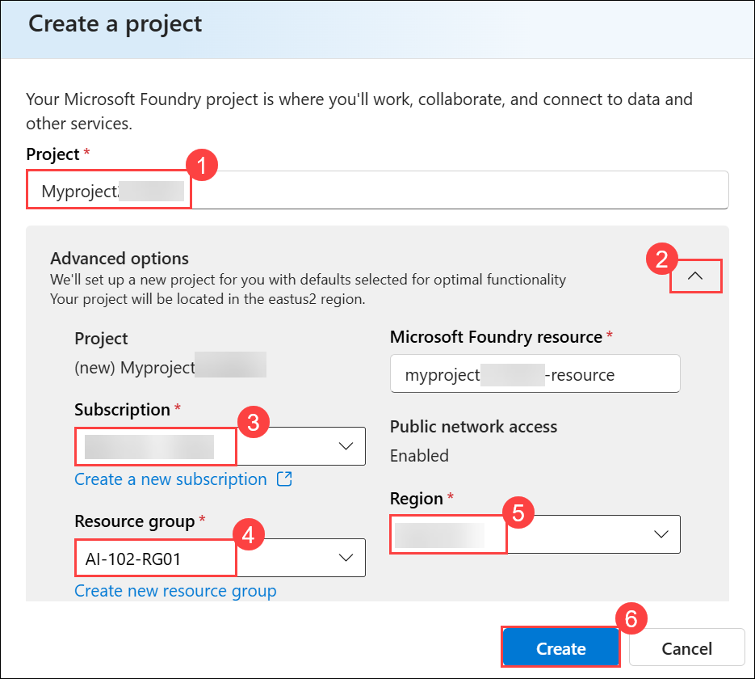 

1. Wait for your project to be created. It may take around 1-2 minutes.          

## Task 2: Deploy and test a model

In this task, you will deploy the gpt-4.1 model and test it in the playground by sending prompts and reviewing responses.

1. On the **Microsoft Foundry** home page, click **Start building (1)**, and then select **Browse models (2)** from the drop-down menu.

    

1. On the **Models** page, search for **gpt-4.1 (1)** in the search bar, and then select the **gpt-4.1 (2)** model from the search results.

   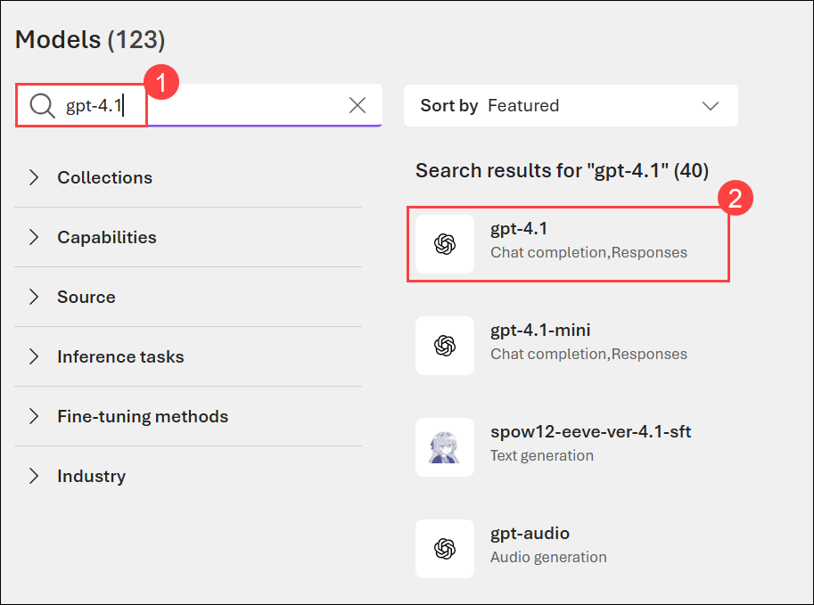 

1. On the **gpt-4.1** model details page, click **Deploy (1)**, and then select **Default settings (2)** to deploy the model using the standard configuration.

   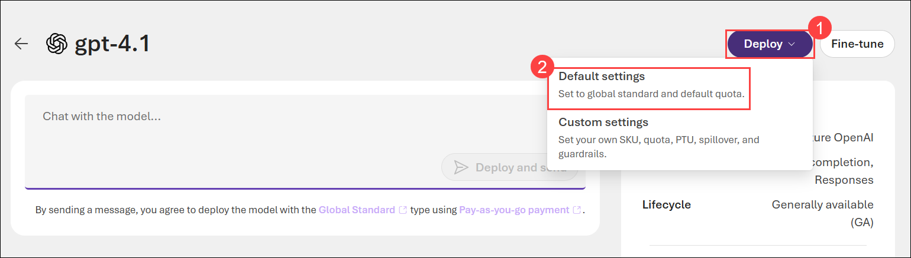 

1. Once the model has been deployed, the model playground will open automatically so you can test your model:   

   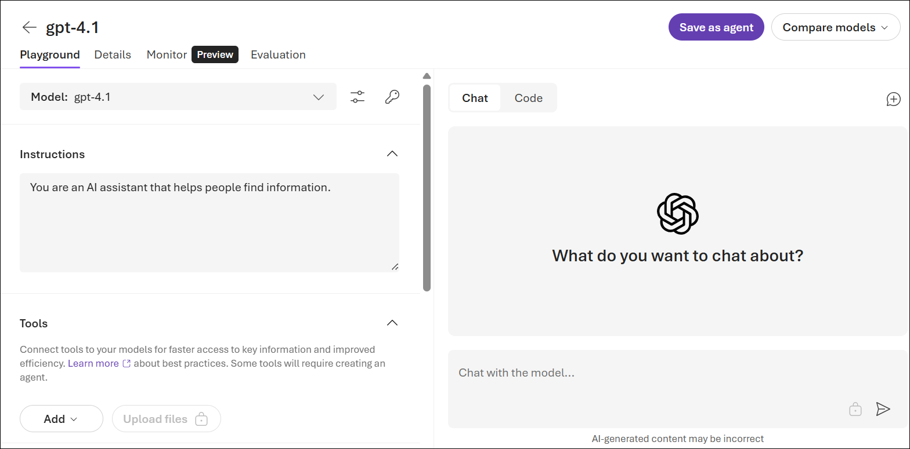 

1. In the **Instructions (1)** box, enter the provided text, then in the chat pane enter the query  `Decribe three key considerations for working with Large Language Models for AI application development.` **(2)** and select **Send (3)**.

   ```text
   You are an AI assistant that can provide information and advice about AI software development.
   ```

   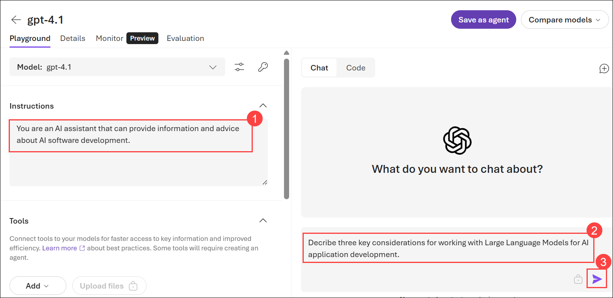 

1. In the chat pane, review the response.

   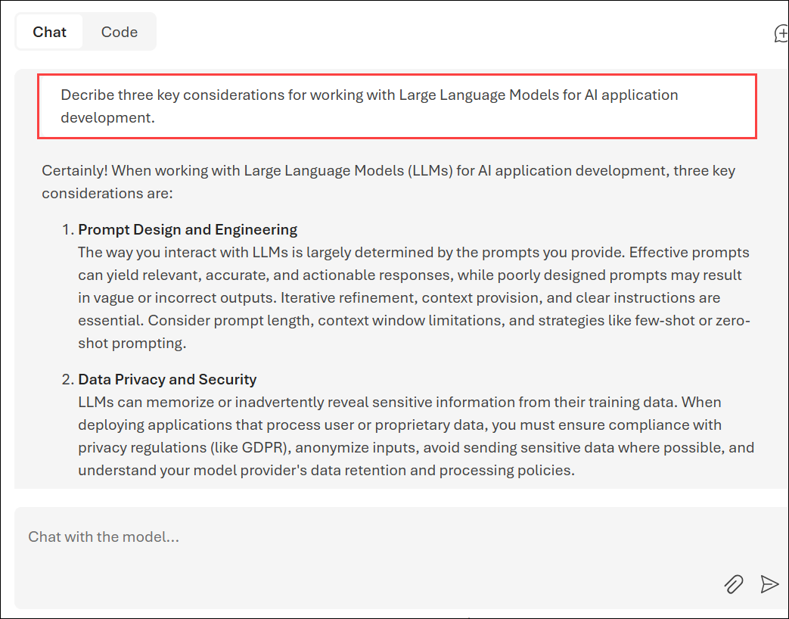 

> **Congratulations** on completing the task! Now, it's time to validate it. Here are the steps:
>
> - Hit the Validate button for the corresponding task. If you receive a success message, you can proceed to the next task.
> - If not, carefully read the error message and retry the step, following the instructions in the lab guide.
> - If you need any assistance, please contact us at cloudlabs-support@spektrasystems.com. We are available 24/7 to help.
 
<validation step="de166ee0-49cd-4599-b2a5-9cb602ef5230" />
 
---

## Task 3: View Foundry Azure resource and project endpoints

In this task, you will explore the resource and project endpoints, along with keys used to connect applications to your deployed models.

1. In the Foundry portal, in the top menu bar, select **Operate**. The operation center is where you can monitor your projects, view alerts, monitor agent performance and quotas, and manage resources.

    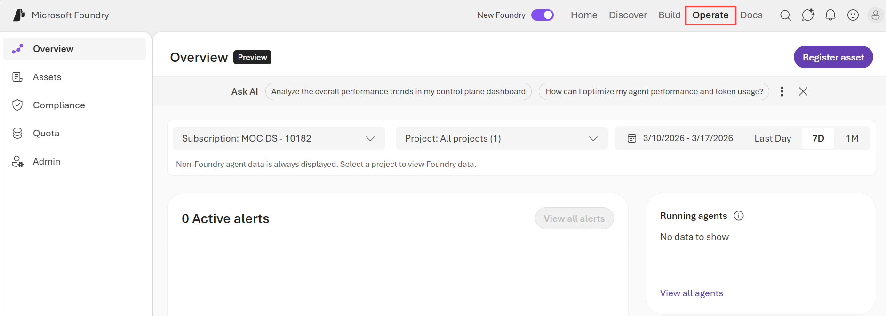

1. In the left navigation pane, select the **Admin (1)** page to view details.

    - The *resource* level relates to the **Foundry** resource that was created in Azure to support your project. This resource includes connections to Foundry Services and models; and provides a central place to manage user access to AI development projects.
    - The *project* level relates to your individual project, where you can add and manage project-specific resources. A resource can support multiple projects (the first one created is the resource's *default* project).

1. Select the link to the **Parent resource (2)** associated with the project.

   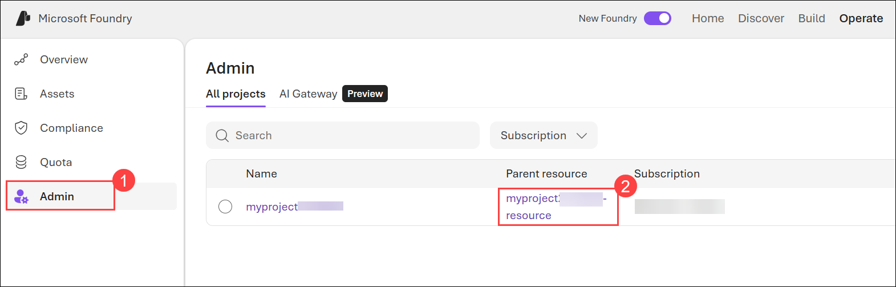

1. The resource configuration details should be displayed. 

   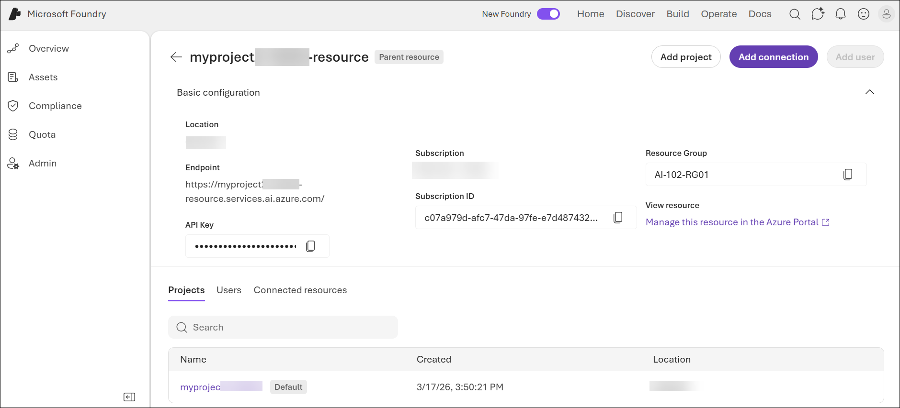

   >**Note:** Note that the Foundry resource has an *endpoint*, through which client applications can access resource-level funtionality (such as Foundry Tools that are shared across all projects in the resource).

1. In the top menu bar, select **Home** to return to the project home page.

1. View the project endpoint, key, and OpenAI endpoint. This information is used to connect to your project-level resouces from client applications.

    - The **key** is used for key-based authentication to models and tools (though in most production scenarios you should consider using Microsoft Entra ID authentication based on authenticated user and application identities).
    - The **project endpoint** is used to access models provided directly in Foundry (including OpenAI models) using the OpenAI **Resources** API, and to access Foundry-specific APIs (such as the Foundry Agent service).
    - The **OpenAI endpoint** is used to access models that are compatible with the OpenAI APIs, including the **Chat Completions** API and other specialized functions.

      

## Task 4: Install the Visual Studio Code extension for Microsoft Foundry  

In this task, you will install the Microsoft Foundry extension in Visual Studio Code and connect it to your project to access and test the deployed model.

1. Open the **Visual Studio Code** from the desktop.

1. In Visual Studio Code, select **Extensions (1)** from the left pane, search for **Microsoft Foundry (2)**, choose the **Microsoft Foundry (3)** extension by Microsoft, and then click **Install (4)**.

   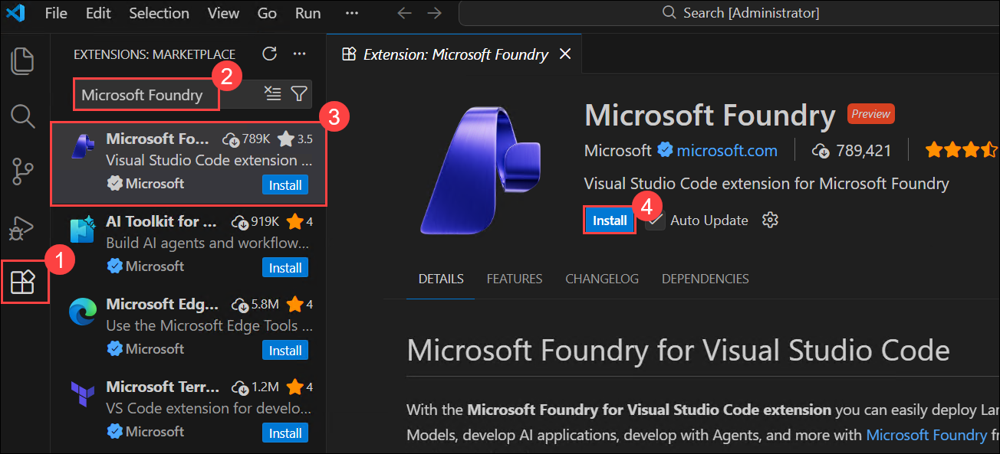

1. After installation is complete, verify the extension appears in the primary navigation bar on the left side of Visual Studio Code.

1. In the VS Code sidebar, select the **Microsoft Foundry (1)** extension icon.

1. In the Resources view, choose **Set default project (2)**, and when prompted, select **Sign in to Azure (3)** to authenticate.

   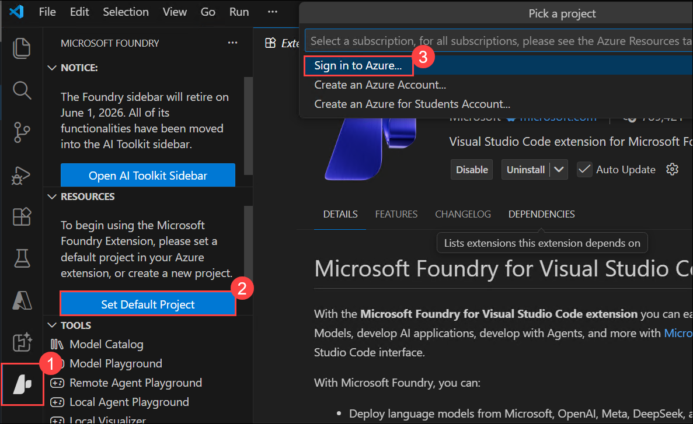

1. In the **Azure Resources wants to sign in using Microsoft** dialog, select **Allow**.

   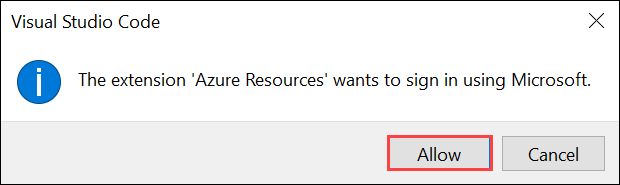

1. On the **Sign in** page, provide the credentials below:
 
   - **Email/Username:** <inject key="AzureAdUserEmail"></inject>
    
     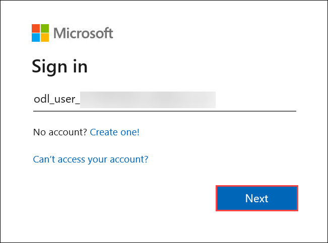

   - **Password:** <inject key="AzureAdUserPassword"></inject>
    
     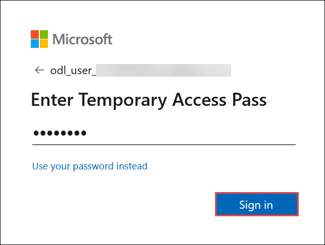

1. On the **Sign in to all apps, websites, and services on this device?** page, select **Yes**.

   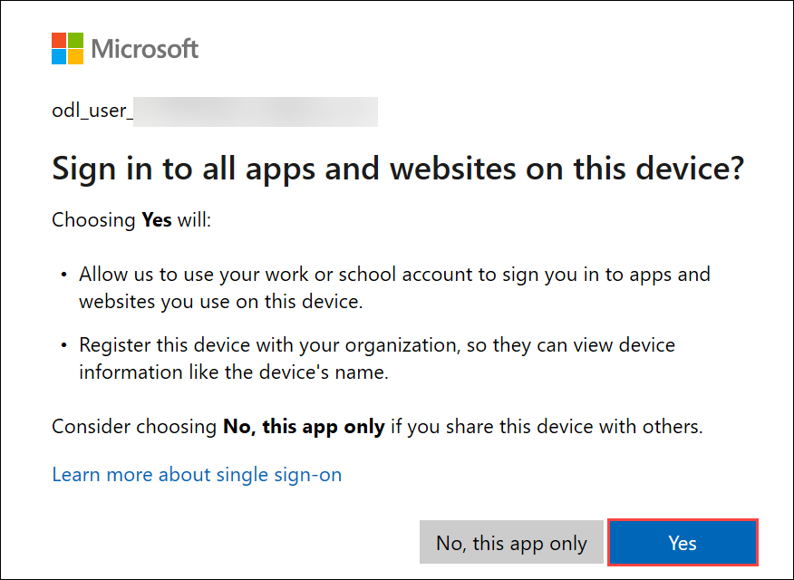

1. On the **Account added to this device** page, select **Done**.

   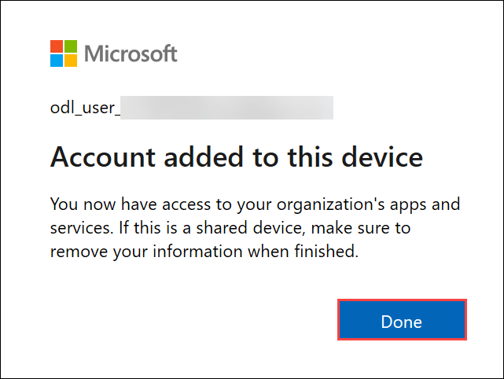

1. In the **Pick a project** prompt, select **Myproject<inject key="DeploymentID" enableCopy="false"/>**.

   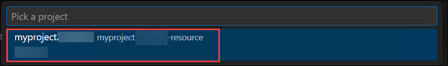

1. In the **Foundry** extension pane, expand **Models (1)** and select **gpt-4.1 (2)** to view the deployment details.

   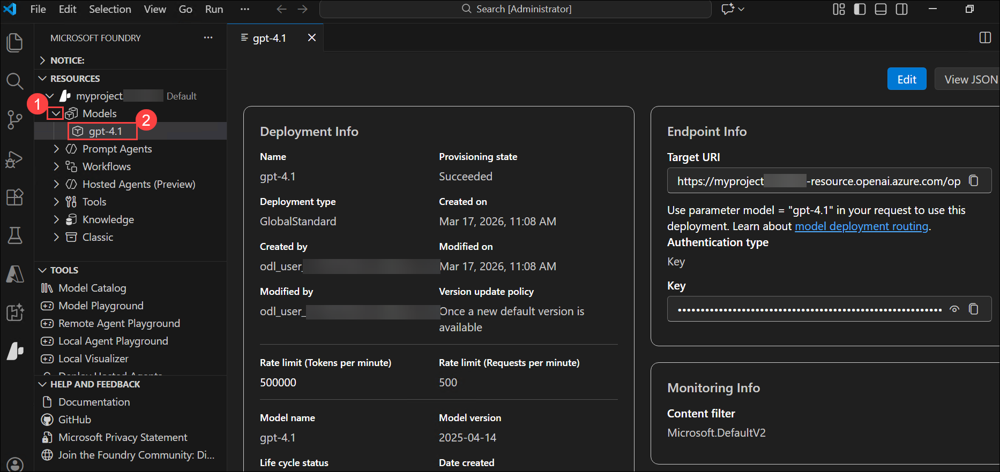

1. In the Foundry extension pane, in the **Tools** section, select **Model playground (1)** and when prompted, select the **gpt-4.1 (2)** model.

   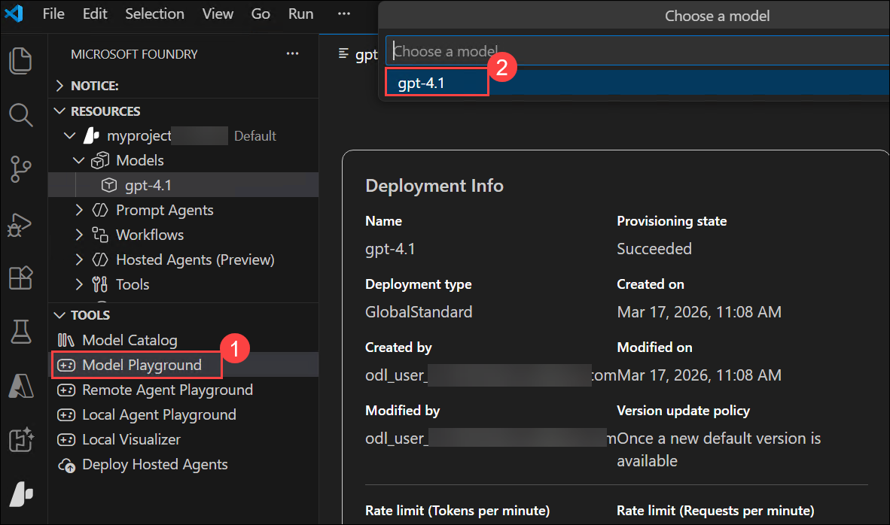

1. An interactive playground in which you can test the model is opened in Visual Studio Code.

   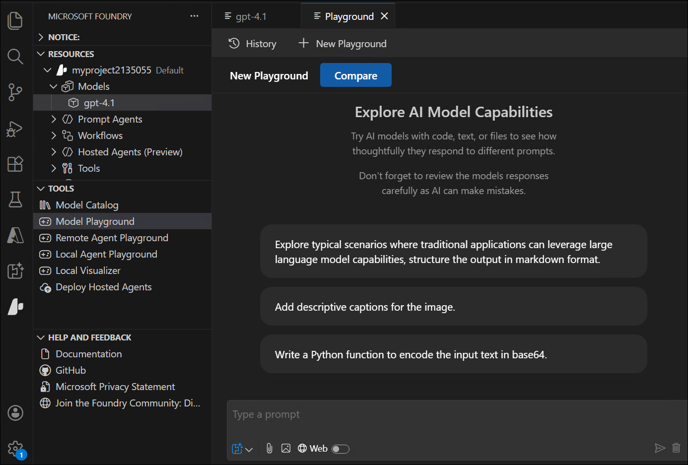

### Summary

In this lab, you created a new project in the Microsoft Foundry portal and deployed the gpt-4.1 model. You tested the model in the playground by sending prompts and reviewing its responses. You also explored the project and resource endpoints required for integration. Finally, you connected the project to Visual Studio Code using the Microsoft Foundry extension to access and interact with the model.

### You have successfully completed the Hands-on Lab!


