# Lab 01: Prepare for an AI development project

In this lab, you use Azure AI Foundry portal to create a project, ready to build an AI solution.

### Task 1: Create a Azure AI Foundry Project and deploy a model

1. Open a new tab in the browser, right-click on the following link [Azure AI Foundry portal](https://ai.azure.com), then **Copy link** and paste it in a browser tab to log in to **Azure AI Foundry portal**.

1. Click on **Sign in**.

    

1. If prompted, provide the credentials below:

   - **Email/Username:** <inject key="AzureAdUserEmail"></inject>

   - **Password:** <inject key="AzureAdUserPassword"></inject>

1. In the home page, in the **Explore models and capabilities** section, search for the `gpt-4.1` model **(1)** and select `gpt-4.1` **(2)**  which we'll use in our project.    

    

1. Select **Use this model**.

   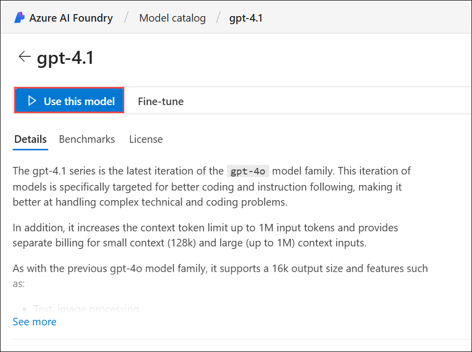 

1. When prompted to create a project, enter the project name as **Myproject<inject key="DeploymentID" enableCopy="false"/> (1)** and expand **Advanced options (2)**.

   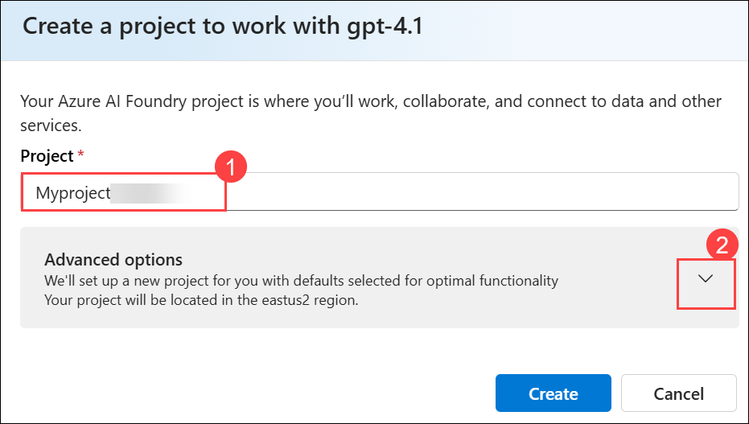 

1. Under **Advanced options**, provide the below details and leave the rest to deafult:

    - Resource group: Select **AI-102-RG01 (1)**
    - Region: Select **Region**: Select **<inject key="Region" enableCopy="false" /> (2)**
    - Select **Create (3)**

      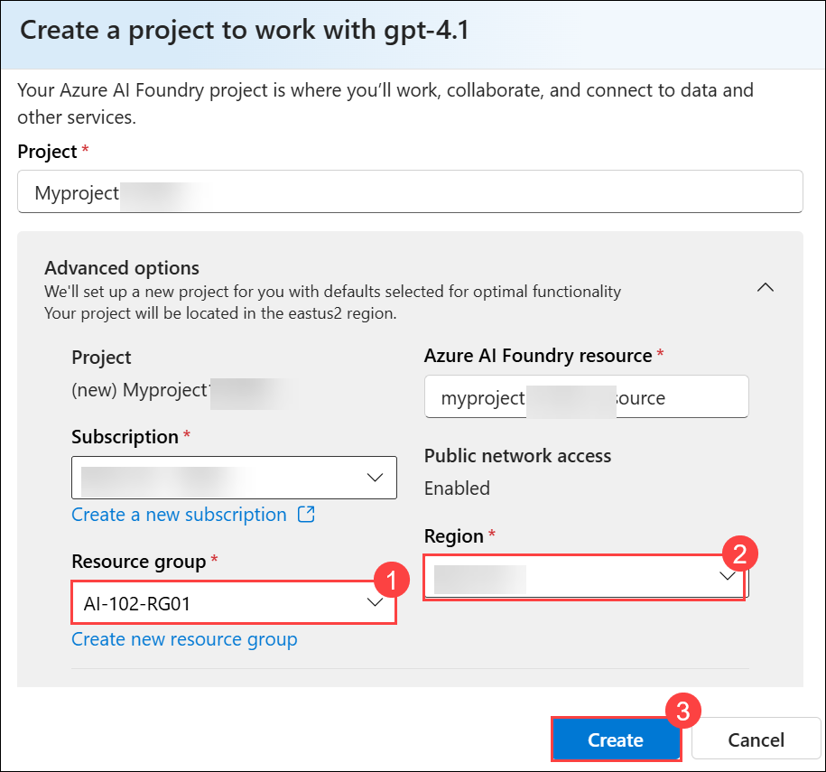 

       >**Note**: If prompted, deploy the gpt-4.1 model using the **Global standard** deployment type and customize the deployment details to set a Tokens per minute rate limit of **50K** (or the maximum available if less than 50K).   

1. Wait for your project to be created. It may take around 3-5 minutes.          

1. When your project is created, the chat playground will be opened automatically so you can test your model:

   

1. In the navigation pane on the left, select **Overview** to see the main page for your project; which looks like this.

   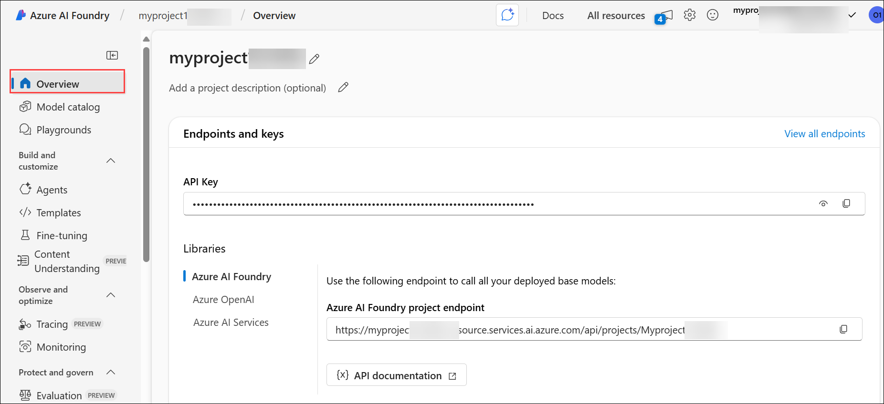

1. At the bottom of the navigation pane on the left, select **Management center**. 

   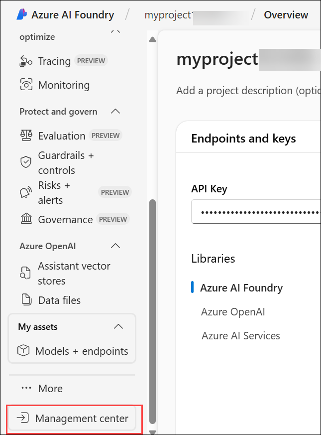

1. The management center is where you can configure settings at both the **resource** and **project** levels; which are both shown in the navigation pane.     

   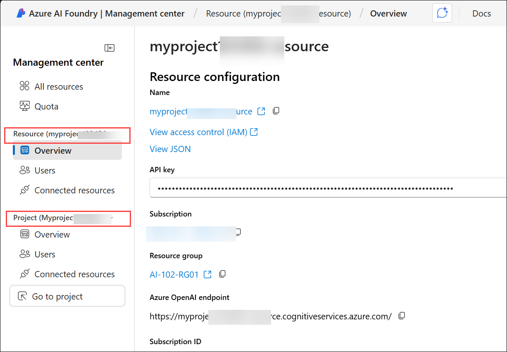

   - The **resource level** relates to the Azure AI Foundry resource that was created to support your project. This resource includes connections to Azure AI Services and Azure AI Foundry models; and provides a centralplace to manage user access to AI development projects.

   - The **project level** relates to your individual project, where you can add and manage project-specific resources.

1. In the navigation pane, in the section for your Azure AI Foundry resource, select the **Overview (1)** page to view its details. Select the link to the Resource group **AI-102-RG01 (2)** associated with the resource to open a new browser tab and navigate to the Azure portal.  

   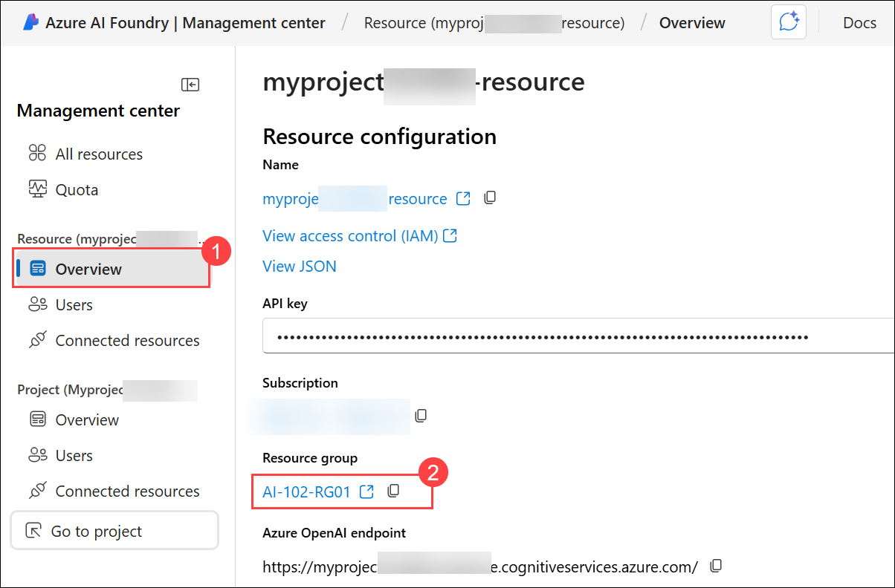

1. Sign in with your Azure credentials if prompted.

1. View the resource group in the Azure portal to see the Azure resources that have been created to support your **Azure AI Foundry resource** and your **project**.

   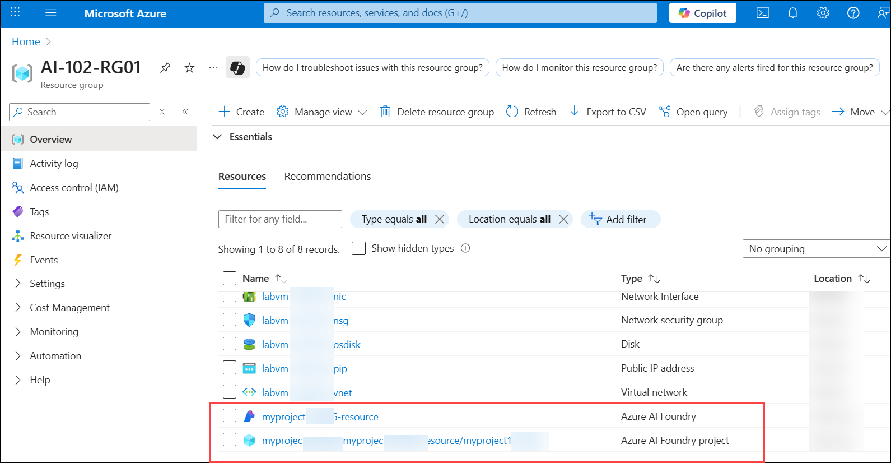

    >**Note**: Note that the resources have been created in the region you selected when creating the project.

1. Close the Azure portal tab and return to the **Azure AI Foundry portal**. 

> **Congratulations** on completing the task! Now, it's time to validate it. Here are the steps:
>
> - Hit the Validate button for the corresponding task. If you receive a success message, you can proceed to the next task.
> - If not, carefully read the error message and retry the step, following the instructions in the lab guide.
> - If you need any assistance, please contact us at cloudlabs-support@spektrasystems.com. We are available 24/7 to help.
 
<validation step="de166ee0-49cd-4599-b2a5-9cb602ef5230" />
 
---

### Task 2: Review project endpoints

The Azure AI Foundry project includes a number of endpoints that client applications can use to connect to the project and the models and AI services it includes.

1. In the Management center page, in the navigation pane, under your project, select **Go to project**.

    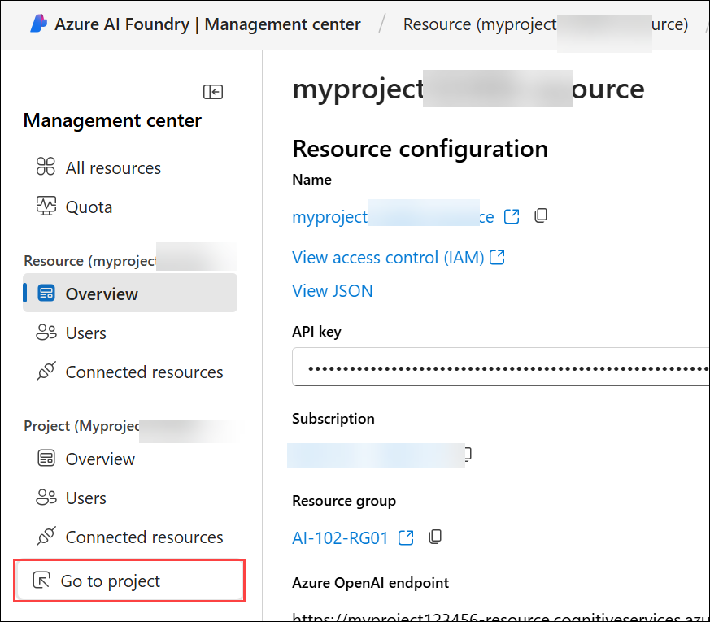

1. In the project **Overview (1)** page, view the Endpoints and keys section; which contains endpoints and authorization keys that you can use in your application code to access **(2)**:

    - The **Azure AI Foundry project** and any models deployed in it.
    - **Azure OpenAI** in Azure AI Foundry models.
    - **Azure AI services**   

      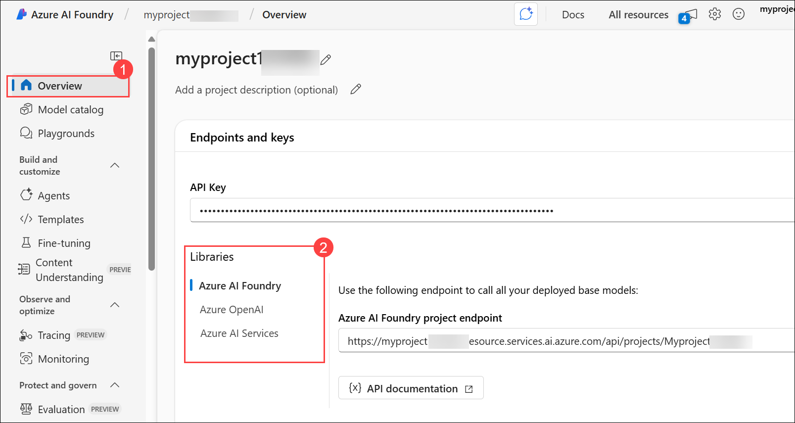    


### Task 3: Test a generative AI model      

Now that you know something about the configuration of your Azure AI Foundry project, you can return to the chat playground to explore the model you deployed.

1. In the navigation pane on the left for your project, select **Playgrounds (1)**.

    - On the Chat playground, and ensure that your `gpt-4.1` **(2)** model deployment is selected in the Deployment section.

      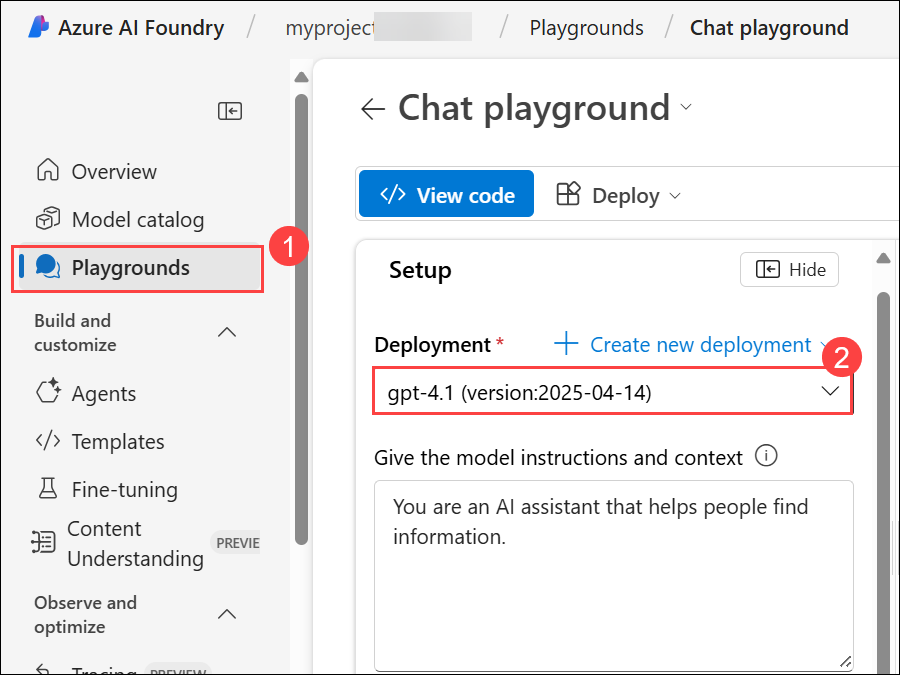    

1. In the Setup pane, in the **Give the model instructions and context** box, delete the existing content and then enter the following instructions **(1)** and then **Apply changes (2)**:      

    ```
    You are a history teacher who can answer questions about past events all around the world.
    ```

     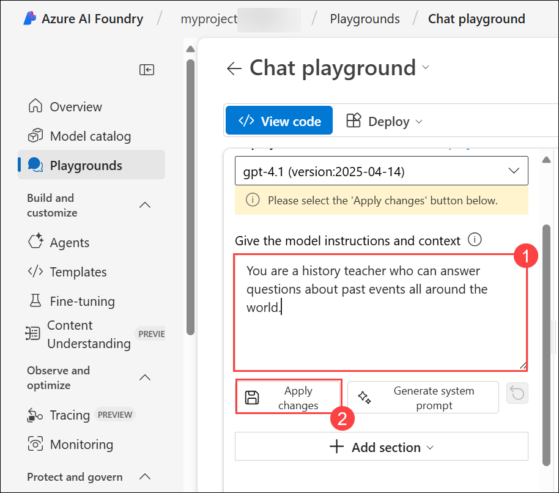  

1. Select **Continue**.

    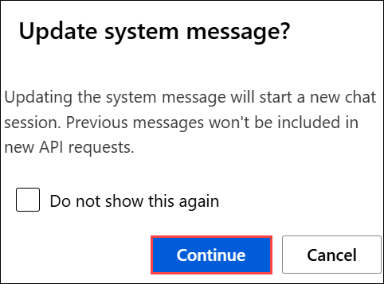

1. In the chat window, enter a query such as `What are the key events in the history of Scotland?` **(1)** and then send **(2)**.    

    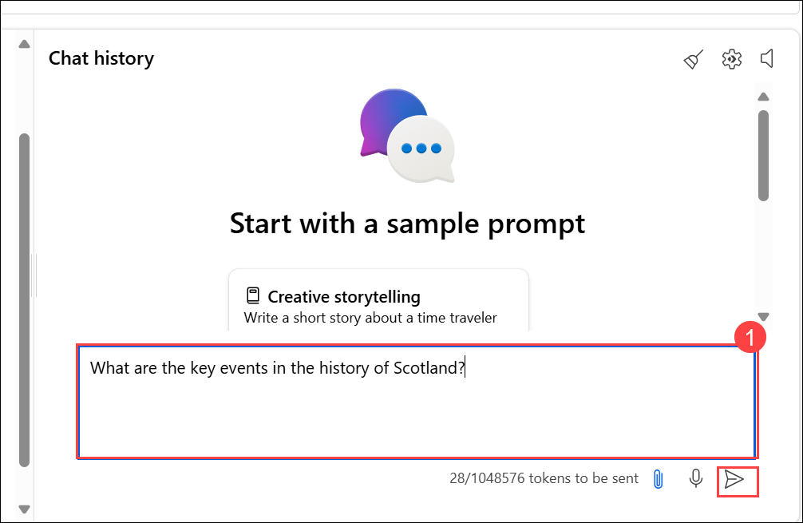

1. View the response:   

    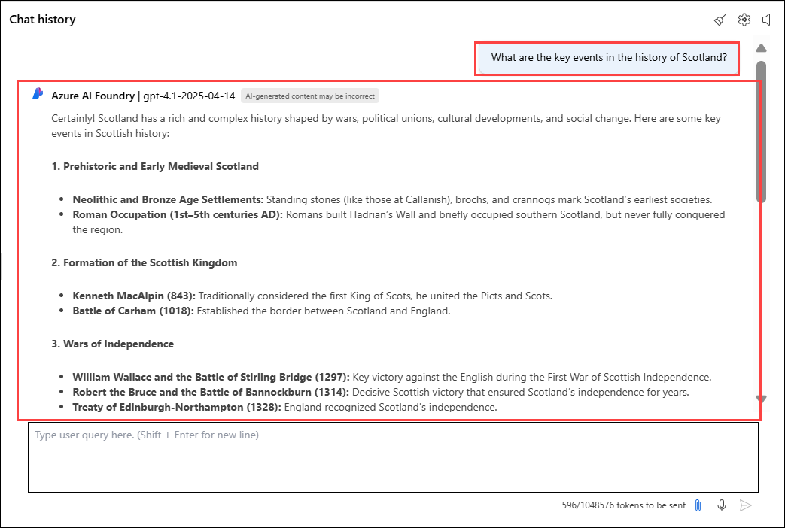

### Summary

In this lab, you've explored Azure AI Foundry, and seen how to create and manage projects and their related resources.   


