# Lab 02: Choose and deploy a language model

### Estimated Duration : 45 Minutes

## Overview

In this lab, you will work with Azure AI Foundry to explore, compare, and deploy generative AI models. You’ll review model details and benchmarks, create a project, deploy models like gpt-4.1 and Phi-4-mini-instruct, and test them in the chat playground. The lab provides hands-on experience in evaluating model performance, configuring system prompts, and understanding how to integrate AI models into applications effectively.

## Lab Objectives

- **Task 1:** Explore models

- **Task 2:** Compare models

- **Task 3:** Create an Azure AI Foundry project and deploy a model

- **Task 4:** Chat with the gpt-4.1 model

- **Task 5:** Deploy another model

- **Task 6:** Chat with the Phi-4 model

## Task 1: Explore models

In this task, you’ll explore the model catalog in Azure AI Foundry. You will locate and review the **gpt-4.1** and **Phi-4-mini-instruct** models, examine their details and capabilities, and compare their performance using benchmark data. This will help you understand the characteristics of different models before using them in your projects.

1. Open a new tab in the browser, right-click on the following link [Azure AI Foundry portal](https://ai.azure.com), then **Copy link** and paste it in a browser tab to log in to **Azure AI Foundry portal**.

1. Click on **Sign in**.

    

1. If prompted, provide the credentials below:

   - **Email/Username:** <inject key="AzureAdUserEmail"></inject>

   - **Password:** <inject key="AzureAdUserPassword"></inject>

1. In the home page, in the **Explore models and capabilities** section, search for the `gpt-4.1`**(1)** model and select `gpt-4.1` **(2)**  which we'll use in our project.    

    

1. Read the description and review the other information available on the **Details** tab.   

   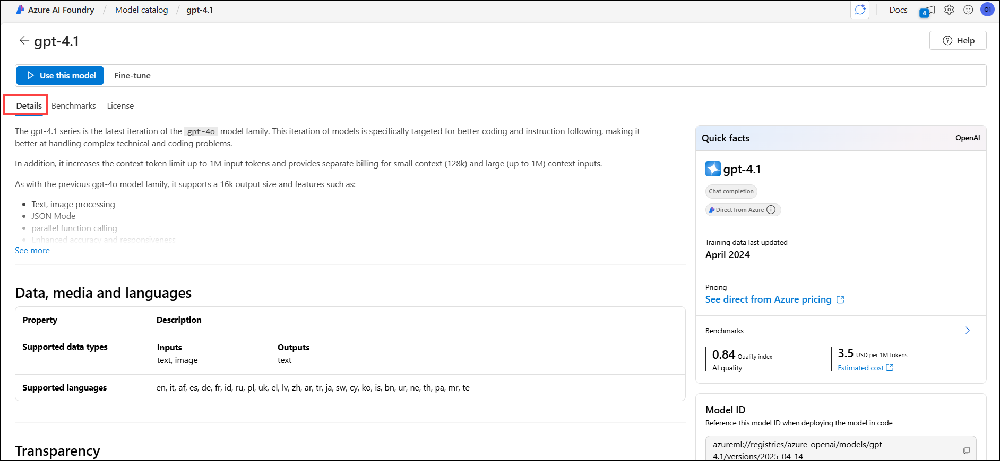

1. On the `gpt-4.1` page, view the Benchmarks tab to see how the model compares across some standard performance benchmarks with other models that are used in similar scenarios.   

   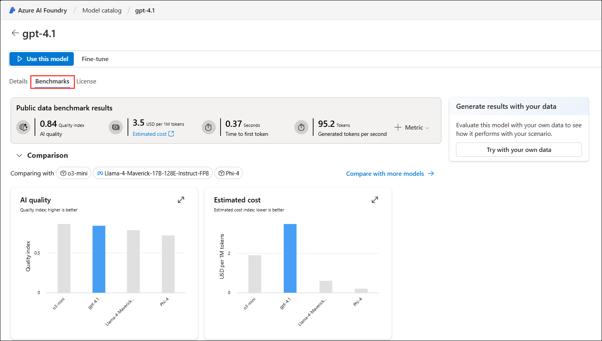

1. Use the back arrow **(←)** next to the gpt-4.1 page title to return to the model catalog.   

   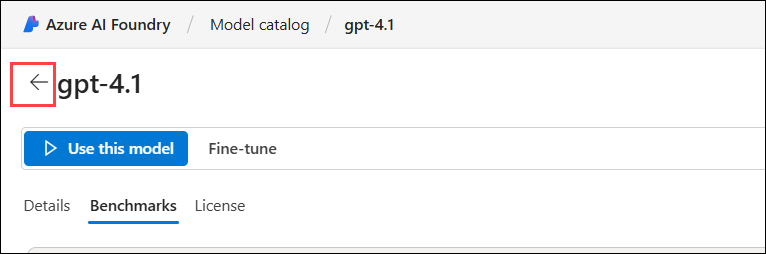

1. Search for **Phi-4-mini-instruct (1)** and select **Phi-4-mini-instruct (2)**.

   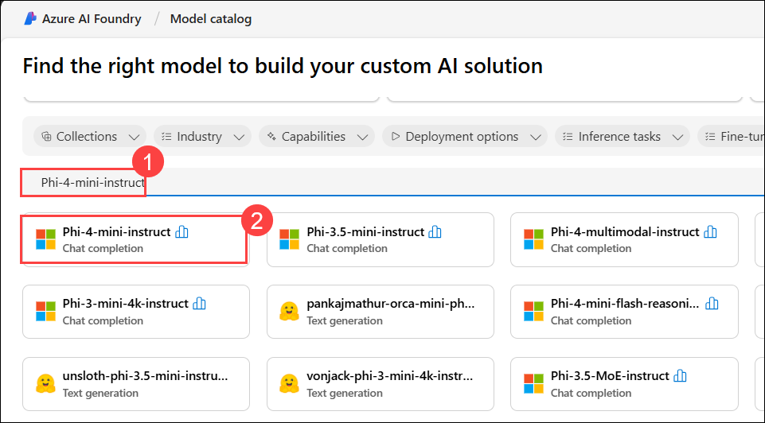

1. View the **details** for the Phi-4-mini-instruct model.

   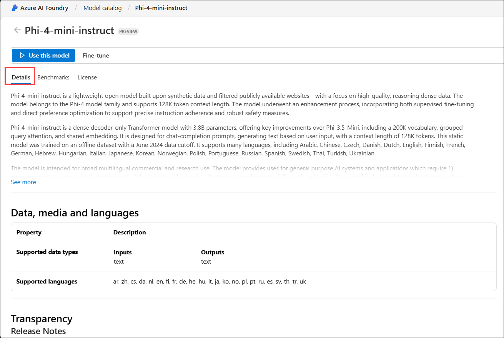

1. Navigate to **benchmarks** tab and view the information.

   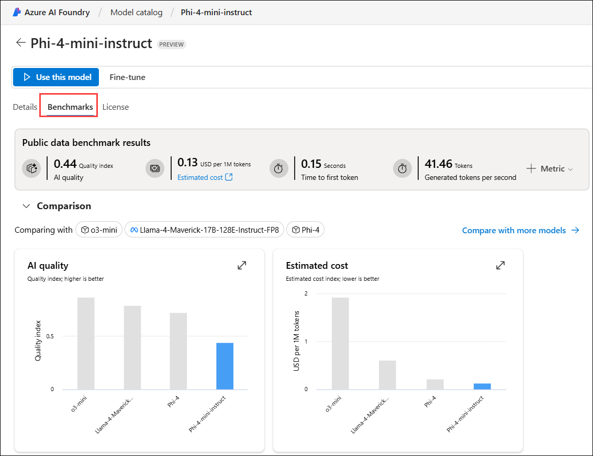

## Task 2: Compare models

In this task, you’ll compare different AI models in Azure AI Foundry. You will add models like **gpt-4.1** and **Phi-4-mini-instruct** to a comparison chart, analyze them based on metrics such as quality, accuracy, and cost, and interpret the benchmark results to determine which model best suits specific tasks.

1. Use the back arrow **(←)** to return to the model catalog.

   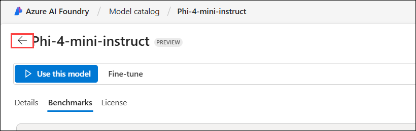

1. Select **Compare models**. 

   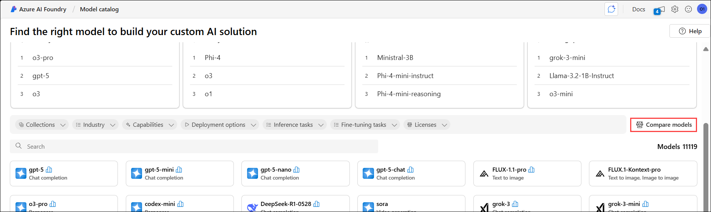

1. A visual chart for model comparison is displayed with a selection of common models.

1. In the **Models to compare** pane, note that you can select popular tasks, such as **question answering (1)** to automatically select commonly used models for specific tasks.

   - Use the **Clear all models (🗑) (2)** icon to remove all of the pre-selected models.

     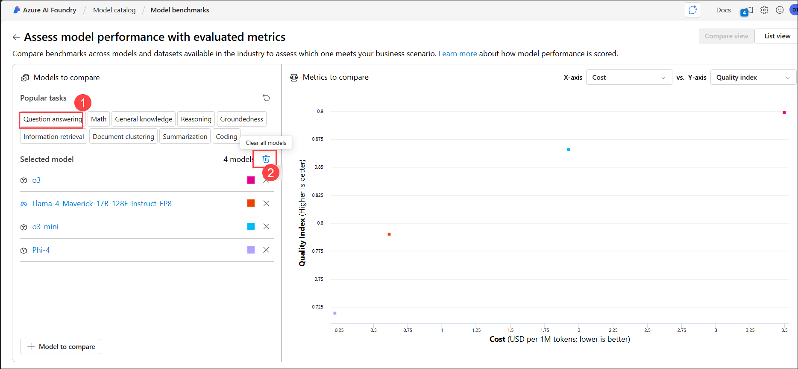   

1. Use the **+ Model to compare** button to add the gpt-4.1 model to the list. 

   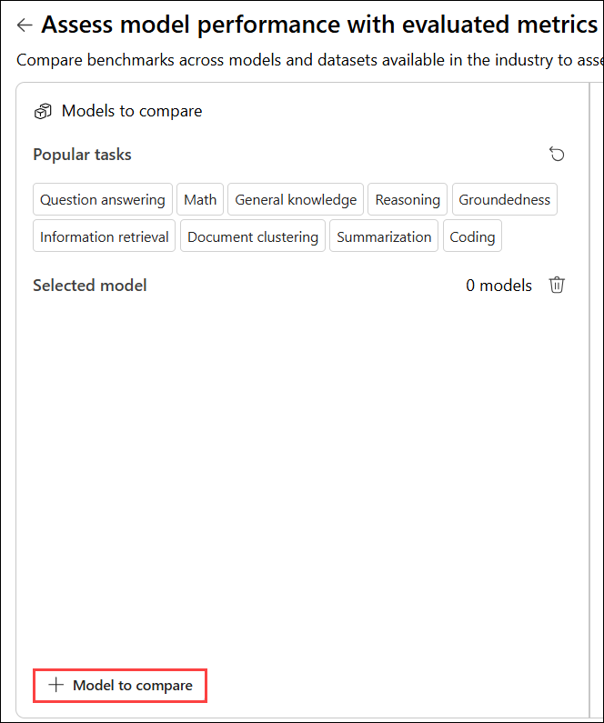

1. Search for `gpt-4.1` **(1)** then select `gpt-4.1` **(2)** and then **Confirm (3)**.  

   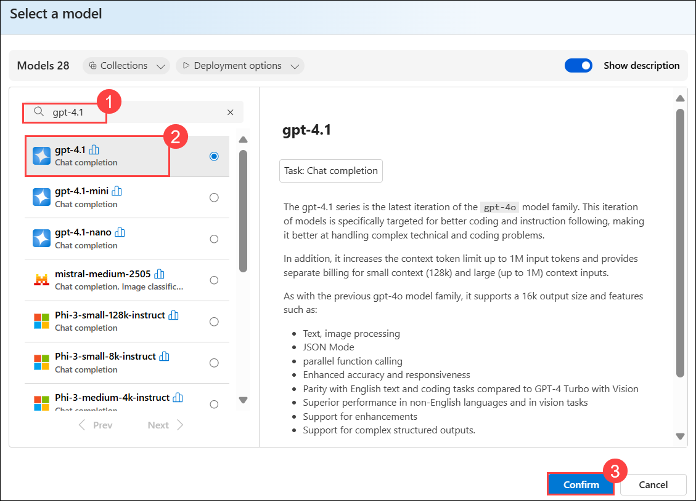   

1. Then use the same button to add the Phi-4-mini-instruct model to the list.

   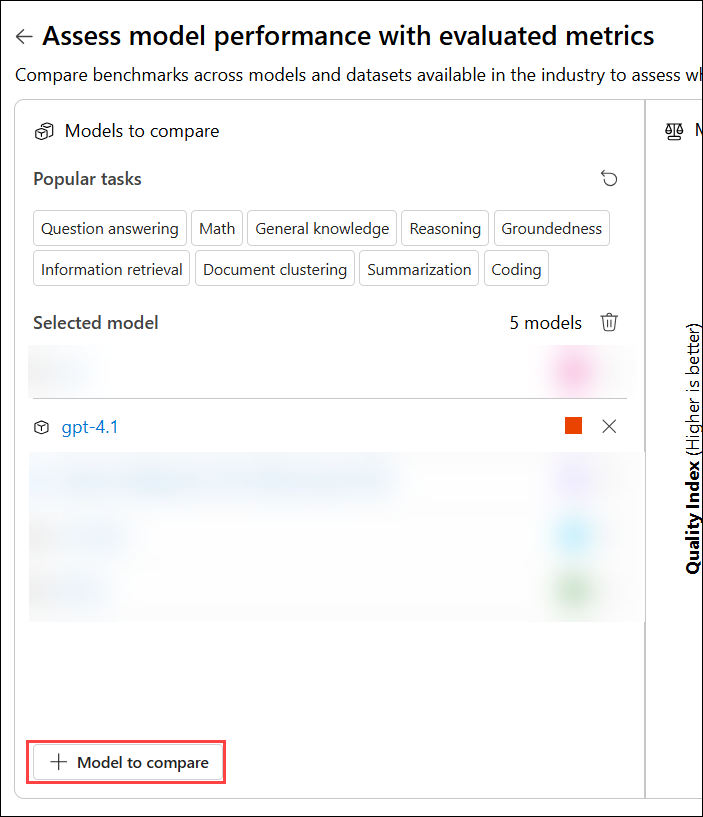 

1. Seach for `Phi-4-mini-instruct` **(1)** model then select `Phi-4-mini-instruct` **(2)** and then **Confirm (3)**. 

   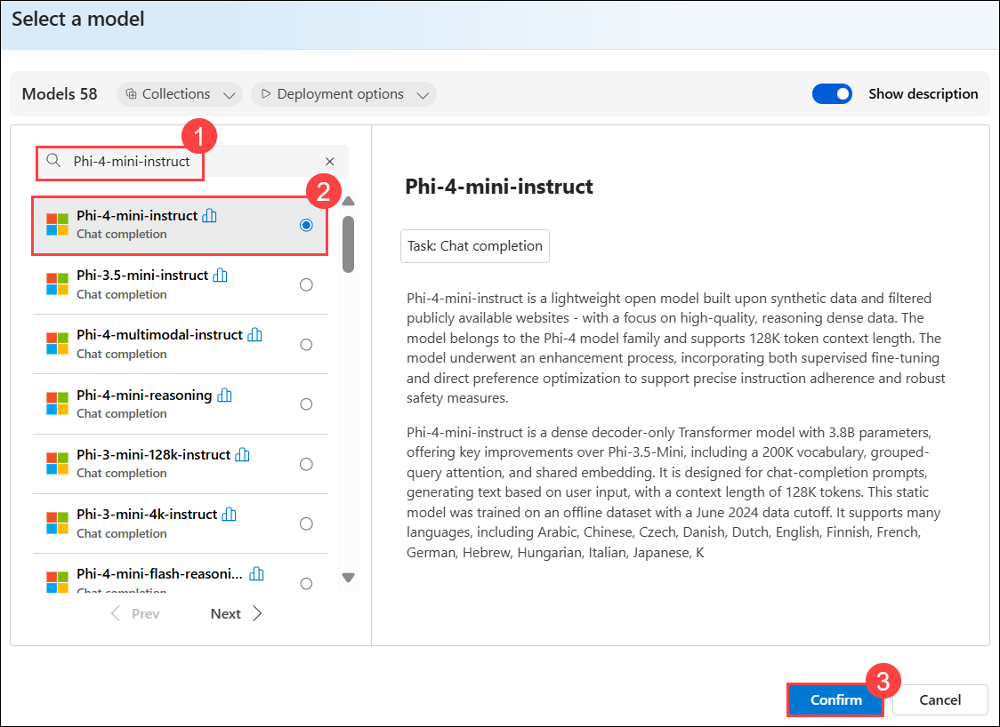

1. Set the models X axis to **Quality Index (1)** and Y axis to **Cost (2)**.  Review the chart, which compares the models based on **Quality Index** (a standardized score indicating model quality) and **Cost**. 

   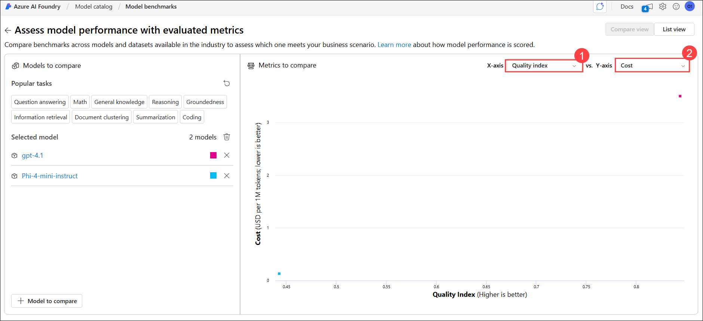

1. You can see the specific values for a model by holding the mouse over the point that represents it in the chart.   

   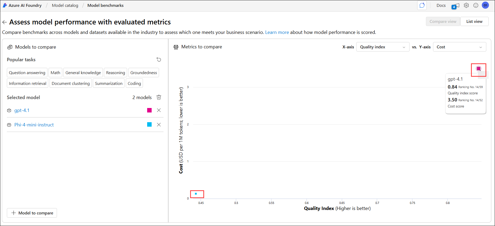

1. In the `X-axis` dropdown menu, under **Quality**, select the **Accuracy (1)** metrics and observe each resulting chart **(2)** and **(3)**.   

   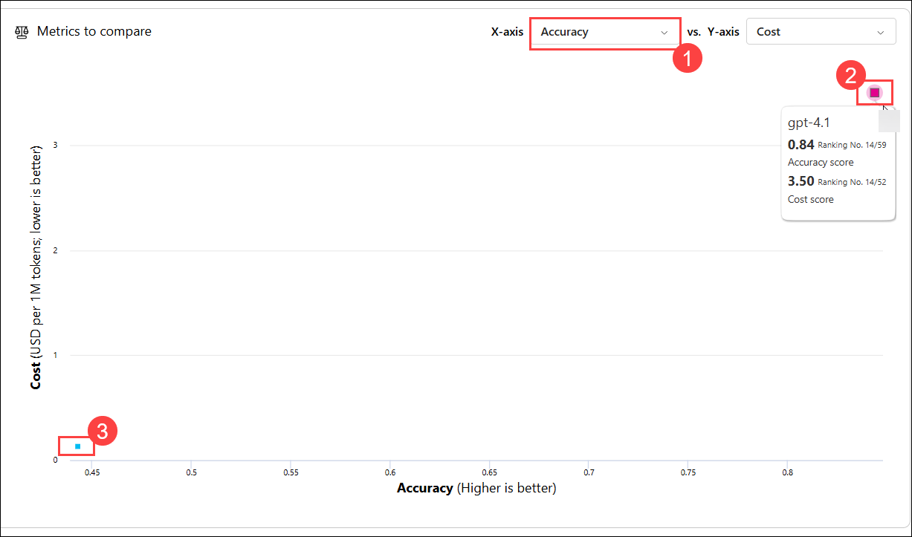

1. Based on the benchmarks, the `gpt-4.1` model looks like offering the best overall performance, but at a higher cost.

1. In the list of models to compare, select the `gpt-4.1` model to re-open its benchmarks page.

   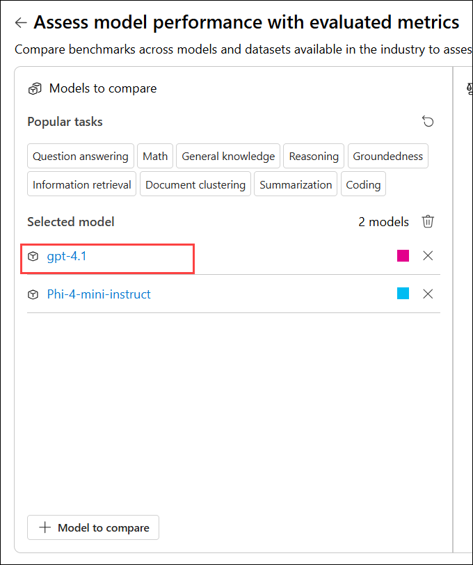

1. In the page for the `gpt-4.1` model page, select the **Details** tab to view the model details.   

   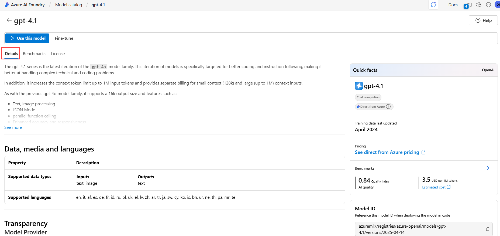

## Task 3: Create an Azure AI Foundry project and deploy a model

In this task, you’ll create a new Azure AI Foundry project and deploy the **gpt-4.1** model. You will configure project settings such as the resource group and region, set deployment options, and then access the chat playground to test and interact with the deployed model.

To use a model, you need to create an Azure AI Foundry project.

1. At the top of the `gpt-4.1` model overview page, select **Use this model**.

   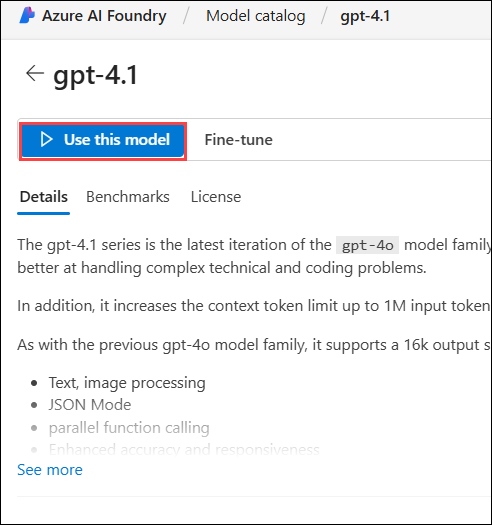

1. When prompted to create a project, enter a project name as **Myproject<inject key="DeploymentID" enableCopy="false"/> (1)** and expand **Advanced options (2)**.

   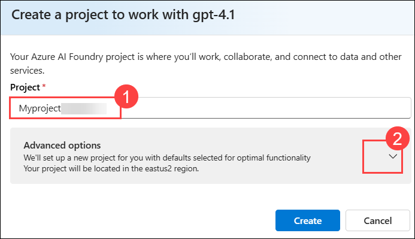

1. Under **Advanced options**, provide the below details and leave the rest to deafult:

    - Resource group: Select **AI-102-RG02 (1)**
    - Region: **<inject key="Region" enableCopy="false" /> (2)**
    - Select **Create (3)**

      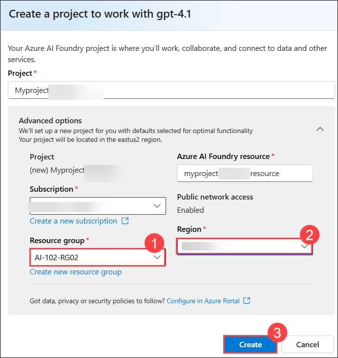 

       >**Note**: If prompted, deploy the gpt-4.1 model using the **Global standard** deployment type and customize the deployment details to set a Tokens per minute rate limit of **50K** (or the maximum available if less than 50K).    

1. When your project is created, the chat playground will be opened automatically so you can test your model.

> **Congratulations** on completing the task! Now, it's time to validate it. Here are the steps:
>
> - Hit the Validate button for the corresponding task. If you receive a success message, you can proceed to the next task.
> - If not, carefully read the error message and retry the step, following the instructions in the lab guide.
> - If you need any assistance, please contact us at cloudlabs-support@spektrasystems.com. We are available 24/7 to help.
 
<validation step="efe4377d-c93c-4d0d-a5bd-e7f53085f5ed" />
 
---

## Task 4: Chat with the gpt-4.1 model

In this task, you’ll interact with the deployed **gpt-4.1** model using the chat playground. You will configure the system prompt, submit queries, and review the model’s responses to understand how it solves problems and explains its reasoning.

1. In the chat playground, in the Setup pane, ensure that your `gpt-4.1` model is selected.

    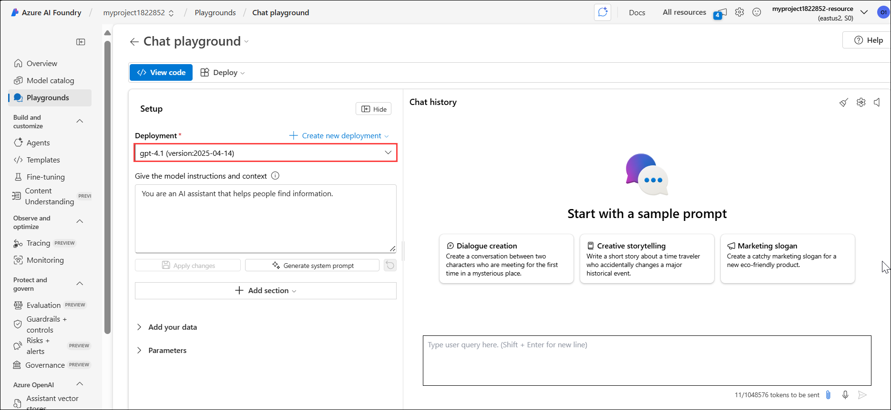

1. In the Give the model instructions and context field, set the system prompt to `You are an AI assistant that helps solve problems` **(1)** and select **Apply changes (2)** to update the system prompt.  

      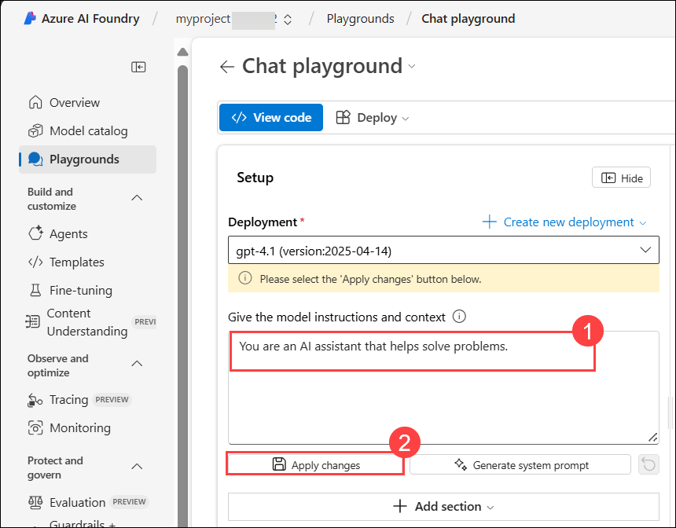    

1. In the **Update system message?**, click **Continue**.

      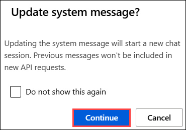

1. In the chat window, enter the following query **(1)** and then **Send (2)**.

    ```
    I have a fox, a chicken, and a bag of grain that I need to take over a river in a boat. I can only take one thing at a time. If I leave the chicken and the grain unattended, the chicken will eat the grain. If I leave the fox and the chicken unattended, the fox will eat the chicken. How can I get all three things across the river without anything being eaten?
    ```

     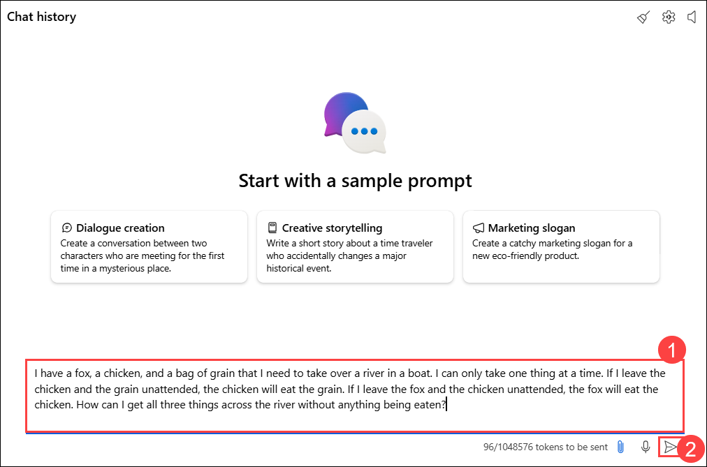   

1. View the response.

    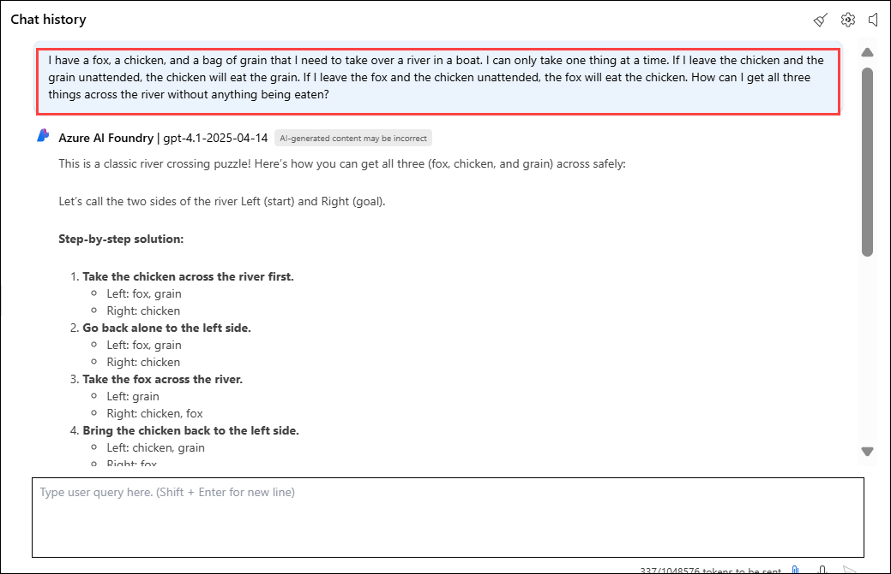

1. Then, enter the following follow-up query:

    ```
    Explain your reasoning.
    ```

     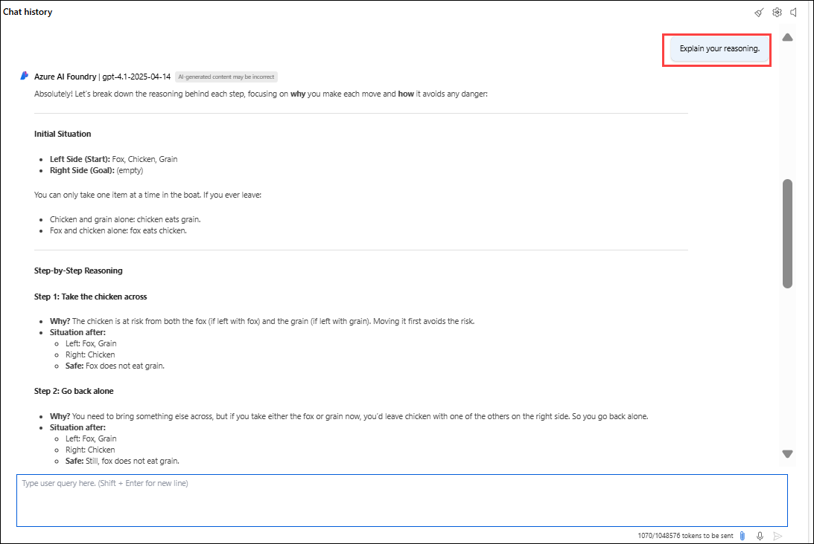   

## Task 5: Deploy another model

In this task, you’ll deploy an additional model, **Phi-4-mini-instruct**, to your existing Azure AI Foundry project. You will configure deployment settings, accept the model license, and complete the deployment to make the model available for testing and integration alongside the previously deployed gpt-4.1 model.

1. In the navigation bar on the left, in the **My assets** section, select **Models + endpoints (1)**.

    - In the Model deployments tab, in the **+ Deploy model (2)** drop-down list, select **Deploy base model (3)**.

      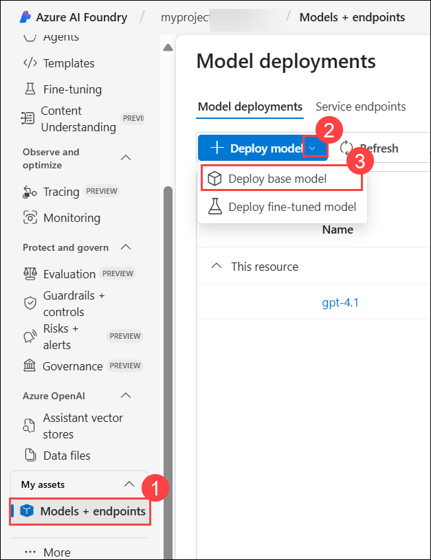

1. Then search for **Phi-4-mini-instruct (1)**, then select **Phi-4-mini-instruct (2)** and **Confirm (3)** you selection.    

    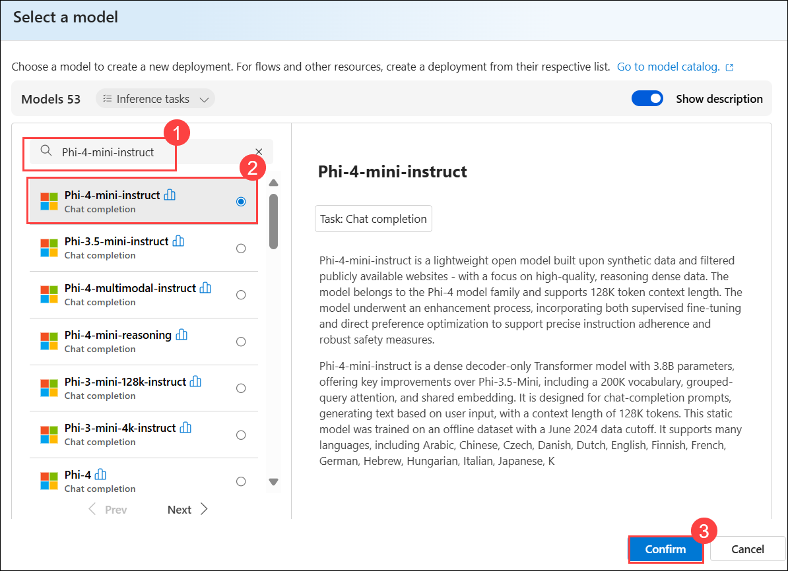

1. Click on **Agree and Proceed** to agree to the model license.

    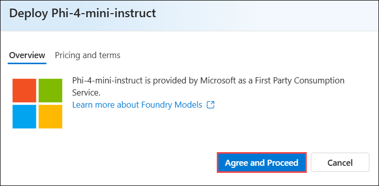

1. Deploy a Phi-4-mini-instruct model with the following settings and then select **Deploy (2)**:

    - Deployment name: Leave the default name
    - Deployment type: **Global Standard (1)**
    - Deployment details: Use the default settings

      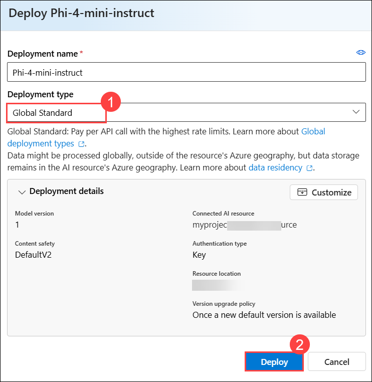

1. Wait for the deployment to complete.

> **Congratulations** on completing the task! Now, it's time to validate it. Here are the steps:
>
> - Hit the Validate button for the corresponding task. If you receive a success message, you can proceed to the next task.
> - If not, carefully read the error message and retry the step, following the instructions in the lab guide.
> - If you need any assistance, please contact us at cloudlabs-support@spektrasystems.com. We are available 24/7 to help.
 
<validation step="c84cf65d-2739-4748-bdea-7233a75b480b" />
 
---

## Task 6: Chat with the Phi-4 model

In this task, you’ll interact with the **Phi-4-mini-instruct** model in the chat playground. You will provide system instructions, submit queries, and review responses to test the model’s problem-solving capabilities. Additionally, you’ll compare its performance against the gpt-4.1 model to understand differences in response quality, reasoning, and suitability for specific tasks.

1. In the navigation bar, select **Playgrounds (1)**. Under the Chat playground, select the **Try the  Chat playground (2)**.

    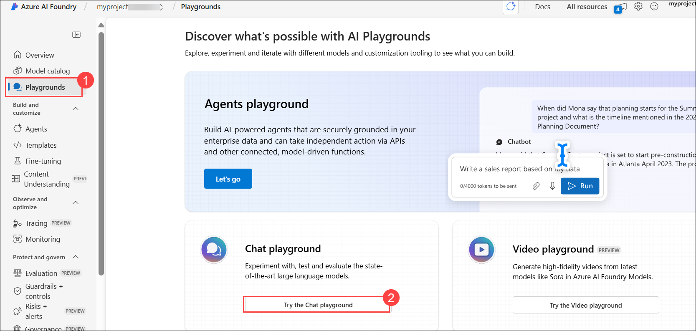

1. In the chat playground, in the Setup pane, ensure that your **Phi-4-mini-instruct** model is selected.    

    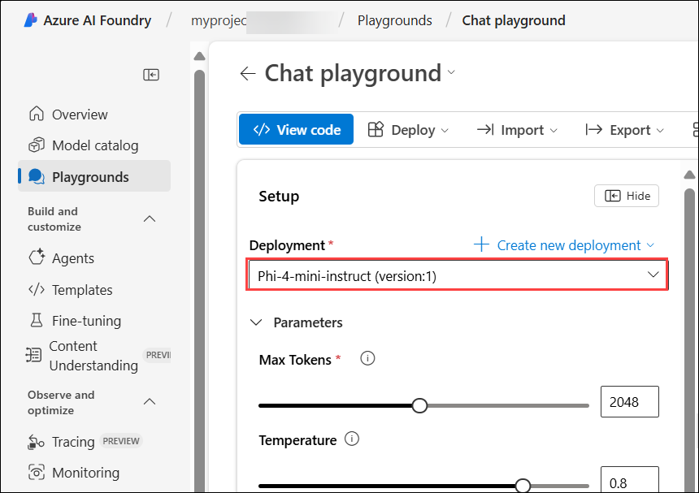

1. In the chat box, provide the first line as `System message: You are an AI assistant that helps solve problems` **(1)** and then **Send (2)**.   

    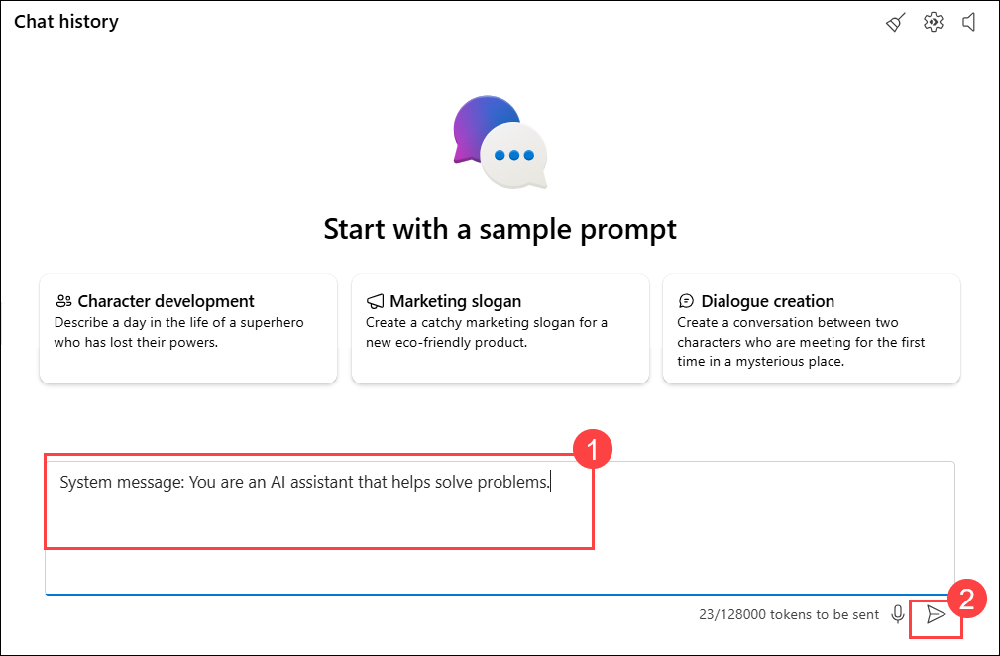

     >**Note**: The same system prompt you used to test the gpt-4.1 model, but since there is no system message setup, we're providing it in the first chat for context.

1. On a new line in the chat window (below your system message), enter the following query and then **Send**:

    ```
    I have a fox, a chicken, and a bag of grain that I need to take over a river in a boat. I can only take one thing at a time. If I leave the chicken and the grain unattended, the chicken will eat the grain. If I leave the fox and the chicken unattended, the fox will eat the chicken. How can I get all three things across the river without anything being eaten?
    ```

1. View the response.

    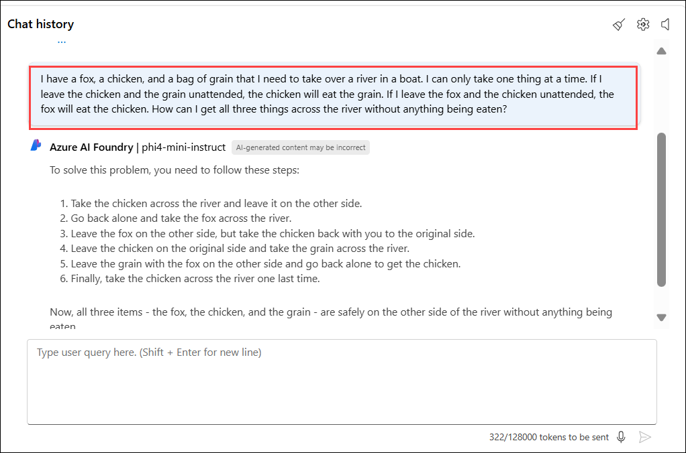 

1. Then, enter the following follow-up query:

    ```
    Explain your reasoning.
    ```    

     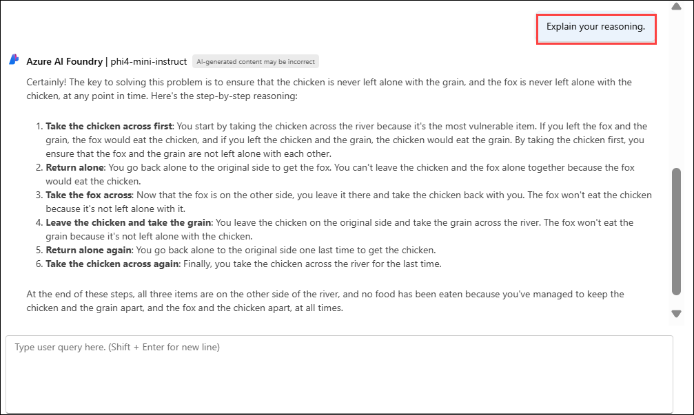    

#### Perform a further comparison    

1. Use the drop-down list in the **Setup** pane to switch between your models, testing both models with the following puzzle (the correct answer is `40!`):

1. Provide the following puzzle in the **Phi-4 model** chat:

    ```
    I have 53 socks in my drawer: 21 identical blue, 15 identical black and 17 identical red. The lights are out, and it is completely dark. How many socks must I take out to make 100 percent certain I have at least one pair of black socks?
    ```   

     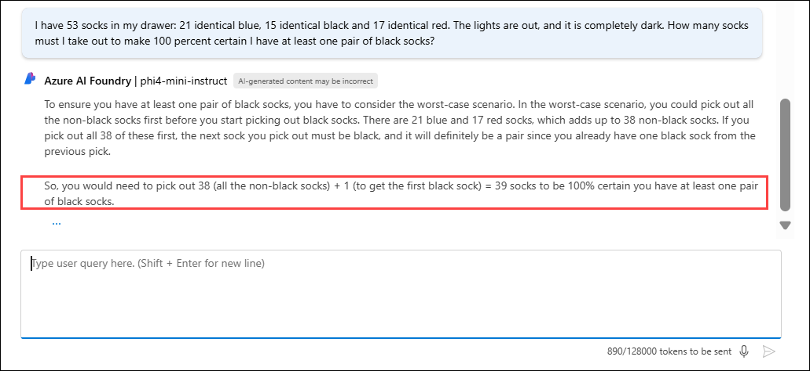    

1. Select the `gpt 4.1` model from the drop-down list in the **Setup** pane:

    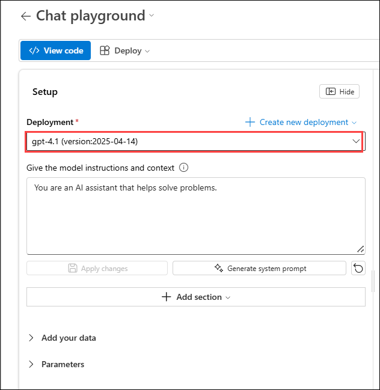 

1. Provide the following puzzle in chat:

    ```
    I have 53 socks in my drawer: 21 identical blue, 15 identical black and 17 identical red. The lights are out, and it is completely dark. How many socks must I take out to make 100 percent certain I have at least one pair of black socks?
    ```   

1. View the result:

    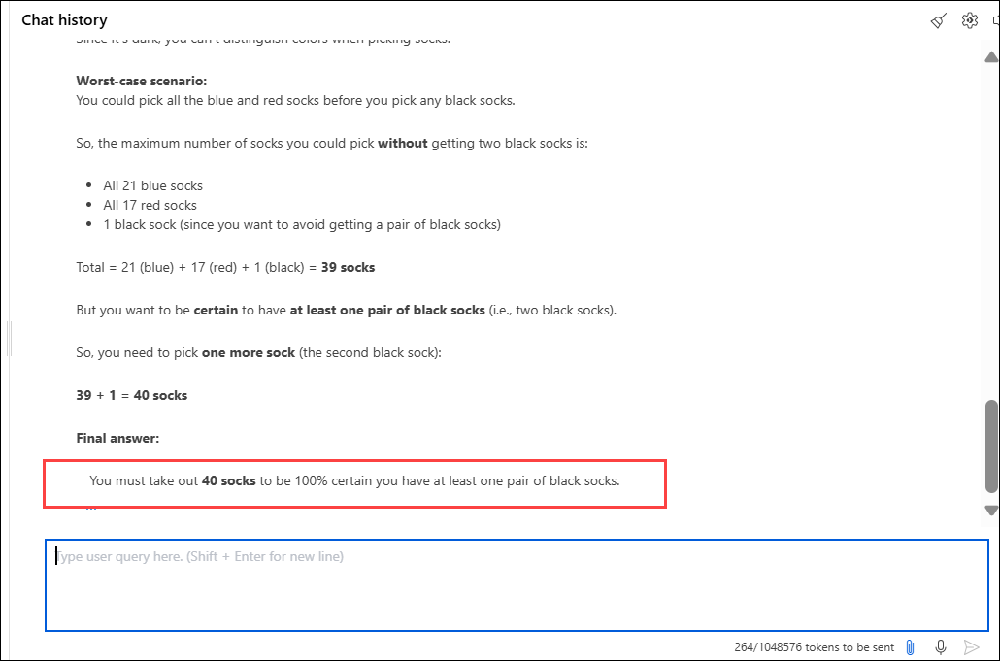    

### Reflect on the models

You've compared two models, which may vary in terms of both their ability to generate appropriate responses and in their cost. In any generative scenario, you need to find a model with the right balance of suitability for the task you need it to perform and the cost of using the model for the number of requests you expect it to have to handle.

The details and benchmarks provided in the model catalog, along with the ability to visually compare models provides a useful starting point when identifying candidate models for a generative AI solution. You can then test candidate models with a variety of system and user prompts in the chat playground.

## Summary 

In this lab, you explored the Azure AI Foundry model catalog, reviewing details and benchmarks for models such as **gpt-4.1** and **Phi-4-mini-instruct**. You compared models based on quality, accuracy, and cost, then created an Azure AI Foundry project and deployed the gpt-4.1 model. You tested the model in the chat playground, providing system instructions and queries, and later deployed the Phi-4-mini-instruct model to compare its performance. By the end, you gained hands-on experience in managing AI projects, deploying models, testing their responses, and evaluating models to select the most suitable one for a given task.

### You have successfully completed the Hands-on Lab!


   

