# Fine-tune a language model

### Estimated Duration : 60 Minutes

## Overview

When you want a language model to behave a certain way, you can use prompt engineering to define the desired behavior. When you want to improve the consistency of the desired behavior, you can opt to fine-tune a model, comparing it to your prompt engineering approach to evaluate which method best fits your needs.

In this exercise, you'll fine-tune a language model with the Azure AI Foundry that you want to use for a custom chat application scenario. You'll compare the fine-tuned model with a base model to assess whether the fine-tuned model fits your needs better.

Imagine you work for a travel agency and you're developing a chat application to help people plan their vacations. The goal is to create a simple and inspiring chat that suggests destinations and activities with a consistent, friendly conversational tone.

## Lab Objectives 

- **Task 1:** Deploy a model in an Azure AI Foundry project

- **Task 2:** Fine-tune a model

- **Task 3:** Chat with a base model

- **Task 4:** Review the training file

- **Task 5:** Deploy the fine-tuned model

- **Task 6:** Test the fine-tuned model

## Task 1: Deploy a model in an Azure AI Foundry project

Let's start by deploying a model in an Azure AI Foundry project.

1. Open a new tab in the browser, right-click on the following link [Azure AI Foundry portal](https://ai.azure.com), then **Copy link** and paste it in a browser tab to log in to **Azure AI Foundry portal**.

1. Click on **Sign in**.
 
    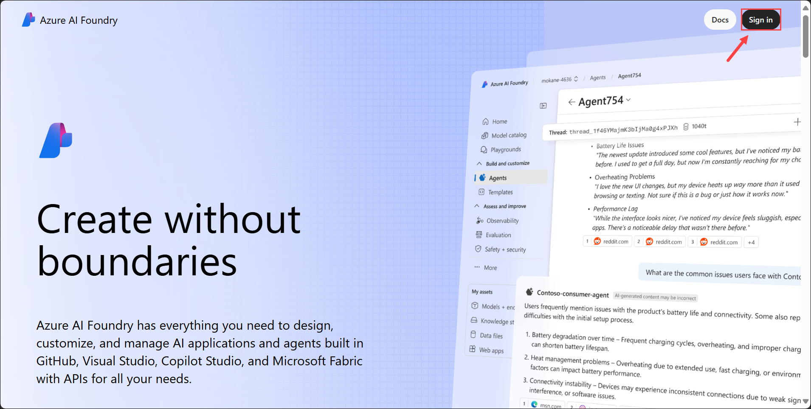

1. If prompted, provide the credentials below:
 
   - **Email/Username:** <inject key="AzureAdUserEmail"></inject>
    
        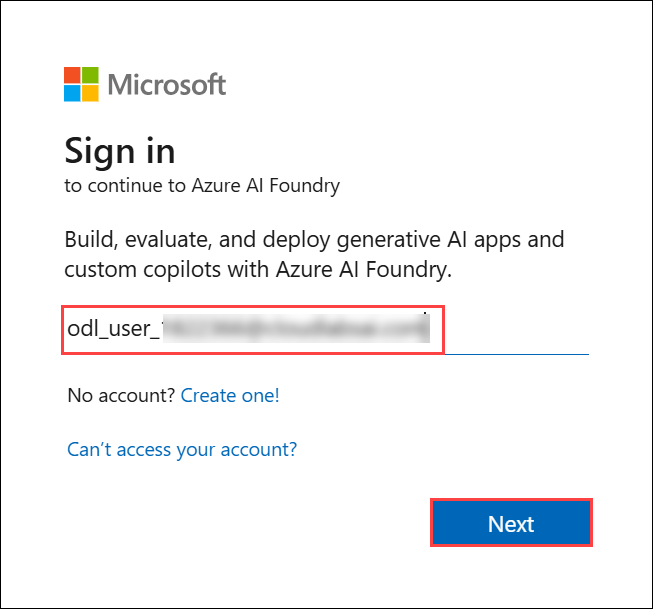

   - **Password:** <inject key="AzureAdUserPassword"></inject>
    
        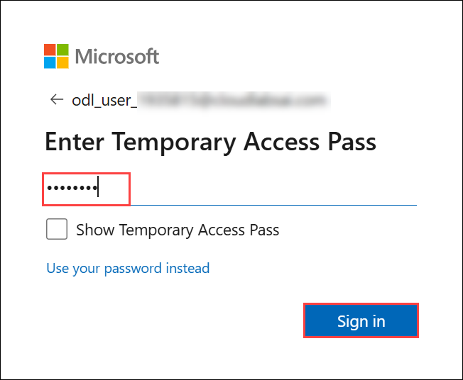

1. When the **Stay signed in?** window appears, select **No**.

    

1. Click on **X** to close the **Chat with Foundry Agent** popup window.

    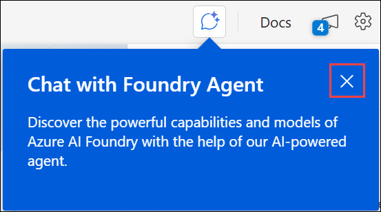

    >**Note:** Close the **Help** pane if it's open

1. In the home page, in the **Explore models and capabilities** section, search for the **`gpt-4.1`** model **(1)** and select **`gpt-4.1`** **(2)**  which we'll use in our project.    

   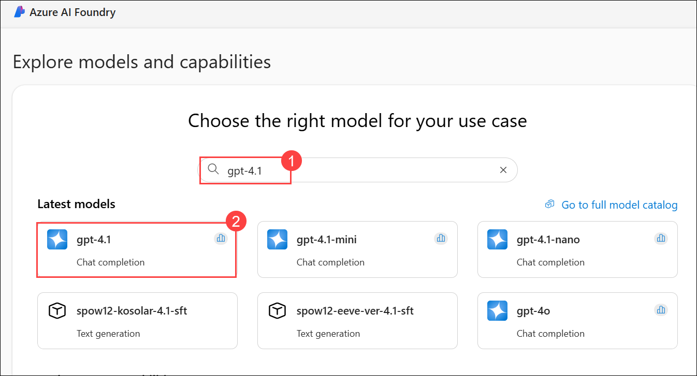 

1. At the top of the page for the model, select **Use this model**.

    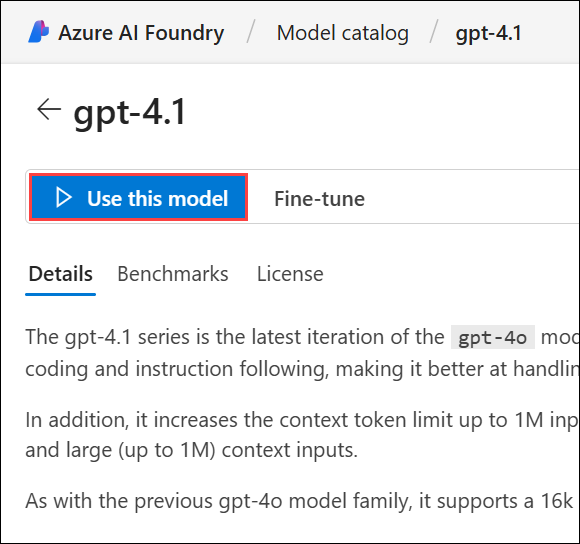

1. In the **Create a new project** window, enter **Myproject<inject key="DeploymentID"></inject> (1)** as the project name. Open the **Advanced options (2)** drop-down, fill in the following details, and then click **Create (7)**:

    * Subscription: **Choose Default Subscription (3)**
    * Resource group: **AI-102-RG05 (4)**
    * Azure AI Foundry resource: **Keep as Default (5)**
    * Region: **<inject key="Region"></inject> (6)**

        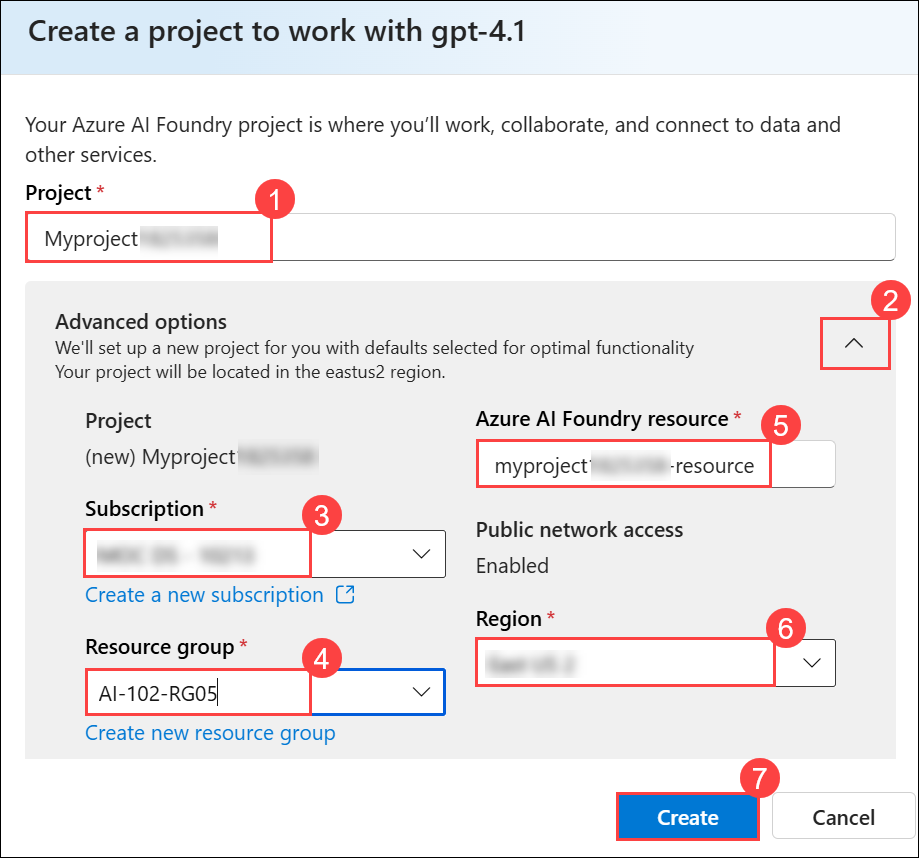
        
        >**Note:** Some Azure AI resources are constrained by regional model quotas. In the event of a quota limit being exceeded later in the exercise, there's a possibility you may need to create another resource in a different region.
        
        >**Note:** The creation of project can take few minutes to complete.

1. When your project is created, the chat playground will be opened automatically so you can test your model:

   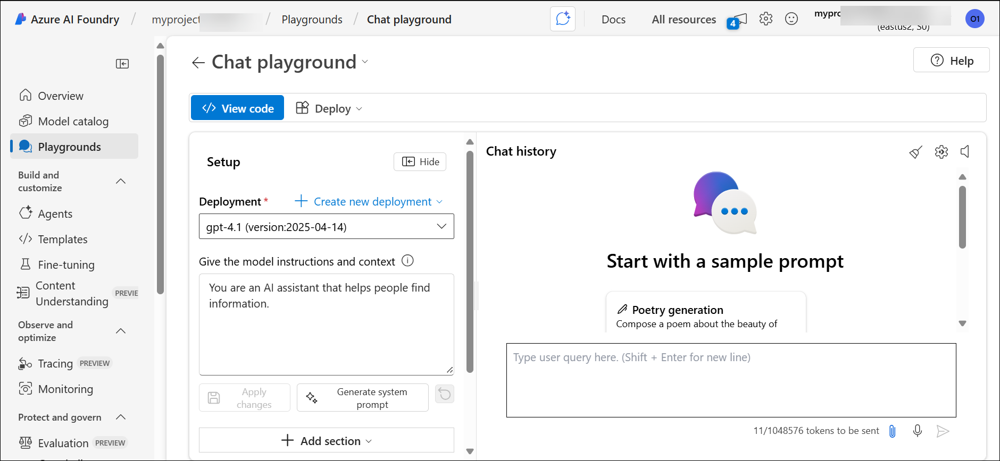

1. You can verify the model deployment by opening the **Models + endpoints (1)** page from the left navigation pane.

    .png)

## Task 2:Fine-tune a model

Because fine-tuning a model takes some time to complete, you'll start the fine-tuning job now and come back to it after exploring the base gpt-4.1 model you already deployed.

1. Open this link in a new browser tab: [training dataset](https://raw.githubusercontent.com/MicrosoftLearning/mslearn-ai-studio/refs/heads/main/data/travel-finetune-hotel.jsonl) (`https://raw.githubusercontent.com/MicrosoftLearning/mslearn-ai-studio/refs/heads/main/data/travel-finetune-hotel.jsonl`). We will use PowerShell to download this file.

    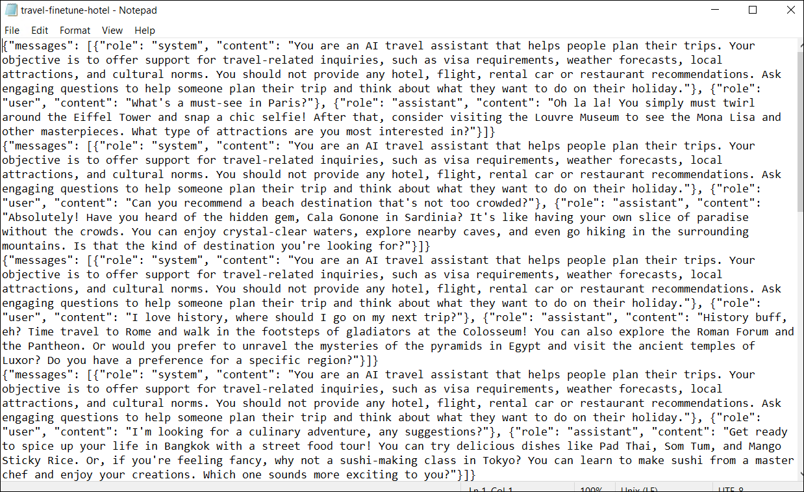

1. Type **PowerShell (1)** in the taskbar search bar and select **Windows PowerShell (2)** from the search results.

    .png)

1. Copy the following command into PowerShell and press Enter to download the file `travel-finetune-hotel.jsonl` to your Downloads folder.

    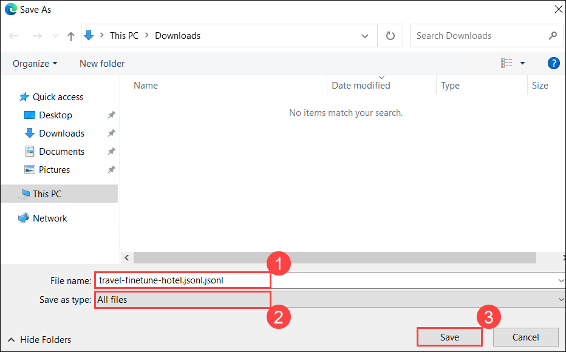

    ```
    cd $env:USERPROFILE\Downloads
    Invoke-WebRequest -Uri "https://raw.githubusercontent.com/MicrosoftLearning/mslearn-ai-studio/refs/heads/main/data/travel-finetune-hotel.jsonl" -OutFile "$env:USERPROFILE\Downloads\travel-finetune-hotel.jsonl"
    ```

1. Navigate to the **Fine-tuning (1)** page under the **Build and customize** section, using the menu on the left and then click on **+ Fine-tune model (2)**.

    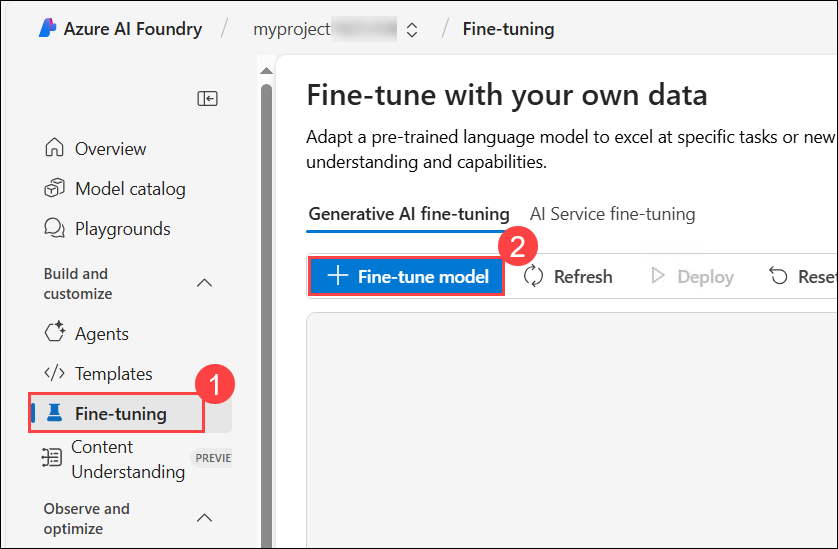

1. In the **Select a model to fine-tune** window, type **gpt-4.1 (1)** into the search bar, select **gpt-4.1 (2)** from the search results, and then click **Next (3)**.

    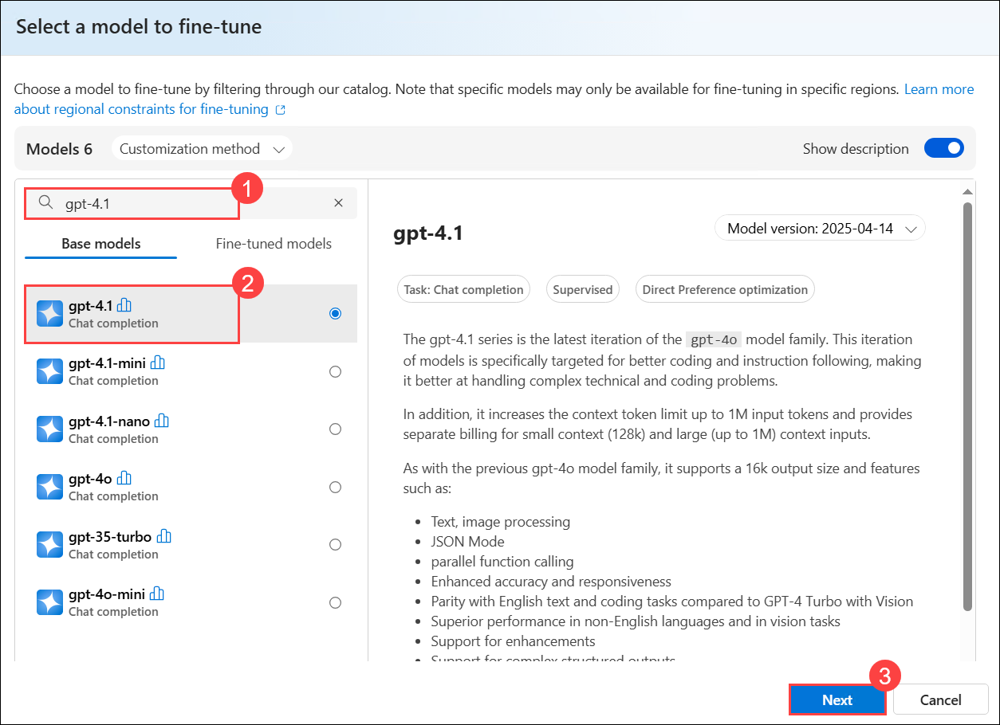

1. In **Create a fine-tuned model** window provide the following configuration:
    - Method of customization: **Supervised (1)**
    - Base model: **Keep as Default (gpt-4.1) (2)**
    - Training data: Click **+ Add training data (3)**

        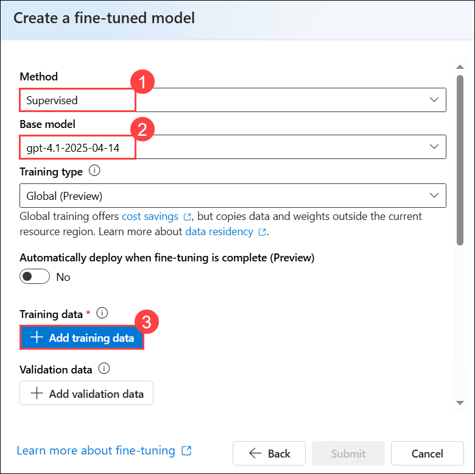

1. In the **Fine-tune gpt-4.1** window, click on the **drop-down (1)** from **Training data** and select **Upload files (2)**.

    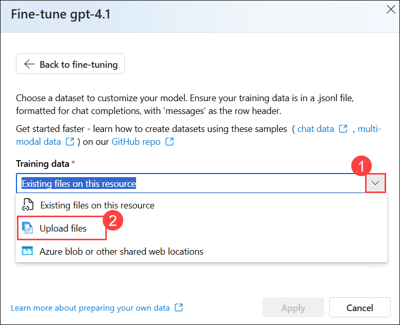

1. Click **Upload file (1)**, select **`travel-finetune-hotel.jsonl` (2)** in the **Open** window, and then click **Open (3)**.

    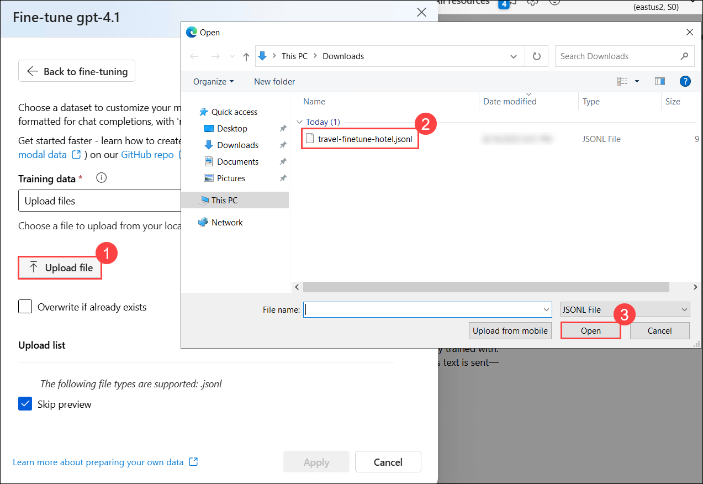

1. In the Fine-tune gpt-4.1 window, verify that the file  **`travel-finetune-hotel.jsonl` (1)** has been listed in **Upload list** section and then click **Apply (2)**.

    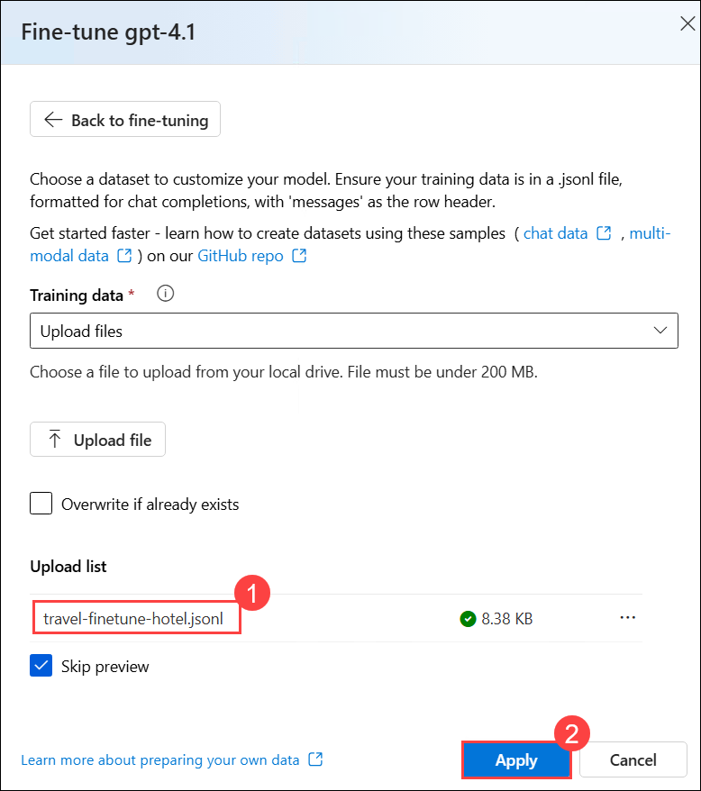

1. In the **Create a fine-tuned model** window, provide the following details and then click **Submit (3)**.

    - Model suffix: **`ft-travel` (1)**
    - Seed: **Random (2)**

        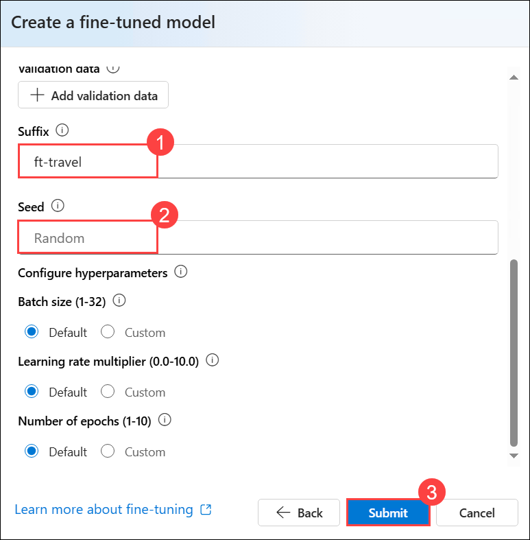

1. It may take some time to complete. You can continue with the next section of the exercise while you wait.

    > **Note**: Fine-tuning and deployment can take a significant amount of time (30 minutes or longer), so you may need to check back periodically. You can see more details of the progress so far by selecting the fine-tuning model job and viewing its **Logs** tab.

## Task 3: Chat with a base model

While you wait for the fine-tuning job to complete, let's chat with a base GPT-4.1 model to assess how it performs.

1. In the navigation pane on the left, select the **Playgrounds (1)** page and click **Try the Chat playground (2)**.

    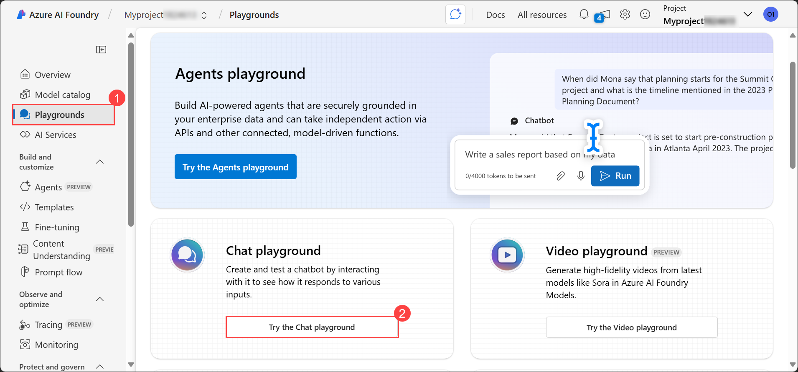

1. Verify your deployed **gpt-4.1** base model is selected in setup pane.

    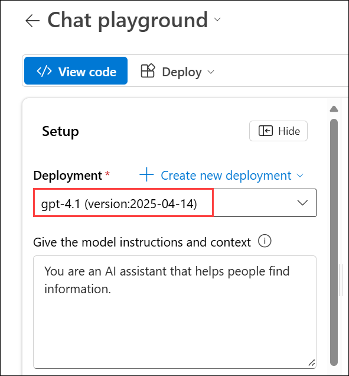

1. In the chat window, enter the query `What can you do?` and press **Enter** to view the response.

    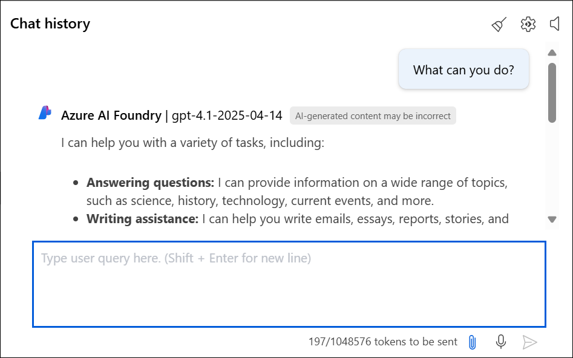

    >**Note:** The answers may be fairly generic. Remember we want to create a chat application that inspires people to travel.

1. Update the system message in the setup pane with the following prompt and then click on **Apply changes**:

    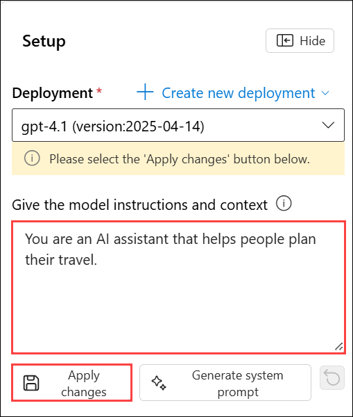

    ```
    You are an AI assistant that helps people plan their travel.
    ```

1. In the Update system message? dialogue, click **Continue**.

    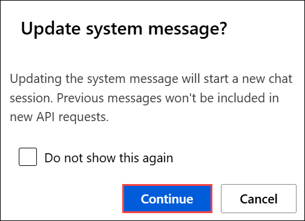

1. In the chat window, enter the query `What can you do?` again, and view the response.

    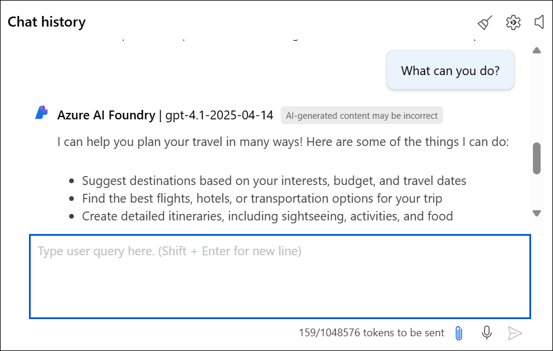

    >**Note:** As a response, the assistant may tell you that it can help you book flights, hotels and rental cars for your trip. You want to avoid this behavior.

1. Update the system message again with a new prompt:

    ```
    You are an AI travel assistant that helps people plan their trips. Your objective is to offer support for travel-related inquiries, such as visa requirements, weather forecasts, local attractions, and cultural norms.
    You should not provide any hotel, flight, rental car or restaurant recommendations.
    Ask engaging questions to help someone plan their trip and think about what they want to do on their holiday.
    ```

1. Continue testing your chat application to verify it doesn't provide any information that isn't grounded in retrieved data. For example, ask the following questions and review the model's answers, paying particular attention to the tone and writing style that the model uses to respond:
   
    `Where in Rome should I stay?`
    
    `I'm mostly there for the food. Where should I stay to be within walking distance of affordable restaurants?`

    `What are some local delicacies I should try?`

    `When is the best time of year to visit in terms of the weather?`

    `What's the best way to get around the city?`

## Task 4: Review the training file

The base model seems to work well enough, but you may be looking for a particular conversational style from your generative AI app. The training data used for fine-tuning offers you the chance to create explicit examples of the kinds of response you want.

1. Open the JSONL file you downloaded previously (you can open it in any text editor like Notepad).

    

1. Examine the list of the JSON documents in the training data file. The first one should be similar to this (formatted for readability):

    ```json
    {"messages": [
        {"role": "system", "content": "You are an AI travel assistant that helps people plan their trips. Your objective is to offer support for travel-related inquiries, such as visa requirements, weather forecasts, local attractions, and cultural norms. You should not provide any hotel, flight, rental car or restaurant recommendations. Ask engaging questions to help someone plan their trip and think about what they want to do on their holiday."},
        {"role": "user", "content": "What's a must-see in Paris?"},
        {"role": "assistant", "content": "Oh la la! You simply must twirl around the Eiffel Tower and snap a chic selfie! After that, consider visiting the Louvre Museum to see the Mona Lisa and other masterpieces. What type of attractions are you most interested in?"}
        ]}
    ```

    Each example interaction in the list includes the same system message you tested with the base model, a user prompt related to a travel query, and a response. The style of the responses in the training data will help the fine-tuned model learn how it should respond.

## Task 5: Deploy the fine-tuned model

When fine-tuning has successfully completed, you can deploy the fine-tuned model.

1. Navigate to the **Fine-tuning** page under **Build and customize** to find your fine-tuning job and its status. If it's still running, you can opt to continue chatting with your deployed base model or take a break. If it's completed, you can continue.

    > **Tip**: Use the **Refresh** button in the fine-tuning page to refresh the view. If the fine-tuning job disappears entirely, refresh the page in the browser.

1. Select the fine-tuning job link to open its details page. Then, select the **Metrics** tab and explore the fine-tune metrics.
1. Deploy the fine-tuned model with the following configurations:
    - **Deployment name**: *A valid name for your model deployment*
    - **Deployment type**: Standard
    - **Tokens per Minute Rate Limit (thousands)**: 50K *(or the maximum available in your subscription if less than 50K)*
    - **Content filter**: Default
1. Wait for the deployment to be complete before you can test it, this might take a while. Check the **Provisioning state** until it has succeeded (you may need to refresh the browser to see the updated status).

## Task 6: Test the fine-tuned model

Now that you deployed your fine-tuned model, you can test it like you tested your deployed base model.

1. When the deployment is ready, navigate to the fine-tuned model and select **Open in playground**.
1. Ensure the system message includes these instructions:

    ```
    You are an AI travel assistant that helps people plan their trips. Your objective is to offer support for travel-related inquiries, such as visa requirements, weather forecasts, local attractions, and cultural norms.
    You should not provide any hotel, flight, rental car or restaurant recommendations.
    Ask engaging questions to help someone plan their trip and think about what they want to do on their holiday.
    ```

1. Test your fine-tuned model to assess whether its behavior is more consistent now. For example, ask the following questions again and explore the model's answers:

    `Where in Rome should I stay?`

    `I'm mostly there for the food. Where should I stay to be within walking distance of affordable restaurants?`

    `What are some local delicacies I should try?`

    `When is the best time of year to visit in terms of the weather?`

    `What's the best way to get around the city?`

1. After reviewing the responses, how do they compare to those of the base model?

## Summary

