# Lab 06: Evaluate generative AI model performance

### Estimated Duration: 45 Minutes

## Overview
In this lab, you will use manual and automated evaluations to assess the performance of a generative AI model in Microsoft Foundry. You will begin by creating a hub and project, then deploy gpt-4.1 and gpt-4.1-mini models. After deployment, you will perform manual evaluations by comparing model outputs against expected responses, and then configure automated evaluations using semantic similarity, relevance, F1 score, and fairness metrics. These exercises will give you practical experience in applying evaluation techniques to validate generative AI models.

## Lab Objectives

- **Task 1:** Create an Microsoft Foundry hub and project

- **Task 2:** Deploy models

- **Task 3:** Manually evaluate a model

- **Task 4:** Use automated evaluation

### Task 1: Create an Microsoft Foundry hub and project

In this task, you’ll sign in to Microsoft Foundry, create a new hub, and set up a project. This will provide the workspace you’ll use to deploy and evaluate models.

1. Open a new tab in the browser, right-click on the following link [Foundry portal](https://ai.azure.com), then **Copy link** and paste it in a browser tab to log in to **Microsoft Foundry portal**.

1. Click on **Sign in**.

    

1. If prompted, provide the credentials below:

   - **Email/Username:** <inject key="AzureAdUserEmail"></inject>

     

   - **Password:** <inject key="AzureAdUserPassword"></inject>

     

1. When the **Stay signed in?** window appears, select **No**.

    

1. In the LabVM browser tab, copy and paste the following link  https://ai.azure.com/managementCenter/allResources and select **Create new**.  

    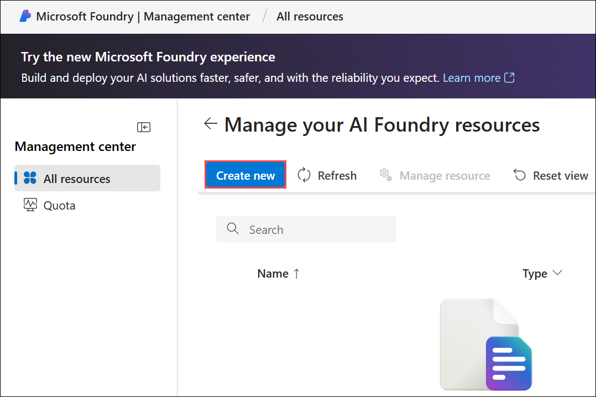

1. In the **Create Project** window, select the option to create a new **AI hub resource (1)**, then click **Next (2)**.

    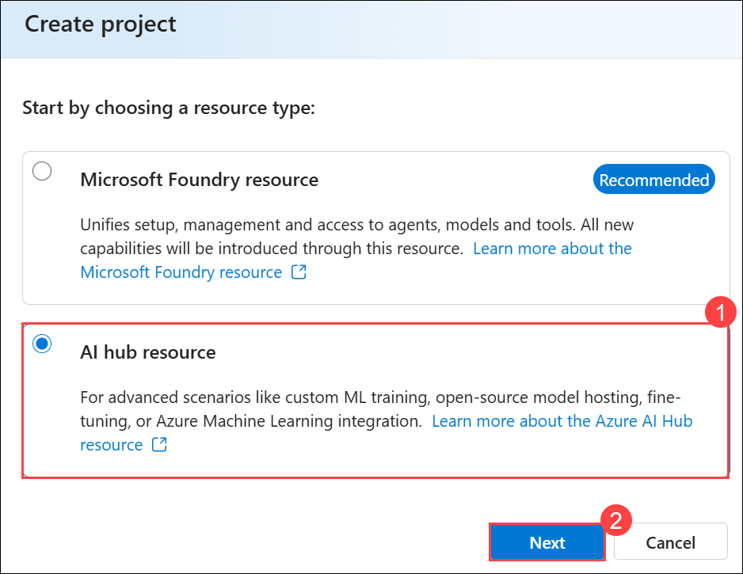

1. Enter the project name as **Myproject<inject key="DeploymentID" enableCopy="false"/> (1)**, then select **Rename hub (2)**. Then rename the hub as  **Myhub<inject key="DeploymentID" enableCopy="false"/> (3)** and then **Next (4)**.

   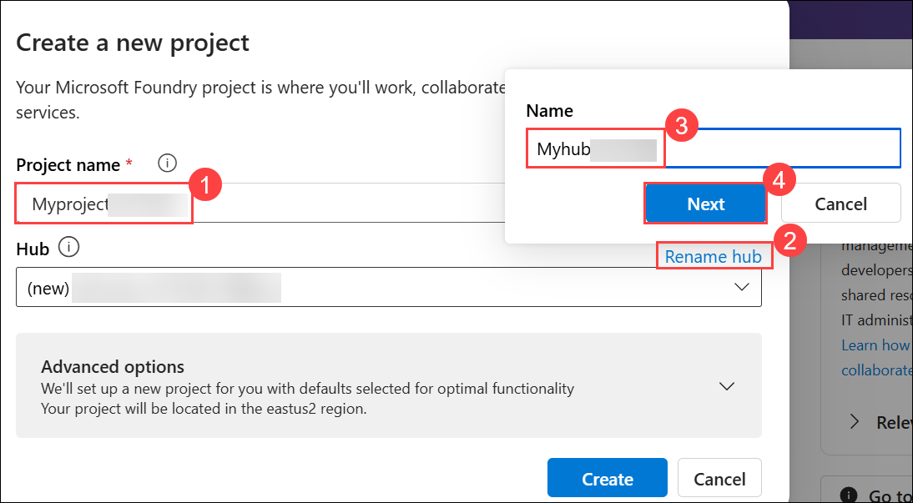

1. Expand **Advanced options (1)**, and specify the following settings for your project and leave the rest as their defaults:

    - Subscription: **Choose Default Subscription (2)**
    - Resuorce group: Select **AI-102-RG07 (3)**
    - Region: Select **<inject key="Region" enableCopy="false" /> (4)**
    - Select **Create (5)**

      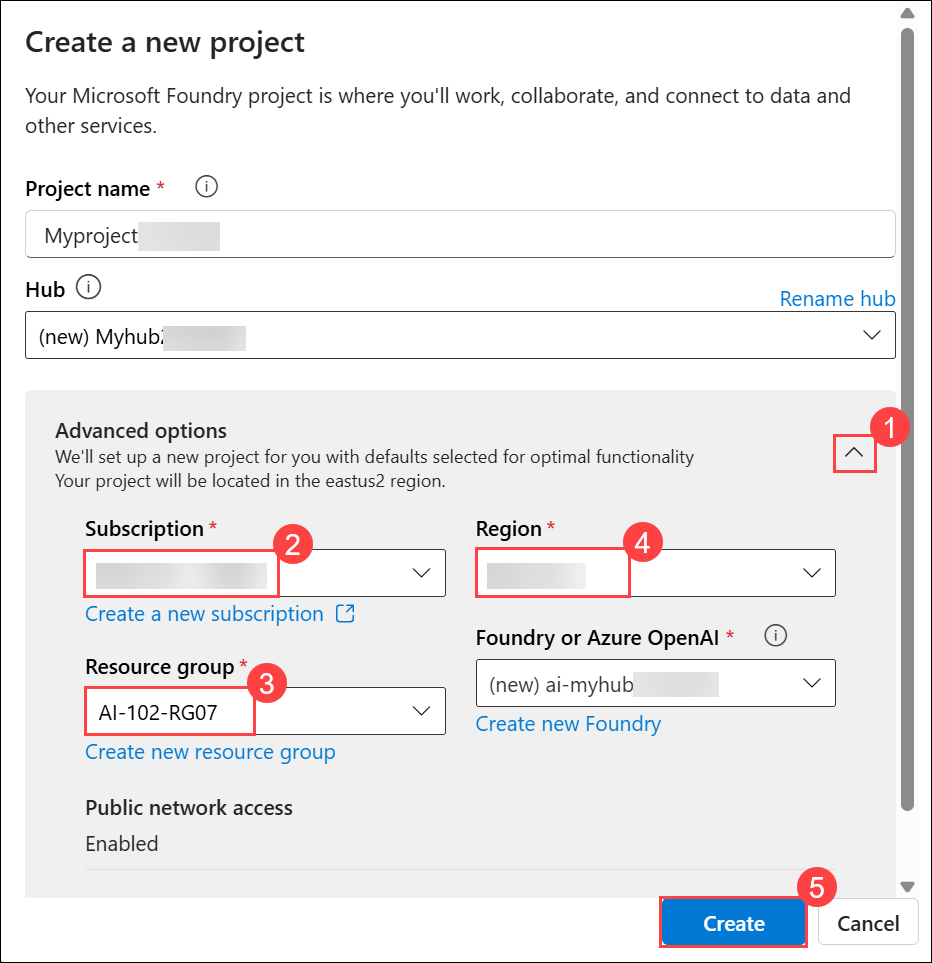    

1. Wait for your project to be created. It may take around 3-5 minutes.

> **Congratulations** on completing the task! Now, it's time to validate it. Here are the steps:
>
> - Hit the Validate button for the corresponding task. If you receive a success message, you can proceed to the next task.
> - If not, carefully read the error message and retry the step, following the instructions in the lab guide.
> - If you need any assistance, please contact us at cloudlabs-support@spektrasystems.com. We are available 24/7 to help.
 
<validation step="30dc4c88-21eb-4fac-bc26-932d1eb6a867" />
 
---    


### Task 2: Deploy models

In this task, you’ll deploy two models in your Microsoft Foundry project: gpt-4.1 and gpt-4.1-mini. The gpt-4.1 model will be used to generate AI-assisted evaluation metrics, while the gpt-4.1-mini model will be the one you evaluate for performance.

1. In the pane on the left for your project, in the My assets section, select the **Models + endpoints (1)** page.

    - On the **Manage deployments of your models and services**, under **Model deployments** tab, select **+ Deploy model (2)** and then select **Deploy base model (3)** from the dropdown.
 
      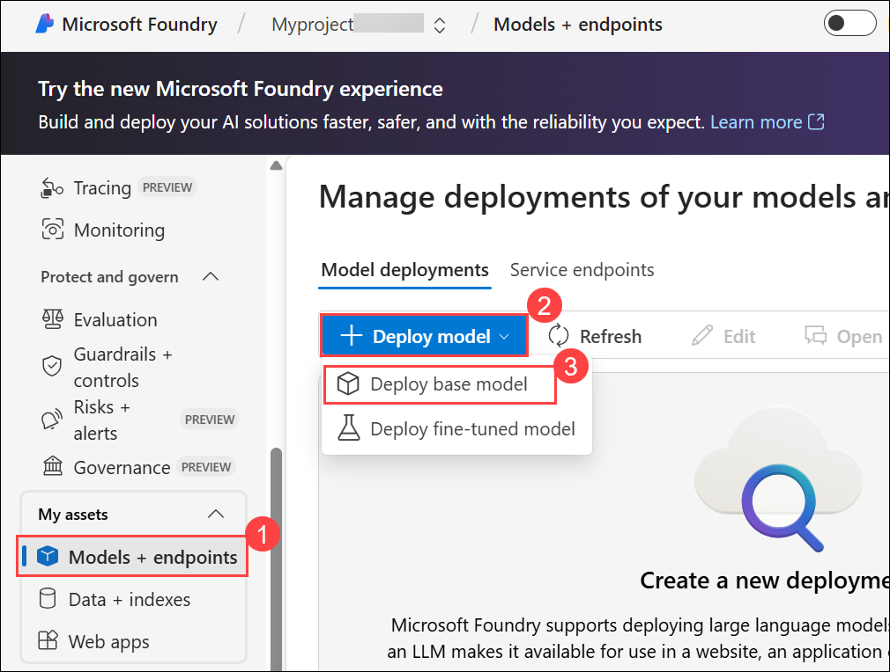  

1. On the **Select a model** page, search for the **gpt-4.1 (1)** model in the list, and then select **(2)** and confirm it **(3)**.

    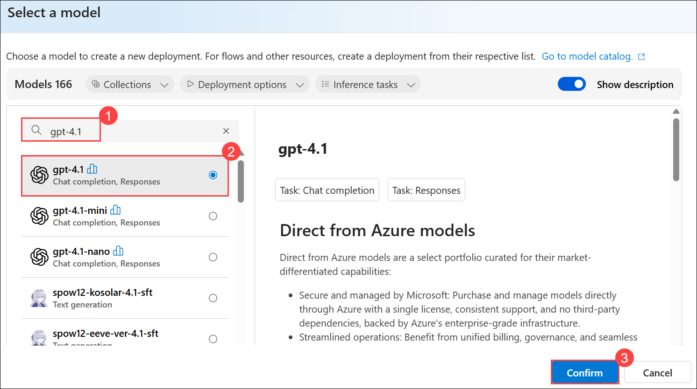

1. On the Deploy `gpt-4.1` page, select **Customize**.

    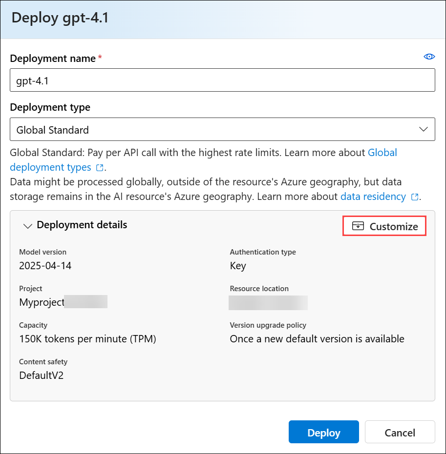

1. Deploy the model with the following settings in the deployment details:

    - Deployment name: Leave the default name
    - Deployment type: **Global Standard**
    - Model version: Select **2025-04-14(Default) (1)**
    - Connected AI resource: Select your Azure OpenAI resource connection that starts with **ai-myhubxxxxxxx** **(2)**
    - Tokens per Minute Rate Limit (thousands): `50K` **(3)** (or the maximum available in your subscription if less than 50K)
    - Content filter: **DefaultV2 (4)**   
    - Then select **Deploy (5)**

      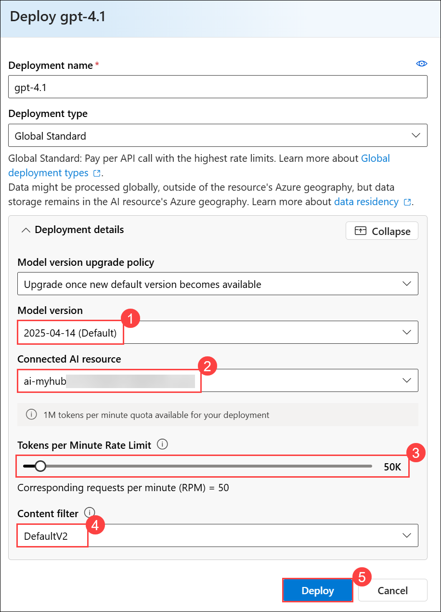

1. Return to the **Models + endpoints (1)** page, then use the back arrow (←) next to the **gpt-4.1** page title to return to the Model deployment page **(2)**.

    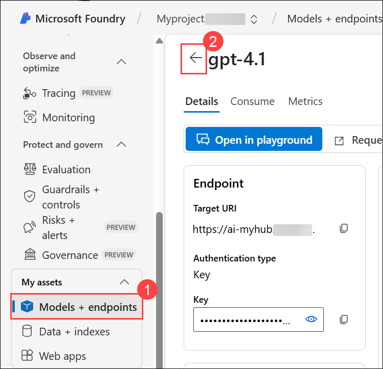

1. From the left navigation menu, under **My assets**, select **Model + endpoints (1)**.

1. On the **Manage deployments of your models and services**, under **Model deployments** tab, select **+ Deploy model (2)** and then select **Deploy base model (3)** from the dropdown.

    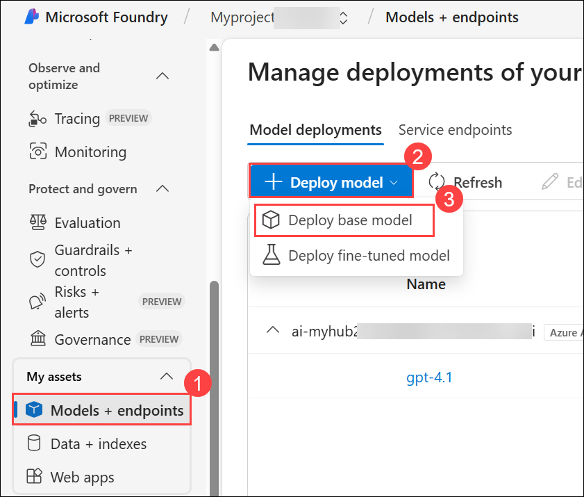

1. On the **Select a model** page, search for the **gpt-4.1-mini (1)** model in the list, and then select **(2)** and confirm it **(3)**.

    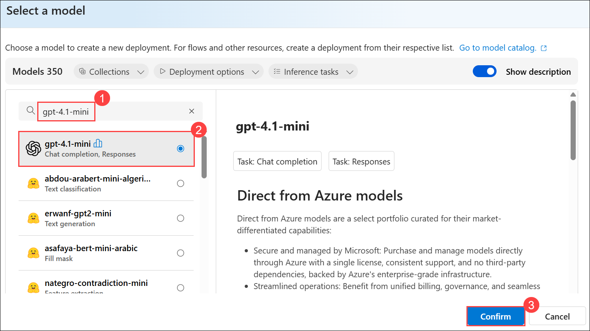

1. On the Deploy `gpt-4.1-mini` page, select **Customize**.

    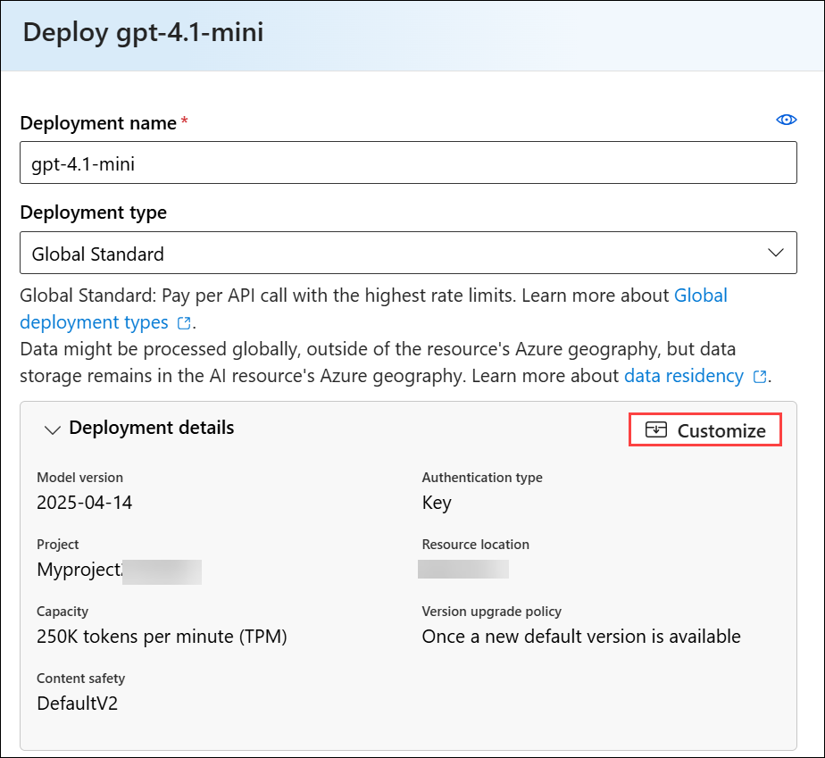

1. Deploy the model with the following settings in the deployment details and leave the other settings to their defaults:

    - Tokens per Minute Rate Limit (thousands): `50K` **(1)** (or the maximum available in your subscription if less than 50K)
    - Then select **Deploy (2)**

      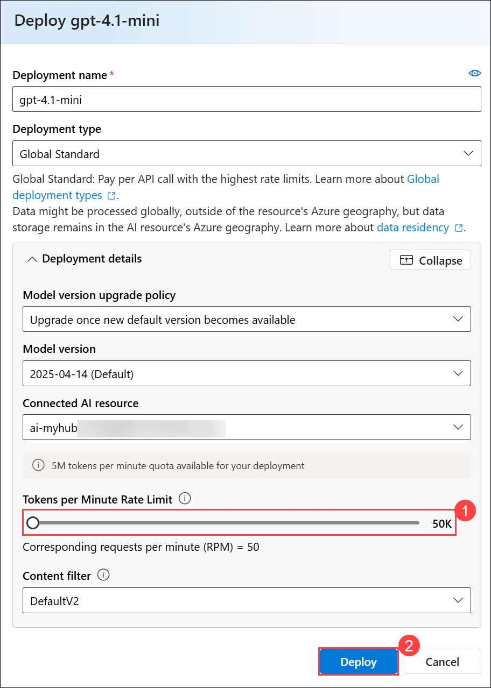
     
> **Congratulations** on completing the task! Now, it's time to validate it. Here are the steps:
>
> - Hit the Validate button for the corresponding task. If you receive a success message, you can proceed to the next task.
> - If not, carefully read the error message and retry the step, following the instructions in the lab guide.
> - If you need any assistance, please contact us at cloudlabs-support@spektrasystems.com. We are available 24/7 to help.
 
<validation step="fc8a5d2f-ebc4-4442-b5d0-f546af53bdbb" />
 
---   


### Task 3: Manually evaluate a model

In this task, you’ll perform a manual evaluation by uploading a dataset of travel related queries and comparing model outputs against expected responses. You’ll score the results to measure the accuracy and quality of the model’s responses.

1. Right click on the following link [travel_evaluation_data.jsonl](https://raw.githubusercontent.com/MicrosoftLearning/mslearn-ai-studio/refs/heads/main/data/travel_evaluation_data.jsonl) then select **Copy link** to download the file from `https://raw.githubusercontent.com/MicrosoftLearning/mslearn-ai-studio/refs/heads/main/data/travel_evaluation_data.jsonl`.

1. Press **Ctrl+S** to save the file in a local folder.

1. Navigate to `C:\LabFiles` **(1)**, select **All files (2)** as Save as type. Then name the file as **travel_evaluation_data.jsonl (3)** and then select **Save (4)**. (Be sure to save it as a .jsonl file, not a .txt file.)

    

1. Back on the Microsoft Foundry portal tab, in the navigation pane, in the **Protect and govern** section, select **Evaluation (1)**. In the Evaluation page, navigate to the **Manual evaluations (2)** tab and select **+ New manual evaluation (3)**.

    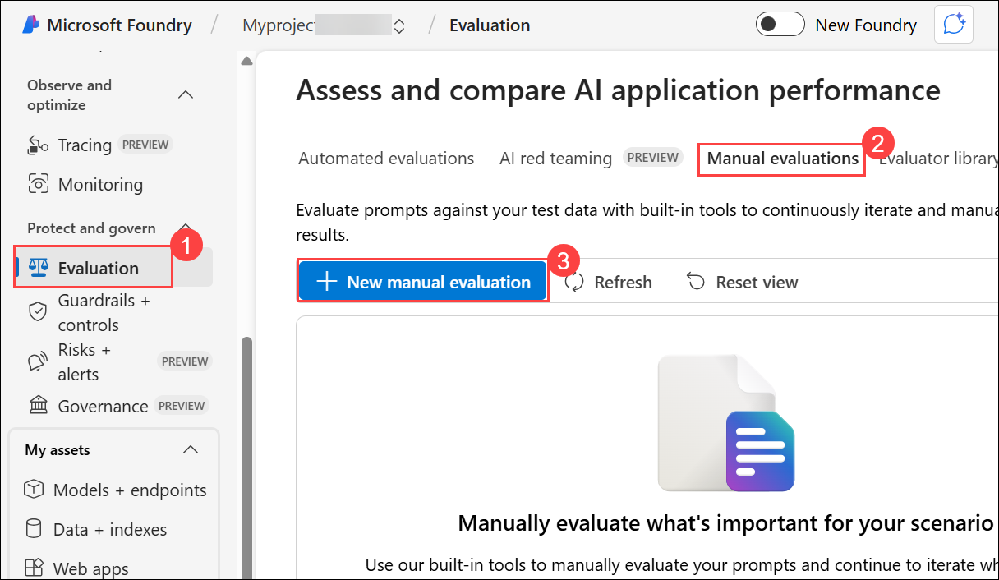

     >**Note:** If the **Create a new evaluation** pane opens automatically, select **Cancel** to close it.

1. In the Configurations section, in the Model list, select your `gpt-4.1` model deployment.    

    

1. Change the **System message** to the following instructions for an AI travel assistant:

    ```
    Assist users with travel-related inquiries, offering tips, advice, and recommendations as a knowledgeable travel agent.
    ```

         

1. In the **Manual evaluation result** section, select **Import test data**.

    

1. Select **Upload file**.

    

1. Navigate to `C:\LabFiles` **(1)**, then select **travel_evaluation_data.jsonl (2)** file you downloaded previously and the **Open (3)**.

    

1. Once the file is uploaded, click on **Next**.

    

1. **Scroll down** to map the dataset fields as follows and the **Add (3)**:

     - **Input**: `Question` **(1)**
     - **Expected response**: `ExpectedResponse` **(2)** 

           

1. Review the questions and expected answers in the test file - you'll use these to evaluate the responses that the model generates.

1. Select **Run** from the top bar to generate outputs for all questions you added as inputs. After a few minutes, the responses from the model should be shown in a new **Output** column, like this:

    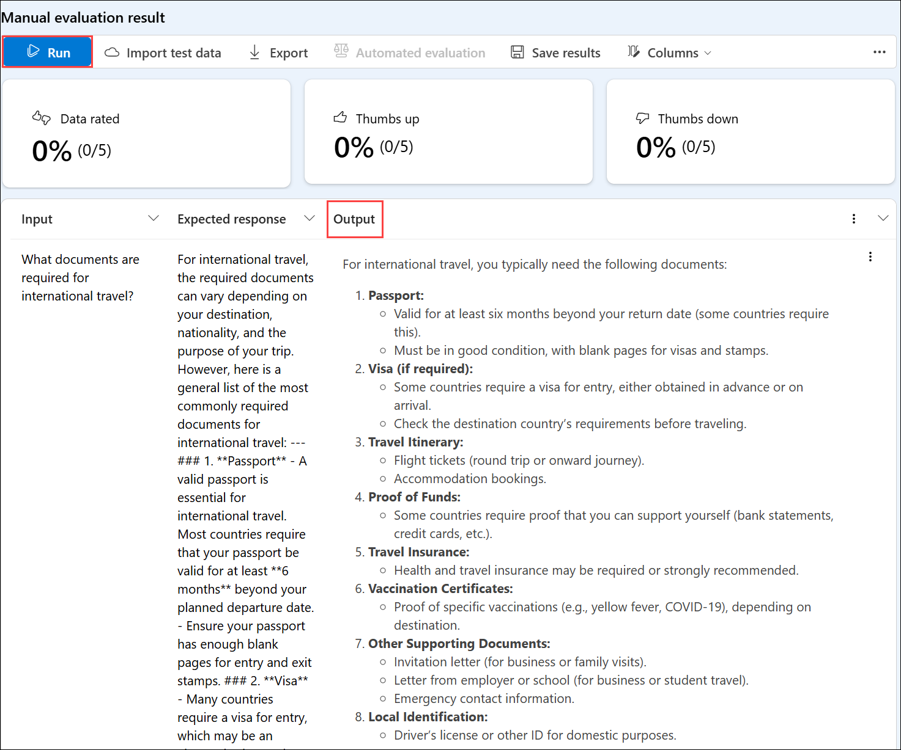

1. Review the outputs for each question, comparing the output from the model to the expected answer and "scoring" the results by selecting the thumbs up or down icon at the bottom right of each response.

1. After you've scored the responses, review the summary tiles above the list. Then in the toolbar, select **Save results**.

    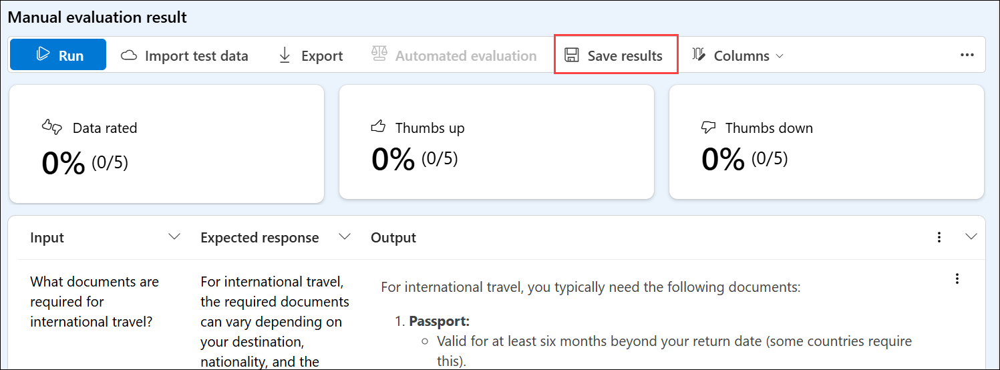

1. Assign a suitable name as **Manualevaluation<inject key="DeploymentID" enableCopy="false"/> (1)** and then **Save (2)**. Saving results enables you to retrieve them later for further evaluation or comparison with a different model.   

    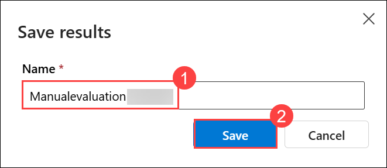

### Task 4: Use automated evaluation

In this task, you’ll configure automated evaluators to assess your model outputs. Automated evaluation provides standardized metrics such as semantic similarity, relevance, F1 score, and fairness. This helps you quickly compare models and prompts without relying only on manual reviews.

1. Use the back arrow **(←)** next to the Manual evaluation page title to return to the Evaluation page.

    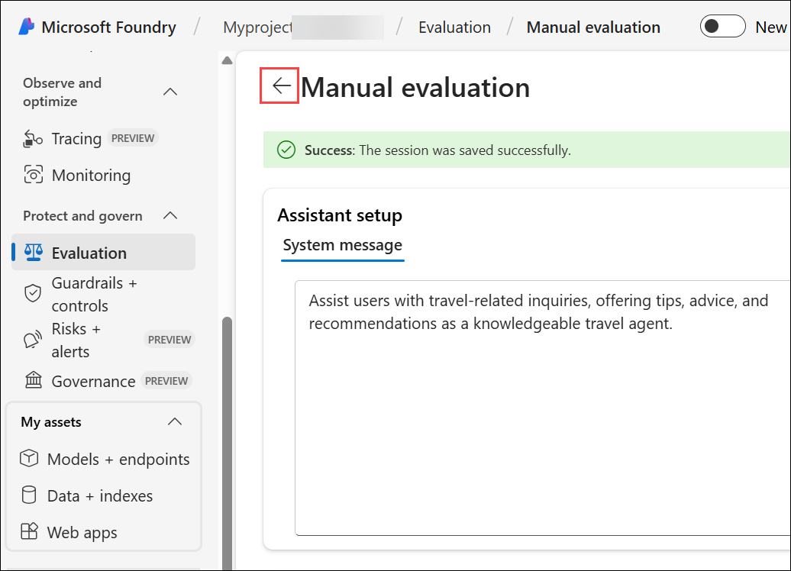

1. Navigate to the **Automated evaluations (1)** tab. Select **Create a new evaluation (2)**.

    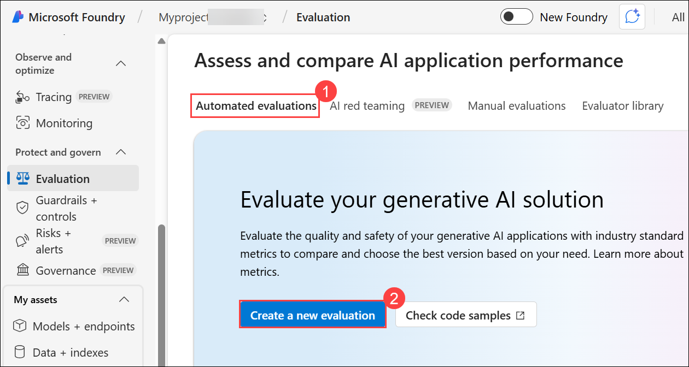

1. When prompted, select the option to **evaluate a Evaluate a model (1)** and select **Next (2)**.

    

1. On the Select data source page, select **Use your dataset (1)** and select the **travel_evaluation_data_jsonl_xxxx... (2)** dataset based on the file you uploaded previously, and select **Next (3)**.   

    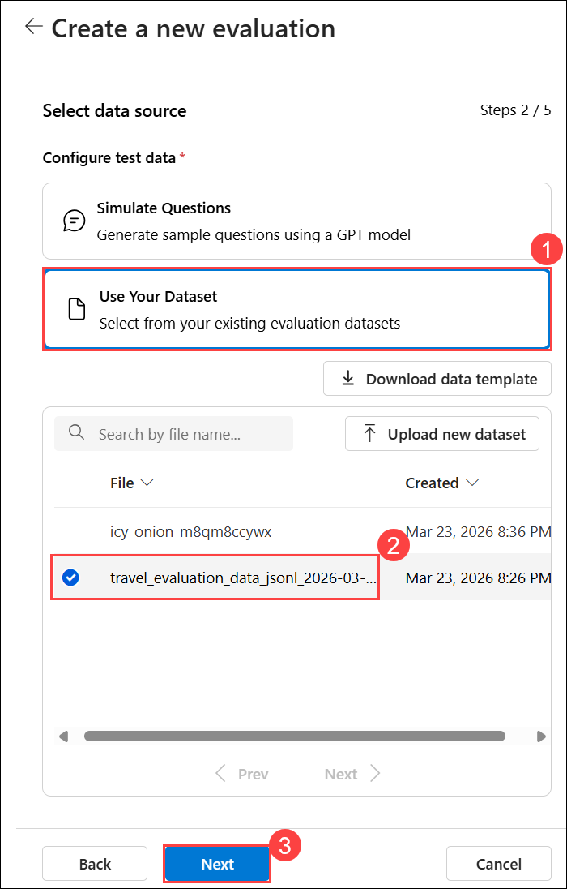

1. On the **Test your model** page,

    - Select the **gpt-4.1-mini (1)** model - Change the **System message** to the same instructions for an AI travel assistant you used previously **(2)**:

      ```
      Assist users with travel-related inquiries, offering tips, advice, and recommendations as a knowledgeable travel agent.
      ```
    - For the **query** field, select **\{\{item.question\}\}** **(3)**

    - Select **Next (4)** to move to the next page.

   
         

1. On the **Configure evaluators** page, use the **+ Add (1)** button to add the following evaluators, configuring each one as follows:

    - Select **Model scorer (2)**:      

      

    - **Criteria name:** Select the **Semantic_similarity (1)** preset
    - **Grade with:** Select your **gpt-4.1 (2)** model

      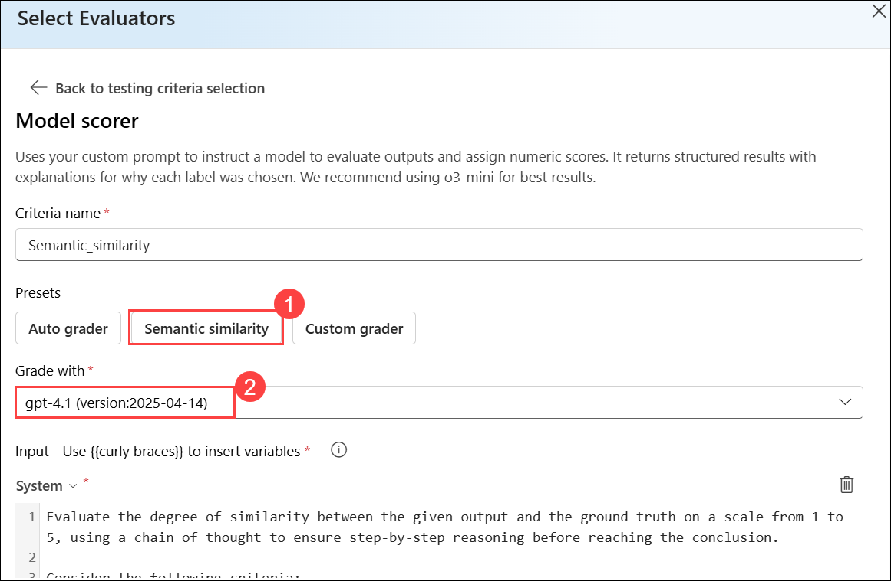   

    - **User** settings (at the bottom): Delete the existing setting and the following **(1)** and the **Add (2)**:

      **Output:** \{\{sample.output_text\}\}<br>
      **Ground Truth:** \{\{item.ExpectedResponse\}\}<br>
      <br>

             

1. On the **Configure evaluators** page, use the **+ Add (1)** button, select  **Likert-scale evaluator (2)**:

       

1. On the **Likert-scale evaluator** page,  provide the following details and then **Add (4)**:

    - **Criteria name:** Select the **Relevance (1)** preset
    - **Grade with:** Select your **gpt-4.1 (2)** model
    - **Query:** \{\{item.question\}\} **(3)**

      

1. On the **Configure evaluators** page, use the **+ Add (1)** button, select  **Text similarity (2)**:

           

1. On the **Text similarity** page, provide the following details and then **Add (3)**

    - **Criteria name:** Select the **F1_Score (1)** preset
    - **Ground truth:** \{\{item.ExpectedResponse\}\} **(2)**

       

1. On the **Configure evaluators** page, use the **+Add (1)** button, select  **Hateful and unfair content (2)**:

        

1. On the **Hateful and unfair content** page, provide the following details and then **Add (3)**

    - **Criteria name:** Hate_and_unfairness **(1)**
    - **Query:** \{\{item.question\}\} **(2)**

       

1. Select **Next** and review your evaluation settings. You should have configured the evaluation to use the travel evaluation dataset to evaluate the **gpt-4.1-mini** model for semantic similarity, relevance, F1 score, and hateful and unfair language.

       

1. Give the evaluation a suitable name as **Evaluation<inject key="DeploymentID" enableCopy="false"/> (1)**, and **Submit (2)** it to start the evaluation process, and wait for it to complete.

      

1. It may take around 3-5 minutes. You can use the **Refresh** toolbar button to check the status.

1. When the evaluation has completed, scroll down if necessary to review the results.

    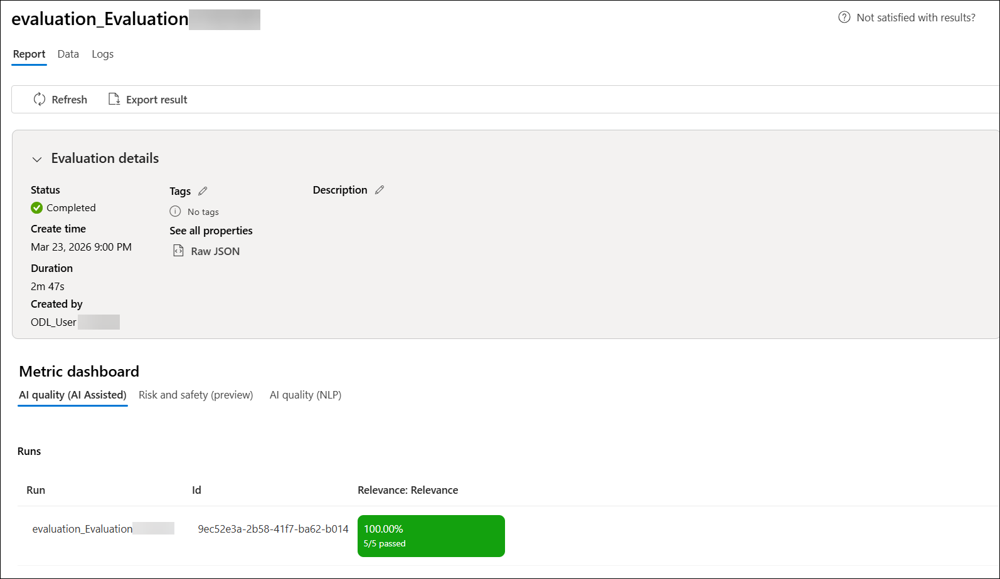   

1. At the top of the page, select the **Data** tab to see the raw data from the evaluation. The data includes the metrics for each input as well as explanations of the reasoning the gpt-4.1 model applied when assessing the responses.

      
      
## Summary

In this lab, you created a hub and project in Microsoft Foundry and deployed the gpt-4.1 and gpt-4.1-mini models. You performed a manual evaluation by importing test data, running the models, and comparing outputs against expected responses. You then configured automated evaluations with metrics such as semantic similarity, relevance, F1 score, and fairness to generate standardized insights. By the end, you gained hands-on experience in deploying models and applying both manual and automated techniques to evaluate generative AI performance.

### You have successfully completed the Hands-on Lab!
