# Lab 07: Evaluate generative AI model performance

## Overview
In this lab, you'll use manual and automated evaluations to assess the performance of a model in the Azure AI Foundry portal.

### Task 1: Create an Azure AI Foundry hub and project

1. Open a new tab in the browser, right-click on the following link [Azure AI Foundry portal](https://ai.azure.com), then **Copy link** and paste it in a browser tab to log in to **Azure AI Foundry portal**.

1. Click on **Sign in**.

    

1. If prompted, provide the credentials below:

   - **Email/Username:** <inject key="AzureAdUserEmail"></inject>

   - **Password:** <inject key="AzureAdUserPassword"></inject>

1. In the LabVM browser tab, copy and paste the following link  https://ai.azure.com/managementCenter/allResources and select **Create new**.  

    

1. In the Create a project wizard, select **AI hub resource**.

   

1. Enter the project name as **Myproject<inject key="DeploymentID" enableCopy="false"/> (1)**, then select **Rename hub (2)**. Then rename the hub as  **Myhub<inject key="DeploymentID" enableCopy="false"/> (3)** and then **Next (4)**.

   

1. Expand **Advanced options (1)**, and specify the following settings for your project and leave the rest as their defaults:

    - Resuorce group: Select **AI-102-RG07 (2)**
    - Region: Select **<inject key="Region" enableCopy="false" /> (3)**
    - Select **Create (4)**

      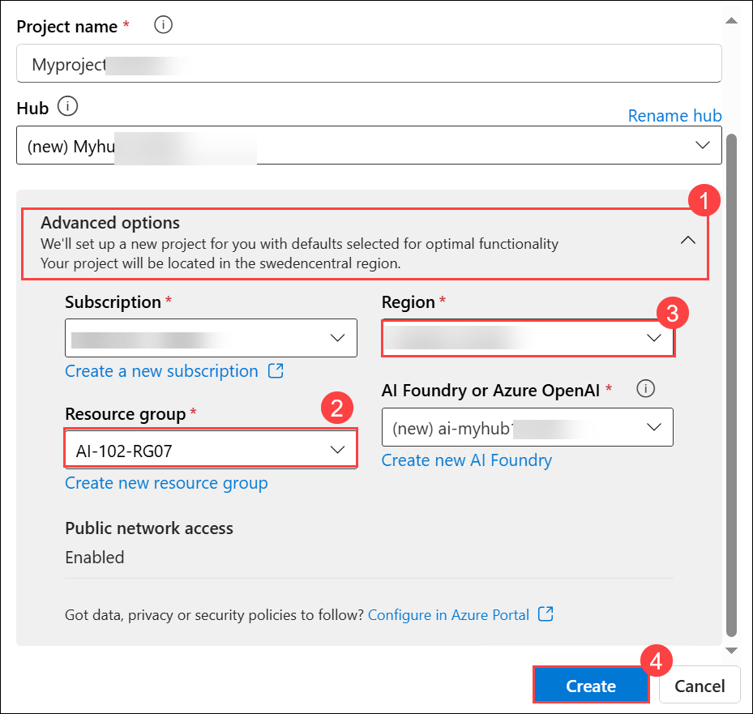    

1. Wait for your project to be created. It may take around 3-5 minutes.


### Task 2: Deploy models

In this lab, you'll evaluate the performance of a gpt-4o-mini model. You'll also use a gpt-4o model to generate AI-assisted evaluation metrics.

1. In the pane on the left for your project, in the My assets section, select the **Models + endpoints (1)** page.

   - In the Models + endpoints page, in the Model deployments tab, in the **+ Deploy model (2)** menu, select **Deploy base model (3)**.
 
        

1. Search for the **gpt-4.1 (1)** model in the list, and then select **(2)** and confirm it **(3)**.

   

1. On the Deploy `gpt-4.1` page, select **Customize**.

   

1. Deploy the model with the following settings in the deployment details:

   - Deployment name: Leave the default name
   - Deployment type: **Global Standard**
   - Model version: Select **2025-04-14(Default) (1)**
   - Connected AI resource: Select your Azure OpenAI resource connection that starts with **ai-myhubxxxxxxx** **(2)**
   - Tokens per Minute Rate Limit (thousands): `60K` **(3)** (or the maximum available in your subscription if less than 50K)
   - Content filter: **DefaultV2 (4)**   
   - Then select **Deploy (5)**

     

1. Return to the **Models + endpoints (1)** page, then use the back arrow (←) next to the **gpt-4.1** page title to return to the Model deployment page **(2)**.

   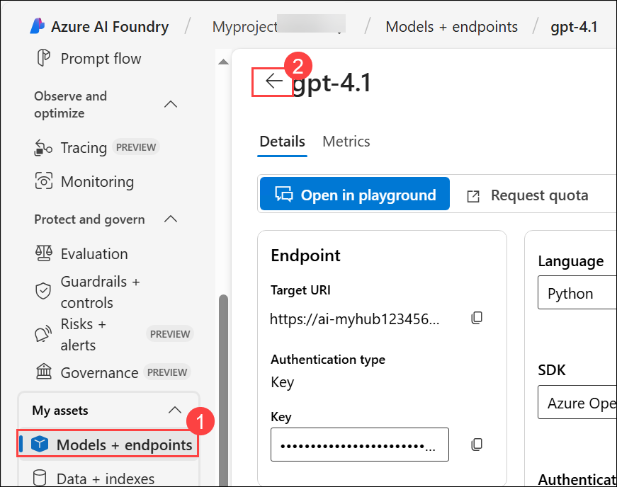

1. In the Models + endpoints page, in the Model deployments tab, in the **+ Deploy model (2)** menu, select **Deploy base model (3)**.

   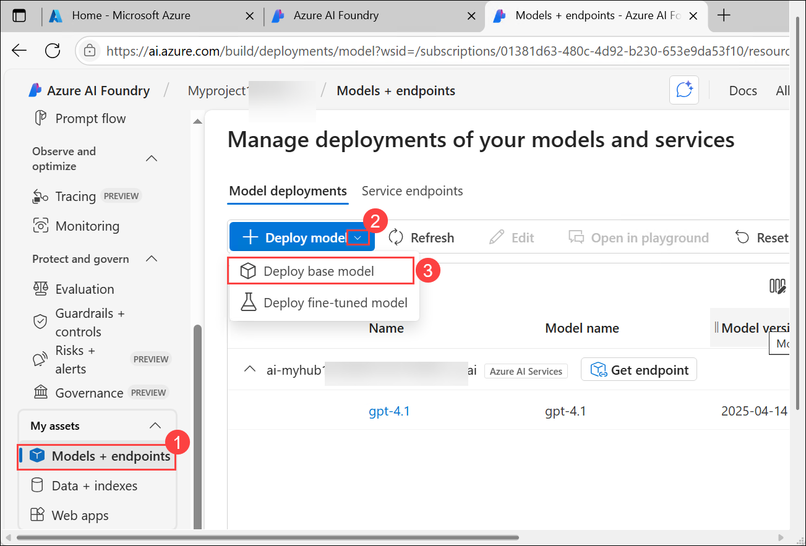

1. Search for the **gpt-4.1-mini (1)** model in the list, and then select **(2)** and confirm it **(3)**.

   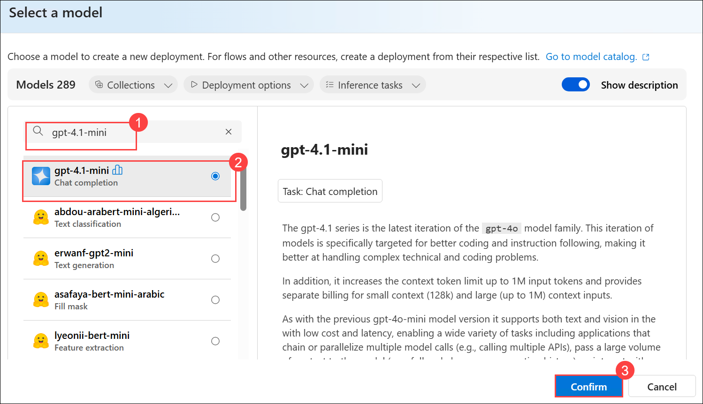

1. On the Deploy `gpt-4.1-mini` page, select **Customize**.

   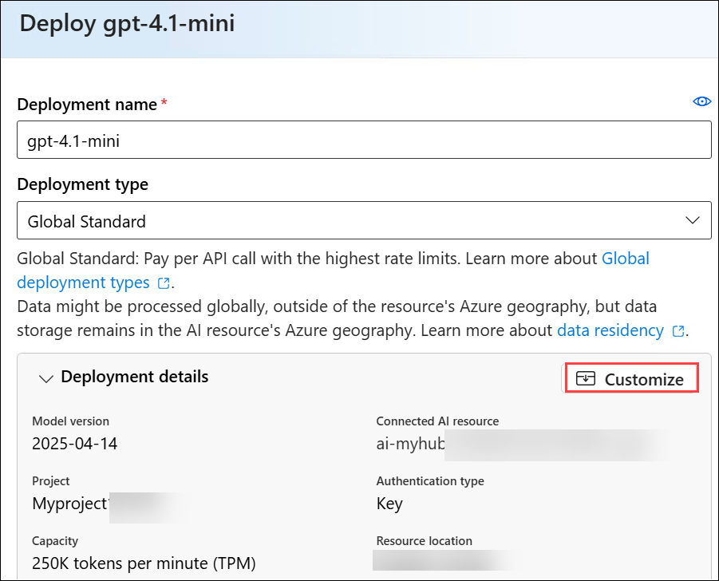

1. Deploy the model with the following settings in the deployment details and leave the other settings to its defaults:

   - Tokens per Minute Rate Limit (thousands): `56K` **(1)** (or the maximum available in your subscription if less than 50K)
   - Then select **Deploy (2)**

     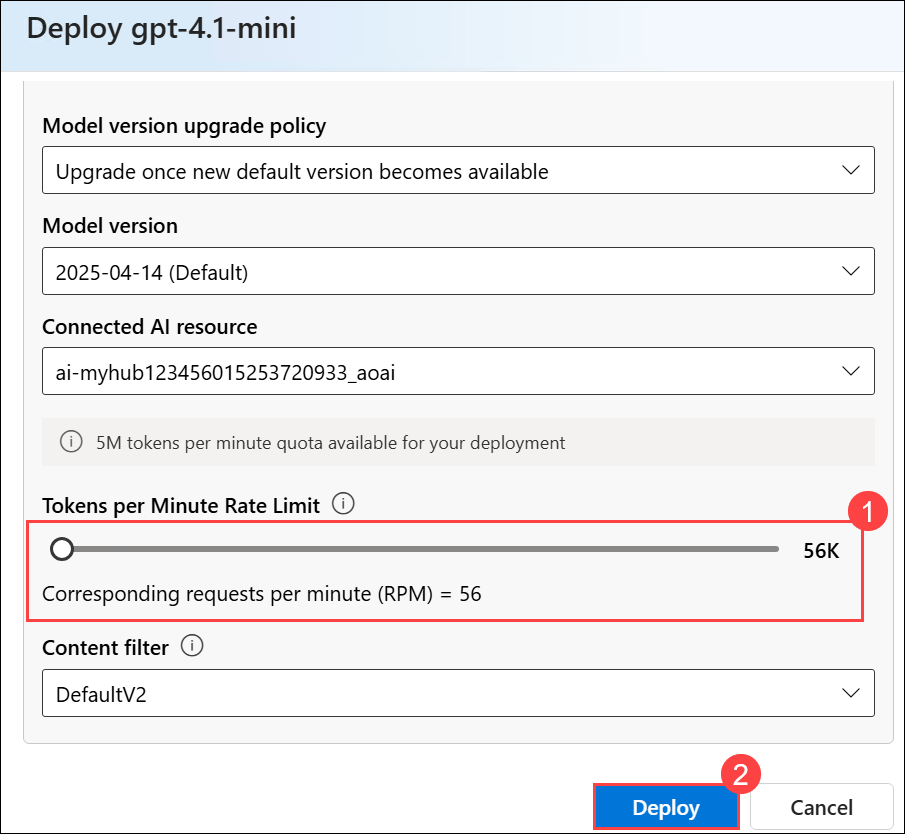


### Task 3: Manually evaluate a model

You can manually review model responses based on test data. Manually reviewing allows you to test different inputs to evaluate whether the model performs as expected.

1. Right click on the following link [travel_evaluation_data.jsonl](https://raw.githubusercontent.com/MicrosoftLearning/mslearn-ai-studio/refs/heads/main/data/travel_evaluation_data.jsonl) then select **Copy link** to download the file from `https://raw.githubusercontent.com/MicrosoftLearning/mslearn-ai-studio/refs/heads/main/data/travel_evaluation_data.jsonl`.

1. Press **Ctrl+S** to save the file in a local folder.

1. Navigate to `C:\LabFiles` **(1)**, select **All files (2)** as Save as type. Then name the fil as **travel_evaluation_data.jsonl (3)** and then select **Save (4)**. (be sure to save it as a .jsonl file, not a .txt file).

   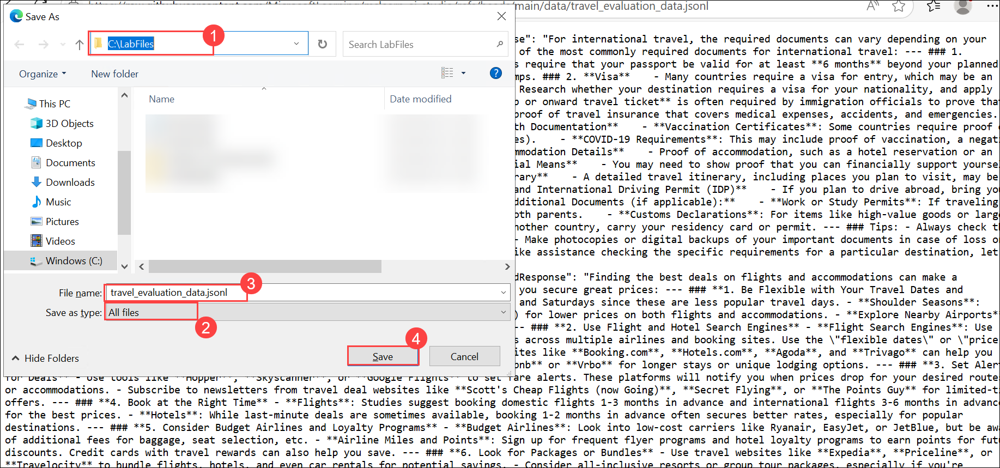

1. Back on the Azure AI Foundry portal tab, in the navigation pane, in the **Protect and govern** section, select **Evaluation (1)**. In the Evaluation page, navigate to the **Manual evaluations (2)** tab and select **+ New manual evaluation (3)**.

   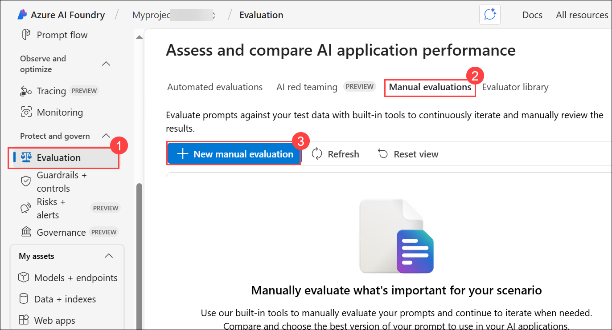

    >**Note**: If the **Create a new evaluation** pane opens automatically, select **Cancel** to close it.

1. In the Configurations section, in the Model list, select your `gpt-4.1` model deployment.    

   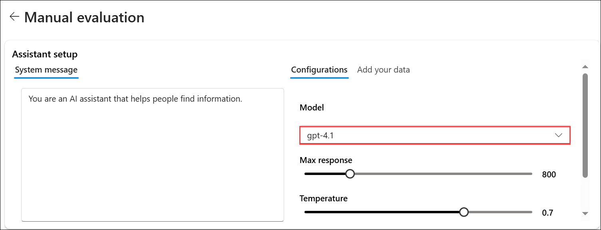

1. Change the **System message** to the following instructions for an AI travel assistant:

    ```
    Assist users with travel-related inquiries, offering tips, advice, and recommendations as a knowledgeable travel agent.
    ```

     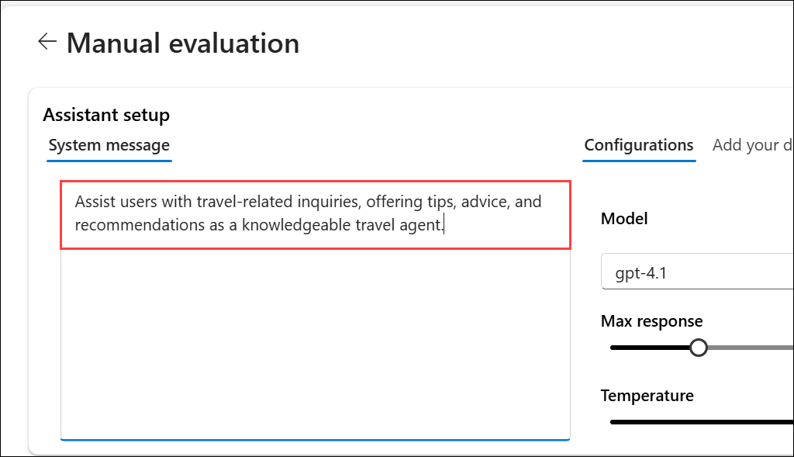    

1. In the **Manual evaluation result** section, select **Import test data**.

   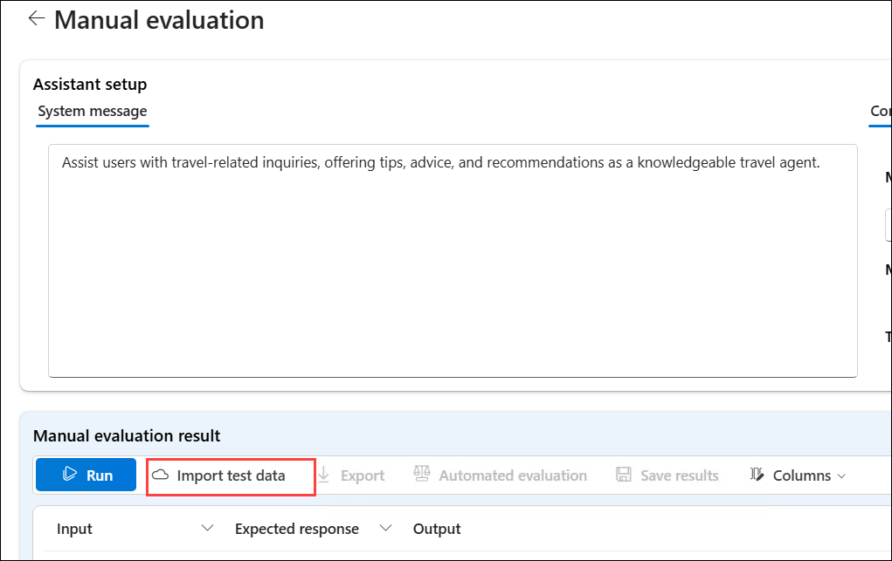

1. Select **Upload file**.

   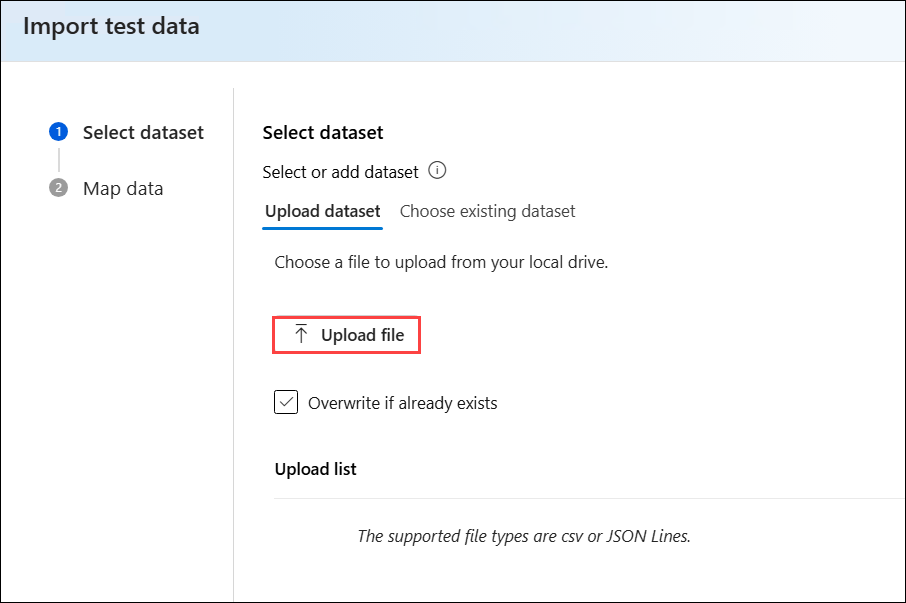

1. Navigate to `C:\LabFiles` **(1)**, then select **travel_evaluation_data.jsonl (2)** file you downloaded previously and the **Open (3)**.

   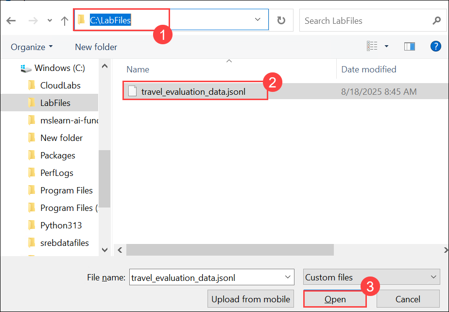

1. Once the file is uploaded, click on **Next**.

   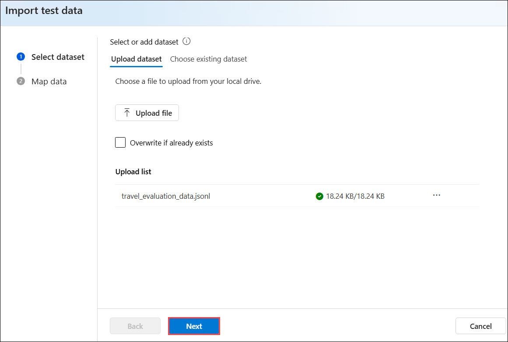

1. **Scroll down** to map the dataset fields as follows and the **Add (3)**:

    - **Input**: `Question` **(1)**
    - **Expected response**: `ExpectedResponse` **(2)** 

      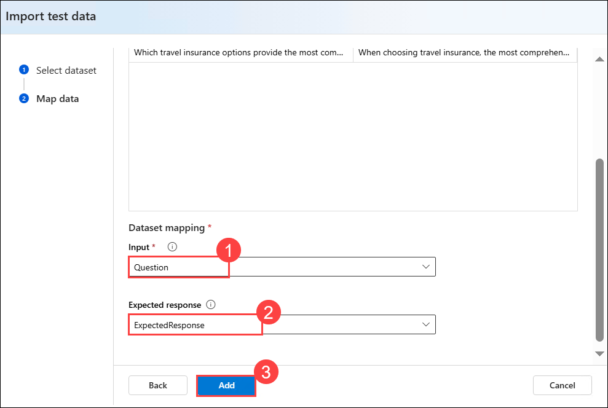    

1. Review the questions and expected answers in the test file - you'll use these to evaluate the responses that the model generates.

1. Select **Run** from the top bar to generate outputs for all questions you added as inputs. After a few minutes, the responses from the model should be shown in a new **Output** column, like this:

   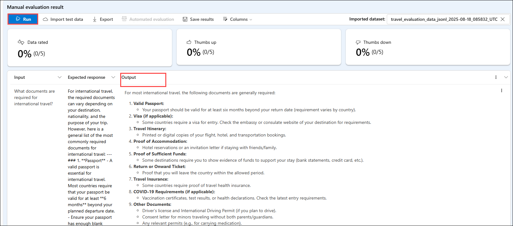

1. Review the outputs for each question, comparing the output from the model to the expected answer and "scoring" the results by selecting the thumbs up or down icon at the bottom right of each response.

1. After you've scored the responses, review the summary tiles above the list. Then in the toolbar, select **Save results**.

   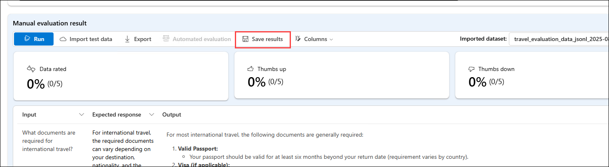

1. Assign a suitable name as **Manualevaluation<inject key="DeploymentID" enableCopy="false"/> (1)** and then **Save (2)**. Saving results enables you to retrieve them later for further evaluation or comparison with a different model.   

   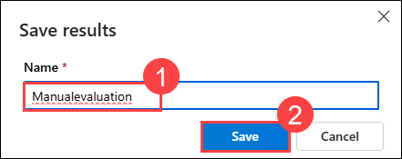

### Task 4: Use automated evaluation

While manually comparing model output to your own expected responses can be a useful way to assess a model's performance, it's a time-consuming approach in scenarios where you expect a wide range of questions and responses; and it provides little in the way of standardized metrics that you can use to compare different model and prompt combinations.

Automated evaluation is an approach that attempts to address these shortcomings by calculating metrics and using AI to assess responses for coherence, relevance, and other factors.

1. Use the back arrow **(←)** next to the Manual evaluation page title to return to the Evaluation page.

   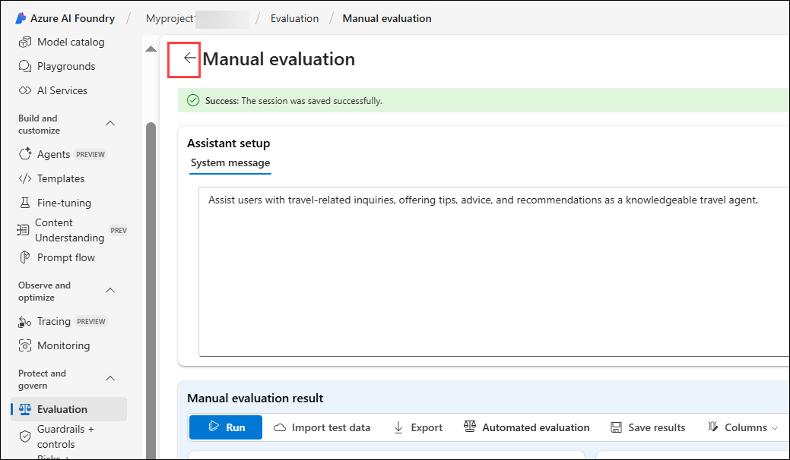

1. Navigate to the **Automated evaluations (1)** tab. Select **Create a new evaluation (2)**.

   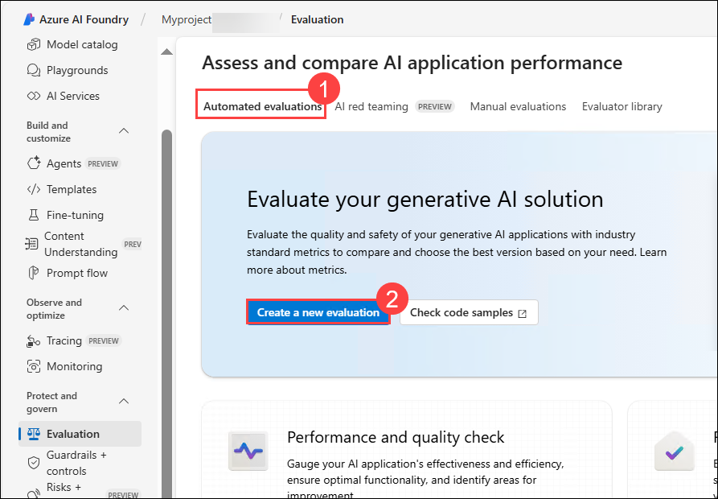

1. When prompted, select the option to **evaluate a Evaluate a model (1)** and select **Next (2)**.

   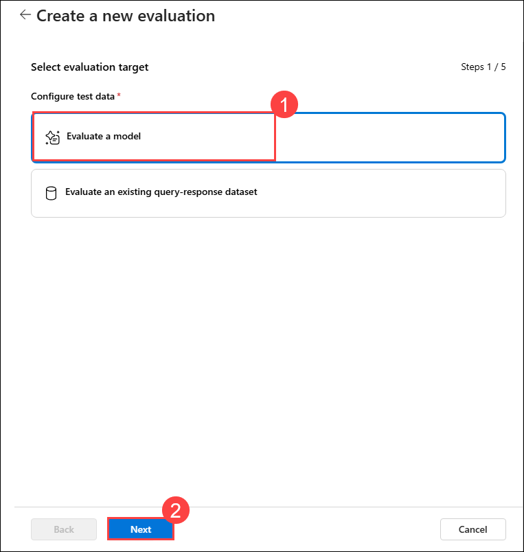

1. On the Select data source page, select **Use your dataset (1)** and select the **travel_evaluation_data_jsonl_xxxx... (2)** dataset based on the file you uploaded previously, and select **Next (3)**.   

   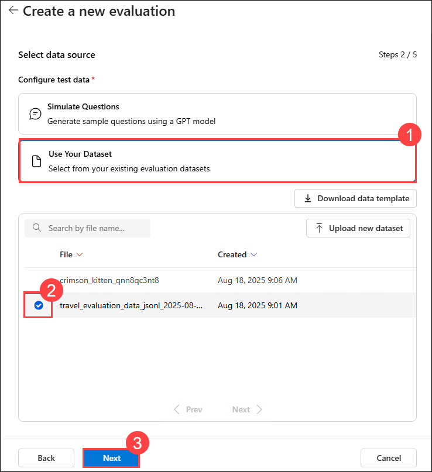

1. On the **Test your model** page,

    - Select the **gpt-4.1-mini (1)** model - Change the **System message** to the same instructions for an AI travel assistant you used previously **(2)**:

      ```
      Assist users with travel-related inquiries, offering tips, advice, and recommendations as a knowledgeable travel agent.
      ```
    - For the **query** field, select **\{\{item.question\}\}** **(3)**
    - Select **Next (4)** to move to the next page.

   
      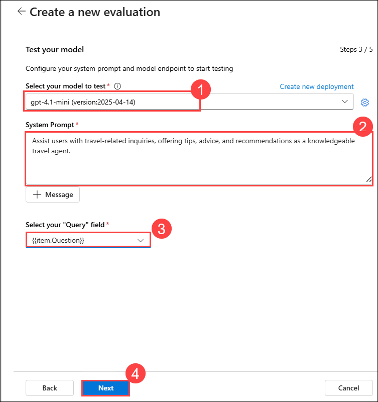   

1. On the **Configure evaluators** page, use the **+Add (1)** button to add the following evaluators, configuring each one as follows:

    - Select **Model scorer (2)**:      

      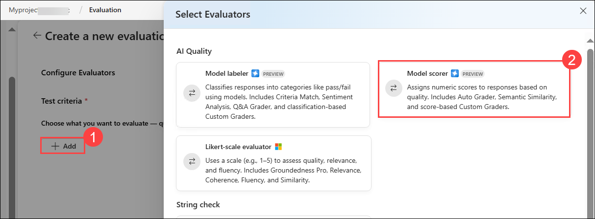

    - **Criteria name**: *Select the **Semantic_similarity (1)** preset*
    - **Grade with**: *Select your **gpt-4.1 (2)** model*

      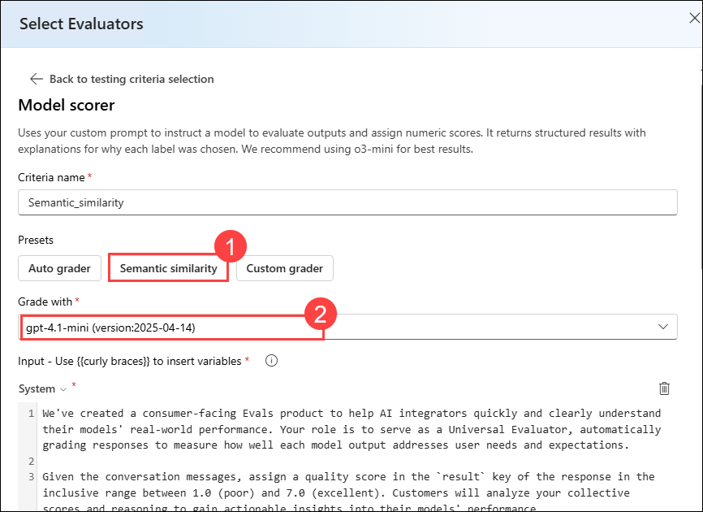   

    - **User** settings (at the bottom): Delete the existing setting and the following **(1)** and the **Add (2)**:


        Output: \{\{sample.output_text\}\}<br>
        Ground Truth: \{\{item.ExpectedResponse\}\}<br>
        <br>

        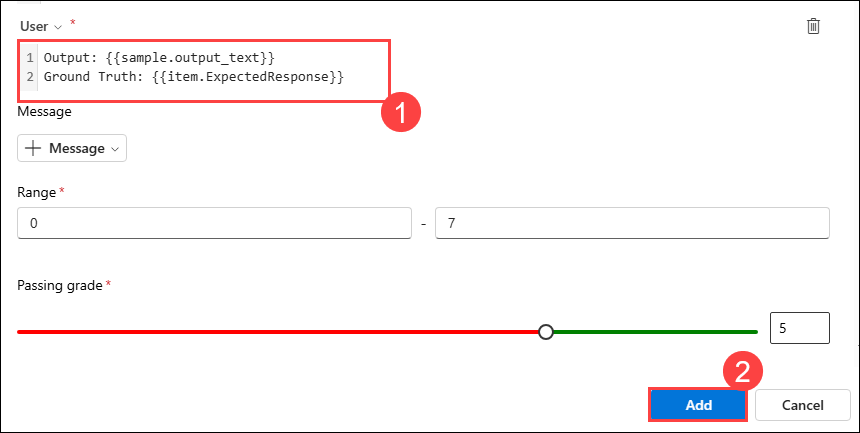       

1. On the **Configure evaluators** page, use the **+Add (1)** button, select  **Likert-scale evaluator**:

    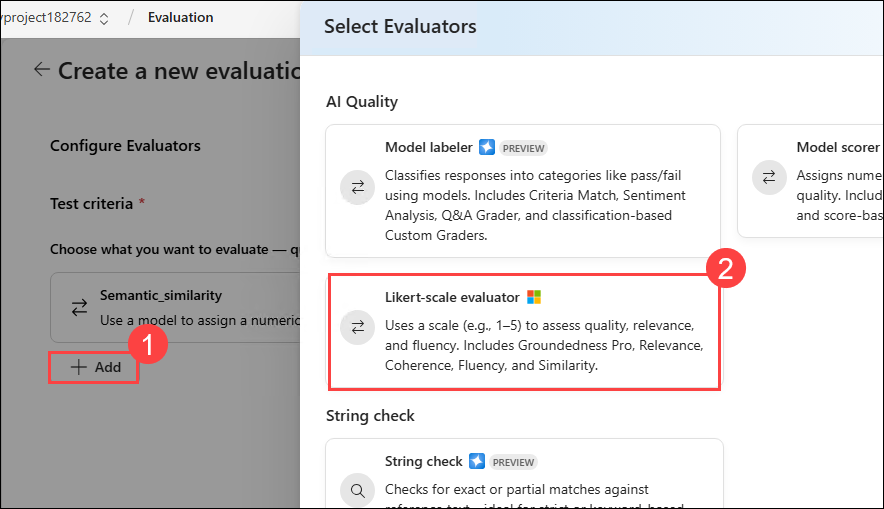   

1. On the **Likert-scale evaluator** page,  provide the following details and then **Add (4)**:

    - **Criteria name**: *Select the **Relevance (1)** preset*
    - **Grade with**: *Select your **gpt-4.1 (2)** model*
    - **Query**: \{\{item.question\}\} **(3)**

      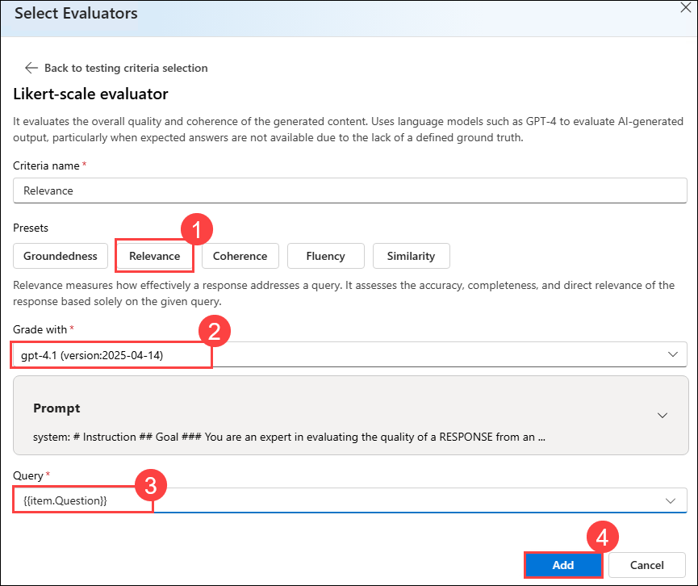

1. On the **Configure evaluators** page, use the **+Add (1)** button, select  **Text similarity (2)**:

    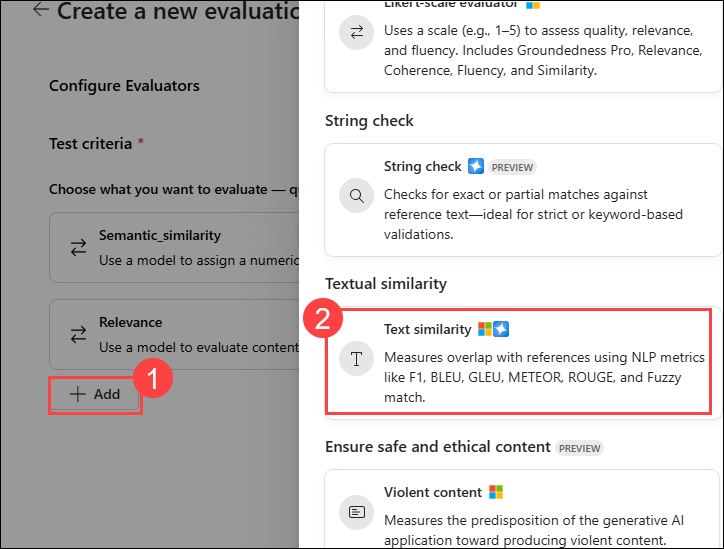       

1. On the **Text similarity** page, provide the following details and then **Add (3)**

    - **Criteria name**: *Select the **F1_Score (1)** preset*
    - **Ground truth**: \{\{item.ExpectedResponse\}\} **(2)**

      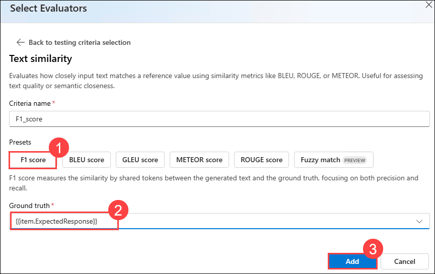 

1. On the **Configure evaluators** page, use the **+Add (1)** button, select  **Hateful and unfair content (2)**:

    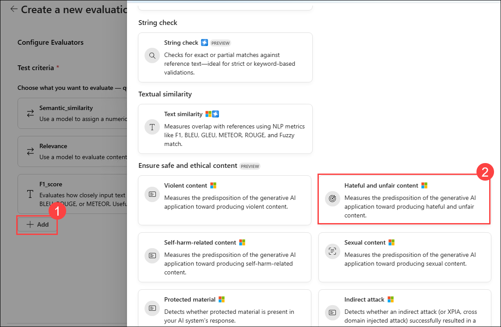    

1. On the **Hateful and unfair content** page, provide the following details and then **Add (3)**

    - **Criteria name**: Hate_and_unfairness **(1)**
    - **Query**: \{\{item.question\}\} **(2)**

      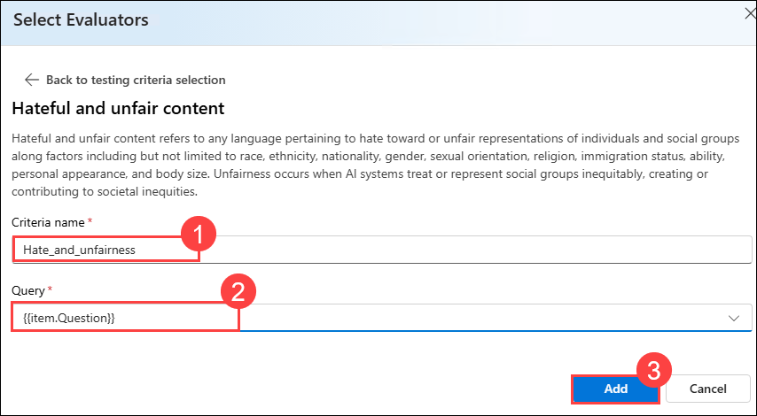 

1. Select **Next** and review your evaluation settings. You should have configured the evaluation to use the travel evaluation dataset to evaluate the **gpt-4.1-mini** model for semantic similarity, relevance, F1 score, and hateful and unfair language.

    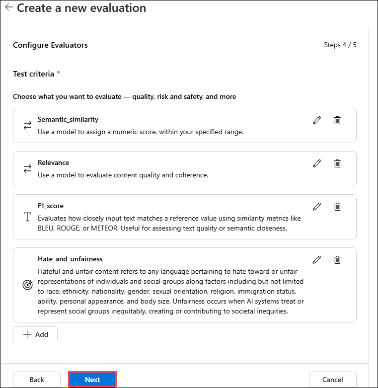   

1. Give the evaluation a suitable name as **Evaluation<inject key="DeploymentID" enableCopy="false"/> (1)**, and **Submit (2)** it to start the evaluation process, and wait for it to complete.

    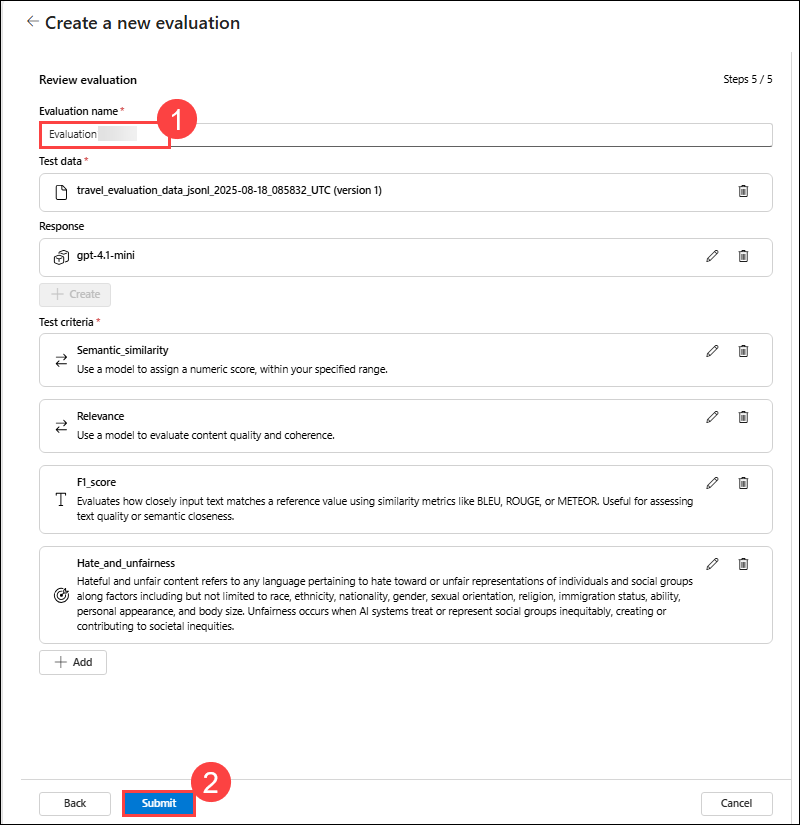  

1. It may take around 3-5 minutes. You can use the **Refresh** toolbar button to check the status.

1. When the evaluation has completed, scroll down if necessary to review the results.

    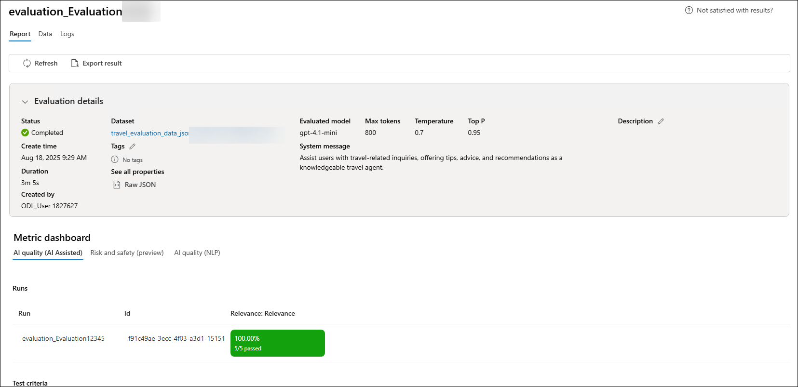  

1. At the top of the page, select the **Data** tab to see the raw data from the evaluation. The data includes the metrics for each input as well as explanations of the reasoning the gpt-4.1 model applied when assessing the responses.

    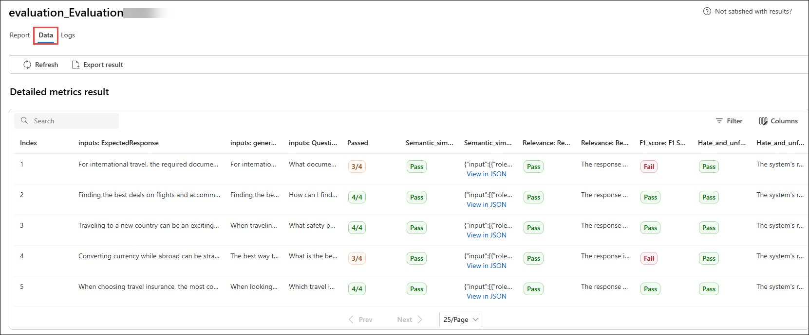  
      