# Lab 08: Explore AI Agent development

### Estimated Duration: 30 Minutes

## Overview

In this lab, you will create an AI agent in **Azure AI Foundry** that helps employees with expense claims. You’ll start by creating a new project and deploying the **gpt-4.1** model. Then you’ll build and configure your agent with system instructions and upload an expenses policy document as grounding data. You’ll also enable the code interpreter as an action. Finally, you’ll interact with the agent in the playground, asking policy questions and guiding it through generating an expense claim file that you can download and review.

## Lab Objectives

In this lab, you'll perform the following tasks:

- **Task 1:** Create an Azure AI Foundry project and agent

- **Task 2:** Create your agent

- **Task 3:** Test your agent

## Task 1: Create an Azure AI Foundry project and agent

In this task, you’ll sign in to the Azure AI Foundry portal, create a new project, and deploy the **gpt-4.1** model with the given settings. By completing it, you’ll have a ready-to-use project and model deployment in the Agents playground.

1. Open a new tab in the browser, right-click on the following link [Azure AI Foundry portal](https://ai.azure.com)[https://ai.azure.com/], then **Copy link** and paste it in a browser tab to log in to **Azure AI Foundry portal**.

1. Click on **Sign in**.
 
    

1. If prompted, provide the credentials below:
 
   - **Email/Username:** <inject key="AzureAdUserEmail"></inject>
    
        

   - **Password:** <inject key="AzureAdUserPassword"></inject>
    
        

1. When the **Stay signed in?** window appears, select **No**.

    

1. Click on **X** to close the **Chat with Foundry Agent** popup window.

    

    >**Note:** Close the **Help** pane if it's open

1. In the home page, click **Create an agent**.

    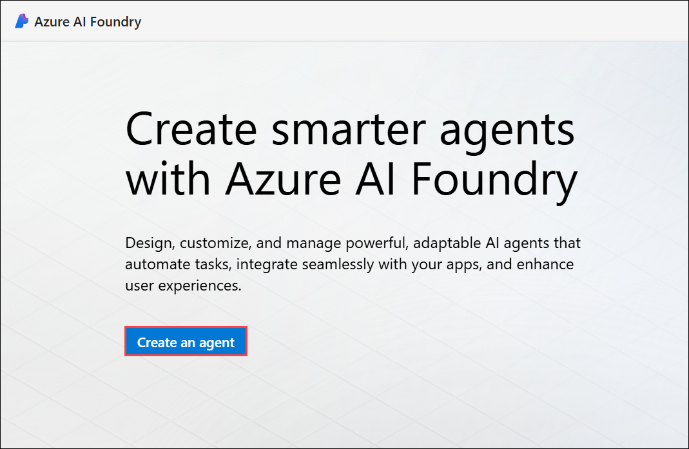

1. In the **Create a new project** window, enter **Myproject<inject key="DeploymentID"></inject> (1)** as the project name. Open the **Advanced options (2)** drop-down, fill in the following details, and then click **Create (7)**:

    * Subscription: **Choose Default Subscription (3)**
    * Resource group: **AI-102-RG08 (4)**
    * Azure AI Foundry resource: **Keep as Default (5)**
    * Region: **<inject key="Region"></inject> (6)**

        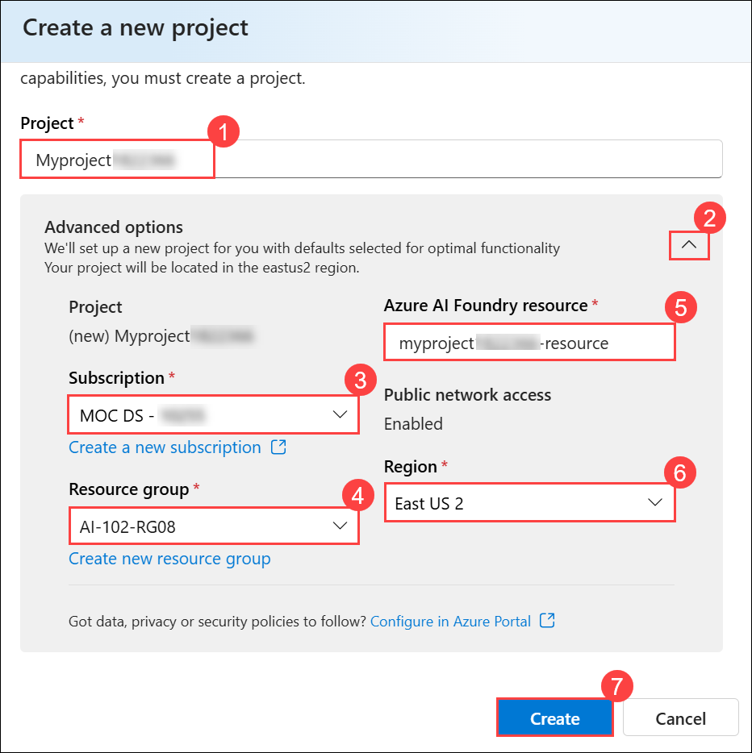
        
        >**Note:** Some Azure AI resources are constrained by regional model quotas. In the event of a quota limit being exceeded later in the exercise, there's a possibility you may need to create another resource in a different region.
        
        >**Note:** The creation of the project can take a few minutes to complete.

        >**Note:** In some cases, Azure AI Foundry will automatically deploy a default model (usually gpt-4o). If this happens, you can skip directly to the next step.

1. If the **Select or deploy a model** window appears, open the **Model deployments (1)** drop-down, choose **Deploy a model (2)**, and then click **Next (3)**.

    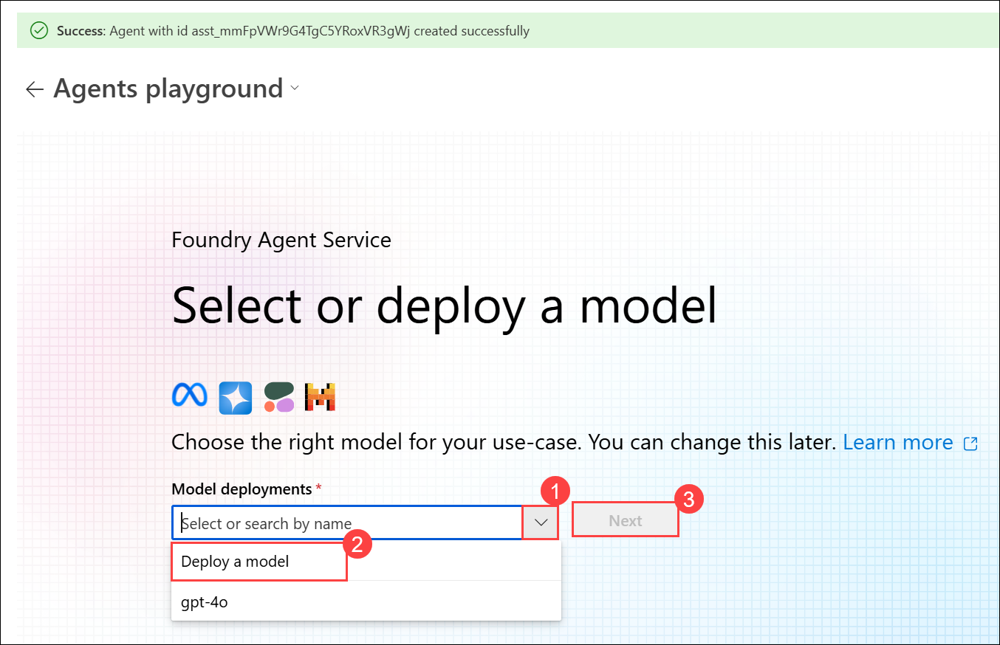

1. In the **Deploy a model** window, use the search bar to find **gpt-4.1 (1)**, select **gpt-4.1 (2)** from the results, and click **Confirm (3)**.

    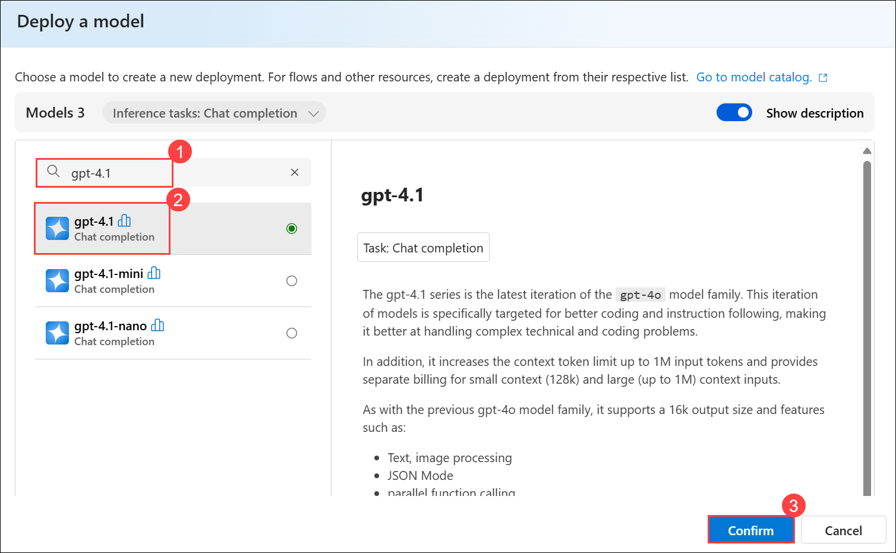

1. In the **Deploy gpt-4.1** window, type **gpt-4.1 (1)** in the **Deployment name** field, select **Global Standard (2)** under **Deployment type**, and click **Customize (3)** to modify the deployment settings.

    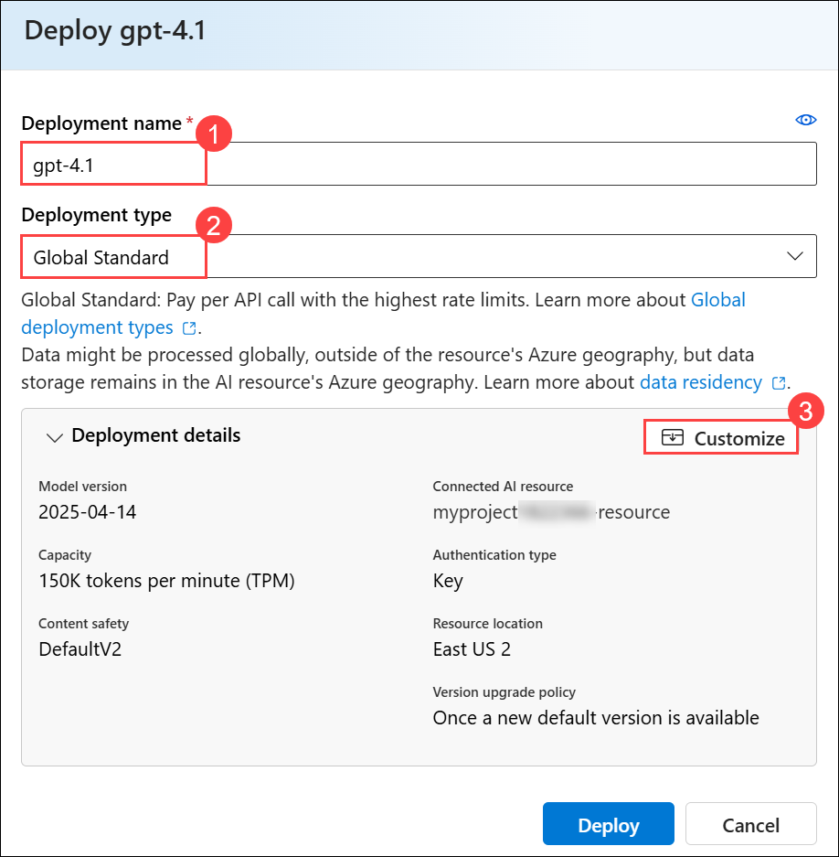

1. Enter the following details, then click **Create (9)**:

    | Parameters                   | Values                                                     |
    | ---------------------------- | ---------------------------------------------------------- |
    | Model version upgrade policy | **Upgrade once new default version becomes available (4)** |
    | Model version                | **2025-04-14 (Default) (5)**                               |
    | Connected AI resource        | **Keep as Default (6)**               |
    | Tokens per Minute Rate Limit | **50K (7)**                                                |
    | Content filter               | **DefaultV2 (8)**                                          |

    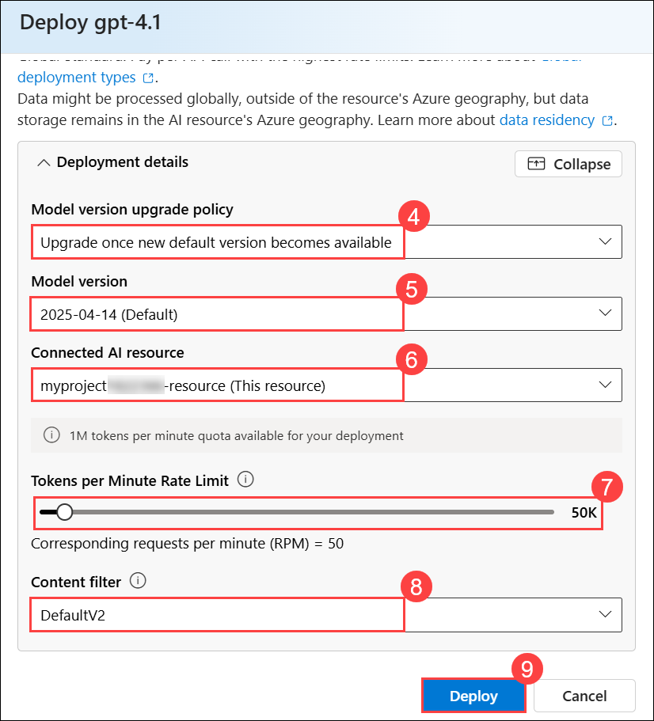

     > **Note**: Reducing the TPM helps avoid overusing the quota available in the subscription you are using. 50,000 TPM should be sufficient for the data used in this exercise. If your available quota is lower than this, you will be able to complete the exercise, but you may experience errors if the rate limit is exceeded.

1. When your project is created, the **Agents playground** will be opened automatically.

    .png)

You'll see that an agent with a default name has been created for you, along with your base model deployment.

> **Congratulations** on completing the task! Now, it's time to validate it. Here are the steps:
>
> - Hit the Validate button for the corresponding task. If you receive a success message, you can proceed to the next task.
> - If not, carefully read the error message and retry the step, following the instructions in the lab guide.
> - If you need any assistance, please contact us at cloudlabs-support@spektrasystems.com. We are available 24/7 to help.
 
<validation step="74c732c7-ce7d-4057-aa11-9eb0f6b77ac8" />

## Task 2: Create your agent

In this exercise, you'll build a simple agent that answers questions based on a corporate expenses policy. You'll download the expenses policy document and use it as the grounding data for the agent.

1. Open a new browser tab and navigate to `https://raw.githubusercontent.com/MicrosoftLearning/mslearn-ai-agents/main/Labfiles/01-agent-fundamentals/Expenses_Policy.docx` to download the **Expenses\_Policy.docx** file and save it locally. This document contains the expenses policy for the fictional Contoso corporation. If a dialog box appears, click **Download** to save the file for later use.
   
    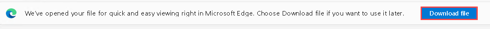

1. Return to the browser tab with the **Foundry Agents playground** and open the **Setup (1)** pane. Set the **Agent name** to **`ExpensesAgent` (2)**, make sure the **gpt-4.1 (3)** model deployment you created earlier is selected in the **Deployment** section, paste the content below into the **Instructions (4)** box, and then click **+ Add (5)** in the **Knowledge** section.

    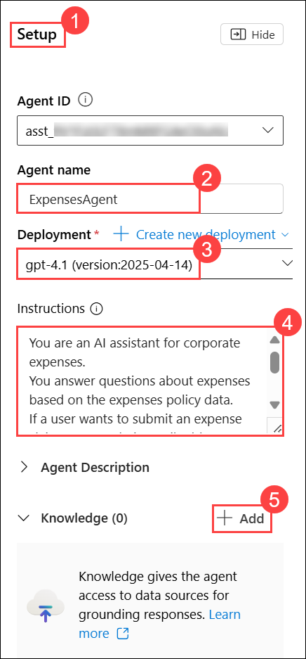

    ```
    You are an AI assistant for corporate expenses.
    You answer questions about expenses based on the expenses policy data.
    If a user wants to submit an expense claim, you get their email address, a description of the claim, and the amount to be claimed, and write the claim details to a text file that the user can download.
    ```

1. From the **Add knowledge** window, click on **Files**.

    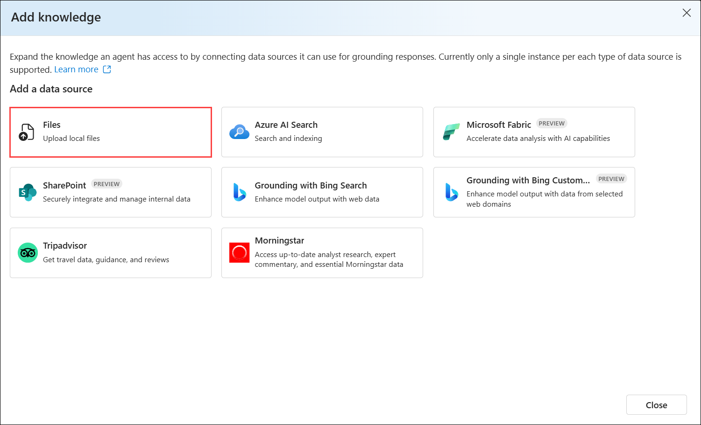

1. In the **Adding files** window, set the vector store name to **`Expenses_Vector_Store` (1)**. Under the **Add files** section, click **Select local files (2)**, then in the file picker, navigate to the **Download (3)** folder from the left pane, choose the **Expenses\_Policy.docx (4)** file you downloaded earlier, and click **Open (5)**.

    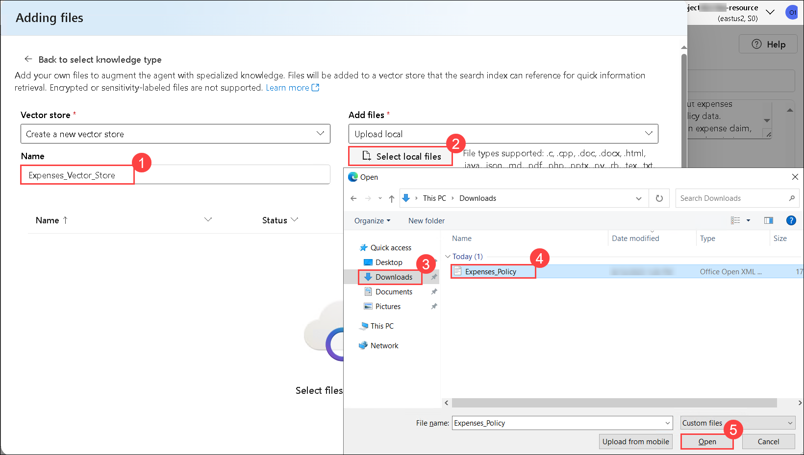

1. Confirm that **Expenses\_Policy.docx** has been uploaded, then click **Upload and save**.

    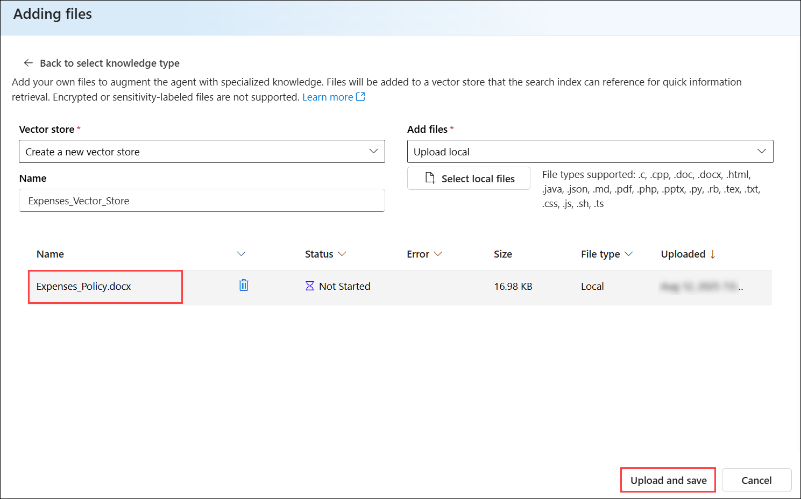

1. In the **Setup** pane, under the **Knowledge** section, ensure that **Expenses\_Vector\_Store (1 file) (1)** is listed and shows 1 file. Then, in the **Actions** section, click **+ Add (2)**.

    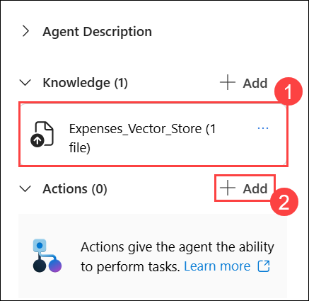

1. In the **Add action** window, select **Code interpreter**.

    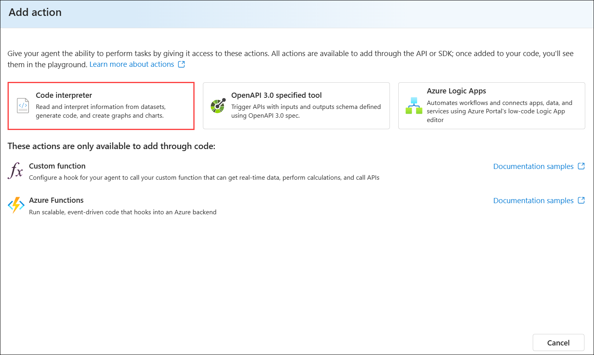

1. In the **Add code interpreter action** window, click on **Save**. 

    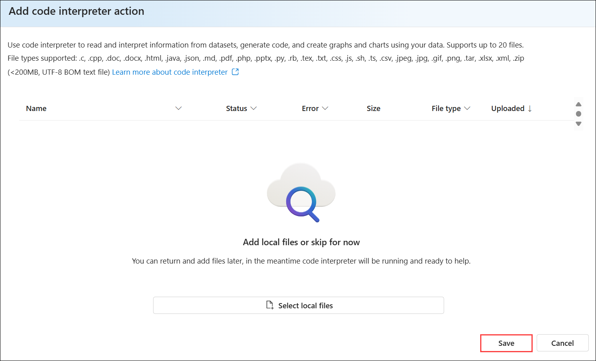

    >**Note:** You do not need to upload any files for the code interpreter.

Your agent will use the document you uploaded as its knowledge source to ground its responses (in other words, it will answer questions based on the contents of this document). It will use the code interpreter tool as required to perform actions by generating and running its own Python code.

## Task 3: Test your agent

In this task, you’ll interact with the agent in the Foundry playground to query information from its knowledge base and guide it through creating an expense claim. You’ll provide step-by-step details, including a description, amount, and date, and then download and review the generated expense claim file.

1. In the playground chat box, type the prompt **`What's the maximum I can claim for meals?`(1)** and click on the **Add and run (2)** icon.

    .png)

    >**Note:** If the **Thread details** pop-up window appears. Click on **X** to close.

1. Review the agent’s response, which should be based on the information from the expenses policy document you added to the agent’s knowledge.

    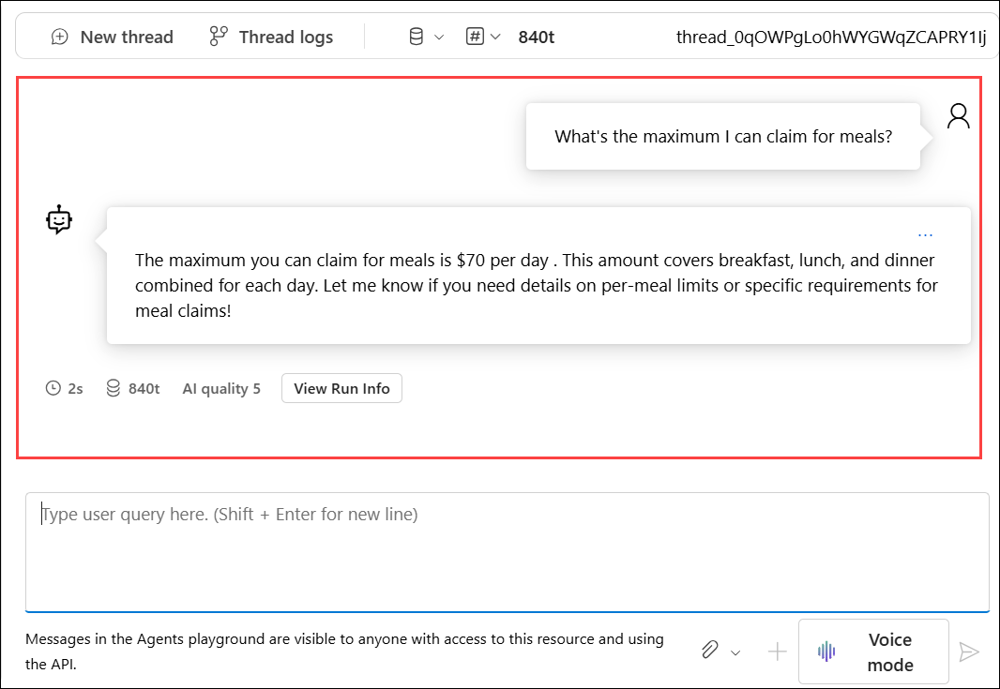

    > **Note**: If the agent fails to respond because the rate limit is exceeded. Wait a few seconds and try again. If there is insufficient quota available in your subscription, the model may not be able to respond. If the problem persists, try to increase the quota for your model on the **Models + endpoints** page.

1. Enter the follow-up prompt **`I'd like to submit a claim for a meal.`** and review the agent’s response. It should prompt you for the necessary details to submit the claim.

    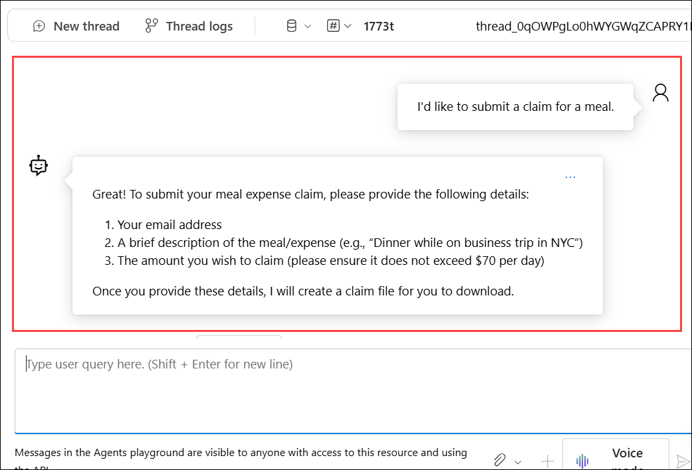

1. Give the agent an email address, for example, **`fred@contoso.com`**. It should confirm receipt and then ask for the remaining details needed for the expense claim, such as the description and amount.

    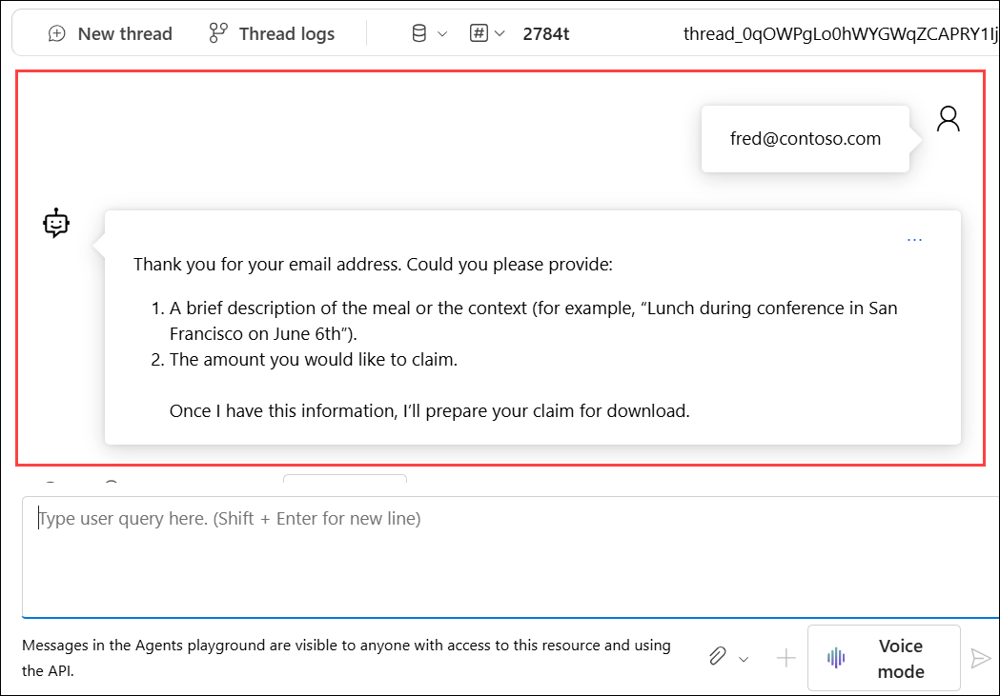

1. Enter a prompt with the claim description and amount, for example, **`Breakfast cost me $20`**.

    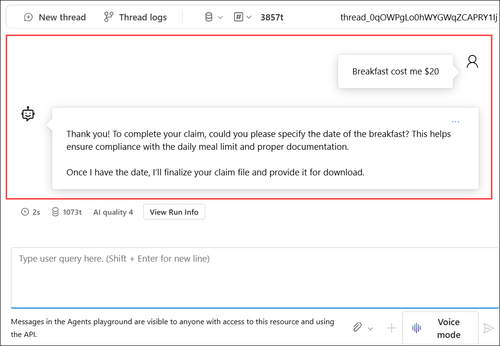

1. Enter a prompt with the claim date, for example, **`12/12/2025`**. The agent should use the code interpreter to generate the expense claim text file and provide a download link. Click **Download your expense claim** to save the file and open it.

    .png)

    > **Note:** You can use any date for this step; it doesn’t have to be the one shown in the example. The agent will generate the expense claim file based on whatever date you provide.

1. A Notepad window will open, displaying the expense claim details.

    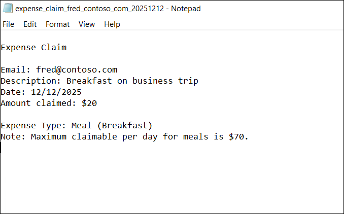

## Summary

In this lab, you created a new project in **Azure AI Foundry** and deployed the **gpt-4.1** model. You then built an AI agent, provided it with system instructions, and added an expenses policy document as a knowledge source. You configured the code interpreter tool so the agent could perform actions. Finally, you tested the agent in the playground by asking questions about the policy and walking through the steps of submitting an expense claim. The agent generated a text file with the claim details, which you downloaded and reviewed.

### You have successfully completed the Hands-on Lab!


