# Lab 08: Develop an AI agent

### Estimated Duration: 30 Minutes

## Overview

In this lab, you create and configure an Azure AI Foundry project, deploy a model, and then build a client application to interact with it. You start by creating a new project in Azure AI Foundry and deploying the gpt-4.1 model. Next, you set up a client application in Azure Cloud Shell by cloning a GitHub repository, installing dependencies, and configuring the project settings. Finally, you complete the application code to connect to the project, upload data, and define an agent that can analyze the data with the built-in code interpreter, enabling you to chat interactively with your model.

## Lab Objectives

- **Task 1:** Create an Azure AI Foundry project

- **Task 2:** Create an Agent Client App

- **Task 3:** Build and Run Your Agent App

## Task 1: Create an Azure AI Foundry project

In this task, you’ll create a new project in **Azure AI Foundry**, set up its configuration (subscription, resource group, and region), and deploy the **gpt-4.1 model**. By the end, you’ll have a project endpoint and model deployment ready to use for connecting client applications.

Let's start by creating an Azure AI Foundry project.

1. Open a new tab in the browser, right-click on the following link [Azure AI Foundry portal](https://ai.azure.com), then **Copy link** and paste it in a browser tab to log in to **Azure AI Foundry portal**.

1. Click on **Sign in**.
 
    

1. If prompted, provide the credentials below:
 
   - **Email/Username:** <inject key="AzureAdUserEmail"></inject>
    
        

   - **Password:** <inject key="AzureAdUserPassword"></inject>
    
        

1. When the **Stay signed in?** window appears, select **No**.

    

1. Click on **X** to close the **Chat with Foundry Agent** popup window.

    

    >**Note:** Close the **Help** pane if it's open

1. In the home page, click **Create an agent**.

    

1. In the **Create a new project** window, enter **Myproject<inject key="DeploymentID"></inject> (1)** as the project name. Open the **Advanced options (2)** drop-down, fill in the following details, and then click **Create (7)**:

    * Subscription: **Choose Default Subscription (3)**
    * Resource group: **AI-102-RG09 (4)**
    * Azure AI Foundry resource: **Keep as Default (5)**
    * Region: **<inject key="Region"></inject> (6)**

        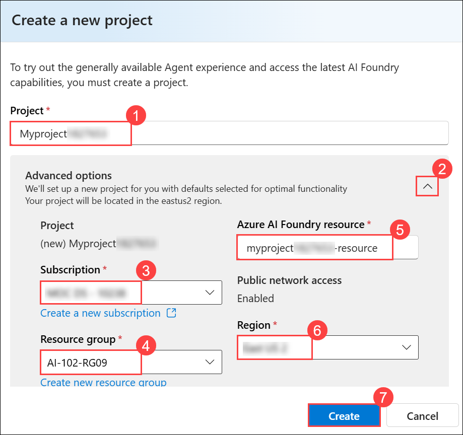
        
        >**Note:** Some Azure AI resources are constrained by regional model quotas. In the event of a quota limit being exceeded later in the exercise, there's a possibility you may need to create another resource in a different region.
        
        >**Note:** The creation of the project can take a few minutes to complete.

        >**Note:** In some cases, Azure AI Foundry will automatically deploy a default model (usually gpt-4o). If this happens, you can skip directly to the next step.

1. If the **Select or deploy a model** window appears, open the **Model deployments (1)** drop-down, choose **Deploy a model (2)**, and then click **Next (3)**.

    

1. In the **Deploy a model** window, use the search bar to look for **gpt-4.1 (1)**. From the results, select **gpt-4.1 (2)** and then click **Confirm (3)** to proceed.

    

1. In the **Deploy gpt-4.1** window, type **gpt-4.1 (1)** in the **Deployment name** field, select **Global Standard (2)** under **Deployment type**, and click **Customize (3)** to modify the deployment settings.

    

1. Enter the following details, then click **Create (9)**:

    | Parameters                   | Values                                                     |
    | ---------------------------- | ---------------------------------------------------------- |
    | Model version upgrade policy | **Upgrade once new default version becomes available (4)** |
    | Model version                | **2025-04-14 (Default) (5)**                               |
    | Connected AI resource        | **Keep as Default (6)**               |
    | Tokens per Minute Rate Limit | **50K (7)**                                                |
    | Content filter               | **DefaultV2 (8)**                                          |

    

     > **Note**: Reducing the TPM helps avoid overusing the quota available in the subscription you are using. 50,000 TPM should be sufficient for the data used in this exercise. If your available quota is lower than this, you will be able to complete the exercise, but you may experience errors if the rate limit is exceeded.

1. When your project is created, the **Agents playground** will be opened automatically.

    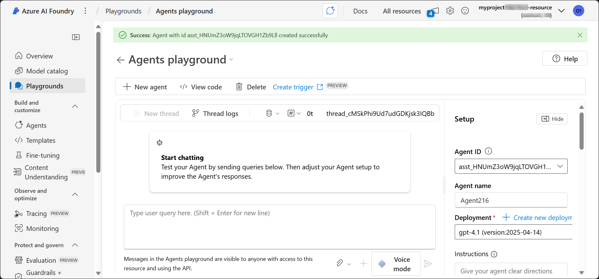

1. In the navigation pane on the left, select **Overview** to see the main page for your project, which looks like this:

    

1. Click the **Copy Azure AI Foundry project endpoint** icon to copy the value, then save it in a notepad. You’ll need it later to connect your client application to the project.

    

> **Congratulations** on completing the task! Now, it's time to validate it. Here are the steps:
>
> - Hit the Validate button for the corresponding task. If you receive a success message, you can proceed to the next task.
> - If not, carefully read the error message and retry the step, following the instructions in the lab guide.
> - If you need any assistance, please contact us at cloudlabs-support@spektrasystems.com. We are available 24/7 to help.
 
<validation step="a5b3a25b-5fde-4fec-9e3e-487d2c4e5803" />

## Task 2: Create an Agent Client App

In this task, you’ll set up a client application that connects to the agent you created in Azure AI Foundry. You’ll clone the provided GitHub repository, configure the application with your project details, and install the necessary dependencies so the app can communicate with your deployed model.

1. Open a new browser tab (keeping the Azure AI Foundry portal open in the existing tab). Then in the new tab, browse to the [Azure portal](https://portal.azure.com) at `https://portal.azure.com`.

1. If prompted, provide the credentials below:

    - **Email/Username:** <inject key="AzureAdUserEmail"></inject>

    - **Password:** <inject key="AzureAdUserPassword"></inject> 

        >**Note:** If the **Welcome to Microsoft Azure** window appears, select **Cancel**.

        

1. On the **Azure portal** homepage, click the **\[>\_] Cloud Shell (1)** button located to the right of the **Copilot** tab at the top. This opens a new Cloud Shell session. In the **Welcome to Azure Cloud Shell** window, choose **PowerShell (2)**.

    

    >**Note:** The cloud shell provides a command-line interface in a pane at the bottom of the Azure portal. You can resize or maximize this pane to make it easier to work in.

    > **Note:** If you have previously created a cloud shell that uses a **Bash** environment, switch it to **PowerShell**.

1. In the **Getting started** window, ensure **No storage account required (1)** is selected. From the **Subscription** drop-down, choose **Default subscription (2)**, then click **Apply (3)**.

    

1. In the Cloud Shell toolbar, open the **Settings (1)** menu and choose **Go to Classic version (2)** from the drop-down.

    

    >**Note:** Ensure you've switched to the classic version of the cloud shell before continuing.

1. In the Cloud Shell pane, run the following commands to clone the GitHub repository with the code files for this exercise. You can type the command directly, or copy it to the clipboard, then right-click in the command line and paste it as plain text.

    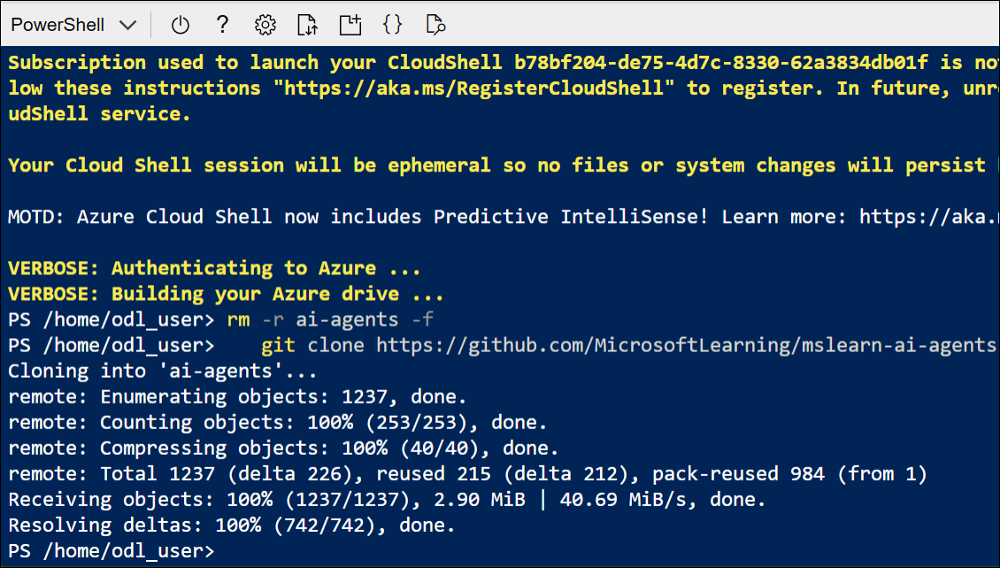

    ```
    rm -r ai-agents -f
    git clone https://github.com/MicrosoftLearning/mslearn-ai-agents ai-agents
    ```

    > **Note:** As you enter commands into the cloudshell, the output may take up a large amount of the screen buffer, and the cursor on the current line may be obscured. You can clear the screen by entering the `cls` command to make it easier to focus on each task.

1. Once the repository is cloned, go to the folder with the chat application code files and open them to view their contents.

    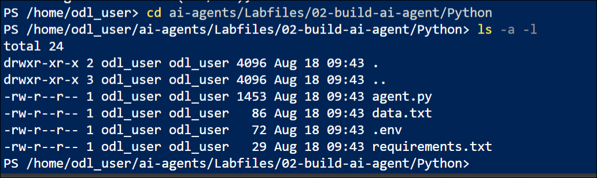

    ```
    cd ai-agents/Labfiles/02-build-ai-agent/Python
    ls -a -l
    ```

1. The folder contains a code file as well as a configuration file for application settings and a file defining the project runtime and package requirements.

1. In the cloud shell command-line pane, enter the following command to install the libraries you'll use:

    ```
    python -m venv labenv
    ./labenv/bin/Activate.ps1
    pip install -r requirements.txt azure-ai-projects
    ```

1. Enter the following command to edit the configuration file that has been provided:

    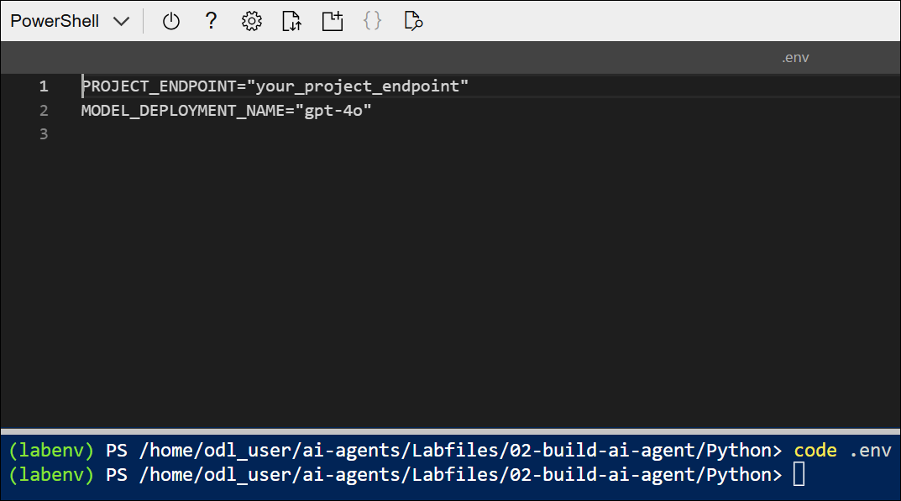

    ```
    code .env
    ```

1. In the code file, replace the placeholder values with the correct details for your project:

    * PROJECT\_ENDPOINT : **Azure AI Foundry project endpoint (1)**
    * MODEL\_DEPLOYEMNT\_NAME : **gpt-4.1 (2)**

        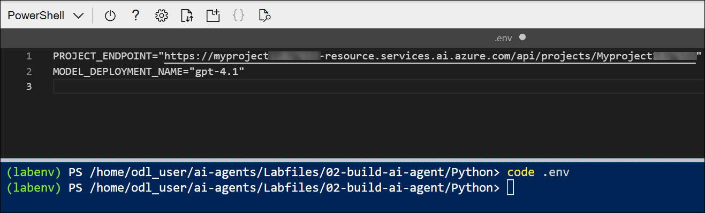

        > **Note:** Paste the Azure AI Foundry project endpoint you copied in the previous task.

        > **Note:** To find the **Model Deployment Name**, go to your project in the **Azure AI Foundry portal**, select **Management center** → **Deployments**, and copy the **Name** of the deployed model (for example, *gpt-4o* or *gpt-4.1*).

1. After replacing the placeholders, save your changes in the code editor using **CTRL+S** or **Right-click > Save**. Then close the editor with **CTRL+Q** or **Right-click > Quit**, leaving the Cloud Shell command line open.

## Task 3: Build and Run Your Agent App

In this task, you’ll complete and run the code for your agent application. You’ll connect the app to your Azure AI Foundry project, upload data, define an agent that can analyze it with the built-in code interpreter, and then start an interactive chat with the model. By the end, you’ll be able to ask questions, request calculations or visualizations, and see how the agent responds in a conversational thread.

>**Note:** As you add code, be sure to maintain the correct indentation. Use the comment indentation levels as a guide.

1. Enter the following command to edit the code file that has been provided:

    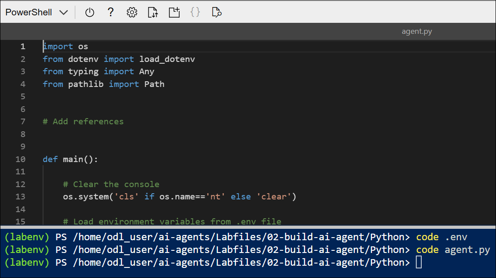

    ```
    code agent.py
    ```

1. Review the existing code, which retrieves the application configuration settings and loads data from **data.txt** to be analyzed. The rest of the file includes comments where you'll add the necessary code to implement your data analysis agent.

1. Find the comment **Add references** and add the following code to import the classes you'll need to build an Azure AI agent that uses the built-in code interpreter tool:

    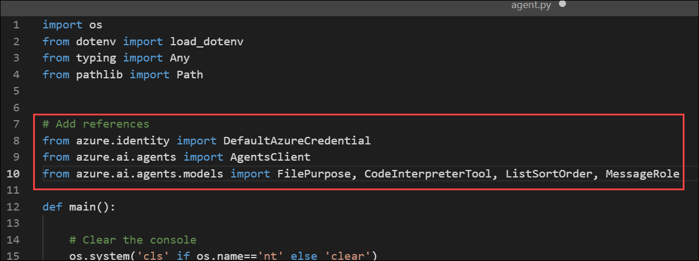

    ```python
   # Add references
   from azure.identity import DefaultAzureCredential
   from azure.ai.agents import AgentsClient
   from azure.ai.agents.models import FilePurpose, CodeInterpreterTool, ListSortOrder, MessageRole
    ```

1. Find the comment **Connect to the Agent client** and add the following code to connect to the Azure AI project.

    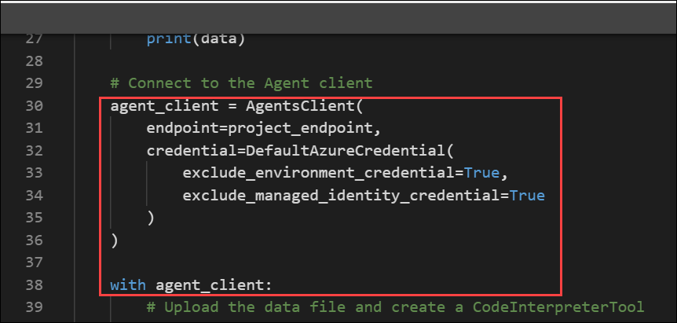

    ```python
   # Connect to the Agent client
    agent_client = AgentsClient(
        endpoint=project_endpoint,
        credential=DefaultAzureCredential
            (exclude_environment_credential=True,
                exclude_managed_identity_credential=True)
    )
    with agent_client:
    ```

    > **Note:** Be careful to maintain the correct indentation level.

    The code connects to the Azure AI Foundry project using the current Azure credentials. The final *with agent_client* statement starts a code block that defines the scope of the client, ensuring it's cleaned up when the code within the block is finished.

1. Find the comment **Upload the data file and create a CodeInterpreterTool**, within the *with agent_client* block, and add the following code to upload the data file to the project and create a CodeInterpreterTool that can access the data in it:

    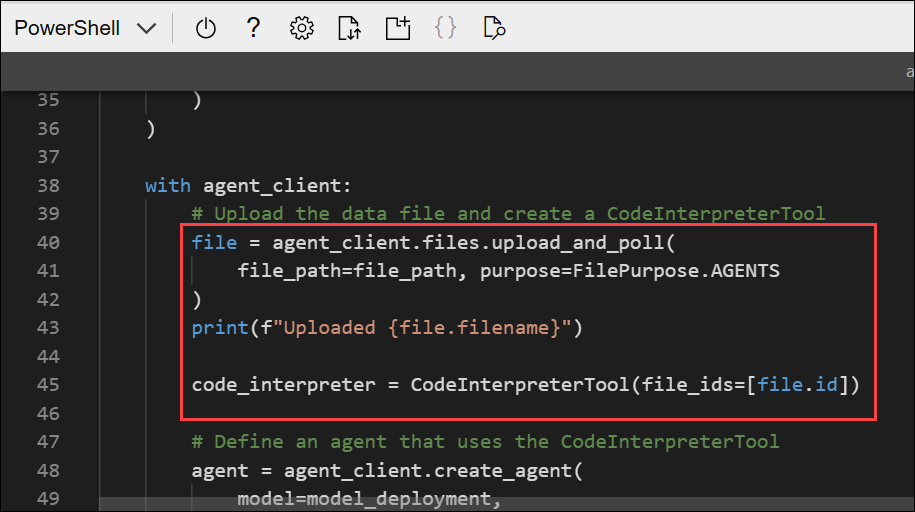

    ```python
    # Upload the data file and create a CodeInterpreterTool
    file = agent_client.files.upload_and_poll(
            file_path=file_path, purpose=FilePurpose.AGENTS
    )
    print(f"Uploaded {file.filename}")

    code_interpreter = CodeInterpreterTool(file_ids=[file.id])
    ```
    
1. Find the comment **Define an agent that uses the CodeInterpreterTool** and add the following code to define an AI agent that analyzes data and can use the code interpreter tool you defined previously:

    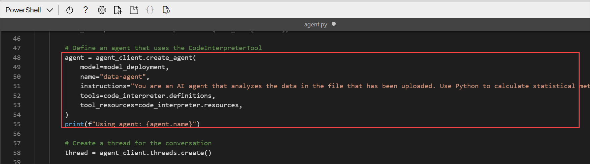

    ```python
    # Define an agent that uses the CodeInterpreterTool
    agent = agent_client.create_agent(
            model=model_deployment,
            name="data-agent",
            instructions="You are an AI agent that analyzes the data in the file that has been uploaded. Use Python to calculate statistical metrics as necessary.",
            tools=code_interpreter.definitions,
            tool_resources=code_interpreter.resources,
    )
    print(f"Using agent: {agent.name}")
    ```

1. Find the comment **Create a thread for the conversation** and add the following code to start a thread on which the chat session with the agent will run:

    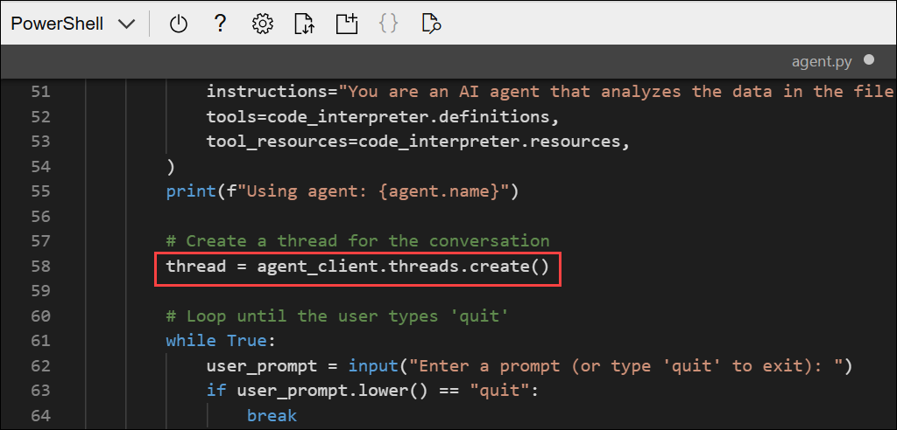

    ```python
    # Create a thread for the conversation
    thread = agent_client.threads.create()
    ```
    
1. Note that the next section of code sets up a loop for a user to enter a prompt, ending when the user enters "quit".

1. Find the comment **Send a prompt to the agent** and add the following code to add a user message to the prompt (along with the data from the file that was loaded previously), and then run the thread with the agent.

    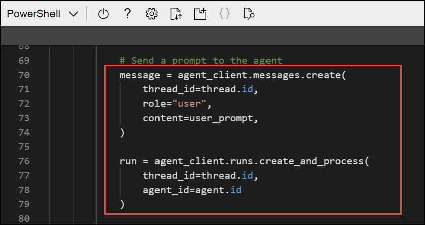

    ```python
    # Send a prompt to the agent
    message = agent_client.messages.create(
            thread_id=thread.id,
            role="user",
            content=user_prompt,
        )

    run = agent_client.runs.create_and_process(thread_id=thread.id, agent_id=agent.id)
    ```

1. Find the comment **Check the run status for failures** and add the following code to check for any errors.

    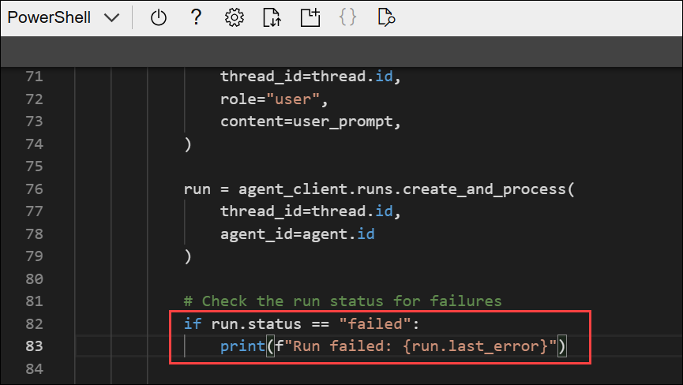

    ```python
    # Check the run status for failures
    if run.status == "failed":
            print(f"Run failed: {run.last_error}")
    ```

1. Find the comment **Show the latest response from the agent** and add the following code to retrieve the messages from the completed thread and display the last one that was sent by the agent.

    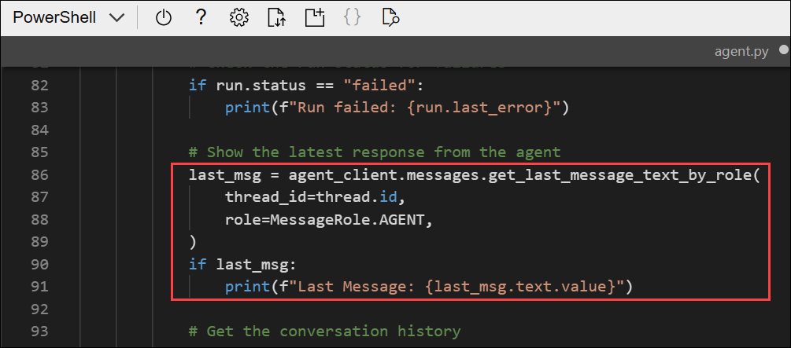

    ```python
    # Show the latest response from the agent
    last_msg = agent_client.messages.get_last_message_text_by_role(
        thread_id=thread.id,
        role=MessageRole.AGENT,
    )
    if last_msg:
        print(f"Last Message: {last_msg.text.value}")
    ```

1. Find the comment **Get the conversation history**, which is after the loop ends, and add the following code to print out the messages from the conversation thread; reversing the order to show them in chronological sequence

    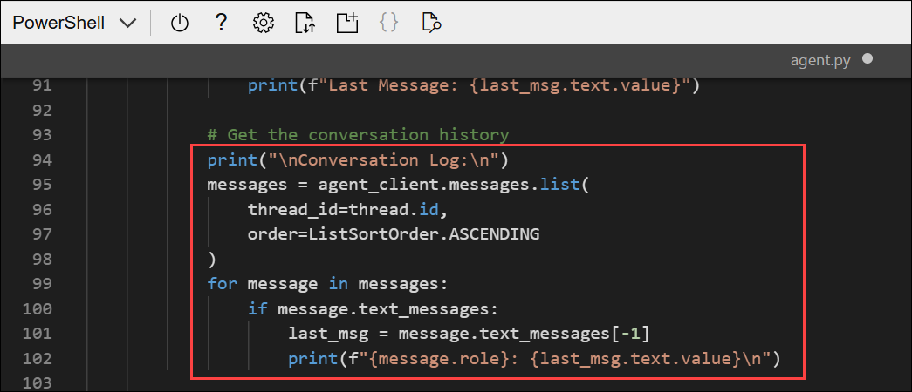

    ```python
    # Get the conversation history
    print("\nConversation Log:\n")
    messages = agent_client.messages.list(thread_id=thread.id, order=ListSortOrder.ASCENDING)
    for message in messages:
        if message.text_messages:
            last_msg = message.text_messages[-1]
            print(f"{message.role}: {last_msg.text.value}\n")
    ```

1. Find the comment **Clean up** and add the following code to delete the agent and thread when no longer needed.

    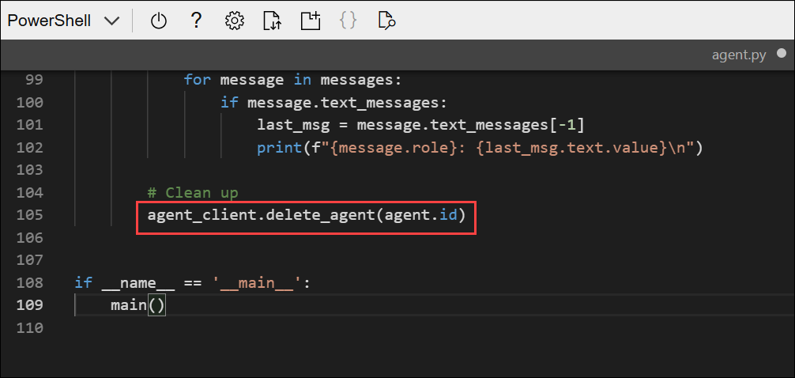

    ```python
    # Clean up
    agent_client.delete_agent(agent.id)
    ```

1. Review the code, using the comments to understand how it:
    - Connects to the AI Foundry project.
    - Uploads the data file and creates a code interpreter tool that can access it.
    - Creates a new agent that uses the code interpreter tool and has explicit instructions to use Python as necessary for statistical analysis.
    - Runs a thread with a prompt message from the user along with the data to be analyzed.
    - Checks the status of the run in case there's a failure
    - Retrieves the messages from the completed thread and displays the last one sent by the agent.
    - Displays the conversation history
    - Deletes the agent and thread when they're no longer required.

1. After replacing the placeholders, save your changes in the code editor using **CTRL+S** or **Right-click > Save**. Then close the editor with **CTRL+Q** or **Right-click > Quit**, leaving the Cloud Shell command line open.

1. In the cloud shell command-line pane, enter the following command to sign into Azure. Click on the **Link (1)** and copy the **code (2)** provided.

    

    ```
    az login
    ```
    
1. In the new browser tab, when the **Enter code to allow access** window appears, paste the copied code and select **Next**.

    

1. In the **Pick an account** dialog box, choose **ODL_User<inject key="DeploymentID"></inject>**. 

    

1. In the **Are you trying to sign in to Microsoft Azure CLI?** dialog box, click **Continue**.

    

1. When the **Microsoft Azure Cross-platform Command Line Interface** window pops up, return to the browser tab with Cloud Shell open. 

    

1. In the Cloud Shell console, press **Enter** to select the only available subscription.

    

1. After you have signed in, enter the following command to run the application:

    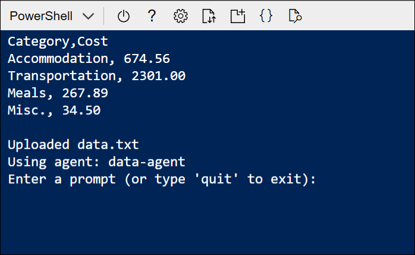

    ```
    python agent.py
    ```
    
    The application runs using the credentials for your authenticated Azure session to connect to your project and create and run the agent.

1. When prompted, view the data that the app has loaded from the *data.txt* text file. Then enter a prompt such as:

    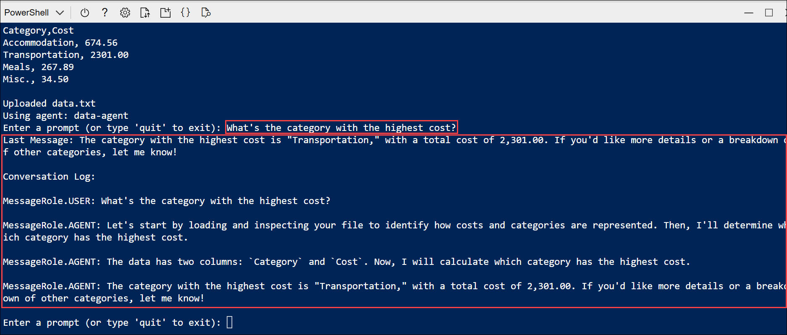

    ```
   What's the category with the highest cost?
    ```

    > **Note:** If the app fails because the rate limit is exceeded. Wait a few seconds and try again. If there is insufficient quota available in your subscription, the model may not be able to respond.

1. View the response. Then enter another prompt, this time requesting a visualization:

    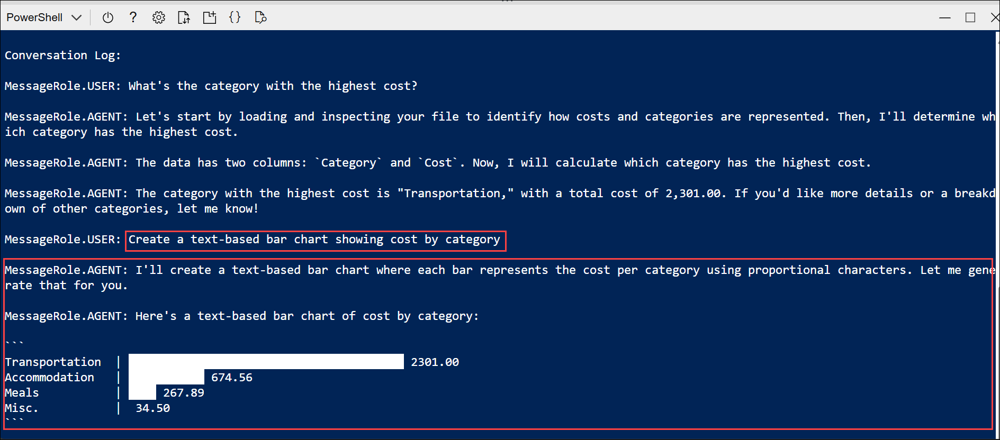

    ```
   Create a text-based bar chart showing cost by category
    ```

1. View the response. Then enter another prompt, this time requesting a statistical metric:

    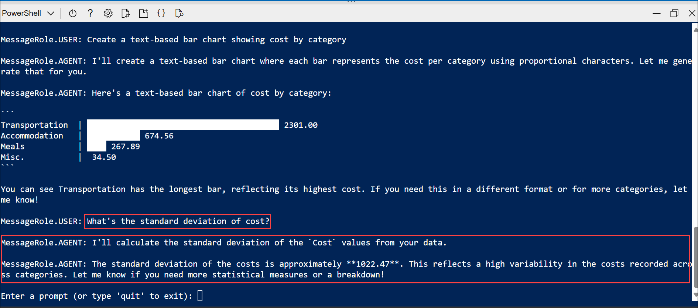

    ```
   What's the standard deviation of cost?
    ```

1. You can continue the conversation if you like. The thread is *stateful*, so it retains the conversation history - meaning that the agent has the full context for each response. Enter `quit` when you're done.

1. Review the conversation messages that were retrieved from the thread, which may include messages the agent generated to explain its steps when using the code interpreter tool.

## Summary

In this lab, you learned how to create a new **Azure AI Foundry** project and deploy the **gpt-4.1** model. You retrieved and saved the project endpoint for use in client applications, and used Azure Cloud Shell to clone a GitHub repository and configure a client app. You installed the required dependencies, updated environment settings to connect the app to your project, and wrote Python code for an agent application that uploads data and leverages the code interpreter tool. Finally, you ran the app to interact with your model, asking questions, requesting statistical metrics or visualizations, and reviewing the conversation history.

### You have successfully completed the Hands-on Lab!
