# Lab 10: Use a custom function in an AI agent

### Estimated Duration : 30 Minutes

## Overview

In this lab, you’ll build an end-to-end solution with **Azure AI Foundry** by creating a project, deploying a model, and extending it with custom function tools. You’ll start by setting up a new Azure AI Foundry project and deploying the **gpt-4.1 model** (or using the default auto-deployed model). Next, you’ll develop an app in Azure Cloud Shell that defines custom functions, such as generating and saving support tickets, and make them available to your agent. Finally, you’ll implement, run, and test an agent that can call these functions in response to user prompts, while also retrieving conversation history and cleaning up resources.

## Lab Objectives

- **Task 1:** Create an Azure AI Foundry project

- **Task 2:** Develop function tools for your agent

- **Task 3:** Build and run an agent that uses your custom function

## Task 1: Create an Azure AI Foundry project

In this task, you’ll create a new Azure AI Foundry project, configure its settings, and deploy the gpt-4.1 model (or use the default model if auto-deployed). By the end, you’ll have both a project endpoint and a model deployment ready for use in client applications.

Let's start by creating an Azure AI Foundry project.

1. Open a new tab in the browser, right-click on the following link [Azure AI Foundry portal](https://ai.azure.com), then **Copy link** and paste it in a browser tab to log in to **Azure AI Foundry portal**.

1. Click on **Sign in**.
 
    

1. If prompted, provide the credentials below:
 
   - **Email/Username:** <inject key="AzureAdUserEmail"></inject>
    
        

   - **Password:** <inject key="AzureAdUserPassword"></inject>
    
        

1. When the **Stay signed in?** window appears, select **No**.

    

1. Click on **X** to close the **Chat with Foundry Agent** popup window.

    

    >**Note:** Close the **Help** pane if it's open

1. In the home page, click **Create an agent**.

    

1. In the **Create a new project** window, enter **Myproject<inject key="DeploymentID"></inject> (1)** as the project name. Open the **Advanced options (2)** drop-down, fill in the following details, and then click **Create (7)**:

    * Subscription: **Choose Default Subscription (3)**
    * Resource group: **AI-102-RG10 (4)**
    * Azure AI Foundry resource: **Keep as Default (5)**
    * Region: **<inject key="Region"></inject> (6)**

        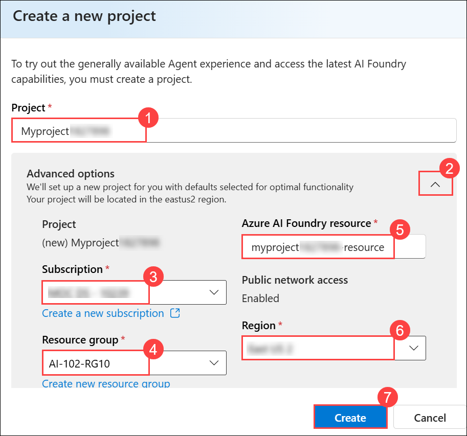
        
        >**Note:** Some Azure AI resources are constrained by regional model quotas. In the event of a quota limit being exceeded later in the exercise, there's a possibility you may need to create another resource in a different region.
        
        >**Note:** The creation of project can take few minutes to complete.

        >**Note:** In some cases, Azure AI Foundry will automatically deploy a default model (usually gpt-4o). If this happens, you can skip directly to the next step.

1. If the **Select or deploy a model** window appears, open the **Model deployments (1)** drop-down, choose **Deploy a model (2)**, and then click **Next (3)**.

    

1. In the **Deploy a model** window, use the search bar to look for **gpt-4.1 (1)**. From the results, select **gpt-4.1 (2)** and then click **Confirm (3)** to proceed.

    

1. In the **Deploy gpt-4.1** window, type **gpt-4.1 (1)** in the **Deployment name** field, select **Global Standard (2)** under **Deployment type**, and click **Customize (3)** to modify the deployment settings.

    

1. Enter the following details, then click **Create (9)**:

    | Parameters                   | Values                                                     |
    | ---------------------------- | ---------------------------------------------------------- |
    | Model version upgrade policy | **Upgrade once new default version becomes available (4)** |
    | Model version                | **2025-04-14 (Default) (5)**                               |
    | Connected AI resource        | **Keep as Default (6)**               |
    | Tokens per Minute Rate Limit | **50K (7)**                                                |
    | Content filter               | **DefaultV2 (8)**                                          |

    

     > **Note**: Reducing the TPM helps avoid over-using the quota available in the subscription you are using. 50,000 TPM should be sufficient for the data used in this exercise. If your available quota is lower than this, you will be able to complete the exercise but you may experience errors if the rate limit is exceeded.

1. When your project is created, the **Agents playground** will be opened automatically.

    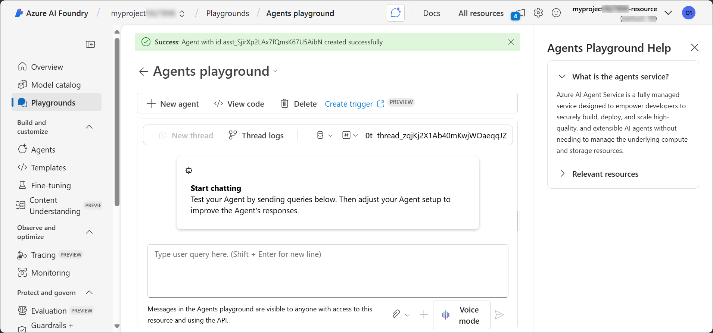

1. In the navigation pane on the left, select **Overview** to see the main page for your project; which looks like this:

    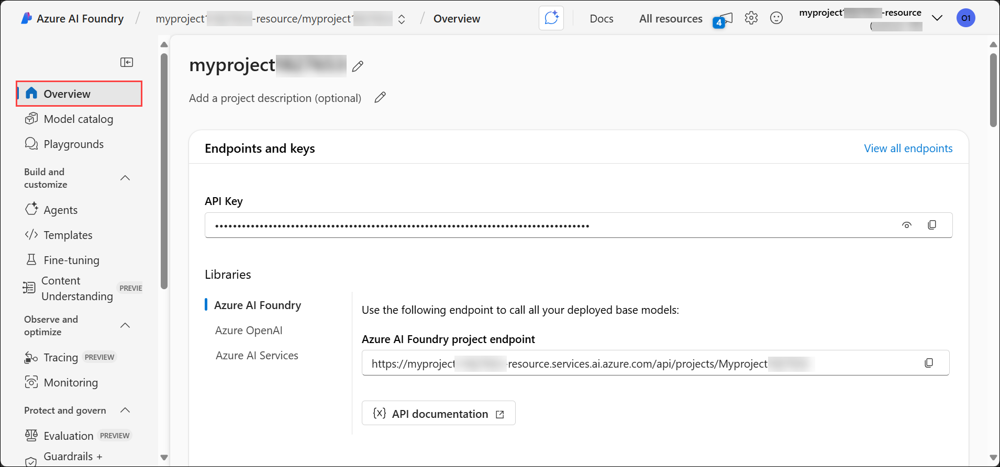

1. Click the **Copy Azure AI Foundry project endpoint** icon to copy the value, then save it in a notepad, you’ll need it later to connect your client application to the project.

    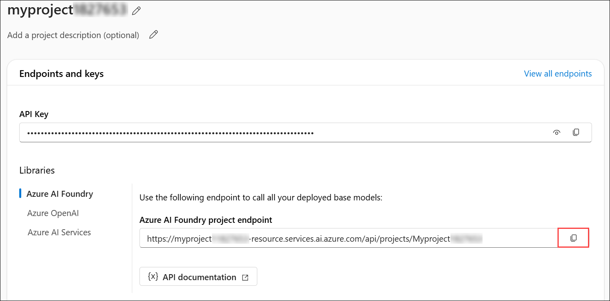

> **Congratulations** on completing the task! Now, it's time to validate it. Here are the steps:
>
> - Hit the Validate button for the corresponding task. If you receive a success message, you can proceed to the next task.
> - If not, carefully read the error message and retry the step, following the instructions in the lab guide.
> - If you need any assistance, please contact us at cloudlabs-support@spektrasystems.com. We are available 24/7 to help.
 
<validation step="b046143b-76f6-49ca-ad60-fef1518f2bf9" />

## Task 2: Develop function tools for your agent

In this task, you’ll build the foundation of your agent app by adding custom function tools. You’ll configure the project settings, implement a function to generate support tickets, and make it available for your agent to call when handling user requests.

1. Open a new browser tab (keeping the Azure AI Foundry portal open in the existing tab). Then in the new tab, browse to the [Azure portal](https://portal.azure.com) at `https://portal.azure.com`.

1. If prompted, provide the credentials below:

    - **Email/Username:** <inject key="AzureAdUserEmail"></inject>

    - **Password:** <inject key="AzureAdUserPassword"></inject> 

        >**Note:** If the **Welcome to Microsoft Azure** window appears, select **Cancel**.

        

1. On the **Azure portal** homepage, click the **\[>\_] Cloud Shell (1)** button located to the right of the **Copilot** tab at the top. This opens a new Cloud Shell session. In the **Welcome to Azure Cloud Shell** window, choose **PowerShell (2)**.

    

    >**Note:** The cloud shell provides a command-line interface in a pane at the bottom of the Azure portal. You can resize or maximize this pane to make it easier to work in.

    > **Note:** If you have previously created a cloud shell that uses a **Bash** environment, switch it to **PowerShell**.

1. In the **Getting started** window, ensure **No storage account required (1)** is selected. From the **Subscription** drop-down, choose **Default subscription (2)**, then click **Apply (3)**.

    

1. In the Cloud Shell toolbar, open the **Settings (1)** menu and choose **Go to Classic version (2)** from the drop-down.

    

    >**Note:** Ensure you've switched to the classic version of the cloud shell before continuing.

1. In the cloud shell pane, enter the following commands to clone the GitHub repo containing the code files for this exercise (type the command, or copy it to the clipboard and then right-click in the command line and paste as plain text):

    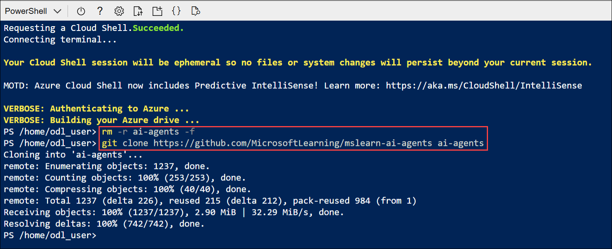

    ```
   rm -r ai-agents -f
   git clone https://github.com/MicrosoftLearning/mslearn-ai-agents ai-agents
    ```

    > **Note:** As you enter commands into the cloudshell, the output may take up a large amount of the screen buffer and the cursor on the current line may be obscured. You can clear the screen by entering the `cls` command to make it easier to focus on each task.

1. Enter the following command to change the working directory to the folder containing the code files and list them all.

    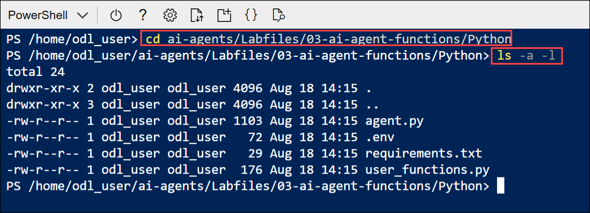

    ```
   cd ai-agents/Labfiles/03-ai-agent-functions/Python
   ls -a -l
    ```

1. The folder contains a code file as well as a configuration file for application settings and a file defining the project runtime and package requrirements.

1. In the cloud shell command-line pane, enter the following command to install the libraries you'll use:

    ```
   python -m venv labenv
   ./labenv/bin/Activate.ps1
   pip install -r requirements.txt azure-ai-projects
    ```

    >**Note:** You can ignore any warning or error messages displayed during the library installation.

1. Enter the following command to edit the configuration file that has been provided:

    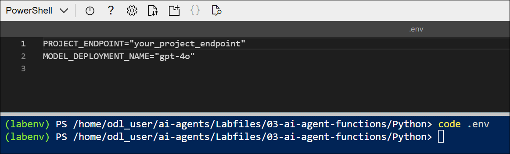
     
    ```
    code .env
    ```

1. In the code file, replace the placeholder values with the correct details for your project:

    * PROJECT\_ENDPOINT : **Azure AI Foundry project endpoint (1)**
    * MODEL\_DEPLOYEMNT\_NAME : **gpt-4.1 (2)**

        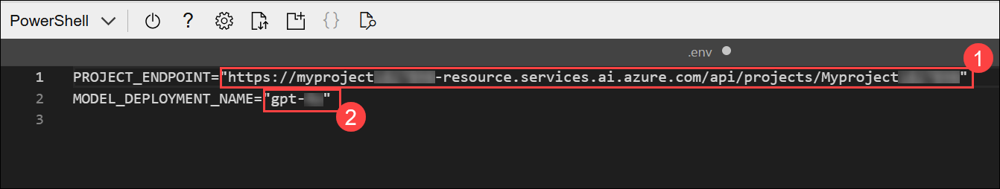

        > **Note:** Paste the Azure AI Foundry project endpoint you copied in the previous task.

        > **Note:** To find the **Model Deployment Name**, go to your project in the **Azure AI Foundry portal**, select **Management center** → **Deployments**, and copy the **Name** of the deployed model (for example, *gpt-4o* or *gpt-4.1*).

1. After replacing the placeholders, save your changes in the code editor using **CTRL+S** or **Right-click > Save**. Then close the editor with **CTRL+Q** or **Right-click > Quit**, leaving the Cloud Shell command line open.

1. Enter the following command to edit the code file that has been provided for your function code:

     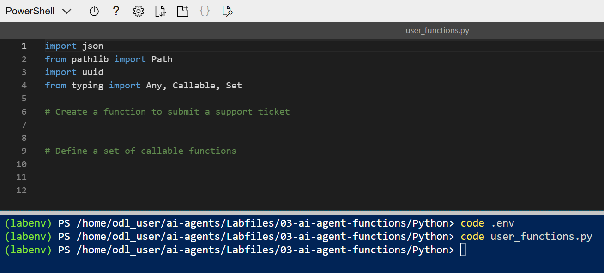

    ```
    code user_functions.py
    ```

1. Find the comment **Create a function to submit a support ticket** and add the following code, which generates a ticket number and saves a support ticket as a text file.

     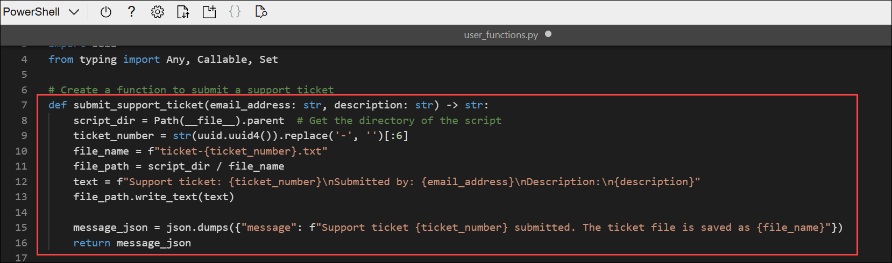

    ```python
   # Create a function to submit a support ticket
   def submit_support_ticket(email_address: str, description: str) -> str:
        script_dir = Path(__file__).parent  # Get the directory of the script
        ticket_number = str(uuid.uuid4()).replace('-', '')[:6]
        file_name = f"ticket-{ticket_number}.txt"
        file_path = script_dir / file_name
        text = f"Support ticket: {ticket_number}\nSubmitted by: {email_address}\nDescription:\n{description}"
        file_path.write_text(text)
    
        message_json = json.dumps({"message": f"Support ticket {ticket_number} submitted. The ticket file is saved as {file_name}"})
        return message_json
    ```

1. Find the comment **Define a set of callable functions** and add the following code, which statically defines a set of callable functions in this code file (in this case, there's only one - but in a real solution you may have multiple functions that your agent can call):

    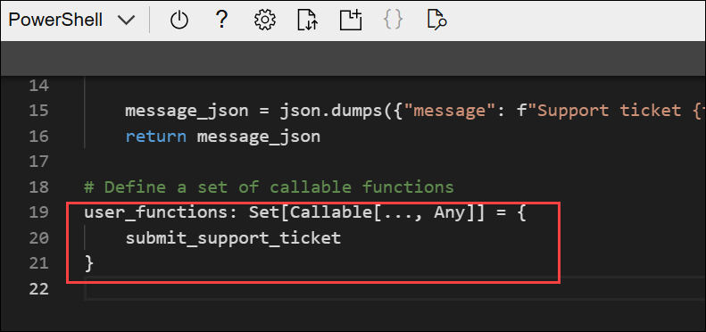

    ```python
   # Define a set of callable functions
   user_functions: Set[Callable[..., Any]] = {
        submit_support_ticket
    }
    ```

1. After replacing the placeholders, save your changes in the code editor using **CTRL+S** or **Right-click > Save**. Then close the editor with **CTRL+Q** or **Right-click > Quit**, leaving the Cloud Shell command line open.

## Task 3: Build and run an agent that uses your custom function

In this task, you’ll extend your Azure AI agent by integrating your own custom function into its toolset, then run the agent in a live chat to test how it can automatically detect when to call the function and use it to resolve user requests.

1. Enter the following command to begin editing the agent code.

    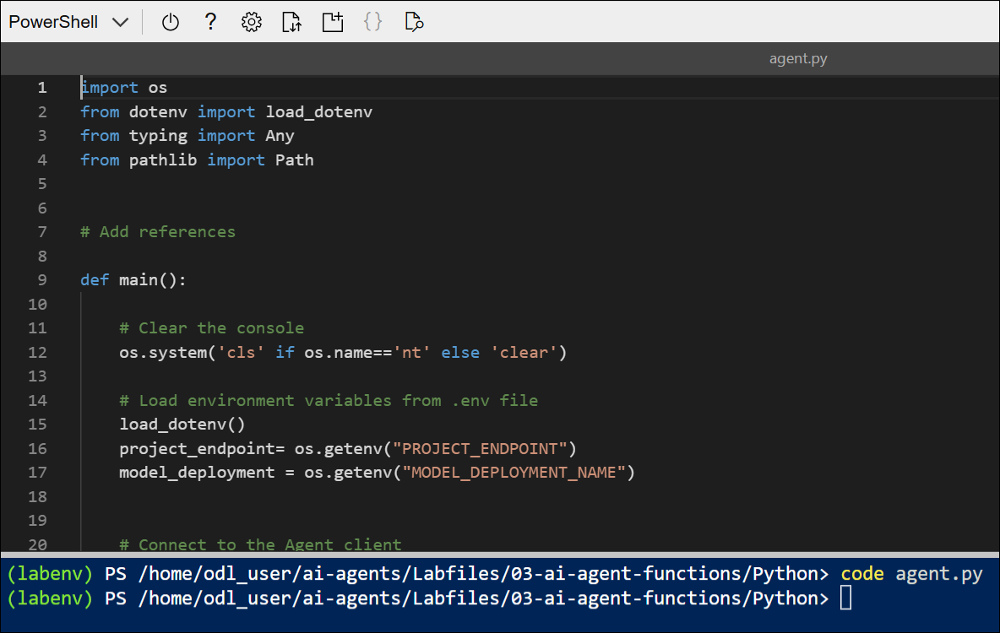

    ```
    code agent.py
    ```

    > **Note:** As you add code to the code file, be sure to maintain the correct indentation.

1. Review the existing code, which retrieves the application configuration settings and sets up a loop in which the user can enter prompts for the agent. The rest of the file includes comments where you'll add the necessary code to implement your technical support agent.

1. Find the comment **Add references** and add the following code to import the classes you'll need to build an Azure AI agent that uses your function code as a tool:

    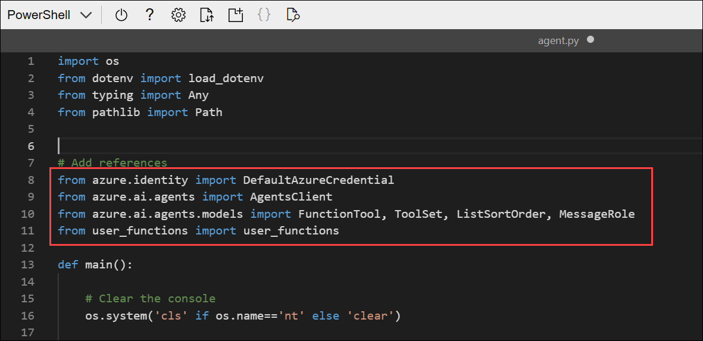

    ```python
    # Add references
    from azure.identity import DefaultAzureCredential
    from azure.ai.agents import AgentsClient
    from azure.ai.agents.models import FunctionTool, ToolSet, ListSortOrder, MessageRole
    from user_functions import user_functions
    ```

1. Find the comment **Connect to the Agent client** and add the following code to connect to the Azure AI project using the current Azure credentials.

    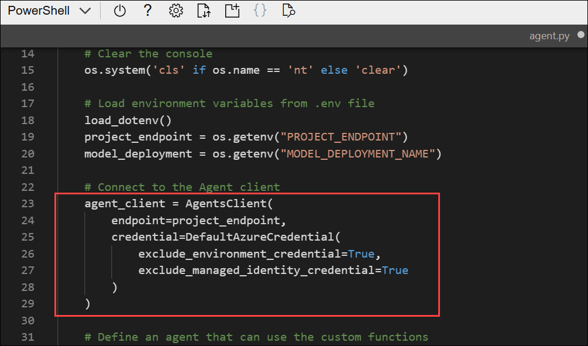

    ```python
    # Connect to the Agent client
    agent_client = AgentsClient(
        endpoint=project_endpoint,
        credential=DefaultAzureCredential
            (exclude_environment_credential=True,
                exclude_managed_identity_credential=True)
    )
    ```

    > **Note:** Be careful to maintain the correct indentation level.

1. Find the comment **Define an agent that can use the custom functions** section, and add the following code to add your function code to a toolset, and then create an agent that can use the toolset and a thread on which to run the chat session.

    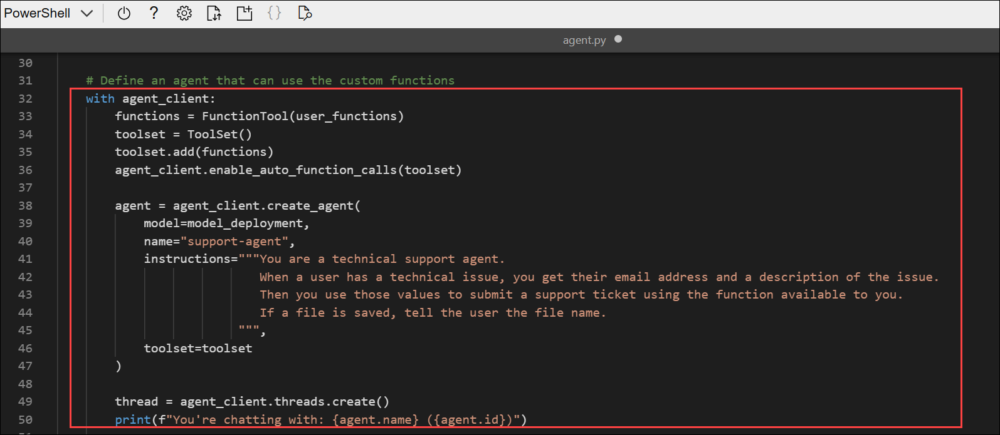

    ```python
   # Define an agent that can use the custom functions
   with agent_client:

        functions = FunctionTool(user_functions)
        toolset = ToolSet()
        toolset.add(functions)
        agent_client.enable_auto_function_calls(toolset)
            
        agent = agent_client.create_agent(
            model=model_deployment,
            name="support-agent",
            instructions="""You are a technical support agent.
                            When a user has a technical issue, you get their email address and a description of the issue.
                            Then you use those values to submit a support ticket using the function available to you.
                            If a file is saved, tell the user the file name.
                         """,
            toolset=toolset
        )

        thread = agent_client.threads.create()
        print(f"You're chatting with: {agent.name} ({agent.id})")

    ```

1. Find the comment **Send a prompt to the agent** and add the following code to add the user's prompt as a message and run the thread.

    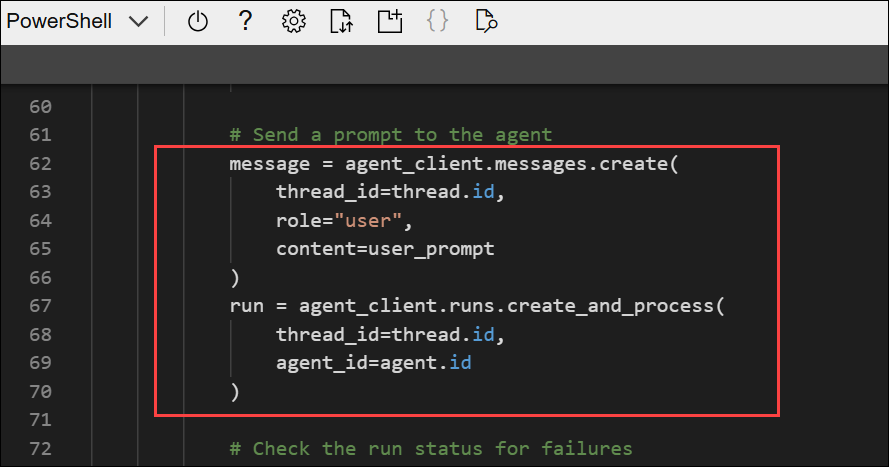

    ```python
    # Send a prompt to the agent
    message = agent_client.messages.create(
            thread_id=thread.id,
            role="user",
            content=user_prompt
    )
    run = agent_client.runs.create_and_process(thread_id=thread.id, agent_id=agent.id)
    ```

    > **Note**: Using the **create_and_process** method to run the thread enables the agent to automatically find your functions and choose to use them based on their names and parameters. As an alternative, you could use the **create_run** method, in which case you would be responsible for writing code to poll for run status to determine when a function call is required, call the function, and return the results to the agent.

1. Find the comment **Check the run status for failures** and add the following code to show any errors that occur.

    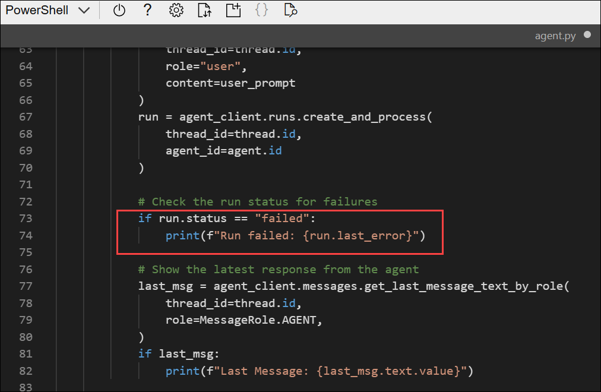

    ```python
   # Check the run status for failures
   if run.status == "failed":
        print(f"Run failed: {run.last_error}")
    ```

1. Find the comment **Show the latest response from the agent** and add the following code to retrieve the messages from the completed thread and display the last one that was sent by the agent.

    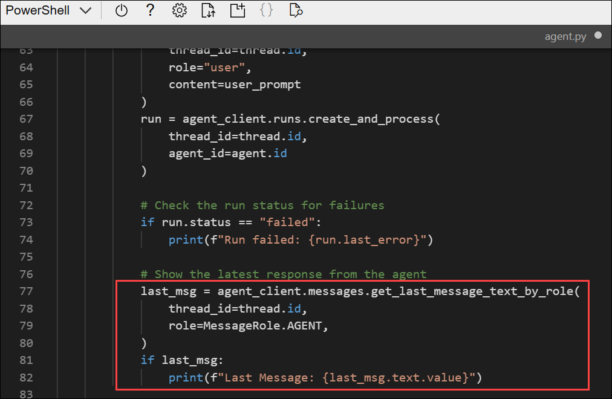

    ```python
   # Show the latest response from the agent
   last_msg = agent_client.messages.get_last_message_text_by_role(
       thread_id=thread.id,
       role=MessageRole.AGENT,
   )
   if last_msg:
        print(f"Last Message: {last_msg.text.value}")
    ```

1. Find the comment **Get the conversation history** and add the following code to print out the messages from the conversation thread; ordering them in chronological sequence

    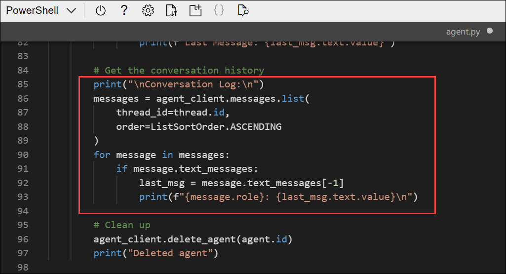

    ```python
   # Get the conversation history
   print("\nConversation Log:\n")
   messages = agent_client.messages.list(thread_id=thread.id, order=ListSortOrder.ASCENDING)
   for message in messages:
        if message.text_messages:
           last_msg = message.text_messages[-1]
           print(f"{message.role}: {last_msg.text.value}\n")
    ```

1. Find the comment **Clean up** and add the following code to delete the agent and thread when no longer needed.

    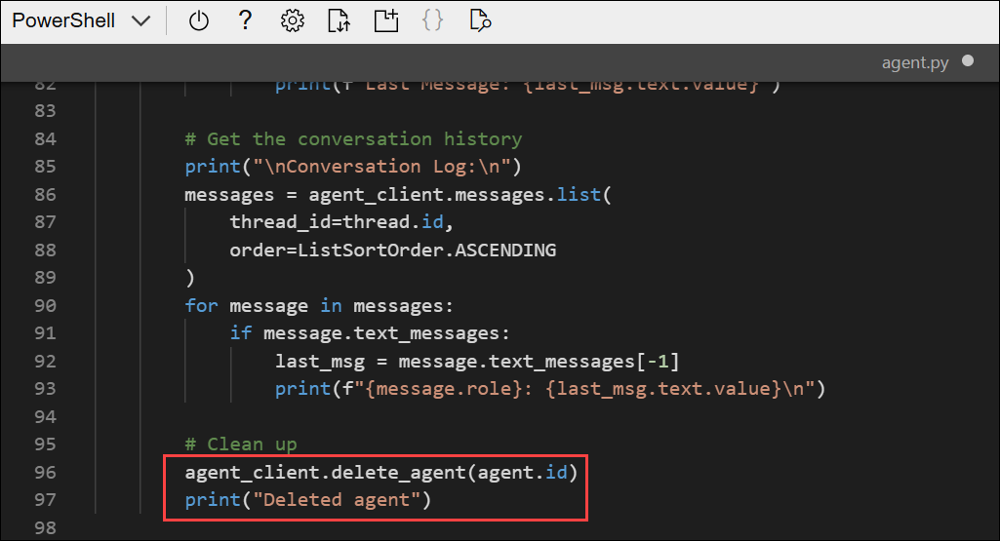

    ```python
   # Clean up
   agent_client.delete_agent(agent.id)
   print("Deleted agent")
    ```

1. Review the code, using the comments to understand how it:
    - Adds your set of custom functions to a toolset
    - Creates an agent that uses the toolset.
    - Runs a thread with a prompt message from the user.
    - Checks the status of the run in case there's a failure
    - Retrieves the messages from the completed thread and displays the last one sent by the agent.
    - Displays the conversation history
    - Deletes the agent and thread when they're no longer required.

1. After replacing the placeholders, save your changes in the code editor using **CTRL+S** or **Right-click > Save**. Then close the editor with **CTRL+Q** or **Right-click > Quit**, leaving the Cloud Shell command line open.

1. In the cloud shell command-line pane, enter the following command to sign into Azure. Click on the **Link (1)** and copy the **code (2)** provided.

    

    ```
    az login
    ```
    
1. In the new browser tab, when the **Enter code to allow access** window appears, paste the copied code and select **Next**.

    

1. In the **Pick an account** dialog box, choose **ODL_User<inject key="DeploymentID"></inject>**. 

    

1. In the **Are you trying to sign in to Microsoft Azure CLI?** dialog box, click **Continue**.

    

1. When the **Microsoft Azure Cross-platform Command Line Interface** window pops up, return to the browser tab with Cloud Shell open. 

    

1. In the Cloud Shell console, press **Enter** to select the only available subscription.

    

1. After you have signed in, enter the following command to run the application:

    ```
    python agent.py
    ```
    
    The application runs using the credentials for your authenticated Azure session to connect to your project and create and run the agent.

1. When prompted, enter a prompt such as:

    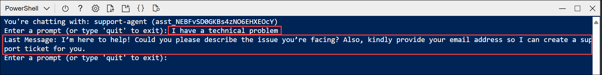

    ```
    I have a technical problem
    ```

    > **Note:** If the app fails because the rate limit is exceeded. Wait a few seconds and try again. If there is insufficient quota available in your subscription, the model may not be able to respond.

1. View the response. The agent may ask for your email address and a description of the issue. You can use any email address (for example, `alex@contoso.com`) and any issue description (for example `my computer won't start`)

    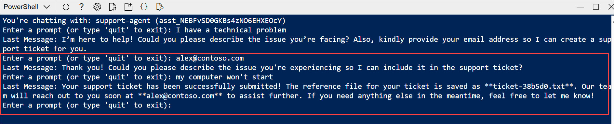

    When it has enough information, the agent should choose to use your function as required.

1. You can continue the conversation if you like. The thread is **stateful**, so it retains the conversation history - meaning that the agent has the full context for each response. Enter `quit` when you're done.

1. Review the conversation messages that were retrieved from the thread, and the tickets that were generated.

    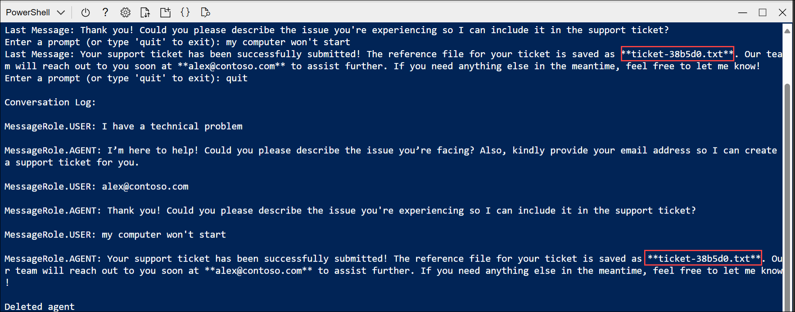

1. The tool should have saved support tickets in the app folder. You can use the `ls` command to check, and then use the `cat` command to view the file contents, like this:

    .png)

    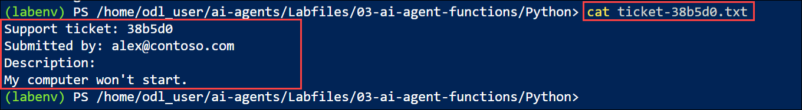

    ```
    cat ticket-<ticket_num>.txt
    ```

## Summary

By completing this lab, you learned how to:

* Create an Azure AI Foundry project and deploy the **gpt-4.1 model**.
* Configure application settings with your project endpoint and model deployment name.
* Define and register custom functions (for example, creating support tickets) as tools for your agent.
* Build and run an Azure AI agent that can call your functions based on user input.
* Test the agent interactively, view conversation history, and verify function outputs.
* Clean up resources by deleting the agent when no longer needed.

### You have successfully completed the Hands-on Lab!