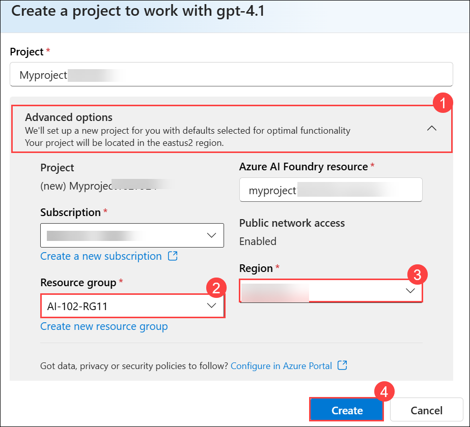
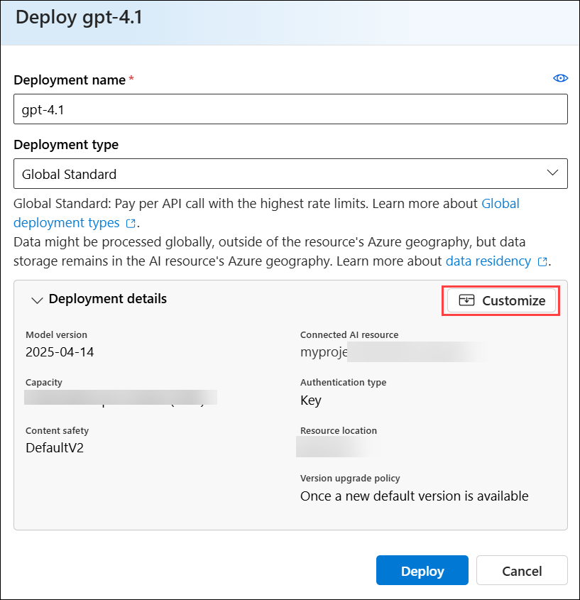
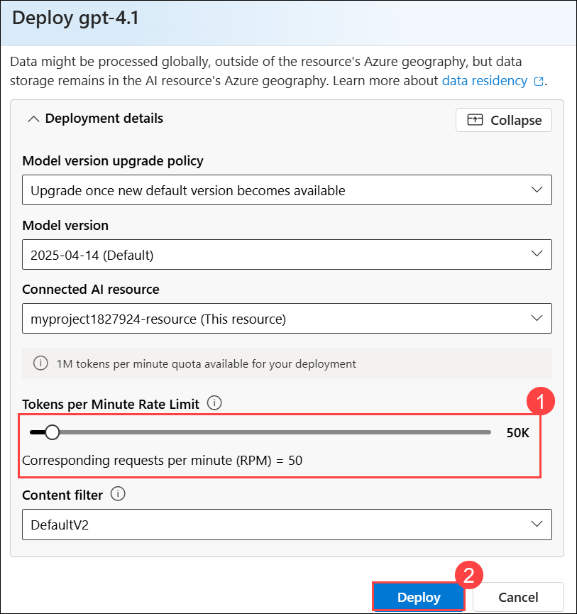
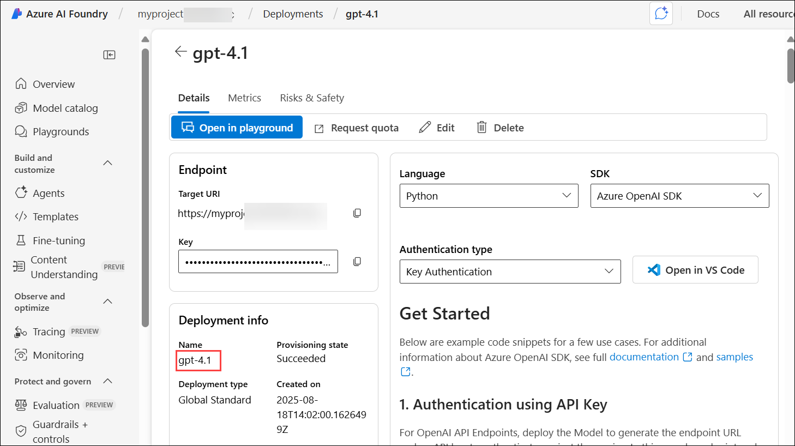
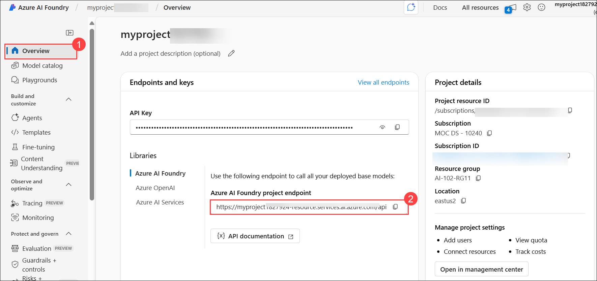

# Lab 11: Develop an Azure AI agent with the Semantic Kernel SDK

## Overview

In this lab, you'll use Azure AI Agent Service and Semantic Kernel to create an AI agent that processes expense claims.

### Task 1: Deploy a model in an Azure AI Foundry project

1. Open a new tab in the browser, right-click on the following link [Azure AI Foundry portal](https://ai.azure.com), then **Copy link** and paste it in a browser tab to log in to **Azure AI Foundry portal**.

1. Click on **Sign in**.

    

1. If prompted, provide the credentials below:

   - **Email/Username:** <inject key="AzureAdUserEmail"></inject>

   - **Password:** <inject key="AzureAdUserPassword"></inject>

1. In the home page, in the **Explore models and capabilities** section, search for the **gpt-4.1 (1)** model and then select **gpt-4.1 (2)** which we'll use in our project

     

1. Then at the top of the page for the model, select **Use this model**.

     

1. When prompted to create a project, enter the project name as **Myproject<inject key="DeploymentID" enableCopy="false"/>**.

     

1. Exapand **Advanced options (1)**, provide the below details and leave the rest to deafult:

    - Resource group: Select **AI-102-RG11 (2)**
    - Region: Select **Region**: Select **<inject key="Region" enableCopy="false" /> (3)**
    - Select **Create (4)**

       

1. Wait for your project to be created.  

1. On the **Deploy gpt-4.1** page, select **Customize**.

     

1. On the **Deploy gpt-4.1** page, make the following changes and then **Deploy (2)**

   - Tokens per Minute Rate Limit (thousands): `50K` **(1)** (or the maximum available in your subscription if less than 50K)

      

1. In the Setup pane, note the name of your model deployment; which should be **gpt-4.1**.

     

1. In the navigation pane on the left, select **Overview (1)** to see the main page for your project. Then copy ad past the Project endpoint **(2)**.

     