# Lab 10: Develop an Azure AI agent with the Semantic Kernel SDK

## Overview

In this lab, you will develop an Azure AI agent with the Semantic Kernel SDK to process expense claims end to end. You will deploy gpt-4.1 in an Azure AI Foundry project, configure the app to use the project endpoint and deployment name, and define the agent’s instructions and tools (including a simulated email plugin). You will run the agent against sample expenses and observe it generate a structured response and invoke the plugin to “send” an expense claim. Finally, you will validate the output to understand how Semantic Kernel orchestrates model calls and tool execution.

## Lab Objectives

- **Task 1:** Deploy a model in an Azure AI Foundry project

- **Task 2:** Create an agent client app

- **Task 3:** Configure the application settings

- **Task 4:** Write code for an agent app

- **Task 5:** Sign into Azure and run the app

### Task 1: Deploy a model in an Azure AI Foundry project

In this task, you’ll create a new Azure AI Foundry project and deploy the **gpt-4.1** model. By the end, you’ll have the **project endpoint** and **deployment name** ready for use in your application code.

1. Open a new tab in the browser, right-click on the following link [Azure AI Foundry portal](https://ai.azure.com), then **Copy link** and paste it in a browser tab to log in to **Azure AI Foundry portal**.

1. Click on **Sign in**.

    

1. If prompted, provide the credentials below:

   - **Email/Username:** <inject key="AzureAdUserEmail"></inject>

     

   - **Password:** <inject key="AzureAdUserPassword"></inject>

     

1. When the **Stay signed in?** window appears, select **No**.

    

1. Click on **X** to close the **Chat with Foundry Agent** popup window.

    

    >**Note:** Close the **Help** pane if it's open

1. In the home page, in the **Explore models and capabilities** section, search for the **gpt-4.1 (1)** model and then select **gpt-4.1 (2)** which we'll use in our project

     

1. Then at the top of the page for the model, select **Use this model**.

     

1. When prompted to create a project, enter the project name as **Myproject<inject key="DeploymentID" enableCopy="false"/>**.

     

1. Exapand **Advanced options (1)**, provide the below details and leave the rest to deafult:

    - Resource group: Select **AI-102-RG11 (2)**
    - Region: Select **Region**: Select **<inject key="Region" enableCopy="false" /> (3)**
    - Select **Create (4)**

       

1. Wait for your project to be created.  

1. On the **Deploy gpt-4.1** page, select **Customize**.

     

1. On the **Deploy gpt-4.1** page, make the following changes and then **Deploy (2)**

   - Tokens per Minute Rate Limit (thousands): `50K` **(1)** (or the maximum available in your subscription if less than 50K)

      

1. In the Setup pane, Copy and paste the name of your model deployment in a notepad, which should be **gpt-4.1**.

     

1. In the navigation pane on the left, select **Overview (1)** to see the main page for your project. Then copy and paste the Project endpoint **(2)** in a notepad for later use.

     

> **Congratulations** on completing the task! Now, it's time to validate it. Here are the steps:
>
> - Hit the Validate button for the corresponding task. If you receive a success message, you can proceed to the next task.
> - If not, carefully read the error message and retry the step, following the instructions in the lab guide.
> - If you need any assistance, please contact us at cloudlabs-support@spektrasystems.com. We are available 24/7 to help.
 
<validation step="412da72d-9077-4bed-899e-d2e2c021cd43" />
 
---  

### Task 2: Create an agent client app

In this task, you’ll open **Azure Cloud Shell**, clone the provided repository, and review the starter files for the agent sample. By the end, your workspace will contain the code scaffold you’ll extend with Semantic Kernel.

1. Navigate to [Azure portal](https://portal.azure.com/).

1. If prompted, provide the credentials below:

    - **Email/Username:** <inject key="AzureAdUserEmail"></inject>

    - **Password:** <inject key="AzureAdUserPassword"></inject>

1. Use the **[>_]** button to the right of the search bar at the top of the page to create a new **Cloud Shell** in the Azure portal.

     

1. Selecting a **PowerShell** environment.

     

1. On the **Getting started** page,

    - Select **No storage account required (1)** 
    - Select your subscription **(2)**
    - Click on **Apply (3)**

       

1. In the cloud shell toolbar, in the **Settings (1)** menu, select **Go to Classic version (2)** (this is required to use the code editor).

    

     >**Note**: The cloud shell provides a command-line interface in a pane at the bottom of the Azure portal. You can resize or maximize this pane to make it easier to work in.

     >**Note**: Ensure you've switched to the classic version of the cloud shell before continuing.

1. In the cloud shell pane, copy and paste the following commands to clone the GitHub repo containing the code files for this exercise.

    ```
    rm -r ai-agents -f
    git clone https://github.com/MicrosoftLearning/mslearn-ai-agents ai-agents
    ```

     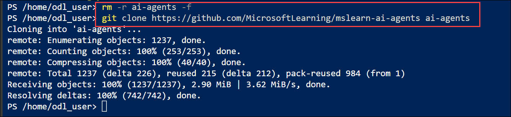    

     >**Tip**: As you enter commands into the cloudshell, the output may take up a large amount of the screen buffer and the cursor on the current line may be obscured. You can clear the screen by entering the `cls` command to make it easier to focus on each task.

1. When the repo has been cloned, enter the following command to change the working directory to the folder containing the code files and list them all.

    ```
    cd ai-agents/Labfiles/04-semantic-kernel/python
    ls -a -l
    ```

     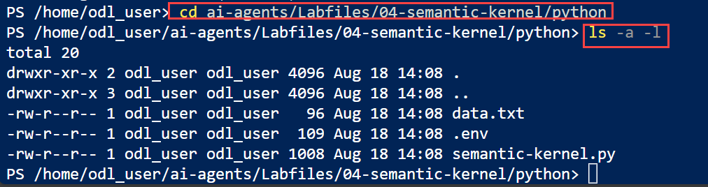       

     The provided files include application code a file for configuration settings, and a file containing expenses data.


### Task 3: Configure the application settings

In this task, you’ll set up a Python virtual environment, install dependencies, and update the `.env` file with your **project endpoint** and **gpt-4.1** deployment name. By the end, your app will be correctly wired to call your Azure AI Foundry project.

1. In the cloud shell command-line pane, enter the following command to install the libraries you'll use:

    ```
    python -m venv labenv
    ./labenv/bin/Activate.ps1
    pip install python-dotenv azure-identity semantic-kernel --upgrade 
    ```

    > **Note**: Installing **semantic-kernel** autmatically installs a semantic kernel-compatible version of **azure-ai-projects**.

1. Enter the following command to edit the configuration file that has been provided:

    ```
    code .env
    ```

     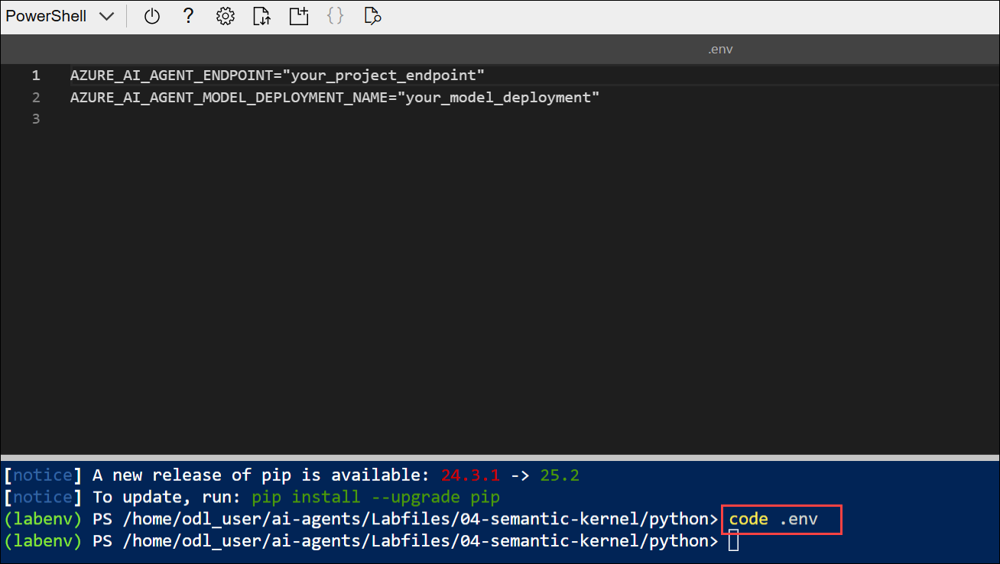     

     The file is opened in a code editor.     


1. In the code file, replace the **your_project_endpoint** placeholder with the endpoint for your project (copied from the project **Overview** page in the Azure AI Foundry portal in **Task 1**), and the **your_model_deployment** placeholder with  `gpt-4.1` model deployment.

    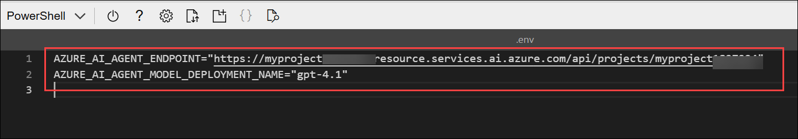

1. After you've replaced the placeholders, use the **CTRL+S** command to save your changes and then use the **CTRL+Q** command to close the code editor while keeping the cloud shell command line open.

### Task 4: Write code for an agent app

In this task, you’ll add imports, define a Semantic Kernel plugin (simulated email sender), create the agent definition and client, and implement the call flow to process expense data. By the end, the app will construct and run an agent that can invoke your custom function.

>**Note**: As you add code, be sure to maintain the correct indentation. Use the existing comments as a guide, entering the new code at the same level of indentation.

1. Enter the following command to edit the agent code file that has been provided:

    ```
    code semantic-kernel.py
    ```

1. Review the code in the file. It contains:

    - Some **import** statements to add references to commonly used namespaces
    - A **main** function that loads a file containing expenses data, asks the user for instructions, and and then calls...
    - A **process_expenses_data** function in which the code to create and use your agent must be added
    - An **EmailPlugin** class that includes a kernel function named **send_email**; which will be used by your agent to simulate the functionality used to send an email.
    
1. At the top of the file, after the existing **import** statement, find the comment **Add references**, and add the following code to reference the namespaces in the libraries you'll need to implement your agent:

    ```python
    # Add references
    from dotenv import load_dotenv
    from azure.identity.aio import DefaultAzureCredential
    from semantic_kernel.agents import AzureAIAgent, AzureAIAgentSettings, AzureAIAgentThread
    from semantic_kernel.functions import kernel_function
    from typing import Annotated
    ```

     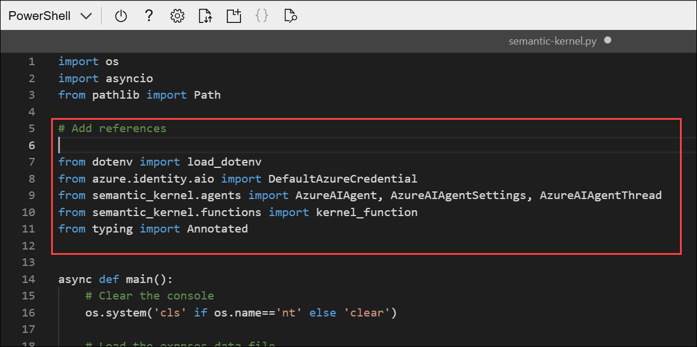    

1. Near the bottom of the file, find the comment **Create a Plugin for the email functionality**, and add the following code to define a class for a plugin containing a function that your agent will use to send email (plug-ins are a way to add custom functionality to Semantic Kernel agents)

    ```python
   # Create a Plugin for the email functionality
   class EmailPlugin:
       """A Plugin to simulate email functionality."""
    
       @kernel_function(description="Sends an email.")
       def send_email(self,
                      to: Annotated[str, "Who to send the email to"],
                      subject: Annotated[str, "The subject of the email."],
                      body: Annotated[str, "The text body of the email."]):
           print("\nTo:", to)
           print("Subject:", subject)
           print(body, "\n")
    ```

     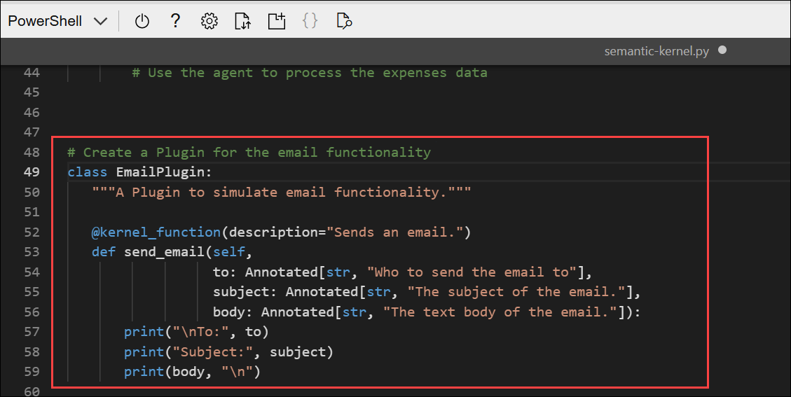     

      >**Note**: The function **simulates** sending an email by printing it to the console. In a real application, you'd use an SMTP service or similar to actually send the email!

1. Find the comment **Get configuration settings**, and add the following code to load the configuration file and create an **AzureAIAgentSettings** object (which will automatically include the Azure AI Agent settings from the configuration).

    ```python
   # Get configuration settings
   load_dotenv()
   ai_agent_settings = AzureAIAgentSettings()
    ```

     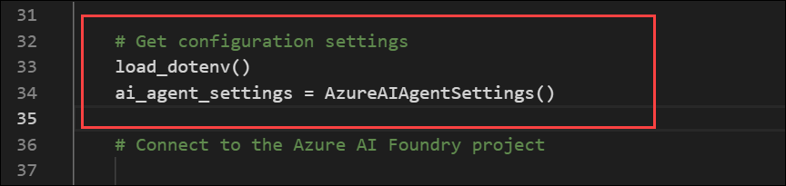 

      >**Note**:Be sure to maintain the indentation level.

1. Find the comment **Connect to the Azure AI Foundry project**, and add the following code to connect to your Azure AI Foundry project using the Azure credentials you're currently signed in with.

    ```python
   # Connect to the Azure AI Foundry project
   async with (
        DefaultAzureCredential(
            exclude_environment_credential=True,
            exclude_managed_identity_credential=True) as creds,
        AzureAIAgent.create_client(
            credential=creds
        ) as project_client,
   ):
    ```
        
     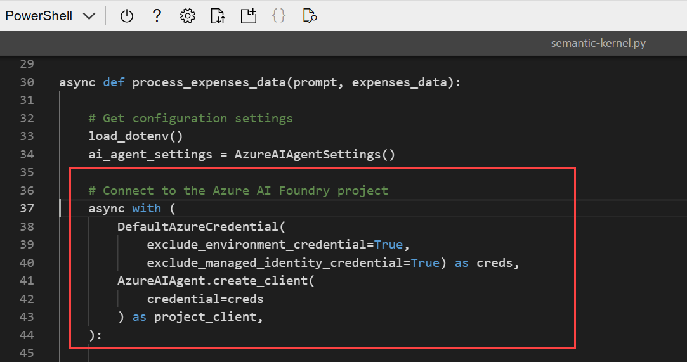 

      >**Note**:Be sure to maintain the indentation level.

1. Find the comment **Define an Azure AI agent that sends an expense claim email**, and add the following code to create an Azure AI Agent definition for your agent.

    ```python
   # Define an Azure AI agent that sends an expense claim email
   expenses_agent_def = await project_client.agents.create_agent(
        model= ai_agent_settings.model_deployment_name,
        name="expenses_agent",
        instructions="""You are an AI assistant for expense claim submission.
                        When a user submits expenses data and requests an expense claim, use the plug-in function to send an email to expenses@contoso.com with the subject 'Expense Claim`and a body that contains itemized expenses with a total.
                        Then confirm to the user that you've done so."""
   )
    ```

     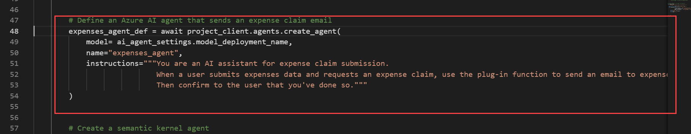 

      >**Note**:Be sure to maintain the indentation level.

1. Find the comment **Create a semantic kernel agent**, and add the following code to create a semantic kernel agent object for your Azure AI agent, and includes a reference to the **EmailPlugin** plugin.

    ```python
   # Create a semantic kernel agent
   expenses_agent = AzureAIAgent(
        client=project_client,
        definition=expenses_agent_def,
        plugins=[EmailPlugin()]
   )
    ```

     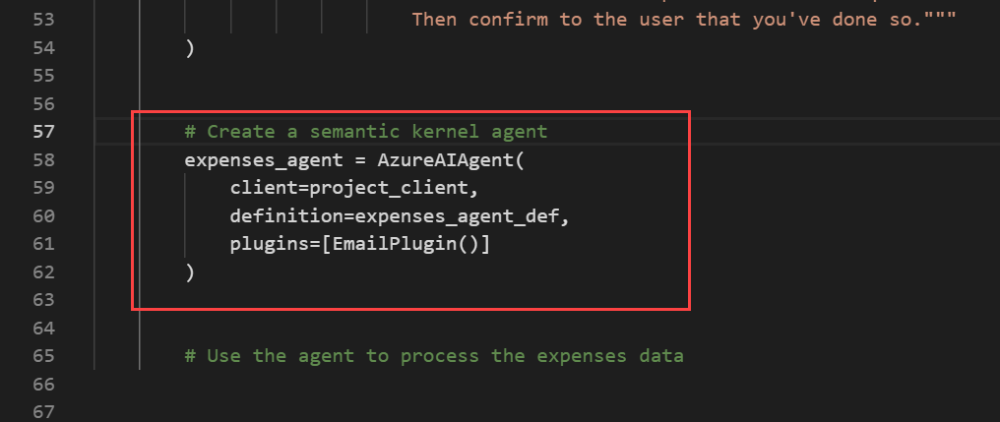 

      >**Note**:Be sure to maintain the indentation level.    

1. Find the comment **Use the agent to process the expenses data**, and add the following code to create a thread for your agent to run on, and then invoke it with a chat message.

    ```python
   # Use the agent to process the expenses data
   # If no thread is provided, a new thread will be
   # created and returned with the initial response
   thread: AzureAIAgentThread | None = None
   try:
        # Add the input prompt to a list of messages to be submitted
        prompt_messages = [f"{prompt}: {expenses_data}"]
        # Invoke the agent for the specified thread with the messages
        response = await expenses_agent.get_response(prompt_messages, thread=thread)
        # Display the response
        print(f"\n# {response.name}:\n{response}")
   except Exception as e:
        # Something went wrong
        print (e)
   finally:
        # Cleanup: Delete the thread and agent
        await thread.delete() if thread else None
        await project_client.agents.delete_agent(expenses_agent.id)
    ```
     
     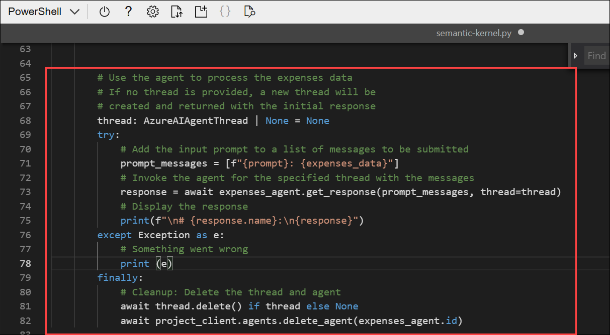 

      >**Note**:Be sure to maintain the indentation level.      

1. Review that the completed code for your agent, using the comments to help you understand what each block of code does, and then save your code changes (**CTRL+S**).

1. Keep the code editor open in case you need to correct any typo's in the code, but resize the panes so you can see more of the command line console.


### Task 5: Sign into Azure and run the app

In this task, you’ll authenticate with `az login` and execute the Python app to submit expense data to the agent. By the end, you’ll verify the agent’s response and observe it “sending” an expense-claim email via the plugin output.

1. In the cloud shell command-line pane beneath the code editor, enter the following command to sign into Azure **(1)**. Copy and paste the Sign in URL in the web browser **(2)**. Copy the device code as well to authenticate **(3)**.

    ```
    az login
    ```

          

    >**Note**: You must sign into Azure - even though the cloud shell session is already authenticated

    > **Note**: In most scenarios, just using *az login* will be sufficient. However, if you have subscriptions in multiple tenants, you may need to specify the tenant by using the *--tenant* parameter. See [Sign into Azure interactively using the Azure CLI](https://learn.microsoft.com/cli/azure/authenticate-azure-cli-interactively) for details.
    
1. Paste the copied device code **(1)** and then select **Next (2)**.

     

1. Select your account **<inject key="AzureAdUserEmail"></inject>** to sign in.

      

1. Click on **Continue** to sign in to Azure CLI.

      

1. Press **Enter** to accept the default the subscription.

     

1. After you have signed in, enter the following command to run the application:

    ```
   python semantic-kernel.py
    ```
    
    The application runs using the credentials for your authenticated Azure session to connect to your project and create and run the agent.

1. When asked what to do with the expenses data, enter the following prompt:

    ```
   Submit an expense claim
    ```

     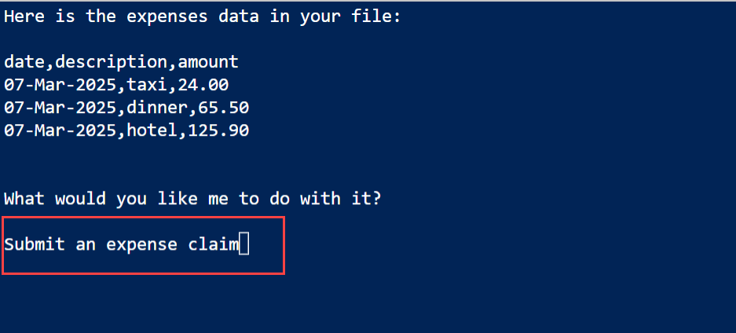    

1. When the application has finished, review the output. The agent should have composed an email for an expenses claim based on the data that was provided.

     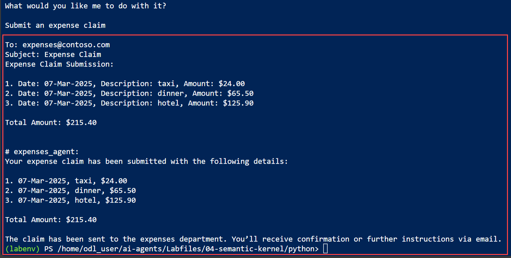  

     >**Tip**: If the app fails because the rate limit is exceeded. Wait a few seconds and try again. If there is insufficient quota available in your subscription, the model may not be able to respond.

## Summary

In this lab, you created an Azure AI Foundry project and deployed gpt-4.1, capturing the project endpoint and deployment name. You set up Azure Cloud Shell, cloned the repo, configured the app, and used the Semantic Kernel SDK to define an agent with instructions and a simulated email plugin. You authenticated and ran the app against sample expense data, reviewed the agent’s response, and confirmed it generated a structured claim and invoked the plugin.

### You have successfully completed the Hands-on Lab!


