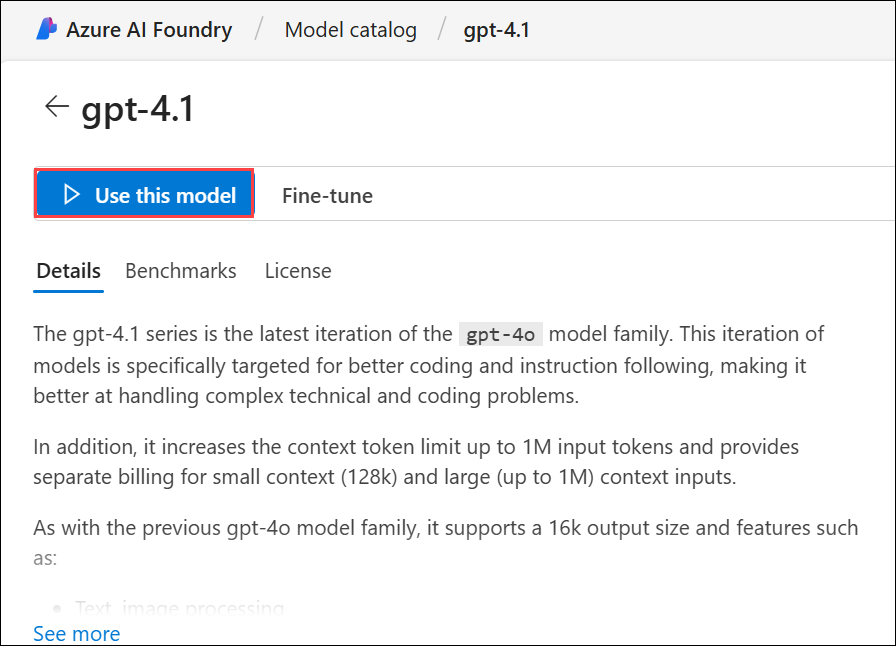
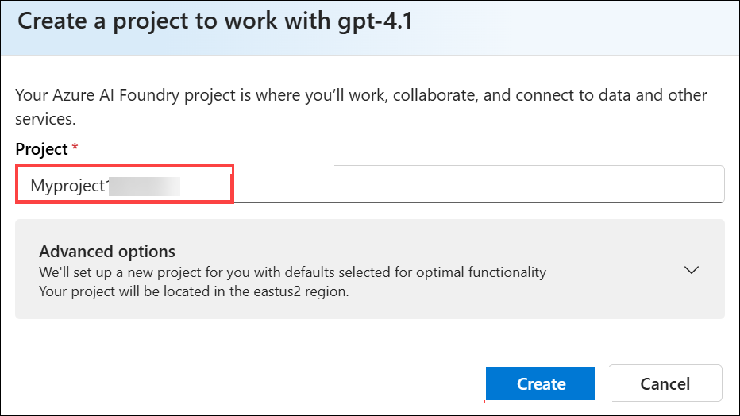
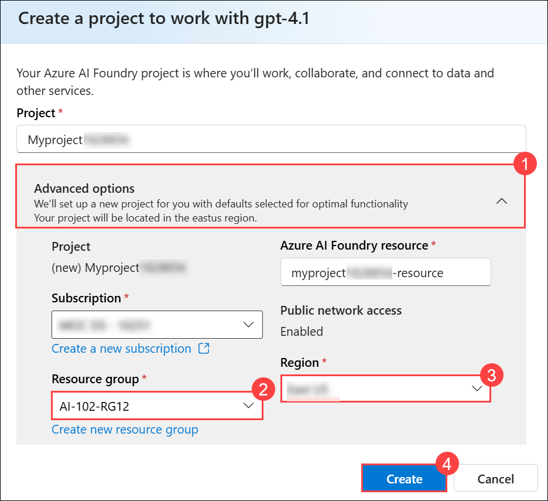
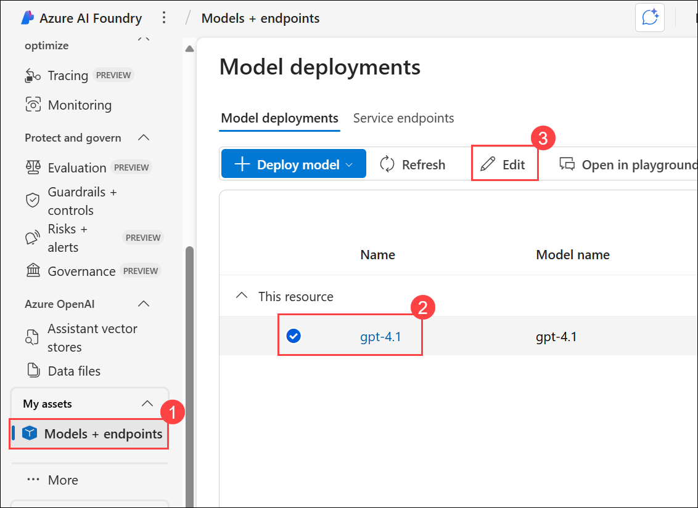
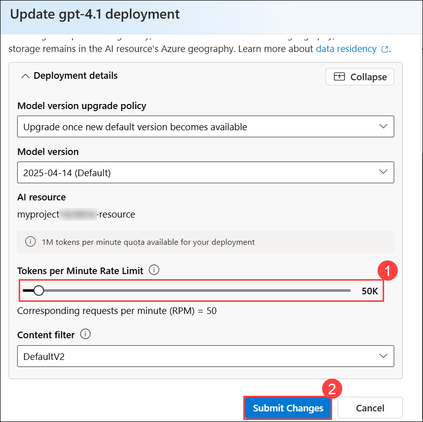

# Lab 11: Develop a multi-agent solution with Semantic Kernel

### Estimated Duration: 30 Minutes

## Overview

In this lab, you’ll build a multi-agent application using the **Semantic Kernel SDK** and Azure OpenAI. You’ll start by deploying the **gpt-4.1** model in Azure AI Foundry, configuring its deployment settings, and capturing the endpoint and key for later use. Then, you’ll set up an AI Agent client app in Cloud Shell, install the required dependencies, and configure it with your deployment details. Next, you’ll define three agents: a *Summarizer Agent* to condense customer feedback, a *Classifier Agent* to categorize the sentiment, and an *Action Agent* to suggest next steps. You’ll orchestrate these agents sequentially so their outputs build on each other, and finally, you’ll run the app in Azure to observe the workflow in action with different feedback examples.

## Lab Objectives

- **Task 1:** Deploy a model in an Azure AI Foundry project

- **Task 2:** Create an AI Agent client app

- **Task 3:** Create AI agents

- **Task 4:** Create a sequential orchestration

- **Task 5:** Sign into Azure and run the app

## Task 1: Deploy a model in an Azure AI Foundry project

In this task, you’ll sign in to the Azure AI Foundry portal, create a new project using the gpt-4.1 model, configure its deployment settings (including rate limits), and capture the project endpoint for later use in connecting your client application.

1. Open a new tab in the browser, right-click on the following link [Azure AI Foundry portal](https://ai.azure.com) `https://ai.azure.com`, then **Copy link** and paste it in a browser tab to log in to **Azure AI Foundry portal**.

1. Click on **Sign in**.
 
    

1. If prompted, provide the credentials below:
 
   - **Email/Username:** <inject key="AzureAdUserEmail"></inject>
    
        

   - **Password:** <inject key="AzureAdUserPassword"></inject>
    
        

1. When the **Stay signed in?** window appears, select **No**.

    

1. Click on **X** to close the **Chat with Foundry Agent** popup window.

    

    >**Note:** Close the **Help** pane if it's open

1. In the home page, in the **Explore models and capabilities** section, search for the **gpt-4.1 (1)** model and then select **gpt-4.1 (2)** which we'll use in our project.

     

1. Then, at the top of the page for the model, select **Use this model**.

     

1. When prompted to create a project, enter the project name as **Myproject<inject key="DeploymentID" enableCopy="false"/>**.

     

1. Expand **Advanced options (1)**, provide the details below, and leave the rest to default:

    - Resource group: **AI-102-RG12 (2)**
    - Region: **<inject key="Region" enableCopy="false" /> (3)**
    - Click **Create (4)**

       

1. Wait for the project to finish creating. Once it’s ready, the chat playground will open automatically.

1. In the **Setup** pane, note the name of your model deployment; which should be **gpt-4.1**

    .png)

1. In the navigation pane on the left, select **Models + endpoints (1)** and then select your **gpt-4.1 (2)** deployment and click on **Edit (3)**.

    

1. Update the **Tokens per Minute Rate Limit** for **gpt-4.1** to **50K (1)** and then click **Submit Changes (2)**.

    

1. Now in the left navigation pane, select **Overview (1)**. Under the **Libraries** section, choose **Azure OpenAI (2)**. Copy the endpoint and API key by clicking **Copy Azure OpenAI endpoint (3)** and **Copy API Key (4)**, then paste them into Notepad. You’ll use these values later to connect your client application to the project.

    .png)

> **Congratulations** on completing the task! Now, it's time to validate it. Here are the steps:
>
> - Hit the Validate button for the corresponding task. If you receive a success message, you can proceed to the next task.
> - If not, carefully read the error message and retry the step, following the instructions in the lab guide.
> - If you need any assistance, please contact us at cloudlabs-support@spektrasystems.com. We are available 24/7 to help.
 
<validation step="5067f59b-415f-4007-9926-ff36dcc942d8" />

## Task 2: Create an AI Agent client app

In this task, you’ll open the Azure portal, launch Cloud Shell with PowerShell, and clone the GitHub repository that contains the AI Agent client app code. You’ll set up a Python virtual environment, install the required libraries, and update the provided configuration file with your Azure OpenAI endpoint, API key, and model deployment name to prepare the client app for use.

1. Open a new browser tab (keeping the Azure AI Foundry portal open in the existing tab). Then in the new tab, browse to the [Azure portal](https://portal.azure.com) at `https://portal.azure.com`.

1. If prompted, provide the credentials below:

    - **Email/Username:** <inject key="AzureAdUserEmail"></inject>

    - **Password:** <inject key="AzureAdUserPassword"></inject> 

        >**Note:** If the **Welcome to Microsoft Azure** window appears, select **Cancel**.

        

1. On the **Azure portal** homepage, click the **\[>\_] Cloud Shell (1)** button located to the right of the **Copilot** tab at the top. This opens a new Cloud Shell session. In the **Welcome to Azure Cloud Shell** window, choose **PowerShell (2)**.

    

    >**Note:** The cloud shell provides a command-line interface in a pane at the bottom of the Azure portal. You can resize or maximize this pane to make it easier to work in.

    > **Note:** If you have previously created a cloud shell that uses a **Bash** environment, switch it to **PowerShell**.

1. In the **Getting started** window, ensure **No storage account required (1)** is selected. From the **Subscription** drop-down, choose **Default subscription (2)**, then click **Apply (3)**.

    

1. In the Cloud Shell toolbar, open the **Settings (1)** menu and choose **Go to Classic version (2)** from the drop-down.

    

    >**Note:** Ensure you've switched to the classic version of the cloud shell before continuing.

1. In the cloud shell pane, enter the following commands to clone the GitHub repo containing the code files for this exercise (type the command, or copy it to the clipboard and then right-click in the command line and paste as plain text):

    ```
    rm -r ai-agents -f
    git clone https://github.com/MicrosoftLearning/mslearn-ai-agents ai-agents
    ```

    .png)

    > **Note:** As you enter commands into the cloud shell, the output may take up a large amount of the screen buffer and the cursor on the current line may be obscured. You can clear the screen by entering the `cls` command to make it easier to focus on each task.

1. When the repo has been cloned, enter the following command to change the working directory to the folder containing the code files and list them all.

    ```
    cd ai-agents/Labfiles/05-agent-orchestration/Python
    ls -a -l
    ```

    .png)

    The provided files include application code and a file for configuration settings.

1. In the cloud shell command-line pane, enter the following command to install the libraries you'll use:

    ```
    python -m venv labenv
    ./labenv/bin/Activate.ps1
    pip install python-dotenv azure-identity semantic-kernel --upgrade
    ```

    > **Note**: Installing *semantic-kernel* automatically installs a semantic kernel-compatible version of *azure-ai-projects*.

1. Enter the following command to edit the configuration file that is provided. The file is opened in a code editor.

    ```
    code .env
    ```

    .png)

1. In the code file, replace the placeholder values with the correct details for your project:

    * AZURE_OPENAI_ENDPOINT : **Azure OpenAI endpoint (1)**
    * AZURE_OPENAI_API_KEY : **API Key (2)** 
    * AZURE_OPENAI_CHAT_DEPLOYMENT_NAME : **gpt-4.1 (3)**

        .png)

1. After you've replaced the placeholders, use the **CTRL+S** command to save your changes and then use the **CTRL+Q** command to close the code editor while keeping the cloud shell command line open.

## Task 3: Create AI agents

In this task, you’ll edit the **agents.py** file to define three AI agents using the Semantic Kernel SDK. You’ll create a *Summarizer Agent* to condense customer feedback, a *Classifier Agent* to label the feedback as Positive, Negative, or Feature request, and an *Action Agent* to suggest next steps based on the analysis. Finally, you’ll return the agents in a list to prepare them for orchestration.

1. Enter the following command to edit the **agents.py** file:

    ```
    code agents.py
    ```

    .png)

1. At the top of the file under the comment **Add references**, and add the following code to reference the namespaces in the libraries you'll need to implement your agent:

    ```python
    # Add references
    import asyncio
    from semantic_kernel.agents import Agent, ChatCompletionAgent, SequentialOrchestration
    from semantic_kernel.agents.runtime import InProcessRuntime
    from semantic_kernel.connectors.ai.open_ai import AzureChatCompletion
    from semantic_kernel.contents import ChatMessageContent
    ```

    .png)

1. In the **get_agents** function, add the following code under the comment **Create a summarizer agent**:

    ```python
    # Create a summarizer agent
    summarizer_agent = ChatCompletionAgent(
        name="SummarizerAgent",
        instructions="""
        Summarize the customer's feedback in one short sentence. Keep it neutral and concise.
        Example output:
        App crashes during photo upload.
        User praises dark mode feature.
        """,
        service=AzureChatCompletion(),
    )
    ```

    .png)

1. Add the following code under the comment **Create a classifier agent**:

    ```python
    # Create a classifier agent
    classifier_agent = ChatCompletionAgent(
        name="ClassifierAgent",
        instructions="""
        Classify the feedback as one of the following: Positive, Negative, or Feature request.
        """,
        service=AzureChatCompletion(),
    )
    ```

    .png)

1. Add the following code under the comment **Create a recommended action agent**:

    ```python
    # Create a recommended action agent
    action_agent = ChatCompletionAgent(
        name="ActionAgent",
        instructions="""
        Based on the summary and classification, suggest the next action in one short sentence.
        Example output:
        Escalate as a high-priority bug for the mobile team.
        Log as positive feedback to share with design and marketing.
        Log as enhancement request for product backlog.
        """,
        service=AzureChatCompletion(),
    )
    ```

    .png)

1. Add the following code under the comment **Return a list of agents**:

    ```python
    # Return a list of agents
    return [summarizer_agent, classifier_agent, action_agent]
    ```

    .png)

    The order of the agents in this list will be the order that they are selected during the orchestration.

## Task 4: Create a sequential orchestration

In this task, you’ll build a sequential orchestration that coordinates the agents you created earlier. You’ll initialize a sample customer feedback input, define a sequential orchestration with a response callback to capture each agent’s output, and run it within an in-process runtime. You’ll then invoke the orchestration, retrieve and display the final result, and stop the runtime once processing is complete.

1. In the **main** function, find the comment **Initialize the input task** and add the following code:
    
    ```python
    # Initialize the input task
    task="""
    I tried updating my profile picture several times today, but the app kept freezing halfway through the process. 
    I had to restart it three times, and in the end, the picture still wouldn't upload. 
    It's really frustrating and makes the app feel unreliable.
    """
    ```

    .png)

1. Under the comment **Create a sequential orchestration**, add the following code to define a sequential orchestration with a response callback:

    ```python
    # Create a sequential orchestration
    sequential_orchestration = SequentialOrchestration(
        members=get_agents(),
        agent_response_callback=agent_response_callback,
    )
    ```

    .png)

    The `agent_response_callback` will allow you to view the response from each agent during the orchestration.

1. Add the following code under the comment **Create a runtime and start it**:

    ```python
   # Create a runtime and start it
   runtime = InProcessRuntime()
   runtime.start()
    ```
    
    .png)

1. Add the following code under the comment **Invoke the orchestration with a task and the runtime**:

    ```python
   # Invoke the orchestration with a task and the runtime
   orchestration_result = await sequential_orchestration.invoke(
       task=task,
       runtime=runtime,
   )
    ```

    .png)

1. Add the following code under the comment **Wait for the results**:

    ```python
   # Wait for the results
   value = await orchestration_result.get(timeout=20)
   print(f"\n****** Task Input ******{task}")
   print(f"***** Final Result *****\n{value}")
    ```

    .png)

    In this code, you retrieve and display the result of the orchestration. If the orchestration does not complete within the specified timeout, a timeout exception will be thrown.

1. Find the comment **Stop the runtime when idle**, and add the following code:

    ```python
   # Stop the runtime when idle
   await runtime.stop_when_idle()
    ```

    .png)

    After processing is complete, stop the runtime to clean up resources.

1. Use the **CTRL+S** command to save your changes to the code file. You can keep it open (in case you need to edit the code to fix any errors) or use the **CTRL+Q** command to close the code editor while keeping the cloud shell command line open.

## Task 5: Sign into Azure and run the app

In this task, you’ll sign in to Azure from Cloud Shell using the Azure CLI and verify your subscription. You’ll then run the `agents.py` application to test the multi-agent workflow, observe the outputs from each agent, and review the final result. Optionally, you can rerun the app with different input examples to see how the agents handle varied feedback.

1. In the cloud shell command-line pane, enter the following command to sign into Azure. Click on the **Link (1)** and copy the **code (2)** provided.

    ```
    az login
    ```

    

1. In the new browser tab, when the **Enter code to allow access** window appears, paste the copied code and select **Next**.

    

1. In the **Pick an account** dialog box, choose **ODL_User<inject key="DeploymentID"></inject>**. 

    

1. In the **Are you trying to sign in to Microsoft Azure CLI?** dialog box, click **Continue**.

    

1. When the **Microsoft Azure Cross-platform Command Line Interface** window pops up, return to the browser tab with Cloud Shell open. 

    

1. In the Cloud Shell console, press **Enter** to select the only available subscription.

    

1. After you have signed in, enter the following command to run the application:

    ```
   python agents.py
    ```

1. You should see some output similar to the following:

    ```output
    # SummarizerAgent
    App freezes during profile picture upload, preventing completion.
    # ClassifierAgent
    Negative
    # ActionAgent
    Escalate as a high-priority bug for the development team.

    ****** Task Input ******
    I tried updating my profile picture several times today, but the app kept freezing halfway through the process.
    I had to restart it three times, and in the end, the picture still wouldn't upload.
    It's really frustrating and makes the app feel unreliable.

    ***** Final Result *****
    Escalate as a high-priority bug for the development team.
    ```

    .png)

1. Optionally, you can try running the code using different task inputs, such as:

    ```output
    I use the dashboard every day to monitor metrics, and it works well overall. But when I'm working late at night, the bright screen is really harsh on my eyes. If you added a dark mode option, it would make the experience much more comfortable.
    ```

    .png)

    .png)

1. You can also try running the code using the task inputs given below:

    ```output
    I reached out to your customer support yesterday because I couldn't access my account. The representative responded almost immediately, was polite and professional, and fixed the issue within minutes. Honestly, it was one of the best support experiences I've ever had.
    ```

## Summary

In this lab, you built a **multi-agent workflow** in **Azure AI Foundry** using the **Semantic Kernel SDK**. You deployed the *gpt-4.1* model, created a Python client app, and configured it with your project’s endpoint and key. You then implemented three agents — a *Summarizer Agent* to condense feedback, a *Classifier Agent* to label sentiment, and an *Action Agent* to suggest next steps. You orchestrated them sequentially, ran the solution in Cloud Shell, and tested it with sample customer feedback to verify that the agents collaborated effectively to analyze input and recommend appropriate actions.

### You have successfully completed the Hands-on Lab!