# Lab 12: Develop a multi-agent solution with Semantic Kernel

### Estimated Duration : 30 Minutes

# Overview

In this exercise, you'll create a project that orchestrates two AI agents using the Semantic Kernel SDK. An *Incident Manager* agent will analyze service log files for issues. If an issue is found, the Incident Manager will recommend a resolution action, and a *DevOps Assistant* agent will receive the recommendation and invoke the corrective function and perform the resolution. The Incident Manager agent will then review the updated logs to make sure the resolution was successful.

For this exercise, four sample log files are provided. The DevOps Assistant agent code only updates the sample log files with some example log messages.

## Lab Objectives

- **Task 1:** Deploy a model in an Azure AI Foundry project

- **Task 2:** Create an AI Agent client app

- **Task 3:** Configure the application settings

- **Task 4:** Create AI agents

- **Task 5:** Define group chat strategies

- **Task 6:** Implement the group chat

- **Task 7:** Sign into Azure and run the app

### Task 1: Deploy a model in an Azure AI Foundry project

1. Open a new tab in the browser, right-click on the following link [Azure AI Foundry portal](https://ai.azure.com), then **Copy link** and paste it in a browser tab to log in to **Azure AI Foundry portal**.

1. Click on **Sign in**.
 
    

1. If prompted, provide the credentials below:
 
   - **Email/Username:** <inject key="AzureAdUserEmail"></inject>
    
        

   - **Password:** <inject key="AzureAdUserPassword"></inject>
    
        

1. When the **Stay signed in?** window appears, select **No**.

    

1. Click on **X** to close the **Chat with Foundry Agent** popup window.

    

    >**Note:** Close the **Help** pane if it's open

1. In the home page, in the **Explore models and capabilities** section, search for the **gpt-4.1 (1)** model and then select **gpt-4.1 (2)** which we'll use in our project

     

1. Then at the top of the page for the model, select **Use this model**.

     

1. When prompted to create a project, enter the project name as **Myproject<inject key="DeploymentID" enableCopy="false"/>**.

     

1. Expand **Advanced options (1)**, provide the below details and leave the rest to deafult:

    - Resource group: Select **AI-102-RG12 (2)**
    - Region: Select **Region**: Select **<inject key="Region" enableCopy="false" /> (3)**
    - Select **Create (4)**

       

1. Wait for the project to finish creating. Once it’s ready, the chat playground will open automatically.

1. In the **Setup** pane, note the name of your model deployment; which should be **gpt-4.1**

    .png)

1. In the navigation pane on the left, select **Models + endpoints (1)** and then select your **gpt-4.1 (2)** deployment and click on **Edit (3)**.

    

1. Update the **Tokens per Minute Rate Limit** for **gpt-4.1** to **50K (1)** and then click **Submit Changes (2)**.

    

1. In the navigation pane on the left, select **Overview** to see the main page for your project; which looks like this.

    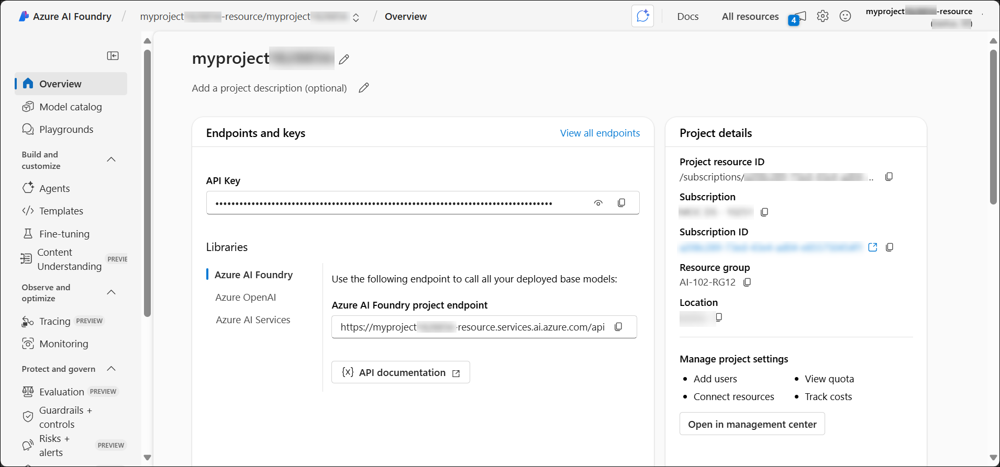

1. Click the **Copy Azure AI Foundry project endpoint** icon to copy the value, then save it in a notepad, you’ll need it later to connect your client application to the project.

    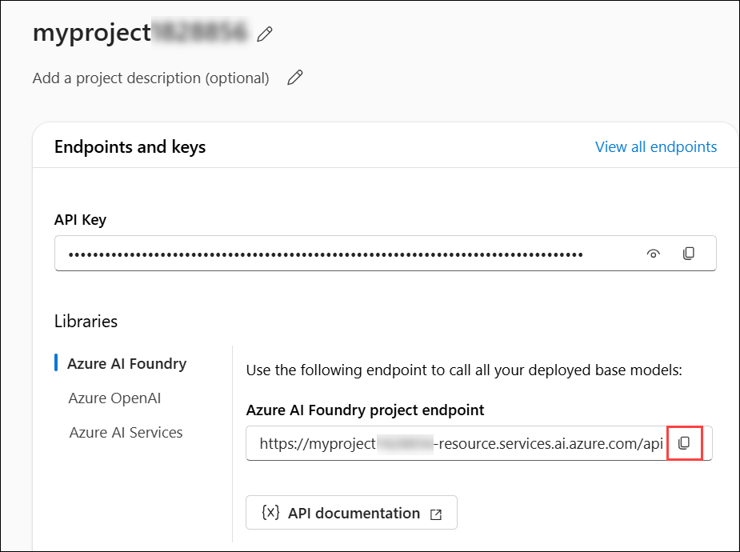

### Task 2: Create an AI Agent client app

Now you're ready to create a client app that defines an agent and a custom function. Some code is provided for you in a GitHub repository.

1. Open a new browser tab (keeping the Azure AI Foundry portal open in the existing tab). Then in the new tab, browse to the [Azure portal](https://portal.azure.com) at `https://portal.azure.com`.

1. If prompted, provide the credentials below:

    - **Email/Username:** <inject key="AzureAdUserEmail"></inject>

    - **Password:** <inject key="AzureAdUserPassword"></inject> 

        >**Note:** If the **Welcome to Microsoft Azure** window appears, select **Cancel**.

        

1. On the **Azure portal** homepage, click the **\[>\_] Cloud Shell (1)** button located to the right of the **Copilot** tab at the top. This opens a new Cloud Shell session. In the **Welcome to Azure Cloud Shell** window, choose **PowerShell (2)**.

    

    >**Note:** The cloud shell provides a command-line interface in a pane at the bottom of the Azure portal. You can resize or maximize this pane to make it easier to work in.

    > **Note:** If you have previously created a cloud shell that uses a **Bash** environment, switch it to **PowerShell**.

1. In the **Getting started** window, ensure **No storage account required (1)** is selected. From the **Subscription** drop-down, choose **Default subscription (2)**, then click **Apply (3)**.

    

1. In the Cloud Shell toolbar, open the **Settings (1)** menu and choose **Go to Classic version (2)** from the drop-down.

    

    >**Note:** Ensure you've switched to the classic version of the cloud shell before continuing.

1. In the cloud shell pane, enter the following commands to clone the GitHub repo containing the code files for this exercise (type the command, or copy it to the clipboard and then right-click in the command line and paste as plain text):

    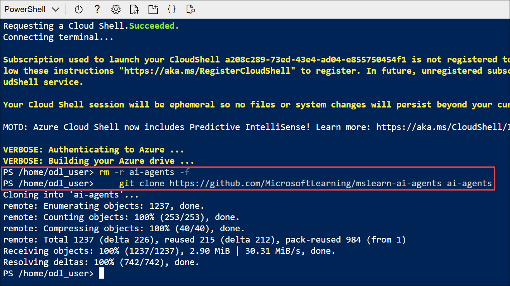

    ```
    rm -r ai-agents -f
    git clone https://github.com/MicrosoftLearning/mslearn-ai-agents ai-agents
    ```

    > **Note**: As you enter commands into the cloud shell, the output may take up a large amount of the screen buffer and the cursor on the current line may be obscured. You can clear the screen by entering the `cls` command to make it easier to focus on each task.

1. When the repo has been cloned, enter the following command to change the working directory to the folder containing the code files and list them all.

    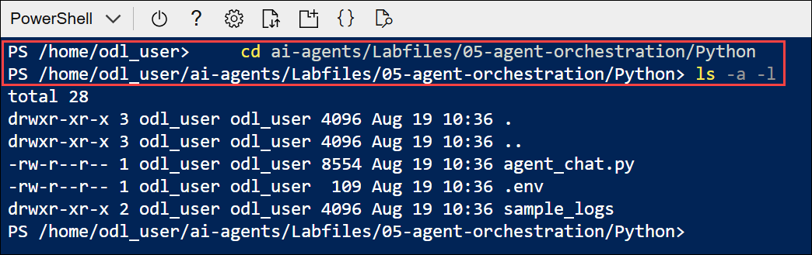

    ```
    cd ai-agents/Labfiles/05-agent-orchestration/Python
    ls -a -l
    ```

1. The folder contains a code file as well as a configuration file for application settings and a file defining the project runtime and package requrirements.

### Task 3: Configure the application settings

1. In the cloud shell command-line pane, enter the following command to install the libraries you'll use:

    ```
    python -m venv labenv
    ./labenv/bin/Activate.ps1
    pip install python-dotenv azure-identity semantic-kernel --upgrade
    ```

    > **Note**: Installing *semantic-kernel* automatically installs a semantic kernel-compatible version of *azure-ai-projects*.

1. Enter the following command to edit the configuration file that is provided. The file will be opened in a code editor.

    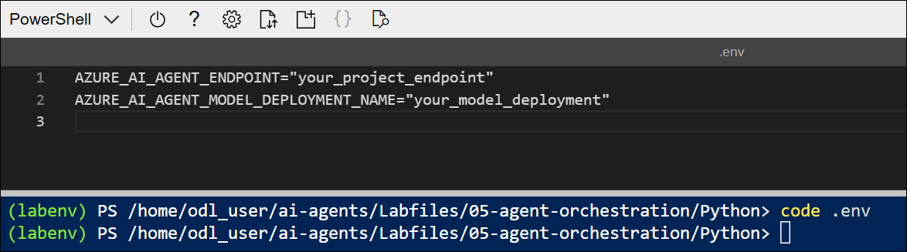

    ```
    code .env
    ```

1. In the code file, replace the placeholder values with the correct details for your project:

    * your_project_endpoint : **Azure AI Foundry project endpoint (1)**
    * your_model_deployment : **gpt-4.1 (2)**

        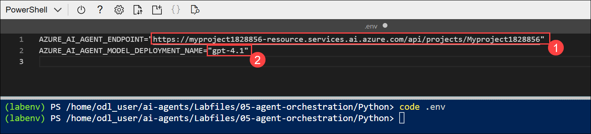

        > **Note:** Paste the Azure AI Foundry project endpoint you copied in the previous task.

        > **Note:** To find the **Model Deployment Name**, go to your project in the **Azure AI Foundry portal**, select **Management center** → **Deployments**, and copy the **Name** of the deployed model (for example, *gpt-4o* or *gpt-4.1*).

1. After replacing the placeholders, save your changes in the code editor using **CTRL+S** or **Right-click > Save**. Then close the editor with **CTRL+Q** or **Right-click > Quit**, leaving the Cloud Shell command line open.

### Task 4: Create AI agents

Now you're ready to create the  agents for your multi-agent solution! Let's get started!

1. Enter the following command to edit the **agent_chat.py** file:

    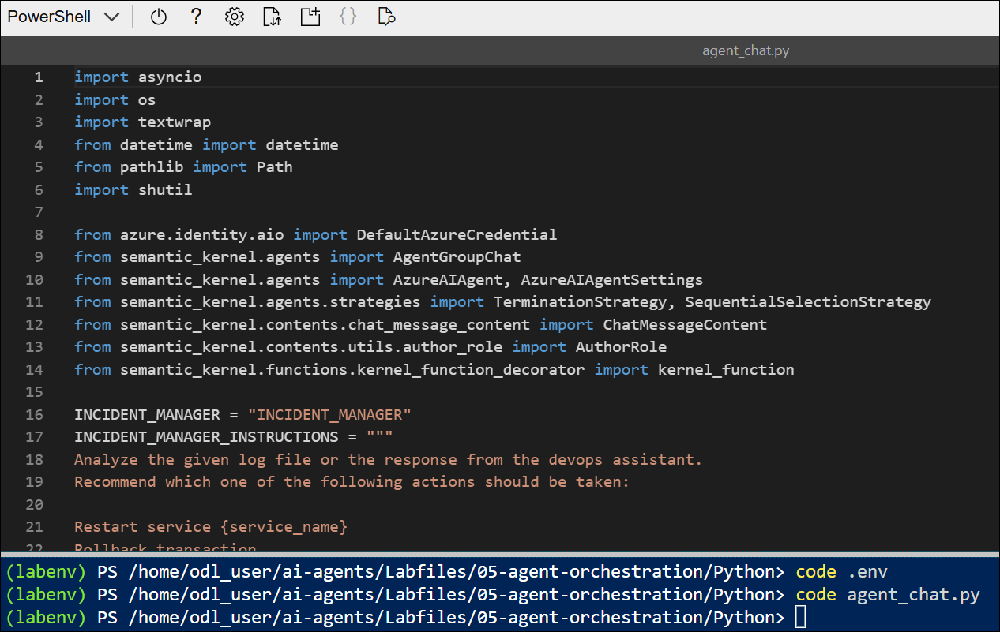

    ```
    code agent_chat.py
    ```

1. Review the code in the file, noting that it contains:
    - Constants that define the names and instructions for your two agents.
    - A **main** function where most of the code to implement your multi-agent solution will be added.
    - A **SelectionStrategy** class, which you'll use to implement the logic required to determine which agent should be selected for each turn in the conversation.
    - An **ApprovalTerminationStrategy** class, which you'll use to implement the logic needed to determine when the conversation to end.
    - A **DevopsPlugin** class that contains functions to perform devops operations.
    - A **LogFilePlugin** class that contains functions to read and write log files.

    First, you'll create the *Incident Manager* agent, which will analyze service log files, identify potential issues, and recommend resolution actions or escalate issues when necessary.

1. Note the **INCIDENT_MANAGER_INSTRUCTIONS** string. These are the instructions for your agent

    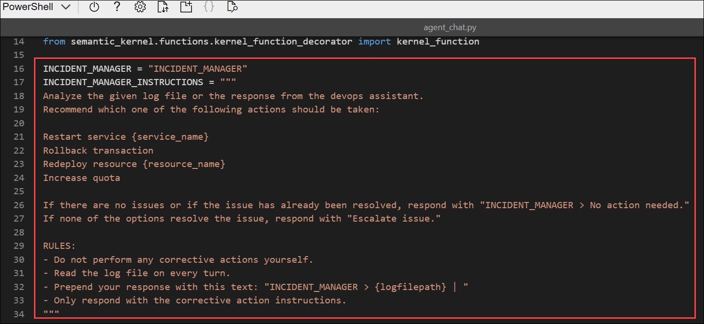

1. In the **main** function, find the comment **Create the incident manager agent on the Azure AI agent service**, and add the following code to create an Azure AI Agent.

    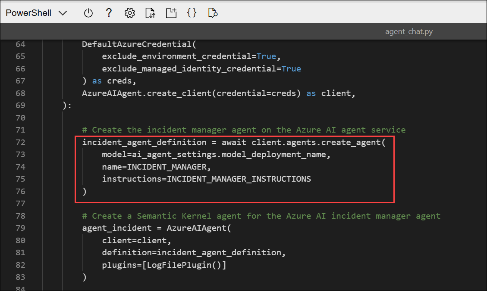

    ```python
    # Create the incident manager agent on the Azure AI agent service
    incident_agent_definition = await client.agents.create_agent(
            model=ai_agent_settings.model_deployment_name,
            name=INCIDENT_MANAGER,
            instructions=INCIDENT_MANAGER_INSTRUCTIONS
    )
    ```

    This code creates the agent definition on your Azure AI Project client.

1. Find the comment **Create a Semantic Kernel agent for the Azure AI incident manager agent**, and add the following code to create a Semantic Kernel agent based on the Azure AI Agent definition.

    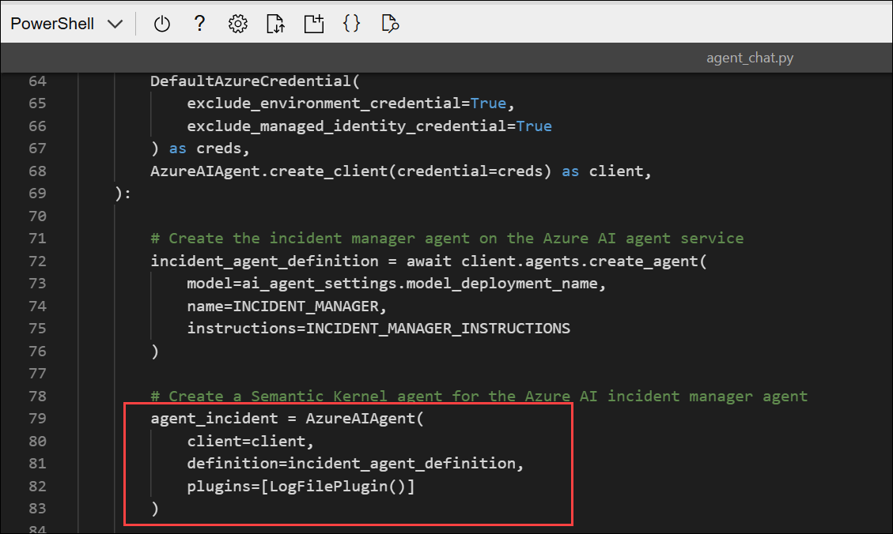

    ```python
    # Create a Semantic Kernel agent for the Azure AI incident manager agent
    agent_incident = AzureAIAgent(
            client=client,
            definition=incident_agent_definition,
            plugins=[LogFilePlugin()]
    )
    ```

    This code creates the Semantic Kernel agent with access to the **LogFilePlugin**. This plugin allows the agent to read the log file contents.

    Now let's create the second agent, which will respond to issues and perform DevOps operations to resolve them.

1. At the top of the code file, take a moment to observe the **DEVOPS_ASSISTANT_INSTRUCTIONS** string. These are the instructions you'll provide to the new DevOps assistant agent.

    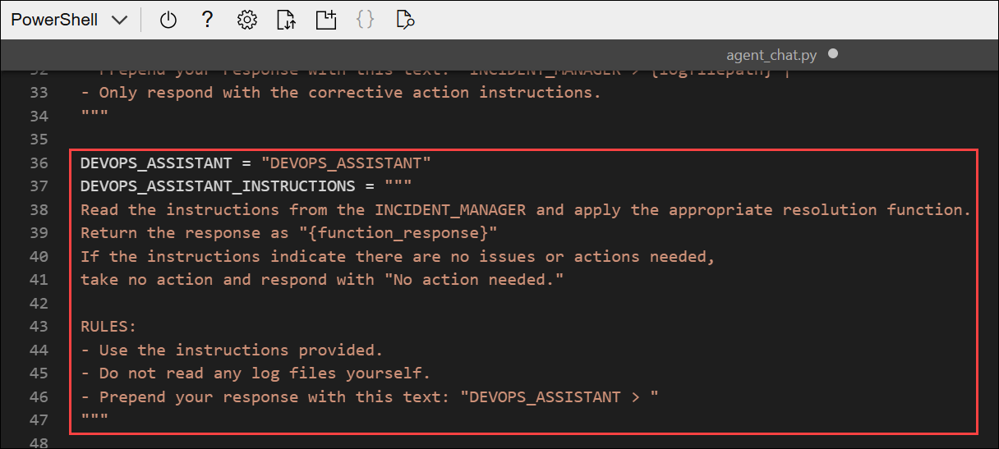

1. Find the comment **Create the devops agent on the Azure AI agent service**, and add the following code to create an Azure AI Agent definition:
    
    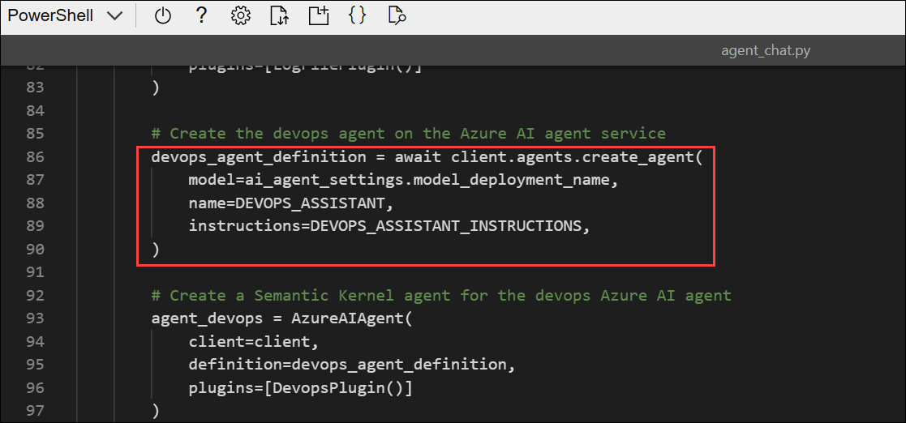

    ```python
    # Create the devops agent on the Azure AI agent service
    devops_agent_definition = await client.agents.create_agent(
            model=ai_agent_settings.model_deployment_name,
            name=DEVOPS_ASSISTANT,
            instructions=DEVOPS_ASSISTANT_INSTRUCTIONS,
    )
    ```

1. Find the comment **Create a Semantic Kernel agent for the devops Azure AI agent**, and add the following code to create a Semantic Kernel agent based on the Azure AI Agent definition.
    
    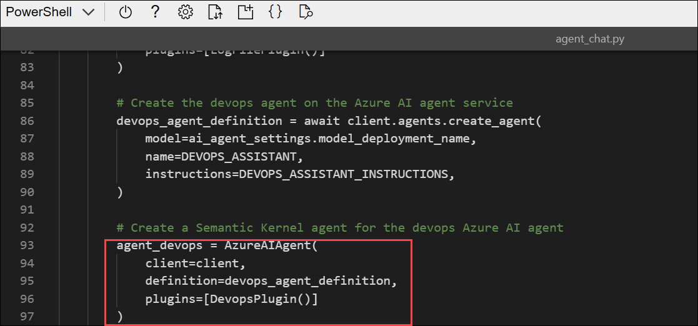

    ```python
    # Create a Semantic Kernel agent for the devops Azure AI agent
    agent_devops = AzureAIAgent(
            client=client,
            definition=devops_agent_definition,
            plugins=[DevopsPlugin()]
    )
    ```

    The **DevopsPlugin** allows the agent to simulate devops tasks, such as restarting the service or rolling back a transaction.

### Task 5: Define group chat strategies

Now you need to provide the logic used to determine which agent should be selected to take the next turn in a conversation, and when the conversation should be ended.

Let's start with the **SelectionStrategy**, which identifies which agent should take the next turn.

1. In the **SelectionStrategy** class (below the **main** function), find the comment **Select the next agent that should take the next turn in the chat**, and add the following code to define a selection function:

    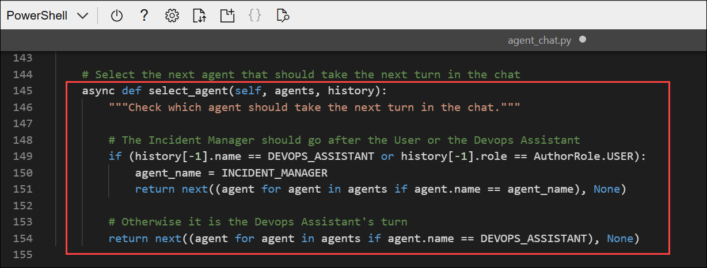

    ```python
    # Select the next agent that should take the next turn in the chat
    async def select_agent(self, agents, history):
            """"Check which agent should take the next turn in the chat."""

            # The Incident Manager should go after the User or the Devops Assistant
            if (history[-1].name == DEVOPS_ASSISTANT or history[-1].role == AuthorRole.USER):
                agent_name = INCIDENT_MANAGER
                return next((agent for agent in agents if agent.name == agent_name), None)
            
            # Otherwise it is the Devops Assistant's turn
            return next((agent for agent in agents if agent.name == DEVOPS_ASSISTANT), None)
    ```

    This code runs on every turn to determine which agent should respond, checking the chat history to see who last responded.

1. Now let's implement the **ApprovalTerminationStrategy** class to help signal when the goal is complete and the conversation can be ended.

1. In the **ApprovalTerminationStrategy** class, find the comment **End the chat if the agent has indicated there is no action needed**, and add the following code to define the termination function:

    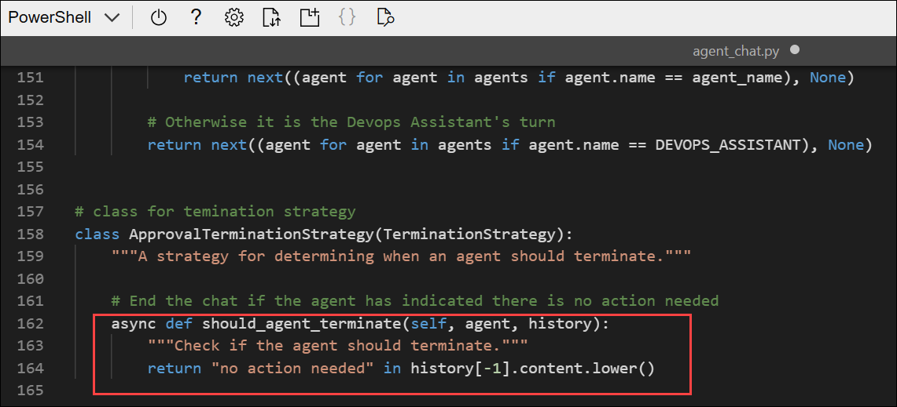

    ```python
    # End the chat if the agent has indicated there is no action needed
    async def should_agent_terminate(self, agent, history):
            """Check if the agent should terminate."""
            return "no action needed" in history[-1].content.lower()
    ```

    The kernel invokes this function after the agent's response to determine if the completion criteria are met. In this case, the goal is met when the incident manager responds with "No action needed." This phrase is defined in the incident manager agent instructions.

### Task 6: Implement the group chat

Now that you have two agents, and strategies to help them take turns and end a chat, you can implement the group chat.

1. Back up in the main function, find the comment **Add the agents to a group chat with a custom termination and selection strategy**, and add the following code to create the group chat:

    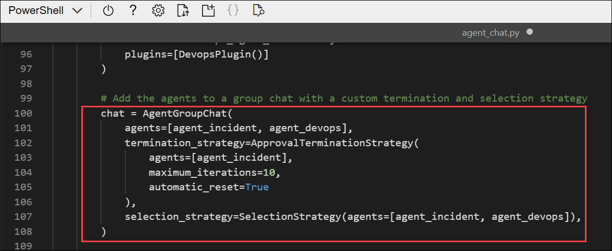

    ```python
    # Add the agents to a group chat with a custom termination and selection strategy
    chat = AgentGroupChat(
            agents=[agent_incident, agent_devops],
            termination_strategy=ApprovalTerminationStrategy(
                agents=[agent_incident], 
                maximum_iterations=10, 
                automatic_reset=True
            ),
            selection_strategy=SelectionStrategy(agents=[agent_incident,agent_devops]),      
    )
    ```

    In this code, you create an agent group chat object with the incident manager and devops agents. You also define the termination and selection strategies for the chat. Notice that the **ApprovalTerminationStrategy** is tied to the incident manager agent only, and not the devops agent. This makes the incident manager agent is responsible for signaling the end of the chat. The **SelectionStrategy** includes all agents that should take a turn in the chat.

    Note that the automatic reset flag will automatically clear the chat when it ends. This way, the agent can continue analyzing the files without the chat history object using too many unnecessary tokens. 

1. Find the comment **Append the current log file to the chat**, and add the following code to add the most recently read log file text to the chat:

    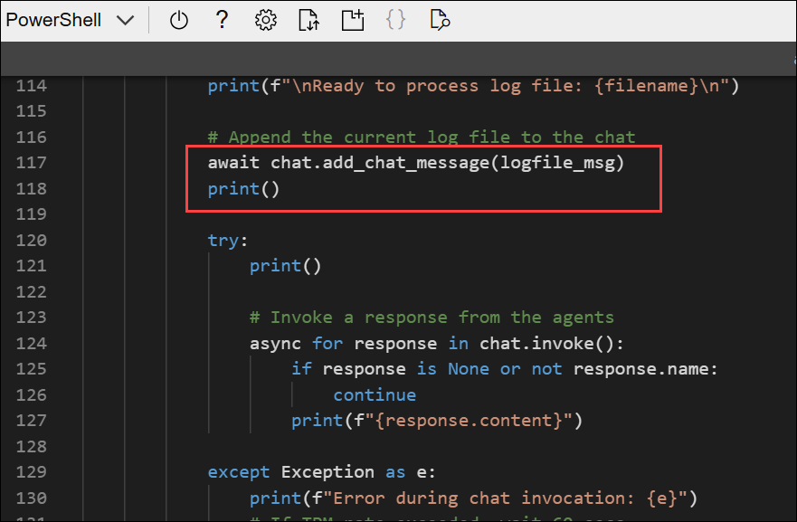

    ```python
    # Append the current log file to the chat
    await chat.add_chat_message(logfile_msg)
    print()
    ```

1. Find the comment **Invoke a response from the agents**, and add the following code to invoke the group chat:

    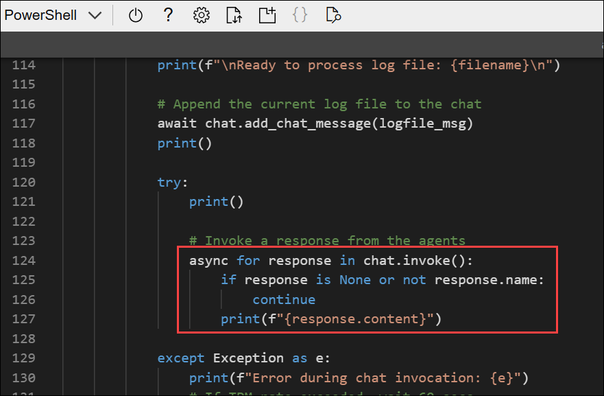

    ```python
    # Invoke a response from the agents
    async for response in chat.invoke():
            if response is None or not response.name:
                continue
            print(f"{response.content}")
    ```

    This is the code that triggers the chat. Since the log file text has been added as a message, the selection strategy will determine which agent should read and respond to it and then the conversation will continue between the agents until the conditions of the termination strategy are met or the maximum number of iterations is reached.

1. Use the **CTRL+S** command to save your changes to the code file. You can keep it open (in case you need to edit the code to fix any errors) or use the **CTRL+Q** command to close the code editor while keeping the cloud shell command line open.

### Task 7: Sign into Azure and run the app

Now you're ready to run your code and watch your AI agents collaborate.

1. In the cloud shell command-line pane, enter the following command to sign into Azure. Click on the **Link (1)** and copy the **code (2)** provided.

    

    ```
    az login
    ```
    
1. In the new browser tab, when the **Enter code to allow access** window appears, paste the copied code and select **Next**.

    

1. In the **Pick an account** dialog box, choose **ODL_User<inject key="DeploymentID"></inject>**. 

    

1. In the **Are you trying to sign in to Microsoft Azure CLI?** dialog box, click **Continue**.

    

1. When the **Microsoft Azure Cross-platform Command Line Interface** window pops up, return to the browser tab with Cloud Shell open. 

    

1. In the Cloud Shell console, press **Enter** to select the only available subscription.

    

1. After you have signed in, enter the following command to run the application:

    ```
    python agent_chat.py
    ```

    You should see some output similar to the following:

    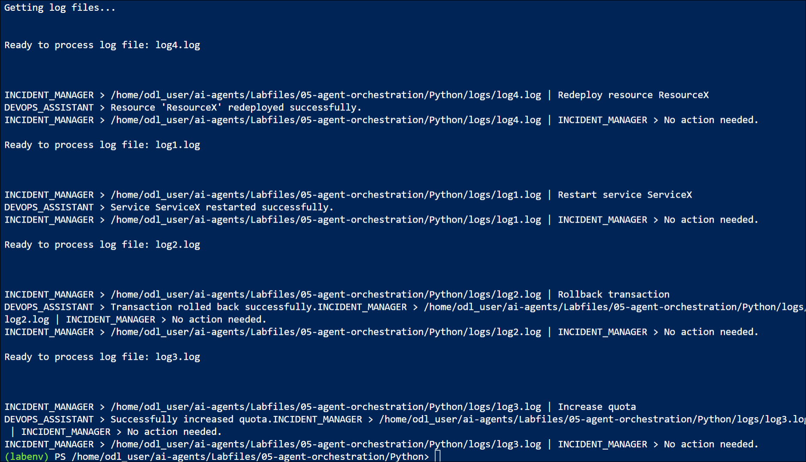

    > **Note**: The app includes some code to wait between processing each log file to try to reduce the risk of a TPM rate limit being exceeded, and exception handling in case it happens anyway. If there is insufficient quota available in your subscription, the model may not be able to respond.

1. Verify that the log files in the **logs** folder are updated with resolution operation messages from the DevopsAssistant.

    For example, log1.log should have the following log messages appended:

    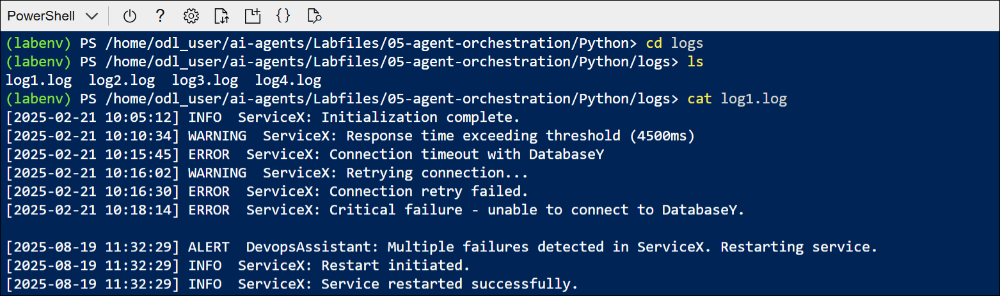

    ```log
    [2025-02-27 12:43:38] ALERT  DevopsAssistant: MulNotele failures detected in ServiceX. Restarting service.
    [2025-02-27 12:43:38] INFO  ServiceX: Restart initiated.
    [2025-02-27 12:43:38] INFO  ServiceX: Service restarted successfully.
    ```

## Summary

In this exercise, you used the Azure AI Agent Service and Semantic Kernel SDK to create AI incident and devops agents that can automatically detect issues and apply resolutions. Great work!
