# Lab 13: Connect to remote agents with A2A protocol

In this lab, you'll use Azure AI Agent Service with the A2A protocol to create simple remote agents that interact with one another. These agents will assist technical writers with preparing their developer blog posts. A title agent will generate a headline, and an outline agent will use the title to develop a concise outline for the article.

### Task 1: Create an Azure AI Foundry project

1. Open a new tab in the browser, right-click on the following link [Azure AI Foundry portal](https://ai.azure.com), then **Copy link** and paste it in a browser tab to log in to **Azure AI Foundry portal**.

1. Click on **Sign in**.

   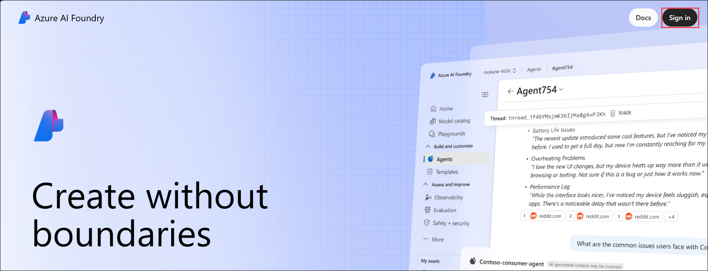 

1. If prompted, provide the credentials below:

   - **Email/Username:** <inject key="AzureAdUserEmail"></inject>

   - **Password:** <inject key="AzureAdUserPassword"></inject>

1. In the home page, select **Create an agent**.   

   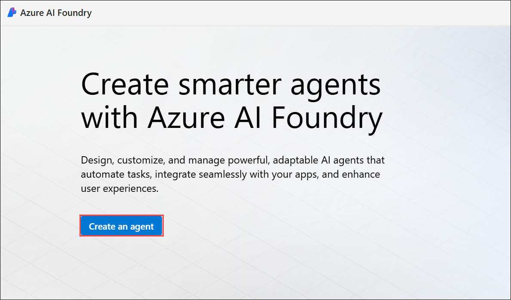 

1. When prompted to create a project, enter the project name as **Myproject<inject key="DeploymentID" enableCopy="false"/> (1)** and expand **Advanced options (2)**.

   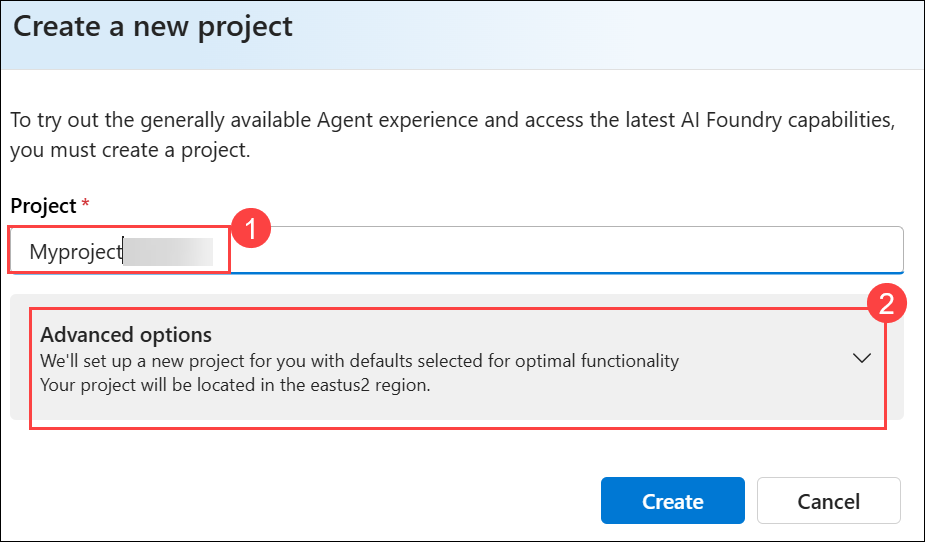 

1. Under **Advanced options**, provide the below details and leave the rest to deafult:

    - Resource group: Select **AI-102-RG13 (1)**
    - Region: Select **Region**: Select **<inject key="Region" enableCopy="false" /> (2)**
    - Select **Create (3)**

      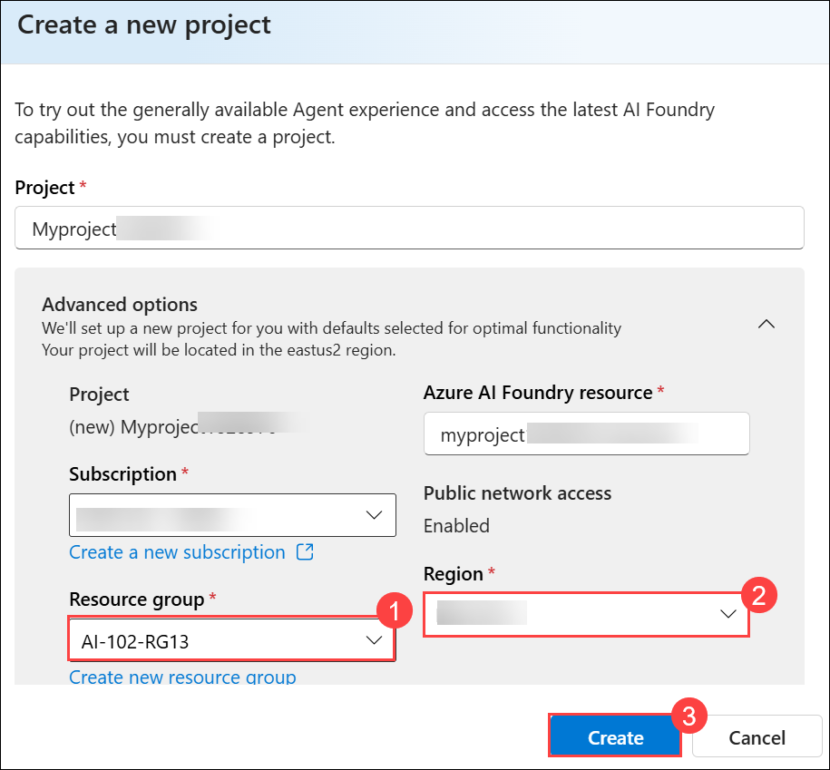    

1. Wait for your project to be created.      

1. When prompted, search for `gpt-4.1` **(1)**, then select **gpt-4.1 (2)** model and then **Confirm (3)**.

   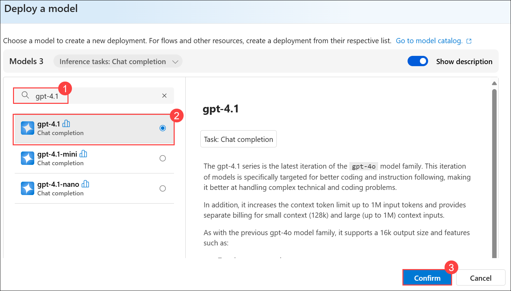 

1. On the **Deploy gpt-4.1** page, select **Global Standard (1)** as the Deployment type and then click on **Customize (2)**.

   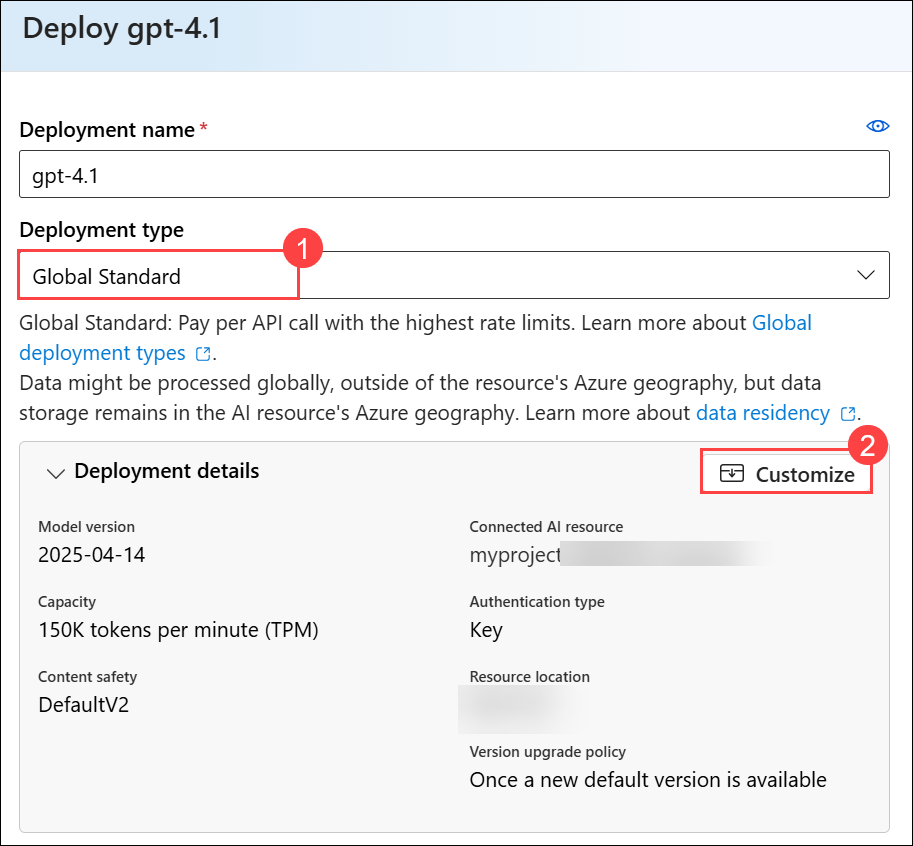 

1. On the **Deploy gpt-4.1** page,

    - Tokens per Minute Rate Limit (thousands): `60K` **(1)** (or the maximum available in your subscription if less than 50K)
    - Then select **Deploy (2)**

      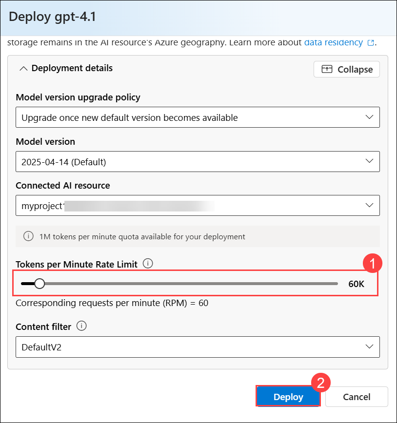 

1. When your project is created, the Agents **playground** will be opened.

   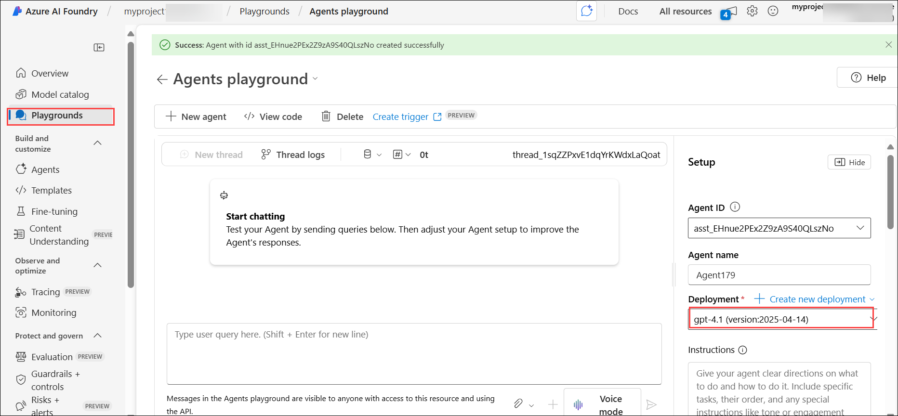 

1. In the navigation pane on the left, select **Overview (1)** to see the main page for your project. Copy the **Azure AI Foundry project endpoint (2)** values to a notepad, as you'll use them to connect to your project in a client application.

   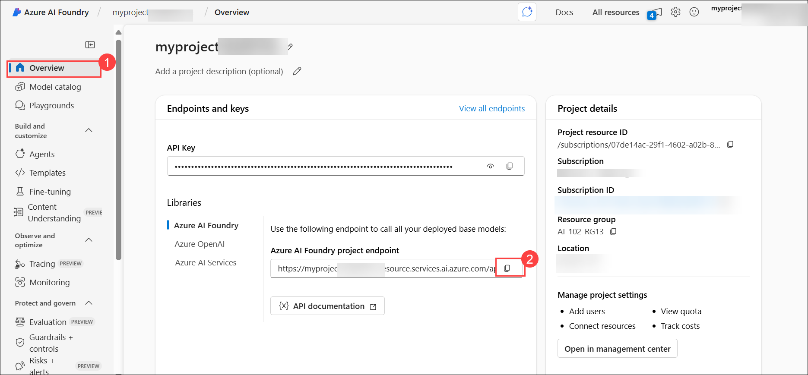 


### Task 2: Create an A2A application

Now you're ready to create a client app that uses an agent. Some code has been provided for you in a GitHub repository.

### Task 2.1: Clone the repo containing the application code

1. Navigate to [Azure portal](https://portal.azure.com/).

1. If prompted, provide the credentials below:

    - **Email/Username:** <inject key="AzureAdUserEmail"></inject>

    - **Password:** <inject key="AzureAdUserPassword"></inject>

1. Use the **[>_]** button to the right of the search bar at the top of the page to create a new **Cloud Shell** in the Azure portal.

     

1. Selecting a **PowerShell** environment.

     

1. On the **Getting started** page,

    - Select **No storage account required (1)** 
    - Select your subscription **(2)**
    - Click on **Apply (3)**

       

1. In the cloud shell toolbar, in the **Settings (1)** menu, select **Go to Classic version (2)** (this is required to use the code editor).

    

     >**Note**: The cloud shell provides a command-line interface in a pane at the bottom of the Azure portal. You can resize or maximize this pane to make it easier to work in.

     >**Note**: Ensure you've switched to the classic version of the cloud shell before continuing.

1. In the cloud shell pane, copy and paste the following commands to clone the GitHub repo containing the code files for this exercise.

    ```
   rm -r ai-agents -f
   git clone https://github.com/MicrosoftLearning/mslearn-ai-agents ai-agents
    ```

     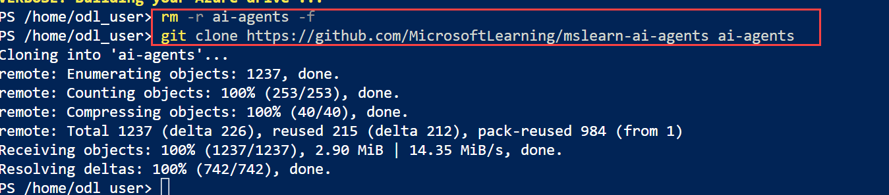  

1. Enter the following command to change the working directory to the folder containing the code files and list them all.

    ```
   cd ai-agents/Labfiles/06-build-remote-agents-with-a2a/python
   ls -a -l
    ```

     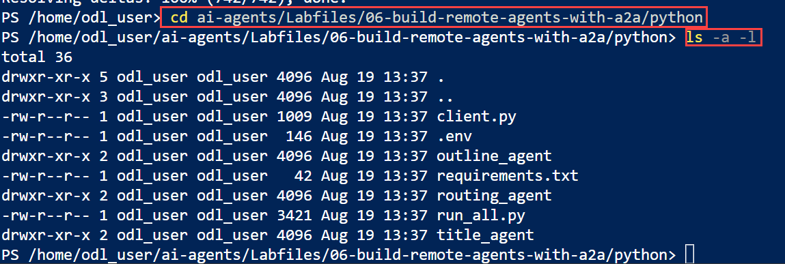      

    The provided files include:

    ```output
    python
    ├── outline_agent/
    │   ├── agent.py
    │   ├── agent_executor.py
    │   └── server.py
    ├── routing_agent/
    │   ├── agent.py
    │   └── server.py
    ├── title_agent/
    │   ├── agent.py
    |   ├── agent_executor.py
    │   └── server.py
    ├── client.py
    └── run_all.py
    ```

    Each agent folder contains the Azure AI agent code and a server to host the agent. The **routing agen**t is responsible for discovering and communicating with the **title** and **outline** agents. The **client** allows users to submit prompts to the routing agent. `run_all.py` launches all the servers and runs the client.


### Task 2.2: Configure the application settings

1. In the cloud shell command-line pane, enter the following command to install the libraries you'll use:

    ```
   python -m venv labenv
   ./labenv/bin/Activate.ps1
   pip install -r requirements.txt azure-ai-projects a2a-sdk
    ```

1. Enter the following command to edit the configuration file that has been provided:

    ```
   code .env
    ```

     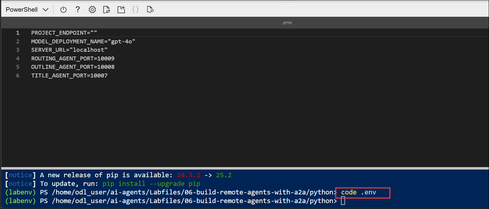  

     The file is opened in a code editor.
   
1. In the code file, replace the **your_project_endpoint (1)** placeholder with the endpoint for your project (copied from the project **Overview** page in the Azure AI Foundry portal in **Task 1**) and change the **MODEL_DEPLOYMENT_NAME** variable to your model deployment name `gpt-4.1` **(2)**.

    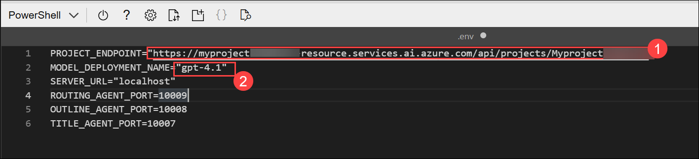 

1. After you've replaced the placeholder, use the **CTRL+S** command to save your changes and then use the **CTRL+Q** command to close the code editor while keeping the cloud shell command line open.

### Task 2.3: Create a discoverable agent

In this task, you create the title agent that helps writers create trendy headlines for their articles. You also define the agent's skills and card required by the A2A protocol to make the agent discoverable.

1. Navigate to the `title_agent` directory:

    ```
   cd title_agent
    ```

     >**Tip**: As you add code, be sure to maintain the correct indentation. Use the comment indentation levels as a guide.

1. Enter the following command to edit the code file that has been provided:

    ```
   code agent.py
    ```

     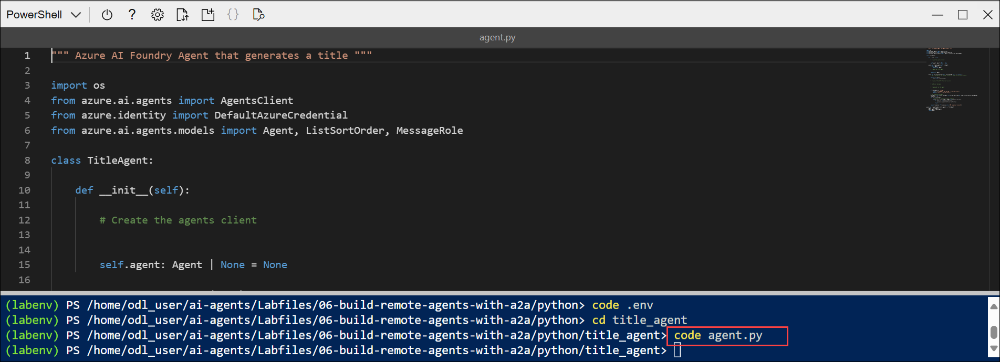 

1. Find the comment **Create the agents client** and add the following code to connect to the Azure AI project:

    ```python
   # Create the agents client
   self.client = AgentsClient(
       endpoint=os.environ['PROJECT_ENDPOINT'],
       credential=DefaultAzureCredential(
           exclude_environment_credential=True,
           exclude_managed_identity_credential=True
       )
   )
    ```

     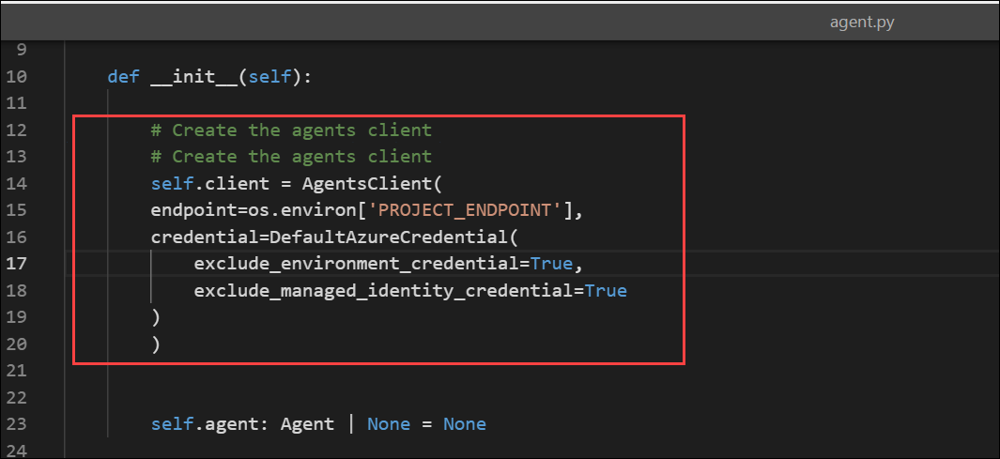     

      >**Note**: Be careful to maintain the correct indentation level.  

1. Find the comment **Create the title agent** and add the following code to create the agent:

    ```python
   # Create the title agent
   self.agent = self.client.create_agent(
       model=os.environ['MODEL_DEPLOYMENT_NAME'],
       name='title-agent',
       instructions="""
       You are a helpful writing assistant.
       Given a topic the user wants to write about, suggest a single clear and catchy blog post title.
       """,
   )
    ```

     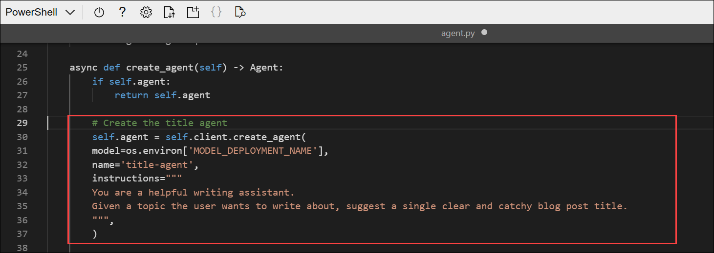     

      >**Note**: Be careful to maintain the correct indentation level.    

1. Find the comment **Create a thread for the chat session** and add the following code to create the chat thread:

    ```python
   # Create a thread for the chat session
   thread = self.client.threads.create()
    ```

     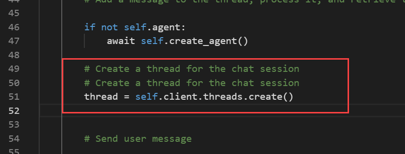   

1. Locate the comment **Send user message** and add this code to submit the user's prompt:

    ```python
   # Send user message
   self.client.messages.create(thread_id=thread.id, role=MessageRole.USER, content=user_message)
    ```

     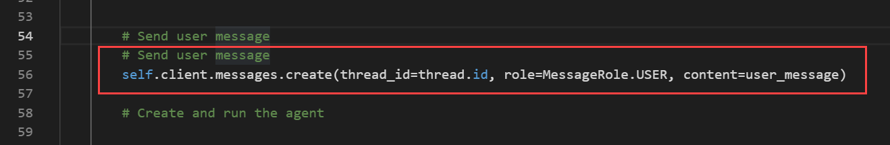  

1. Under the comment **Create and run the agent**, add the following code to initiate the agent's response generation:

    ```python
   # Create and run the agent
   run = self.client.runs.create_and_process(thread_id=thread.id, agent_id=self.agent.id)
    ```

     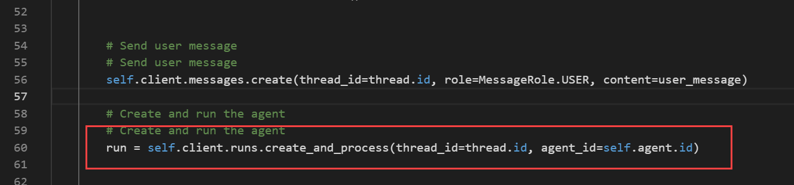  

     The code provided in the rest of the file will process and return the agent's response. 

1. Save the code file (**CTRL+S**). Now you're ready to share the agent's skills and card with the A2A protocol. 

1. Enter the following command to edit the title agent's `server.py` file  

    ```
   code server.py
    ```

     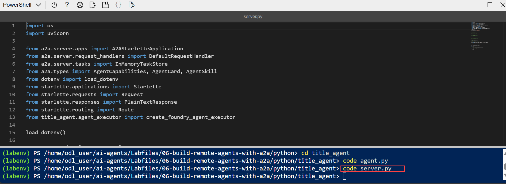  

1. Find the comment **Define agent skills** and add the following code to specify the agent’s functionality:

    ```python
   # Define agent skills
   skills = [
       AgentSkill(
           id='generate_blog_title',
           name='Generate Blog Title',
           description='Generates a blog title based on a topic',
           tags=['title'],
           examples=[
               'Can you give me a title for this article?',
           ],
       ),
   ]
    ```

     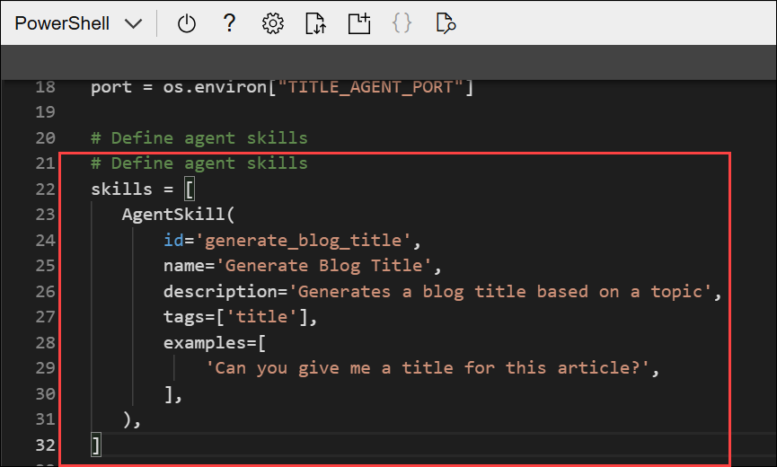     

1. Find the comment **Create agent card** and add this code to define the metadata that makes the agent discoverable:

    ```python
   # Create agent card
   agent_card = AgentCard(
       name='AI Foundry Title Agent',
       description='An intelligent title generator agent powered by Azure AI Foundry. '
       'I can help you generate catchy titles for your articles.',
       url=f'http://{host}:{port}/',
       version='1.0.0',
       default_input_modes=['text'],
       default_output_modes=['text'],
       capabilities=AgentCapabilities(),
       skills=skills,
   )
    ```

1. Locate the comment **Create agent executor** and add the following code to initialize the agent executor using the agent card:

    ```python
   # Create agent executor
   agent_executor = create_foundry_agent_executor(agent_card)
    ```

    The agent executor will act as a wrapper for the title agent you created.

1. Find the comment **Create request handler** and add the following to handle incoming requests using the executor:

    ```python
   # Create request handler
   request_handler = DefaultRequestHandler(
       agent_executor=agent_executor, task_store=InMemoryTaskStore()
   )
    ```

1. Under the comment **Create A2A application**, add this code to create the A2A-compatible application instance:

    ```python
   # Create A2A application
   a2a_app = A2AStarletteApplication(
       agent_card=agent_card, http_handler=request_handler
   )
    ```
    
    This code creates an A2A server that will share the title agent's information and handle incoming requests for this agent using the title agent executor.

1. Save the code file (**CTRL+S**) when you have finished.


### Task 2.4: Task Enable messages between the agents

In this task, you use the A2A protocol to enable the routing agent to send messages to the other agents. You also allow the title agent to receive messages by implementing the agent executor class.

1. Navigate to the `routing_agent` directory:

    ```
   cd ../routing_agent
    ```

1. Enter the following command to edit the code file that has been provided:

    ```
   code agent.py
    ```

     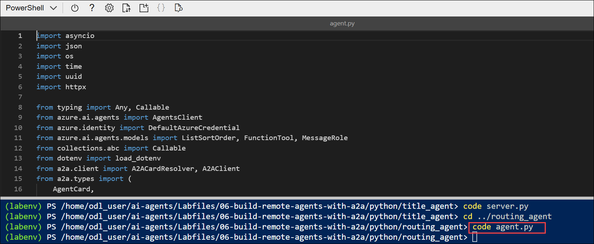 

    The routing agent acts as an orchestrator that handles user messages and determines which remote agent should process the request.

    When a user message is received, the routing agent:
    - Starts a conversation thread.
    - Uses the `create_and_process` method to evaluate the best-matching agent for the user's message.
    - The message is routed to the appropriate agent over HTTP using the `send_message` function.
    - The remote agent processes the message and returns a response.

    The routing agent finally captures the response and returns it to the user through the thread.

    Notice that the `send_message` method is async and must be awaited for the agent run to complete successfully.

1. Add the following code under the comment **Retrieve the remote agent's A2A client using the agent name**:

    ```python
   # Retrieve the remote agent's A2A client using the agent name 
   client = self.remote_agent_connections[agent_name]
    ```

     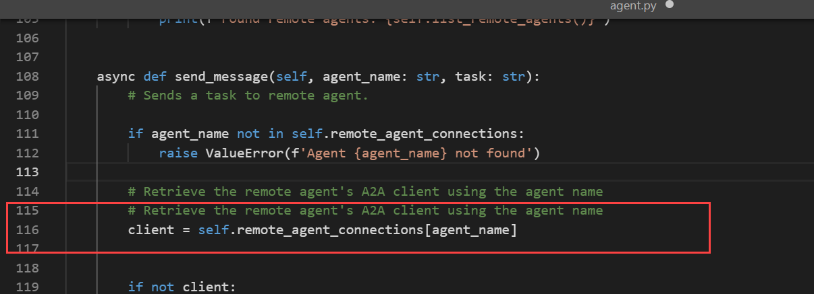     

1. Locate the comment **Construct the payload to send to the remote agent** and add the following code:

    ```python
   # Construct the payload to send to the remote agent
   payload: dict[str, Any] = {
       'message': {
           'role': 'user',
           'parts': [{'kind': 'text', 'text': task}],
           'messageId': message_id,
       },
   }
    ```

     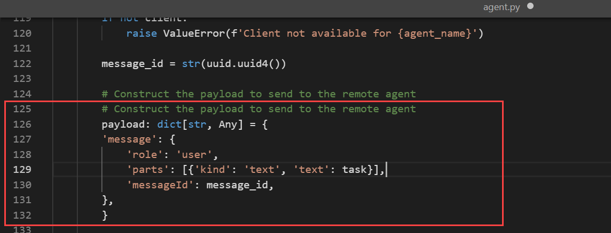  

1. Find the comment **Wrap the payload in a SendMessageRequest object** and add the following code:

    ```python
   # Wrap the payload in a SendMessageRequest object
   message_request = SendMessageRequest(id=message_id, params=MessageSendParams.model_validate(payload))
    ```

     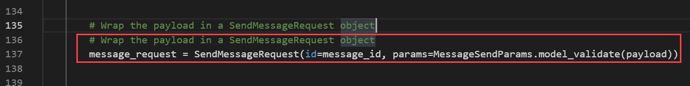  

1. Add the following code under the comment **Send the message to the remote agent client and await the response**:

    ```python
   # Send the message to the remote agent client and await the response
   send_response: SendMessageResponse = await client.send_message(message_request=message_request)
    ```

     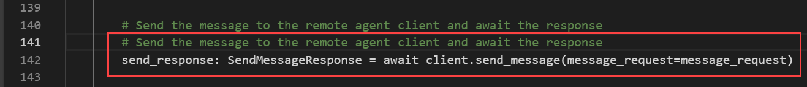 

1. Save the code file (**CTRL+S**) when you have finished. Now the routing agent is able to discover and send messages to the title agent. Let's create the agent executor code to handle those incoming messages from the routing agent.

1. Navigate to the `title_agent` directory:

    ```
   cd ../title_agent
    ```

1. Enter the following command to edit the code file that has been provided:

    ```
   code agent_executor.py
    ```

     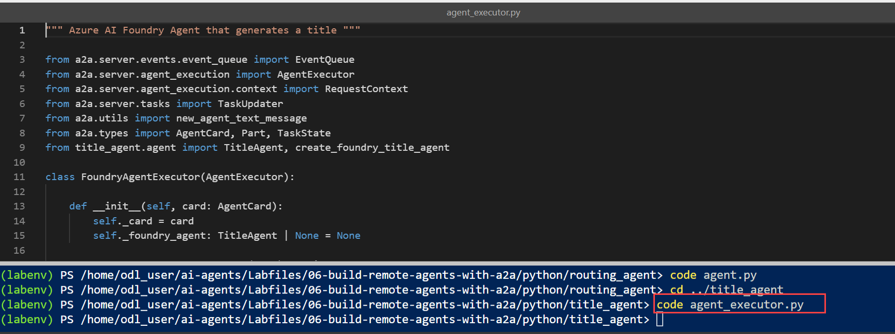     

     The `AgentExecutor` class implemenation must contain the methods `execute` and `cancel`. The cancel method has been provided for you. The `execute` method includes a `TaskUpdater` object that manages events and signals to the caller when the task is complete. Let's add the logic for task execution.

1. In the `execute` method, add the following code under the comment **Process the request**:

    ```python
   # Process the request
   await self._process_request(context.message.parts, context.context_id, updater)
    ```

     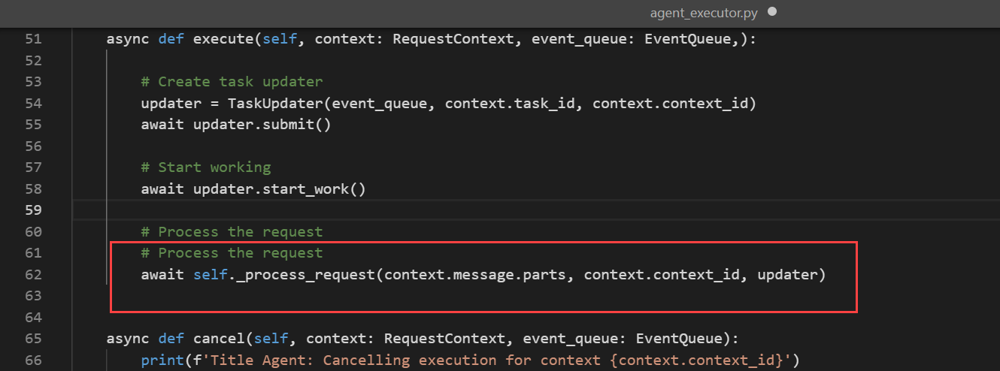  

1. In the `_process_request` method, add the following code under the comment **Get the title agent**:

    ```python
   # Get the title agent
   agent = await self._get_or_create_agent()
    ```

     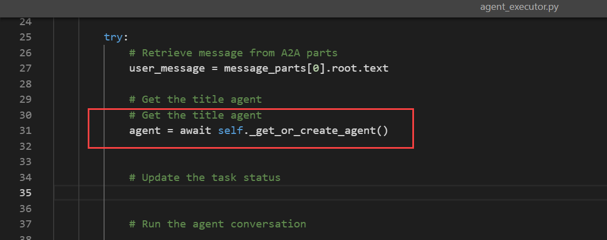 

1. Add the following code under the comment **Update the task status**:

    ```python
   # Update the task status
   await task_updater.update_status(
       TaskState.working,
       message=new_agent_text_message('Title Agent is processing your request...', context_id=context_id),
   )
    ```

     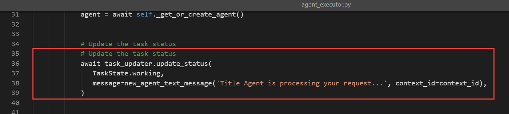 

      >**Note**: As you add code, be sure to maintain the correct indentation. Use the comment indentation levels as a guide.

1. Find the comment **Run the agent conversation** and add the following code:

    ```python
   # Run the agent conversation
   responses = await agent.run_conversation(user_message)
    ```

1. Find the comment **Update the task with the responses** and add the following code:

    ```python
   # Update the task with the responses
   for response in responses:
       await task_updater.update_status(
           TaskState.working,
           message=new_agent_text_message(response, context_id=context_id),
       )
    ```

     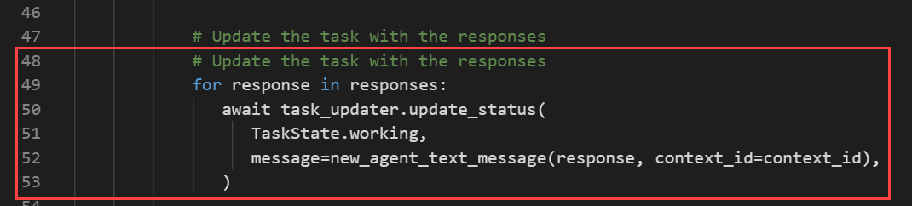 

      >**Note**: As you add code, be sure to maintain the correct indentation. Use the comment indentation levels as a guide.
   
1. Find the comment **Mark the task as complete** and add the following code:

    ```python
   # Mark the task as complete
   final_message = responses[-1] if responses else 'Task completed.'
   await task_updater.complete(
       message=new_agent_text_message(final_message, context_id=context_id)
   )
    ```

     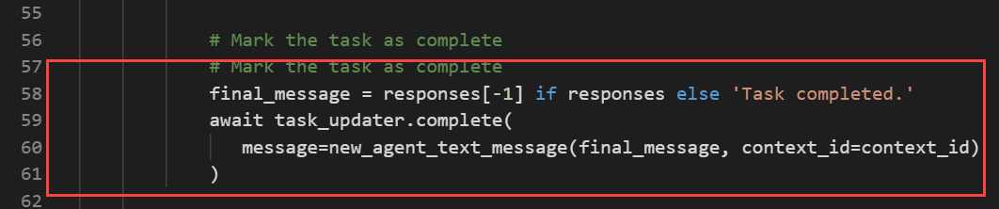 

      >**Note**: As you add code, be sure to maintain the correct indentation. Use the comment indentation levels as a guide.    

    Now your title agent has been wrapped with an agent executor that the A2A protocol will use to handle messages. Great work!

### Task 2.5: Sign into Azure and run the app

1. In the cloud shell command-line pane beneath the code editor, enter the following command to sign into Azure **(1)**. Copy and paste the Sign in URL in the web browser **(2)**. Copy the device code as well to authenticate **(3)**.

    ```
    az login
    ```

     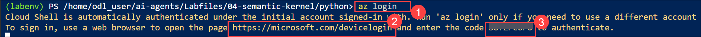     

    >**Note**: You must sign into Azure - even though the cloud shell session is already authenticated

    > **Note**: In most scenarios, just using *az login* will be sufficient. However, if you have subscriptions in multiple tenants, you may need to specify the tenant by using the *--tenant* parameter. See [Sign into Azure interactively using the Azure CLI](https://learn.microsoft.com/cli/azure/authenticate-azure-cli-interactively) for details.
    
1. Paste the copied device code **(1)** and then select **Next (2)**.

    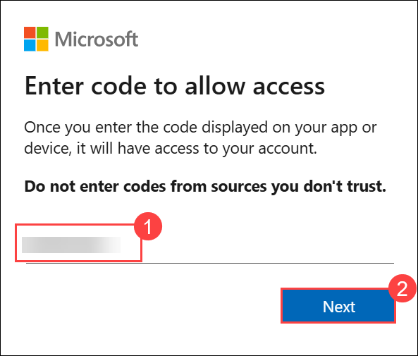 

1. Select your account **<inject key="AzureAdUserEmail"></inject>** to sign in.

     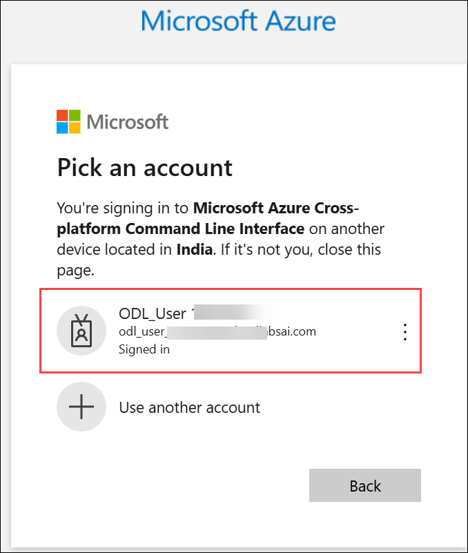 

1. Click on **Continue** to sign in to Azure CLI.

     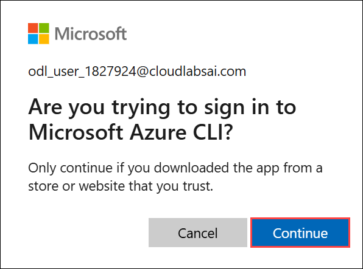 

1. Press **Enter** to accept the default the subscription.

     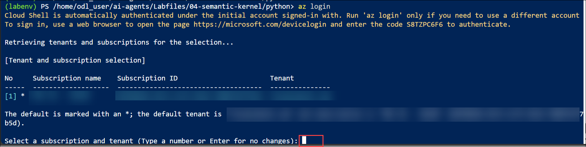


