# Analyze Text

**Azure AI Language** supports analysis of text, including language detection, sentiment analysis, key phrase extraction, and entity recognition.

For example, suppose a travel agency wants to process hotel reviews that have been submitted to the company's web site. By using the Azure AI Language, they can determine the language each review is written in, the sentiment (positive, neutral, or negative) of the reviews, key phrases that might indicate the main topics discussed in the review, and named entities, such as places, landmarks, or people mentioned in the reviews. In this exercise, you'll use the Azure AI Language Python SDK for text analytics to implement a simple hotel review application based on this example.

While this exercise is based on Python, you can develop text analytics applications using mulNote:le language-specific SDKs; including:

- [Azure AI Text Analytics client library for Python](https://pypi.org/project/azure-ai-textanalytics/)
- [Azure AI Text Analytics client library for .NET](https://www.nuget.org/packages/Azure.AI.TextAnalytics)
- [Azure AI Text Analytics client library for JavaScript](https://www.npmjs.com/package/@azure/ai-text-analytics)

This exercise takes approximately **30** minutes.

## Task 1: Provision an Azure AI Language resource

If you don't already have one in your subscription, you'll need to provision an **Azure AI Language service** resource in your Azure subscription.

1. Open the Azure portal at `https://portal.azure.com`, and sign in using the Microsoft account.

1. If prompted, provide the credentials below:

    - **Email/Username:** <inject key="AzureAdUserEmail"></inject>

        

    - **Password:** <inject key="AzureAdUserPassword"></inject>

        

1. When the **Stay signed in?** window appears, select **No**.

    

    >**Note:** If the **Welcome to Microsoft Azure** window appears, select **Cancel**.

    

1. On the Azure Portal home page, select **Create a resource**.

    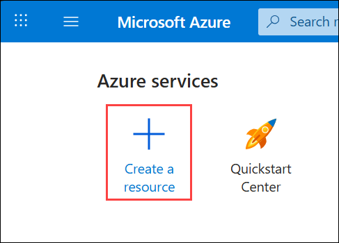

1. On the **Create a resource** page, type **Language service** in the search box and press **Enter**. 

    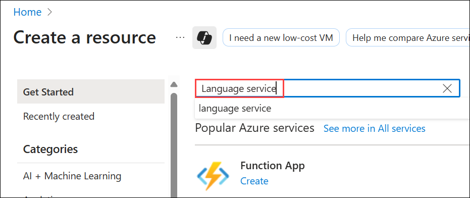

1. On the **Marketplace** page, under **Language service**, select the **Create (1)** drop-down and then choose **Language service (2)**.

    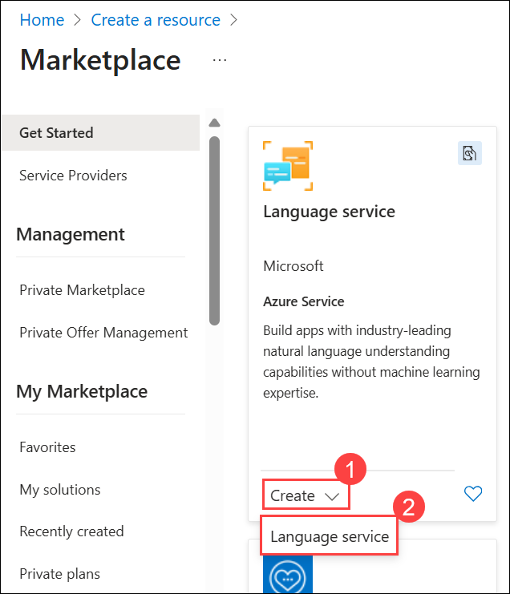

1. On the **Select additional features** page, click **Continue to create your resource**.

    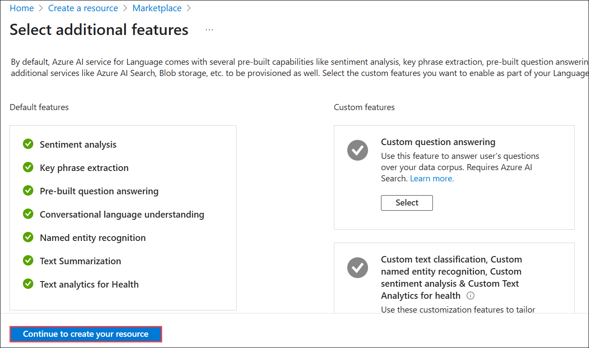

1. Provision the resource with the following settings, then select **Review + create**:

    * Subscription: **Default Subscription (1)**
    * Resource group: **AI-102-RG14 (2)**
    * Region: **<inject key="Region"></inject> (3)**
    * Name: **languageservice<inject key="DeploymentID"></inject> (4)**
    * Pricing tier: **F0 (5)** (*free*) (**S** (*standard*) if F0 isn’t available)
    * Responsible AI Notice: **Agree (6)**

        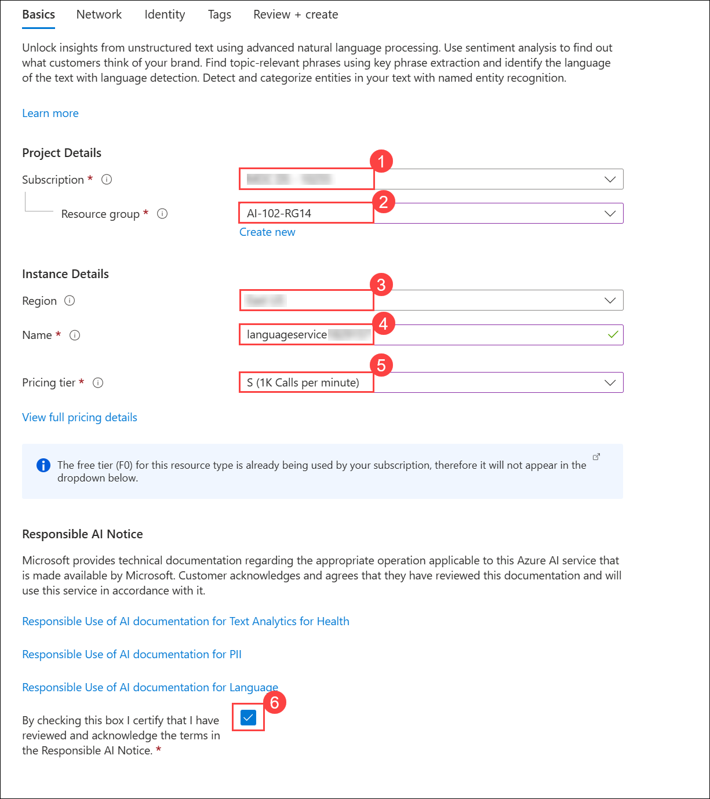

1. On the **Review + create** tab, click **Create** to provision the resource.

    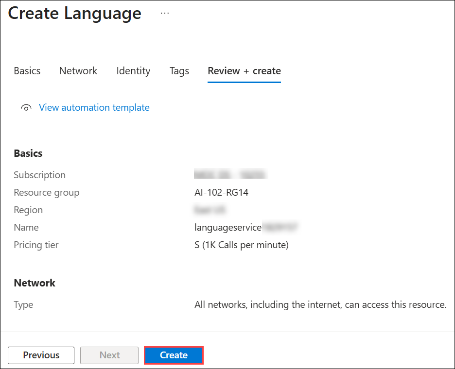

1. Wait for deployment to complete, and then click on **Go to resource**.

    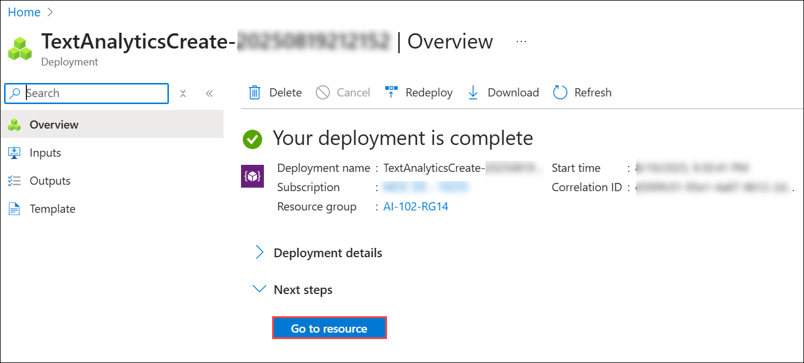

1. From the left navigation pane, go to **Resource Management (1)** and select **Keys and Endpoint (2)**. Copy the **Endpoint (3)** and **Key (4)**, then save them in a notepad file, you’ll need these details later in the exercise.

    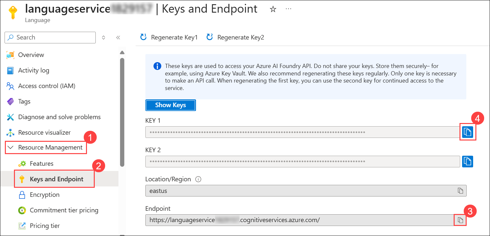

> **Congratulations** on completing the task! Now, it's time to validate it. Here are the steps:
>
> - Hit the Validate button for the corresponding task. If you receive a success message, you can proceed to the next task.
> - If not, carefully read the error message and retry the step, following the instructions in the lab guide.
> - If you need any assistance, please contact us at cloudlabs-support@spektrasystems.com. We are available 24/7 to help.
 
<validation step="90093be2-2083-4839-b324-37164c3651c9" />


## Task 2: Clone the repository for this course

You'll develop your code using Cloud Shell from the Azure Portal. The code files for your app have been provided in a GitHub repo.

1. On the **Azure portal** homepage, click the **\[>\_] Cloud Shell (1)** button located to the right of the **Copilot** tab at the top. This opens a new Cloud Shell session. In the **Welcome to Azure Cloud Shell** window, choose **PowerShell (2)**.

    

    >**Note:** The cloud shell provides a command-line interface in a pane at the bottom of the Azure portal. You can resize or maximize this pane to make it easier to work in.

    > **Note:** If you have previously created a cloud shell that uses a **Bash** environment, switch it to **PowerShell**.

1. In the **Getting started** window, ensure **No storage account required (1)** is selected. From the **Subscription** drop-down, choose **Default subscription (2)**, then click **Apply (3)**.

    

1. In the Cloud Shell toolbar, open the **Settings (1)** menu and choose **Go to Classic version (2)** from the drop-down.

    

    >**Note:** Ensure you've switched to the classic version of the cloud shell before continuing.

1. In the PowerShell pane, enter the following commands to clone the GitHub repo for this exercise:

    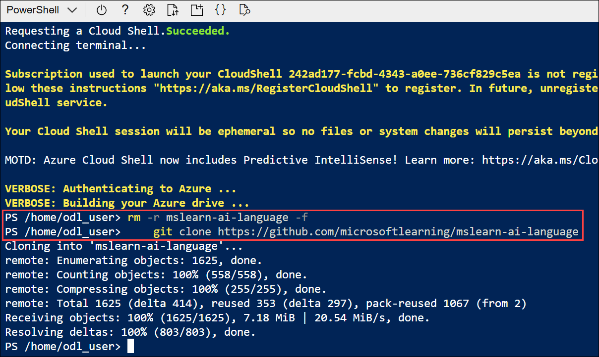

    ```
    rm -r mslearn-ai-language -f
    git clone https://github.com/microsoftlearning/mslearn-ai-language
    ```

    > **Note:** As you enter commands into the cloudshell, the ouput may take up a large amount of the screen buffer. You can clear the screen by entering the `cls` command to make it easier to focus on each task.

1. After the repo has been cloned, navigate to the folder containing the application code files:  

    ```
    cd mslearn-ai-language/Labfiles/01-analyze-text/Python/text-analysis
    ```

## Task 3: Configure your application

1. In the command line pane, run the following command to view the code files in the **text-analysis** folder:

    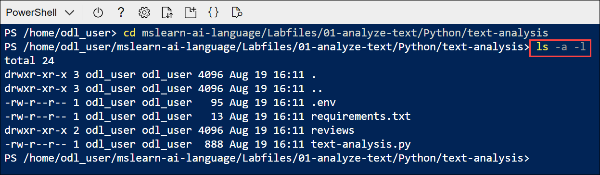

    ```
    ls -a -l
    ```

    The files include a configuration file (**.env**) and a code file (**text-analysis.py**). The text your application will analyze is in the **reviews** subfolder.

1. Create a Python virtual environment and install the Azure AI Language Text Analytics SDK package and other required packages by running the following command:

    ```
    python -m venv labenv
    ./labenv/bin/Activate.ps1
    pip install -r requirements.txt azure-ai-textanalytics==5.3.0
    ```

1. Enter the following command to edit the application configuration file:

    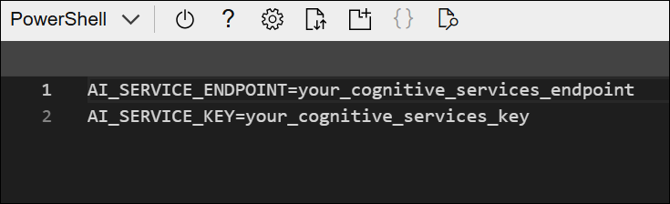

    ```
    code .env
    ```

    The file is opened in a code editor.

1. Update the configuration values to include the  **endpoint** and a **key** from the Azure Language resource you created (available on the **Keys and Endpoint** page for your Azure AI Language resource in the Azure portal).

    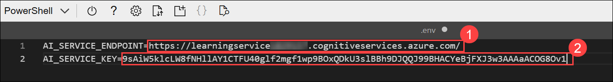

1. After you've replaced the placeholders, within the code editor, use the **CTRL+S** command or **Right-click > Save** to save your changes and then use the **CTRL+Q** command or **Right-click > Quit** to close the code editor while keeping the cloud shell command line open.

## Task 4: Add code to connect to your Azure AI Language resource

1. Enter the following command to edit the application code file:

    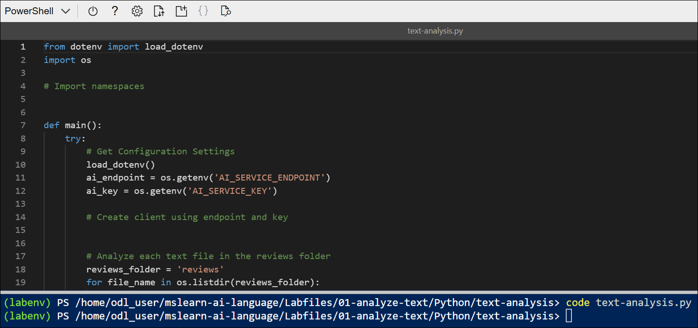

    ```
    code text-analysis.py
    ```

1. Review the existing code. You will add code to work with the AI Language Text Analytics SDK.

    > **Note:** As you add code to the code file, be sure to maintain the correct indentation.

1. At the top of the code file, under the existing namespace references, find the comment **Import namespaces** and add the following code to import the namespaces you will need to use the Text Analytics SDK:

    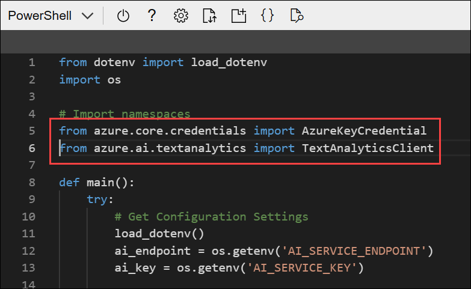

    ```python
    # import namespaces
    from azure.core.credentials import AzureKeyCredential
    from azure.ai.textanalytics import TextAnalyticsClient
    ```

1. In the **main** function, note that code to load the Azure AI Language service endpoint and key from the configuration file has already been provided. Then find the comment **Create client using endpoint and key**, and add the following code to create a client for the Text Analysis API:

    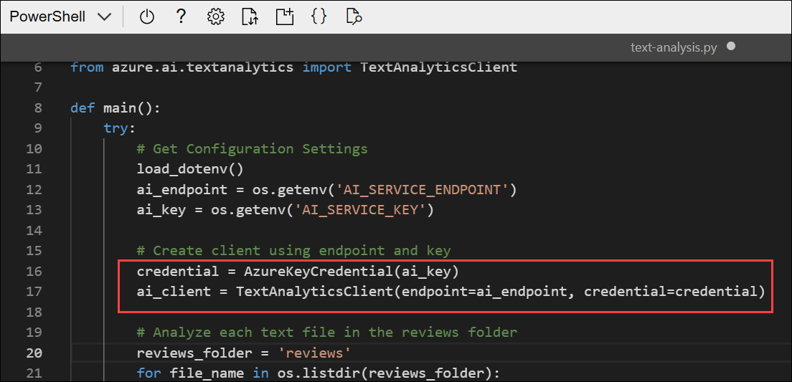

    ```Python
    # Create client using endpoint and key
    credential = AzureKeyCredential(ai_key)
    ai_client = TextAnalyticsClient(endpoint=ai_endpoint, credential=credential)
    ```

1. Save your changes (CTRL+S), then enter the following command to run the program (you maximize the cloud shell pane and resize the panels to see more text in the command line pane):

    ```
    python text-analysis.py
    ```

1. Observe the output as the code should run without error, displaying the contents of each review text file in the **reviews** folder. The application successfully creates a client for the Text Analytics API but doesn't make use of it. We'll fix that in the next section.

    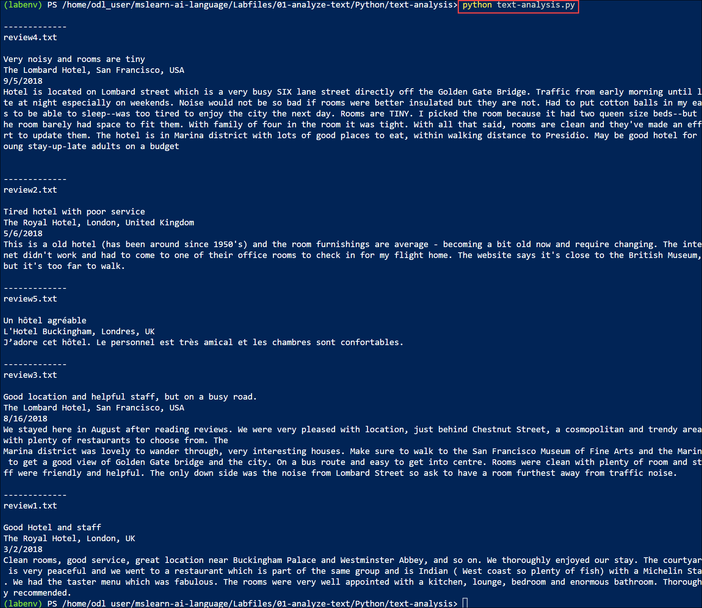

## Task 5: Add code to detect language

Now that you have created a client for the API, let's use it to detect the language in which each review is written.

1. In the code editor, find the comment **Get language**. Then add the code necessary to detect the language in each review document:

    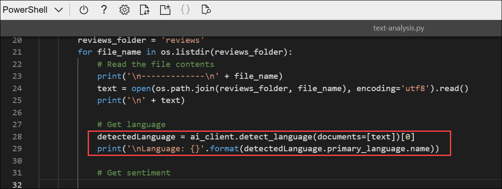

    ```python
    # Get language
    detectedLanguage = ai_client.detect_language(documents=[text])[0]
    print('\nLanguage: {}'.format(detectedLanguage.primary_language.name))
    ```

     > **Note**: *In this example, each review is analyzed individually, resulting in a separate call to the service for each file. An alternative approach is to create a collection of documents and pass them to the service in a single call. In both approaches, the response from the service consists of a collection of documents; which is why in the Python code above, the index of the first (and only) document in the response ([0]) is specified.*

1. Save your changes. Then re-run the program.

1. Observe the output, noting that this time the language for each review is identified.

    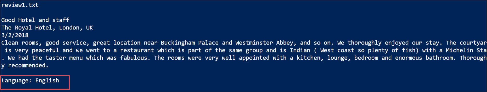

## Task 6: Add code to evaluate sentiment

*Sentiment analysis* is a commonly used technique to classify text as *positive* or *negative* (or possible *neutral* or *mixed*). It's commonly used to analyze social media posts, product reviews, and other items where the sentiment of the text may provide useful insights.

1. In the code editor, find the comment **Get sentiment**. Then add the code necessary to detect the sentiment of each review document:

    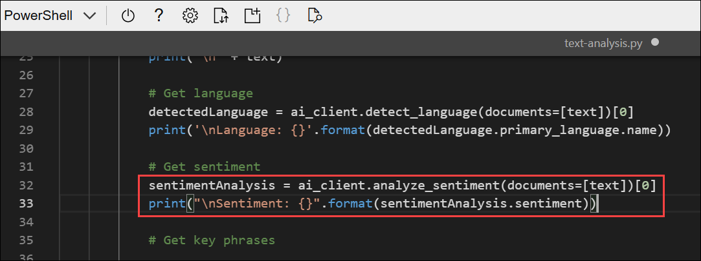

    ```python
    # Get sentiment
    sentimentAnalysis = ai_client.analyze_sentiment(documents=[text])[0]
    print("\nSentiment: {}".format(sentimentAnalysis.sentiment))
    ```

1. Save your changes. Then close the code editor and re-run the program.

1. Observe the output, noting that the sentiment of the reviews is detected.

    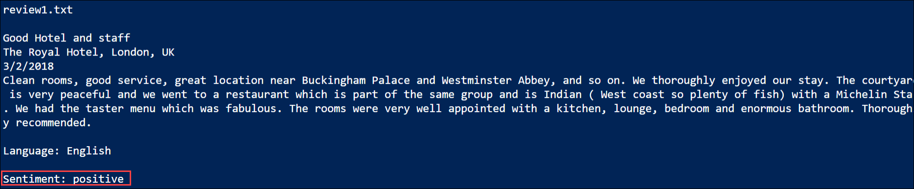

## Task 7: Add code to identify key phrases

It can be useful to identify key phrases in a body of text to help determine the main topics that it discusses.

1. In the code editor, find the comment **Get key phrases**. Then add the code necessary to detect the key phrases in each review document:

    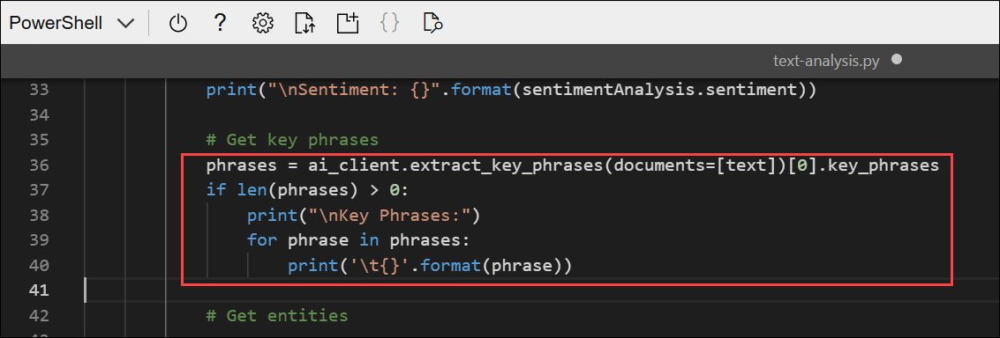

    ```python
    # Get key phrases
    phrases = ai_client.extract_key_phrases(documents=[text])[0].key_phrases
    if len(phrases) > 0:
            print("\nKey Phrases:")
            for phrase in phrases:
                print('\t{}'.format(phrase))
    ```

1. Save your changes and re-run the program.

1. Observe the output, noting that each document contains key phrases that give some insights into what the review is about.

    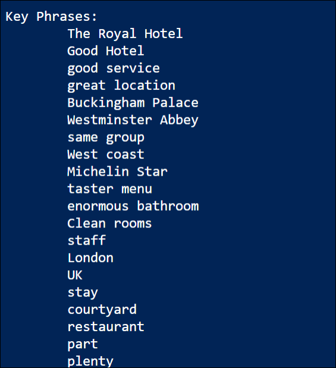

## Task 8: Add code to extract entities

Often, documents or other bodies of text mention people, places, time periods, or other entities. The text Analytics API can detect mulNote:le categories (and subcategories) of entity in your text.

1. In the code editor, find the comment **Get entities**. Then, add the code necessary to identify entities that are mentioned in each review:

    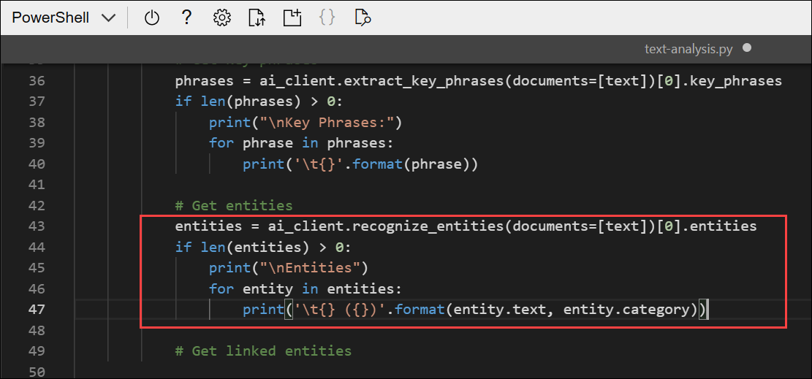

    ```python
    # Get entities
    entities = ai_client.recognize_entities(documents=[text])[0].entities
    if len(entities) > 0:
            print("\nEntities")
            for entity in entities:
                print('\t{} ({})'.format(entity.text, entity.category))
    ```

1. Save your changes and re-run the program.

1. Observe the output, noting the entities that have been detected in the text.

    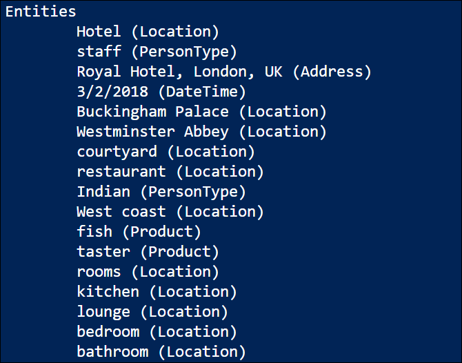

## Task 9: Add code to extract linked entities

In addition to categorized entities, the Text Analytics API can detect entities for which there are known links to data sources, such as Wikipedia.

1. In the code editor, find the comment **Get linked entities**. Then, add the code necessary to identify linked entities that are mentioned in each review:

    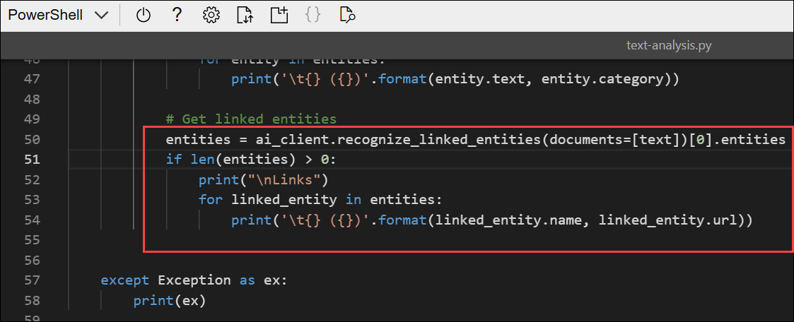

    ```python
    # Get linked entities
    entities = ai_client.recognize_linked_entities(documents=[text])[0].entities
    if len(entities) > 0:
            print("\nLinks")
            for linked_entity in entities:
                print('\t{} ({})'.format(linked_entity.name, linked_entity.url))
    ```

1. Save your changes and re-run the program.

1. Observe the output, noting the linked entities that are identified.

    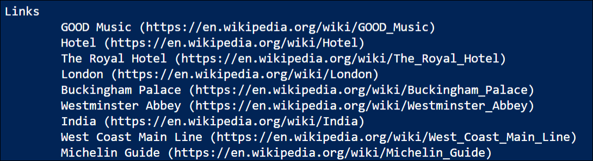

## Summary


