# Lab 15: Create a Question Answering Solution

### Estimated Duration: 45 Minutes

## Overview

In this lab, you’ll build a **Custom Named Entity Recognition (NER) solution** using **Azure AI Language**. You’ll start by provisioning a language resource in Azure and creating a custom NER project in **Language Studio**, defining entity categories such as items, prices, and locations. Next, you’ll upload sample text documents, label them with the correct entities, and prepare the dataset for training and evaluation. After training and testing the model in Language Studio, you’ll deploy it to make it accessible through a REST endpoint. Finally, you’ll set up a Python application in **Azure Cloud Shell**, configure it with the resource endpoint and key, add code to extract entities from new text, and run the app to see the model identify and return entities in real time.

## Lab Objectives 

- **Task 1:** Provision an Azure AI Language resource

- **Task 2:** Create a question answering project

- **Task 3:** Add sources to the knowledge base

- **Task 4:**  Edit the knowledge base

- **Task 5:** Train and test the knowledge base

- **Task 6:** Deploy the knowledge base

- **Task 7:** Prepare to develop an app in Cloud Shell

- **Task 8:** Configure your application

- **Task 9:** Add code to user your knowledge base

## Task 1: Provision an Azure AI Language resource

In this task, you’ll provision an Azure AI Language resource configured for Custom Question Answering. You’ll navigate the Azure portal to create the resource, set up required parameters such as subscription, resource group, region, and pricing tier, and retrieve the resource keys and endpoint, which are necessary for interacting with the language service in subsequent steps.

1. On the Azure portal, search for **Language service (1)** and then select **Language(2)** from the services.

    

1. Select **+ Create**.

    

1. Select the **Custom question answering (1)** block. Then select **Continue to create your resource (2)**.

   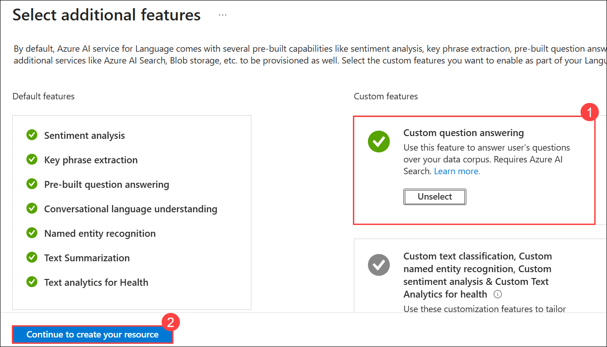 

1. You will need to enter the following settings:

    - Subscription: Leave your default Azure subscription **(1)**
    - Resource group: Select **AI-102-RG15 (2)**
    - Region: Select **<inject key="Region" enableCopy="false" /> (3)**
    - Name: Enter **languageservice<inject key="DeploymentID" enableCopy="false"/> (4)**
    - Pricing tier: Select **F0 (5)** (*free*), or **S** (*standard*) if F is not available.
    - Azure Search region: Select **<inject key="Region" enableCopy="false" /> (6)**
    - Azure Search pricing tier: **Free (F) (7)** (*If this tier is not available, select Basic (B)*)
    - Responsible AI Notice: ***Agree* (8)**
    - Select **Review + create (9)**
    
        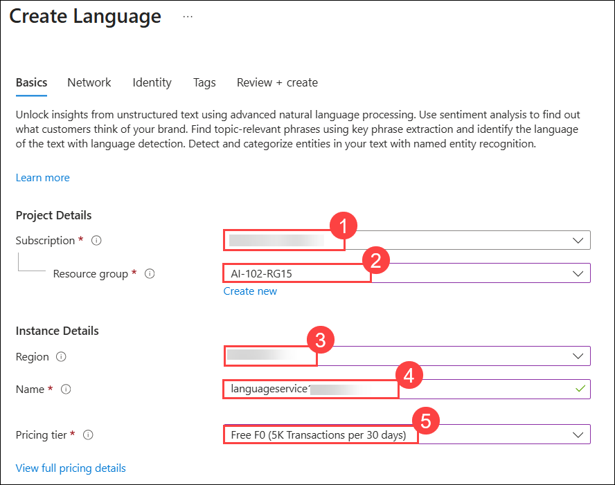 

        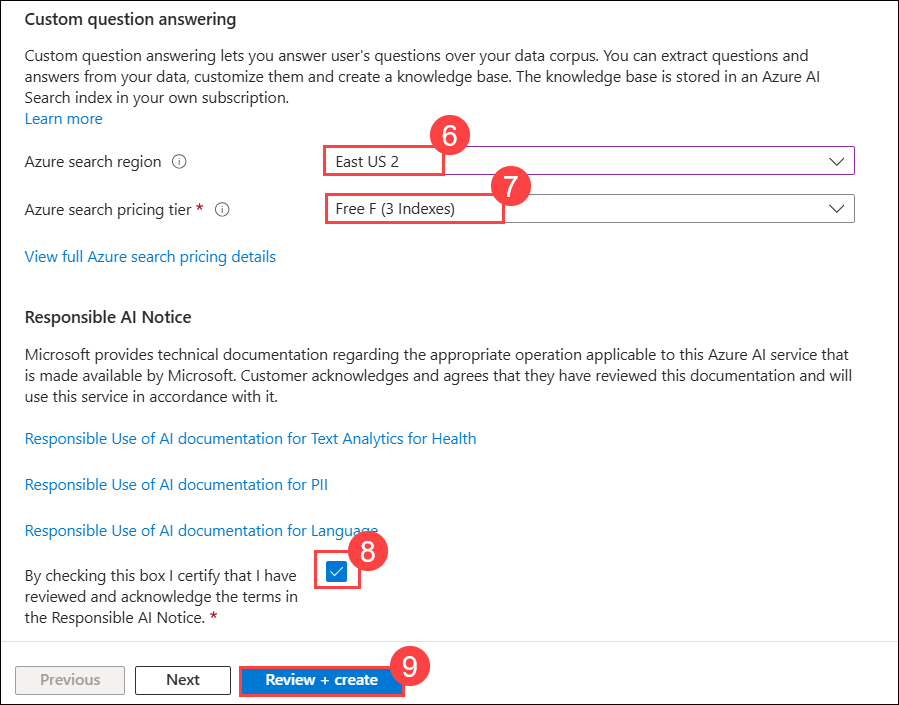   

1. Then select **Create**.

   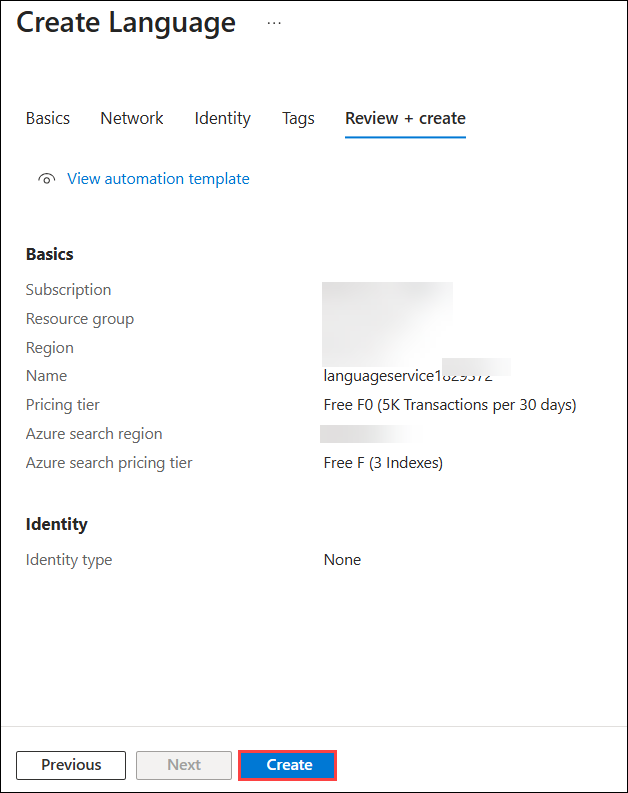 
    
    >**NOTE**: Custom Question Answering uses Azure Search to index and query the knowledge base of questions and answers.

1. Wait for deployment to complete, and then select **Go to resource group.**.

   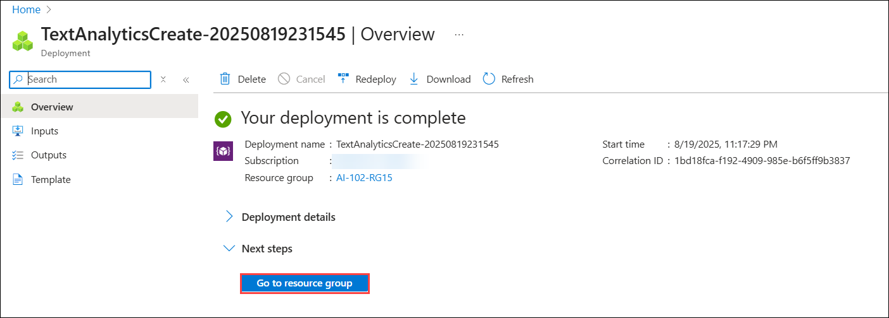 

1. Select the **languageservice<inject key="DeploymentID" enableCopy="false"/>** language resource.

   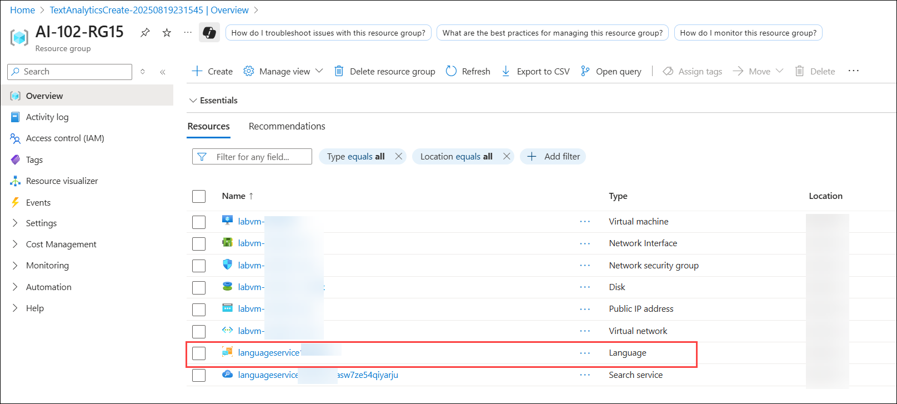 

1. Navigate to the **Keys and Endpoint (1)** page in the **Resource Management** section. Copy and paste the **KEY 1 (2)** and **Endpoint (3)**. You will need the information on this page later in the lab.

   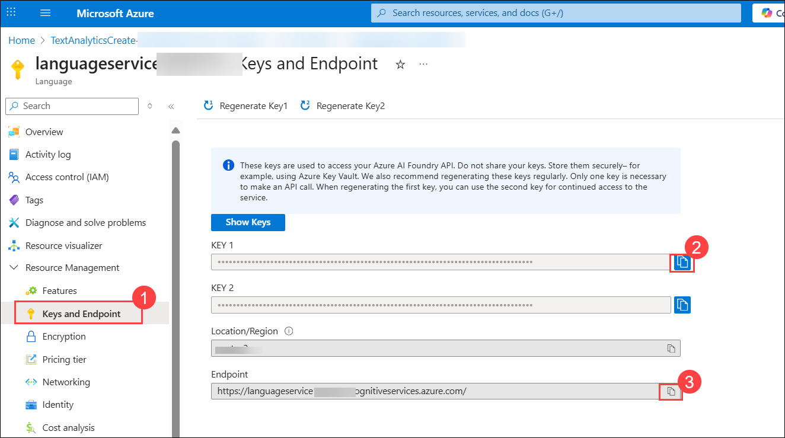 

> **Congratulations** on completing the task! Now, it's time to validate it. Here are the steps:
>
> - Hit the Validate button for the corresponding task. If you receive a success message, you can proceed to the next task.
> - If not, carefully read the error message and retry the step, following the instructions in the lab guide.
> - If you need any assistance, please contact us at cloudlabs-support@spektrasystems.com. We are available 24/7 to help.
 
<validation step="2200df38-ce0c-418c-98e4-cdb808b3c3e2" />
 
---  

## Task 2: Create a question answering project

In this task, you’ll create a Custom Question Answering project in Azure Language Studio. You’ll connect your previously provisioned Azure AI Language resource, define the project language, and set up a knowledge base containing questions and answers about Microsoft Learn. This project will serve as the foundation for querying and retrieving answers in subsequent steps.

1. In a new browser tab, go to the Language Studio portal at [https://language.cognitive.azure.com/](https://language.cognitive.azure.com/).

1. Selelect **Sign in**.

     

1. If prompted, provide the credentials below:

    - **Email/Username:** <inject key="AzureAdUserEmail"></inject>

    - **Password:** <inject key="AzureAdUserPassword"></inject>

1. Close the pop ups.

     

1. If you're prompted to choose a Language resource, select the following settings:

    - **Azure Directory**: The Azure directory containing your subscription **(1)**
    - **Azure subscription**: Your Azure subscription **(2)**
    - **Resource type**: Language **(3)**
    - **Resource name**: Select **languageservice<inject key="DeploymentID" enableCopy="false"/> (4)**
    - Then select **Done (5)**

        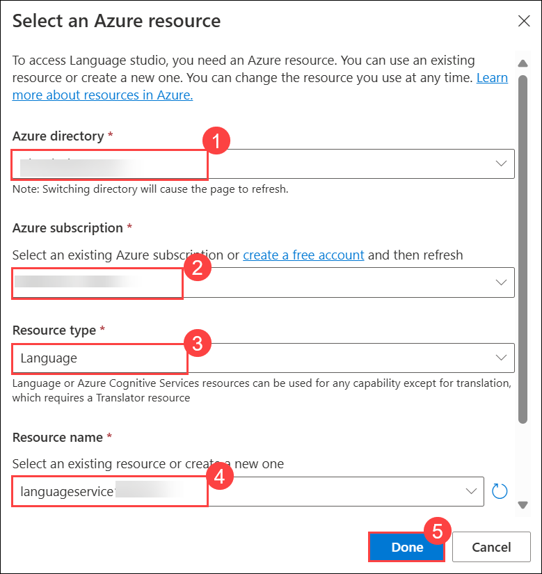    

      If you are <u>not</u> prompted to choose a language resource, it may be because you have multiple Language resources in your subscription; in which case:

      1. On the bar at the top if the page, select the **Settings (&#9881;)** button.
      2. On the **Settings** page, view the **Resources** tab.
      3. Select the language resource you just created, and click **Switch resource**.
      4. At the top of the page, click **Language Studio** to return to the Language Studio home page.

1. At the top of the portal, in the **Create new (1)** menu, select **Custom question answering (2)**.

    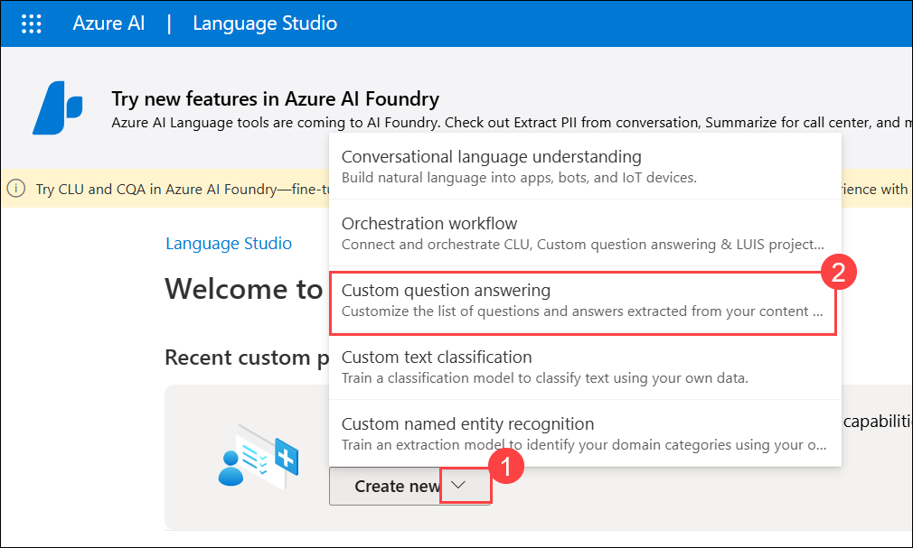 

1. In the **Create a project** wizard, on the **Choose language setting** page,

    - Select the option to **Select the language for all projects (1)**
    - Select **English (2)** as the language. 
    - Then select **Next (3)**.

        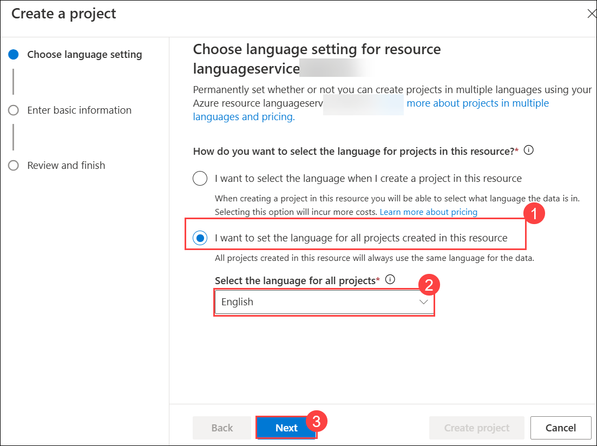 

1. On the **Enter basic information** page, enter the following details:

    - **Name** `LearnFAQ` **(1)**
    - **Description**: `FAQ for Microsoft Learn` **(2)**
    - **Default answer when no answer is returned**: `Sorry, I don't understand the question` **(3)**
    - Select **Next (4)**.

      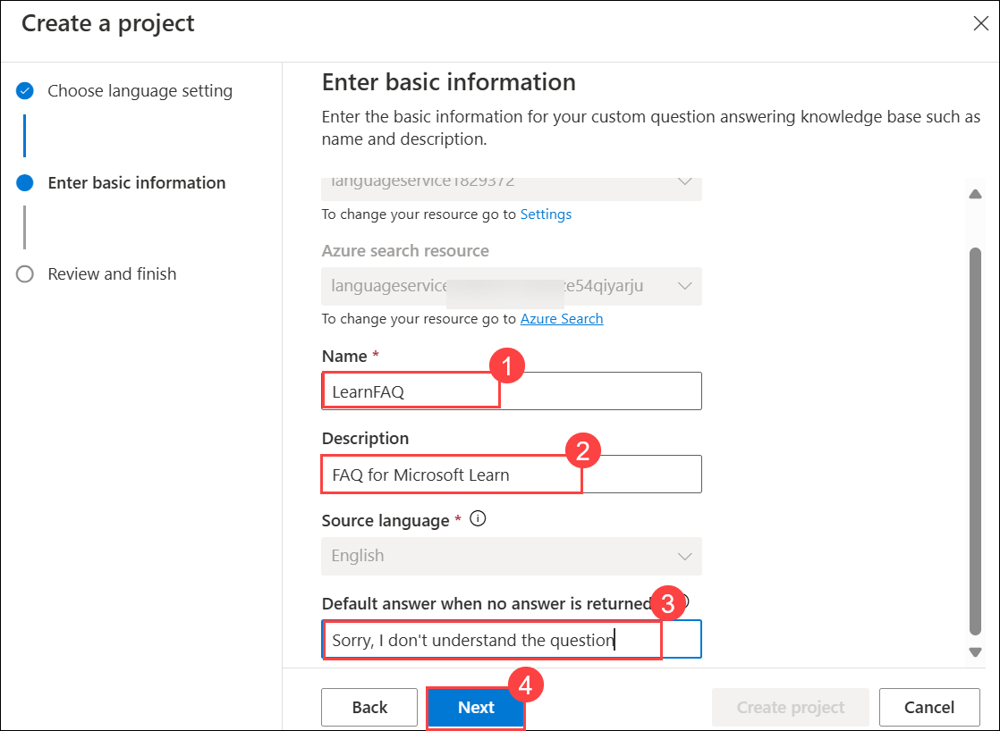     

1. On the **Review and finish** page, select **Create project**.

    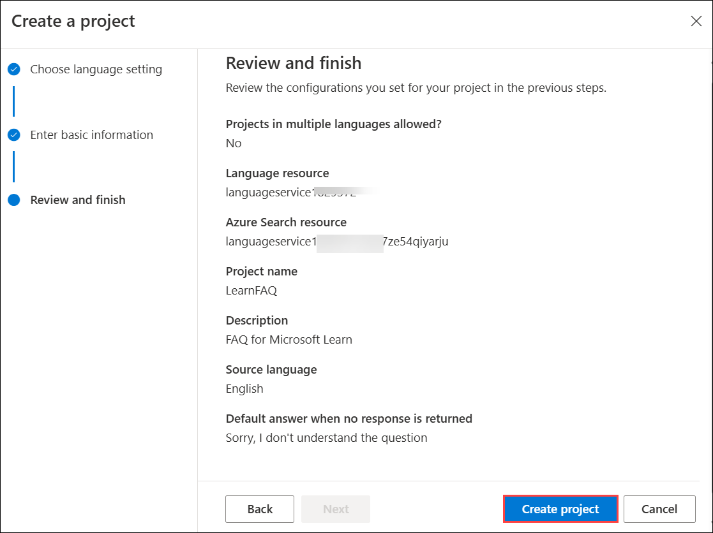 

> **Congratulations** on completing the task! Now, it's time to validate it. Here are the steps:
>
> - Hit the Validate button for the corresponding task. If you receive a success message, you can proceed to the next task.
> - If not, carefully read the error message and retry the step, following the instructions in the lab guide.
> - If you need any assistance, please contact us at cloudlabs-support@spektrasystems.com. We are available 24/7 to help.
 
<validation step="43774b71-1947-43ce-901e-6a3f7009419c" />
 
---   

## Task 3: Add sources to the knowledge base

In this task, you’ll enrich your Custom Question Answering project by adding sources to the knowledge base. You’ll import questions and answers from an existing Microsoft Learn FAQ web page and add pre-defined “chit chat” content to handle common conversational exchanges, providing a broader and more interactive knowledge base for the project.

1. On the **Manage sources (1)** page for your question answering project, in the **&#9547; Add source (2)** list, select **URLs (3)**.

    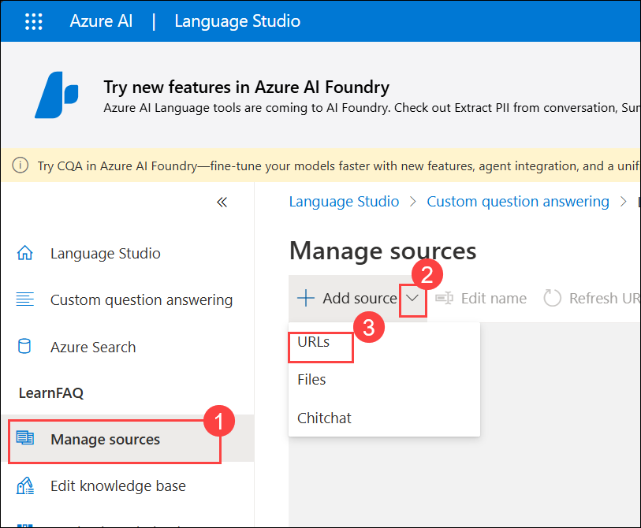 
    
1. Then in the **Add URLs** dialog box, select **&#9547; Add url (1)**. Set the following name and URL  before you select **Add all (4)** to add it to the knowledge base:

    - **Name**: `Learn FAQ Page` **(2)**
    - **URL**: `https://docs.microsoft.com/en-us/learn/support/faq` **(3)**

      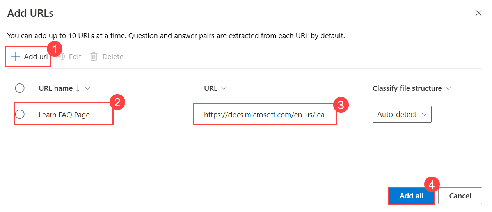 

1. On the **Manage sources** page for your question answering project, in the **&#9547; Add source (1)** list, select **Chitchat (2)**.

    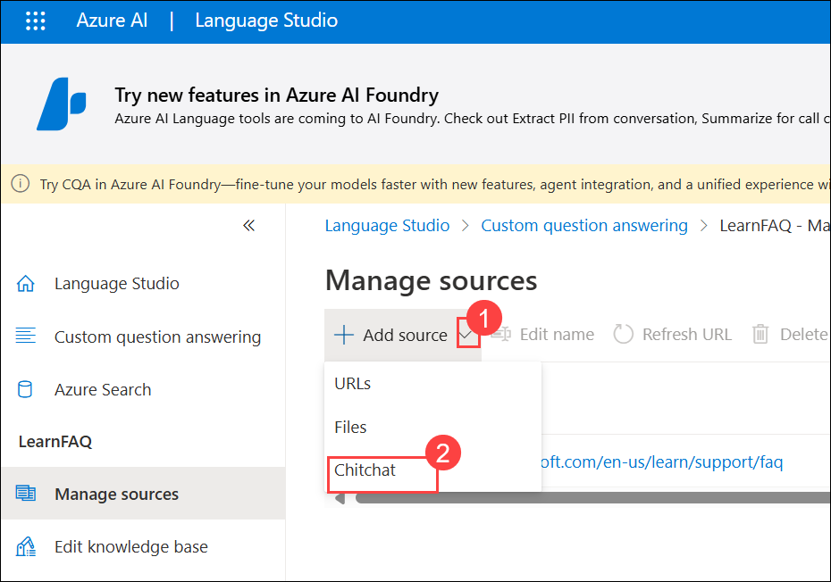 

1. The in the **Add chit chat** dialog box, select **Friendly (1)** and select **Add chit chat (2)**.

    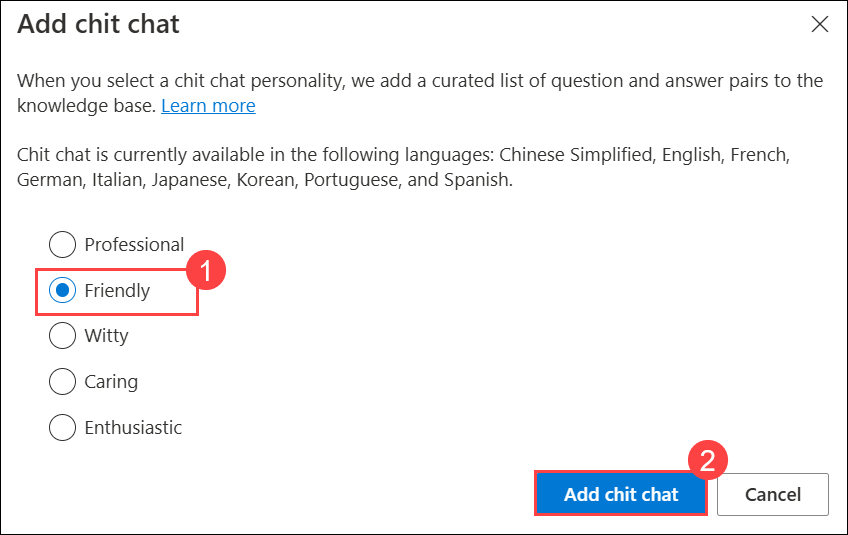 

## Task 4:  Edit the knowledge base

In this task, you’ll enhance your Custom Question Answering knowledge base by editing and extending it. You’ll add new question-and-answer pairs, create alternate questions for better recognition, and define follow-up prompts to support multi-turn conversations, making the knowledge base more complete and interactive.

1. In your **LearnFAQ** project in Language Studio, select the **Edit knowledge base** page to see the existing question and answer pairs (if some tips are displayed, read them and choose **Got it** to dismiss them, or select **Skip all**)

    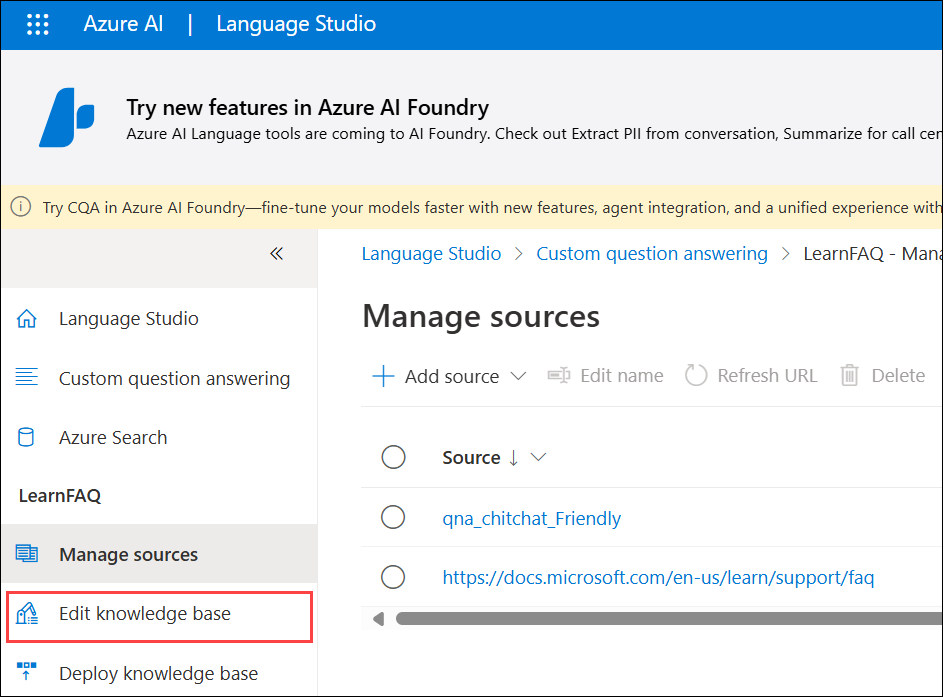 

    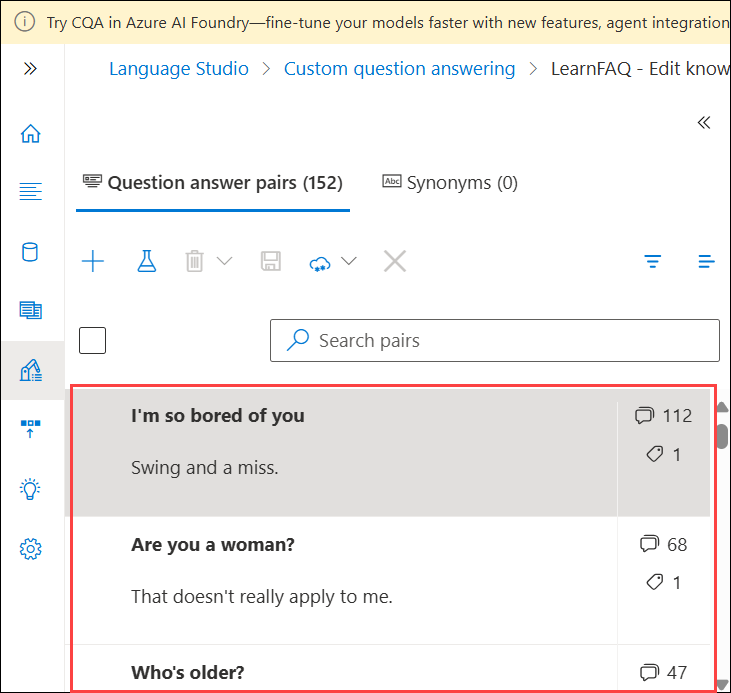 

1. In the knowledge base, on the **Question answer pairs** tab, select **&#65291; (1)**.

    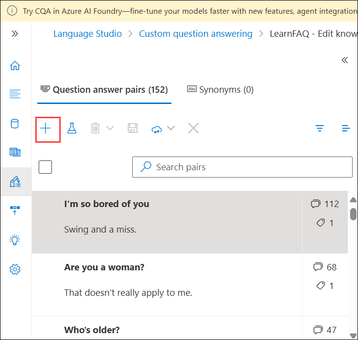 

1. Create a new question answer pair with the following settings and then select **Done (4)**.

    - **Source**: `https://docs.microsoft.com/en-us/learn/support/faq` **(1)**
    - **Question**: `What are Microsoft credentials?` **(2)**
    - **Answer**: `Microsoft credentials enable you to validate and prove your skills with Microsoft technologies.` **(3)**

      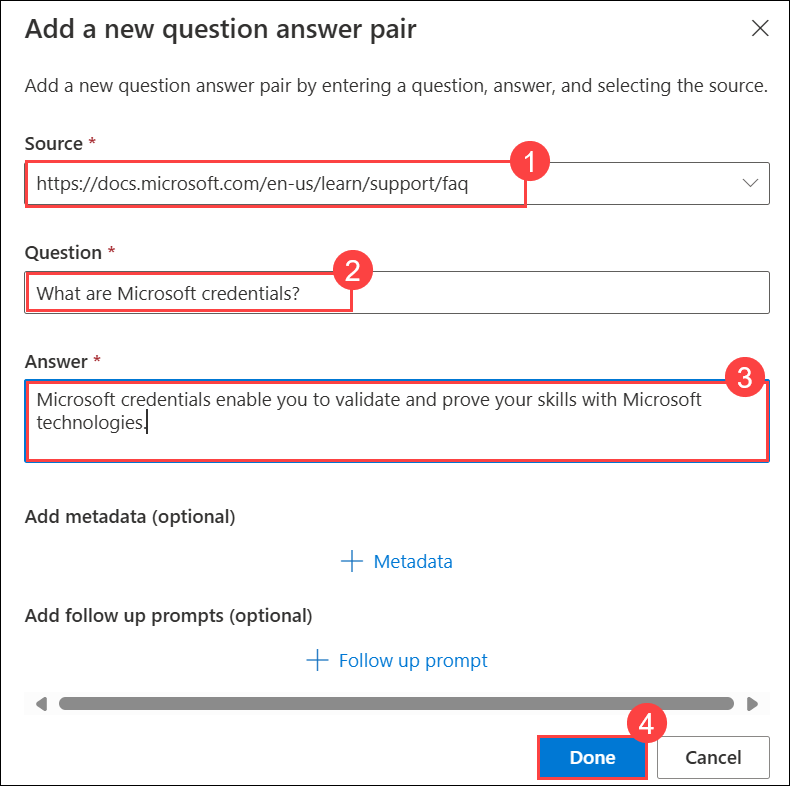

1. In the page for the **What are Microsoft credentials?** question that is created, expand **Alternate questions (1)**. Click on **+ Add the alternate question (2)** and the add the alternate question `How can I demonstrate my Microsoft technology skills?` **(3)**.

    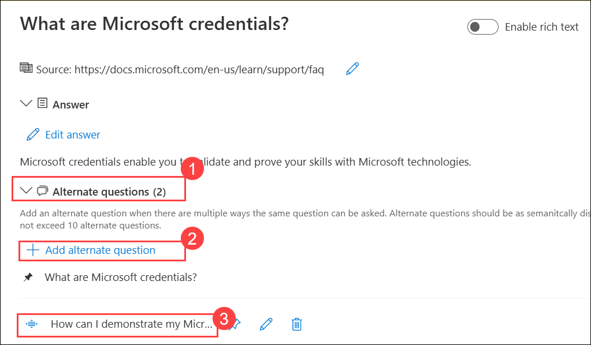 

    In some cases, it makes sense to enable the user to follow up on an answer by creating a *multi-turn* conversation that enables the user to iteratively refine the question to get to the answer they need.

1. Under the answer you entered for the certification question, expand **Follow-up prompts (1)** and then click on **+ Add follow up prompt (2)**.

    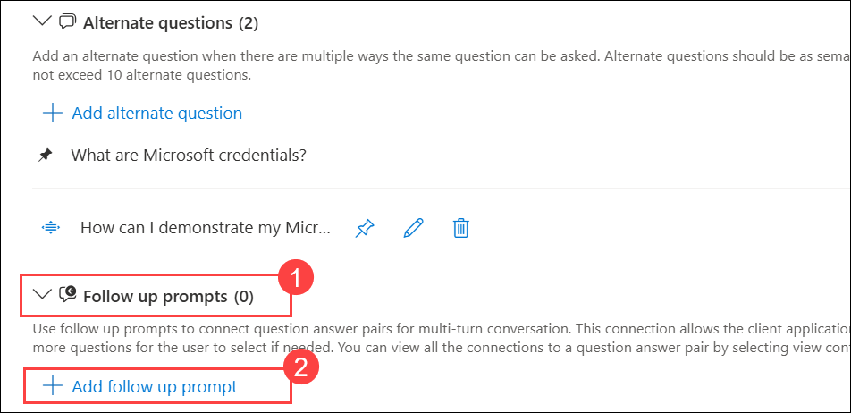 

1. Add  the following follow-up prompt:

    - Text displayed in the prompt to the user: Enter `Learn more about credentials`. **(1)**
    - Select the **Create link to new pair (2)** tab
    - Enter this text: `You can learn more about credentials on the [Microsoft credentials page](https://docs.microsoft.com/learn/credentials/).` **(3)**
    - Select **Show in contextual flow only (3)**. This option ensures that the answer is only ever returned in the context of a follow-up question from the original certification question.
    - Select **Add prompt**.

      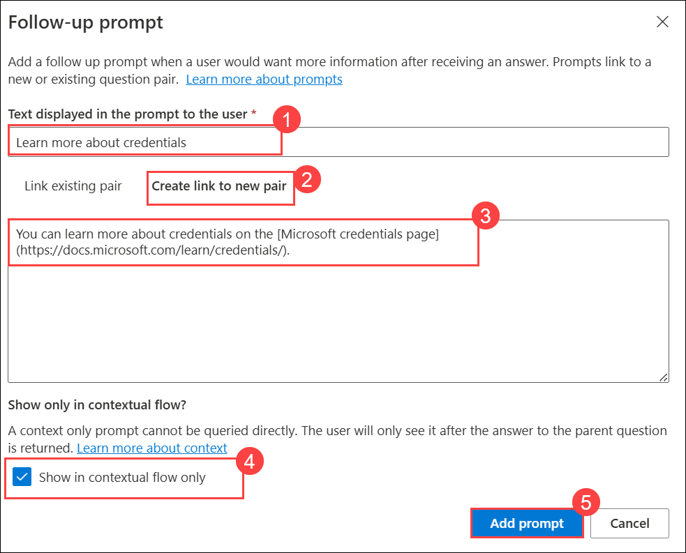 

## Task 5: Train and test the knowledge base

In this task, you’ll train and test your Custom Question Answering knowledge base in Language Studio. You’ll save the knowledge base, use the test pane to verify responses to both FAQ and chit-chat questions, and confirm that follow-up prompts work correctly, ensuring the knowledge base provides accurate and interactive answers.

1. Save the changes to your knowledge base by selecting the **Save** button under the **Question answer pairs** tab on the left.

    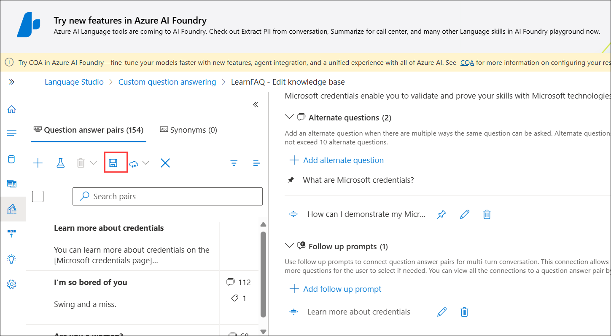 

1. After the changes have been saved, select the **Test (1)** button to open the test pane.

    - In the test pane, at the top, deselect **Include short answer response (2)** (if not already unselected).
    
      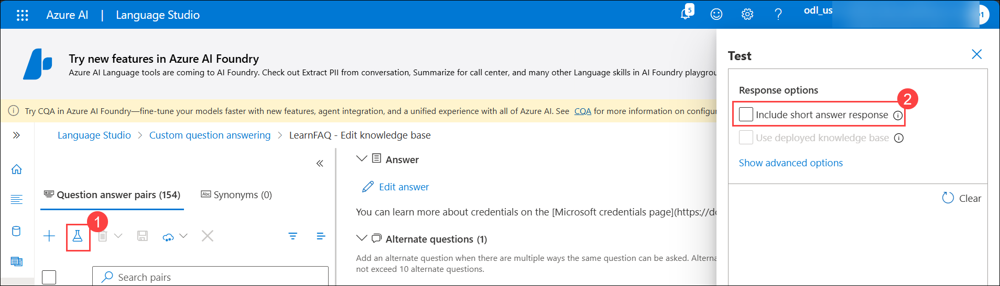     
    
1. Then at the bottom enter the message `Hello`. A suitable response should be returned.

    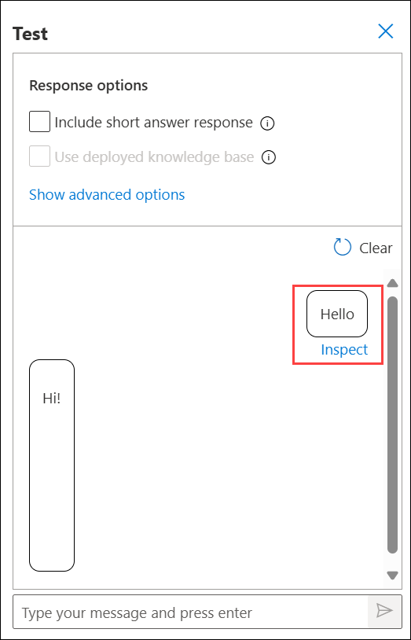 

1. In the test pane, at the bottom enter the message `What is Microsoft Learn?`. An appropriate response from the FAQ should be returned.

    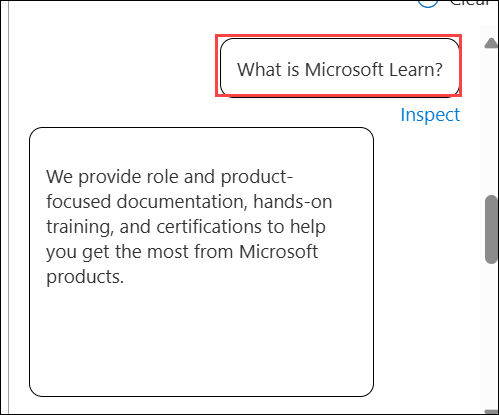 

1. Enter the message `Thanks!` An appropriate chit-chat response should be returned.

    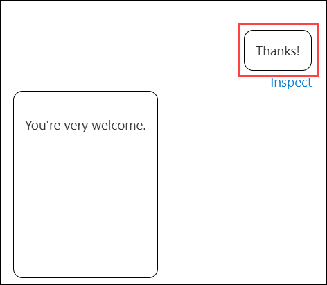 

1. Enter the message `Tell me about Microsoft credentials`. The answer you created should be returned along with a follow-up prompt link.

    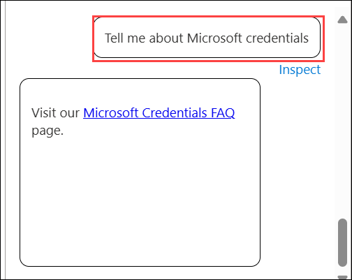 

1. Select the **Credentials** follow-up link. The follow-up answer with a link to the Credentials page should be returned.

1. When you're done testing the knowledge base, close the test pane.

## Task 6: Deploy the knowledge base

In this task, you’ll deploy your Custom Question Answering knowledge base so it can be accessed by client applications. You’ll publish the knowledge base in Language Studio, obtain the REST endpoint, and review the required parameters for making API calls, enabling external applications to query your knowledge base.

1. In the **LearnFAQ** project in Language Studio, select the **Deploy knowledge base (1)** page from the navigation menu on the left.
    - At the top of the page, select **Deploy (2)**. Then select **Deploy (3)** to confirm you want to deploy the knowledge base.

      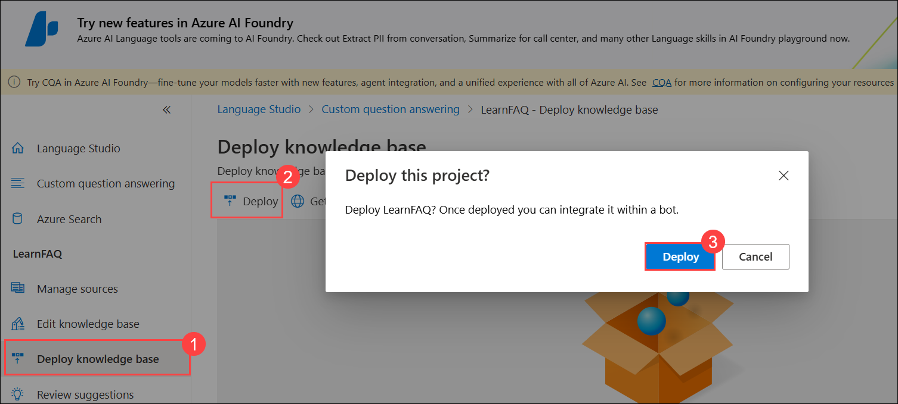 

1. When deployment is complete, select **Get prediction URL (1)** to view the REST endpoint for your knowledge base and note that the sample request includes parameters for:

    - **projectName**: The name of your project (which should be `LearnFAQ`) **(2)**
    - **deploymentName**: The name of your deployment (which should be `production`) **(3)**

      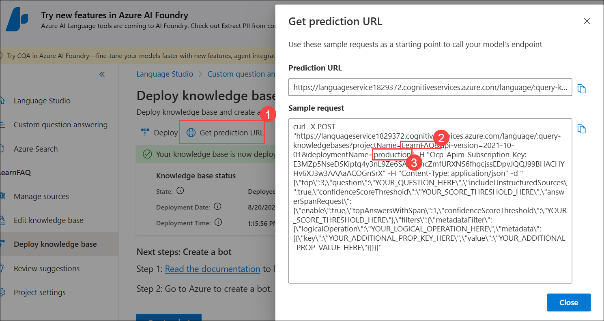

1. Close the prediction URL dialog box.

## Task 7: Prepare to develop an app in Cloud Shell

In this task, you’ll prepare the Azure Cloud Shell environment to develop your question answering app. You’ll launch Cloud Shell in PowerShell, switch to the classic version to access the code editor, and clone the provided GitHub repository containing the application code, setting up the environment for development and testing.

1. Navigate to [Azure portal](https://portal.azure.com/).

1. If prompted, provide the credentials below:
    
    - **Email/Username:** <inject key="AzureAdUserEmail"></inject>

    - **Password:** <inject key="AzureAdUserPassword"></inject>

1. Use the **[>_]** button to the right of the search bar at the top of the page to create a new **Cloud Shell** in the Azure portal.

     

1. Selecting a **PowerShell** environment.

     

1. On the **Getting started** page,

    - Select **No storage account required (1)** 
    - Select your subscription **(2)**
    - Click on **Apply (3)**

       

1. In the cloud shell toolbar, in the **Settings (1)** menu, select **Go to Classic version (2)** (this is required to use the code editor).

    

     >**Note**: The cloud shell provides a command-line interface in a pane at the bottom of the Azure portal. You can resize or maximize this pane to make it easier to work in.

     >**Note**: Ensure you've switched to the classic version of the cloud shell before continuing.

1. In the PowerShell pane, enter the following commands to clone the GitHub repo for this exercise:

    ```
    rm -r mslearn-ai-language -f
    git clone https://github.com/microsoftlearning/mslearn-ai-language
    ```

     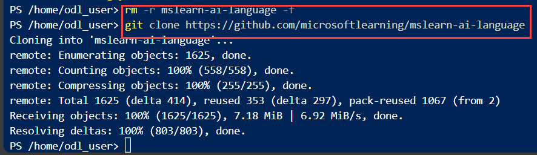

      >**Tip**: As you enter commands into the cloudshell, the ouput may take up a large amount of the screen buffer. You can clear the screen by entering the `cls` command to make it easier to focus on each task.

1. After the repo has been cloned, navigate to the folder containing the application code files:  

    ```
    cd mslearn-ai-language/Labfiles/02-qna/Python/qna-app
    ```
    
## Task 8: Configure your application

In this task, you’ll configure your question answering application in Cloud Shell. You’ll set up a Python virtual environment, install required packages including the Azure AI Language Question Answering SDK, and update the application’s configuration file with your Azure Language resource endpoint, authentication key, project name, and deployment name, preparing the app for execution.

1. In the command line pane, run the following command to view the code files in the **qna-app** folder:

    ```
   ls -a -l
    ```

     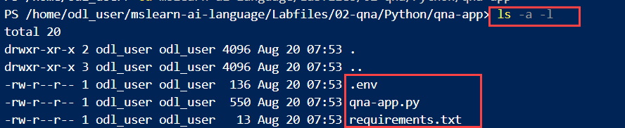    

     The files include a configuration file (**.env**) and a code file (**qna-app.py**).

1. Create a Python virtual environment and install the Azure AI Language Question Answering SDK package and other required packages by running the following command:

    ```
   python -m venv labenv
   ./labenv/bin/Activate.ps1
   pip install -r requirements.txt azure-ai-language-questionanswering
    ```
    >**Note**: Make sure to hit **Enter** after the last command.

1. Enter the following command to edit the configuration file:

    ```
    code .env
    ```

     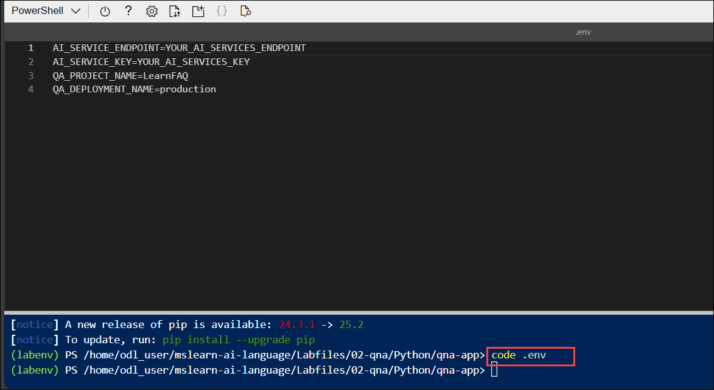      

     The file is opened in a code editor.

1. In the code file, update the configuration values it contains to reflect the **endpoint (1)** and an authentication **key (2)** for the Azure Language resource you created (available on the **Keys and Endpoint** page for your Azure AI Language resource in the Azure portal that you have copied in **Task 1**). The project name and deployment name for your deployed knowledge base should also be in this file.

    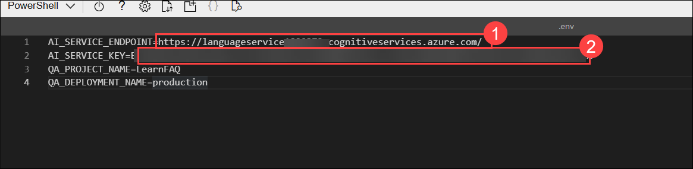

1. After you've replaced the placeholders, within the code editor, use the **CTRL+S** command or **Right-click > Save** to save your changes and then use the **CTRL+Q** command or **Right-click > Quit** to close the code editor while keeping the cloud shell command line open.


## Task 9: Add code to user your knowledge base

In this task, you’ll enhance your Python application to interact with your deployed knowledge base. You’ll import the required Azure Question Answering SDK namespaces, create a client using your resource’s endpoint and key, and add code to submit questions from the command line and display the returned answers along with confidence scores and sources, enabling interactive querying of your knowledge base.

1. Enter the following command to edit the application code file:

    ```
    code qna-app.py
    ```

1. Review the existing code. You will add code to work with your knowledge base.

    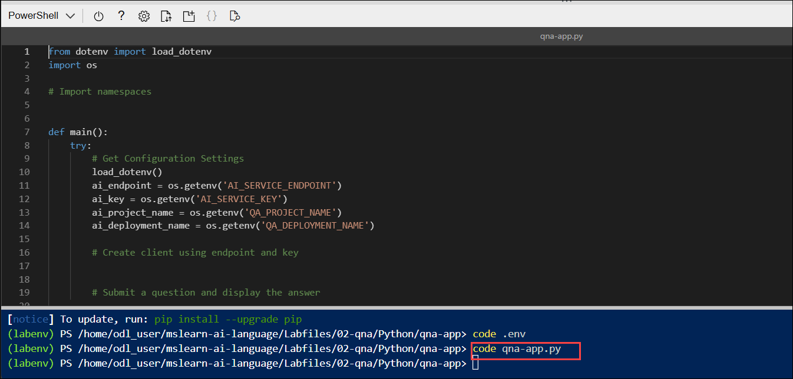  

     >**Tip**: As you add code to the code file, be sure to maintain the correct indentation.

1. In the code file, find the comment **Import namespaces**. Then, under this comment, add the following language-specific code to import the namespaces you will need to use the Question Answering SDK:

    ```python
   # import namespaces
   from azure.core.credentials import AzureKeyCredential
   from azure.ai.language.questionanswering import QuestionAnsweringClient
    ```
     
     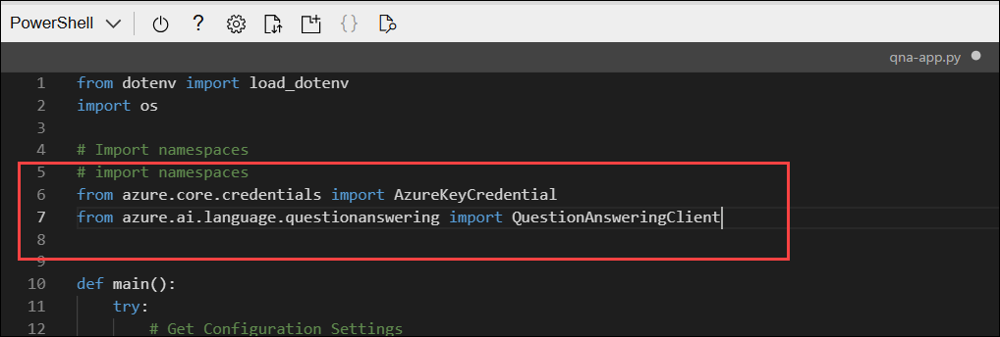      

      >**Tip**: As you add code to the code file, be sure to maintain the correct indentation.      

1. In the **main** function, note that code to load the Azure AI Language service endpoint and key from the configuration file has already been provided. Then find the comment **Create client using endpoint and key**, and add the following code to create a question answering client:

    ```Python
   # Create client using endpoint and key
   credential = AzureKeyCredential(ai_key)
   ai_client = QuestionAnsweringClient(endpoint=ai_endpoint, credential=credential)
    ```

     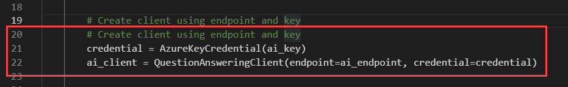      

      >**Tip**: As you add code to the code file, be sure to maintain the correct indentation.

1. In the code file, find the comment **Submit a question and display the answer**, and add the following code to repeatedly read questions from the command line, submit them to the service, and display details of the answers:

    ```Python
   # Submit a question and display the answer
   user_question = ''
   while True:
        user_question = input('\nQuestion:\n')
        if user_question.lower() == "quit":                
            break
        response = ai_client.get_answers(question=user_question,
                                        project_name=ai_project_name,
                                        deployment_name=ai_deployment_name)
        for candidate in response.answers:
            print(candidate.answer)
            print("Confidence: {}".format(candidate.confidence))
            print("Source: {}".format(candidate.source))
    ```

     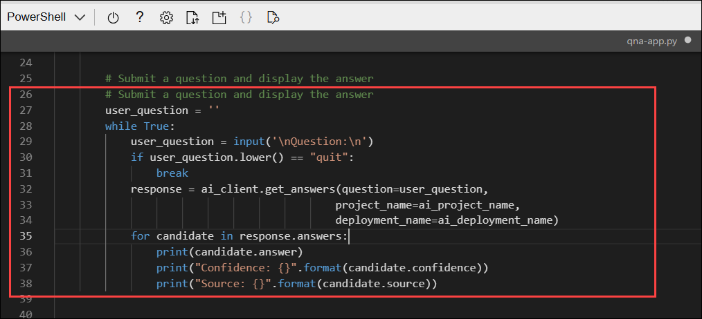      

      >**Tip**: As you add code to the code file, be sure to maintain the correct indentation.    

1. Save your changes using (**CTRL+S**).

1. Then enter the following command to run the program **(1)** (you maximize the cloud shell pane and resize the panels to see more text in the command line pane):

    ```
   python qna-app.py
    ```

    - When prompted, enter a question to be submitted to your question answering project; for example `What is a learning path?`. **(2)**

    - Review the answer that is returned.    

      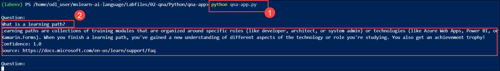  

1. Ask more questions. When you're done, enter `quit`.

## Summary

In this lab, you built a **Custom Question Answering solution** in **Azure AI Language**. You provisioned an Azure AI Language resource, created a question answering project, and populated its knowledge base using an existing FAQ page and pre-defined chit-chat content. You then edited the knowledge base to add new questions, alternate questions, and follow-up prompts to support multi-turn conversations. After training and testing the knowledge base in **Language Studio**, you deployed it to make it accessible via a REST endpoint. Finally, you prepared a Python application in **Azure Cloud Shell**, configured it with your resource’s endpoint and key, added code to interact with the knowledge base, and ran the app to submit questions and receive answers interactively.

### You have successfully completed the Hands-on Lab!


