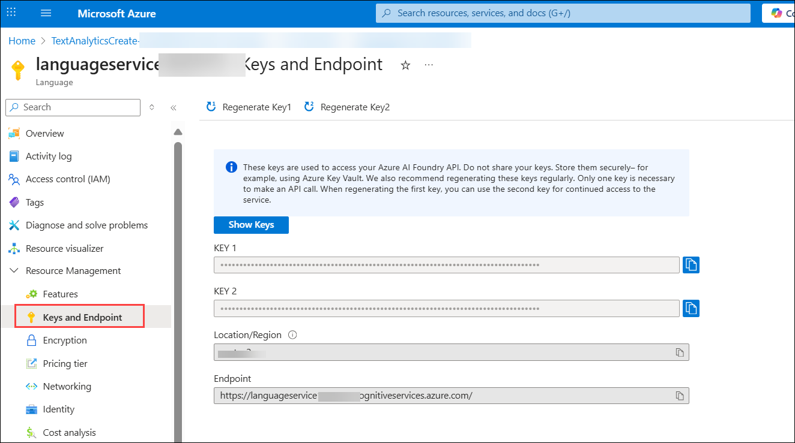

# Lab 15: Create a Question Answering Solution

One of the most common conversational scenarios is providing support through a knowledge base of frequently asked questions (FAQs). Many organizations publish FAQs as documents or web pages, which works well for a small set of question and answer pairs, but large documents can be difficult and time-consuming to search.

Azure AI Language includes a question answering capability that enables you to create a knowledge base of question and answer pairs that can be queried using natural language input, and is most commonly used as a resource that a bot can use to look up answers to questions submitted by users. In this exercise, you'll use the Azure AI Language Python SDK for text analytics to implement a simple question answering application.

### Task 1: Provision an *Azure AI Language* resource

1. On the Azure portal, search for **Language service (1)** and then select **Language(2)** from the services.

    

1. Select **+ Create**.

    

1. Select the **Custom question answering (1)** block. Then select **Continue to create your resource (2)**.

    

1. You will need to enter the following settings:

    - Subscription: Leave your default Azure subscription **(1)**
    - Resource group: Select **AI-102-RG15 (2)**
    - Region: Select **<inject key="Region" enableCopy="false" /> (3)**
    - Name: Enter **languageservice<inject key="DeploymentID" enableCopy="false"/> (4)**
    - Pricing tier: Select **F0 (5)** (*free*), or **S** (*standard*) if F is not available.
    - Azure Search region: Select **<inject key="Region" enableCopy="false" /> (6)**
    - Azure Search pricing tier: **Free (F) (7)** (*If this tier is not available, select Basic (B)*)
    - Responsible AI Notice: ***Agree* (8)**
    - Select **Review + create (9)**,
    
       
         

1. Then select **Create**.

    
    
    >**NOTE**: Custom Question Answering uses Azure Search to index and query the knowledge base of questions and answers.

1. Wait for deployment to complete, and then select **Go to resource group.**.

    

1. Select the **languageservice<inject key="DeploymentID" enableCopy="false"/>** language resource.

    

1. View the **Keys and Endpoint** page in the **Resource Management** section. You will need the information on this page later in the lab.

    

> **Congratulations** on completing the task! Now, it's time to validate it. Here are the steps:
>
> - Hit the Validate button for the corresponding task. If you receive a success message, you can proceed to the next task.
> - If not, carefully read the error message and retry the step, following the instructions in the lab guide.
> - If you need any assistance, please contact us at cloudlabs-support@spektrasystems.com. We are available 24/7 to help.
 
<validation step="2200df38-ce0c-418c-98e4-cdb808b3c3e2" />
 
---   

### Task 2: Create a question answering project

To create a knowledge base for question answering in your Azure AI Language resource, you can use the Language Studio portal to create a question answering project. In this case, you'll create a knowledge base containing questions and answers about [Microsoft Learn](https://docs.microsoft.com/learn).

1. In a new browser tab, go to the Language Studio portal at [https://language.cognitive.azure.com/](https://language.cognitive.azure.com/).

1. Selelect **Sign in**.

     

1. If prompted, provide the credentials below:

    - **Email/Username:** <inject key="AzureAdUserEmail"></inject>

    - **Password:** <inject key="AzureAdUserPassword"></inject>

1. If you're prompted to choose a Language resource, select the following settings:

    - **Azure Directory**: The Azure directory containing your subscription **(1)**
    - **Azure subscription**: Your Azure subscription **(2)**
    - **Resource type**: Language **(3)**
    - **Resource name**: Select **languageservice<inject key="DeploymentID" enableCopy="false"/> (4)**
    - Then select **Done (5)**

          

      If you are <u>not</u> prompted to choose a language resource, it may be because you have multiple Language resources in your subscription; in which case:

      1. On the bar at the top if the page, select the **Settings (&#9881;)** button.
      2. On the **Settings** page, view the **Resources** tab.
      3. Select the language resource you just created, and click **Switch resource**.
      4. At the top of the page, click **Language Studio** to return to the Language Studio home page.

1. At the top of the portal, in the **Create new (1)** menu, select **Custom question answering (2)**.

    

1. In the **Create a project** wizard, on the **Choose language setting** page,

    - Select the option to **Select the language for all projects (1)**
    - Select **English (2)** as the language. 
    - Then select **Next (3)**.

       

1. On the **Enter basic information** page, enter the following details:

    - **Name** `LearnFAQ` **(1)**
    - **Description**: `FAQ for Microsoft Learn` **(2)**
    - **Default answer when no answer is returned**: `Sorry, I don't understand the question` **(3)**
    - Select **Next (4)**.

           

1. On the **Review and finish** page, select **Create project**.

    

> **Congratulations** on completing the task! Now, it's time to validate it. Here are the steps:
>
> - Hit the Validate button for the corresponding task. If you receive a success message, you can proceed to the next task.
> - If not, carefully read the error message and retry the step, following the instructions in the lab guide.
> - If you need any assistance, please contact us at cloudlabs-support@spektrasystems.com. We are available 24/7 to help.
 
<validation step="43774b71-1947-43ce-901e-6a3f7009419c" />
 
---   