# Lab 17: Custom text classification

Azure AI Language provides several NLP capabilities, including the key phrase identification, text summarization, and sentiment analysis. The Language service also provides custom features like custom question answering and custom text classification.

To test the custom text classification of the Azure AI Language service, you'll configure the model using Language Studio then use a Python application to test it.

### Task 1: Provision an Azure AI Language resource

If you don't already have one in your subscription, you'll need to provision an Azure AI Language service resource. Additionally, use custom text classification, you need to enable the Custom text classification & extraction feature.

1. On the Azure portal, search for **Language service (1)** and then select **Language(2)** from the services.

   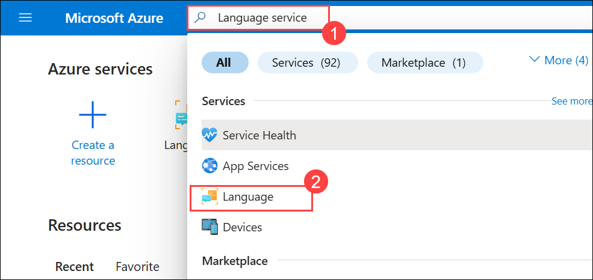 

1. Select **+ Create**.

   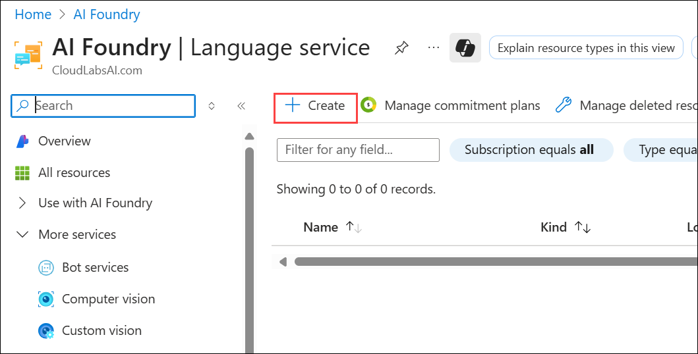

1. Select the box that includes **Custom text classification (1)**. Then select **Continue to create your resource (2)**.

   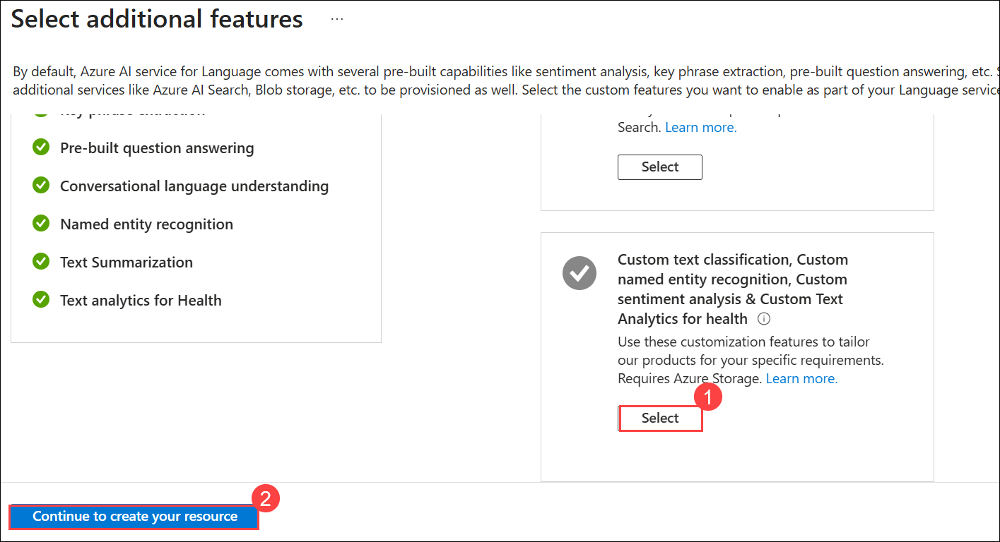

1. Create a resource with the following settings:

    - Subscription: *Your Azure subscription* **(1)**
    - Resource group: Select **AI-102-RG17 (2)**
    - Region: Select **<inject key="Region" enableCopy="false" /> (3)**
    - Name: Enter **textclassification<inject key="DeploymentID" enableCopy="false"/> (4)**
    - Pricing tier: Select **F0 (5)** (*free*), or **S** (*standard*) if F is not available.
    - Storage account: Select **New storage account** **(6)**
      - Storage account name: Enter **storage<inject key="DeploymentID" enableCopy="false"/> (7)**
      - Storage account type: Select **Standard LRS (8)**
    - Responsible AI notice: Selected **(9)**
    - Select **Review+Create (10)**

      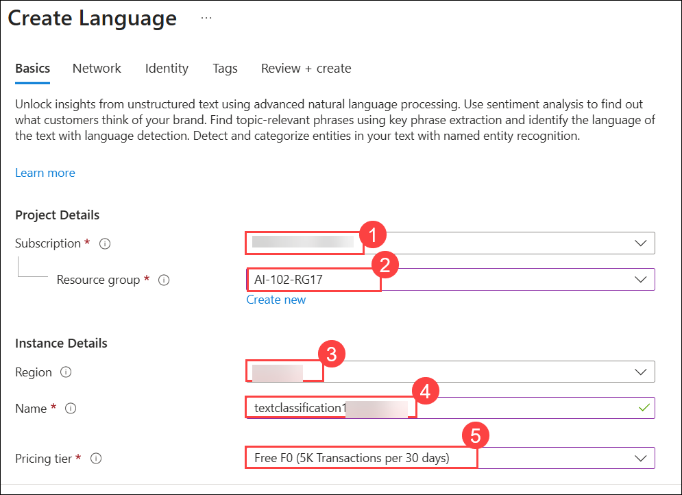   
      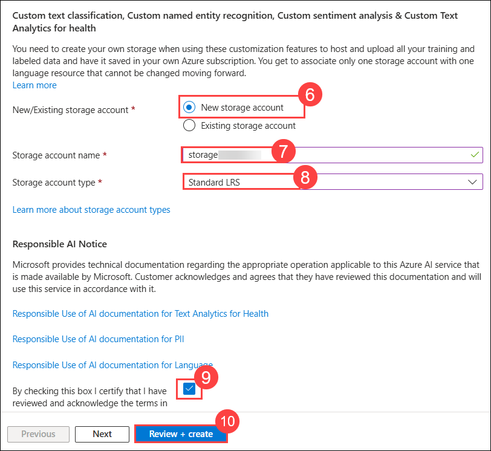 

1. Then select **Create** to provision the resource.  

1. Wait for deployment to complete, and select **Go to resource group** to go to the resource group.

   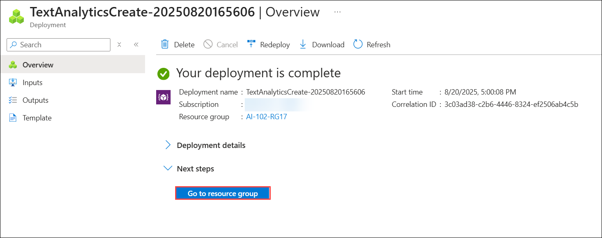

1. Find the storage account **storage<inject key="DeploymentID" enableCopy="false"/>** you created, select it.

   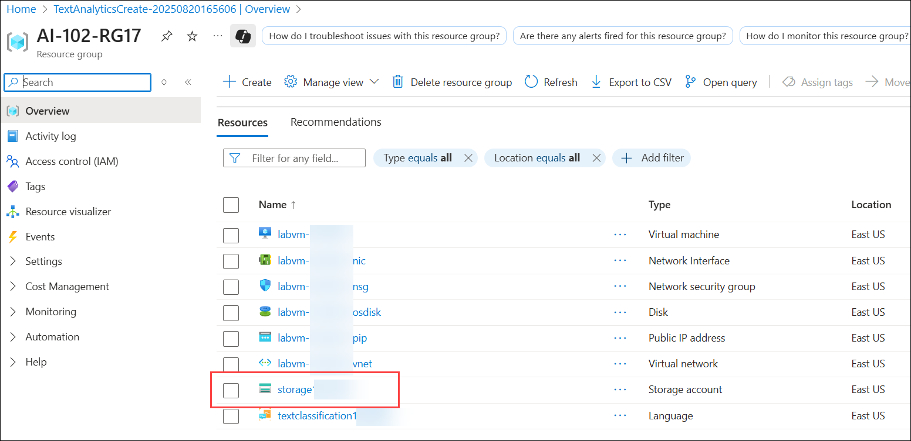

1. Verify the `_Account kind_` is **StorageV2**.

    - If it's **v1**, upgrade your storage account kind on that resource page by following the steps

        - Select **Change**.
   
          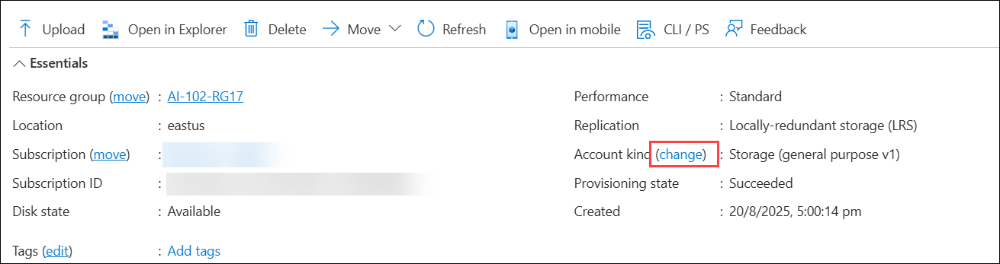  

        - Select the checkbox to confirm that you have understood the implications of upgrading storage account **(1)** and then select **Upgrade (2)**.

          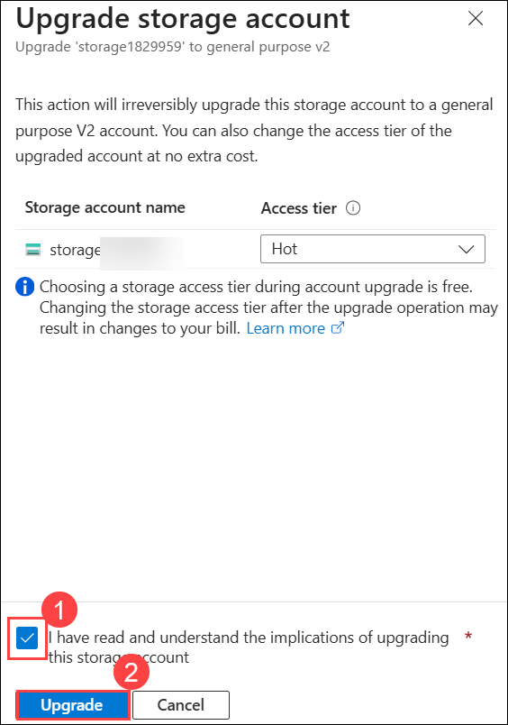      

        - Make sure that  `_Account kind_` is **StorageV2** now. 

          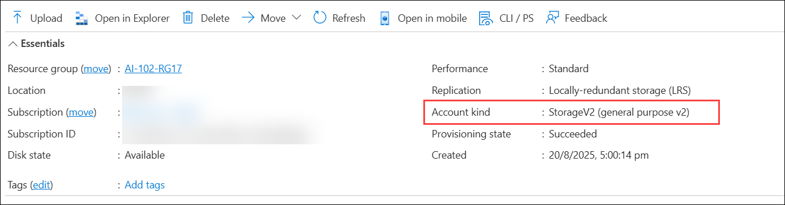  

1. Navigate back to the **AI-102-RG17** Resource group and the select **textclassification<inject key="DeploymentID" enableCopy="false"/>** language service.

   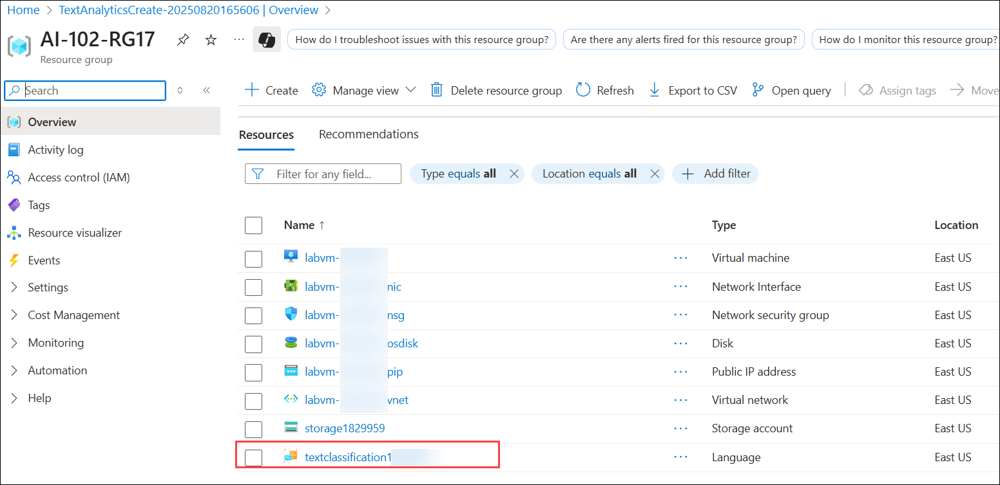

1. Navigate to the **Keys and Endpoint (1)** page in the **Resource Management** section. Copy and paste the **KEY 1 (2)** and **Endpoint (3)**. You will need the information on this page later in the lab.

    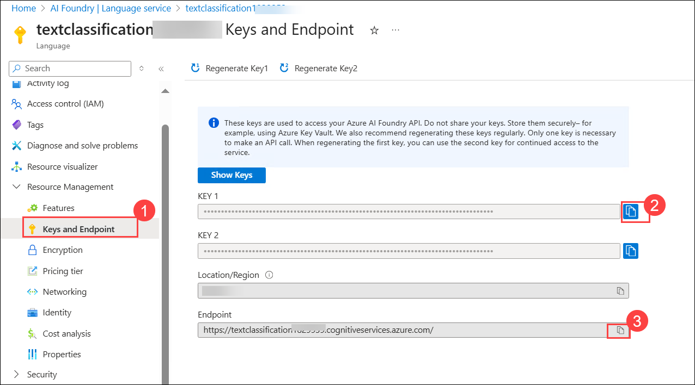 

> **Congratulations** on completing the task! Now, it's time to validate it. Here are the steps:
>
> - Hit the Validate button for the corresponding task. If you receive a success message, you can proceed to the next task.
> - If not, carefully read the error message and retry the step, following the instructions in the lab guide.
> - If you need any assistance, please contact us at cloudlabs-support@spektrasystems.com. We are available 24/7 to help.
 
<validation step="ec3cf71e-8167-42bb-95ed-136627c4cccf" />
 
---     

### Task 2: Upload sample articles

Once you've created the Azure AI Language service and storage account, you'll need to upload example articles to train your model later.

1. Within the JumpVM, in a new browser tab, download sample articles from `https://aka.ms/classification-articles`.

1. Select the **folder** icon.

    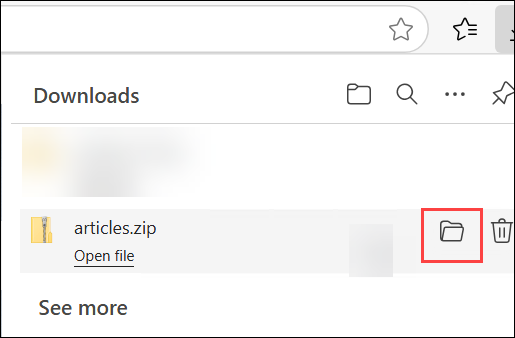

1. Right click on **articles** folder **(1)** and then select **Extract (2)**.  

    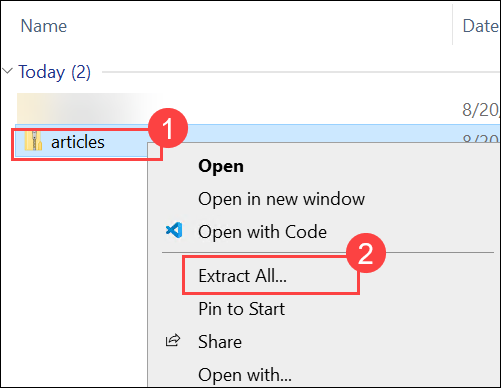

1. Change the destination path to `C:\LabFiles` **(1)** and then click **Extract (2)**.

    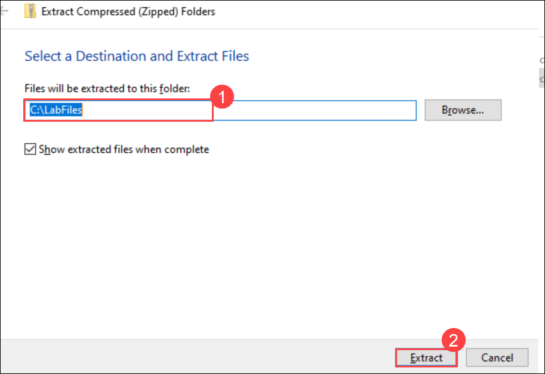

1. In the **Azure portal**, search for **storage account (1)**and select it **(2)**.

    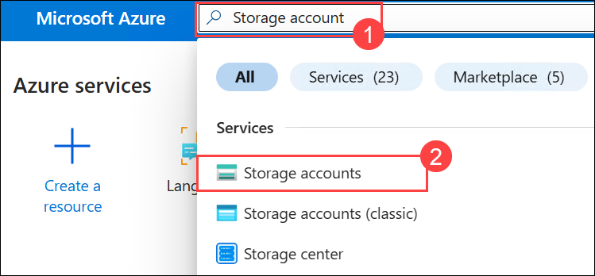

1. Select the storage account **storage<inject key="DeploymentID" enableCopy="false"/>** you created.

    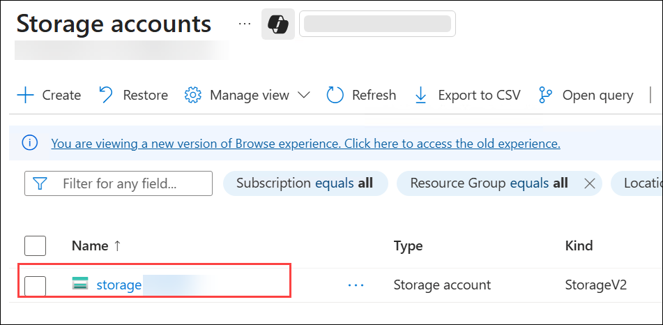

1. In your storage account select **Configuration (1)**, located below **Settings**. In the Configuration screen enable the option to **Allow Blob anonymous access (2)** then select **Save (3)**.

    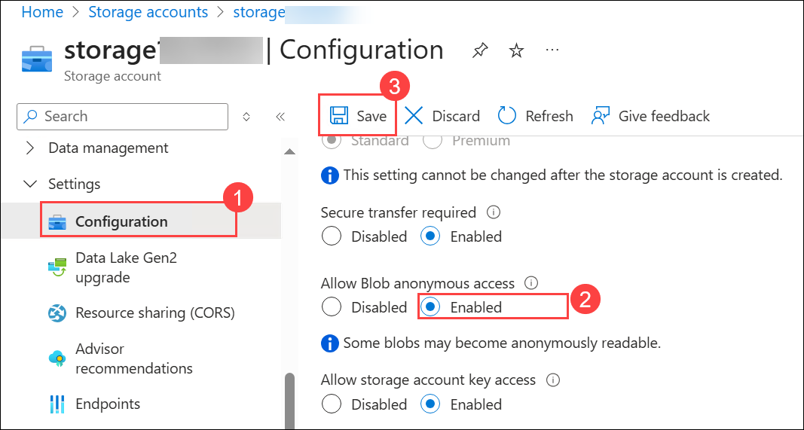

1. Select **Containers (1)** in the left menu, located below **Data storage**. On the screen that appears, select **+ Container (2)**. Give the container the name `articles` **(3)**, and set **Anonymous access level** to **Container (anonymous read access for containers and blobs) (4)** and then **Create (5)**.

    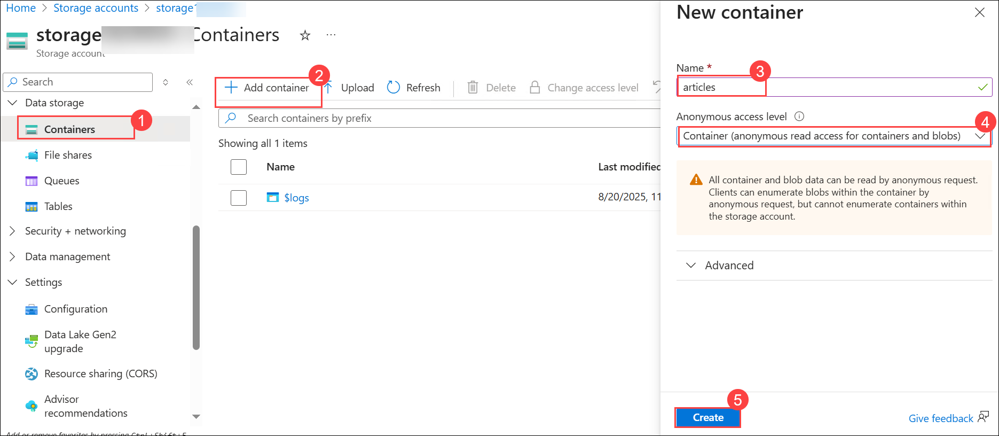

     >**NOTE**: When you configure a storage account for a real solution, be careful to assign the appropriate access level. To learn more about each access level, see the [Azure Storage documentation](https://learn.microsoft.com/azure/storage/blobs/anonymous-read-access-configure).

1. After you've created the container, select **articles** container.

    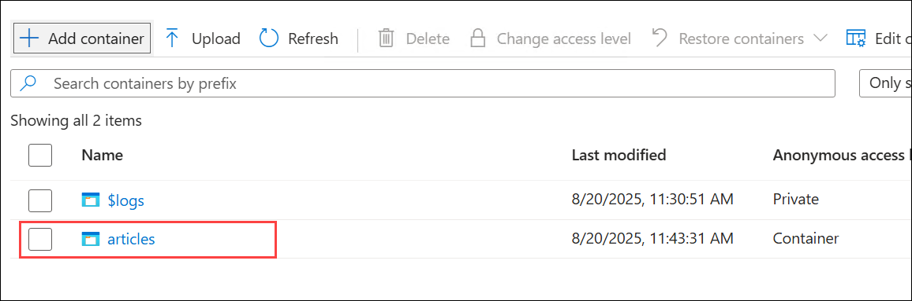

1. Select the **Upload (1)** button. Select **Browse for files (2)** to browse for the sample articles you downloaded. 

    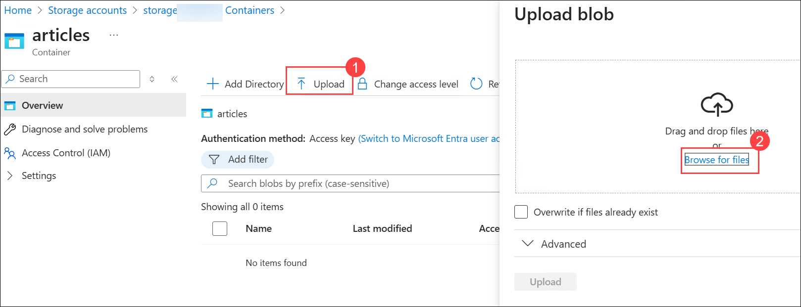

1. Navigate to `C:\LabFiles` **(1)**, click on **Ctrl+A** to select all the files **(2)** and then **Open (3)**.  

    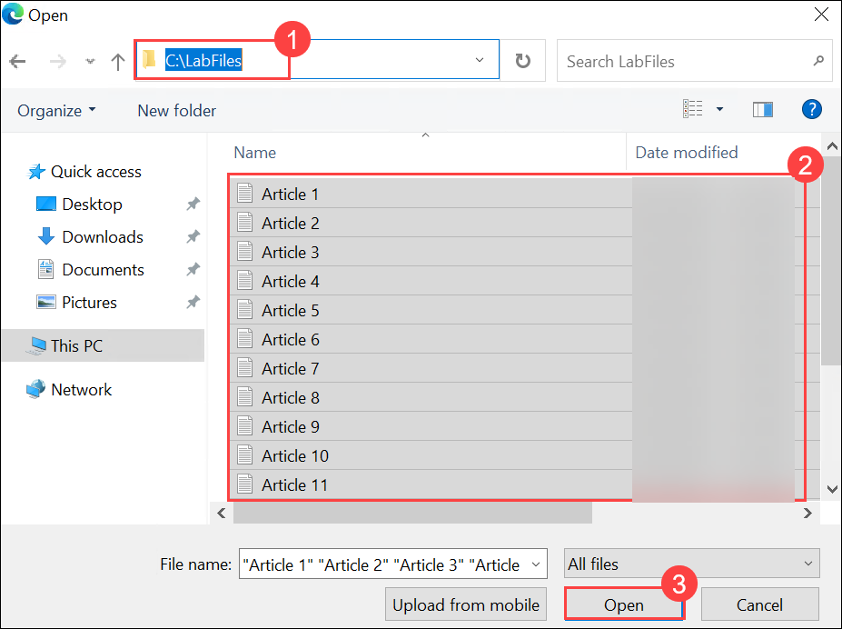

1. Select **Upload**.

    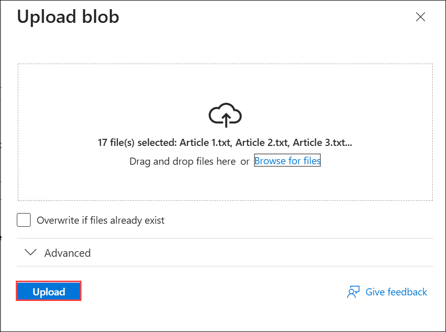

### Task 3: Create a custom text classification project

After configuration is complete, create a custom text classification project. This project provides a working place to build, train, and deploy your model.

> **NOTE**: This lab utilizes **Language Studio**, but you can also create, build, train, and deploy your model through the REST API.

1. In a new browser tab, open the Azure AI Language Studio portal at `https://language.cognitive.azure.com/`.

1. Selelect **Sign in**.

    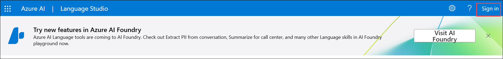 

1. If prompted, provide the credentials below:

    - **Email/Username:** <inject key="AzureAdUserEmail"></inject>

    - **Password:** <inject key="AzureAdUserPassword"></inject>

1. Close the pop ups.

    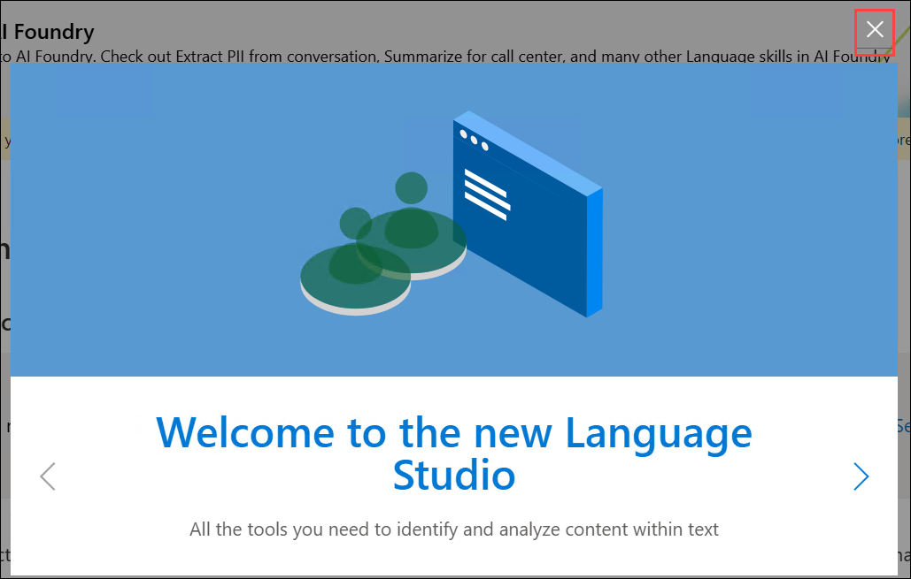 

1. If prompted to choose a Language resource, select the following settings:

    - **Azure Directory**: Default Azure directory containing your subscription **(1)**
    - **Azure subscription**: Your Azure subscription **(2)**
    - **Resource type**: Language **(3)**
    - **Language resource**: The Azure AI Language resource you created previously **textclassification<inject key="DeploymentID" enableCopy="false"/> (4)**
    - Select **Done (5)**

      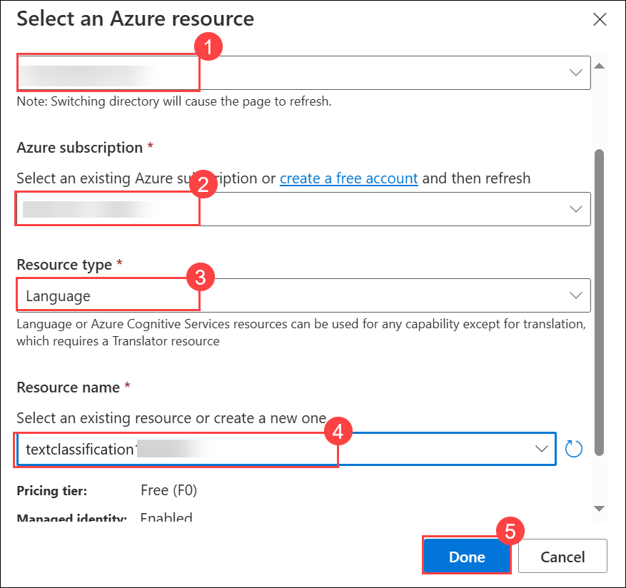     

    If you are <u>not</u> prompted to choose a language resource, it may be because you have multiple Language resources in your subscription; in which case:

    1. On the bar at the top if the page, select the **Settings (&#9881;)** button.
    2. On the **Settings** page, view the **Resources** tab.
    3. Select the language resource you just created, and click **Switch resource**.
    4. At the top of the page, click **Language Studio** to return to the Language Studio home page

1. At the top of the portal, in the **Create new (1)** menu, select **Custom text classification (2)**.

    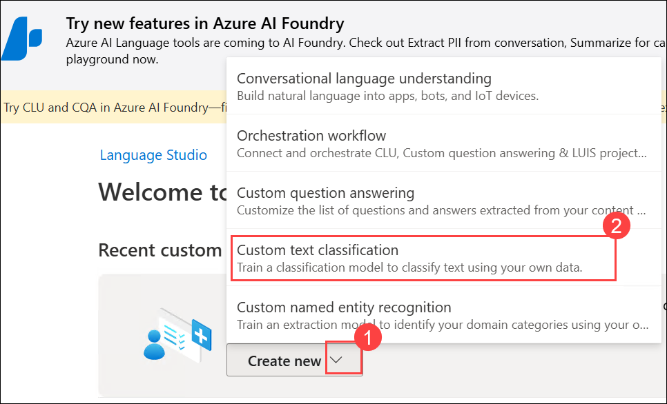 

1. The **Connect storage** page appears. All values will already have been filled. So select **Next**.

    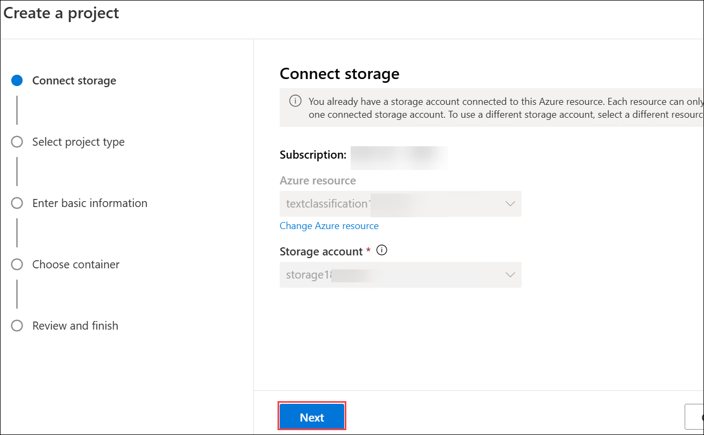 

1. On the **Select project type** page, select **Single label classification (1)**. Then select **Next (2)**.

    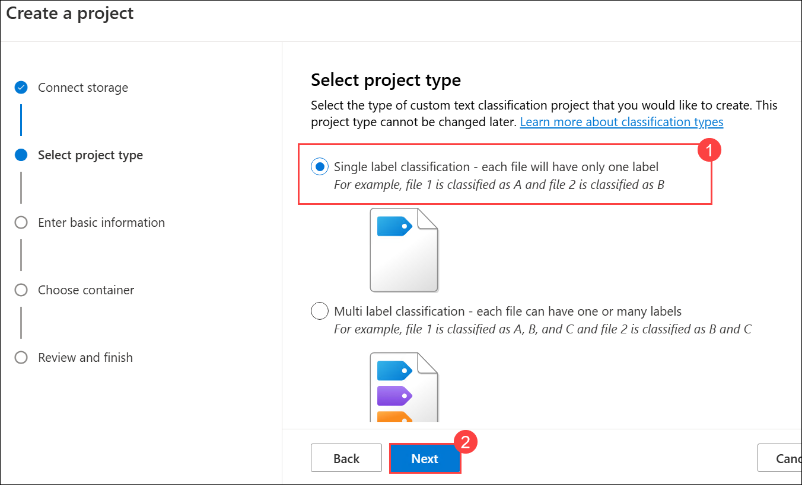 

1. On the **Enter basic information** pane, set the following and then **Next (4)**:

    - Name: `ClassifyLab` **(1)** 
    - Text primary language: English (US) **(2)**
    - Description: `Custom text lab`

      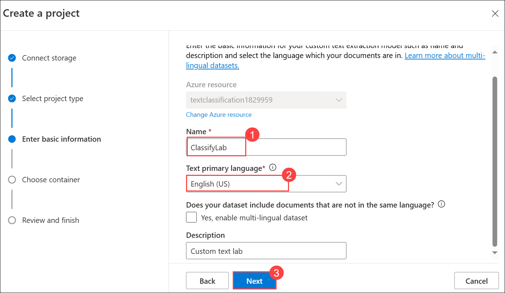   

1. On the **Choose container** page, set the **Blob store container** dropdown to your **articles (1)** container.
    - Select the  **No, I need to label my files as part of this project (2)** option. 
    - Then select **Next (3)**.

      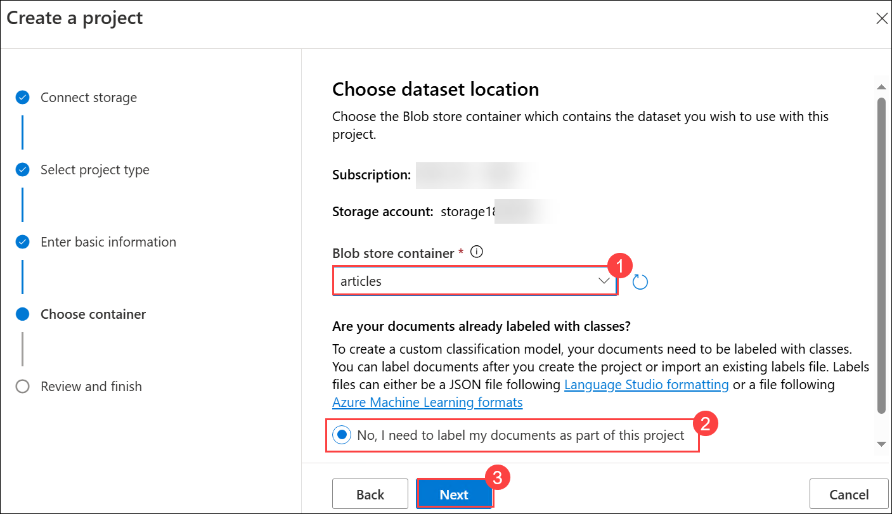 

1. Select **Create project**.

> **Congratulations** on completing the task! Now, it's time to validate it. Here are the steps:
>
> - Hit the Validate button for the corresponding task. If you receive a success message, you can proceed to the next task.
> - If not, carefully read the error message and retry the step, following the instructions in the lab guide.
> - If you need any assistance, please contact us at cloudlabs-support@spektrasystems.com. We are available 24/7 to help.
 
<validation step="eb96f194-63da-4e73-b572-5026853ad24f" />
 
---     

### Task 4: Label your data

Now that your project is created, you need to label, or tag, your data to train your model how to classify text.

1. On the left, select **Data labeling (1)**, if not already selected. You'll see a list of the files you uploaded to your storage account.

1. On the right side, in the **Activity** pane, select **+ Add class (2)**.

    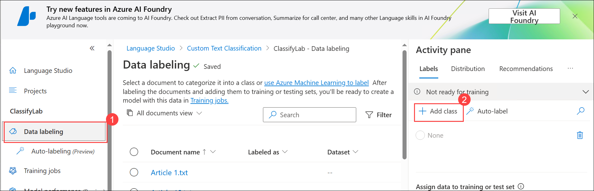 

1. The articles in this lab fall into four classes you'll need to create: `Classifieds`, `Sports`, `News`, and `Entertainment`.

1. Provide the class name as `Classifieds` **(1)** and then **Done (2)**.

    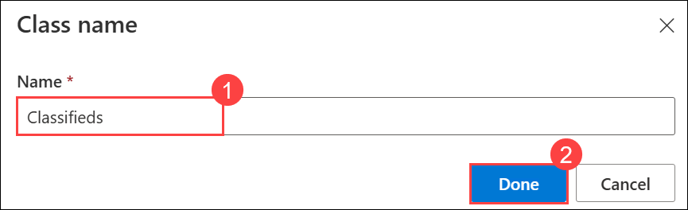 

    - Repeat the same for `Sports`, `News`, and `Entertainment`.   

1. After you've created your four classes, select **Article 1 (1)** to start. *Here you can read the article, define which class this file is, and which dataset (`training` or `testing`) to assign it to*.

1. For the purposes of this lab, we'll define which are to be used for training the model and testing the model. `Please refer this table and` `assign the class and Dataset for each Article`.

    | Article  | Class  | Dataset  |
    |---------|---------|---------|
    | Article 1 | Sports | Training |
    | Article 10 | News | Training |
    | Article 11 | Entertainment | Testing |
    | Article 12 | News | Testing |
    | Article 13 | Sports | Testing |
    | Article 2 | Sports | Training |
    | Article 3 | Classifieds | Training |
    | Article 4 | Classifieds | Training |
    | Article 5 | Entertainment | Training |
    | Article 6 | Entertainment | Training |
    | Article 7 | News | Training |
    | Article 8 | News | Training |
    | Article 9 | Entertainment | Training |

1. Select **Article 1 (1)** to start Assign each article the appropriate class and dataset (training or testing) using the **Activity** pane on the right **(2)**.

    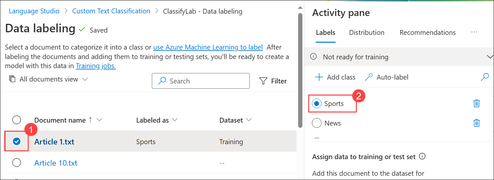 

1. To change the Articles dataset from **Training** to **Testing**. follow the below steps:

    - Select **Article 11.txt** **(1)**, select the label as **Entertainment (2)**. Click on **Training (3)** from the dataset and then select **Testing the models performance (4)**

      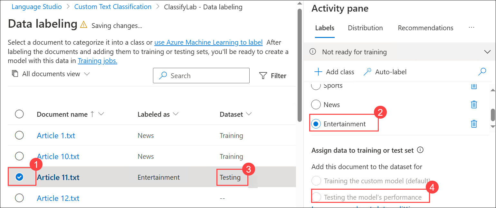    
 
1. You  select **Next** to move to the next document.
  
    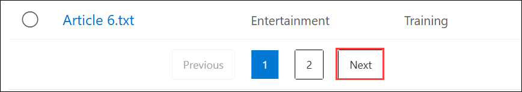         

     >**NOTE**: Files in Language Studio are listed alphabetically, which is why the above list is not in sequential order. Make sure you visit both pages of documents when labeling your articles.

1. Select **Save labels** to save your labels.

    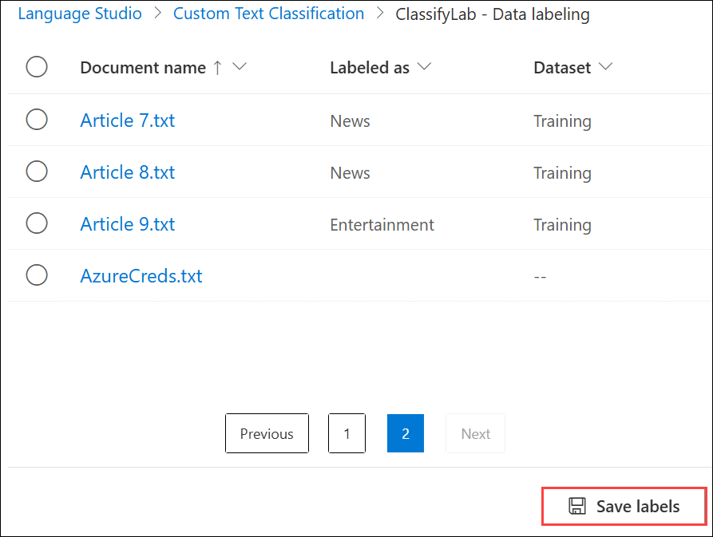    

### Task 5: Train your model

After you've labeled your data, you need to train your model.

1. Select **Training jobs (1)** on the left side menu. Select **Start a training job (2)**.

    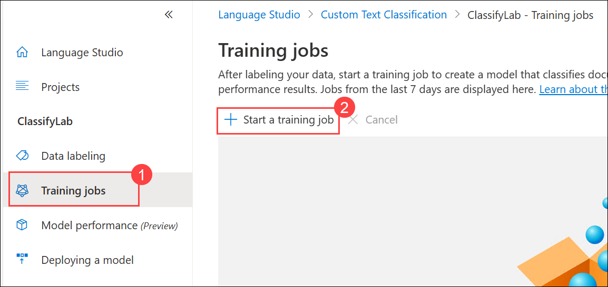

1. Train a new model named `ClassifyArticles` **(1)**. Select **Use a manual split of training and testing data (2)**. and then select **Train (3)**

    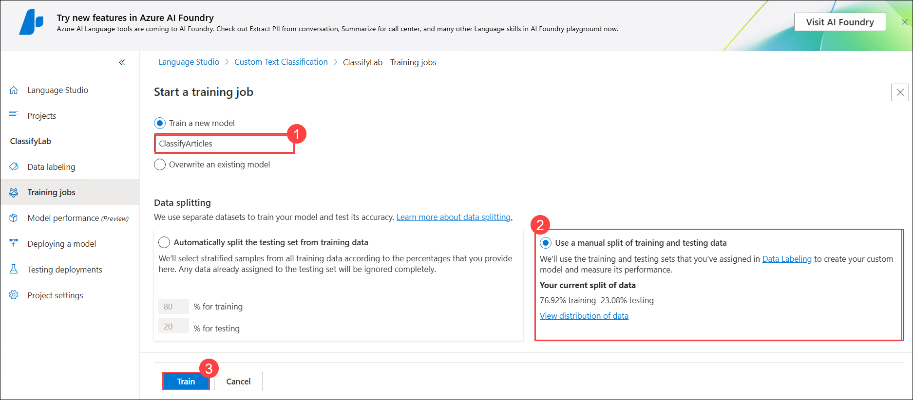

     >**TIP**: In your own classification projects, the Azure AI Language service will automatically split the testing set by percentage which is useful with a large dataset. With smaller datasets, it's important to train with the right class distribution.

1. Training your model can sometimes take several minutes. You'll get a notification when it's complete.

    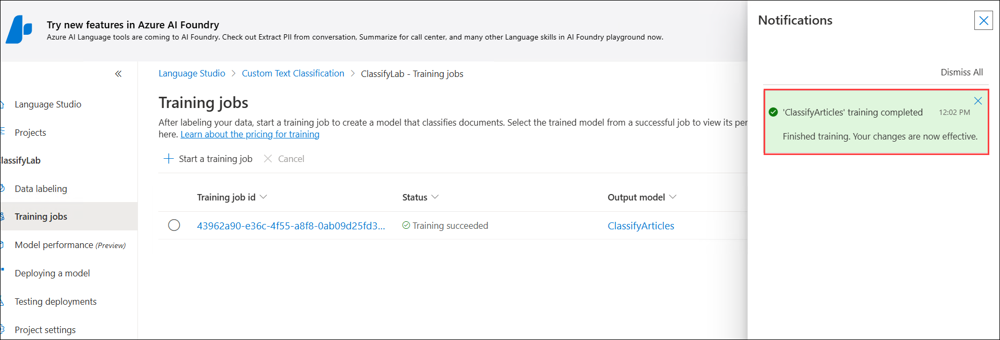


### Task 6: Evaluate your model

In real world applications of text classification, it's important to evaluate and improve your model to verify it's performing as you expect.

1. Select **Model performance**, and select your **ClassifyArticles** model. 

    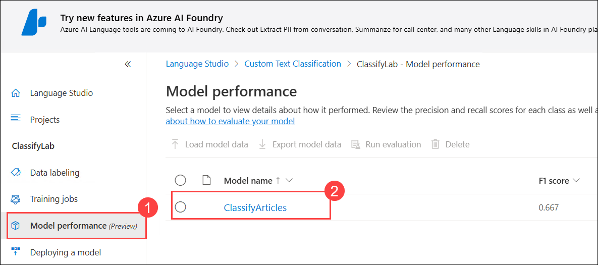

1. There you can see the scoring of your model, performance metrics, and when it was trained. If the scoring of your model isn't 100%, it means that one of the documents used for testing didn't evaluate to what it was labeled. These failures can help you understand where to improve.

    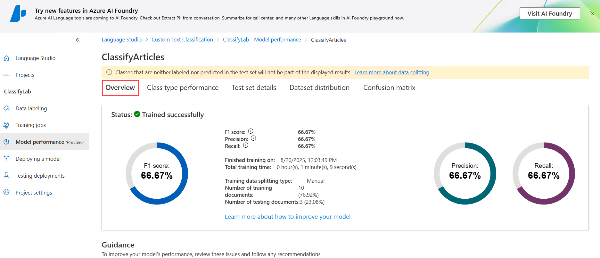

1. Select **Test set details** tab. If there are any errors, this tab allows you to see the articles you indicated for testing and what the model predicted them as and whether that conflicts with their test label. The tab defaults to show incorrect predictions only. You can toggle the **Show mismatches only** option to see all the articles you indicated for testing and what they each of them predicted as.

    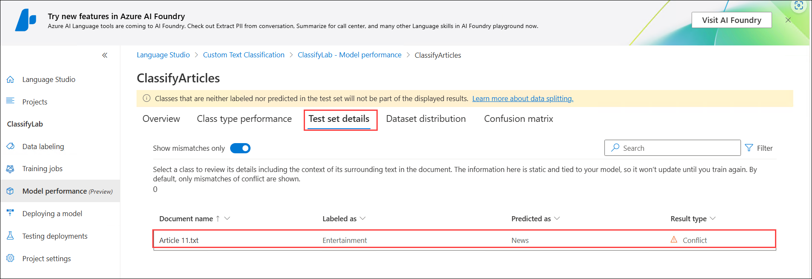

### Task 7: Deploy your model

When you're satisfied with the training of your model, it's time to deploy it, which allows you to start classifying text through the API.

1. On the left panel, select **Deploying model (1)**.
    - Select **Add deployment (2)**
    - Then enter `articles` **(3)** in the **Create a new deployment name** field
    - Select **ClassifyArticles (4)** in the **Model** field.
    - Select **Deploy (5)** to deploy your model.

      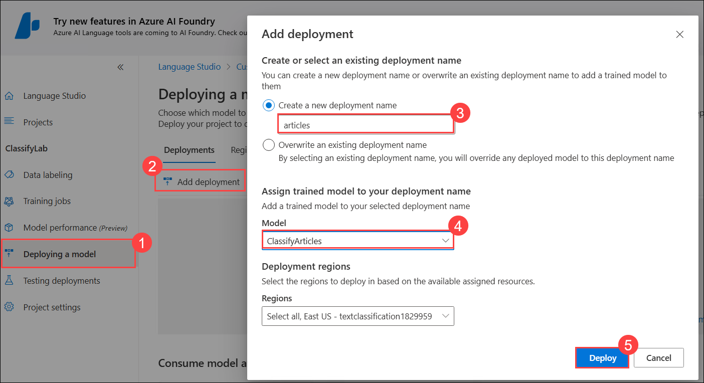

1. Once your model is deployed, leave that page open. You'll need your `project and deployment name` in the next step.

### Task 8: Prepare to develop an app in Cloud Shell

1. Navigate to [Azure portal](https://portal.azure.com/).

1. If prompted, provide the credentials below:
    
    - **Email/Username:** <inject key="AzureAdUserEmail"></inject>

    - **Password:** <inject key="AzureAdUserPassword"></inject>

1. Use the **[>_]** button to the right of the search bar at the top of the page to create a new **Cloud Shell** in the Azure portal.

     

1. Selecting a **PowerShell** environment.

     

1. On the **Getting started** page,

    - Select **No storage account required (1)** 
    - Select your subscription **(2)**
    - Click on **Apply (3)**

       

1. In the cloud shell toolbar, in the **Settings (1)** menu, select **Go to Classic version (2)** (this is required to use the code editor).

    

     >**Note**: The cloud shell provides a command-line interface in a pane at the bottom of the Azure portal. You can resize or maximize this pane to make it easier to work in.

     >**Note**: Ensure you've switched to the classic version of the cloud shell before continuing.

1. In the PowerShell pane, enter the following commands to clone the GitHub repo for this exercise:

    ```
   rm -r mslearn-ai-language -f
   git clone https://github.com/microsoftlearning/mslearn-ai-language
    ```

     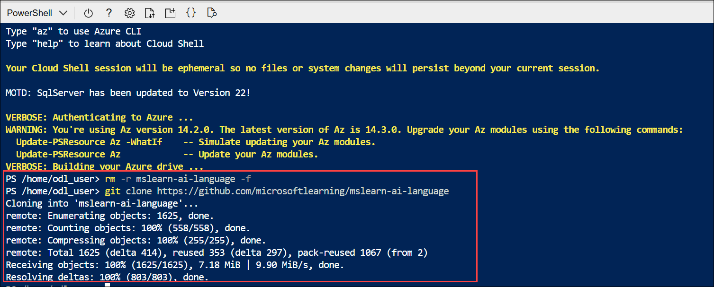    

      >**Tip**: As you paste commands into the cloudshell, the ouput may take up a large amount of the screen buffer. You can clear the screen by entering the `cls` command to make it easier to focus on each task.

1. After the repo has been cloned, navigate to the folder containing the application code files:  

    ```
   cd mslearn-ai-language/Labfiles/04-text-classification/Python/classify-text
    ```

### Task 9: Configure your application

1. In the command line pane, run the following command to view the code files in the **classify-text** folder:

    ```
   ls -a -l
    ```

     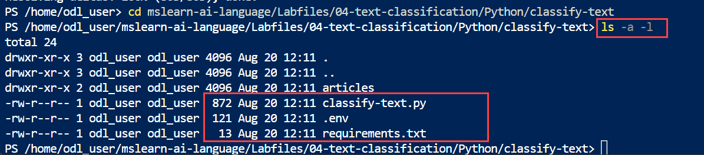        

     The files include a configuration file (**.env**) and a code file (**classify-text.py**). The text your application will analyze is in the **articles** subfolder.

1. Create a Python virtual environment and install the Azure AI Language Text Analytics SDK package and other required packages by running the following command:

    ```
   python -m venv labenv
   ./labenv/bin/Activate.ps1
   pip install -r requirements.txt azure-ai-textanalytics==5.3.0
    ```

1. Enter the following command to edit the application configuration file:

    ```
   code .env
    ```

     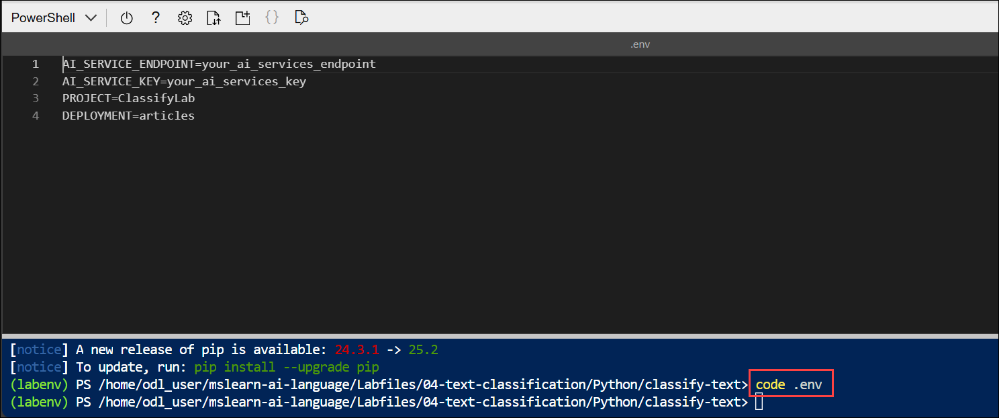      

     The file is opened in a code editor.

1. Update the configuration values to include the  **endpoint (1)** and a **key (2)** from the Azure Language resource you created (available on the **Keys and Endpoint** page for your Azure AI Language resource in the Azure portal that you have copied in `Task 1`).The file should already contain the `project and deployment names` for your text classification model.

     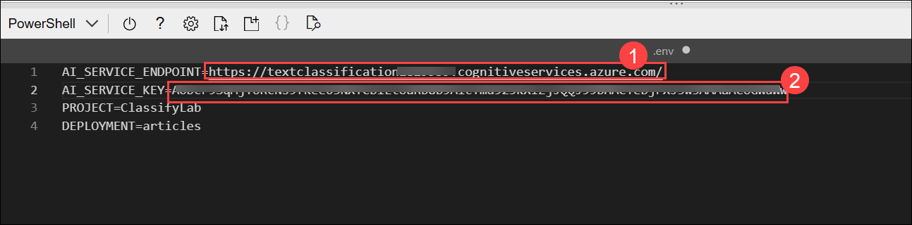 

1. After you've replaced the placeholders, within the code editor, use the **CTRL+S** command or **Right-click > Save** to save your changes and then use the **CTRL+Q** command or **Right-click > Quit** to close the code editor while keeping the cloud shell command line open.

### Task 10: Add code to classify documents

1. Enter the following command to edit the application code file:

    ```
    code classify-text.py
    ```

1. Review the existing code. You will add code to work with the AI Language Text Analytics SDK.

    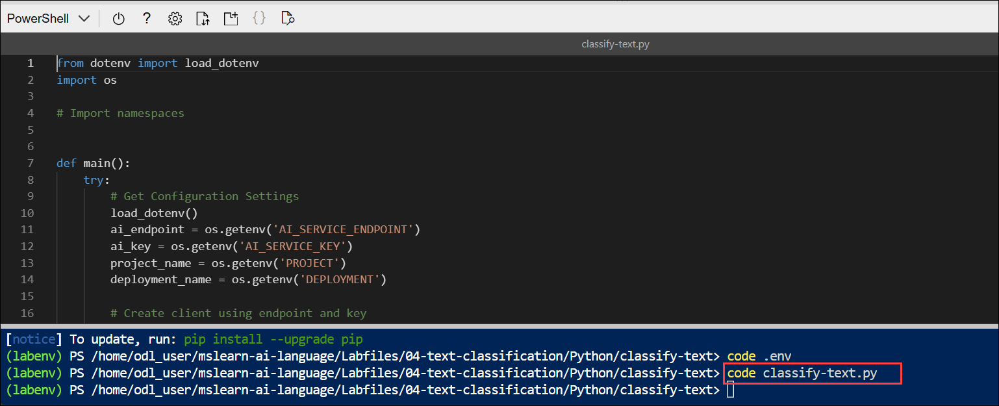   
     
     >**Tip**: As you add code to the code file, be sure to maintain the correct indentation.

1. At the top of the code file, under the existing namespace references, find the comment **Import namespaces** and add the following code to import the namespaces you will need to use the Text Analytics SDK:

    ```python
    # import namespaces
    from azure.core.credentials import AzureKeyCredential
    from azure.ai.textanalytics import TextAnalyticsClient
    ```

    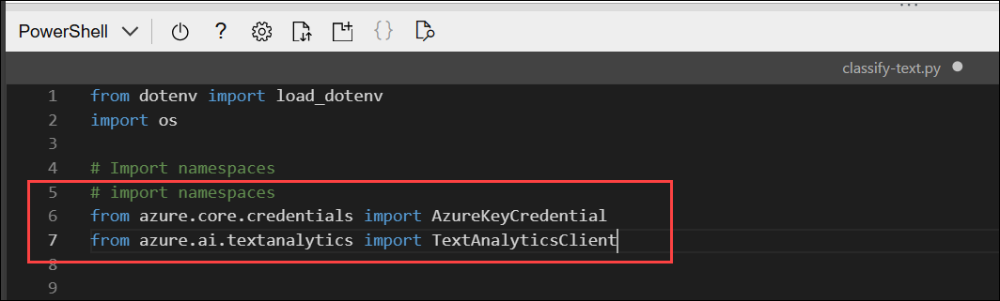

---

1. In the **main** function, note that code to load the Azure AI Language service endpoint and key and the project and deployment names from the configuration file has already been provided. Then find the comment **Create client using endpoint and key**, and add the following code to create a text analysis client:

    ```python
    # Create client using endpoint and key
    credential = AzureKeyCredential(ai_key)
    ai_client = TextAnalyticsClient(endpoint=ai_endpoint, credential=credential)
    ```

    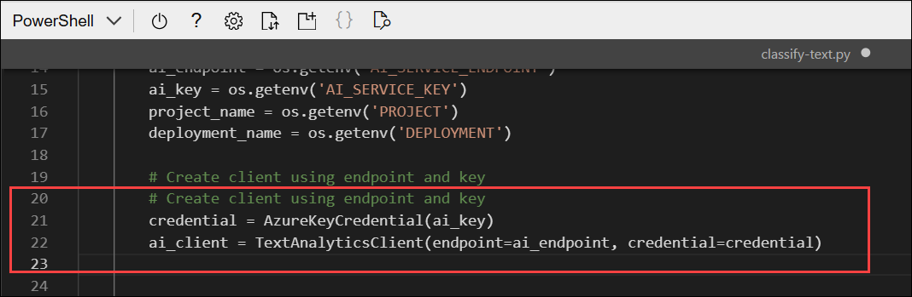

---

1. Note that the existing code reads all of the files in the **articles** folder and creates a list containing their contents. Then find the comment **Get Classifications** and add the following code:

    ```python
    # Get Classifications
    operation = ai_client.begin_single_label_classify(
        batchedDocuments,
        project_name=project_name,
        deployment_name=deployment_name
    )

    document_results = operation.result()

    for doc, classification_result in zip(files, document_results):
        if classification_result.kind == "CustomDocumentClassification":
            classification = classification_result.classifications[0]
            print("{} was classified as '{}' with confidence score {}.".format(
                doc, classification.category, classification.confidence_score)
            )
        elif classification_result.is_error is True:
            print("{} has an error with code '{}' and message '{}'".format(
                doc, classification_result.error.code, classification_result.error.message)
            )
    ```

    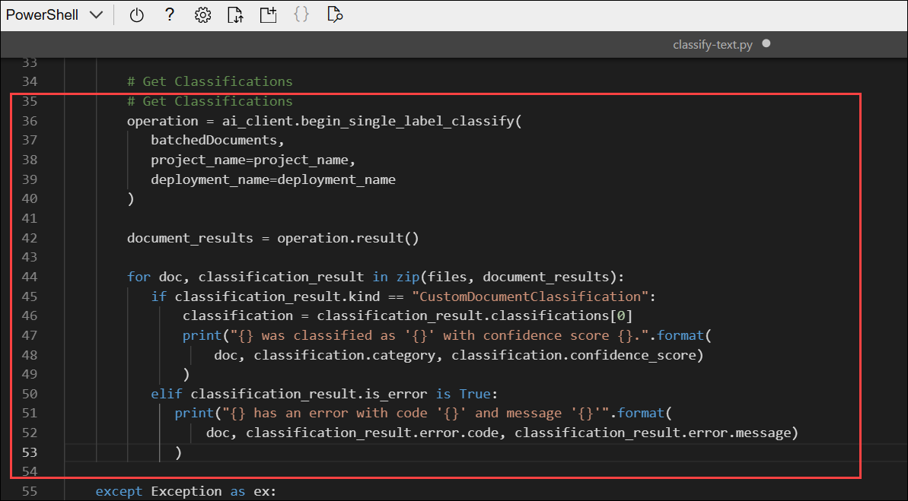


1. At the top of the code file, under the existing namespace references, find the comment **Import namespaces** and add the following code to import the namespaces you will need to use the Text Analytics SDK:

    ```python
   # import namespaces
   from azure.core.credentials import AzureKeyCredential
   from azure.ai.textanalytics import TextAnalyticsClient
    ```

        

1. In the **main** function, note that code to load the Azure AI Language service endpoint and key and the project and deployment names from the configuration file has already been provided. Then find the comment **Create client using endpoint and key**, and add the following code to create a text analysis client:

    ```Python
   # Create client using endpoint and key
   credential = AzureKeyCredential(ai_key)
   ai_client = TextAnalyticsClient(endpoint=ai_endpoint, credential=credential)
    ```

      

1. Note that the existing code reads all of the files in the **articles** folder and creates a list containing their contents. Then find the comment **Get Classifications** and add the following code:

   ```Python
   # Get Classifications
   operation = ai_client.begin_single_label_classify(
        batchedDocuments,
        project_name=project_name,
        deployment_name=deployment_name
   )

   document_results = operation.result()

   for doc, classification_result in zip(files, document_results):
        if classification_result.kind == "CustomDocumentClassification":
            classification = classification_result.classifications[0]
            print("{} was classified as '{}' with confidence score {}.".format(
                doc, classification.category, classification.confidence_score)
            )
        elif classification_result.is_error is True:
            print("{} has an error with code '{}' and message '{}'".format(
                doc, classification_result.error.code, classification_result.error.message)
            )
   ```

        
     
      >**Tip**: As you add code to the code file, be sure to maintain the correct indentation.    

1. Save your changes using (**CTRL+S**).

1. Then enter the following command to run the program (you maximize the cloud shell pane and resize the panels to see more text in the command line pane):

    ```
   python classify-text.py
    ```

1. Observe the output. The application should list a `classification and confidence` score for each text file.

     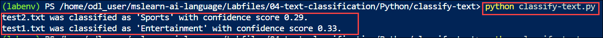  

1. This output shows:

    - The contents of `test1.txt` looked most like the **Entertainment** category to the model.

    - The contents of `test2.txt` looked most like the **Sports** category to the model.       

1. If you want, you can open them yourself in Cloud Shell by running the following commands:

    ```
   code articles/test1.txt
    ```

     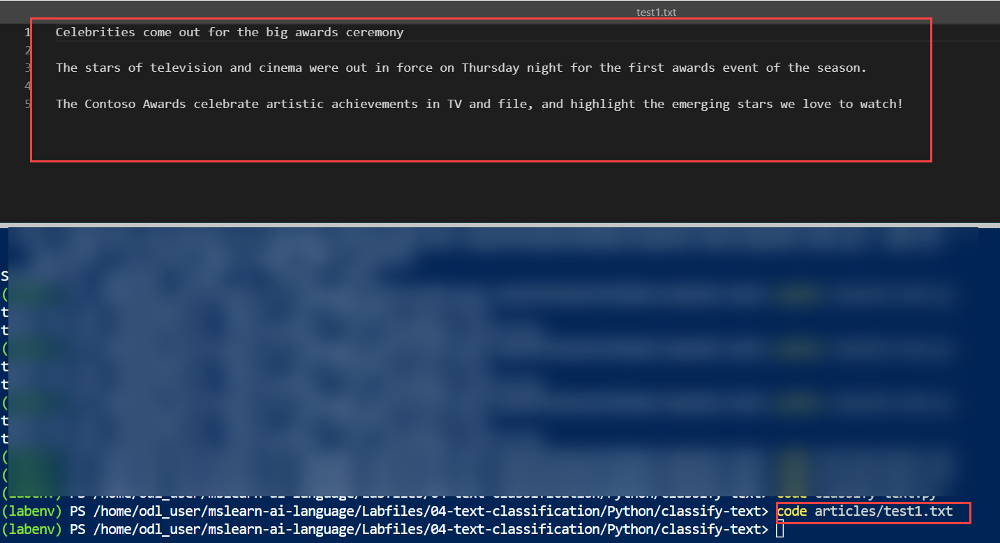  

    ```
   code articles/test2.txt
    ```    

     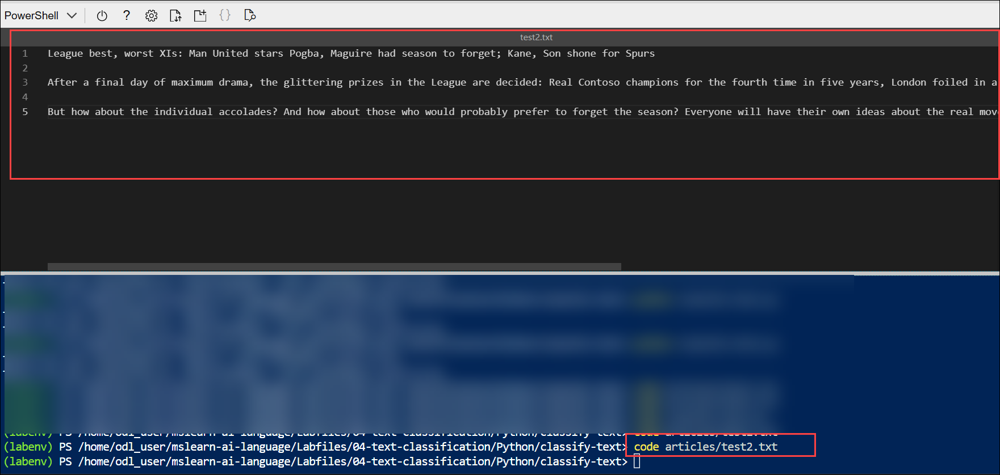       
