# Lab 18: Analyze text

### Estimated Duration: 60 Minutes

## Overview

In this lab, you will build and configure a text analysis application using Azure AI Language services in the Microsoft Foundry environment. You will create a project, set up a Python-based application, and connect it to the Azure AI Language API. Using this application, you will analyze review text to detect language, evaluate sentiment, extract key phrases, and identify entities and linked entities. Finally, you will run and test the application to gain insights from unstructured text data.

## Lab Objectives

- **Task 1:** Create a Microsoft Foundry project

- **Task 2:** Get the application files from GitHub

- **Task 3:** Configure your application

- **Task 4:** Add code to connect to your Azure AI Language resource

## Task 1: Create a Microsoft Foundry project

In this task, you will create a new project in the Microsoft Foundry portal and set up its configuration.

1. Open a new tab in the browser, right-click on the following link [Foundry portal](https://ai.azure.com), then **Copy link** and paste it in a browser tab to log in to **Microsoft Foundry portal**.

1. Click on **Sign in**.
 
    

1. If prompted, provide the credentials below:
 
   - **Email/Username:** <inject key="AzureAdUserEmail"></inject>
    
     

   - **Password:** <inject key="AzureAdUserPassword"></inject>
    
     

1. When the **Stay signed in?** window appears, select **No**.

    
    
    >**Note:** Close any tips or quick start panes that are opened the first time you sign in, and if necessary use the **Foundry** logo at the top left to navigate to the home page, which looks similar to the following image (close the **Help** pane if it's open):

1. At the top of the **Microsoft Foundry** portal, enable the **New Foundry toggle (1)** to switch to the latest Foundry user interface.

1. From the **Select a project to continue** dialog, click the drop-down under **Select or search for a project**, and then select **Create a new project (2)**.

     

1. In the **Create a project** window, enter **Myproject<inject key="DeploymentID" enableCopy="false"/> (1)** as the project name. Open the **Advanced options (2)** drop-down, fill in the following details, and then click **Create (6)**:

    * Subscription: **Choose Default Subscription (3)**
    * Resource group: **AI-102-RG18 (4)**
    * Microsoft Foundry resource: **Keep as Default**
    * Region: **<inject key="Region" enableCopy="false" /> (5)**

      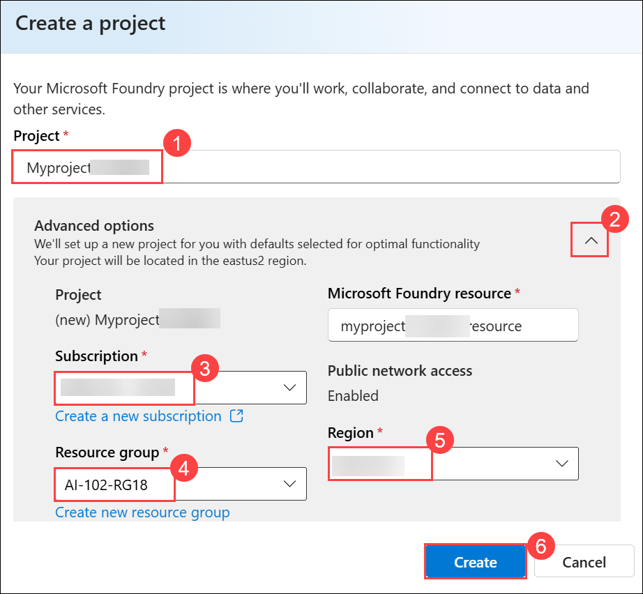

      >**Note:** Some Azure AI resources are constrained by regional model quotas. In the event of a quota limit being exceeded later in the exercise, there's a possibility you may need to create another resource in a different region.

1. Wait for your project to be created. It may take around 1-2 minutes.

1. If you see the **“Welcome to the new Microsoft Foundry”** window, you can either explore the information using **Next**, or close it by selecting the **X** in the top-right corner to continue.

    

1. On the home page for your project, copy the **Project API key (1)** and **Project endpoint (2)** values, and save them in a notepad for later use.

     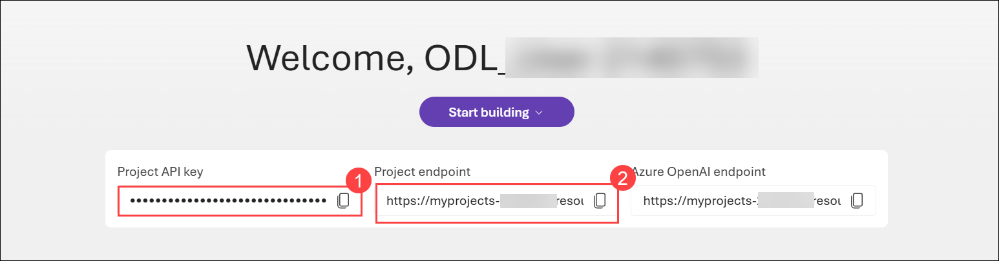

> **Congratulations** on completing the task! Now, it's time to validate it. Here are the steps:
>
> - Hit the Validate button for the corresponding task. If you receive a success message, you can proceed to the next task.
> - If not, carefully read the error message and retry the step, following the instructions in the lab guide.
> - If you need any assistance, please contact us at cloudlabs-support@spektrasystems.com. We are available 24/7 to help.
 
<validation step="ac25e0d3-08ca-4ac9-acde-e4b90b3882a9" />

## Task 2: Get the application files from GitHub

In this task, you will clone the provided GitHub repository and open the application files in Visual Studio Code.

1. Open the **Visual Studio Code** from the desktop.

    

1. In Visual Studio Code, select **Extensions (1)** from the left pane, search for **Python (2)**, choose the **Python (3)** extension by Microsoft, and then click **Install (4)**.

   

1. Navigate to the **Welcome** page in VS Code by selecting the ellipsis **(...) (1)** from the top bar, then **Help (2)**, and finally **Welcome (3)**.

    

1. On the **Get Started** page, select **Mark Done** to complete this step and proceed.

    

1. Select **Clone Git Repository... (1)**, paste the repository URL **(2)** `https://github.com/microsoftlearning/mslearn-ai-language`, and then choose **Clone from URL (3)** to proceed.

    

1. Select the destination folder **C:\LabFiles (1)** and click **Select as Repository Destination (2)** to proceed.

    

1. When prompted, select **Open** to open the cloned repository.

    

1. In the trust prompt, select **Yes, I trust the authors (1)** to continue.

   

1. After the repo has been cloned, in the Explorer pane, navigate **Labfiles (1)** folder containing the application code files at **01-analyze-text/Python/text-analysis**. The application files include:

    - **reviews** (a subfolder containing the review documents)
    - **.env** (the application configuration file)
    - **requirements.txt** (the Python package dependencies that need to be installed)
    - **text-analysis.py** (the code file for the application)

        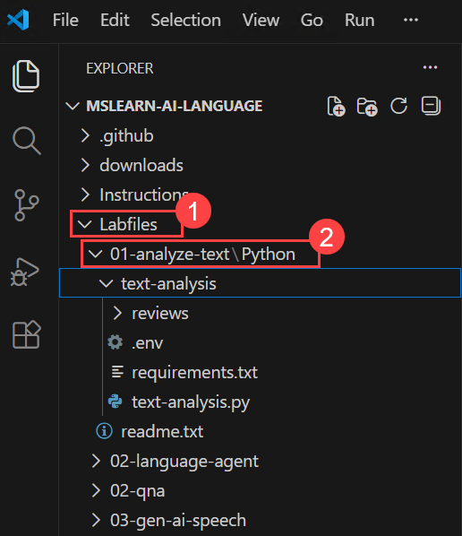

## Task 3: Configure your application

In this task, you will set up the Python environment, install dependencies, and configure the application with the Foundry endpoint.

1. Right-click on the **requirements.txt (1)** file and select **Open in Integrated Terminal (2)**.

    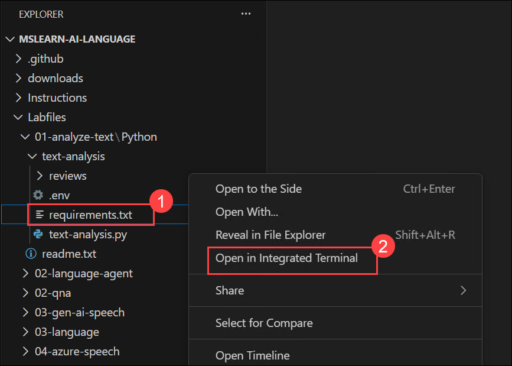

1. In the terminal, enter the following command to install the required Python packages in a virtual environment:

    ```
    python -m venv labenv
    .\labenv\Scripts\Activate.ps1
    pip install -r requirements.txt
    ```

1. In the **Explorer** pane, in the **text-analysis** folder, select the **.env (1)** file to open it. Paste the copied project endpoint into the **Foundry_ENDPOINT (2)** field Make sure to **remove `/api/projects/<project-name>` from the endpoint** and keep only the base URL up to `.com`.

    > **Important:** Modify the pasted endpoint to remove the "/api/projects/{project_name}" suffix - the endpoint should be *https://{your-foundry-resource-name}.services.ai.azure.com*.

1. Copy the following line and paste it into the **.env** file, then replace the placeholder with your API key **(3)**. Press **Ctrl+S** to save the changes:

    ```
    FOUNDRY_KEY=your_api_key_here
    ```

    Replace `your_api_key_here` with the API key you copied in Task 1.

    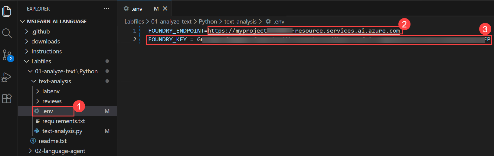

## Task 4: Add code to connect to your Azure AI Language resource

In this task, you connect the application to Azure AI Language services by adding required SDK imports and client configuration.

> **Tip:** As you add code, be sure to maintain the correct indentation. Use the existing comments as a guide, entering the new code at the same level of indentation.

1. In the **Explorer** pane, in the **text-analysis** folder,  open the **text-analysis.py** file.

    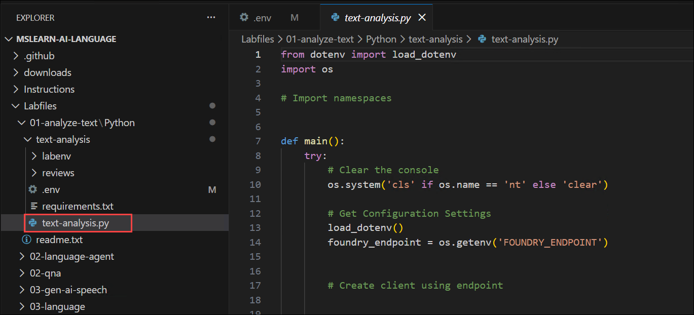

1. Review the existing code. You will add code to work with the Azure Language Text Analytics SDK.

    > **Tip:** As you add code to the code file, be sure to maintain the correct indentation.

1. At the top of the code file, under the existing namespace references, find the comment **Import namespaces** and add the following code to import the namespaces you will need to use the Text Analytics SDK:

    ```python
   # import namespaces
   from azure.core.credentials import AzureKeyCredential
   from azure.ai.textanalytics import TextAnalyticsClient
    ```

    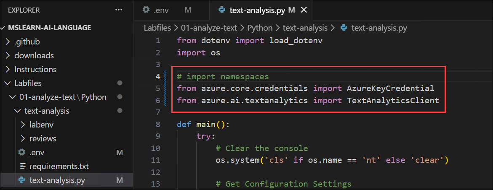

1. In the **main** function find the comment **Get Configuration Settings**, note that code to load the endpoint from the configuration file has already been provided and add the following code to load key.

    ```python
    # Get Configuration Settings
    foundry_key = os.getenv('FOUNDRY_KEY')
    ```

    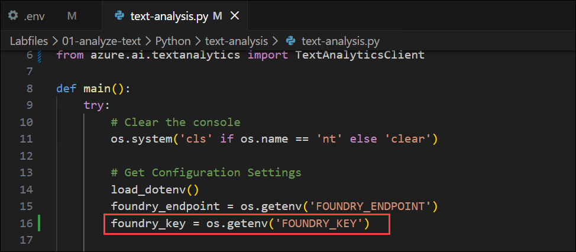

1. In the **main** function, find the comment **Create client using endpoint**, and add the following code to create a client for the Text Analysis API:

    ```Python
   # Create client using endpoint
   credential = AzureKeyCredential(foundry_key)
   ai_client = TextAnalyticsClient(endpoint=foundry_endpoint, credential=credential)
    ```

    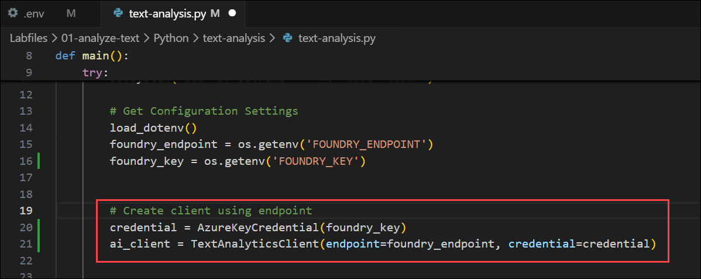

1. Save the changes (**CTRL+S**) to the code file. Then, in the terminal pane, use the following command to sign into Azure.

    ```powershell
    az login
    ```

    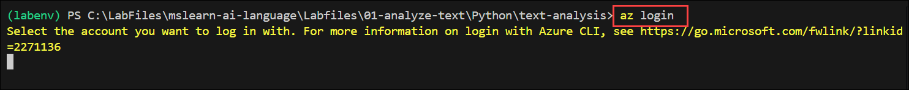

    >**Note:** If you have closed the terminal, right-click on the **01-analyze-text\Python** folder and select **Open in Integrated Terminal**. Then run the command `.\labenv\Scripts\Activate.ps1` to activate the virtual environment before proceeding.

     > **Note:** Minimize the VS Code to see the **Sign in** window.

1. In the sign-in window, select **Work or school account (1)** and click **Continue (2)** to proceed with authentication.

    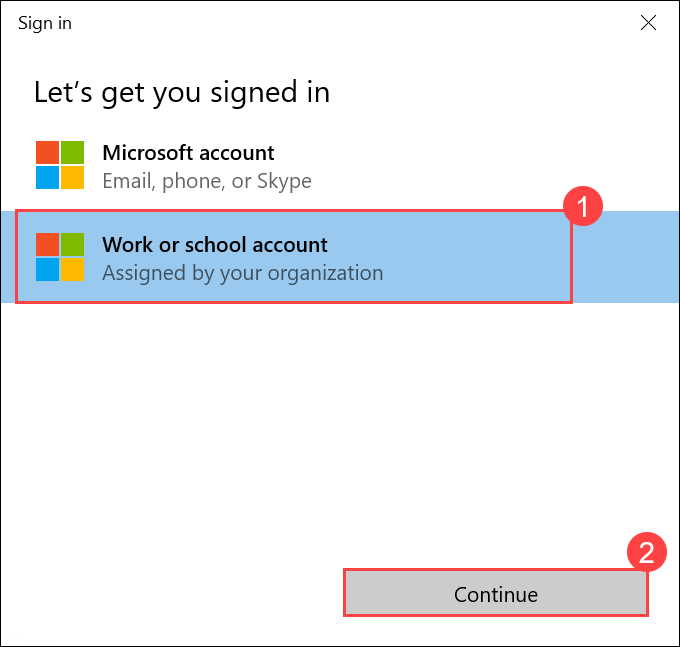

1. On the **Sign in** page, provide the credentials below:
 
   - **Email/Username:** <inject key="AzureAdUserEmail"></inject>
    
     

   - **Password:** <inject key="AzureAdUserPassword"></inject>
    
     

1. On the **Sign in to all apps, websites, and services on this device?** page, select **Yes**.

   

1. On the **Account added to this device** page, select **Done**.

   

1. After you have signed in, enter the following command to run the application:

    ```
   python text-analysis.py
    ```

1. Observe the output as the code should run without error, displaying the contents of each review text file in the **reviews** folder. The application successfully creates a client for the Text Analytics API but doesn't make use of it. We'll fix that in the next section.

    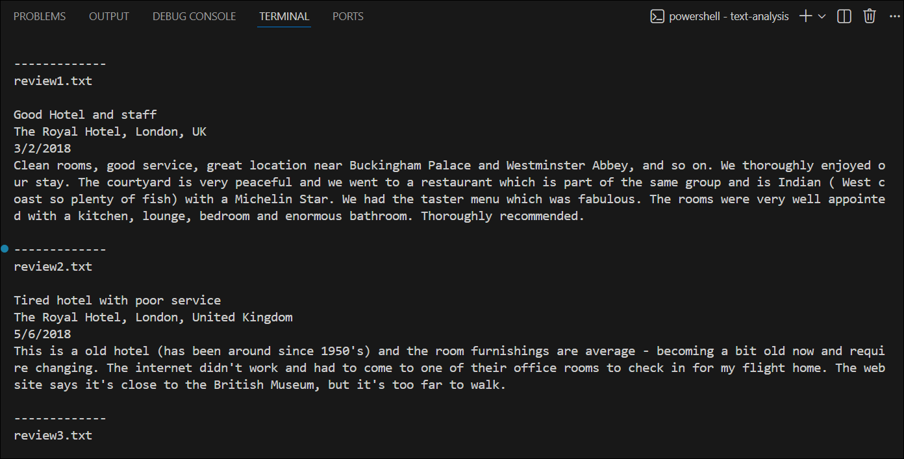

### Task 4.1: Add code to detect language

In this task, you will add code to detect the language of each review using the Text Analytics API.

1. In the code editor, find the comment **Get language**. Then add the code necessary to detect the language in each review document:

    ```python
   # Get language
   detectedLanguage = ai_client.detect_language(documents=[text])[0]
   print('\nLanguage: {}'.format(detectedLanguage.primary_language.name))
    ```

    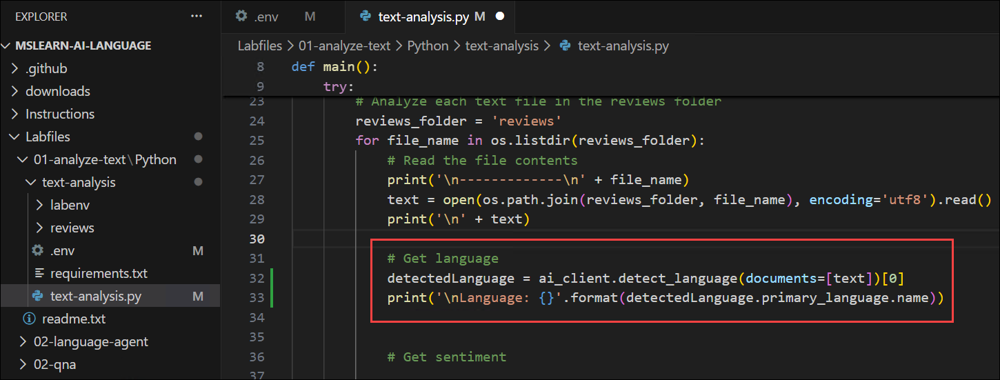

     > **Note:** *In this example, each review is analyzed individually, resulting in a separate call to the service for each file. An alternative approach is to create a collection of documents and pass them to the service in a single call. In both approaches, the response from the service consists of a collection of documents; which is why in the Python code above, the index of the first (and only) document in the response ([0]) is specified.*

1. Save the code file **CTRL+S** when you have finished. Then re-run the program.

     ```
   python text-analysis.py
    ```

1. Observe the output, noting that this time the language for each review is identified.

    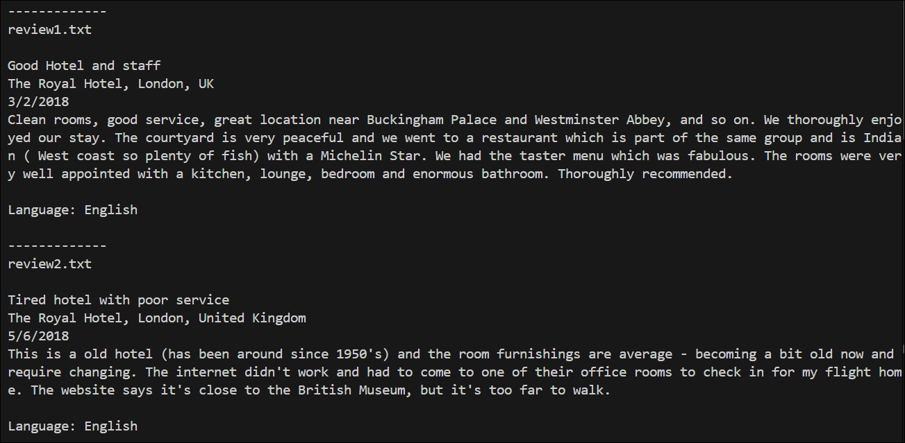

### Task 4.2: Add code to evaluate sentiment

*Sentiment analysis* is a commonly used technique to classify text as *positive* or *negative* (or possible *neutral* or *mixed*). It's commonly used to analyze social media posts, product reviews, and other items where the sentiment of the text may provide useful insights.

1. In the code editor, find the comment **Get sentiment**. Then add the code necessary to detect the sentiment of each review document:

    ```python
   # Get sentiment
   sentimentAnalysis = ai_client.analyze_sentiment(documents=[text])[0]
   print("\nSentiment: {}".format(sentimentAnalysis.sentiment))
    ```

    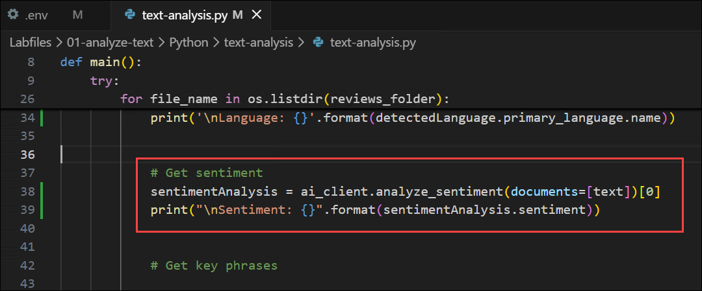

1. Save the code file **CTRL+S** when you have finished. Then re-run the program.

     ```
   python text-analysis.py
    ```

1. Observe the output, noting that the sentiment of the reviews is detected.

    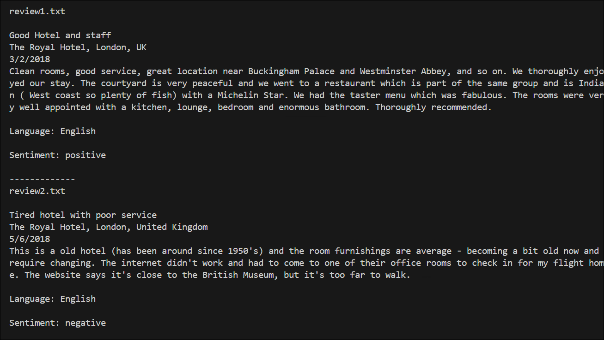

### Task 4.3: Add code to identify key phrases

In this task, you extract key phrases from the text to identify important topics in each review.

1. In the code editor, find the comment **Get key phrases**. Then add the code necessary to detect the key phrases in each review document:

    ```python
   # Get key phrases
   phrases = ai_client.extract_key_phrases(documents=[text])[0].key_phrases
   if len(phrases) > 0:
        print("\nKey Phrases:")
        for phrase in phrases:
            print('\t{}'.format(phrase))
    ```

    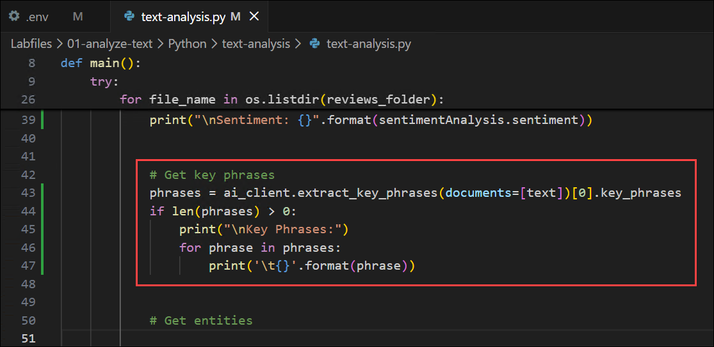

1. Save the code file **CTRL+S** when you have finished. Then re-run the program.

    ```
   python text-analysis.py
    ```
1. Observe the output, noting that each document contains key phrases that give some insights into what the review is about.

    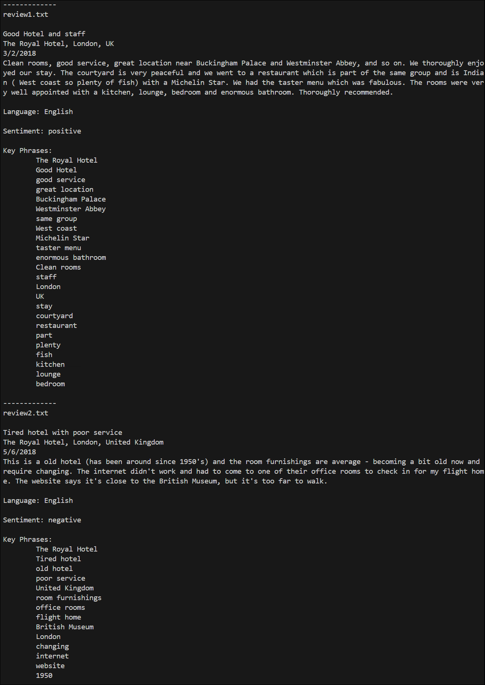

### Task 4.4: Add code to extract entities

In this task, you identify and extract named entities such as people, places, and organizations from the text.

1. In the code editor, find the comment **Get entities**. Then, add the code necessary to identify entities that are mentioned in each review:

    ```python
   # Get entities
   entities = ai_client.recognize_entities(documents=[text])[0].entities
   if len(entities) > 0:
        print("\nEntities")
        for entity in entities:
            print('\t{} ({})'.format(entity.text, entity.category))
    ```
    
    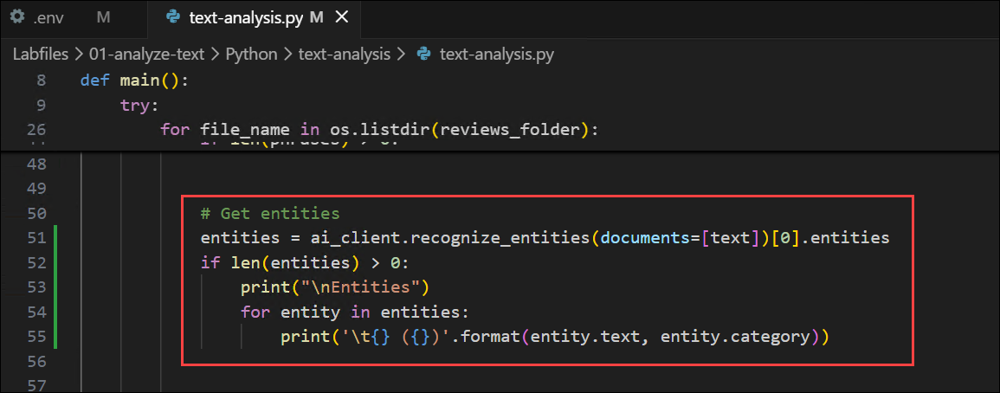

1. Save the code file **CTRL+S** when you have finished. Then re-run the program.

    ```
   python text-analysis.py
    ```
1. Observe the output, noting the entities that have been detected in the text.

    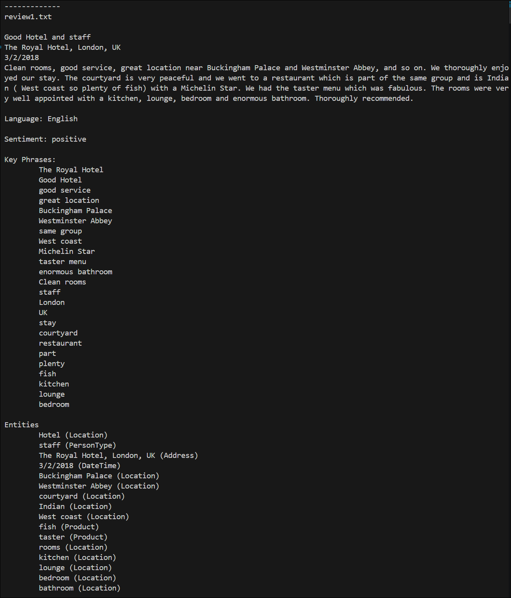

### Task 4.5: Add code to extract linked entities

In this task, you extract linked entities with external references, such as Wikipedia links, for deeper insights.

1. In the code editor, find the comment **Get linked entities**. Then, add the code necessary to identify linked entities that are mentioned in each review:

    ```python
   # Get linked entities
   linked_entities = ai_client.recognize_linked_entities(documents=[text])[0].entities
   if len(linked_entities) > 0:
       print("\nLinks")
       for linked_entity in linked_entities:
            print('\t{} ({})'.format(linked_entity.name, linked_entity.url))
    ```

    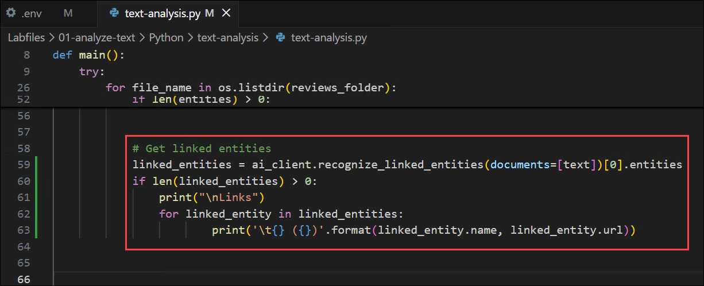

1. Save the code file **CTRL+S** when you have finished. Then re-run the program.

    ```
   python text-analysis.py
    ```
1. Observe the output, noting the linked entities that are identified.

    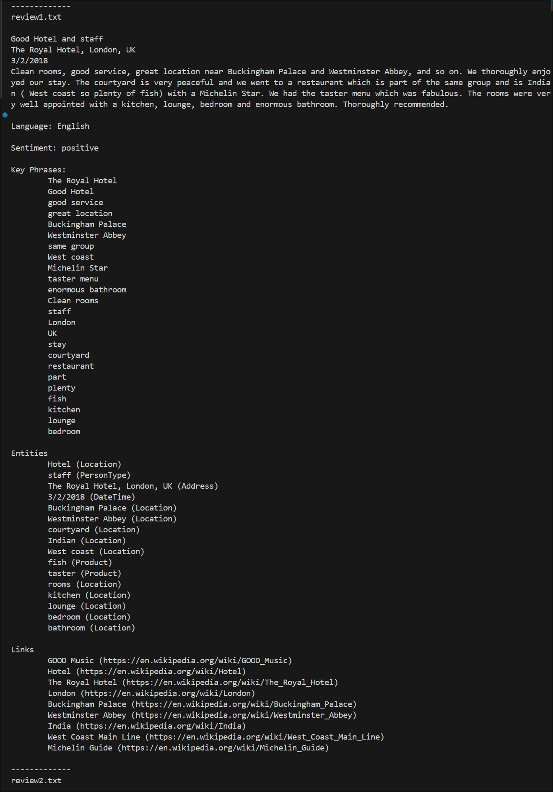

## Summary

In this lab, you created a Microsoft Foundry project and developed a Python application integrated with Azure AI Language services. You configured the application environment, authenticated using Azure credentials, and connected to the Text Analytics API. You then enhanced the application to perform language detection, sentiment analysis, key phrase extraction, and entity recognition, including linked entities. Finally, you executed the application to analyze real-world text data and gain meaningful insights from unstructured content.

### You have successfully completed the Hands-on Lab!