# Lab 18: Extract custom entities

### Estimated Duration : 35 Minutes

## Overview

Azure AI Language makes it possible to go beyond prebuilt text analysis by creating custom models that recognize entities specific to your needs. In this lab, you’ll work with a set of sample classified ads and use Azure AI Language Studio to build a custom named entity recognition model. You’ll label the data with entities such as items for sale, prices, and locations, train and evaluate your model, and then deploy it as an endpoint. Finally, you’ll use a Python application in Azure Cloud Shell to test the deployed model and extract entities from new text. While this exercise uses Python, you can integrate the service into applications built in other languages using the Azure AI Language SDKs.

## Lab Objectives

- **Task 1:** Provision an Azure AI Language resource

- **Task 2:** Upload sample ads

- **Task 3:** Create a custom named entity recognition project

- **Task 4:** Label your data

- **Task 5:** Train your model

- **Task 6:** Evaluate your model

- **Task 7:** Deploy your model

- **Task 8:**  Prepare to develop an app in Cloud Shell

- **Task 9:** Configure your application

- **Task 10:** Add code to extract entities

## Task 1: Provision an Azure AI Language resource

In this task, you’ll sign in to the Azure portal, create a new Language service resource with custom named entity recognition enabled, configure it with the required settings, and then retrieve the endpoint and access key for later use in exercises.

1. Open the Azure portal at `https://portal.azure.com`, and sign in using the Microsoft account.

1. If prompted, provide the credentials below:

    - **Email/Username:** <inject key="AzureAdUserEmail"></inject>

        

    - **Password:** <inject key="AzureAdUserPassword"></inject>

        

1. When the **Stay signed in?** window appears, select **No**.

    

    >**Note:** If the **Welcome to Microsoft Azure** window appears, select **Cancel**.

    

1. On the Azure Portal home page, select **Create a resource**.

    

1. On the **Create a resource** page, type **Language service** in the search box and press **Enter**. 

    

1. On the **Marketplace** page, under **Language service**, select the **Create (1)** drop-down and then choose **Language service (2)**.

    

1. When on the page for **Select additional features**, in the **Custom features** containing **Custom named entity recognition extraction** click **Select (1)** and then click **Continue to create your resource (2)**.

    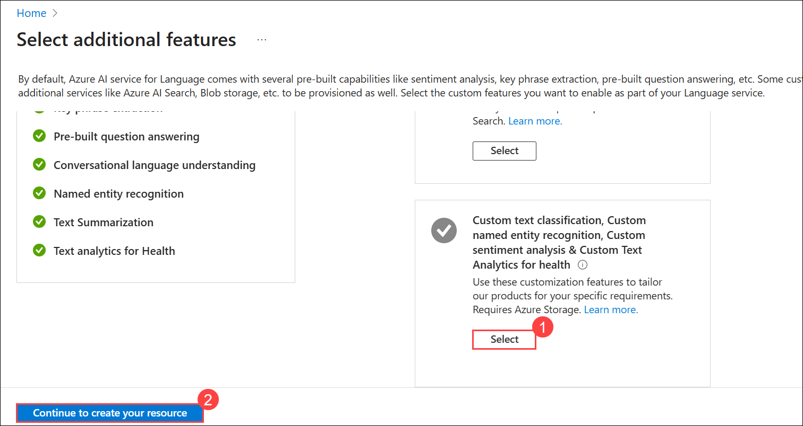

1.  Provision the resource with the following settings, then select **Review + create**:

    - Subscription: **Default Subscription** **(1)**
    - Resource group: **AI-102-RG18 (2)**
    - Region: **<inject key="Region" enableCopy="false" /> (3)**
    - Name: **entityrecognition<inject key="DeploymentID" enableCopy="false"/> (4)**
    - Pricing tier: Select **F0 (5)** (*free*), or **S** (*standard*) if F is not available.
    - Storage account: **New storage account (6)**
      - Storage account name: **storage<inject key="DeploymentID" enableCopy="false"/> (7)**
      - Storage account type: **Standard LRS (8)**
    - Responsible AI notice: **Selected (9)**

        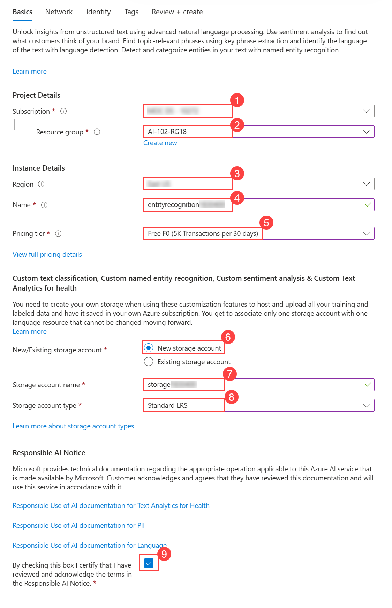

1. On the **Review + create** tab, click **Create** to provision the resource.

    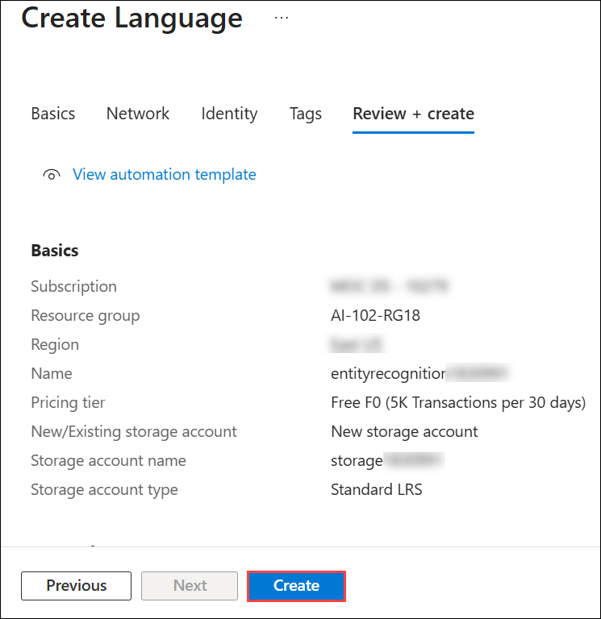

1. Wait for deployment to complete, and then click on **Go to resource**.

    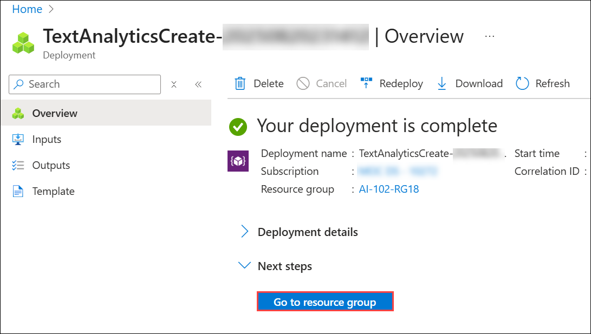

1. From the left navigation pane, go to **Resource Management (1)** and select **Keys and Endpoint (2)**. Copy the **Endpoint (3)** and **Key (4)**, then save them in a notepad file, you’ll need these details later in the exercise.

    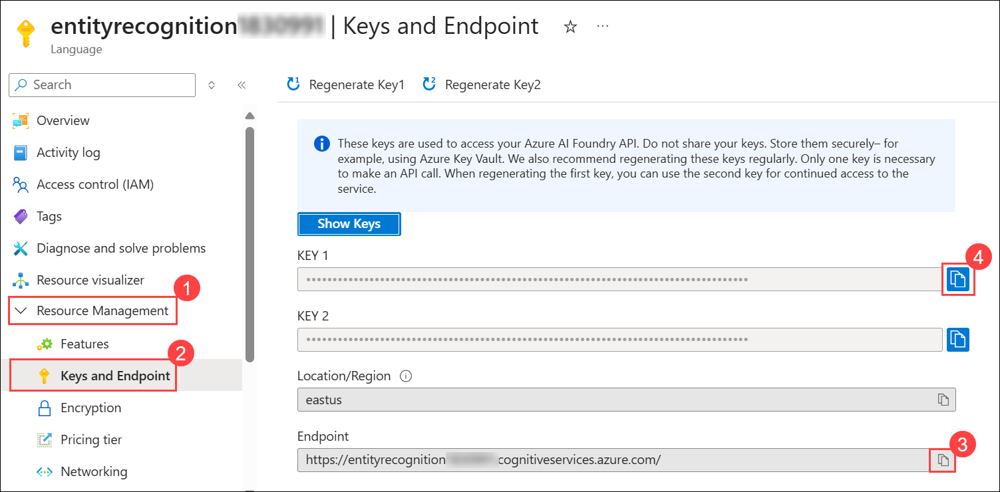

> **Congratulations** on completing the task! Now, it's time to validate it. Here are the steps:
>
> - Hit the Validate button for the corresponding task. If you receive a success message, you can proceed to the next task.
> - If not, carefully read the error message and retry the step, following the instructions in the lab guide.
> - If you need any assistance, please contact us at cloudlabs-support@spektrasystems.com. We are available 24/7 to help.
 
<validation step="45e2dfb8-1764-425a-bd3a-a58b71baa3f3" />

## Task 2: Upload sample ads

In this task, you’ll download sample classified ads, configure your Azure Storage account for anonymous blob access, create a new container, and then upload the sample ads to the container. These files will later be used to train your custom entity recognition model.

1. Within the JumpVM, in a new browser tab, download sample classified ads from `https://aka.ms/entity-extraction-ads`.

1. Select the **folder** icon.

   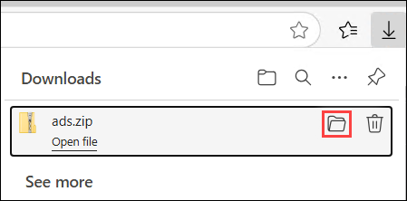

1. Right click on **ads** folder **(1)** and then select **Extract (2)**.  

   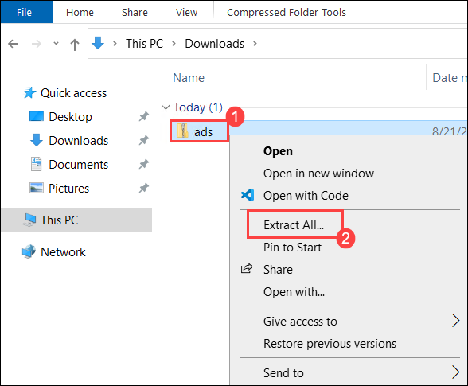

1. Change the destination path to `C:\LabFiles` **(1)** and then click **Extract all (2)**.

   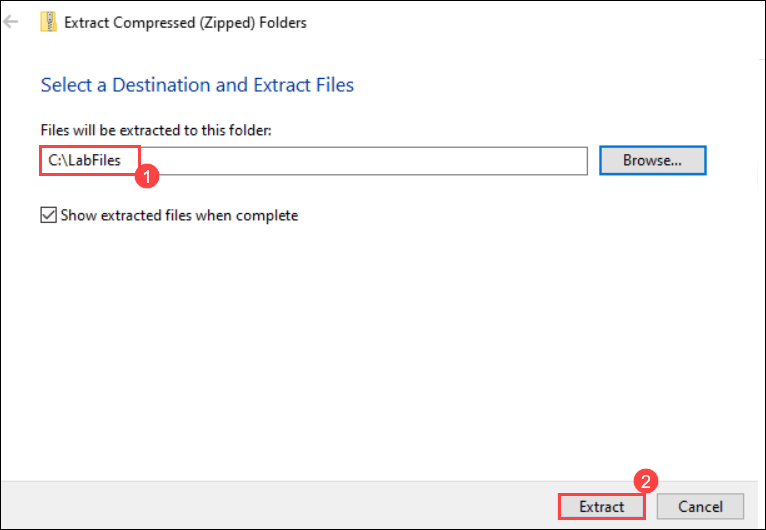

1. In the **Azure portal**, search for **storage account (1)**and select it **(2)**.

   

1. Select the storage account **storage<inject key="DeploymentID" enableCopy="false"/>** you created.

   

1. In your storage account select **Configuration (1)**, located below **Settings**. In the Configuration screen enable the option to **Allow Blob anonymous access (2)** then select **Save (3)**.

   

1. Select **Containers (1)** in the left menu, located below **Data storage**. On the screen that appears, select **+ Container (2)**. Give the container the name `classifieds` **(3)**, and set **Anonymous access level** to **Container (anonymous read access for containers and blobs) (4)** and then **Create (5)**.

   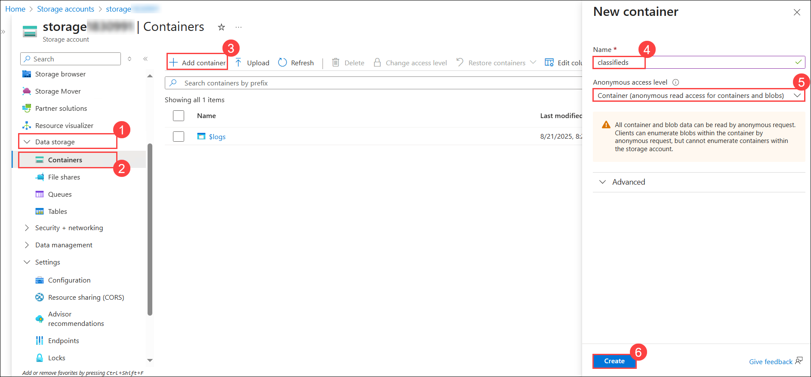

    >**NOTE**: When you configure a storage account for a real solution, be careful to assign the appropriate access level. To learn more about each access level, see the [Azure Storage documentation](https://learn.microsoft.com/azure/storage/blobs/anonymous-read-access-configure).

1. After you've created the container, select **classifieds** container.

   .png)

1. Select the **Upload (1)** button. Select **Browse for files (2)** to browse for the sample classified ads you downloaded. 

   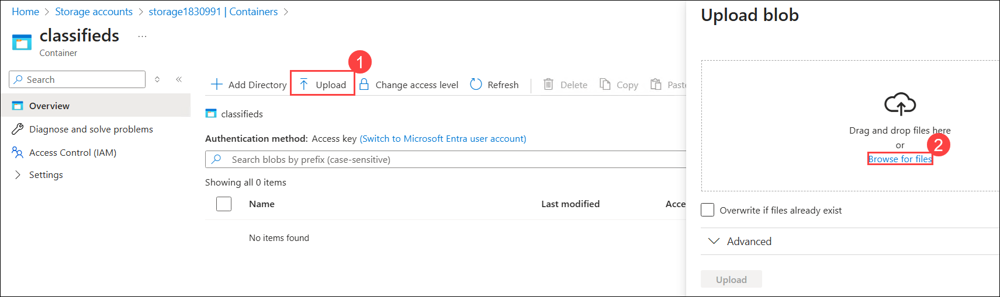

1. Navigate to `C:\LabFiles` **(1)**, select all the files from `Ad 1 - Ad 12` **(2)** and then click **Open (3)**.  

   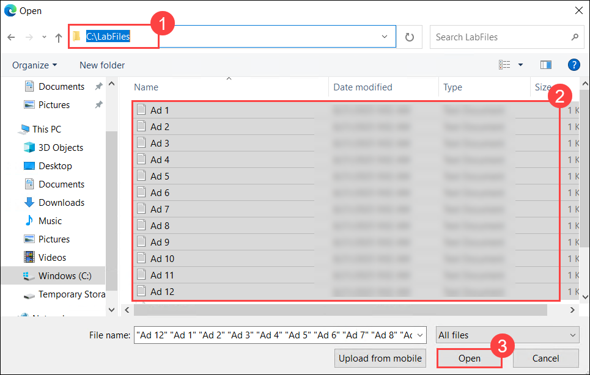

1. Click on **Upload** to upload the sample classified ads you downloaded.

   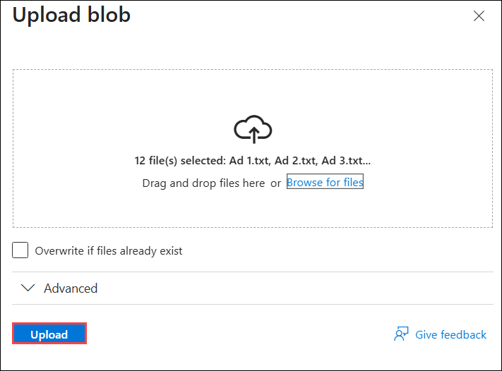

## Task 3: Create a custom named entity recognition project

In this task, you’ll use Azure AI Language Studio to create a new custom named entity recognition project. You’ll connect it to your storage container, configure the project with basic details, and set it up as the workspace where you’ll label data, train, and eventually deploy your model.

> **NOTE**: You can also create, build, train, and deploy your model through the REST API.

1. In a new browser tab, open the Azure AI Language Studio portal at `https://language.cognitive.azure.com/`.

1. Selelect **Sign in**.

     

1. If prompted, provide the credentials below:

    - **Email/Username:** <inject key="AzureAdUserEmail"></inject>

    - **Password:** <inject key="AzureAdUserPassword"></inject>

1. Close the pop ups.

     

1. If prompted to choose a Language resource, select the following settings and click **Done (5)**:

    - Azure Directory: **Default Azure directory containing your subscription** **(1)**
    - Azure subscription: **Default Azure subscription (2)**
    - Resource type: Language.
    - Language resource: **entityrecoginition<inject key="DeploymentID" enableCopy="false"/> (4)**

        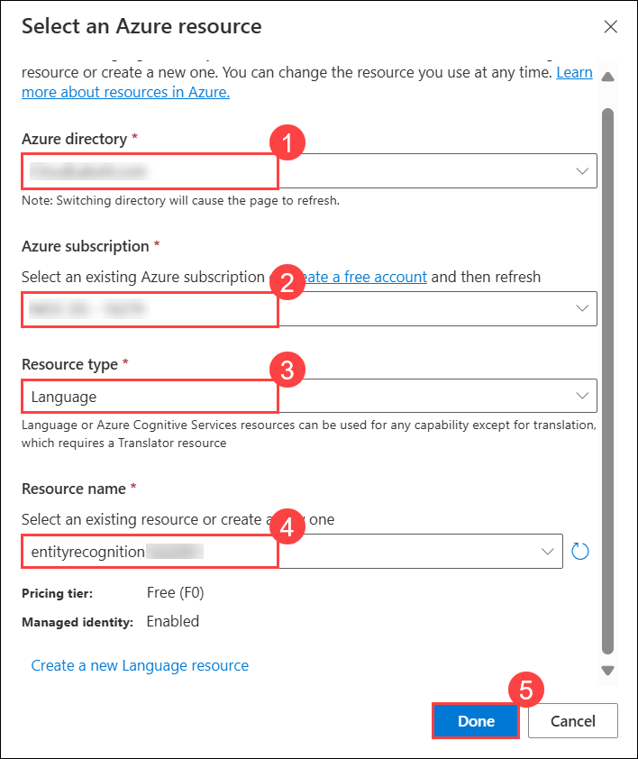

        >**Note:** If you are <u>not</u> prompted to choose a language resource, it may be because you have multiple Language resources in your subscription; in which case:

        - On the bar at the top of the page, select the **Settings (&#9881;)** button.
        - On the **Settings** page, view the **Resources** tab.
        - Select the language resource you just created, and click **Switch resource**.
        - At the top of the page, click **Language Studio** to return to the Language Studio home page.

1. At the top of the portal, in the **Create new** menu, select **Custom named entity recognition**.

    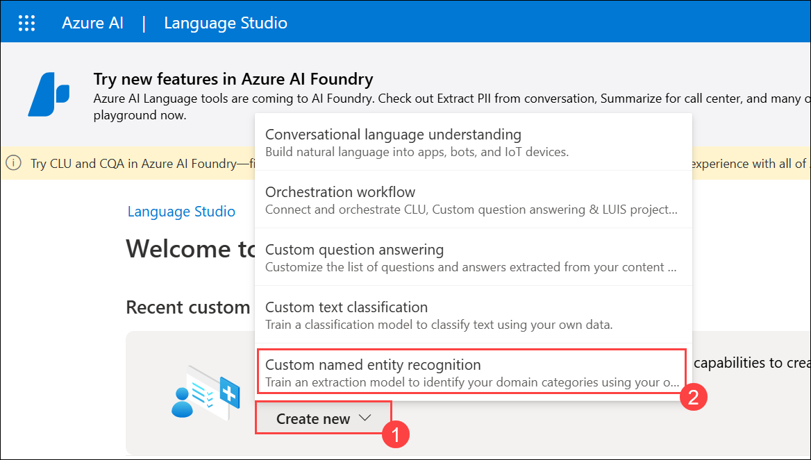

1. The **Connect storage** page appears. All values will already have been filled. So select **Next**.

    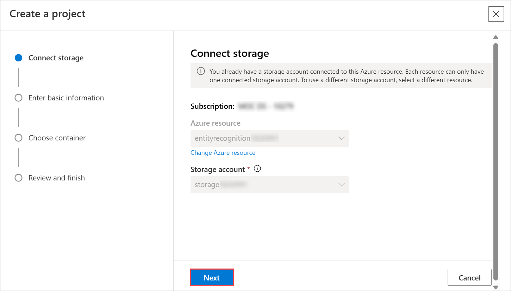

1. In the **Enter Basic information** section, provide the follwoing information:

    - Name: **`CustomEntityLab` (1)**
    - **Text primary language**: **English (US) (2)**
    - Does your dataset include documents that are not in the same language?: **No (3)**
    - Description: **`Custom entities in classified ads` (4)**
    - Click **Next (5)**

        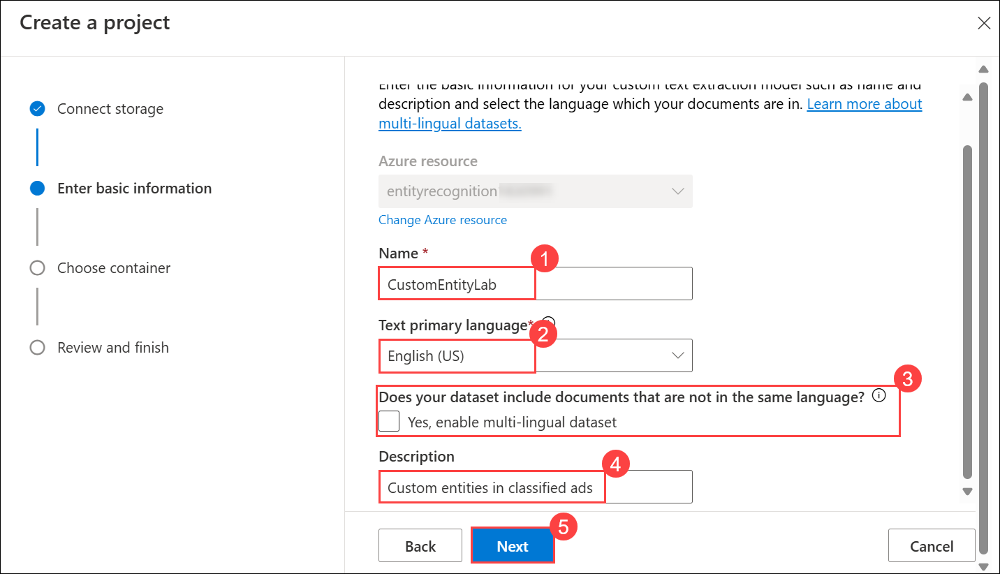

1. In the **Choose Container** section, provide the follwoing information:

    - Blob store container: **classifieds (1)**
    - Are your files labeled with classes?: **No, I need to label my files as part of this project (2)**
    - Click **Next (3)**

        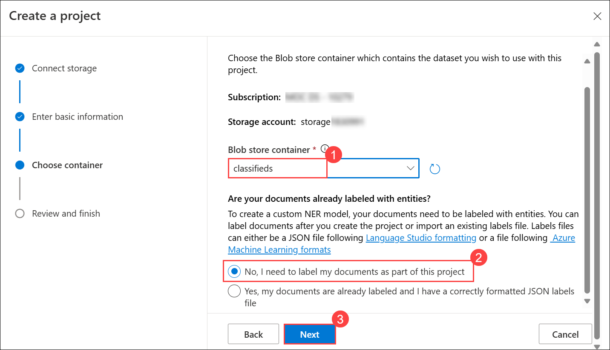

        > **Note:** If you get an error about not being authorized to perform this operation, you'll need to add a role assignment. To fix this, we add the role "Storage Blob Data Contributor" on the storage account for the user running the lab. More details can be found [on the documentation page](https://learn.microsoft.com/azure/ai-services/language-service/custom-named-entity-recognition/how-to/create-project?tabs=portal%2Clanguage-studio#enable-identity-management-for-your-resource)

1. In the Review and finish section, click **Create Project**.

    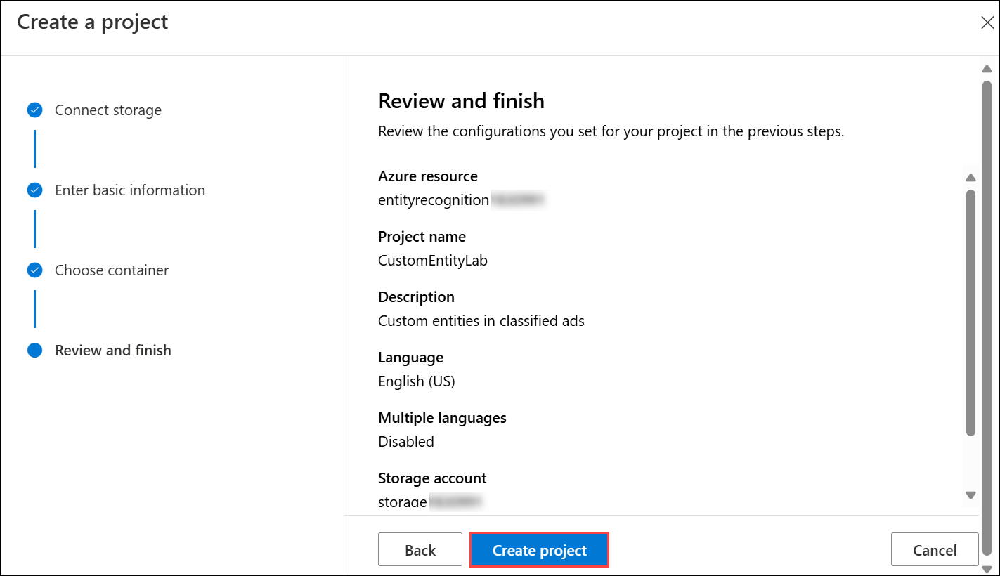

> **Congratulations** on completing the task! Now, it's time to validate it. Here are the steps:
>
> - Hit the Validate button for the corresponding task. If you receive a success message, you can proceed to the next task.
> - If not, carefully read the error message and retry the step, following the instructions in the lab guide.
> - If you need any assistance, please contact us at cloudlabs-support@spektrasystems.com. We are available 24/7 to help.
 
<validation step="d1d8585a-ac12-4413-9755-926b0aaf609d" />

## Task 4: Label your data

In this task, you’ll label the sample ads in your project by defining entities such as ItemForSale, Price, and Location, and tagging the corresponding text in each document. This labeling process prepares your dataset so the model can learn how to identify these entities during training.

1. On the **Data labeling** page, you’ll find a list of the files uploaded to your storage account.

    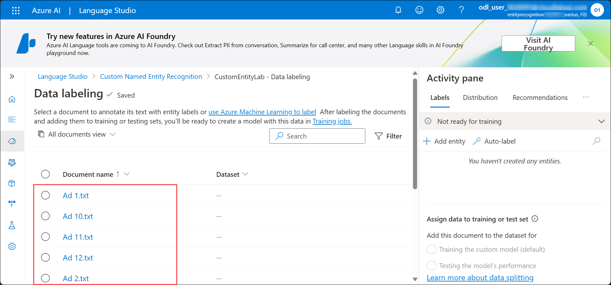

1. On the right side, in the **Activity** pane, select **Add entity** and add a new entity named `ItemForSale`.

    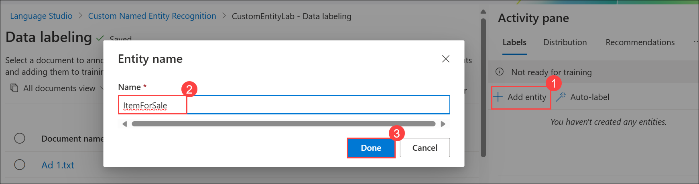

1.  Repeat the previous step to create the following entities:
    - `Price`
    - `Location`

    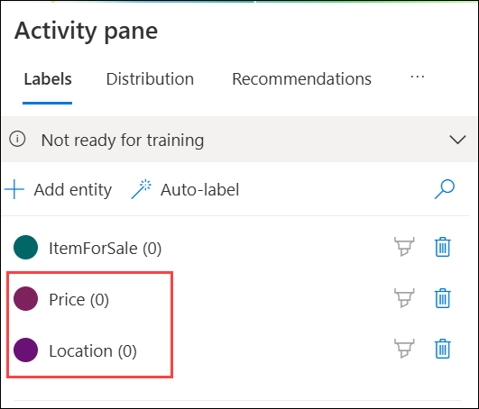

1. After you've created your three entities, select **Ad 1.txt** so you can read it.

    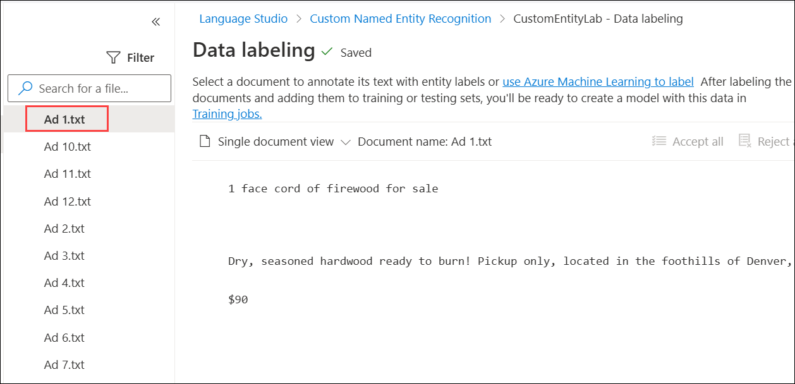

1. In *Ad 1.txt*, highlight the text **face cord of firewood (1)** and select the **ItemForSale (2)** entity.

    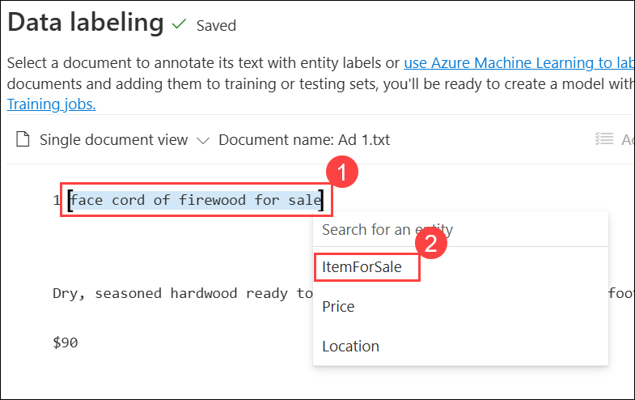

1. Then highlight the text **Denver, CO (1)** and select the **Location (2)** entity.

    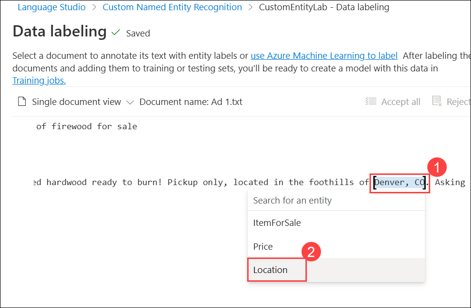

1. Then highlight the text **$90 (1)** and select the **Price (2)** entity.

    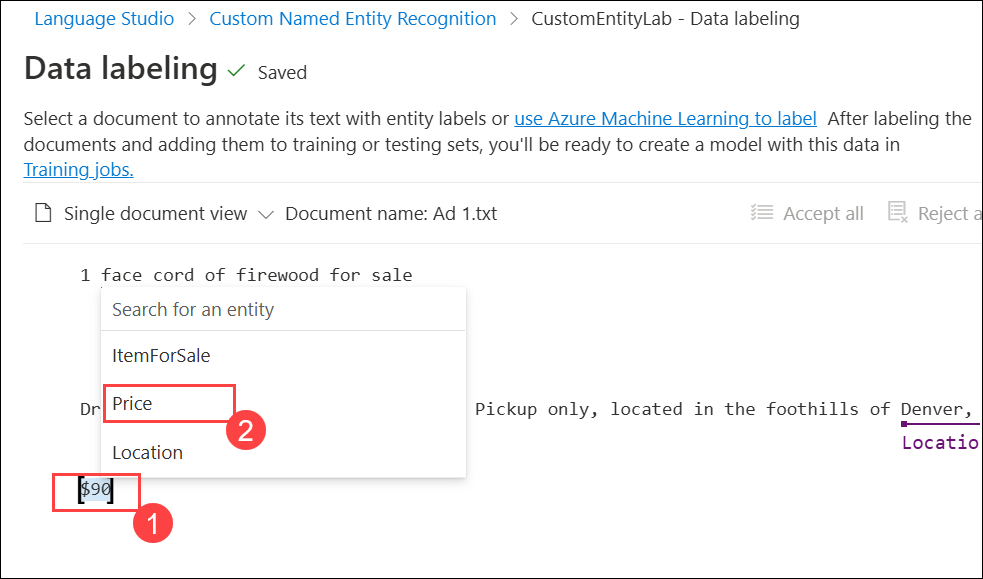

1. In the **Activity** pane, note that this document will be added to the dataset for training the model.

1. Use the **Next document** button to move to the next document, and continue assigning text to appropriate entities for the entire set of documents, adding them all to the training dataset.

    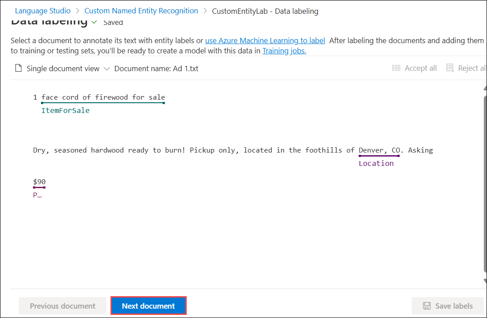

1. When you have labeled the last document (*Ad 12.txt*), click **Save labels**.

    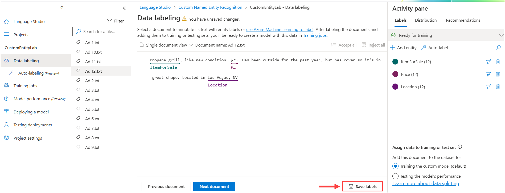

## Task 5: Train your model

In this task, you’ll train your custom named entity recognition model by starting a new training job, configuring it with a name and data split, and running the process to generate a model that can later be tested and deployed.

1. Select **Training jobs** in the pane on the left.

    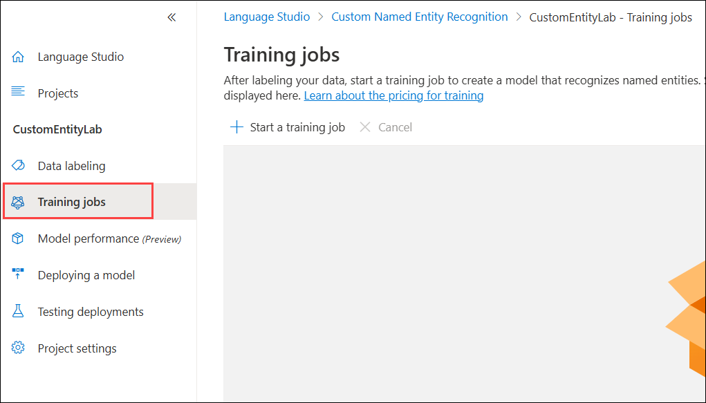

2. Click **Start a training job**.

    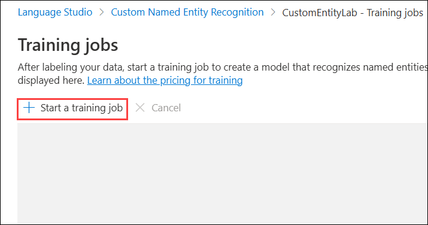

3. In the Start a  Training section, provide the following details:

    - Train a new model named **`ExtractAds` (1)**.
    - Choose **Automatically split the testing set from training data (2)**
    - Click **Train (3)**

        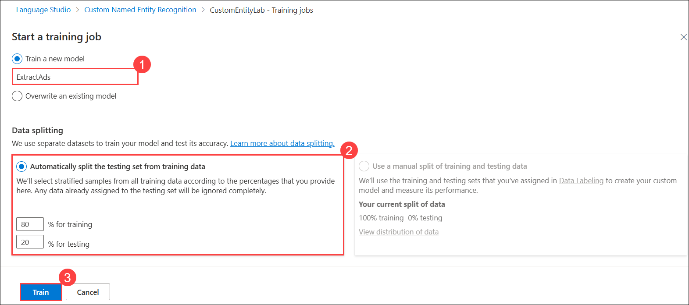

        > **Note:** In your own extraction projects, use the testing split that best suits your data. For more consistent data and larger datasets, the Azure AI Language Service will automatically split the testing set by percentage. With smaller datasets, it's important to train with the right variety of possible input documents.

        > **IMPORTANT**: Training your model can sometimes take several minutes. You'll get a notification when it's complete.

4. Once the training job is successful, its status will be updated accordingly.

    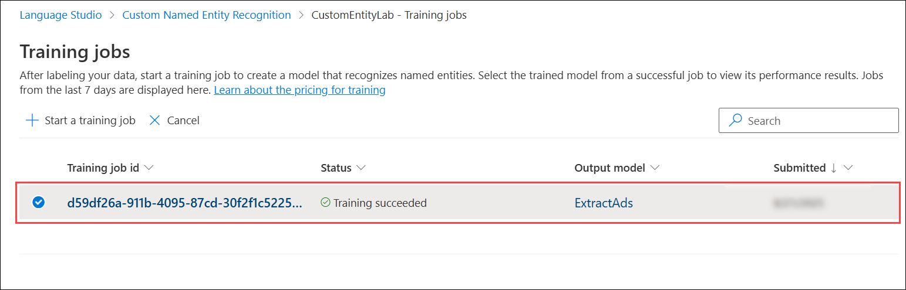

## Task 6: Evaluate your model

In this task, you’ll review the performance of your trained model by examining its metrics, scores, and any failed test documents. This evaluation helps you understand how well the model recognizes entities and where it may need improvement.

In real world applications, it's important to evaluate and improve your model to verify it's performing as you expect. Two pages on the left show you the details of your trained model, and any testing that failed.

1. Select **Model performance** on the left side menu, and select your `ExtractAds` model. There you can see the scoring of your model, performance metrics, and when it was trained. You'll be able to see if any testing documents failed, and these failures help you understand where to improve.

    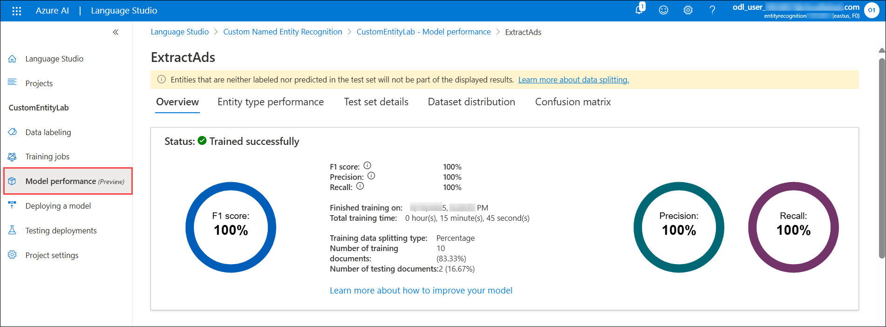

## Task 7: Deploy your model

In this task, you’ll deploy your trained model by creating a deployment named AdEntities, making it available for use through the API to extract entities from new data.

1. In the left pane, select **Deploying a model (1)** and then click **Add deployment (2)**.

    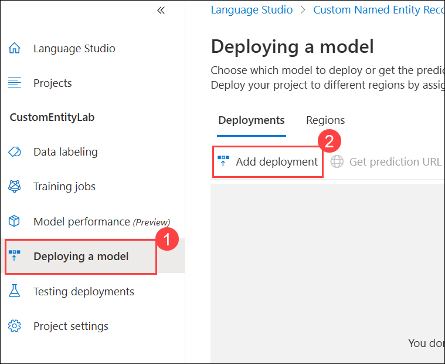

2. Enter the name **`AdEntities` (1)** and select the **ExtractAds (2)** model and then click **Deploy (3)** to deploy the model.

    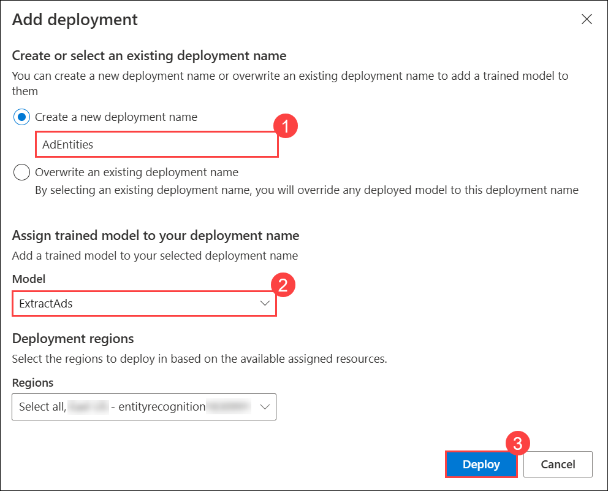

## Task 8:  Prepare to develop an app in Cloud Shell

In this task, you’ll set up an Azure Cloud Shell environment, clone the lab repository, and prepare the console application code that will be used to test your custom entity extraction model.

1. On the **Azure portal** homepage, click the **\[>\_] Cloud Shell (1)** button located to the right of the **Copilot** tab at the top. This opens a new Cloud Shell session. In the **Welcome to Azure Cloud Shell** window, choose **PowerShell (2)**.

    

    >**Note:** The cloud shell provides a command-line interface in a pane at the bottom of the Azure portal. You can resize or maximize this pane to make it easier to work in.

    > **Note:** If you have previously created a cloud shell that uses a **Bash** environment, switch it to **PowerShell**.

1. In the **Getting started** window, ensure **No storage account required (1)** is selected. From the **Subscription** drop-down, choose **Default subscription (2)**, then click **Apply (3)**.

    

1. In the Cloud Shell toolbar, open the **Settings (1)** menu and choose **Go to Classic version (2)** from the drop-down.

    

    >**Note:** Ensure you've switched to the classic version of the cloud shell before continuing.

1. In the PowerShell pane, enter the following commands to clone the GitHub repo for this exercise:

    ```
    rm -r mslearn-ai-language -f
    git clone https://github.com/microsoftlearning/mslearn-ai-language
    ```

    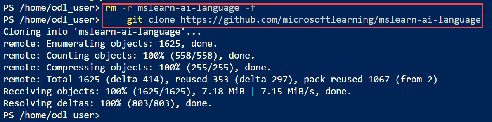

    > **Note:** As you paste commands into the cloudshell, the ouput may take up a large amount of the screen buffer. You can clear the screen by entering the `cls` command to make it easier to focus on each task.


1. After the repo has been cloned, navigate to the folder containing the application code files:  

    ```
    cd mslearn-ai-language/Labfiles/05-custom-entity-recognition/Python/custom-entities
    ```

    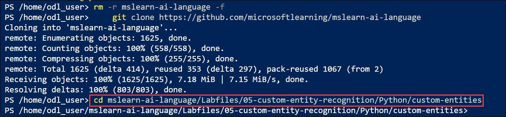

## Task 9: Configure your application

In this task, you’ll set up a Python environment in Cloud Shell, install the required SDK packages, and configure your application by adding the Azure Language Service endpoint and key to the environment file. This prepares the app to connect to your deployed model.

1. In the command line pane, run the following command to view the code files in the **custom-entities** folder:

    ```
    ls -a -l
    ```

    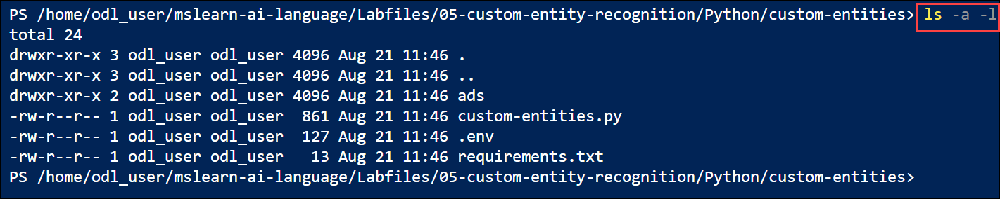
    
    The files include a configuration file (**.env**) and a code file (**custom-entities.py**). The text your application will analyze is in the **ads** subfolder.

1. Create a Python virtual environment and install the Azure AI Language Text Analytics SDK package and other required packages by running the following command:

    ```
    python -m venv labenv
    ./labenv/bin/Activate.ps1
    pip install -r requirements.txt azure-ai-textanalytics==5.3.0
    ```

1. Enter the following command to edit the application configuration file. The file is opened in a code editor.

    ```
    code .env
    ```

    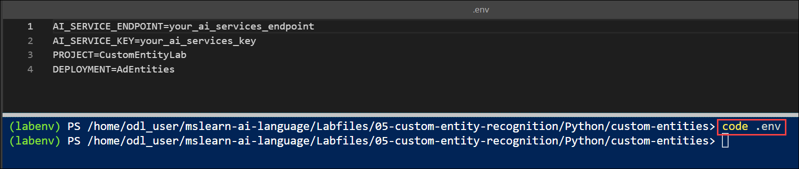

1. In the code file, replace the placeholder values with the correct details for your project:

    * your_ai_service_endpoint : **Azure Language Service endpoint (1)**
    * your_ai_service_key : **Azure Language Service Key (2)**

        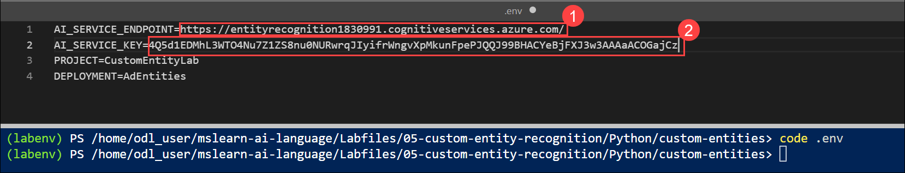

1. After you've replaced the placeholders, within the code editor, use the **CTRL+S** command or **Right-click > Save** to save your changes and then use the **CTRL+Q** command or **Right-click > Quit** to close the code editor while keeping the cloud shell command line open.

## Task 10: Add code to extract entities

In this task, you’ll update the Python application to use the Azure AI Language Text Analytics SDK, add code to create a client and extract custom entities from the sample ads, and then run the program to view the recognized entities and their details.

1. Enter the following command to edit the application code file:

    ```
    code custom-entities.py
    ```
    
    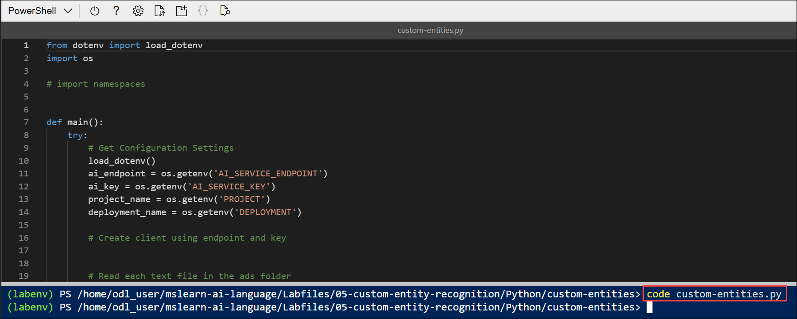


1. Review the existing code. You will add code to work with the AI Language Text Analytics SDK.

    > **Note:** As you add code to the code file, be sure to maintain the correct indentation.

1. At the top of the code file, under the existing namespace references, find the comment **Import namespaces** and add the following code to import the namespaces you will need to use the Text Analytics SDK:

    ```python
    # import namespaces
    from azure.core.credentials import AzureKeyCredential
    from azure.ai.textanalytics import TextAnalyticsClient
    ```

    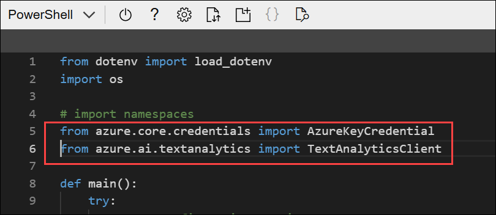

1. In the **main** function, note that code to load the Azure AI Language service endpoint and key and the project and deployment names from the configuration file has already been provided. Then find the comment **Create client using endpoint and key**, and add the following code to create a text analytics client:

    ```Python
    # Create client using endpoint and key
    credential = AzureKeyCredential(ai_key)
    ai_client = TextAnalyticsClient(endpoint=ai_endpoint, credential=credential)
    ```

    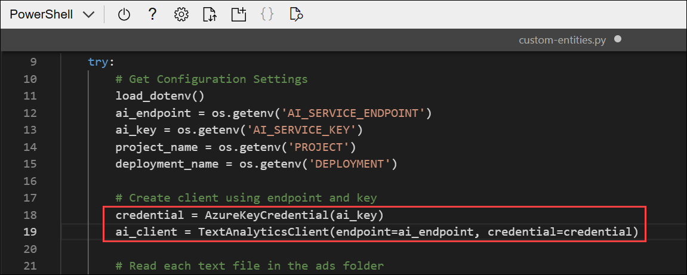

1. Note that the existing code reads all of the files in the **ads** folder and creates a list containing their contents. Then find the comment **Extract entities** and add the following code:

    ```Python
    # Extract entities
    operation = ai_client.begin_recognize_custom_entities(
            batchedDocuments,
            project_name=project_name,
            deployment_name=deployment_name
    )

    document_results = operation.result()

    for doc, custom_entities_result in zip(files, document_results):
            print(doc)
            if custom_entities_result.kind == "CustomEntityRecognition":
                for entity in custom_entities_result.entities:
                    print(
                        "\tEntity '{}' has category '{}' with confidence score of '{}'".format(
                            entity.text, entity.category, entity.confidence_score
                        )
                    )
            elif custom_entities_result.is_error is True:
                print("\tError with code '{}' and message '{}'".format(
                    custom_entities_result.error.code, custom_entities_result.error.message
                    )
                )
    ```

    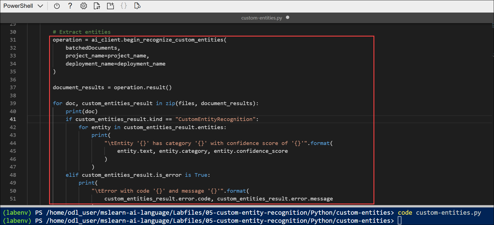

1. Save your changes (CTRL+S), then enter the following command to run the program (you maximize the cloud shell pane and resize the panels to see more text in the command line pane):

    ```
    python custom-entities.py
    ```
    
1. Observe the output. The application should list details of the entities found in each text file.

    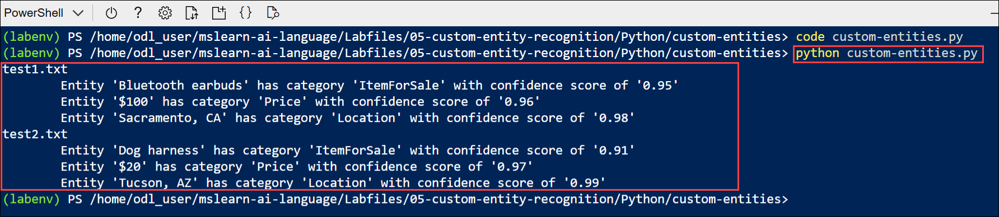

## Summary

In this lab, you created and configured an Azure AI Language Service resource, uploaded training data, and built a custom named entity recognition project in Language Studio. You labeled entities in sample ads, trained and evaluated your model, and deployed it as an endpoint. Finally, you modified and ran a Python application in Azure Cloud Shell to test the model and extract custom entities such as items for sale, prices, and locations. By completing these tasks, you gained practical experience in designing, training, and deploying a custom NER solution with Azure AI Language.

### You have successfully completed the Hands-on Lab!


