# Lab 19: Develop a text analysis agent

### Estimated Duration: 60 Minutes

## Lab Overview

In this lab, you’ll build an end-to-end solution using **Microsoft Foundry** by creating a project and developing an AI-powered text analysis agent. You’ll configure the agent with Azure Language capabilities to perform tasks such as summarization and entity recognition.

You’ll then set up your development environment in **Visual Studio Code**, clone a sample application, and configure it using environment variables. Using Python and the Foundry SDK, you’ll implement code to connect to your agent, submit prompts, and process responses. Finally, you’ll authenticate with Azure, run the application, and test the agent to analyze text and extract insights such as entities, dates, and sentiment.

## Lab Objectives

In this lab, you'll perform the following tasks:

* Task 1: Create a Microsoft Foundry project
* Task 2: Create an agent
* Task 3: Create an Azure Language in Foundry Tools connection
* Task 4: Test the Azure Language tool in the playground
* Task 5: Configure tool approval
* Task 6: Create a client application
* Task 7: Test the client application
* Task 8: View tool details


## Task 1: Create a Microsoft Foundry project

In this task, you'll sign in to the Microsoft Foundry portal and create a new project with the required Azure resources.

1. Open a new tab in the browser, right-click on the following link [Foundry portal](https://ai.azure.com), then **Copy link** and paste it in a browser tab to log in to **Microsoft Foundry portal**.

1. Click on **Sign in**.

    

1. If prompted, provide the credentials below:

   - **Email/Username:** <inject key="AzureAdUserEmail"></inject>

   - **Password:** <inject key="AzureAdUserPassword"></inject>

      >**Note:** Close any tips or quick start panes that are opened the first time you sign in, and if necessary, use the **Foundry** logo at the top left to navigate to the home page.

1. At the top of the **Microsoft Foundry** portal, enable the **New Foundry toggle (1)** to switch to the latest Foundry user interface.   

1. From the **Select a project to continue** dialog, click the drop-down under **Select or search for a project**, and then select **Create a new project (2)**.

     

1. In the **Create a project** window, enter **Myproject<inject key="DeploymentID" enableCopy="false"/> (1)** as the project name. Open the **Advanced options (2)** drop-down, fill in the following details, and then click **Create (6)**:

    >**Note:** <span style="color:red"> Make a note of the Microsoft Foundry resource name, as it will be required later in the lab.

    * Subscription: **Choose Default Subscription (3)**
    * Resource group: **AI-102-RG19 (4)**
    * Microsoft Foundry resource: **Keep as Default**
    * Region: **<inject key="Region"></inject> (5)**

      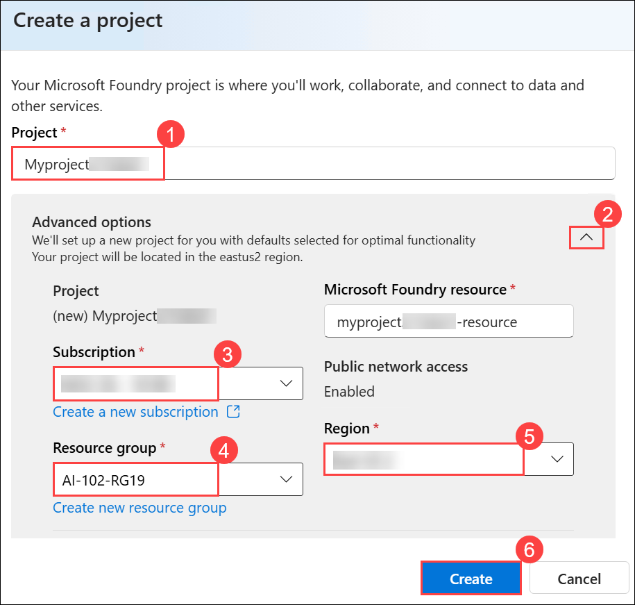 

1. Wait for your project to be created. It may take around 1-2 minutes.

1. If you see the **“Welcome to the new Microsoft Foundry”** window, you can either explore the information using **Next**, or close it by selecting the **X** in the top-right corner to continue.

    

1. On the home page for your project, note the project endpoint, key, and OpenAI endpoint.

    

    > **Note:** <span style="color:red"> Copy and save the project endpoint and API key, as you will need them later in the lab.

> **Congratulations** on completing the task! Now, it's time to validate it. Here are the steps:
>
> - Hit the Validate button for the corresponding task. If you receive a success message, you can proceed to the next task.
> - If not, carefully read the error message and retry the step, following the instructions in the lab guide.
> - If you need any assistance, please contact us at cloudlabs-support@spektrasystems.com. We are available 24/7 to help.
 
<validation step="91ddc639-898e-4b31-813a-5a3e930bcab0" />

## Task 2: Create an agent

In this task, you'll create and configure an AI agent with a selected model and define its instructions.

1. In the **Start building (1)** menu, select **Create agents (2)**.

    

1. When prompted, name the agent `Text-Analysis-Agent` **(1)** and then click **Create (2)**. 

    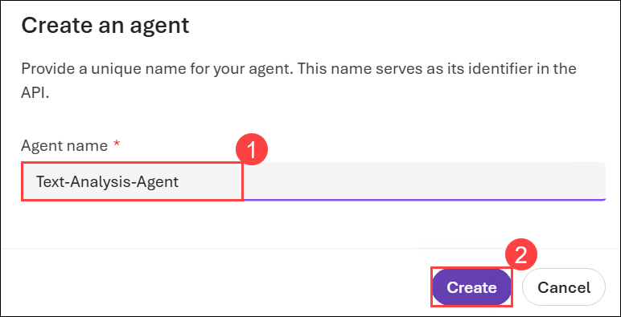

1. When ready, your agent opens in the agent playground.

    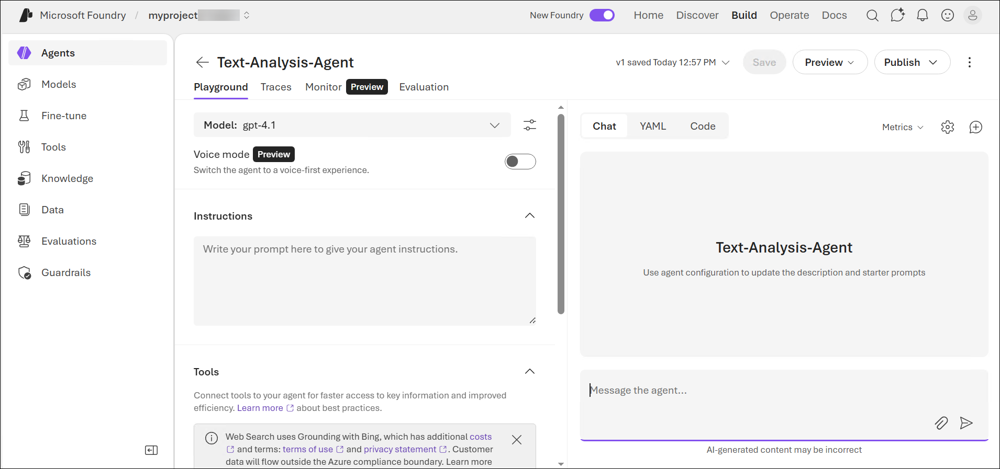

1. In the model drop-down list **(1)**, ensure that a **gpt-4.1** **(2)** model has been deployed and selected for your agent.

    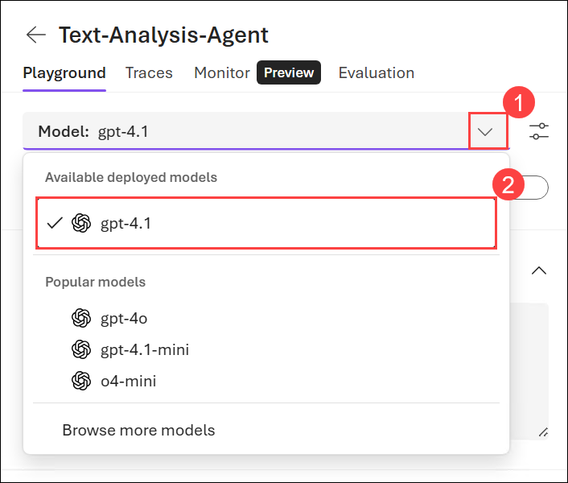

1. Assign your agent the following **Instructions**:

    ```
    You are an AI agent that assists users by helping them analyze and summarize text.
    ```

    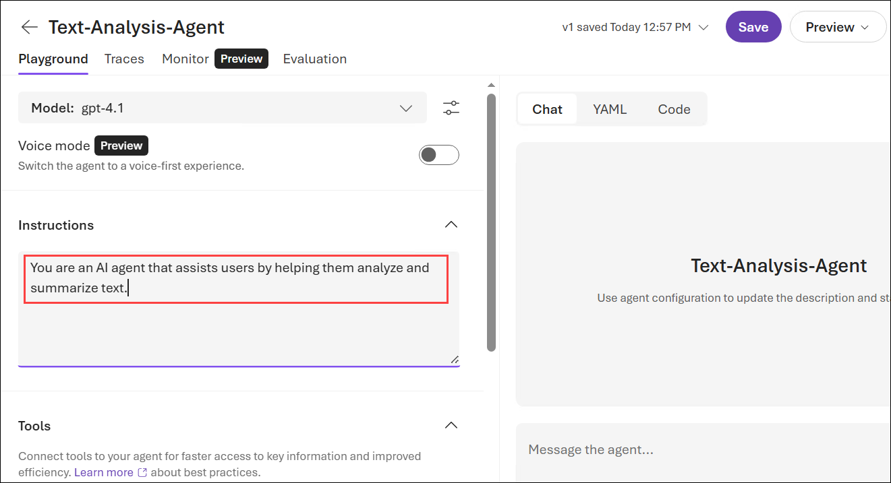

1. Use the **Save** button to save the changes.

    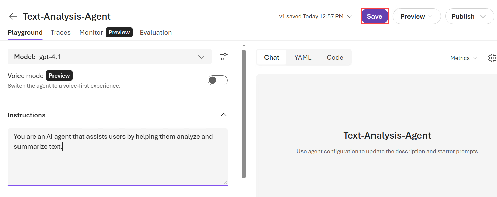

1. Test the agent by entering the following prompt in the **Chat** pane **(1)**, and then select the **Send** icon **(2)**:

    ```
    What can you help me with?
    ```

    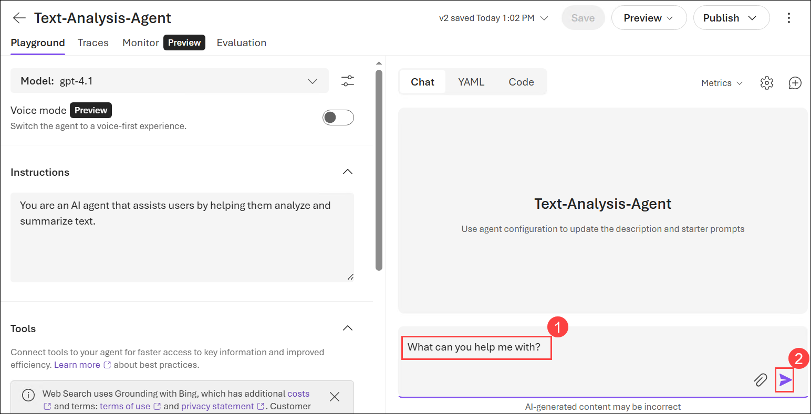

1. The agent should respond with an appropriate answer based on its instructions.

    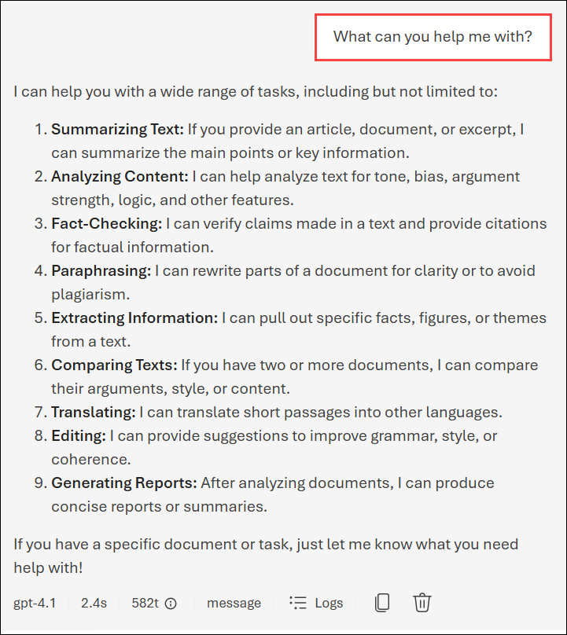

## Task 3: Create an Azure Language in Foundry Tools connection

In this task, you'll connect the Azure Language MCP tool to your Foundry project and associate it with your agent.

1. In the navigation pane on the left, select the **Tools (1)** page and then click **Connect a tool (2)**.

    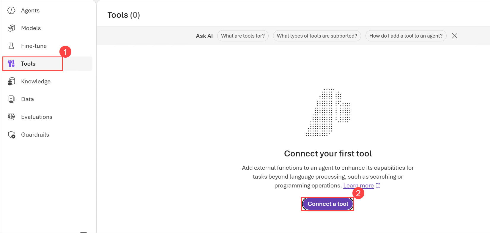

1. In the **Select a tool** window, under the **Catalog** tab, select **Azure Language in Foundry Tools (1)** from the list of available tools and then click **Create (2)**.

    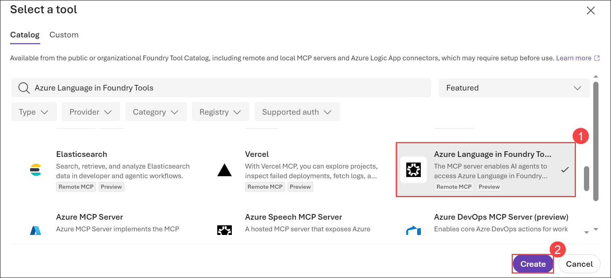

1. In the **Connect the Azure Language in Foundry Tools tool** window, specifying the following configuration:

    - **Name**: Leave as default **(1)**
    - **Foundry resource name**: *Enter the name of your Foundry resource you copied in task 1 (for example, `{project_name}-resource)`* **(2)**
    - **Authentication**: Key-based **(3)**
    - **Credential** (**Ocp-Apim-Subscription-Key**): *enter (or paste) the key for your Foundry project* **(4)**

        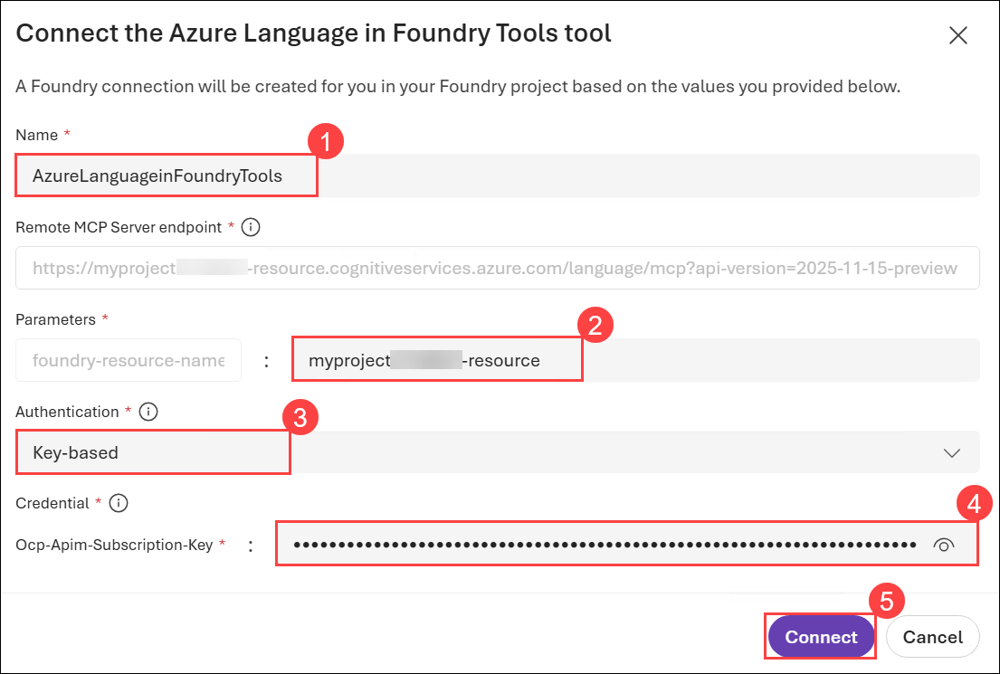

        > **Note**: If key-based authentication is disabled by a policy in your Azure subscription, you can use Entra ID authentication to connect the agent to the Azure Language service.

1. Wait for the MCP tool connection to be created, and then view its details page.

    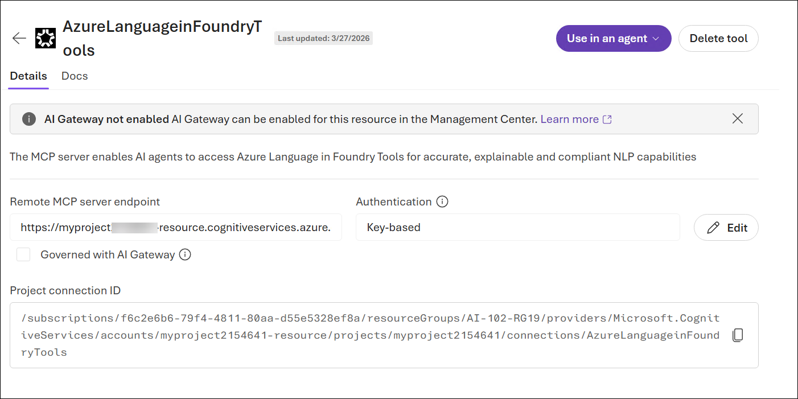

1. On the details page for the Azure Language in Foundry Tools connection, select **Use in an agent (1)**, and then select the **Text-Analysis-Agent (2)** agent you created previously.

    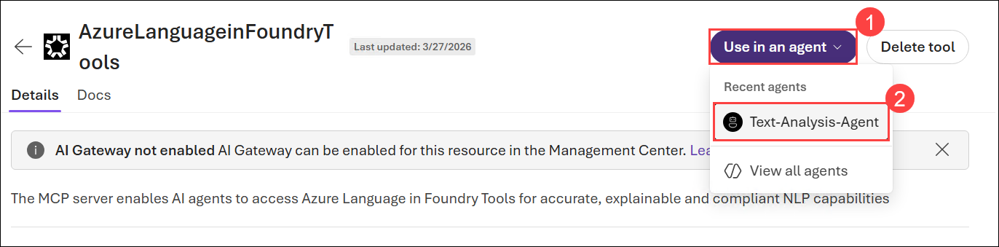

1. The agent should open in the playground, with the Azure Language in Foundry Tools tool connected.

    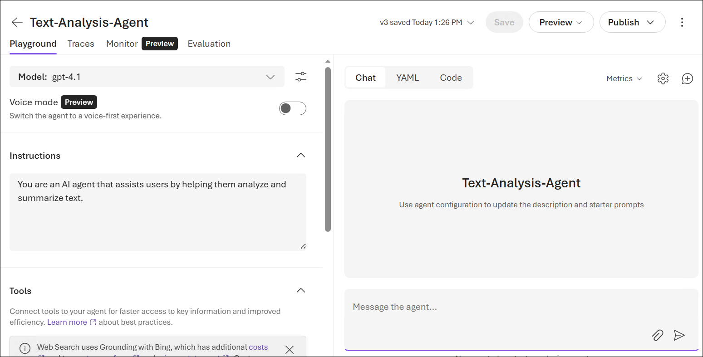

## Task 4: Test the Azure Language tool in the playground

In this task, you'll test the agent’s ability to use the Azure Language tool to analyze and summarize text.

1. In the agent playground for the **Text-Analysis-Agent** agent, modify the instructions as follows **(1)** and then click **Save (2)**:

    ```
    You are an AI agent that assists users by helping them analyze and summarize text. Use the Azure Language tool to perform text analysis tasks.
    ```

    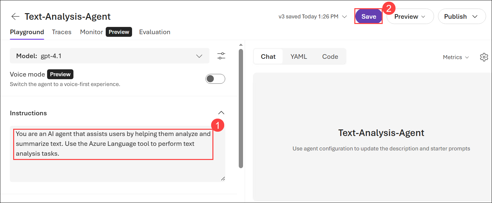

1. Test the agent by entering the following prompt in the **Chat** pane **(1)**, and then select the **Send** icon **(2)**:

    ```
    Summarize this article, and use named entity recognition to identify people, places, and dates:

    Microsoft was founded on April 4, 1975, by childhood friends Bill Gates (then 19) and Paul Allen (22) after they were inspired by the Altair 8800, one of the first personal computers, featured on the cover of *Popular Electronics*. They contacted the Altair’s maker, MITS, and successfully developed a version of the BASIC programming language, despite initially not owning the machine themselves. The pair formed a partnership called “Micro‑Soft” in Albuquerque, New Mexico, close to MITS’s headquarters, with the goal of writing software for emerging microcomputers.

    In the late 1970s, Microsoft grew by supplying programming languages to multiple hardware vendors, then relocated to the Seattle area in 1979. A pivotal moment came in 1980 when Microsoft partnered with IBM to provide an operating system for the IBM PC, leading to MS‑DOS and establishing the company’s dominance in personal computing. Gates guided the company’s long-term strategy as CEO, while Allen contributed key technical vision in its early years, setting Microsoft on a path that would reshape the software industry.
    ```

    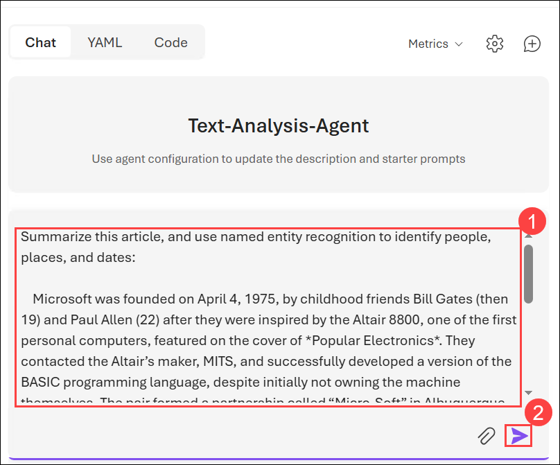

1. When prompted, select **Approve** **(1)**, and then choose **Always approve all Azure Language in Foundry Tools tools** **(2)** to allow the tool. You may need to repeat this step twice, as the prompt requests approval for two separate text analysis actions.

    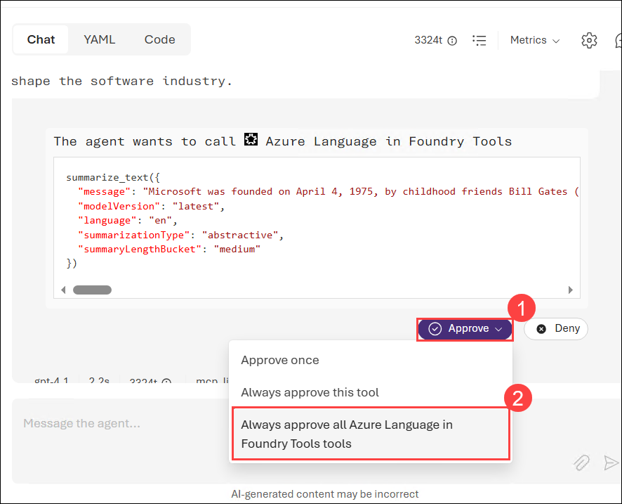

1. Review the response, which should summarize the article about the founding of Microsoft and list the key people, places, and dates it mentions.

    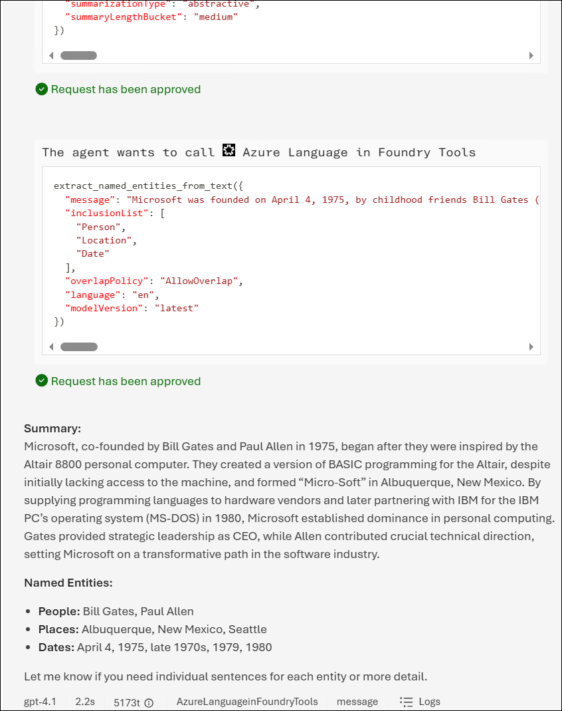

1. Review the **Logs** for the chat and verify that the Azure Language tool was used by the agent to process the prompt.

    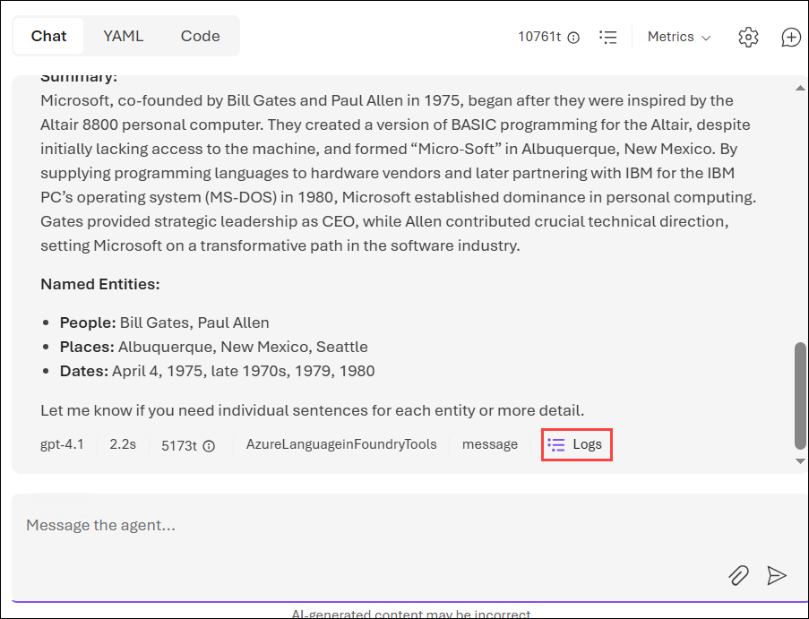

    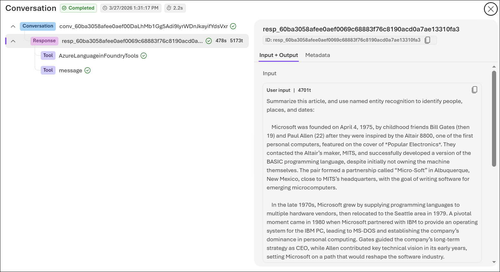

## Task 5: Configure tool approval

In this task, you'll configure automatic approval settings for the Azure Language tool to streamline agent interactions.

1. In the playground, under **Instructions**, locate the **Tools** section. In the menu (1) for the **Azure Language in Foundry Tools** tool you added, select **Configure** (2).

    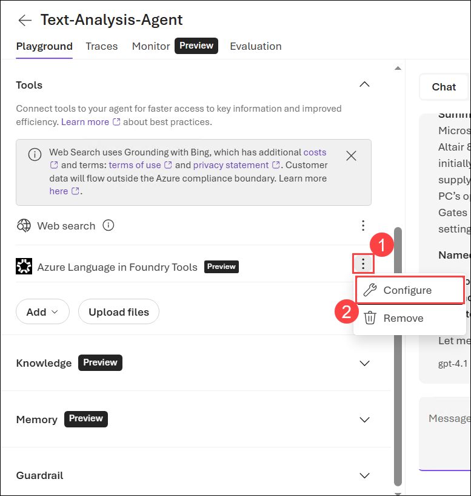

1. Ensure that the **Approval setting for tools in this MCP server for this agent** setting is **Always auto-approve all tools (1)** (if not, change it) and then click on **Add (2)**.

    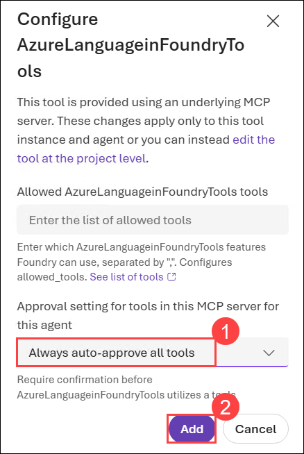

1. Select **Save** to apply and store any changes made to the agent.

    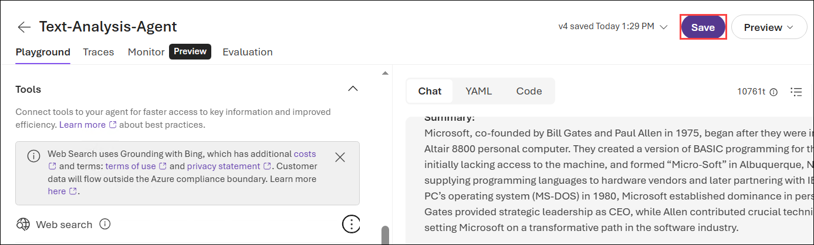

## Task 6: Create a client application

In this task, you'll set up your development environment, clone the repository, and configure the application in Visual Studio Code.

### Get the application files from GitHub

1. On the desktop, locate **Visual Studio Code**, and then double-click the icon to open it.

    

1. Open the Command Palette by pressing **Ctrl+Shift+P** , type **`Git: Clone`** **(1)**, and then select **Git: Clone** (2) from the list.

    

1. In the Command Palette, enter the repository URL `https://github.com/microsoftlearning/mslearn-ai-language` **(1)**, and then select **Clone from URL** **(2)** to clone the repository to a local folder.

    
 
1. In the folder selection window, choose the **Downloads** folder **(1)**, and then select **Select as Repository Destination** **(2)**.

    

1. When prompted, select **Open** to open the cloned repository in Visual Studio Code.

    

1. When prompted, select **Yes, I trust the authors** to trust the folder and enable all features.

    

1. After cloning the repository, in the **Explorer** pane, expand the **Labfiles** folder **(1)**, and then navigate to **02-language-agent > Python > text-agent** **(2)**.

    In this folder, locate the application files **(3)**, which include:

    * **.env :** the application configuration file
    * **requirements.txt:** the Python package dependencies
    * **text-agent.py:** the main application code file

        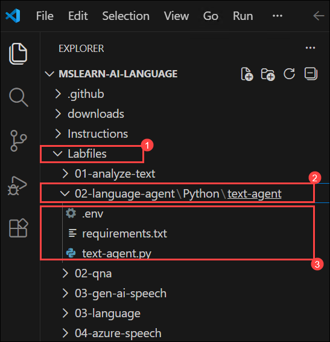

### Configure the application

1. In Visual Studio Code, open the **Extensions** pane **(1)**, search for **Python** **(2)**, select the **Python** extension by Microsoft **(3)**, and then click **Install** **(4)** if it is not already installed.

    

1. In the **Explorer** pane **(1)**, right-click the **requirements.txt** file **(2)**, and then select **Open in Integrated Terminal** **(3)**.

    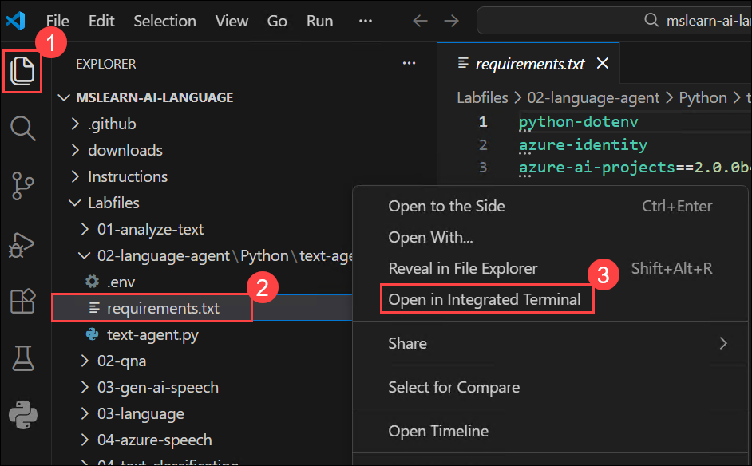

1. In the terminal, enter the following command to install the required Python packages in a virtual environment:

    ```
    python -m venv labenv
    .\labenv\Scripts\Activate.ps1
    pip install -r requirements.txt
    ```

    >**Note:** This will create a virtual environment and install the Foundry SDK package, the Azure Identity package, and other required packages.

1. Ensure that the terminal is open in the **text-agent** folder and verify that the prompt shows **(.labenv)**, indicating that the Python virtual environment is active.

    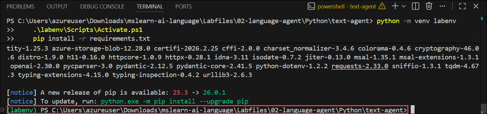

1. In the **Explorer** pane, within the **text-agent** folder, select the **.env** file **(1)** to open it. Update the configuration by pasting your project **endpoint** (copied in the first task) into the `FOUNDRY_ENDPOINT` field **(2)**, and ensure the `AGENT_NAME` is set to **Text-Analysis-Agent** (case-sensitive). Then press **Ctrl+S** to save the changes.

    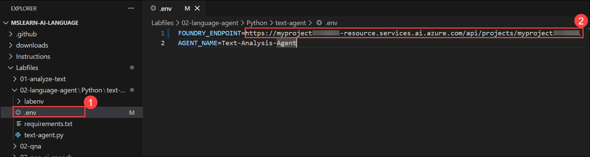

### Implement application code

1. In the **Explorer** pane, in the **text-agent** folder,  open the **text-agent.py** file.

    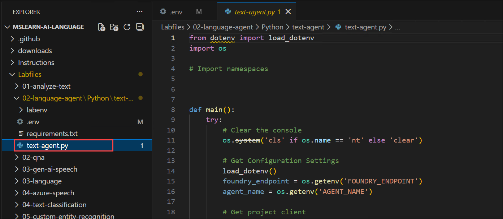

1. Review the existing code. You will add code to submit prompts to your agent.

    > **Note:** As you add code to the code file, be sure to maintain the correct indentation.

1. At the top of the code file, under the existing namespace references, find the comment **Import namespaces** and add the following code to import the namespaces you will need:

    ```python
    # import namespaces
    from azure.identity import DefaultAzureCredential
    from azure.ai.projects import AIProjectClient
    ```

    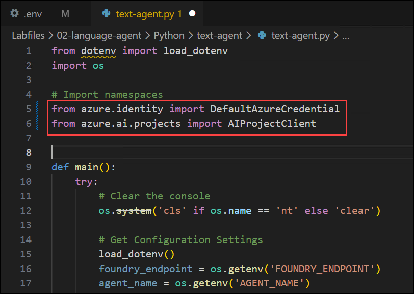

1. In the **main** function, note that code to load the endpoint and key from the configuration file has already been provided. Then find the comment **Get project client**, and add the following code to create a client for your Foundry project:

    ```python
    # Get project client
    project_client = AIProjectClient(
            endpoint=foundry_endpoint,
            credential=DefaultAzureCredential(),
    )
    ```

    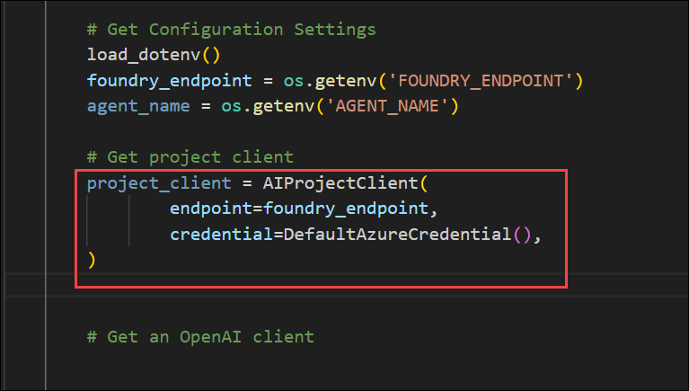

1. Find the comment **Get an OpenAI client**, and add the following code to get an OpenAI client with which to call your agent.

    ```python
    # Get an OpenAI client
    openai_client = project_client.get_openai_client()
    ```

    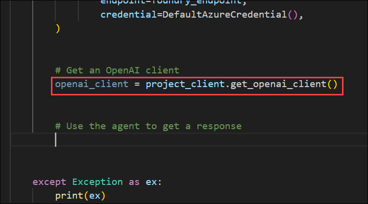

1. Find the comment **Use the agent to get a response**, and add the following code to submit a user prompt to your agent, and display the response.

    ```python
    # Use the agent to get a response
    prompt = input("User prompt: ")
    response = openai_client.responses.create(
            input=[{"role": "user", "content": prompt}],
            extra_body={"agent_reference": {"name": agent_name, "type": "agent_reference"}},
    )

    print(f"{agent_name}: {response.output_text}")
    ```

    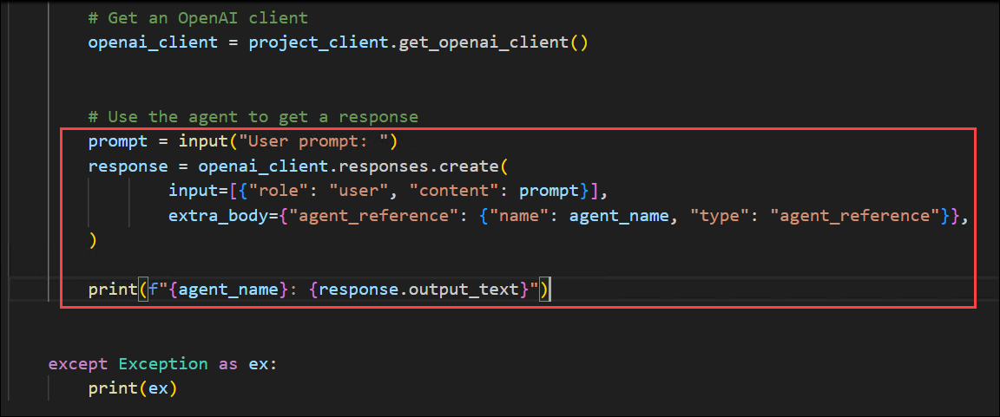

1. Press **Ctrl + S** to save the changes you made to the code file.

## Task 7: Test the client application

In this task, you'll authenticate with Azure, run the Python application, and test the agent’s functionality.

1. In the Visual Studio Code terminal, enter the following command to sign into Azure

   ```powershell
    az login
    ```

    > **Note:** Minimize the VS Code to see the **Sign in** window.

1. In the **Sign in** window, select **Work or school account** **(1)**, and then select **Continue** **(2)**.

    

1. On the **Sign in** page, provide the credentials below:
 
   - **Email/Username:** <inject key="AzureAdUserEmail"></inject>
    
     

   - **Password:** <inject key="AzureAdUserPassword"></inject>
    
     

1. When prompted, select **Yes** to sign in to all apps and websites on this device.

    

1. On the **Account added to this device** window, select **Done** to complete the sign-in process.

    

1. In the Visual Studio Code terminal, press **Enter** to select the default subscription.

    

1. After you have signed in, enter the following command to run the application:

    ```powershell
    python text-agent.py
    ```

1. When prompted, enter the following prompt:

    ```
    Extract named entities from the following text: "Pierre and I went to Paris on July 14th."
    ```

    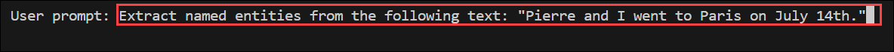

1. Review the response, which should identify named people, places, and dates.

    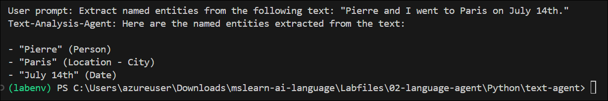

## Task 8: View tool details

In this task, you'll examine the detailed response from the agent to understand how it uses available tools for text analysis.

1. In the **text-agent.py** code file, add the following line immediately after the **print(f"{agent_name}: {response.output_text}")** line you added previously (before the *except Exception as ex:* line):

    ```python
    print(f"\nResponse Details: {response.model_dump_json(indent=2)}")
    ```

    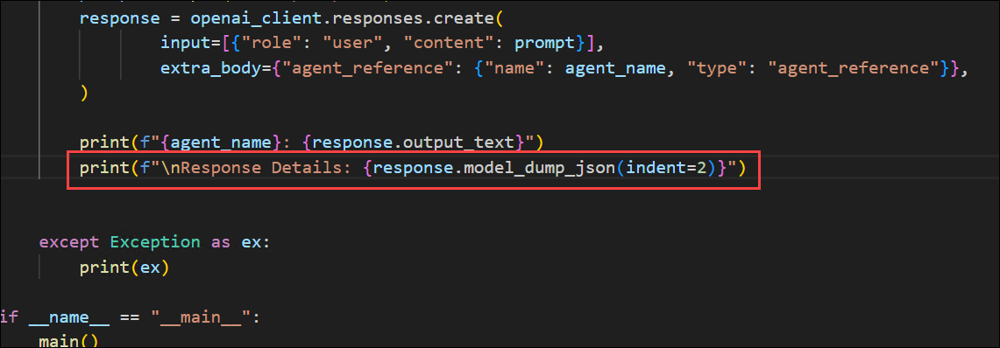

1. Save the changes to the code file by pressing **Ctrl+S**.

1. In the terminal, re-enter the command to run the application:
    
    ```
    python text-agent.py
    ```

1. When prompted, enter the following command:

    ```
    Tell me what entities and dates are mentioned in this review, and whether it is positive or negative: "I booked my flight to Paris in July with Margie's Travel, and it was fantastic!"
    ```

1. Review the response (you may need to scroll quite far up to see it), which should identify entities and dates, and determine the sentiment of the text.

    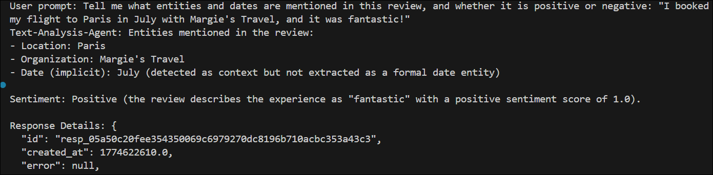

1. Review the JSON response details, which indicate each of the tools available to the agent. In this case, it should have used the **extract_named_entities_from_text** and **detect_sentiment_from_text** tools within Azure Language in Foundry Tools.

## Summary

In this exercise, you created an AI-powered text analysis agent using Microsoft Foundry and integrated it with Azure Language tools to perform tasks such as summarization, entity recognition, and sentiment analysis. You configured the agent, connected it to an MCP tool, and tested its capabilities in the playground. You then built a Python-based client application, authenticated with Azure, and interacted with the agent programmatically to analyze text and retrieve insights. Great work!


### You have successfully completed the Hands-on Lab!


