# Lab 20: Use speech-capable generative AI models

### Estimated Duration: 60 Minutes

## Overview

In this lab, you will build and configure speech-enabled applications using Azure AI in the Microsoft Foundry environment. You will create a project, deploy speech-capable generative AI models, and set up Python-based applications from a GitHub repository. Using these applications, you will generate speech from text and transcribe spoken audio into text by integrating with deployed models. Finally, you will run and test both applications to understand how speech generation and transcription can be implemented using generative AI.

## Lab Objectives

- **Task 1:** Create a Microsoft Foundry project

- **Task 2:** Deploy models

- **Task 3:** Get the application files from GitHub

- **Task 4:** Create a speech-generation app

- **Task 5:** Create a speech-transcription app

> **Note:** Some of the technologies used in this exercise are in preview or in active development. You may experience some unexpected behavior, warnings, or errors.

## Task 1: Create a Microsoft Foundry project

In this task, you will create a new project in the Microsoft Foundry portal and set up its configuration.

1. Open a new tab in the browser, right-click on the following link [Foundry portal](https://ai.azure.com), then **Copy link** and paste it in a browser tab to log in to **Microsoft Foundry portal**.

1. Click on **Sign in**.
 
    

1. If prompted, provide the credentials below:
 
   - **Email/Username:** <inject key="AzureAdUserEmail"></inject>
    
     

   - **Password:** <inject key="AzureAdUserPassword"></inject>
    
     

1. When the **Stay signed in?** window appears, select **No**.

    
    
    >**Note:** Close any tips or quick start panes that are opened the first time you sign in, and if necessary use the **Foundry** logo at the top left to navigate to the home page, which looks similar to the following image (close the **Help** pane if it's open):

1. At the top of the **Microsoft Foundry** portal, enable the **New Foundry toggle (1)** to switch to the latest Foundry user interface.

1. From the **Select a project to continue** dialog, click the drop-down under **Select or search for a project**, and then select **Create a new project (2)**.

     

1. In the **Create a project** window, enter **Myproject<inject key="DeploymentID" enableCopy="false"/> (1)** as the project name. Open the **Advanced options (2)** drop-down, fill in the following details, and then click **Create (7)**:

    * Subscription: **Choose Default Subscription (3)**
    * Resource group: **AI-102-RG20 (4)**
    * Microsoft Foundry resource: **Keep as Default (5)**
    * Region: **<inject key="Region" enableCopy="false" /> (6)**

      

      >**Note:** Some Azure AI resources are constrained by regional model quotas. In the event of a quota limit being exceeded later in the exercise, there's a possibility you may need to create another resource in a different region.

1. Wait for your project created. It may take a few minutes.

> **Congratulations** on completing the task! Now, it's time to validate it. Here are the steps:
>
> - Hit the Validate button for the corresponding task. If you receive a success message, you can proceed to the next task.
> - If not, carefully read the error message and retry the step, following the instructions in the lab guide.
> - If you need any assistance, please contact us at cloudlabs-support@spektrasystems.com. We are available 24/7 to help.
 
<validation step="bf5319bc-c868-469d-bf80-569b45487845" />

## Task 2: Deploy models

In this task, you will deploy speech-capable generative AI models. You will deploy a text-to-speech model for generating audio and a speech-to-text model for transcribing audio input.

### Task 2.1 Deploy a speech-generation model

In this task, you will deploy a text-to-speech model in Microsoft Foundry to generate audio from text input.

1. On the **Microsoft Foundry** home page, click **Start building (1)**, and then select **Find models (2)** from the drop-down menu.

     

1. On the **Models** page, search for **gpt-4o-mini-tts (1)** in the search bar, and then select the **gpt-4o-mini-tts (2)** model from the search results.

    

1. On the **gpt-4o-mini-tts** model details page, click **Deploy (1)**, and then select **Default settings (2)** to deploy the model using the standard configuration.

    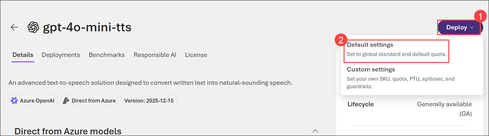

1. Once the model has been deployed, the model playground will open automatically so you can test your model:   

1. When the model has been deployed, view its details, noting that the **Target URI** required to use it are available here (you'll need the Target URI later).

    

    >**Note:** Copy and save the Target URI in a notepad,

1. On the model details page, select the **Back (1)** arrow to return to the previous screen.

    

### Task 2.2: Deploy a speech-recognition model

In this task, you will deploy a speech-to-text model in Microsoft Foundry to transcribe audio into text.

1. On the **Models** page, search for **gpt-4o-mini-transcribe (1)** in the search bar, and then select the **gpt-4o-mini-transcribe (2)** model from the search results.

    

1. On the **gpt-4o-mini-transcribe** model details page, click **Deploy (1)**, and then select **Default settings (2)** to deploy the model using the standard configuration.

    

1. Once the model has been deployed, the model playground will open automatically.

> **Congratulations** on completing the task! Now, it's time to validate it. Here are the steps:
>
> - Hit the Validate button for the corresponding task. If you receive a success message, you can proceed to the next task.
> - If not, carefully read the error message and retry the step, following the instructions in the lab guide.
> - If you need any assistance, please contact us at cloudlabs-support@spektrasystems.com. We are available 24/7 to help.
 
<validation step="67e9b90a-26c0-4a2a-a34d-e48863a85dd6" />

## Task 3: Get the application files from GitHub

In this task, you will clone the GitHub repository and set up the development environment in Visual Studio Code.

1. Open the **Visual Studio Code** from the desktop.

    

1. In Visual Studio Code, select **Extensions (1)** from the left pane, search for **Python (2)**, choose the **Python (3)** extension by Microsoft, and then click **Install (4)**.

    

1. Navigate to the **Welcome** page in VS Code by selecting the ellipsis **(...) (1)** from the top bar, then **Help (2)**, and finally **Welcome (3)**.

    

1. On the **Get Started** page, select **Mark Done** to complete this step and proceed.

    

1. Select **Clone Git Repository... (1)**, paste the repository URL **(2)** `https://github.com/microsoftlearning/mslearn-ai-language`, and then choose **Clone from URL (3)** to proceed.

    

1. Select the destination folder **C:\LabFiles (1)** and click **Select as Repository Destination (2)** to proceed.

    

1. When prompted, select **Open** to open the cloned repository.

    

1. In the trust prompt, select **Yes, I trust the authors (1)** to continue.

    

## Task 4: Create a speech-generation app

In this task, you will configure and run a Python application to generate speech from text using a deployed model.

1. After the repo has been cloned, in the Explorer pane, expand the folder **Labfiles (1)** → **03-gen-ai-speech\Python (2)** select **generate-speech (3)**. The application files include: 

    - **.env** (the application configuration file)
    - **requirements.txt** (the Python package dependencies that need to be installed)
    - **generate-speech.py** (the code file for the application)

       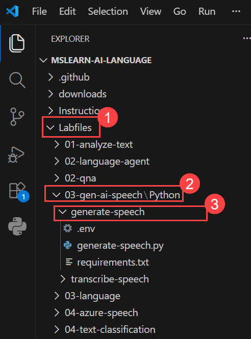

### Task 4.1 Configure your application

In this task, you will set up the Python environment, install dependencies, and update configuration settings with the model endpoint.

1. Right-click on the **requirements.txt (1)** file under **generate-speech** folder and select **Open in Integrated Terminal (2)**.

    

1. In the terminal, enter the following command to install the required Python packages in a virtual environment:

    ```
    python -m venv labenv
    .\labenv\Scripts\Activate.ps1
    pip install -r requirements.txt
    ```

1. In the **Explorer** pane, in the **generate-speech** folder, select the **.env (1)** file to open it. Then update the configuration values to include the **Target URI (2)** (endpoint) for your **gpt-4o-mini-tts** model which copied in previous task.

    

1. Once done, press **Ctrl+S** to save the changes.

### Task 4.2 Write code to use the model for speech-generation

In this task, you will add code to integrate the speech-generation model and generate audio from text input.

1. In the **Explorer** pane, in the **generate-speech** folder, select the **generate-speech.py** file to open it.

    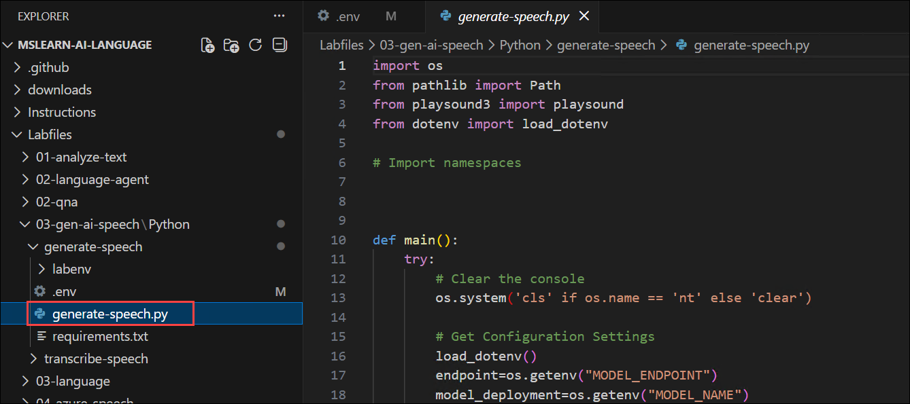

1. Review the existing code. You will add code to use the OpenAI SDK to access your model.

    > **Tip:** As you add code to the code file, be sure to maintain the correct indentation.

1. At the top of the code file, under the existing namespace references, find the comment **Import namespaces** and add the following code to import the namespace you will need to use the OpenAI SDK:

    ```python
   # import namespaces
   from openai import AzureOpenAI
   from azure.identity import DefaultAzureCredential, get_bearer_token_provider
    ```

    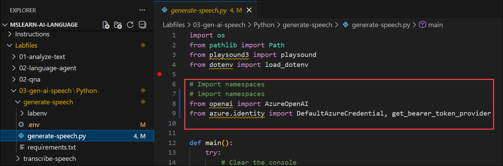

1. In the **main** function, note that code to load the endpoint and key from the configuration file has already been provided. Then find the comment **Create the Azure OpenAI client**, and add the following code to create a client for the OpenAI API:

    ```Python
    # Create the Azure OpenAI client
    token_provider = get_bearer_token_provider(                    
         DefaultAzureCredential(), "https://ai.azure.com/.default"
     )

    client = AzureOpenAI(
         azure_endpoint=endpoint,
         azure_ad_token_provider = token_provider,
         api_version="2025-03-01-preview"
    )
    ```

     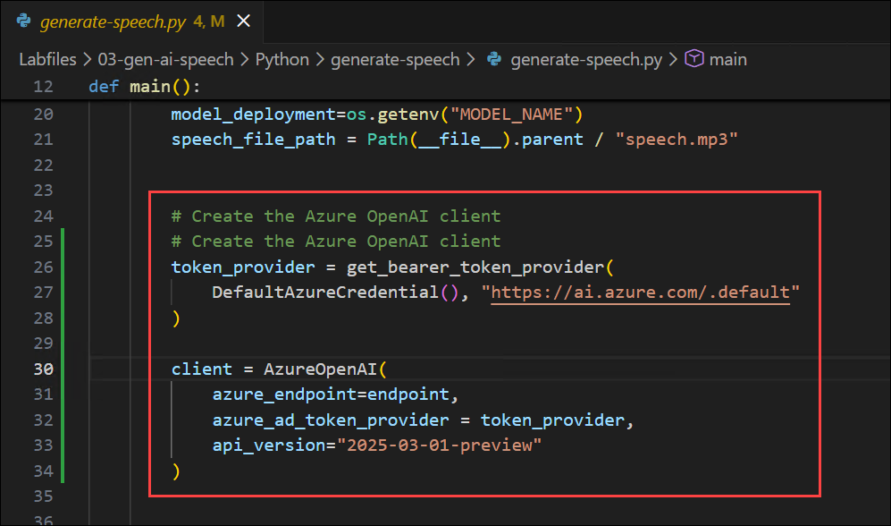

1. Find the comment **Generate speech and save to file**, and add the following code to submit a prompt to the speech-generation model save the response as a file.

    ```Python
   # Generate speech and save to file
   with client.audio.speech.with_streaming_response.create(
                model=model_deployment,
                voice="alloy",
                input="My voice is my passport!",
                instructions="Speak in a serious tone.",
            ) as response:
        response.stream_to_file(speech_file_path)
    ```

    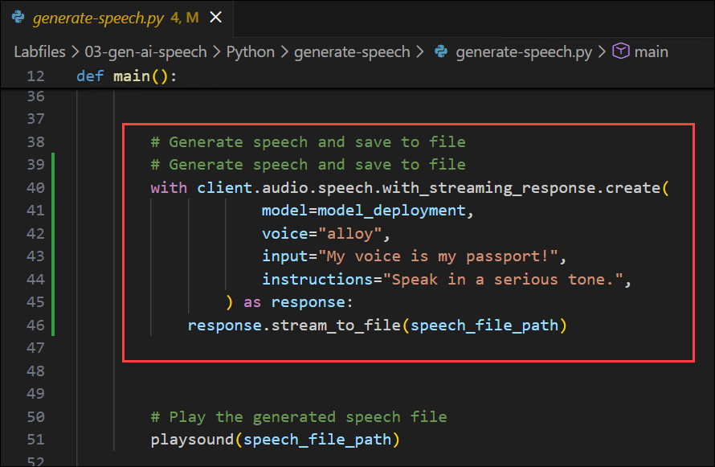

1. Save the changes to the code file by pressing **Ctrl+S**. 

### Task 4.3 Run the application

In this task, you will authenticate with Azure and run the application to generate and save speech output.

1. In the Visual Studio Code terminal, enter the following command to sign into Azure

    ```powershell
        az login
        ```

     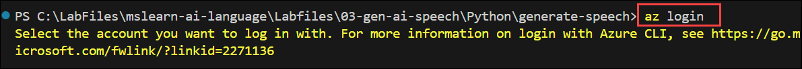

     > **Note:** Minimize the VS Code to see the **Sign in** window.

1. In the **Sign in** window, select **Work or school account** **(1)**, and then select **Continue** **(2)**.

    

1. On the **Sign in** page, provide the credentials below:
 
    - **Email/Username:** <inject key="AzureAdUserEmail"></inject>
    
      

    - **Password:** <inject key="AzureAdUserPassword"></inject>
    
      

1. When prompted, select **Yes** to sign in to all apps and websites on this device.

    

1. On the **Account added to this device** window, select **Done** to complete the sign-in process.

    

1. In the Visual Studio Code terminal, press **Enter** to select the default subscription.

1. After you have signed in, enter the following command to run the application:

    ```
   python generate-speech.py
    ```

1. Observe the output as the code generates the requested speech and saves it in a file. You can select the **speech.mp3** file that is generated in the voice-mail folder to play it in Visual Studio Code.

    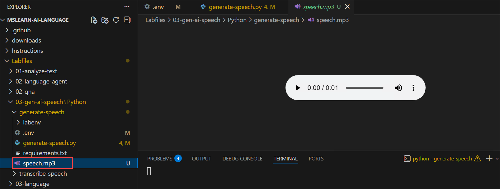

## Task 5: Create a speech-transcription app

In this task, you will configure and develop a Python application that uses a deployed speech-to-text model to transcribe audio into text and display the results.

1. In the Explorer pane, navigate to the folder containing the application code files at **/Labfiles/03-gen-ai-speech/Python/** → select **transcribe-speech (3)**. The application files include:
    
    - **.env** (the application configuration file)
    - **requirements.txt** (the Python package dependencies that need to be installed)
    - **transcribe-speech.py** (the code file for the application)

        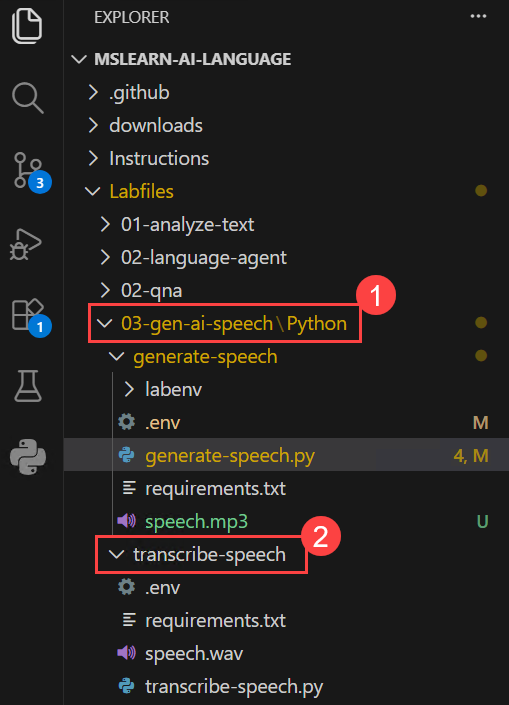

### Task 5.1 Configure your application

In this task, you will set up the Python environment and configure the application with the speech-transcription model endpoint.

1. Right-click on the **requirements.txt (1)** file under **transcribe-speech** folder and select **Open in Integrated Terminal (2)**.

    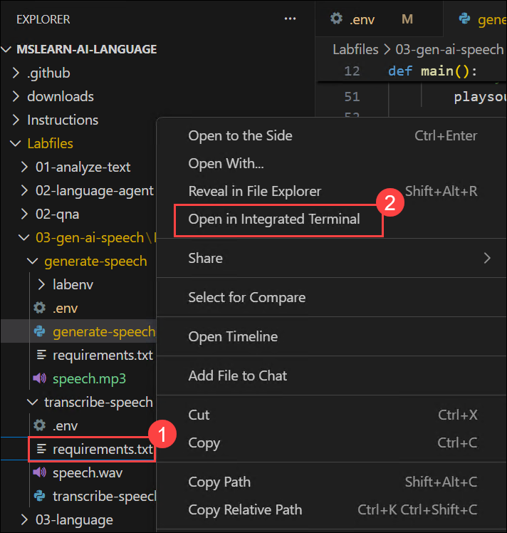

1. In the terminal, enter the following command to activate virtual environment:

    ```
    ..\generate-speech\labenv\Scripts\Activate
    ```

1. In the **Explorer** pane, in the **transcribe-speech** folder, select the **.env (1)** file to open it. Then update the configuration values to include the **Target URI (2)** (endpoint) for your **gpt-4o-mini-transcribe** model.

    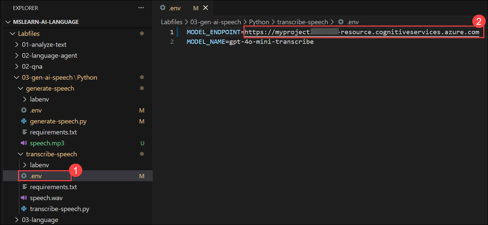

1. Once done, press **Ctrl+S** to save the changes.

### Task 5.2 Write code to use the model for speech-transcription

In this task, you will add code to integrate the speech-transcription model and convert audio input into text.

1. In the **Explorer** pane, in the **transcribe-speech** folder, select the **transcribe-speech.py** file to open it.

    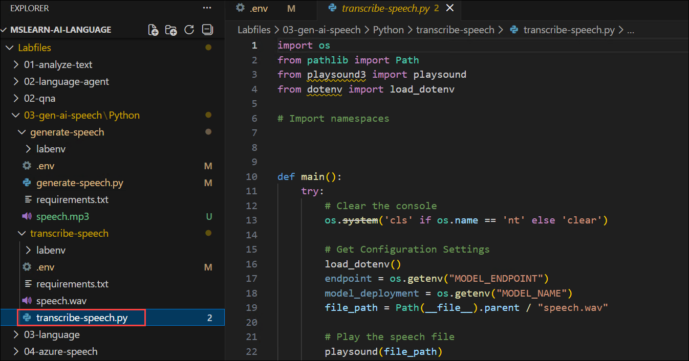

1. Review the existing code. You will add code to use the OpenAI SDK to access your model.

    > **Tip:** As you add code to the code file, be sure to maintain the correct indentation.

1. At the top of the code file, under the existing namespace references, find the comment **Import namespaces** and add the following code to import the namespace you will need to use the OpenAI SDK:

    ```python
   # import namespaces
   from openai import AzureOpenAI
   from azure.identity import DefaultAzureCredential, get_bearer_token_provider
    ```

    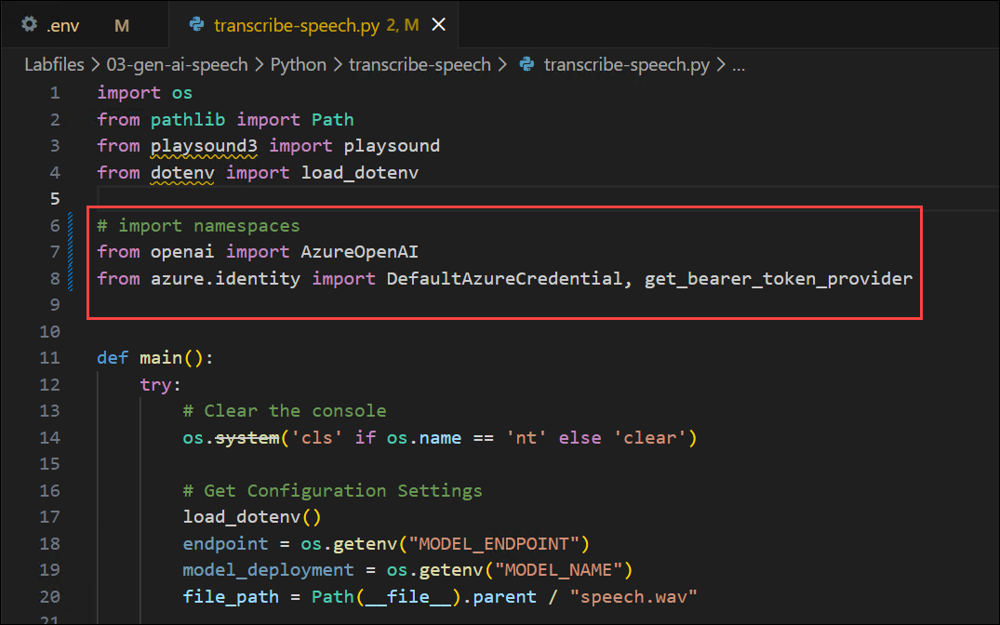

1. In the **main** function, note that code to load the endpoint and key from the configuration file has already been provided. Then find the comment **Create the Azure OpenAI client**, and add the following code to create a client for the OpenAI API:

    ```Python
    # Create the Azure OpenAI client
    token_provider = get_bearer_token_provider(                    
         DefaultAzureCredential(), "https://ai.azure.com/.default"
     )

    client = AzureOpenAI(
         azure_endpoint=endpoint,
         azure_ad_token_provider = token_provider,
         api_version="2025-03-01-preview"
    )
    ```

     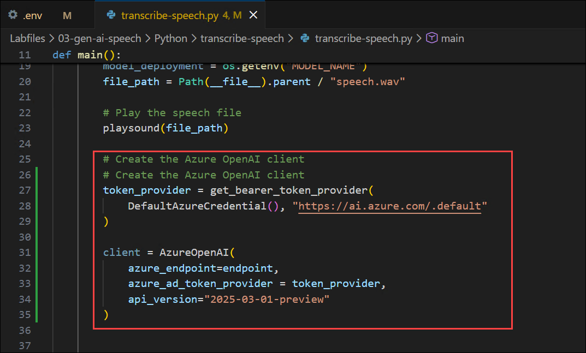

1. Find the comment **Call model to transcribe audio file**, and add the following code to submit an audio file to the speech-transcription model generate a transcript.

    ```Python
    # Call model to transcribe audio file
    audio_file = open(file_path, "rb")
    transcription = client.audio.transcriptions.create(
         model=model_deployment,
         file=audio_file,
         response_format="text"
    )
        
    print(transcription)    
    ```

    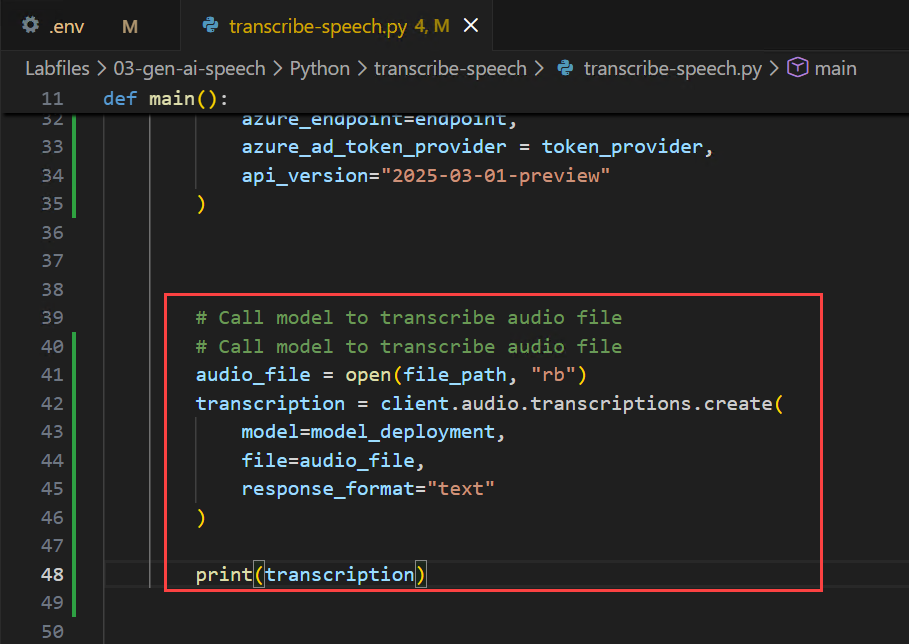

1. Save the changes to the code file by pressing **Ctrl+S**. 

### Task 5.3 Run the application

In this task, you will authenticate with Azure and run the application to transcribe audio and view the output.

1. In the Visual Studio Code terminal, enter the following command to sign into Azure

     ```powershell
     az login
     ```

     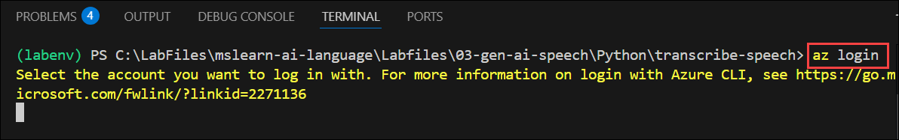

     > **Note:** Minimize the VS Code to see the **Sign in** window.

1. In the sign-in window, select your account **<inject key="AzureAdUserEmail"></inject> (1)** and click **Continue (2)** to proceed with authentication.

    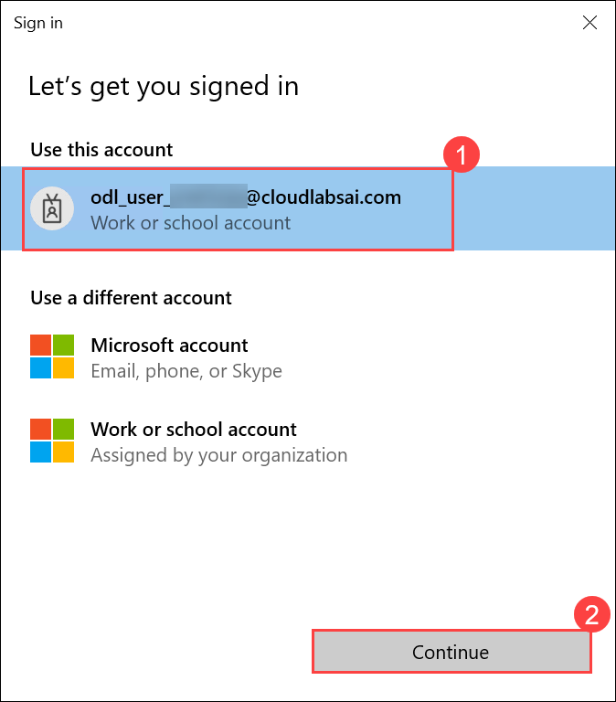

1. In the Visual Studio Code terminal, press **Enter** to select the default subscription.

1. After you have signed in, enter the following command to run the application:

    ```
   python transcribe-speech.py
    ```

1. Observe the output as the code submits the audio file to the model for transcription and displays the results. The code should also play the audio file.

    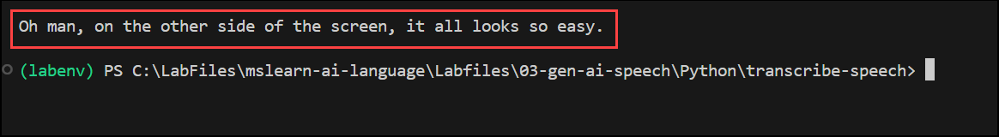

## Summary

In this lab, you created a Microsoft Foundry project and deployed speech-capable generative AI models. You set up Python-based applications, configured the environment, and authenticated using Azure credentials. You then developed applications to generate speech from text and transcribe audio into text by integrating with the deployed models. Finally, you executed and tested both applications to understand how speech generation and transcription can be implemented using generative AI.

### You have successfully completed the Hands-on Lab!