# Lab 20: Use speech-capable generative AI models

### Estimated Duration: 60 Minutes

## Overview

## Lab Objectives

- **Task 1:** Create a Microsoft Foundry project

- **Task 2:** Get the application files from GitHub

- **Task 3:** Configure your application

- **Task 4:** Add code to connect to your Azure AI Language resource

> **Note**: Some of the technologies used in this exercise are in preview or in active development. You may experience some unexpected behavior, warnings, or errors.

## Task 1: Create a Microsoft Foundry project

In this task, you will create a new project in the Microsoft Foundry portal and set up its configuration.

1. Open a new tab in the browser, right-click on the following link [Foundry portal](https://ai.azure.com), then **Copy link** and paste it in a browser tab to log in to **Microsoft Foundry portal**.

1. Click on **Sign in**.
 
    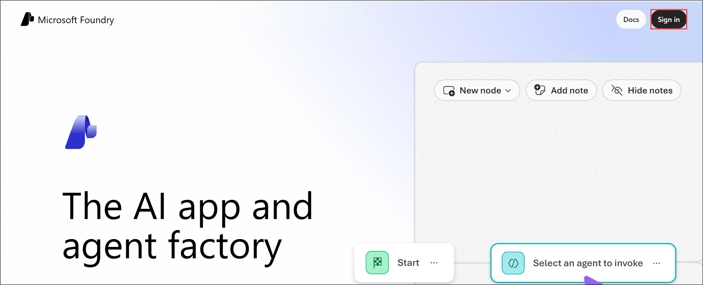

1. If prompted, provide the credentials below:
 
   - **Email/Username:** <inject key="AzureAdUserEmail"></inject>
    
     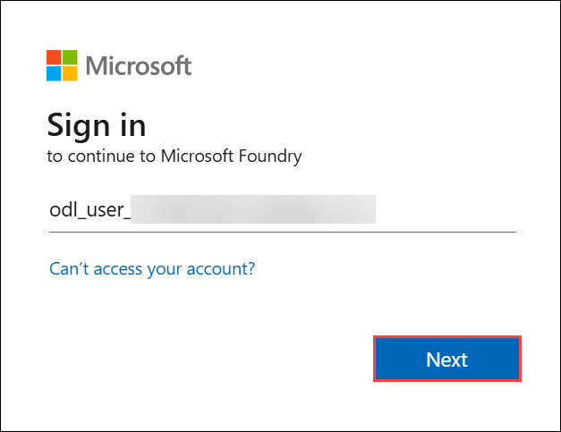

   - **Password:** <inject key="AzureAdUserPassword"></inject>
    
     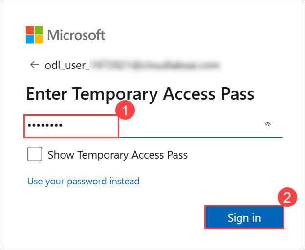

1. When the **Stay signed in?** window appears, select **No**.

    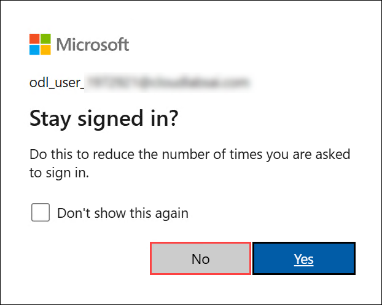
    
    >**Note:** Close any tips or quick start panes that are opened the first time you sign in, and if necessary use the **Foundry** logo at the top left to navigate to the home page, which looks similar to the following image (close the **Help** pane if it's open):

1. At the top of the **Microsoft Foundry** portal, enable the **New Foundry toggle (1)** to switch to the latest Foundry user interface.

1. From the **Select a project to continue** dialog, click the drop-down under **Select or search for a project**, and then select **Create a new project (2)**.

     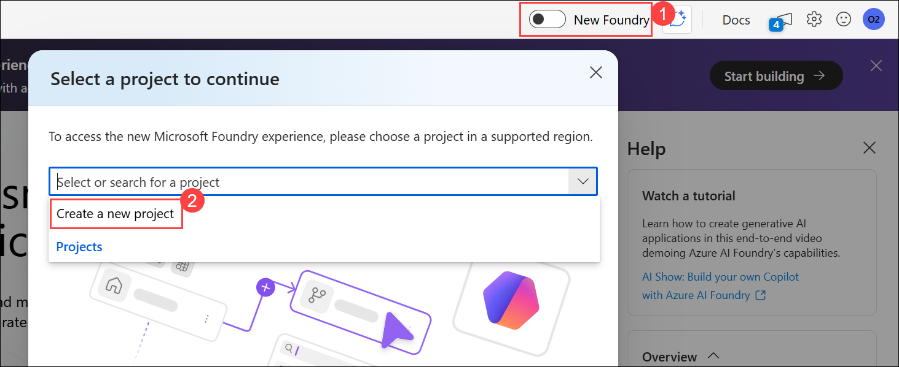

1. In the **Create a project** window, enter **Myproject<inject key="DeploymentID" enableCopy="false"/> (1)** as the project name. Open the **Advanced options (2)** drop-down, fill in the following details, and then click **Create (7)**:

    * Subscription: **Choose Default Subscription (3)**
    * Resource group: **AI-102-RG20 (4)**
    * Microsoft Foundry resource: **Keep as Default (5)**
    * Region: **<inject key="Region" enableCopy="false" /> (6)**

      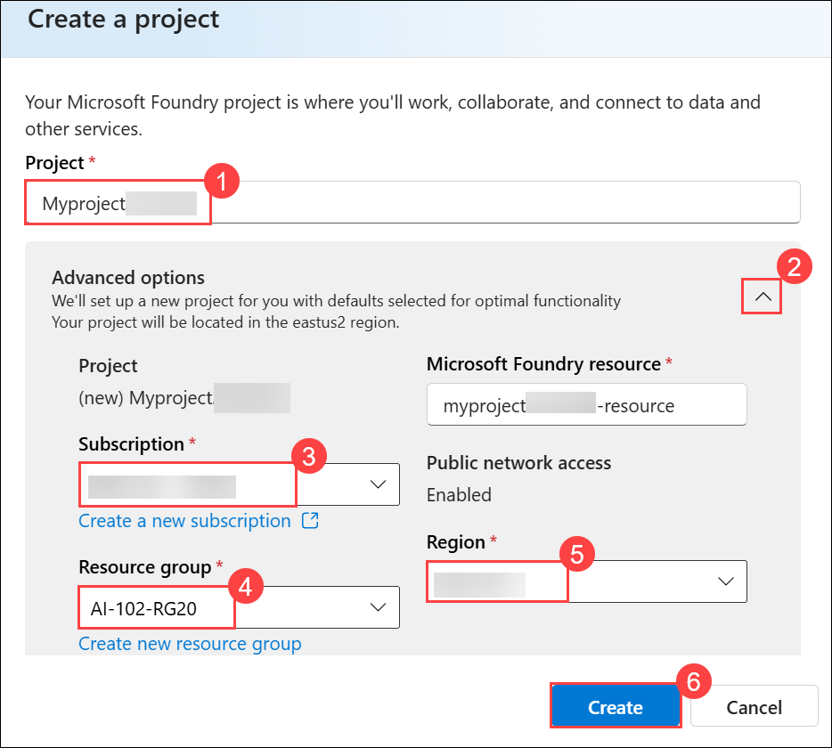

      >**Note:** Some Azure AI resources are constrained by regional model quotas. In the event of a quota limit being exceeded later in the exercise, there's a possibility you may need to create another resource in a different region.

1. Wait for your project created. It may take a few minutes.

## Task 2: Deploy models

To develop speech-enables apps, we're going to need speech-enabled models. Specifically, we need a model that can perform speech-generation, and a model that can process speech input.

### Task 2.1 Deploy a speech-generation model

1. On the **Microsoft Foundry** home page, click **Start building (1)**, and then select **Browse models (2)** from the drop-down menu.

   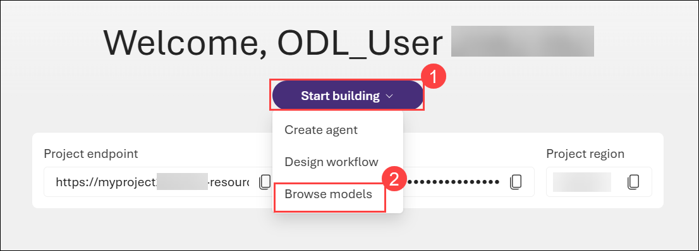 

1. On the **Models** page, search for **gpt-4o-mini-tts (1)** in the search bar, and then select the **gpt-4o-mini-tts (2)** model from the search results.

   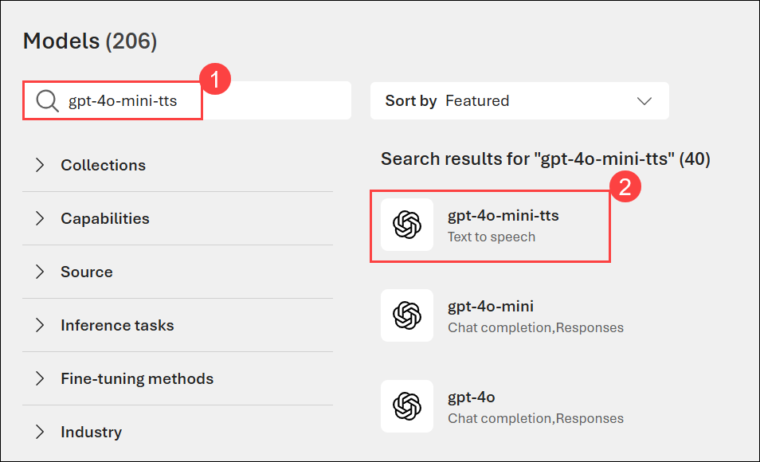

1. On the **gpt-4o-mini-tts** model details page, click **Deploy (1)**, and then select **Default settings (2)** to deploy the model using the standard configuration.

   

1. Once the model has been deployed, the model playground will open automatically so you can test your model:   

1. When the model has been deployed, view its details, noting that the **Target URI** required to use it are available here (you'll need the Target URI later).

    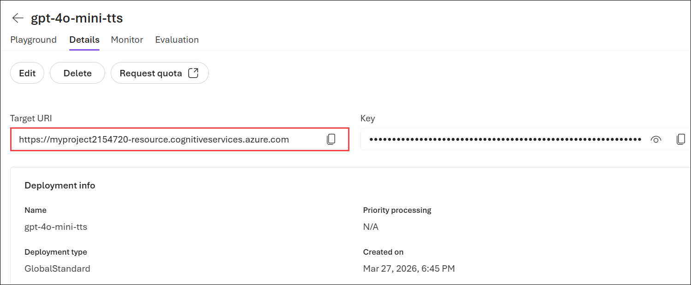

1. On the model details page, select the **Back (1)** arrow to return to the previous screen.

    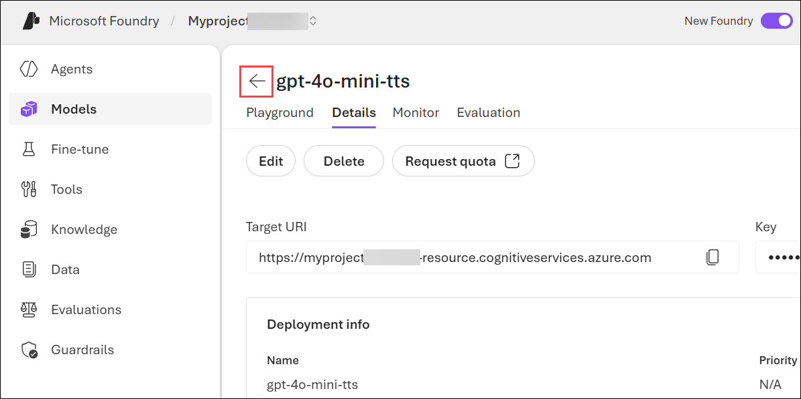

### Task 2.2: Deploy a speech-recognition model


1. On the **Models** page, search for **gpt-4o-mini-transcribe (1)** in the search bar, and then select the **gpt-4o-mini-transcribe (2)** model from the search results.

   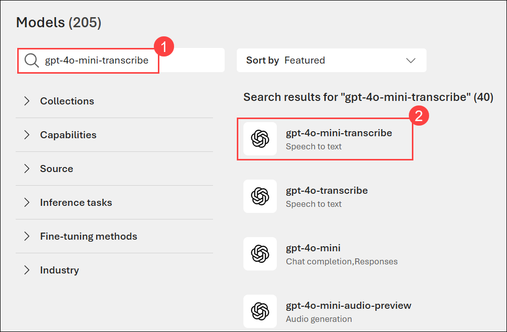

1. On the **gpt-4o-mini-transcribe** model details page, click **Deploy (1)**, and then select **Default settings (2)** to deploy the model using the standard configuration.

    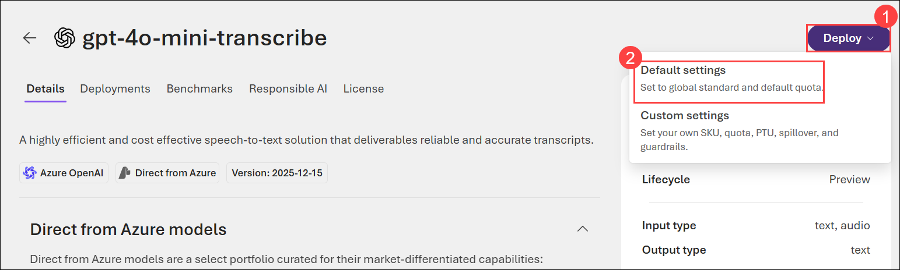

1. Once the model has been deployed, the model playground will open automatically so you can test your model:   

    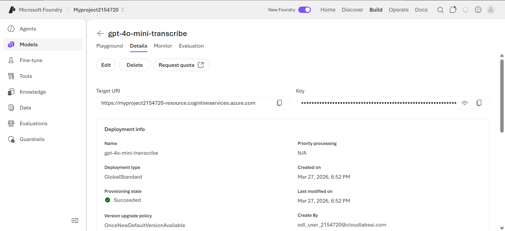

## Task 3: Get the application files from GitHub

The initial application files you'll need to develop speech applications are provided in a GitHub repo.
1. Open the **Visual Studio Code** from the desktop.

    

1. In Visual Studio Code, select **Extensions (1)** from the left pane, search for **Python (2)**, choose the **Python (3)** extension by Microsoft, and then click **Install (4)**.

   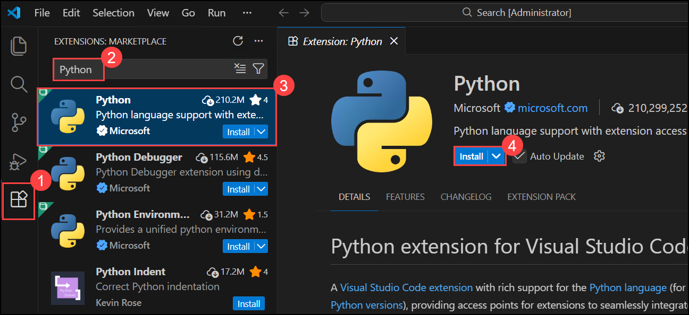

1. Navigate to the **Welcome** page in VS Code by selecting the ellipsis **(...) (1)** from the top bar, then **Help (2)**, and finally **Welcome (3)**.

    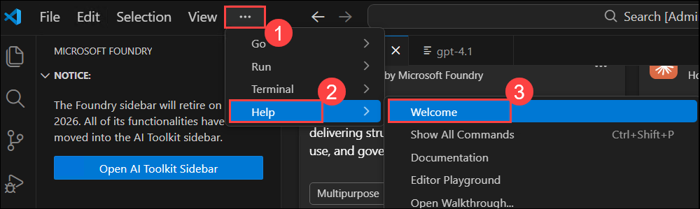

1. On the **Get Started** page, select **Mark Done** to complete this step and proceed.

    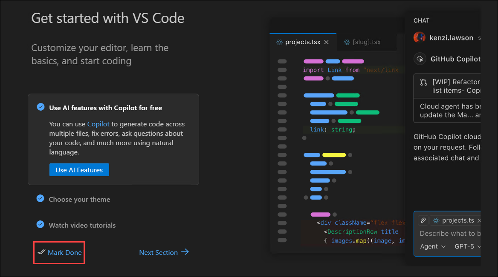

1. Select **Clone Git Repository... (1)**, paste the repository URL **(2)** `https://github.com/microsoftlearning/mslearn-ai-language`, and then choose **Clone from URL (3)** to proceed.

    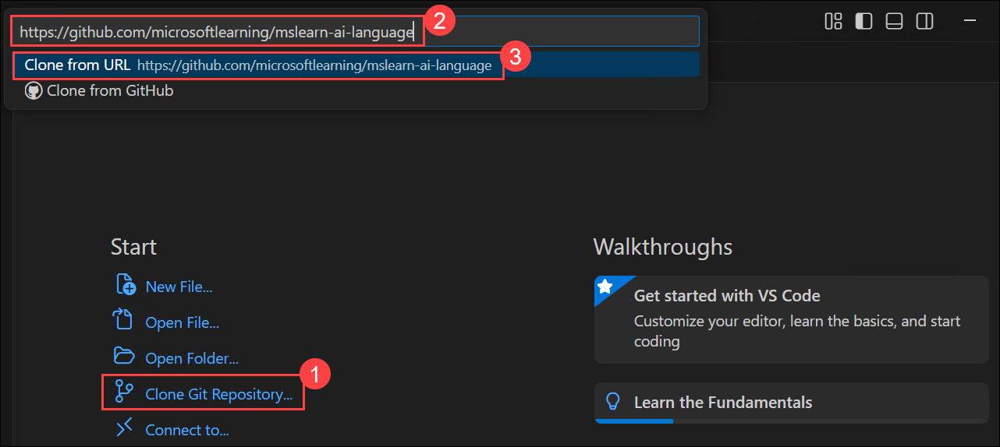

1. Select the destination folder **C:\LabFiles (1)** and click **Select as Repository Destination (2)** to proceed.

    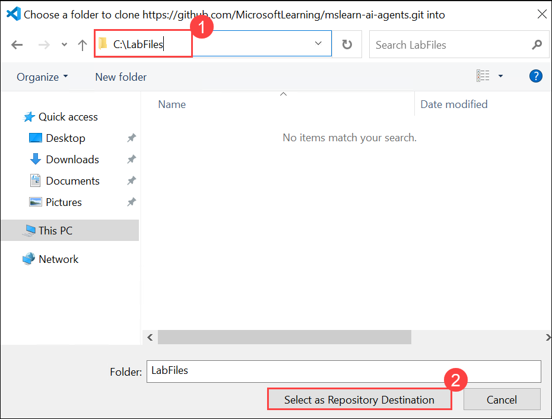

1. When prompted, select **Open** to open the cloned repository.

    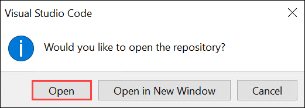

1. In the trust prompt, select **Yes, I trust the authors (1)** to continue.

   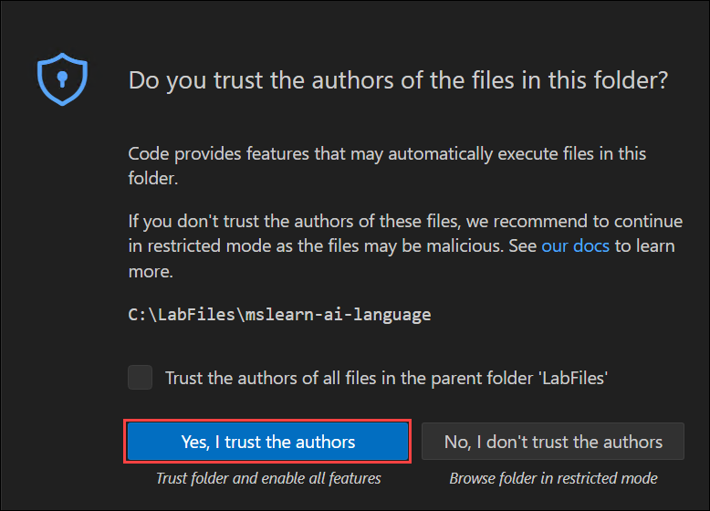

## Task 4: Create a speech-generation app

1. After the repo has been cloned, in the Explorer pane, navigate to the folder containing the application code files at **/Labfiles/03-gen-ai-speech/Python/generate-speech**. The application files include:
    - **.env** (the application configuration file)
    - **requirements.txt** (the Python package dependencies that need to be installed)
    - **generate-speech.py** (the code file for the application)

    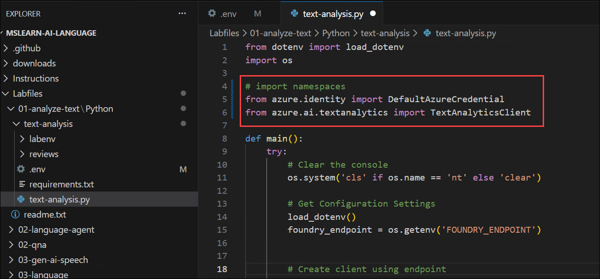

### Configure your application

1. Right-click on the **requirements.txt (1)** file and select **Open in Integrated Terminal (2)**.

    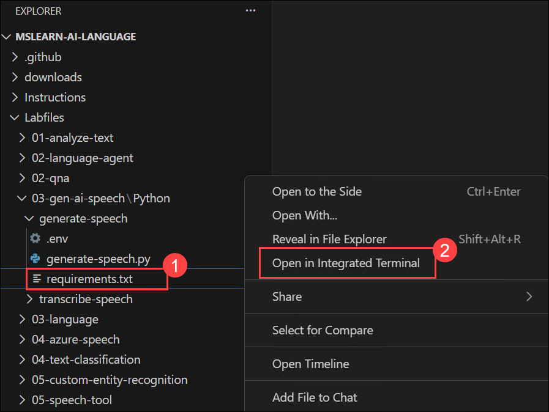

1. In the terminal, enter the following command to install the required Python packages in a virtual environment:

    ```
    python -m venv labenv
    .\labenv\Scripts\Activate.ps1
    pip install -r requirements.txt
    ```

1. In the **Explorer** pane, in the **generate-speech** folder, select the **.env** file to open it. Then update the configuration values to include the **Target URI** (endpoint) for your **gpt-4o-mini-tts** model.

    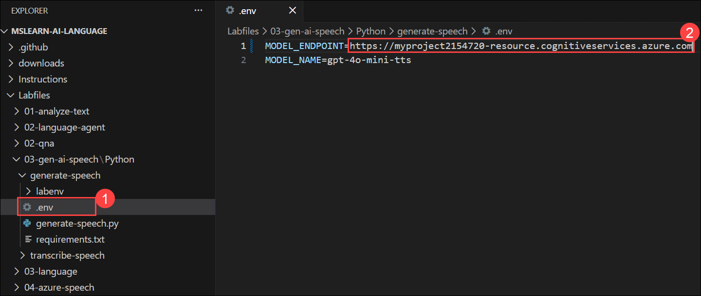

    > **Tip**: Copy the Target URI from the model details page in the Foundry portal.

    Save the modified configuration file.

### Write code to use the model for speech-generation

1. In the **Explorer** pane, in the **generate-speech** folder, select the **generate-speech.py** file to open it.
1. Review the existing code. You will add code to use the OpenAI SDK to access your model.

    > **Tip**: As you add code to the code file, be sure to maintain the correct indentation.

1. At the top of the code file, under the existing namespace references, find the comment **Import namespaces** and add the following code to import the namespace you will need to use the OpenAI SDK:

    ```python
   # import namespaces
   from openai import AzureOpenAI
   from azure.identity import DefaultAzureCredential, get_bearer_token_provider
    ```

1. In the **main** function, note that code to load the endpoint and key from the configuration file has already been provided. Then find the comment **Create the Azure OpenAI client**, and add the following code to create a client for the OpenAI API:

    ```Python
   # Create the Azure OpenAI client
   token_provider = get_bearer_token_provider(                    
        DefaultAzureCredential(), "https://ai.azure.com/.default"
    )

   client = AzureOpenAI(
        azure_endpoint=endpoint,
        azure_ad_token_provider = token_provider,
        api_version="2025-03-01-preview"
   )
    ```

1. Find the comment **Generate speech and save to file**, and add the following code to submit a prompt to the speech-generation model save the response as a file.

    ```Python
   # Generate speech and save to file
   with client.audio.speech.with_streaming_response.create(
                model=model_deployment,
                voice="alloy",
                input="My voice is my passport!",
                instructions="Speak in a serious tone.",
            ) as response:
        response.stream_to_file(speech_file_path)
    ```

1. Save the changes to the code file.

### Run the application

1. In the terminal pane, use the following command to sign into Azure.

    ```powershell
    az login
    ```

    > **Note**: In most scenarios, just using *az login* will be sufficient. However, if you have subscriptions in multiple tenants, you may need to specify the tenant by using the *--tenant* parameter. See [Sign into Azure interactively using the Azure CLI](https://learn.microsoft.com/cli/azure/authenticate-azure-cli-interactively) for details.

1. When prompted, follow the instructions to sign into Azure. Then complete the sign in process in the command line, viewing (and confirming if necessary) the details of the subscription containing your Foundry resource.
1. After you have signed in, enter the following command to run the application:

    ```
   python generate-speech.py
    ```

1. Observe the output as the code generates the requested speech and saves it in a file. The code should also play the generated audio file.

## Create a speech-transcription app

1. In the Explorer pane, navigate to the folder containing the application code files at **/Labfiles/03-gen-ai-speech/Python/transcribe-speech**. The application files include:
    - **.env** (the application configuration file)
    - **requirements.txt** (the Python package dependencies that need to be installed)
    - **transcribe-speech.py** (the code file for the application)

### Configure your application

1. In the **Explorer** pane, right-click the **transcribe-speech** folder containing the application files, and select **Open in integrated terminal** (or in the existing terminal, navigate to the */Labfiles/03-gen-ai-speech/Python/transcribe-speech* folder.)

    > **Note**: Opening the terminal in Visual Studio Code will automatically activate the Python environment. You may need to enable running scripts on your system.

1. Ensure that the terminal is open in the **transcribe-speech** folder with the prefix **(.venv)** to indicate that the Python environment you created previously is active.
1. Install the OpenAI SDK package and other required packages by running the following command:

    ```
    pip install -r requirements.txt
    ```

    > **Note**: This step isn't actually necessary if you completed the previous part of this exercise, as botg apps use the same environment and have the same dependencies - but it won't do any harm!

1. In the **Explorer** pane, in the **transcribe-speech** folder, select the **.env** file to open it. Then update the configuration values to include the **Target URI** (endpoint) for your **gpt-4o-mini-transcribe** model.

    > **Tip**: Copy the Target URI from the model details page in the Foundry portal.

    Save the modified configuration file.

### Write code to use the model for speech-transcription

1. In the **Explorer** pane, in the **transcribe-speech** folder, select the **transcribe-speech.py** file to open it.
1. Review the existing code. You will add code to use the OpenAI SDK to access your model.

    > **Tip**: As you add code to the code file, be sure to maintain the correct indentation.

1. At the top of the code file, under the existing namespace references, find the comment **Import namespaces** and add the following code to import the namespace you will need to use the OpenAI SDK:

    ```python
   # import namespaces
   from openai import AzureOpenAI
   from azure.identity import DefaultAzureCredential, get_bearer_token_provider
    ```

1. In the **main** function, note that code to load the endpoint and key from the configuration file has already been provided. Then find the comment **Create the Azure OpenAI client**, and add the following code to create a client for the OpenAI API:

    ```Python
   # Create the Azure OpenAI client
   token_provider = get_bearer_token_provider(                    
        DefaultAzureCredential(), "https://ai.azure.com/.default"
    )

   client = AzureOpenAI(
        azure_endpoint=endpoint,
        azure_ad_token_provider = token_provider,
        api_version="2025-03-01-preview"
   )
    ```

1. Find the comment **Call model to transcribe audio file**, and add the following code to submit an audio file to the speech-transcription model generate a transcript.

    ```Python
   # Call model to transcribe audio file
   audio_file = open(file_path, "rb")
   transcription = client.audio.transcriptions.create(
        model=model_deployment,
        file=audio_file,
        response_format="text"
   )
        
   print(transcription)
        
    ```

1. Save the changes to the code file.

### Run the application

1. In the terminal pane, use the following command to sign into Azure.

    ```powershell
    az login
    ```

    > **Note**: In most scenarios, just using *az login* will be sufficient. However, if you have subscriptions in multiple tenants, you may need to specify the tenant by using the *--tenant* parameter. See [Sign into Azure interactively using the Azure CLI](https://learn.microsoft.com/cli/azure/authenticate-azure-cli-interactively) for details.

1. When prompted, follow the instructions to sign into Azure. Then complete the sign in process in the command line, viewing (and confirming if necessary) the details of the subscription containing your Foundry resource.
1. After you have signed in, enter the following command to run the application:

    ```
   python transcribe-speech.py
    ```

1. Observe the output as the code submits the audio file to the model for transcription and displays the results. The code should also play the audio file.

## Clean up

If you've finished exploring speech-enabled models in Foundry Tools, you should delete the resources you have created in this exercise to avoid incurring unnecessary Azure costs.

1. Open the [Azure portal](https://portal.azure.com) and view the contents of the resource group where you deployed the resources used in this exercise.
1. On the toolbar, select **Delete resource group**.
1. Enter the resource group name and confirm that you want to delete it.