# Lab 20: Recognize and Synthesize Speech

### Estimated Duration: 30 Minutes

## Lab Overview

In this hands-on lab, you will implement a speaking clock using Azure AI Speech. You’ll provision a Speech resource, configure a Python environment in Azure Cloud Shell, and add code to recognize speech from an audio file (speech-to-text) and synthesize natural-sounding audio from text (text-to-speech). You will then enhance the output with Speech Synthesis Markup Language (SSML). Optional steps show how to switch to a microphone and speaker when running outside Cloud Shell.

> **NOTE**
> This exercise is designed to be completed in the Azure cloud shell, where direct access to your computer's sound hardware is not supported. The lab will therefore use audio files for speech input and output streams. The code to achieve the same results using a mic and speaker is provided for your reference.

## Lab Objectives

- **Task 1:** Create an Azure AI Speech resource

- **Task 2:** Prepare and configure the speaking clock app

- **Task 3:** Add code to use the Azure AI Speech SDK

- **Task 4:** Add code to recognize speech

- **Task 5:** Synthesize speech

- **Task 6:** Use Speech Synthesis Markup Language


## Task 1: Create an Azure AI Speech resource

In this task, you will create an Azure AI Speech resource in the Azure portal, configure its basic settings, and retrieve the key and region values required for later steps in the lab.

1. Open the Azure portal at `https://portal.azure.com`, and sign in using the Microsoft account.

1. If prompted with a sign-in window, kindly sign in using the provided Azure credentials

    - **Email/Username:** <inject key="AzureAdUserEmail"></inject>

        

    - **Password:** <inject key="AzureAdUserPassword"></inject>

        

1. If prompted to **Stay signed in?**, you can click **No**.

    

1. If a **Welcome to Microsoft Azure** pop-up window appears, simply click **Cancel** to skip the tour.

    

1. On the Azure portal, in the top search field search for **Speech service (1)** and then select **Speech services (2)** from the services.

    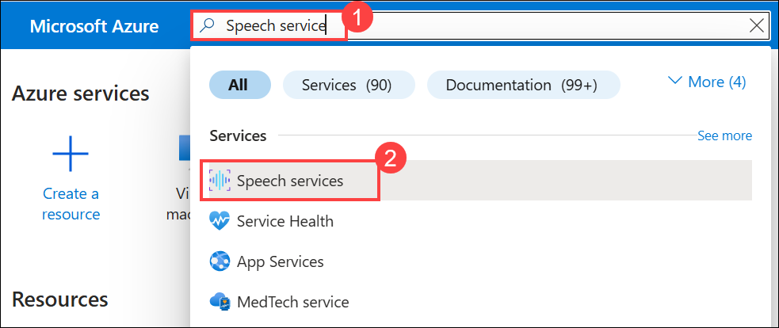

1. On the **AI Foundry | Speech service** page, select **+ Create** to start creating a new speech resource.  

     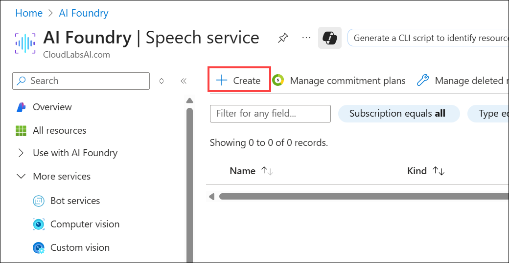 

1. In the Basics tab of **Create Speech Services**, follow these instructions to fill out the properties, then select **Review + create (6)**:

    - **Subscription:** Select your Azure subscription **(1)**.
    - **Resource group:** **AI-102-RG20 (2)**
    - **Region:** **<inject key="Region"></inject> (3)**
    - **Name:** **Speechservice<inject key="DeploymentID" enableCopy="false"/> (4)**
    - **Pricing tier**: Select **F0** (free), or **S** (standard) if F is not available **(5)**.

      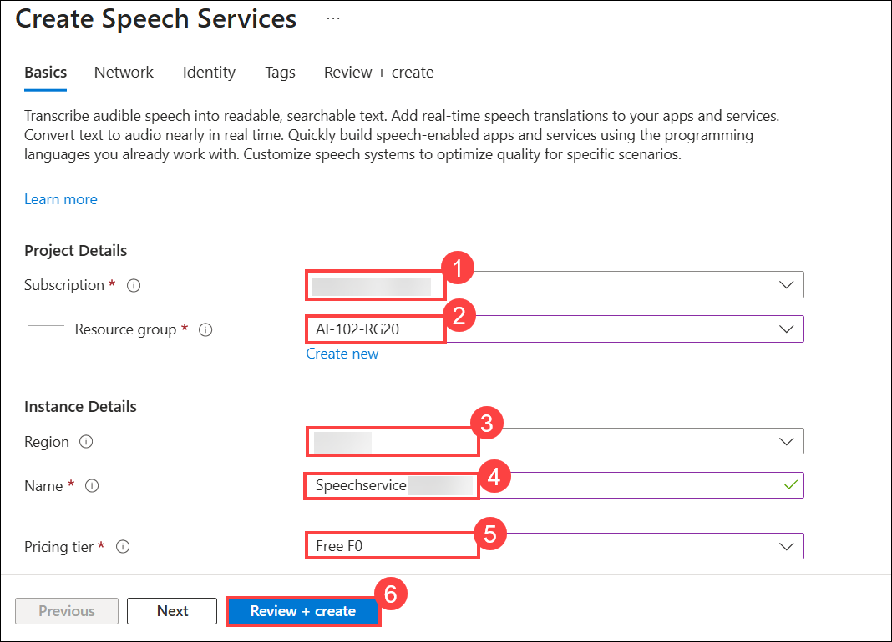 

1. On the **Review + create** tab, click **Create** to provision the resource.

    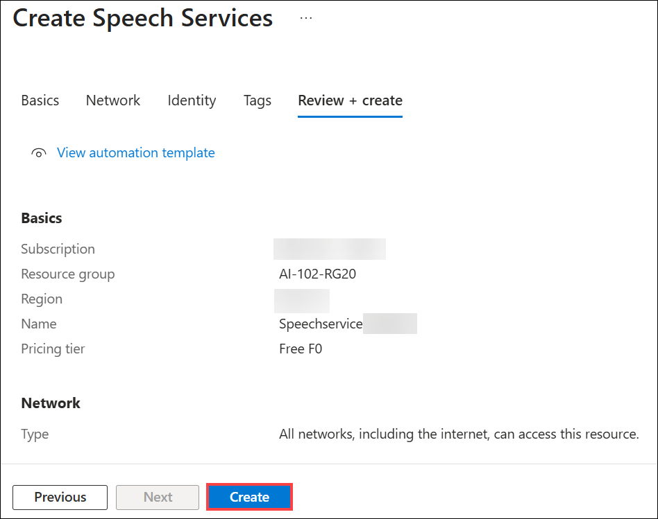 

1. Wait for deployment to complete, and then click on **Go to resource**.

    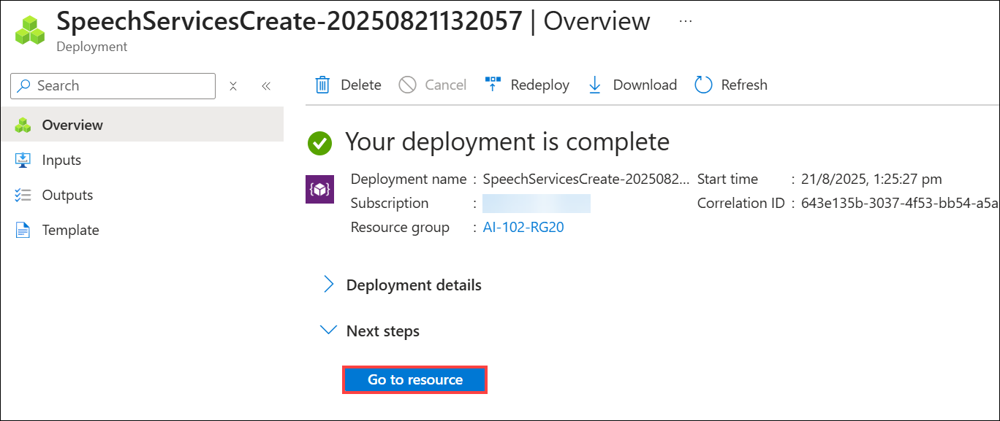 

1. On the **Speechservice** page, in the left navigation pane, select **Resource Management (1)** > **Keys and Endpoint (2)**. Copy the **Location/Region (3)** and **Key (4)** values, and save them in a notepad. You will need these details later in the exercise.

    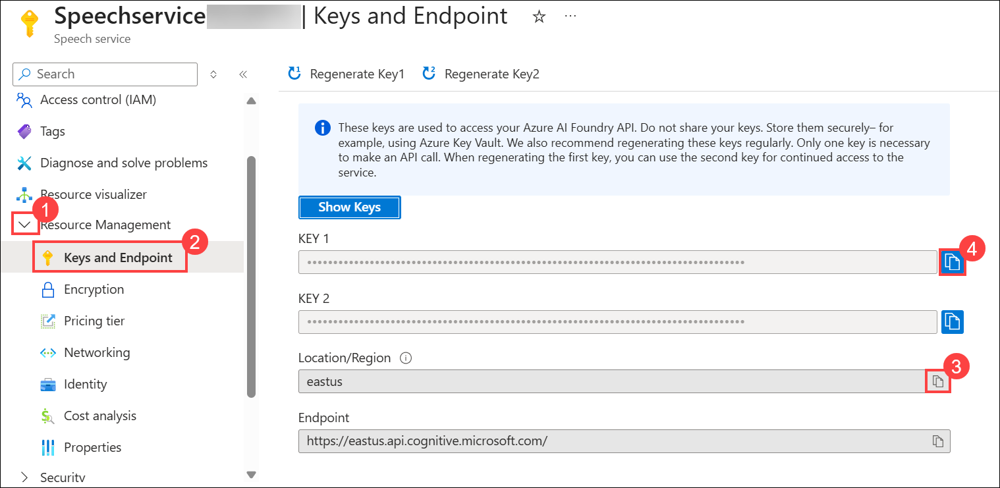 

> **Congratulations** on completing the task! Now, it's time to validate it. Here are the steps:
>
> - Hit the Validate button for the corresponding task. If you receive a success message, you can proceed to the next task.
> - If not, carefully read the error message and retry the step, following the instructions in the lab guide.
> - If you need any assistance, please contact us at cloudlabs-support@spektrasystems.com. We are available 24/7 to help.
 
<validation step="1fba2b1e-45d8-460c-97fe-b18ef620d286" />
 
---   

## Task 2: Prepare and configure the speaking clock app

In this task, you will open Azure Cloud Shell, clone the lab repository, set up a Python virtual environment, install dependencies, and populate the .env file with your Speech key and region.

1. On the **Azure portal** homepage, click the **\[>\_] Cloud Shell (1)** button located to the right of the **Copilot** tab at the top. This opens a new Cloud Shell session. In the **Welcome to Azure Cloud Shell** window, choose **PowerShell (2)**.

    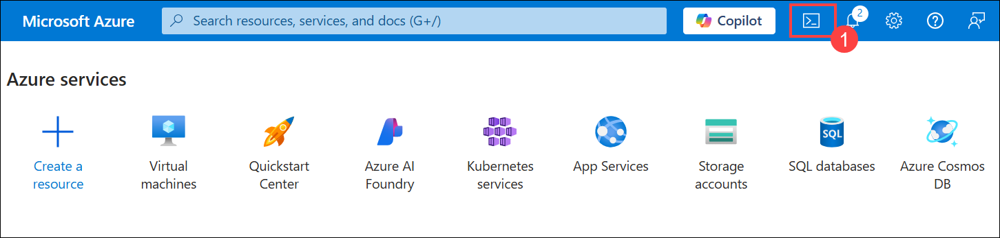

    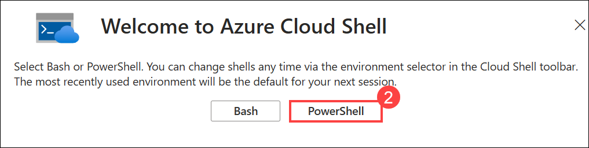

    > **Note**: If you have previously created a cloud shell that uses a **Bash** environment, switch it to **PowerShell**.

1. In the **Getting started** window, ensure **No storage account required (1)** is selected. From the **Subscription** drop-down, choose **Default subscription (2)**, then click **Apply (3)**.

    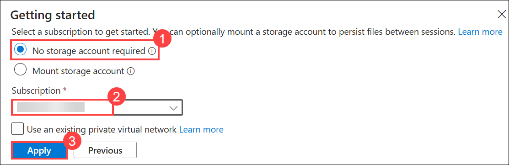

1. In the Cloud Shell toolbar, open the **Settings (1)** menu and choose **Go to Classic version (2)** from the drop-down.

    

    >**Note:** **<font color="black">Ensure you've switched to the classic version of the cloud shell before continuing.</font>**

1. In the PowerShell pane, enter the following commands to clone the GitHub repo for this exercise:

    ```
   rm -r mslearn-ai-language -f
   git clone https://github.com/microsoftlearning/mslearn-ai-language
    ```

    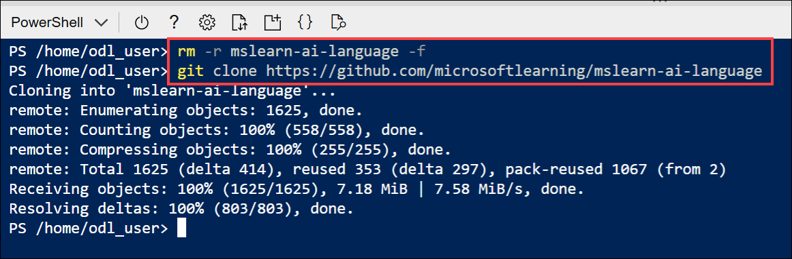

    > **Tip**: As you enter commands into the cloudshell, the ouput may take up a large amount of the screen buffer. You can clear the screen by entering the `cls` command to make it easier to focus on each task.

1. After the repo has been cloned, navigate to the folder containing the speaking clock application code files:  

    ```
   cd mslearn-ai-language/Labfiles/07-speech/Python/speaking-clock
    ```
    
1. In the command line pane, run the following command to view the code files in the **speaking-clock** folder:

    ```
   ls -a -l
    ```
     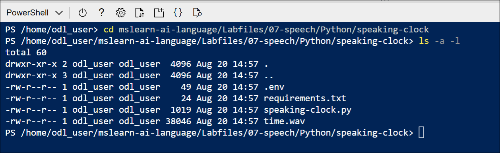 
    
      > **Note:** The files include a configuration file (**.env**) and a code file (**speaking-clock.py**). The audio files your application will use are in the **audio** subfolder.

1. Create a Python virtual environment and install the Azure AI Speech SDK package and other required packages by running the following command:

    ```
   python -m venv labenv
   ./labenv/bin/Activate.ps1
   pip install -r requirements.txt azure-cognitiveservices-speech==1.42.0
    ```

1. Enter the following command to edit the configuration file:

    ```
   code .env
    ```

    The file is opened in a code editor.

     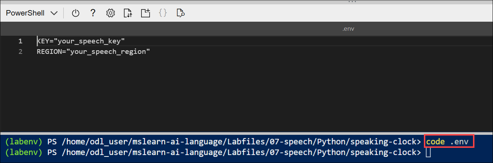 

1. Update the configuration values to include the  **KEY** and **REGION** from the Azure AI Speech resource you created (available on the **Keys and Endpoint** page for your Azure AI Translator resource in the Azure portal).

    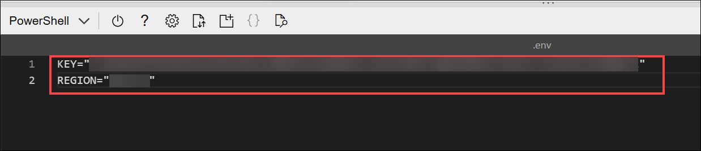 

1. After you've replaced the placeholders, use the **CTRL+S** command to save your changes and then use the **CTRL+Q** command to close the code editor while keeping the cloud shell command line open.

## Task 3: Add code to use the Azure AI Speech SDK

In this task, you will import the required namespaces, initialize SpeechConfig with your credentials, and run the app once to verify a successful connection to the Speech service.

> **Tip**: As you add code, be sure to maintain the correct indentation.

1. Enter the following command to edit the code file that has been provided:

    ```
   code speaking-clock.py
    ```

    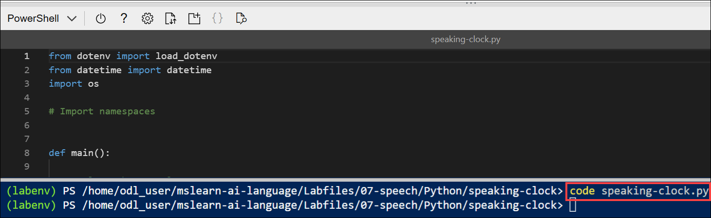 

1. At the top of the code file, under the existing namespace references, find the comment **Import namespaces**. Then, under this comment, add the following language-specific code to import the namespaces you will need to use the Azure AI Speech SDK:

    ```python
   # Import namespaces
   from azure.core.credentials import AzureKeyCredential
   import azure.cognitiveservices.speech as speech_sdk
    ```

    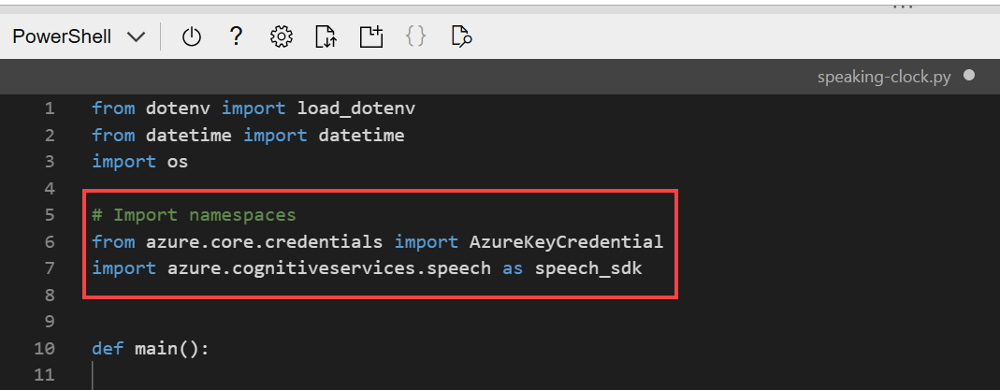 

1. In the **main** function, under the comment **Get config settings**, note that the code loads the key and region you defined in the configuration file.

1. Find the comment **Configure speech service**, and add the following code to use the AI Services key and your region to configure your connection to the Azure AI Services Speech endpoint:

    ```python
   # Configure speech service
   speech_config = speech_sdk.SpeechConfig(speech_key, speech_region)
   print('Ready to use speech service in:', speech_config.region)
    ```

    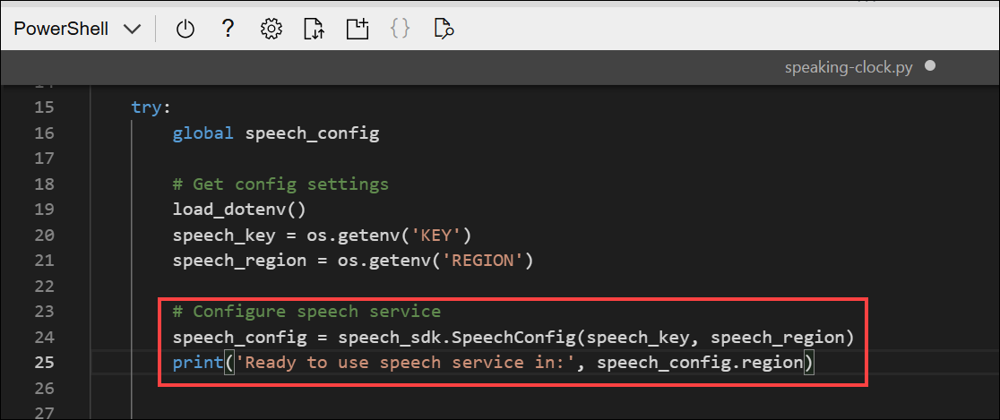 

1. Save your changes (**CTRL+S**), but leave the code editor open.

    > **Note:** So far, the app doesn't do anything other than connect to your Azure AI Speech service, but it's useful to run it and check that it works before adding speech functionality.

1. In the command line, enter the following command to run the speaking clock app:

    ```
   python speaking-clock.py
    ```

    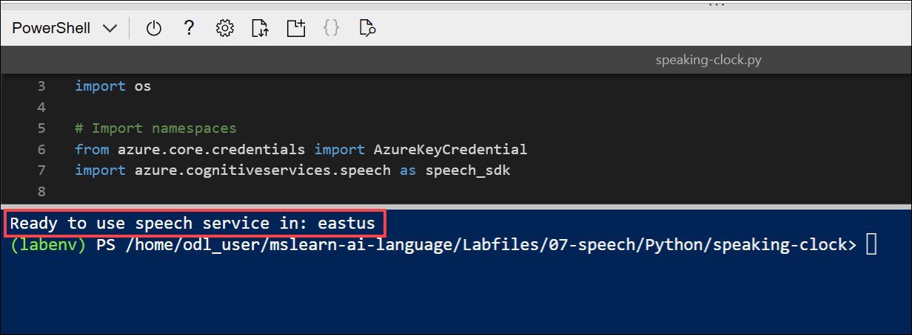 

    The code should display the region of the speech service resource the application will use. A successful run indicates that the app has connected to your Azure AI Speech resource.

## Task 4: Add code to recognize speech

In this task, you will create a SpeechRecognizer that transcribes speech from an audio file and returns the recognized text to the speaking clock logic.

Now that you have a **SpeechConfig** for the speech service in your project's Azure AI Services resource, you can use the **Speech-to-text** API to recognize speech and transcribe it to text.

In this procedure, the speech input is captured from an audio file, which you can play here:

<video controls src="https://github.com/MicrosoftLearning/mslearn-ai-language/raw/refs/heads/main/Instructions/media/Time.mp4" title="What time is it?" width="150"></video>

1. In the code file, note that the code uses the **TranscribeCommand** function to accept spoken input. Then in the **TranscribeCommand** function, find the comment **Configure speech recognition** and add the appropriate code below to create a **SpeechRecognizer** client that can be used to recognize and transcribe speech from an audio file:

    ```python
   # Configure speech recognition
   current_dir = os.getcwd()
   audioFile = current_dir + '/time.wav'
   audio_config = speech_sdk.AudioConfig(filename=audioFile)
   speech_recognizer = speech_sdk.SpeechRecognizer(speech_config, audio_config)
    ```

    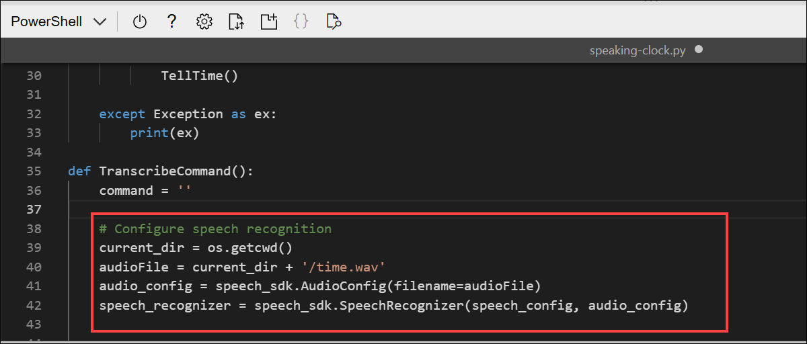

1. In the **TranscribeCommand** function, under the comment **Process speech input**, add the following code to listen for spoken input, being careful not to replace the code at the end of the function that returns the command:

    ```python
   # Process speech input
   print("Listening...")
   speech = speech_recognizer.recognize_once_async().get()
   if speech.reason == speech_sdk.ResultReason.RecognizedSpeech:
        command = speech.text
        print(command)
   else:
        print(speech.reason)
        if speech.reason == speech_sdk.ResultReason.Canceled:
            cancellation = speech.cancellation_details
            print(cancellation.reason)
            print(cancellation.error_details)
    ```

     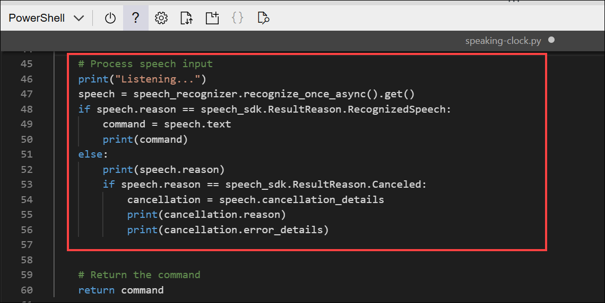

1. Save your changes (**CTRL+S**), and then in the command line below the code editor, re-run the program:

    ```
   python speaking-clock.py
    ```

1. Review the output, which should successfully "hear" the speech in the audio file and return an appropriate response (note that your Azure cloud shell may be running on a server that is in a different time-zone to yours!)

    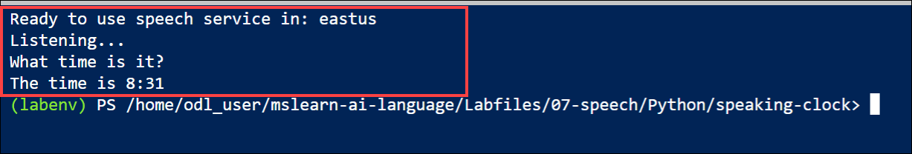

    > **Tip**: If the SpeechRecognizer encounters an error, it produces a result of "Cancelled". The code in the application will then display the error message. The most likely cause is an incorrect region value in the configuration file.

## Task 5: Synthesize speech

In this task, you will create a SpeechSynthesizer that generates spoken output to a .wav file so you can download and verify the synthesized audio in Cloud Shell.

Your speaking clock application accepts spoken input, but it doesn't actually speak! Let's fix that by adding code to synthesize speech.

Once again, due to the hardware limitations of the cloud shell we'll direct the synthesized speech output to a file.

1. In the code file, note that the code uses the **TellTime** function to tell the user the current time.
1. In the **TellTime** function, under the comment **Configure speech synthesis**, add the following code to create a **SpeechSynthesizer** client that can be used to generate spoken output:

    ```python
   # Configure speech synthesis
   output_file = "output.wav"
   speech_config.speech_synthesis_voice_name = "en-GB-RyanNeural"
   audio_config = speech_sdk.audio.AudioConfig(filename=output_file)
   speech_synthesizer = speech_sdk.SpeechSynthesizer(speech_config, audio_config,)
    ```

     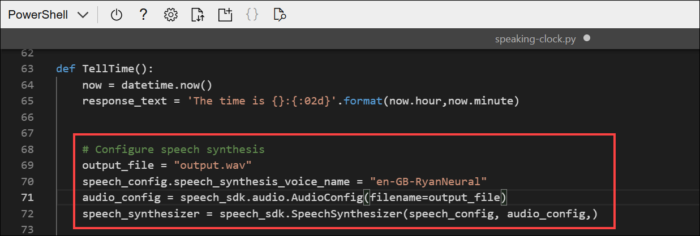

1. In the **TellTime** function, under the comment **Synthesize spoken output**, add the following code to generate spoken output, being careful not to replace the code at the end of the function that prints the response:

    ```python
   # Synthesize spoken output
   speak = speech_synthesizer.speak_text_async(response_text).get()
   if speak.reason != speech_sdk.ResultReason.SynthesizingAudioCompleted:
        print(speak.reason)
   else:
        print("Spoken output saved in " + output_file)
    ```

    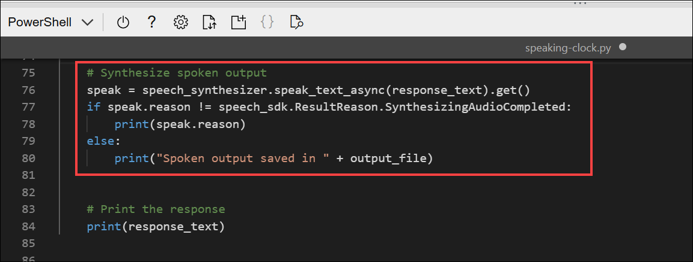

1. Save your changes (**CTRL+S**) and re-run the program, which should indicate that the spoken output was saved in a file.

    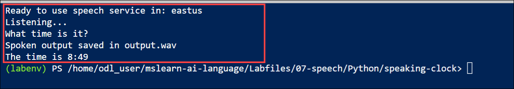

1. If you have a media player capable of playing .wav audio files, download the file that was generated by entering the following command **(1)**:

    ```
   download ./output.wav
    ```

    - The download command creates a popup link at the bottom right of your browser, which you can select to download **(2)** and open the file.

      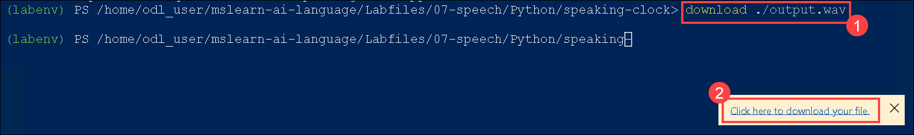

      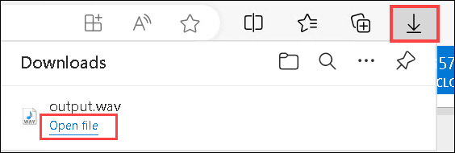

        The file should sound similar to this:

        <video controls src="https://github.com/MicrosoftLearning/mslearn-ai-language/raw/refs/heads/main/Instructions/media/Output.mp4" title="The time is 2:15" width="150"></video>

## Task 6:  Use Speech Synthesis Markup Language

In this task, you will replace plain text synthesis with SSML to control voice, pacing, and pauses, and then regenerate the spoken output to confirm the enhanced results.

1. In the **TellTime** function, replace all of the current code under the comment **Synthesize spoken output** with the following code (leave the code under the comment **Print the response**):

    ```python
   # Synthesize spoken output
   responseSsml = " \
       <speak version='1.0' xmlns='http://www.w3.org/2001/10/synthesis' xml:lang='en-US'> \
           <voice name='en-GB-LibbyNeural'> \
               {} \
               <break strength='weak'/> \
               Time to end this lab! \
           </voice> \
       </speak>".format(response_text)
   speak = speech_synthesizer.speak_ssml_async(responseSsml).get()
   if speak.reason != speech_sdk.ResultReason.SynthesizingAudioCompleted:
       print(speak.reason)
   else:
       print("Spoken output saved in " + output_file)
    ```

    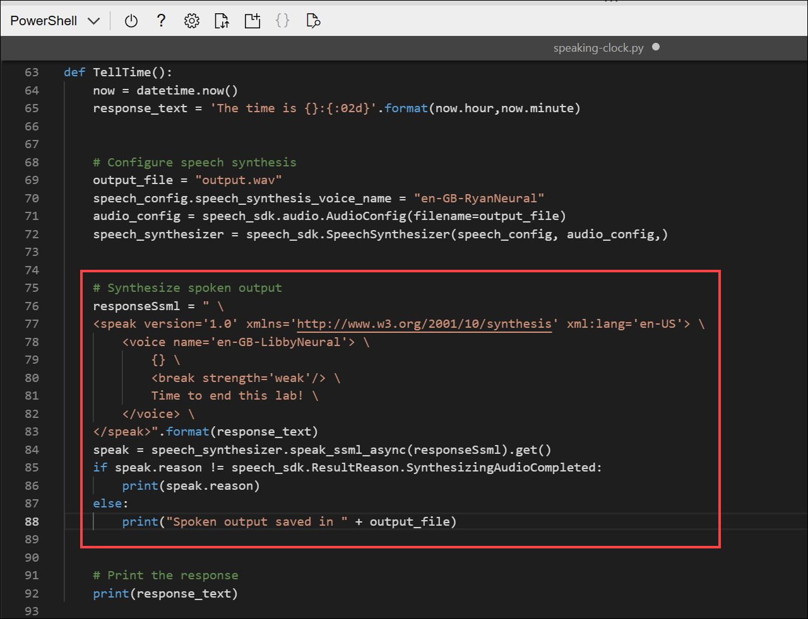

1. Save your changes and re-run the program, which should once again indicate that the spoken output was saved in a file.

    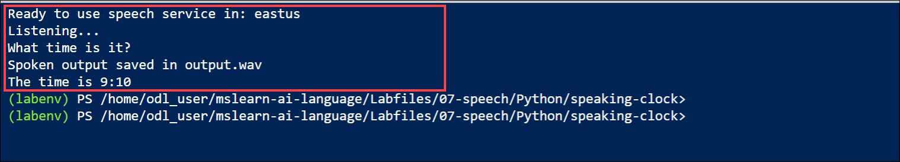

1. Download and play the generated file, which should sound similar to this:
    
    <video controls src="https://github.com/MicrosoftLearning/mslearn-ai-language/raw/refs/heads/main/Instructions/media/Output2.mp4" title="The time is 5:30. Time to end this lab." width="150"></video>

## Summary

In this lab, you built an end-to-end speaking clock with Azure AI Speech. You provisioned a Speech resource, configured your environment in Cloud Shell, and added code to authenticate to the service. You implemented speech recognition from an audio file, generated natural-sounding speech to a .wav file, and enhanced the user experience with SSML controls.

### You have successfully completed the Hands-on Lab!

