# Lab 21: Recognize and synthesize speech

### Estimated Duration: 45 Minutes

## Lab Overview

In this lab, you’ll build a voice-enabled application using Azure Speech in Foundry Tools to both synthesize and recognize speech. You’ll start by creating a Microsoft Foundry project and configuring your development environment in Visual Studio Code. Then, you’ll implement Python code to convert text into speech and save it as an audio file, as well as process audio recordings to extract transcribed text. Finally, you’ll run and test the application to see how speech-to-text and text-to-speech capabilities work together in a real-world scenario.

## Lab Objectives

In this lab, you'll perform the following tasks:

* Task 1: Create a Microsoft Foundry project
* Task 2: Get the application files from GitHub
* Task 3: Configure your application
* Task 4: Add code to synthesize speech
* Task 5: Add code to recognize speech

## Task 1: Create a Microsoft Foundry project

In this task, you'll sign in to the Microsoft Foundry portal and create a new project with the required Azure resources.

1. Open a new tab in the browser, right-click on the following link [Foundry portal](https://ai.azure.com), then **Copy link** and paste it in a browser tab to log in to **Microsoft Foundry portal**.

1. Click on **Sign in**.

    

1. If prompted, provide the credentials below:

   - **Email/Username:** <inject key="AzureAdUserEmail"></inject>

   - **Password:** <inject key="AzureAdUserPassword"></inject>

      >**Note:** Close any tips or quick start panes that are opened the first time you sign in, and if necessary, use the **Foundry** logo at the top left to navigate to the home page.

1. At the top of the **Microsoft Foundry** portal, enable the **New Foundry toggle (1)** to switch to the latest Foundry user interface.   

1. From the **Select a project to continue** dialog, click the drop-down under **Select or search for a project**, and then select **Create a new project (2)**.

     

1. In the **Create a project** window, enter **Myproject<inject key="DeploymentID" enableCopy="false"/> (1)** as the project name. Open the **Advanced options (2)** drop-down, fill in the following details, and then click **Create (6)**:

    >**Note:** <span style="color:red"> Make a note of the Microsoft Foundry resource name, as it will be required later in the lab.

    * Subscription: **Choose Default Subscription (3)**
    * Resource group: **AI-102-RG021 (4)**
    * Microsoft Foundry resource: **Keep as Default**
    * Region: **<inject key="Region"></inject> (5)**

      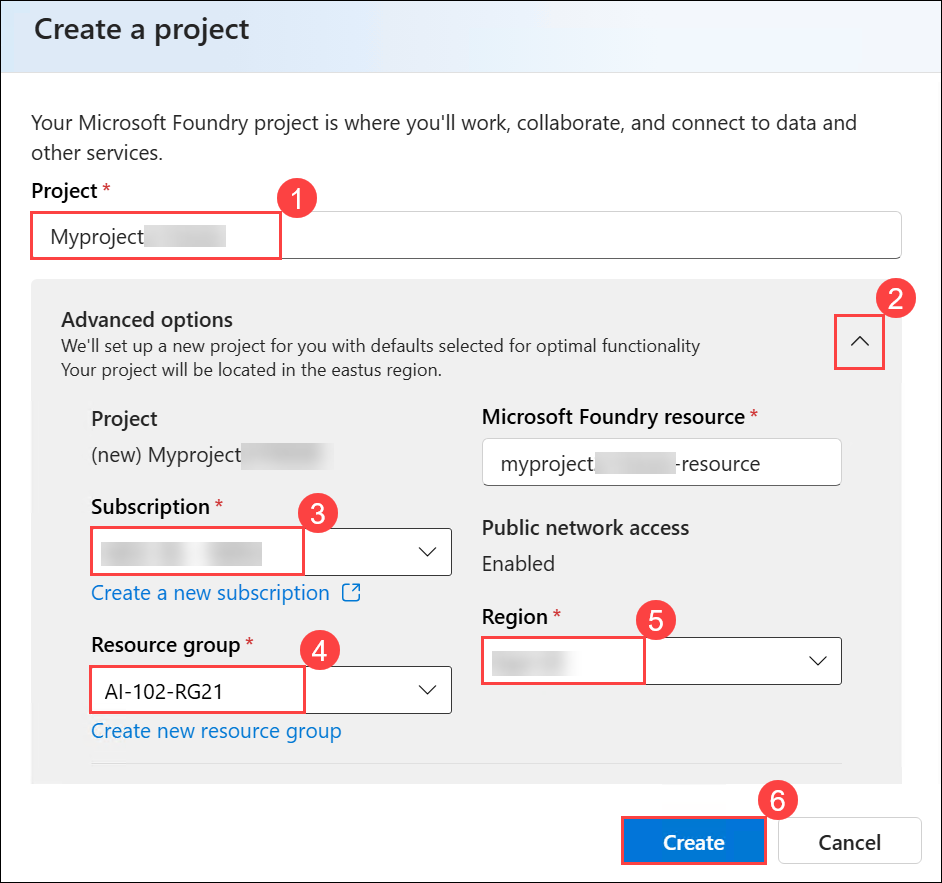 

1. Wait for your project to be created. It may take around 1-2 minutes.

1. If you see the **“Welcome to the new Microsoft Foundry”** window, you can either explore the information using **Next**, or close it by selecting the **X** in the top-right corner to continue.

    

1. On the home page for your project, note the project endpoint, key, and OpenAI endpoint.

    .png)

    > **Note:** <span style="color:red"> Copy and save the API key, as you will need them later in the lab.


> **Congratulations** on completing the task! Now, it's time to validate it. Here are the steps:
>
> - Hit the Validate button for the corresponding task. If you receive a success message, you can proceed to the next task.
> - If not, carefully read the error message and retry the step, following the instructions in the lab guide.
> - If you need any assistance, please contact us at cloudlabs-support@spektrasystems.com. We are available 24/7 to help.
 
<validation step="ffe58471-f2ac-4778-b302-e10450ed63b6" />

## Task 2: Get the application files from GitHub

In this task, you'll clone the GitHub repository and open the application files in Visual Studio Code.

1. On the desktop, locate **Visual Studio Code**, and then double-click the icon to open it.

    

1. Open the Command Palette by pressing **Ctrl+Shift+P** , type **`Git: Clone`** **(1)**, and then select **Git: Clone** (2) from the list.

    

1. In the Command Palette, enter the repository URL `https://github.com/microsoftlearning/mslearn-ai-language` **(1)**, and then select **Clone from URL** **(2)** to clone the repository to a local folder.

    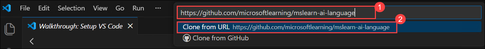
 
1. In the folder selection window, choose the **Downloads** folder **(1)**, and then select **Select as Repository Destination** **(2)**.

    

1. When prompted, select **Open** to open the cloned repository in Visual Studio Code.

    

1. When prompted, select **Yes, I trust the authors** to trust the folder and enable all features.

    

1. After cloning the repository, in the **Explorer** pane, expand the **Labfiles** folder **(1)**, and then navigate to **04-azure-speech > Python > voice-mail** **(2)**.

    In this folder, locate the application files **(3)**, which include:

    * **messages:** a subfolder containing audio recordings of messages
    * **.env:** the application configuration file
    * **requirements.txt:** the Python package dependencies
    * **voice-mail.py:** the main application code file

        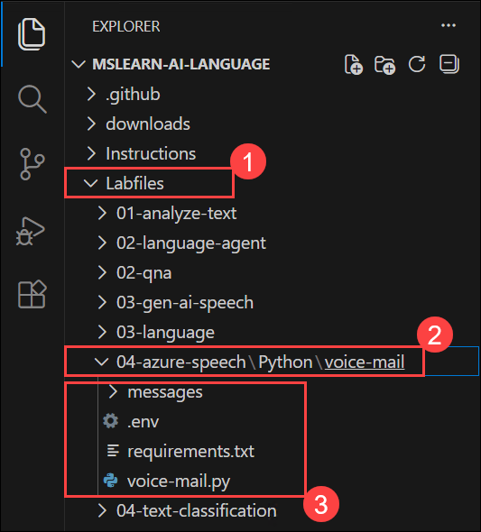

## Task 3: Configure your application

In this task, you'll set up the Python environment, install dependencies, and configure the application using the Foundry endpoint and API key.

1. In Visual Studio Code, open the **Extensions** pane **(1)**, search for **Python** **(2)**, select the **Python** extension by Microsoft **(3)**, and then click **Install** **(4)** if it is not already installed.

    

1. In the **Explorer** pane **(1)**, right-click the **requirements.txt** file **(2)**, and then select **Open in Integrated Terminal** **(3)**.

    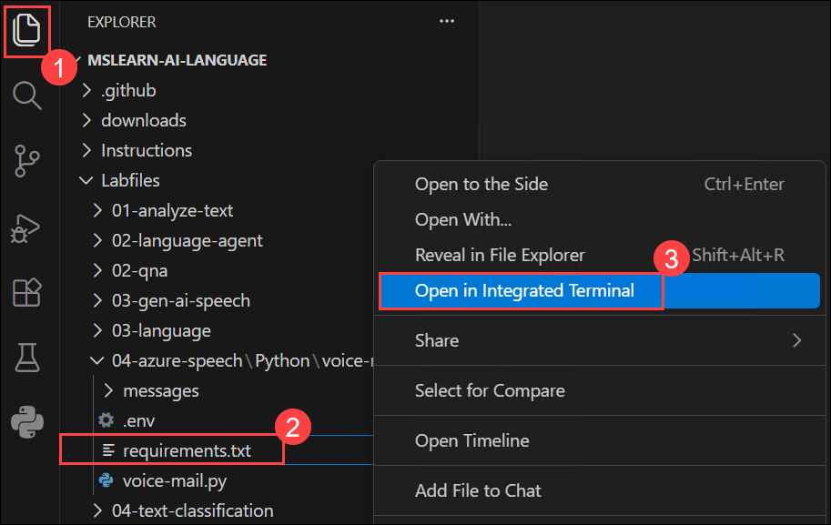

1. In the terminal, enter the following command to install the required Python packages in a virtual environment:

    ```
    python -m venv labenv
    .\labenv\Scripts\Activate.ps1
    pip install -r requirements.txt
    ```

    >**Note:** This will create a virtual environment and install the Azure AI Speech SDK package and other required packages.

1. Ensure that the terminal is open in the **voice-mail** folder with the prefix **(.venv)** to indicate that the Python environment you created is active.

    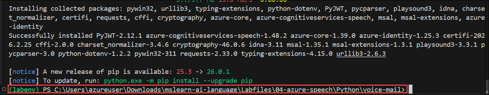

1. In the **Explorer** pane, within the **voice-mail** folder, select the **.env** file **(1)** to open it. Update the configuration by pasting the **Microsoft Foundry resource** name (copied in Task 1) into the `FOUNDRY_ENDPOINT` field **(2)**.

    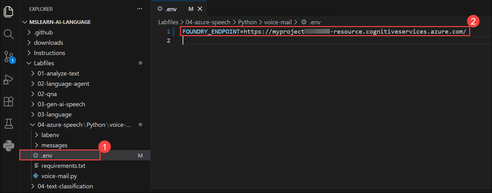
    
    >**Note:** The endpoint should be in the format *https://{foundry-resource}.cognitiveservices.azure.com/*. The Foundry resource name typically follows the format *{project_name}-resource*.

1. Copy the following line and paste it into the **.env** file, then replace the placeholder with your API key. Press **Ctrl+S** to save the changes:

    ```
    FOUNDRY_KEY=your_api_key_here
    ```

    Replace `your_api_key_here` with the API key you copied in Task 1.

    .png)

## Task 4: Add code to synthesize speech

In this task, you'll implement functionality to convert text into speech and save it as an audio file.

1. In the **Explorer** pane, in the **voice-mail** folder,  open the **voice-mail.py** file.

    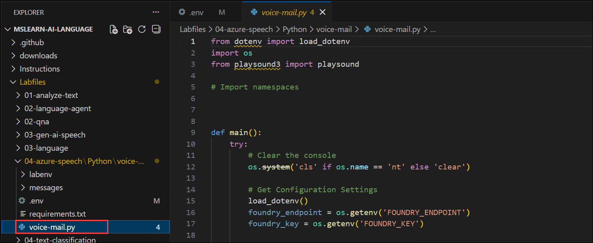

1. Review the existing code. You will add code to work with the Azure Speech SDK.

    > **Note:** As you add code to the code file, be sure to maintain the correct indentation.

1. At the top of the code file, under the existing namespace references, find the comment **Import namespaces** and add the following code to import the namespaces you will need to use the Speech SDK:

    ```python
    # import namespaces
    from azure.identity import DefaultAzureCredential
    import azure.cognitiveservices.speech as speech_sdk
    ```

    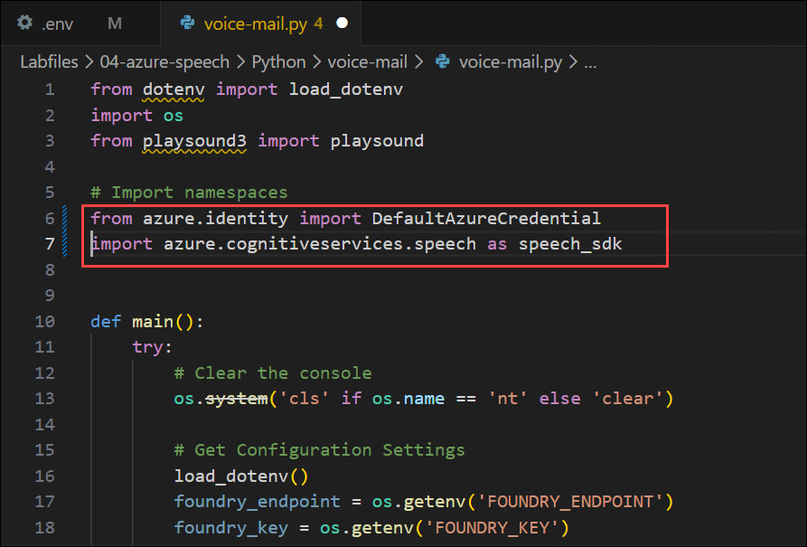

1. In the **main** function, note that code to load the endpoint and key from the configuration file has already been provided. Then find the comment **Create speech_config using Entra ID authentication**, and replace the existing code with the following to configure Speech using key-based authentication:

    ```python
    # Create speech_config using key-based authentication
    speech_config = speech_sdk.SpeechConfig(
        subscription=foundry_key,
        endpoint=foundry_endpoint
    )
    ```

    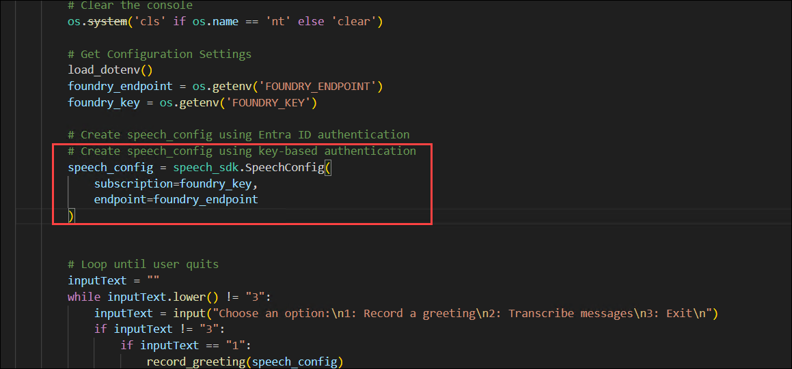

    > **Note:** This change replaces Entra ID authentication with API key-based authentication, which is required for this lab environment.

1. Review the rest of the **main** function, and note that a loop has been implemented that enables the user to choose one of three options:
    
    1. Record a voice greeting
    1. Transcribe messages
    1. Exit the application

1. Find the **record_greeting** function, which you will implement to record a voice greeting as an audio file.

1. In the **record_greeting** function, find the comment **Synthesize the greeting message to an audio file**, and add the following code to synthesize speech from the text entered by the user and save it as an audio file.

    ```python
    # Synthesize the greeting message to an audio file
    output_file = "greeting.wav"
    audio_config = speech_sdk.audio.AudioOutputConfig(filename=output_file)

    speech_config.speech_synthesis_voice_name = "en-US-Serena:DragonHDLatestNeural"

    speech_synthesizer = speech_sdk.SpeechSynthesizer(
        speech_config=speech_config,
        audio_config=audio_config
    )

    result = speech_synthesizer.speak_text_async(greeting_message).get()

    if result.reason == speech_sdk.ResultReason.SynthesizingAudioCompleted:
        print(f"Greeting recorded and saved to {output_file}")
        speech_synthesizer = None  # Release the synthesizer resources
    else:
        print("Error recording greeting: {}".format(result.reason))
    ```

    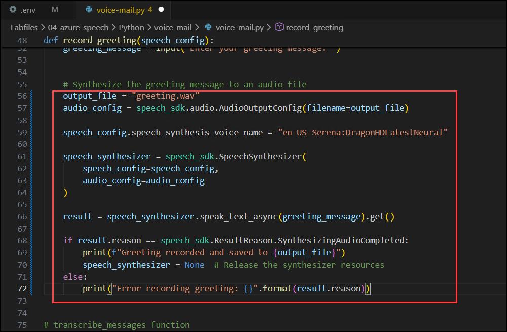

1. Save the changes to the code file by pressing **Ctrl+S**. 

1. In the Visual Studio Code terminal, enter the following command to sign into Azure

     ```powershell
     az login
     ```

     > **Note:** Minimize the VS Code to see the **Sign in** window.

1. In the **Sign in** window, select **Work or school account** **(1)**, and then select **Continue** **(2)**.

    

1. On the **Sign in** page, provide the credentials below:
 
    - **Email/Username:** <inject key="AzureAdUserEmail"></inject>
    
      

    - **Password:** <inject key="AzureAdUserPassword"></inject>
    
      

1. When prompted, select **Yes** to sign in to all apps and websites on this device.

    

1. On the **Account added to this device** window, select **Done** to complete the sign-in process.

    

1. In the Visual Studio Code terminal, press **Enter** to select the default subscription.

    

1. After you have signed in, enter the following command to run the application:

    ```powershell
    python voice-mail.py
    ```

1. When prompted, enter **1** to record a greeting.

1. Enter a greeting, like `Hi. The person you called is not available right now. Leave a message.`

    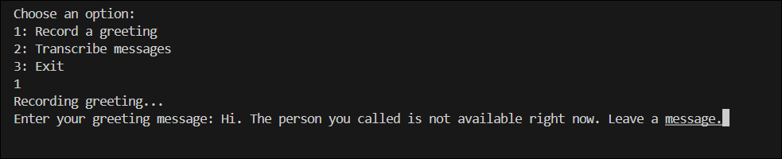

1. Wait while the speech is synthesized and saved as an audio file.

    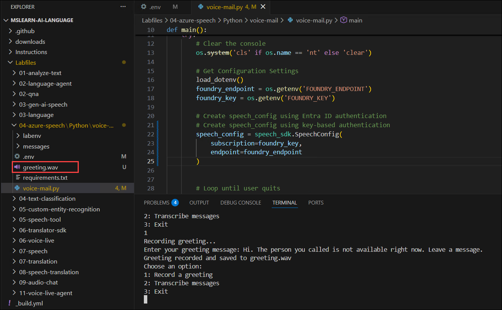

    You can select the **greeting.wav** file that is generated in the voice-mail folder to play it in Visual Studio Code.

## Task 5: Add code to recognize speech

In this task, you'll implement functionality to transcribe audio files into text using speech recognition.

1. In the **voice-mail.py** code file, find the **transcribe_messages** function; which you will implement to transcribe each of the voice messages in the **messages** subfolder.

    The functional already contains code to loop through the files in the **messages** folder.

1. In the **transcribe_messages** function, find the comment **Transcribe the audio file**, and add the following code to transcribe the audio.

    ```python
   # Transcribe the audio file
   audio_config = speech_sdk.audio.AudioConfig(filename=file_path)
   speech_recognizer = speech_sdk.SpeechRecognizer(speech_config=speech_config,
                                                    audio_config=audio_config)
   result = speech_recognizer.recognize_once_async().get()
   if result.reason == speech_sdk.ResultReason.RecognizedSpeech:
        print(f"Transcription: {result.text}")
   else:
        print("Error transcribing message: {}".format(result.reason))
    ```

    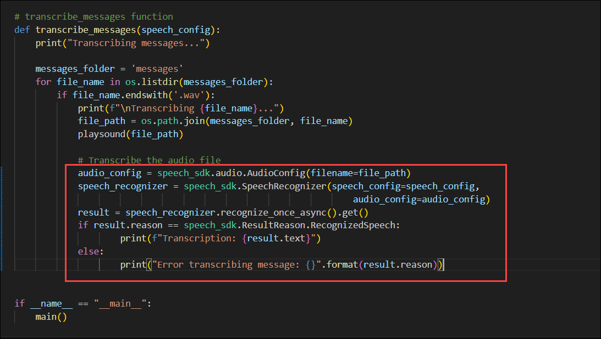

1. Save the changes to the code file. Then, in the terminal, enter the following command to run the application:

    ```powershell
   python voice-mail.py
    ```

1. When prompted, enter **2** to transcribe messages.

1. View the transcription for each message.

    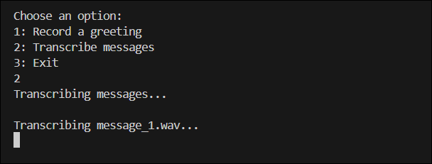

1. The application will process each `.wav` file in the **messages** folder and display the transcribed text in the terminal.

    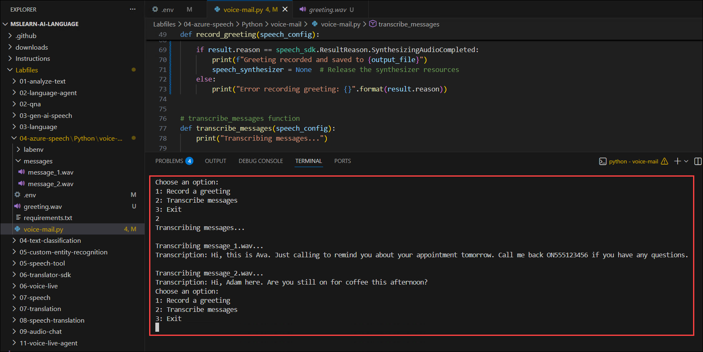

## Summary
In this exercise, you built a voice message assistant that uses Azure Speech capabilities to both generate and process audio. You configured your application with the Foundry endpoint and API key, implemented speech synthesis to create audio greetings, and added speech recognition to transcribe recorded messages. You then ran the application and interacted with it to see how it converts text to speech and speech to text in a seamless workflow. Great work!

### You have successfully completed the Hands-on Lab!

