# Lab 21: Translate Speech

### Estimated Duration: 30 Minutes

## Lab Overview

In this lab, you will explore Azure AI Speech, a cloud-based service for real-time speech translation. You’ll provision an Azure AI Speech resource, configure a Python application in Cloud Shell, and connect it with your Speech resource using keys and region. You will enhance the app by adding code to recognize spoken input, translate it into multiple target languages, and synthesize the translations into speech. By the end of the lab, you will gain hands-on experience in building multilingual speech-enabled applications using Azure AI Speech.

## Lab Objectives

- Task 1: Create an Azure AI Speech resource
- Task 2: Prepare to develop an app in Cloud Shell
- Task 3: Add code to use the Azure AI Speech SDK
- Task 4: Run the app
- Task 5: Implement speech translation
- Task 6: Synthesize the translation to speech


### Task 1: Create an Azure AI Speech resource

In this task, you will create an Azure AI Speech resource in the Azure portal.

1. Open the **Azure portal**, search for **Speech service (1)** and select **Speech service (2)** from the services.

   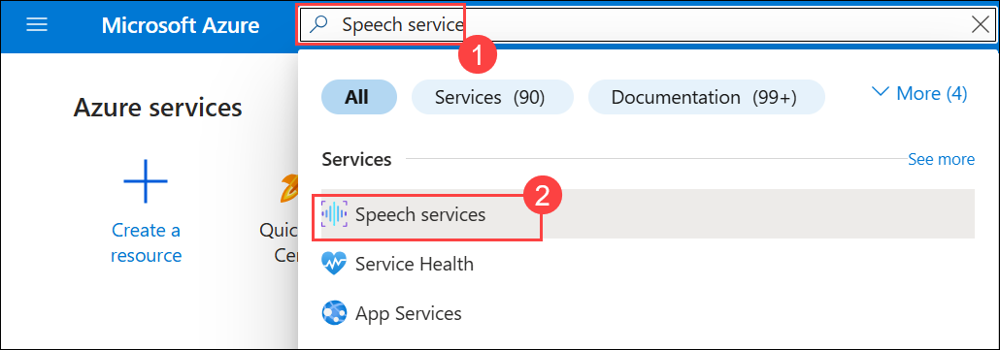 

1. Then select **Create**.

   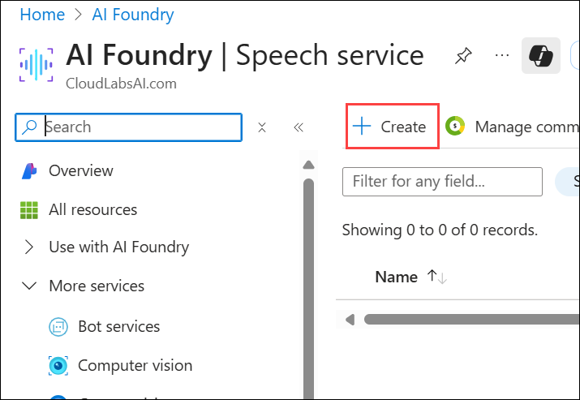 

1. Provision the resource using the following settings:

    - Subscription: Leave Your Azure subscription **(1)**
    - Resource group: **AI-102-RG21 (2)**
    - Region: Select **<inject key="Region" enableCopy="false" /> (3)**
    - Name: Enter **speechservice<inject key="DeploymentID" enableCopy="false"/> (4)**
    - **Pricing tier**: Select **F0 (5)** (*free*), or **S** (*standard*) if F is not available.
    - Select **Review + create (6)**

      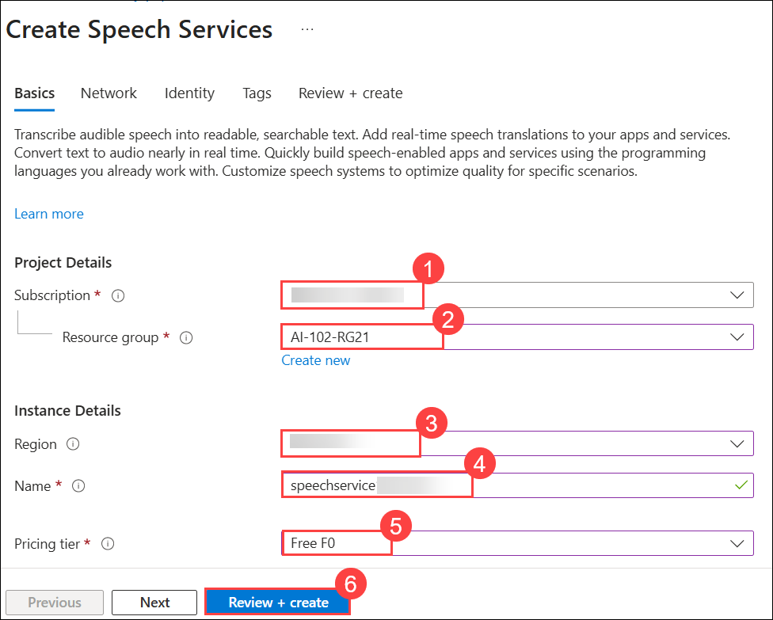    

1. Then select **Create** to provision the resource.

1. Wait for deployment to complete, and select **Go to resource group** to go to the resource group.

   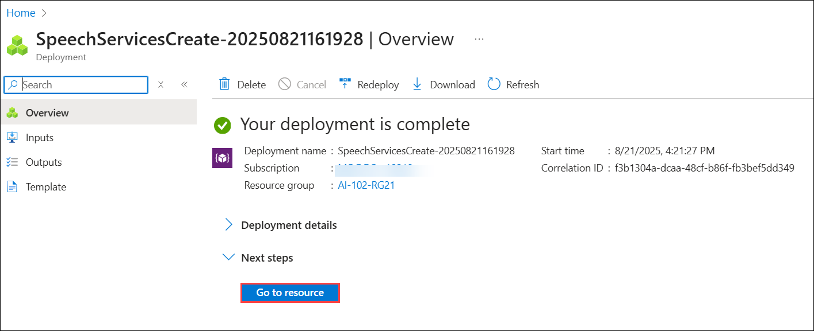 

1. Select the Speech service **speechservice<inject key="DeploymentID" enableCopy="false"/>**.

   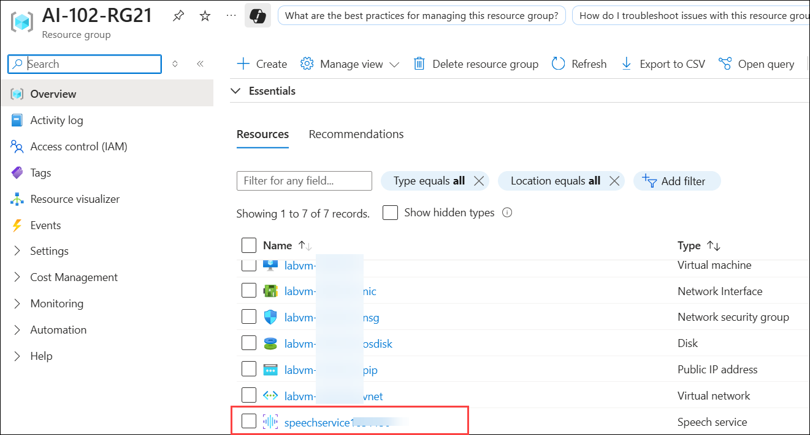 

1. Navigate to the **Keys and Endpoint (1)** page. Copy and paste the **KEY 1 (2)** and **Location (3)**. You will need the information on this page later in the lab.

   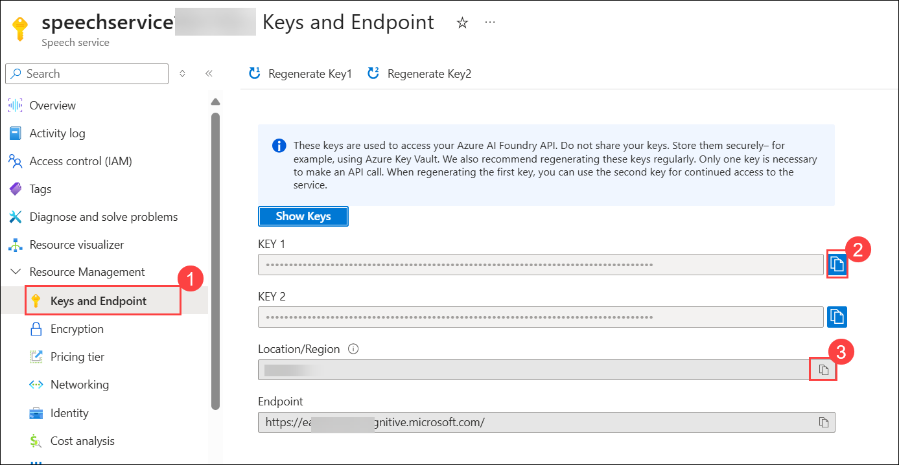

> **Congratulations** on completing the task! Now, it's time to validate it. Here are the steps:
>
> - Hit the Validate button for the corresponding task. If you receive a success message, you can proceed to the next task.
> - If not, carefully read the error message and retry the step, following the instructions in the lab guide.
> - If you need any assistance, please contact us at cloudlabs-support@spektrasystems.com. We are available 24/7 to help.
 
<validation step="963235ac-0d10-4f82-b90f-71fd953123e8" />
 
---   
   
   
### Task 2: Prepare to develop an app in Cloud Shell

In this task, you set up the development environment in Azure Cloud Shell by cloning the required repo, creating a Python virtual environment, installing dependencies, and configuring the .env file with your Azure AI Speech resource details.

1. Use the **[>_]** button to the right of the search bar at the top of the page to create a new **Cloud Shell** in the Azure portal.

     

1. Selecting a **PowerShell** environment.

     

1. On the **Getting started** page,

    - Select **No storage account required (1)** 
    - Select your subscription **(2)**
    - Click on **Apply (3)**

       

1. In the cloud shell toolbar, in the **Settings (1)** menu, select **Go to Classic version (2)** (this is required to use the code editor).

    

     >**Note**: The cloud shell provides a command-line interface in a pane at the bottom of the Azure portal. You can resize or maximize this pane to make it easier to work in.

     >**Note**: Ensure you've switched to the classic version of the cloud shell before continuing.

1. In the PowerShell pane, enter the following commands to clone the GitHub repo for this exercise:

    ```
   rm -r mslearn-ai-language -f
   git clone https://github.com/microsoftlearning/mslearn-ai-language
    ```

     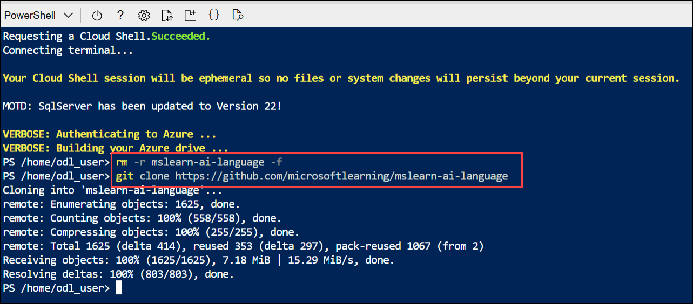     

      >**Tip**: As you enter commands into the cloudshell, the ouput may take up a large amount of the screen buffer. You can clear the screen by entering the `cls` command to make it easier to focus on each task.

1. After the repo has been cloned, navigate to the folder containing the code files:

    ```
   cd mslearn-ai-language/Labfiles/08-speech-translation/Python/translator
    ```

1. In the command line pane, run the following command to view the code files in the **translator** folder:

    ```
   ls -a -l
    ```

     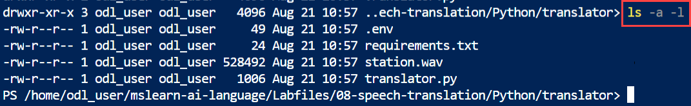     

     The files include a configuration file (**.env**) and a code file (**translator.py**).

1. Create a Python virtual environment and install the Azure AI Speech SDK package and other required packages by running the following command:

    ```
    python -m venv labenv
    ./labenv/bin/Activate.ps1
    pip install -r requirements.txt azure-cognitiveservices-speech==1.42.0
    ```

1. Enter the following command to edit the configuration file that has been provided:

    ```
   code .env
    ```

     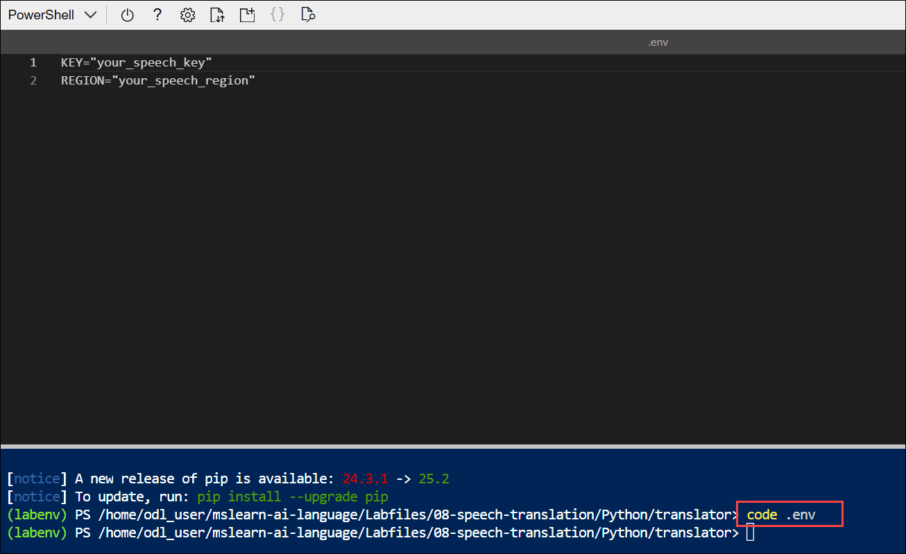         

     The file is opened in a code editor.

1. Update the configuration values to include the  **key (1)** and a **region (2)** from the Azure AI Speech resource you created (available on the **Keys and Endpoint** page for your Azure AI Speech resource in the Azure portal that you have copied in  `Task 1`).

    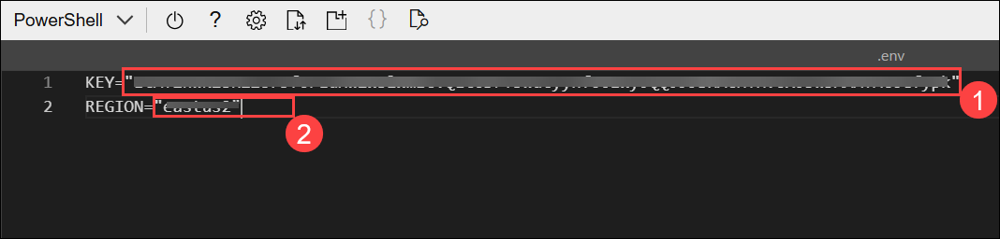     

1. After you've replaced the placeholders, use the **CTRL+S** command to save your changes and then use the **CTRL+Q** command to close the code editor while keeping the cloud shell command line open.

### Task 3: Add code to use the Azure AI Speech SDK

In this task, you update the translator.py file by importing the Azure AI Speech SDK, configuring speech translation with multiple target languages, and setting up speech synthesis for using the Speech service.

>**Note**: As you add code, be sure to maintain the correct indentation.

1. Enter the following command to edit the code file that has been provided:

    ```
   code translator.py
    ```

     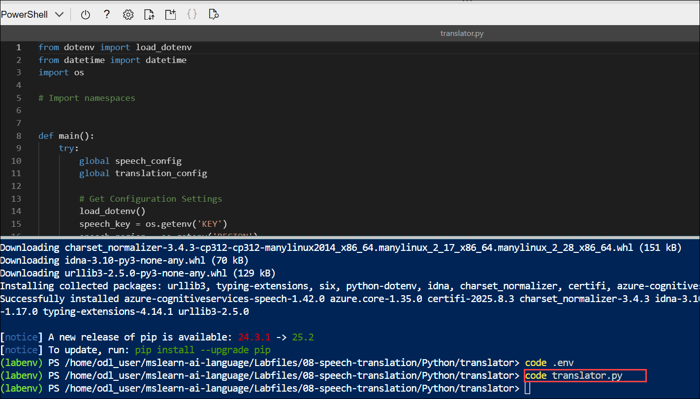       

1. At the top of the code file, under the existing namespace references, find the comment **Import namespaces**. Then, under this comment, add the following language-specific code to import the namespaces you will need to use the Azure AI Speech SDK:

    ```python
   # Import namespaces
   from azure.core.credentials import AzureKeyCredential
   import azure.cognitiveservices.speech as speech_sdk
    ```

     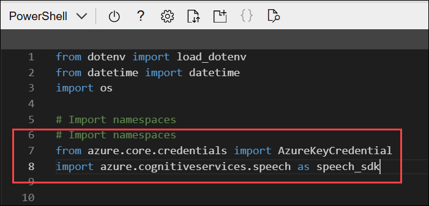        

1. In the **main** function, under the comment **Get config settings**, note that the code loads the `key and region` you defined in the configuration file.

1. Find the following code under the comment **Configure translation**, and add the following code to configure your connection to the Azure AI Services Speech endpoint:

    ```python
   # Configure translation
   translation_config = speech_sdk.translation.SpeechTranslationConfig(speech_key, speech_region)
   translation_config.speech_recognition_language = 'en-US'
   translation_config.add_target_language('fr')
   translation_config.add_target_language('es')
   translation_config.add_target_language('hi')
   print('Ready to translate from',translation_config.speech_recognition_language)
    ```

     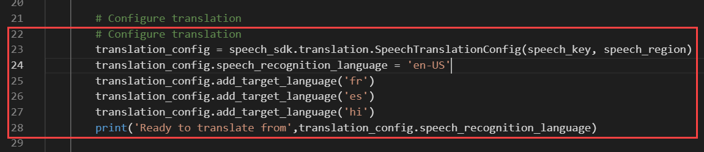     

1. You will use the **SpeechTranslationConfig** to translate speech into text, but you will also use a **SpeechConfig** to synthesize translations into speech. Add the following code under the comment **Configure speech**:

    ```python
   # Configure speech
   speech_config = speech_sdk.SpeechConfig(speech_key, speech_region)
   print('Ready to use speech service in:', speech_config.region)
    ```

     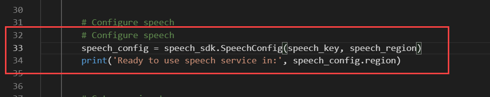     

1. Save your changes using **CTRL+S**, but leave the code editor open.

### Task 4: Run the app

In this task, you run the translator.py app to verify that it successfully connects to your Azure AI Speech resource, displays the configured region, and confirms readiness for translation before ending the program.

1. In the command line, enter the following command to run the translator app:

    ```
   python translator.py
    ```

     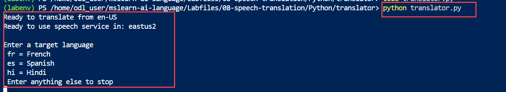    

     The code should display the `region` of the speech service resource the application will use, a message that it is ready to `translate from en-US and prompt you for a target language`. A successful run indicates that the app has connected to your Azure AI Speech service.
     
1. Press `ENTER` to end the program.

### Task 5: Implement speech translation

In this task, you enhance the app by adding a TranslationRecognizer to process audio input from a file, transcribe it, and translate the recognized speech into the target language (fr, es, or hi). Running the updated program demonstrates real-time speech-to-text translation using Azure AI Speech.

1. In the code file, note that the code uses the **Translate** function to translate spoken input. Then in the **Translate** function, under the comment **Translate speech**, add the following code to create a **TranslationRecognizer** client that can be used to recognize and translate speech from a file.

    ```python
   # Translate speech
   current_dir = os.getcwd()
   audioFile = current_dir + '/station.wav'
   audio_config_in = speech_sdk.AudioConfig(filename=audioFile)
   translator = speech_sdk.translation.TranslationRecognizer(translation_config, audio_config = audio_config_in)
   print("Getting speech from file...")
   result = translator.recognize_once_async().get()
   print('Translating "{}"'.format(result.text))
   translation = result.translations[targetLanguage]
   print(translation)
    ```

     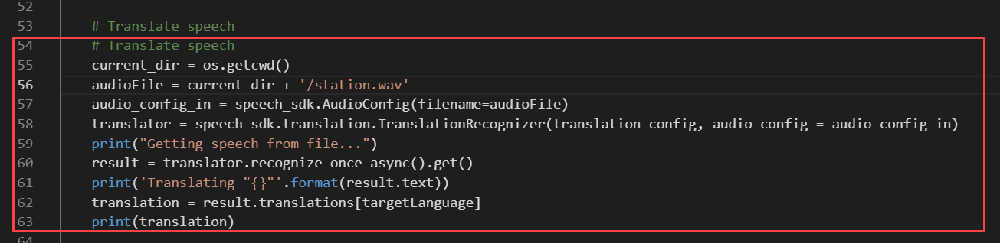  

1. Save your changes using **CTRL+S**, and re-run the program **(1)**:

    ```
   python translator.py
    ```

1. When prompted, enter a valid language code (`fr`, `es`, or `hi`). The program should transcribe your input file and translate it to the language you specified (French, Spanish, or Hindi). Repeat this process, trying each language supported by the application.

    >**NOTE**: The translation to **Hindi** may not always be displayed correctly in the Console window due to character encoding issues.

    - Enter `es` as the target language **(2)** and view the output **(3)**

    - Enter `fr` as the target language **(4)** and view the output **(5)**

      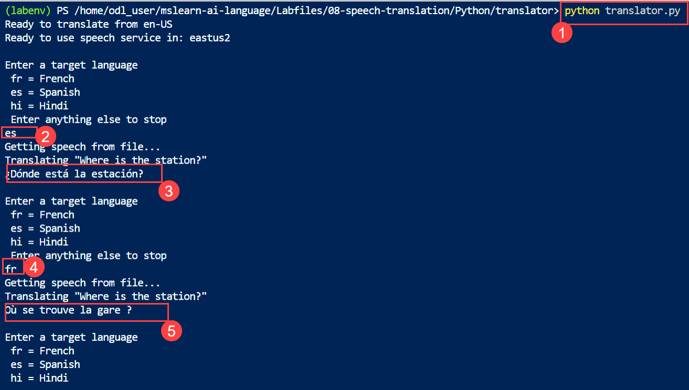  

1. When you're finished, press `ENTER` to end the program.

    >**NOTE**: The code in your application translates the input to all three languages in a single call. Only the translation for the specific language is displayed, but you could retrieve any of the translations by specifying the target language code in the **translations** collection of the result.

### Task 6: Synthesize the translation to speech

In this task, you extend the app to not only translate speech to text but also synthesize the translated text into speech using Azure AI Speech. The translation is saved as an .wav audio file, which can be downloaded and played locally to hear the spoken output in the target language (French, Spanish, or Hindi).

>**Note**: Due to the hardware limitations of the cloud shell, we'll direct the synthesized speech output to a file.

1. In the **Translate** function, find the comment **Synthesize translation**, and add the following code to use a **SpeechSynthesizer** client to synthesize the translation as speech and save it as a .wav file:

    ```python
   # Synthesize translation
   output_file = "output.wav"
   voices = {
            "fr": "fr-FR-HenriNeural",
            "es": "es-ES-ElviraNeural",
            "hi": "hi-IN-MadhurNeural"
   }
   speech_config.speech_synthesis_voice_name = voices.get(targetLanguage)
   audio_config_out = speech_sdk.audio.AudioConfig(filename=output_file)
   speech_synthesizer = speech_sdk.SpeechSynthesizer(speech_config, audio_config_out)
   speak = speech_synthesizer.speak_text_async(translation).get()
   if speak.reason != speech_sdk.ResultReason.SynthesizingAudioCompleted:
        print(speak.reason)
   else:
        print("Spoken output saved in " + output_file)
    ```

     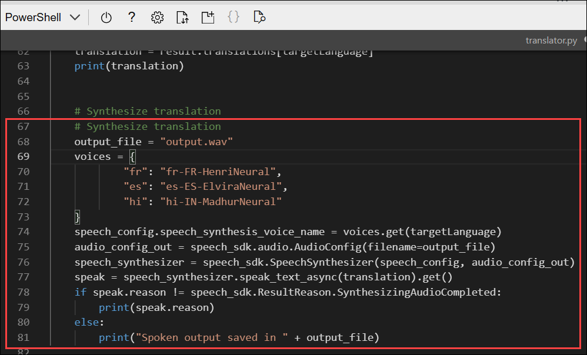  

1. Save your changes using **CTRL+S**, and re-run the program **(1)**:

    ```
   python translator.py
    ```

    - Enter the target language as `es` **(2)**

    - Review the output from the application, which should indicate that the spoken output translation was saved in a file.

      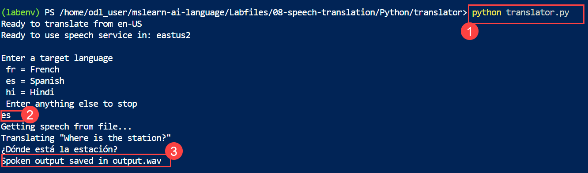  

1. If you have a media player capable of playing `.wav` audio files, download the file that was generated by entering the following command **(1)**:

    ```
   download ./output.wav
    ```

    - The download command creates a popup link at the bottom right of your browser. click on it **(2)**

      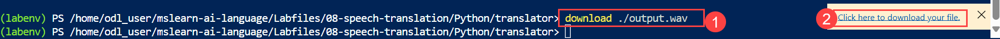    

       >**NOTE**: *In this example, you've used a **SpeechTranslationConfig** to translate speech to text, and then used a **SpeechConfig** to synthesize the translation as speech. You can in fact use the **SpeechTranslationConfig** to synthesize the translation directly, but this only works when translating to a single language, and results in an audio stream that is typically saved as a file.*

1. Select **Open file** to open the downloaded file.

    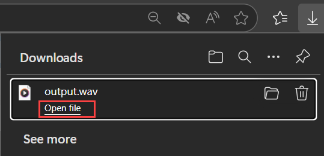  

1. You can hear the translated language audio in the downloaded audio file.

    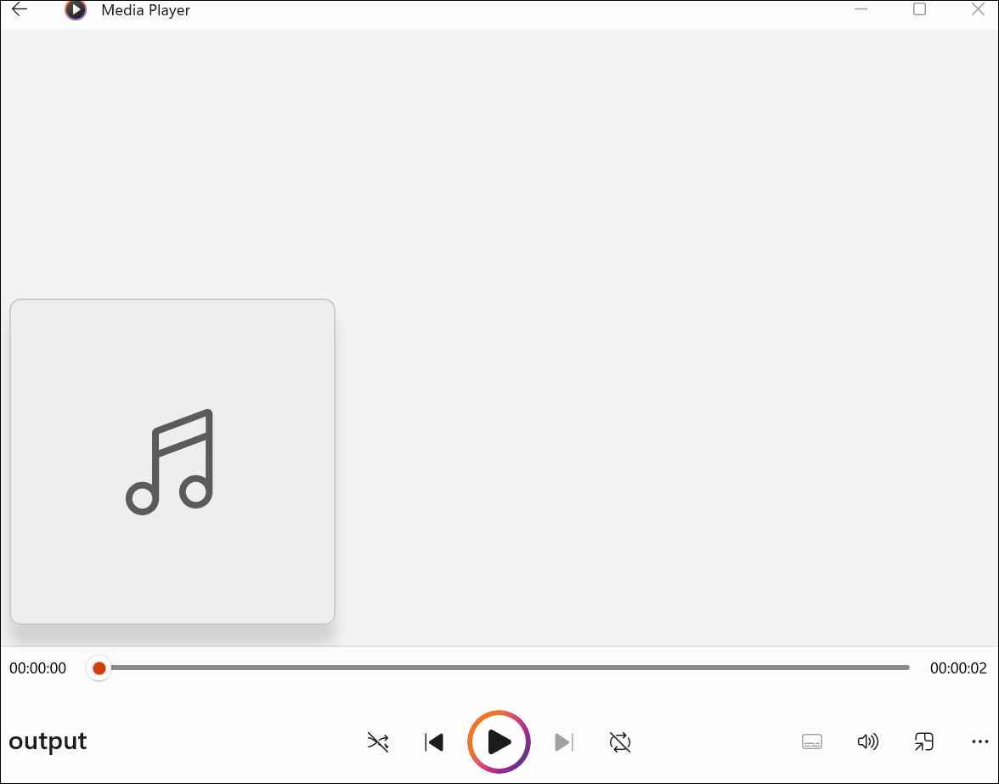 

### Summary

In this lab, you provisioned an Azure AI Speech resource and prepared a development environment in Azure Cloud Shell. You configured and updated a Python application with the Azure AI Speech SDK to recognize and translate speech into multiple languages. Finally, you enhanced the app to synthesize the translated text into speech and save it as an audio file, gaining hands-on experience with building and testing a speech translation solution using Azure AI Speech.

### You have successfully completed the Hands-on Lab!


     


   


