# Lab 22: Use Azure Speech in an agent

### Estimated Duration: 60 Minutes

## Lab Overview

In this exercise, you'll configure the Azure Speech in Foundry Tools MCP server, and connect it to an agent.

## Lab Objectives

- **Task 1:** Create an Azure storage account

- **Task 2:** Create a Microsoft Foundry project

- **Task 3:** Create an agent

- **Task 4:** Create an Azure Speech in Foundry Tools connection

- **Task 5:** Test the Azure Speech tool in the playground

- **Task 6:** Create a client application

- **Task 7:** Test the client application

> **Note:** Some of the technologies used in this exercise are in preview or in active development. You may experience some unexpected behavior, warnings, or errors.

## Task 1: Create an Azure storage account

The Azure Speech MCP server uses an Azure storage account to save generated audio files.

1. Open the [Azure portal](https://portal.azure.com) at `https://portal.azure.com`, and sign in using your Azure credentials.

1. In the Azure Portal tab, in the top search bar, search for **Storage accounts (1)** and select **Storage accounts (2)** from the services section.

    

1. In the **Storage center | Blob Storage** page, select **+ Create** to start creating a new storage account.

    

1. Create a storage account with the following settings and click **Review + create (9)**
    - **Subscription:** Select default subscription **(1)**
    - **Resource group:** Select **AI-3026-RG22 (2)**
    - **Storage account name:** **stg<inject key="DeploymentID" enableCopy="false"/> (3)**
    - **Region:** Select **<inject key="Region" enableCopy="false" /> (4)**
    - **Preferred storage type:** Azure Blob Storage or Azure Data Lake Storage Gen 2 **(5)**
    - **Primary workload:** Cloud native **(6)**
    - **Performance:** Standard **(7)**
    - **Redundancy:** Locally-redundant storage (LRS) **(8)**

      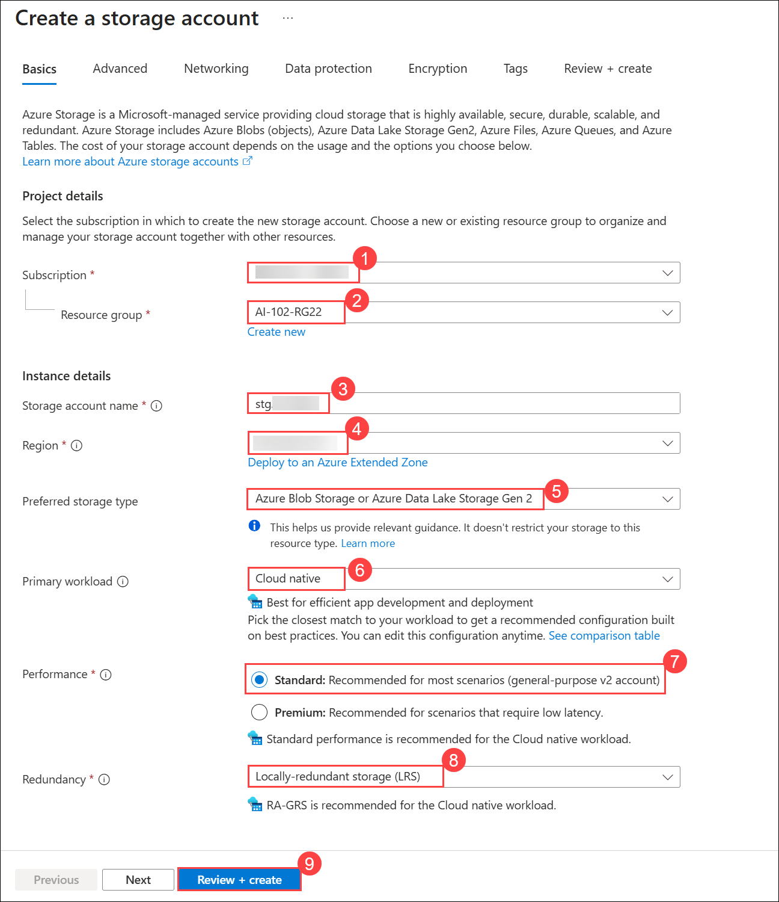 

1. On the **Review + create** tab, select **Create**.

    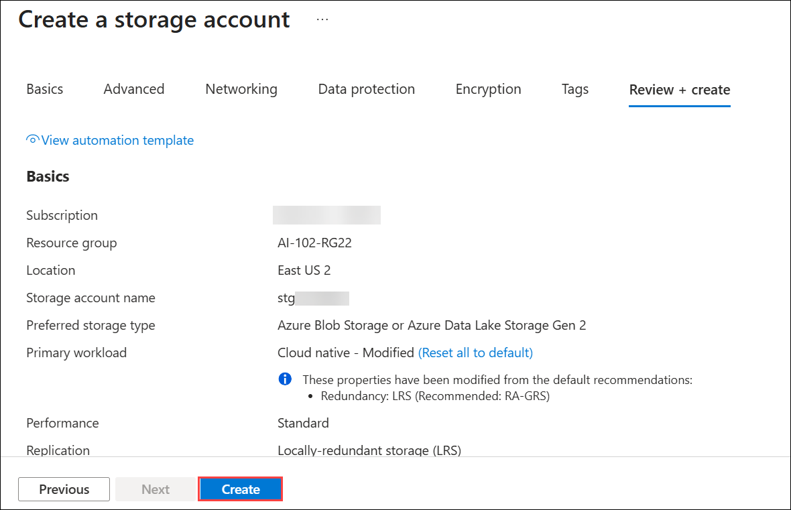

1. When the deployment is complete and the **Your deployment is complete** message appears, select **Go to resource**.

    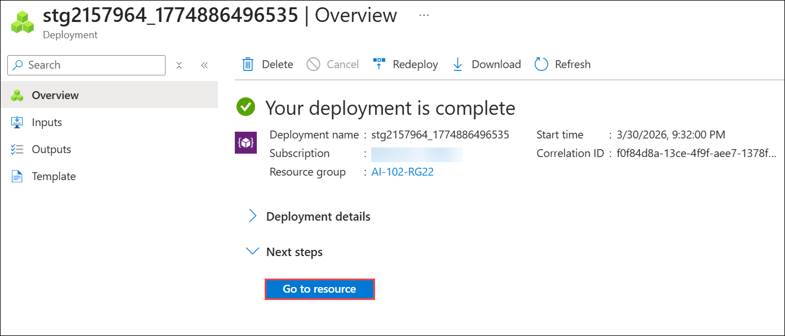

1. In the storage account page, expand **Data storage (1)**, select **Containers (2)**, and then click **+ Add container (3)**.

    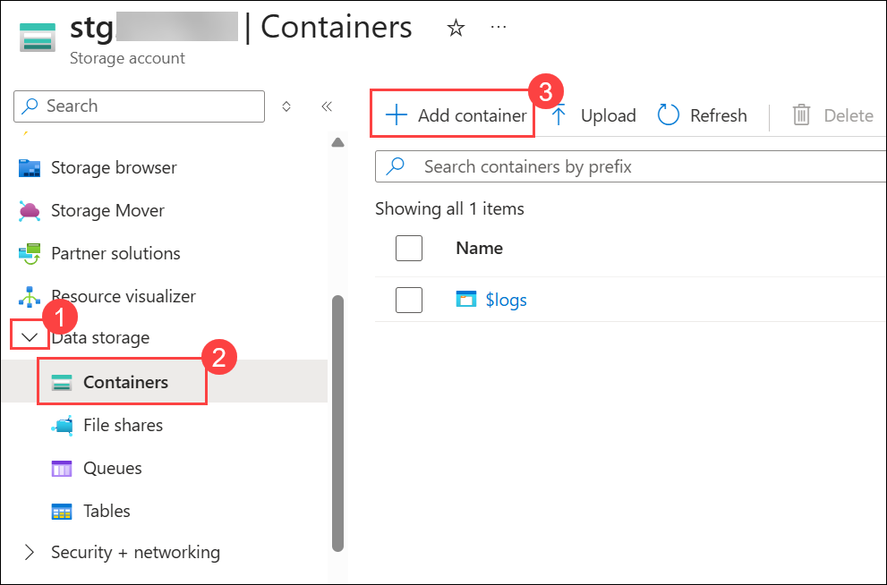

1. In the **New container** pane, enter `files` in the **Name (1)** field, and then select **Ok (2)**.

    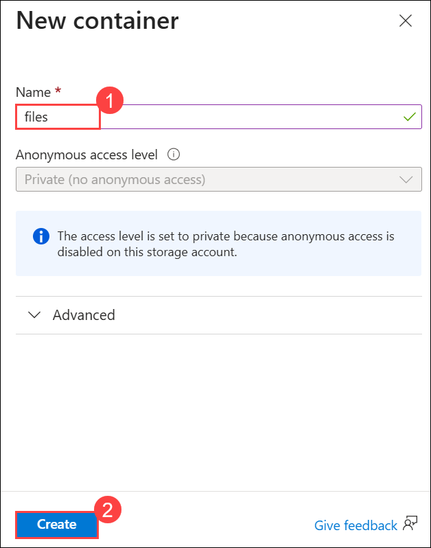

1. In the **files** container, select the **ellipsis (…) (1)**, and then click **Generate SAS (2)**.

    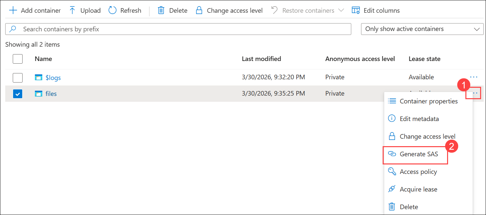

1. In the **Generate SAS** pane, create a SAS token with the following details and then click **Generate SAS token and URL (7)**.

    - **Signing method:** Account key **(1)**
    - **Signing key:** Key1 **(2)**
    - **Stored access policy**: None **(3)**
    - **Permissions (4)**:
        - Read
        - Add
        - Create
        - Write
        - List
    - **Start and expiry date/time**:
        - **Start**: The current date and time
        - **Expiry**: 11:59pm tomorrow **(5)**
    - **Allowed IP addresses**: Leave blank
    - **Allowed protocols**: HTTPS only **(6)**

    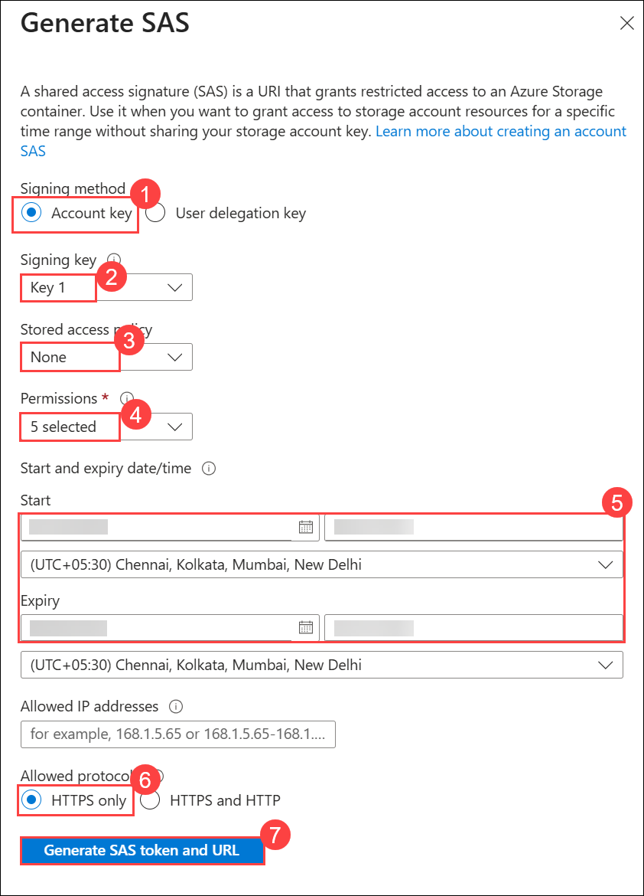

1. In the **Generate SAS** pane, copy the **Blob SAS token (1)** and **Blob SAS URL (2)**, and store them in a notepad for later use.

    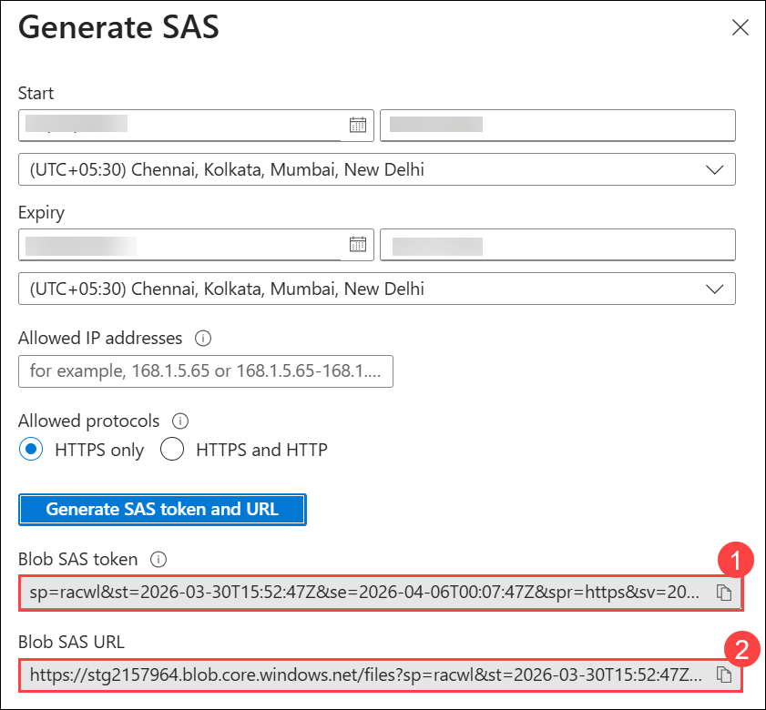

    > **IMPORTANT:** Copy the generated SAS token and URL, and store them in a text file for now - you'll need them later!

## Task 2: Create a Microsoft Foundry project

Microsoft Foundry uses projects to organize models, resources, data, and other assets used to develop an AI solution.

1. Open a new tab in the browser, right-click on the following link [Foundry portal](https://ai.azure.com), then **Copy link** and paste it in a browser tab to log in to **Microsoft Foundry portal**.

1. Click on **Sign in**.
 
    

1. If prompted, provide the credentials below:
 
   - **Email/Username:** <inject key="AzureAdUserEmail"></inject>
    
     

   - **Password:** <inject key="AzureAdUserPassword"></inject>
    
     

1. When the **Stay signed in?** window appears, select **No**.

    
    
    >**Note:** Close any tips or quick start panes that are opened the first time you sign in, and if necessary use the **Foundry** logo at the top left to navigate to the home page, which looks similar to the following image (close the **Help** pane if it's open):

1. At the top of the **Microsoft Foundry** portal, enable the **New Foundry toggle (1)** to switch to the latest Foundry user interface.

1. From the **Select a project to continue** dialog, click the drop-down under **Select or search for a project**, and then select **Create a new project (2)**.

     

1. In the **Create a project** window, enter **Myproject<inject key="DeploymentID" enableCopy="false"/> (1)** as the project name. Open the **Advanced options (2)** drop-down, fill in the following details, and then click **Create (7)**:

    * Subscription: **Choose Default Subscription (3)**
    * Resource group: **AI-102-RG22 (4)**
    * Microsoft Foundry resource: **Keep as Default (5)**
    * Region: **<inject key="Region" enableCopy="false" /> (6)**

      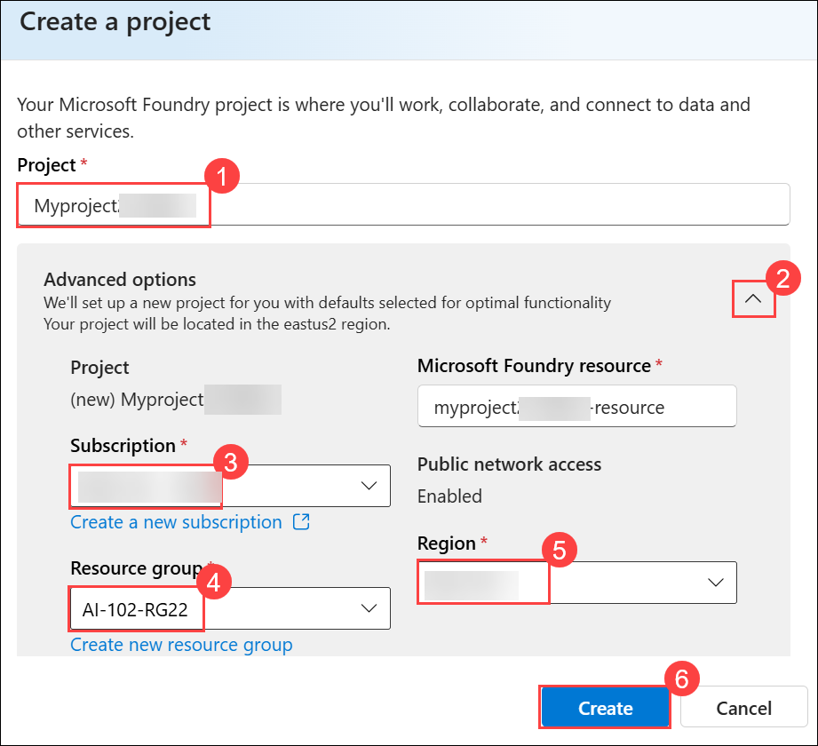

      >**Note:** Some Azure AI resources are constrained by regional model quotas. In the event of a quota limit being exceeded later in the exercise, there's a possibility you may need to create another resource in a different region.

1. Wait for your project created. It may take a few minutes.

1. On the home page for your project, note that the API key, project endpoint, and OpenAI endpoint are displayed here.

    

    > **TIP**: Copy the project key to the clipboard - you're going to need it later!

## Task 3: Create an agent

Now that you have a Foundry project, you can create an agent.

1. In the **Start building (1)** menu, select **Create agents (2)**.

    

1. When prompted, name the agent `speech-agent` **(1)** and then click **Create (2)**. 

    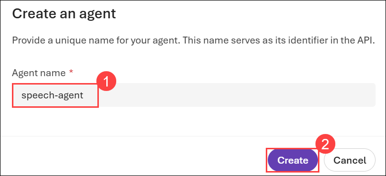

1. When ready, your agent opens in the agent playground.

1. In the model drop-down list, ensure that a **gpt-4.1 (1)** model has been deployed and selected for your agent.

1. Assign your agent the following **Instructions (2)**:

    ```
   You are an AI agent that uses the Azure AI Speech tool to transcribe and generates speech.
    ```

1. Use the **Save (3)** button to save the changes.

    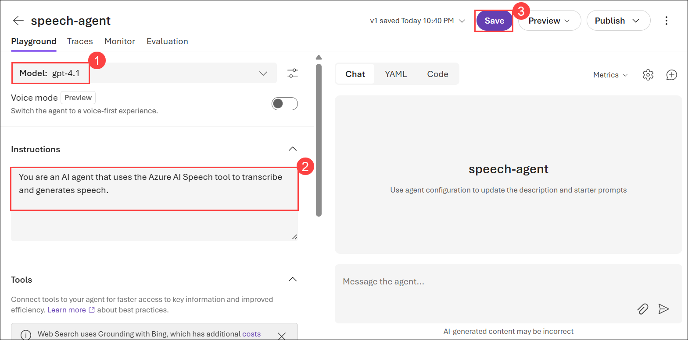

1. Test the agent by entering the following prompt in the **Chat** pane:

    ```
   What can you help me with?
    ```

    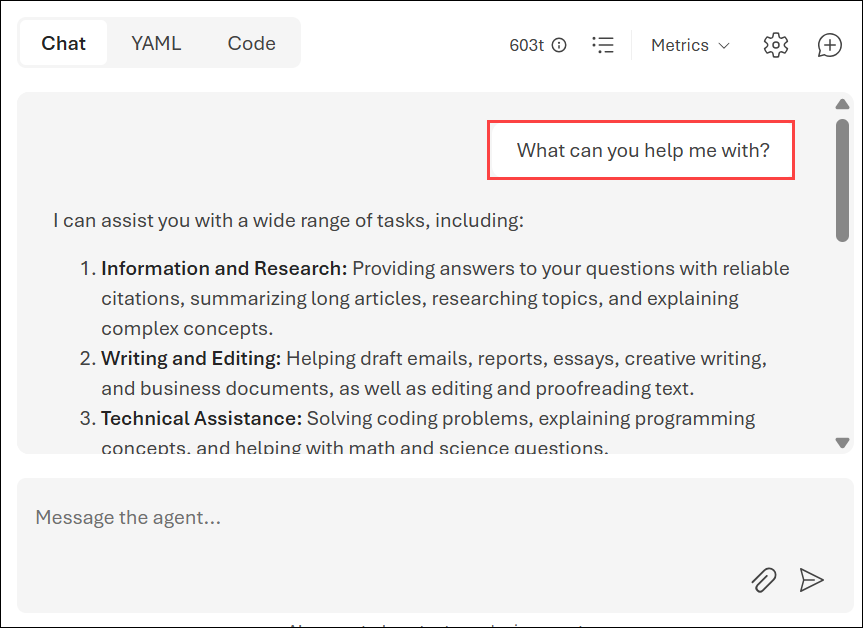

1. The agent should respond with an appropriate answer based on its instructions.

## Task 4: Create an Azure Speech in Foundry Tools connection

Foundry includes an MCP server for Azure Speech in Foundry Tools, which you can connect to your project and use in your agent.

1. In the left navigation pane, select **Tools (1)**, and then click **Connect a tool (2)**.

    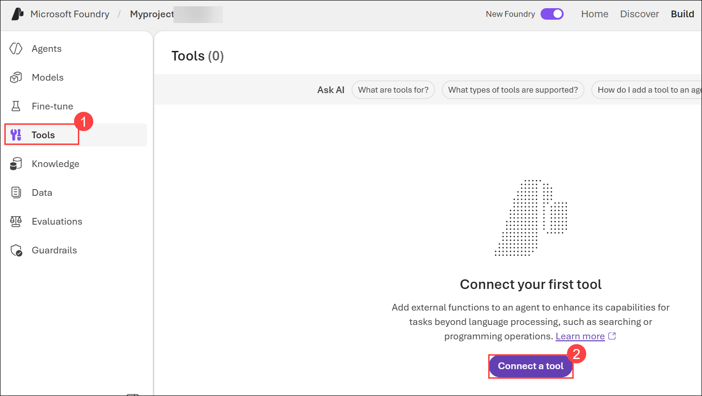

1. In the **Select a tool** pane, search for **Azure Speech (1)**, select **Azure Speech MCP Server (2)**, and then click **Create (3)**.

    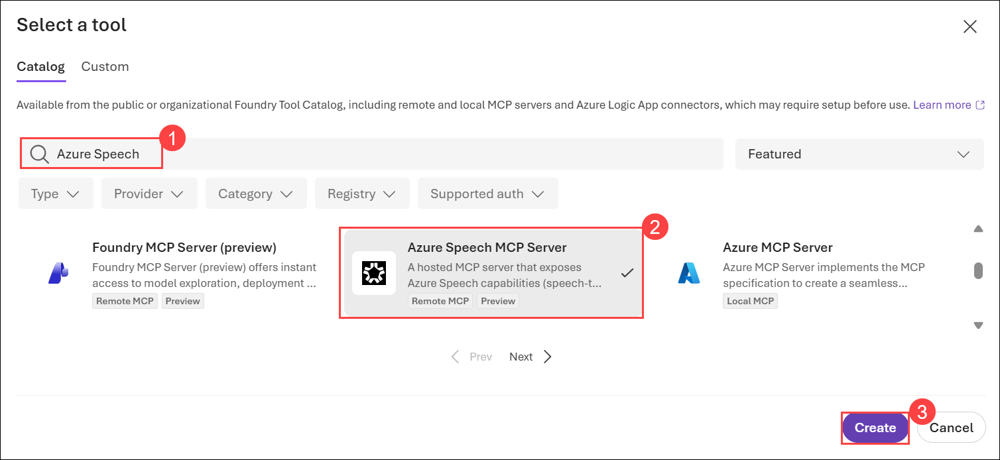

1. In the **Connect the Azure Speech MCP Server tool** pane, specify the following configuration and click on **Connect (4)**
    
    - **Foundry resource name**: **Myproject<inject key="DeploymentID" enableCopy="false"/>-resource (1)**
    - **Authentication**: Key-based
    - **Bearer** (**Ocp-Apim-Subscription-Key**): The key for your Foundry project **(2)**
    - **X-Blob-Container-Url**: The SAS URL for your storage container **(3)**

      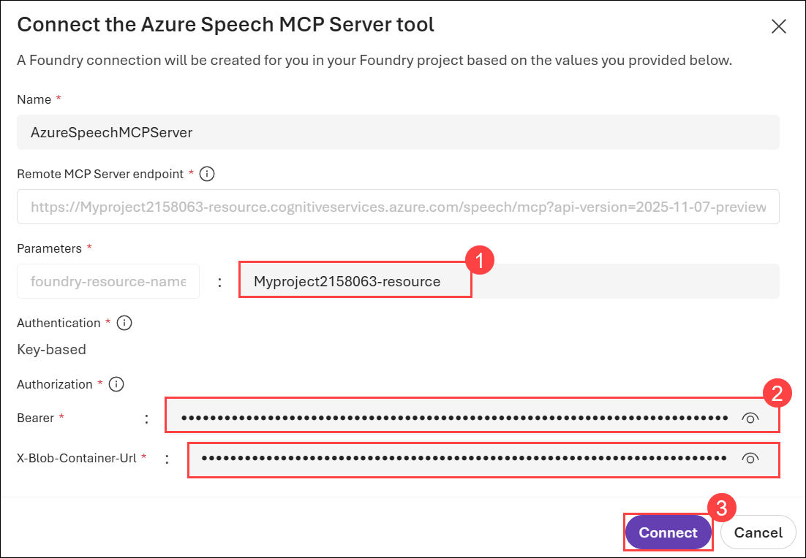

    > **Note:** If key-based authentication is disabled by a policy in your Azure subscription, you can use Entra ID authentication to connect the agent to the Azure Language service.

1. Wait for the MCP tool connection to be created, and then view its details page.

1. On the details page for the Azure Speech MCP Server connection, select **Use in an agent (1)**, and then select the **Speech-Agent (2)** agent.

    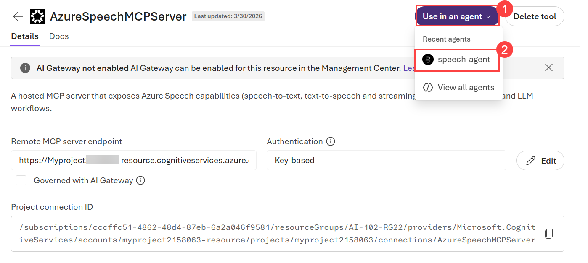

    The agent should open in the playground, with the Azure Speech in Foundry Tools tool connected.

## Task 5: Test the Azure Speech tool in the playground

Now let's test the agent's ability to use the tool you connected.

1. In the agent playground for the **speech-agent** agent, enter the following prompt:

    ```
    Generate "To be or not to be, that is the question." as speech
    ```

    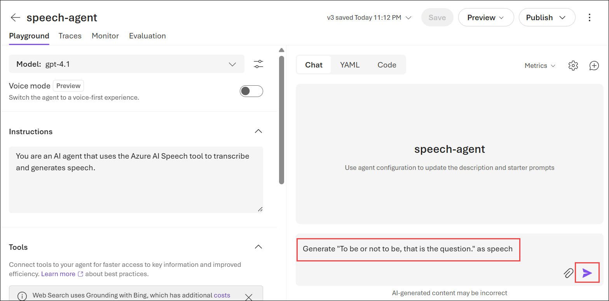

1. When prompted, select **Approve (1)**, and then choose **Always approve all Azure Speech MCP Server tools (2)**.

    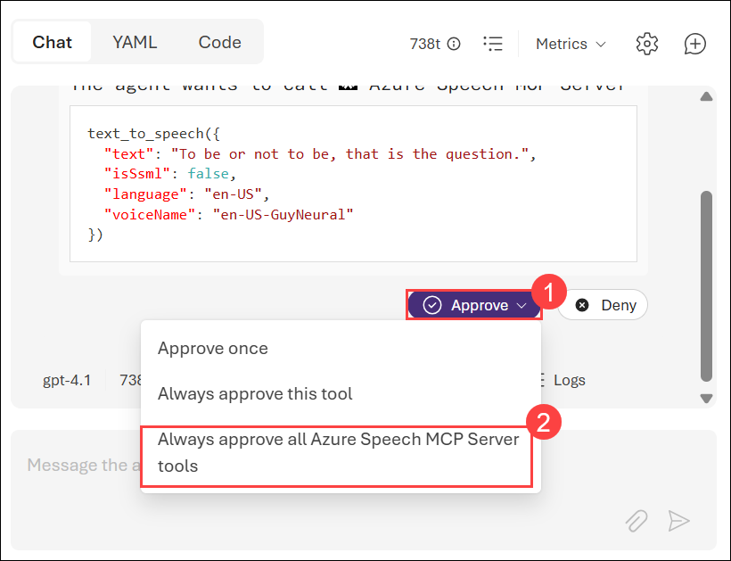

1. Review the response, which should include a link to the generated audio file. Then click the link to hear the synthesized speech.

    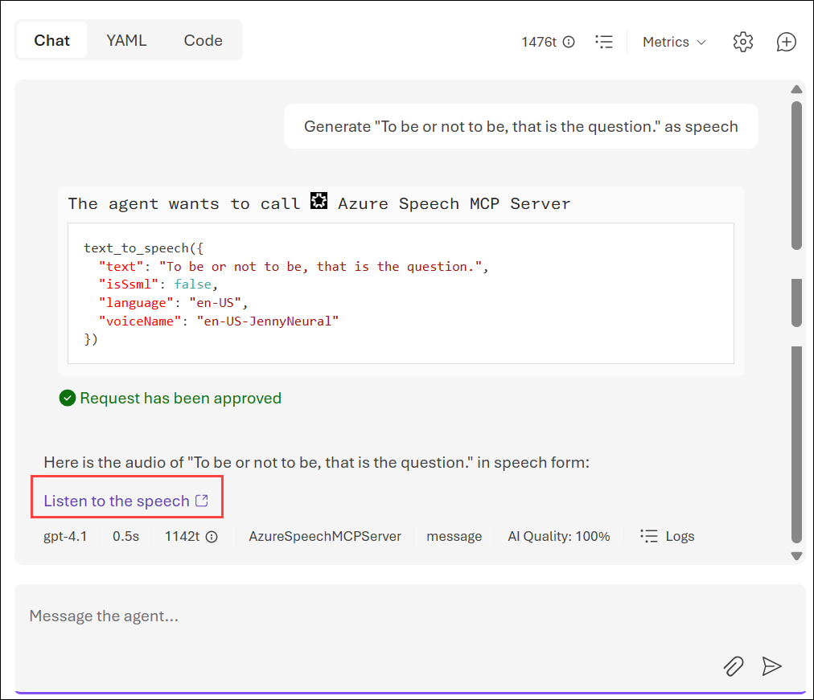

    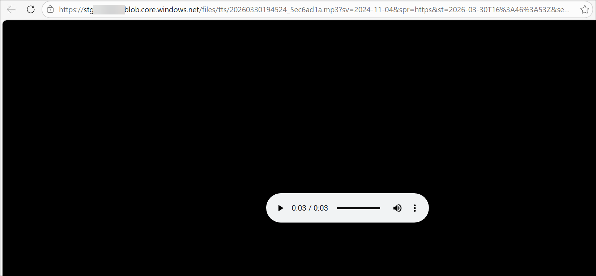

1. Enter the following prompt:

    ```
    Transcribe the file at https://microsoftlearning.github.io/mslearn-ai-language/Labfiles/05-speech-tool/speech_1.wav
    ```

1. If prompted, approve use of the Azure Speech tool by selecting **Always approve all Azure Speech MCP Server tools**.

1. Review the output, which should be a transcription of the audio file.

    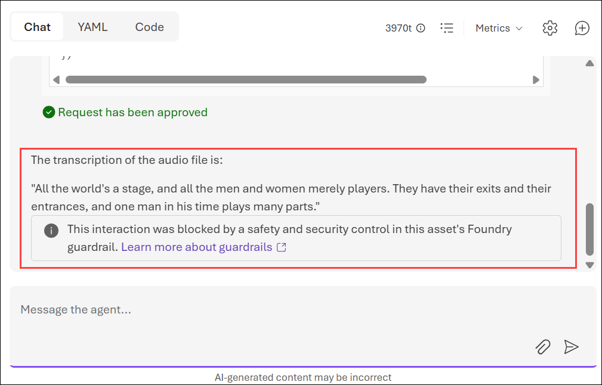

## Task 6: Create a client application

Now that you have a working agent, you can create a client application that uses it.

### Task 6.1 Get the application files from GitHub

1. Open the **Visual Studio Code** from the desktop.

    

1. In Visual Studio Code, select **Extensions (1)** from the left pane, search for **Python (2)**, choose the **Python (3)** extension by Microsoft, and then click **Install (4)**.

   

1. Navigate to the **Welcome** page in VS Code by selecting the ellipsis **(...) (1)** from the top bar, then **Help (2)**, and finally **Welcome (3)**.

    

1. On the **Get Started** page, select **Mark Done** to complete this step and proceed.

    

1. Select **Clone Git Repository... (1)**, paste the repository URL **(2)** `https://github.com/microsoftlearning/mslearn-ai-language`, and then choose **Clone from URL (3)** to proceed.

    

1. Select the destination folder **C:\LabFiles (1)** and click **Select as Repository Destination (2)** to proceed.

    

1. When prompted, select **Open** to open the cloned repository.

    

1. In the trust prompt, select **Yes, I trust the authors (1)** to continue.

   

1. After the repo has been cloned, in the Explorer pane, expand the folder **Labfiles (1)** → **05-speech-tool/Python (2)** select **speech-client (3)**. The application files include: 

    - **.env** (the application configuration file)
    - **requirements.txt** (the Python package dependencies that need to be installed)
    - **speech-client.py** (the code file for the application)

        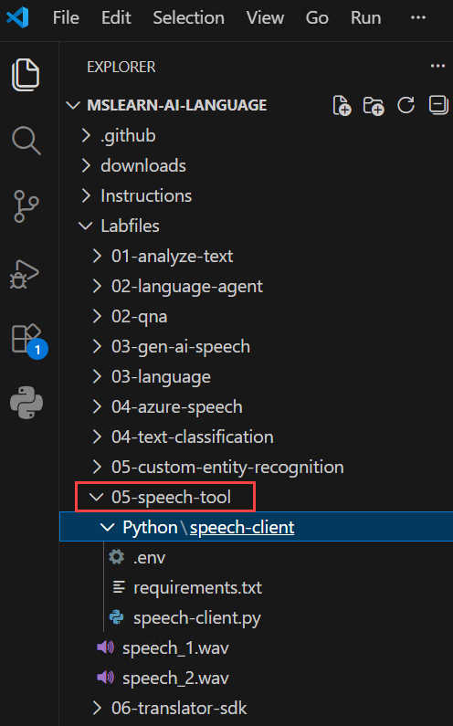

### Task 6.2: Configure the application

1. Right-click on the **requirements.txt (1)** file under **speech-client** folder and select **Open in Integrated Terminal (2)**.

    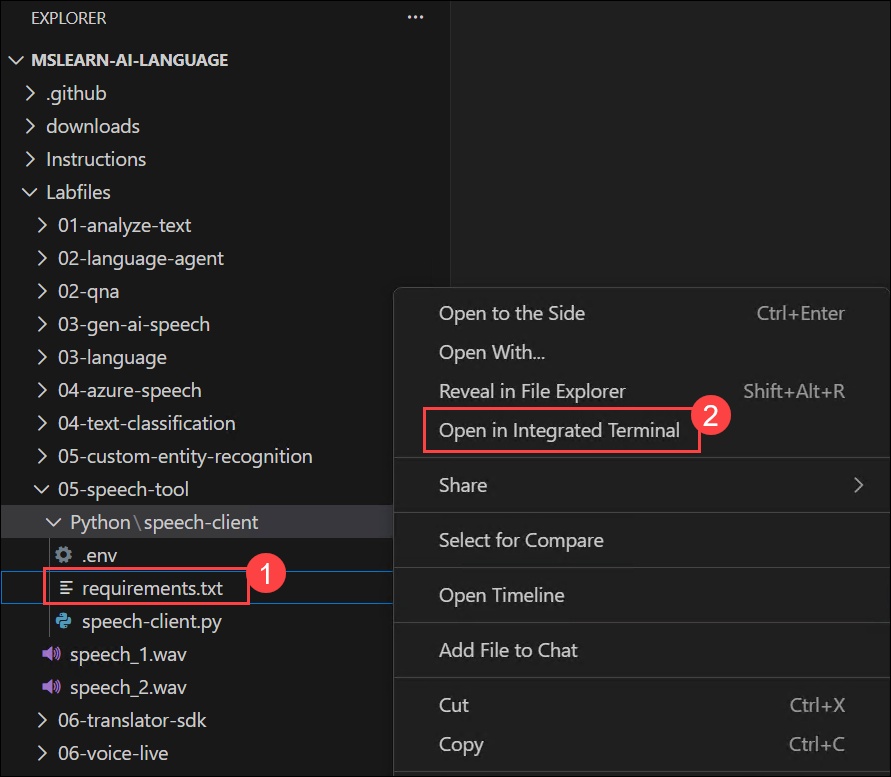

1. In the terminal, enter the following command to install the required Python packages in a virtual environment:

    ```
    python -m venv labenv
    .\labenv\Scripts\Activate.ps1
    pip install -r requirements.txt
    ```

1. In the **Explorer** pane, in the **speech-client** folder, select the **.env (1)** file to open it. Then update the configuration values to include your project **endpoint (2)** (from the project home page in Foundry Portal)and the name of your agent (which should be **Speech-Agent (3)** - note that this name is case-sensitive).

    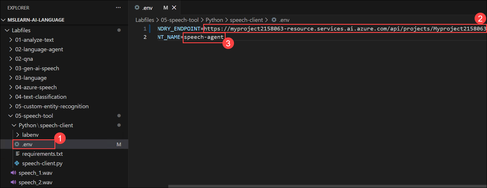

1. Once done, press **Ctrl+S** to save the changes.

### Task 6.3: Implement application code

1. In the **Explorer** pane, in the **speech-client** folder,  open the **speech-client.py** file.

    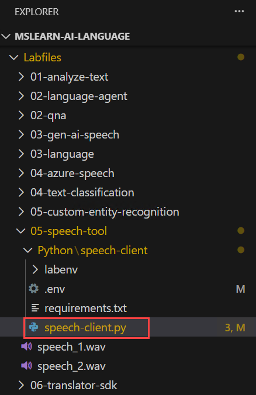

1. Review the existing code. You will add code to submit prompts to your agent.

    > **Tip**: As you add code to the code file, be sure to maintain the correct indentation.

1. At the top of the code file, under the existing namespace references, find the comment **Import namespaces** and add the following code to import the namespaces you will need:

    ```python
   # import namespaces
   from azure.identity import DefaultAzureCredential
   from azure.ai.projects import AIProjectClient
    ```

    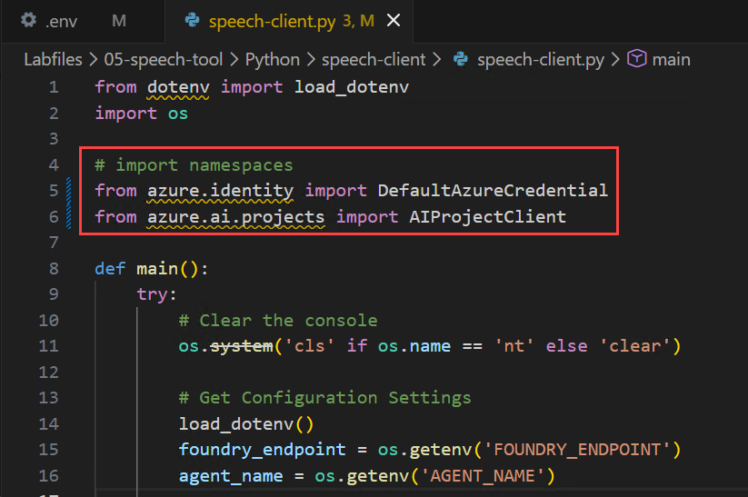

1. In the **main** function, note that code to load the endpoint and key from the configuration file has already been provided. Then find the comment **Get project client**, and add the following code to create a client for your Foundry project:

    ```python
   # Get project client
   project_client = AIProjectClient(
        endpoint=foundry_endpoint,
        credential=DefaultAzureCredential(),
   )
    ```

    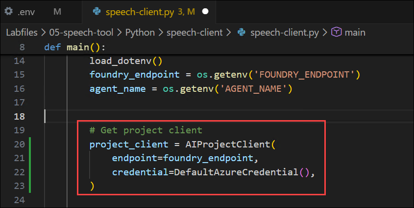

1. Find the comment **Get an OpenAI client**, and add the following code to get an OpenAI client with which to call your agent.

    ```python
   # Get an OpenAI client
   openai_client = project_client.get_openai_client()
    ```

    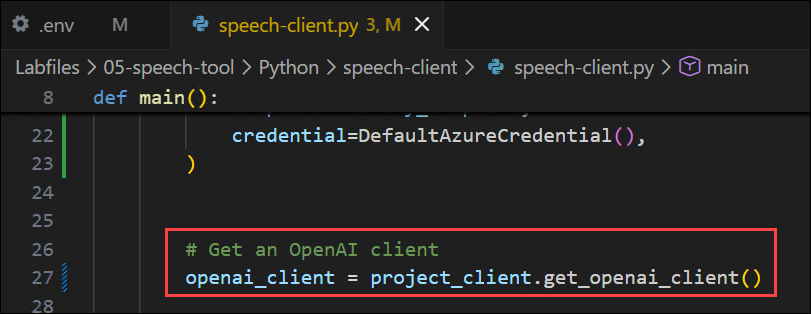

1. Find the comment **Use the agent to get a response**, and add the following code to submit a user prompt to your agent, and display the response.

    ```python
   # Use the agent to get a response
   response = openai_client.responses.create(
        input=[{"role": "user", "content": prompt}],
        extra_body={"agent_reference": {"name": agent_name, "type": "agent_reference"}},
   )

   print(f"{agent_name}: {response.output_text}")
    ```

    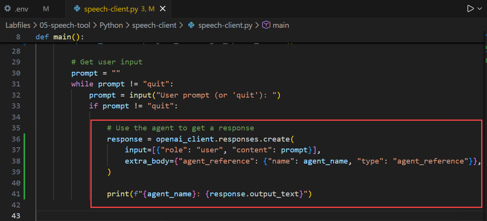

1. Save the changes to the code file by pressing **Ctrl+S**. 

## Task 7: Test the client application

Now let's test the application by running it in a Python environment and authenticating the connection to your project.

1. In the Visual Studio Code terminal, enter the following command to sign into Azure

   ```powershell
    az login
    ```

    > **Note:** Minimize the VS Code to see the **Sign in** window.

1. In the **Sign in** window, select **Work or school account** **(1)**, and then select **Continue** **(2)**.

    

1. On the **Sign in** page, provide the credentials below:
 
   - **Email/Username:** <inject key="AzureAdUserEmail"></inject>
    
     

   - **Password:** <inject key="AzureAdUserPassword"></inject>
    
     

1. When prompted, select **Yes** to sign in to all apps and websites on this device.

    

1. On the **Account added to this device** window, select **Done** to complete the sign-in process.

    

1. In the Visual Studio Code terminal, press **Enter** to select the default subscription.

1. After you have signed in, enter the following command to run the application:

    ```powershell
    python speech-client.py
    ```

1. When prompted, enter the following prompt:

    ```
    Synthesize "Better a witty fool, than a foolish wit!" as speech using the voice "en-GB-SoniaNeural".
    ```

    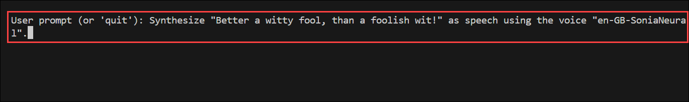

1. Review the response, which should include a clickable link to the generated audio file, and then press **Ctrl + Click** on the link to open and play it.

    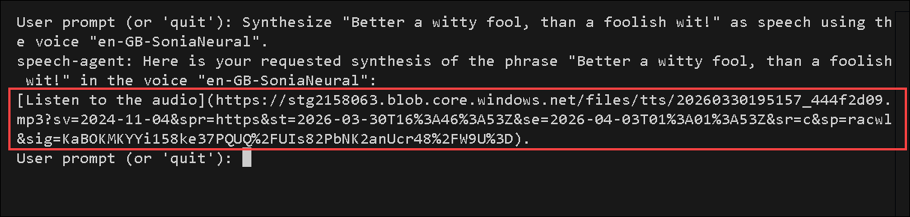

1. In the prompt dialog, select **Open** to open the generated audio file in the browser.

    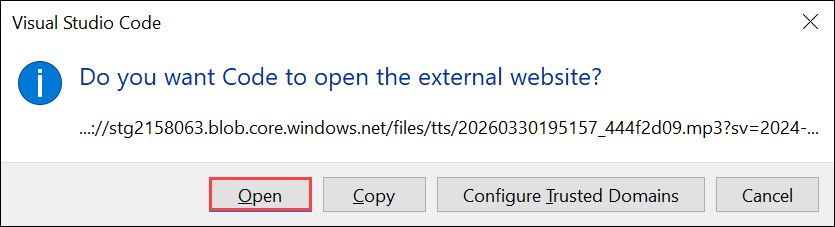

    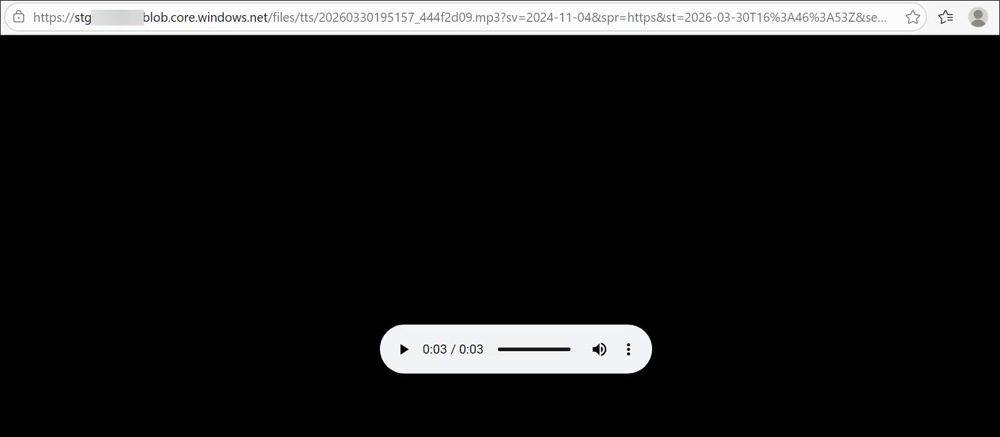

1. After checking out the generated audio file, enter the following prompt:

     ```
     Transcribe https://microsoftlearning.github.io/mslearn-ai-language/Labfiles/05-speech-tool/speech_2.wav
     ```

1. Review the response.

    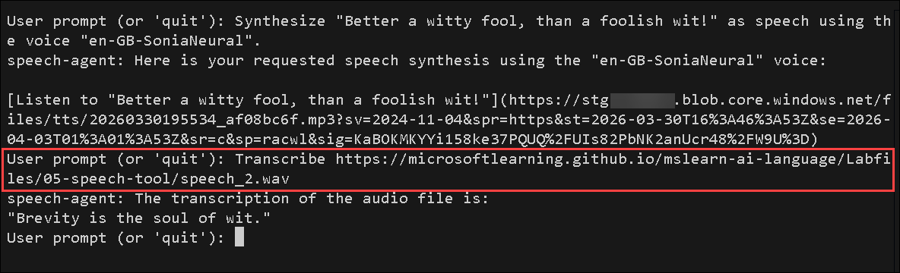

## Summary

### You have successfully completed the Hands-on Lab!