# Lab 22: Develop an audio-enabled chat app

### Estimated Duration : 30 Minutes

## Overview

In this exercise, you use the *Phi-4-multimodal-instruct* generative AI model to generate responses to prompts that include audio files. You'll develop an app that provides AI assistance for a produce supplier company by using Azure AI Foundry and the Python OpenAI SDK to summarize voice messages left by customers.

While this exercise is based on Python, you can develop similar applications using multiple language-specific SDKs; including:

- [Azure AI Projects for Python](https://pypi.org/project/azure-ai-projects)
- [OpenAI library for Python](https://pypi.org/project/openai/)
- [Azure AI Projects for Microsoft .NET](https://www.nuget.org/packages/Azure.AI.Projects)
- [Azure OpenAI client library for Microsoft .NET](https://www.nuget.org/packages/Azure.AI.OpenAI)
- [Azure AI Projects for JavaScript](https://www.npmjs.com/package/@azure/ai-projects)
- [Azure OpenAI library for TypeScript](https://www.npmjs.com/package/@azure/openai)

This exercise takes approximately **30** minutes.

## Task 1: Create an Azure AI Foundry project

Let's start by deploying a model in an Azure AI Foundry project.

1. Open a new tab in the browser, right-click on the following link [Azure AI Foundry portal](https://ai.azure.com), then **Copy link** and paste it in a browser tab to log in to **Azure AI Foundry portal**.

1. Click on **Sign in**.
 
    

1. If prompted, provide the credentials below:
 
   - **Email/Username:** <inject key="AzureAdUserEmail"></inject>
    
        

   - **Password:** <inject key="AzureAdUserPassword"></inject>
    
        

1. When the **Stay signed in?** window appears, select **No**.

    

1. Click on **X** to close the **Chat with Foundry Agent** popup window.

    

    >**Note:** Close the **Help** pane if it's open

1. In the home page, in the **Explore models and capabilities** section, search for the **`Phi-4-multimodal-instruct` (1)** model and then select **Phi-4-multimodal-instruct (2)** which we'll use in our project.

    

1. Then at the top of the page for the model, select **Use this model**.

    

1. In the **Create a new project** window, enter **Myproject<inject key="DeploymentID"></inject> (1)** as the project name. Open the **Advanced options (2)** drop-down, fill in the following details, and then click **Create (7)**:

    * Subscription: **Choose Default Subscription (3)**
    * Resource group: **AI-102-RG22 (4)**
    * Azure AI Foundry resource: **Keep as Default (5)**
    * Region: **<inject key="Region"></inject> (6)**

        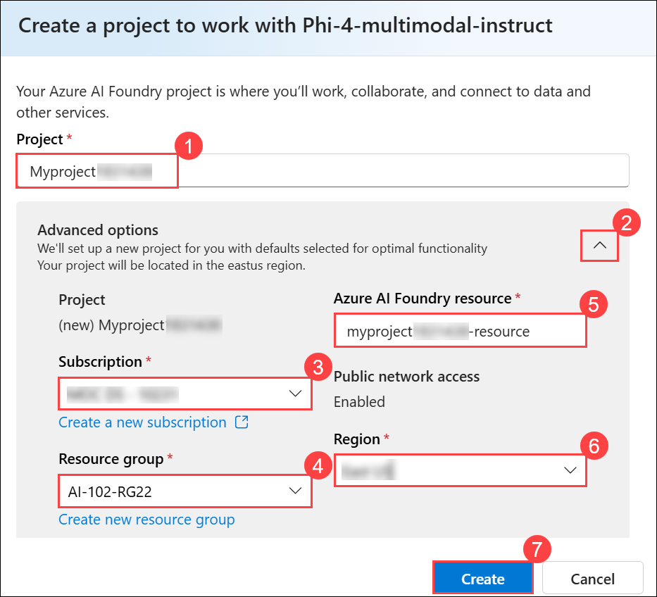

        >**Note:** Some Azure AI resources are constrained by regional model quotas. In the event of a quota limit being exceeded later in the exercise, there's a possibility you may need to create another resource in a different region. You can check the latest regional availability for specific models in the [Azure AI Foundry documentation](https://learn.microsoft.com/azure/ai-foundry/how-to/deploy-models-serverless-availability#region-availability)

        >**Note:** It may take a few moments for the operation to complete.

1. Select **Agree and Proceed** to agree to the model terms.

    

1. Then select **Deploy** to complete the Phi model deployment.

    

1. When your project is created, the model details will be opened automatically. Note  the name of your model deployment; which should be **Phi-4-multimodal-instruct**.

    

1. On the left navigation pane, select **Overview (1)** to open your project’s main page. In the **Project details** section, find the **Azure AI Foundry project endpoint (2)**, this is the endpoint you’ll use to connect your client application to the project.

    

## Task 2: Create a client application

Now that you deployed a model, you can use the Azure AI Foundry and Azure AI Model Inference SDKs to develop an application that chats with it.

> **Tip**: You can choose to develop your solution using Python or Microsoft C#. Follow the instructions in the appropriate section for your chosen language.

### Prepare the application configuration

1. On the **Azure portal** homepage, click the **\[>\_] Cloud Shell (1)** button located to the right of the **Copilot** tab at the top. This opens a new Cloud Shell session. In the **Welcome to Azure Cloud Shell** window, choose **PowerShell (2)**.

    

    >**Note:** The cloud shell provides a command-line interface in a pane at the bottom of the Azure portal. You can resize or maximize this pane to make it easier to work in.

    > **Note:** If you have previously created a cloud shell that uses a **Bash** environment, switch it to **PowerShell**.

1. In the **Getting started** window, ensure **No storage account required (1)** is selected. From the **Subscription** drop-down, choose **Default subscription (2)**, then click **Apply (3)**.

    

1. In the Cloud Shell toolbar, open the **Settings (1)** menu and choose **Go to Classic version (2)** from the drop-down.

    

    >**Note:** Ensure you've switched to the classic version of the cloud shell before continuing.

1. In the cloud shell pane, enter the following commands to clone the GitHub repo containing the code files for this exercise (type the command, or copy it to the clipboard and then right-click in the command line and paste as plain text):

    ```
    rm -r mslearn-ai-audio -f
    git clone https://github.com/MicrosoftLearning/mslearn-ai-language
    ```

    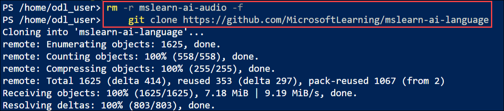

    > **Tip**: As you paste commands into the cloudshell, the ouput may take up a large amount of the screen buffer. You can clear the screen by entering the `cls` command to make it easier to focus on each task.

1. After the repo has been cloned, navigate to the folder containing the application code files:  

    ```
    cd mslearn-ai-language/Labfiles/09-audio-chat/Python
    ````

    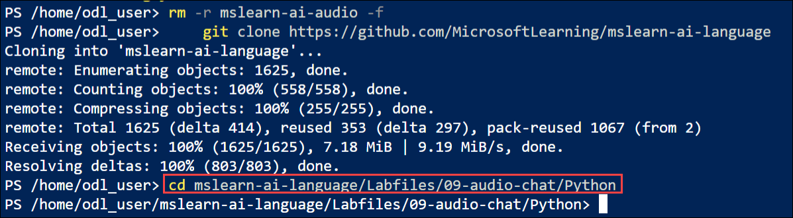

1. In the cloud shell command line pane, enter the following command to install the libraries you'll use:

    ```
    python -m venv labenv
    ./labenv/bin/Activate.ps1
    pip install -r requirements.txt azure-identity azure-ai-projects openai
    ```

1. Enter the following command to edit the configuration file that has been provided. The file should open in a code editor.

    ```
    code .env
    ```

    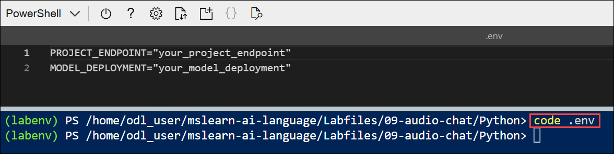


1. In the code file, replace the placeholder values with the correct details for your project:

    - your_project_endpoint: **Azure AI Foundry project endpoint (1)**
    - your_model_deployment: **Phi-4-multimodal-instruct (2)**

        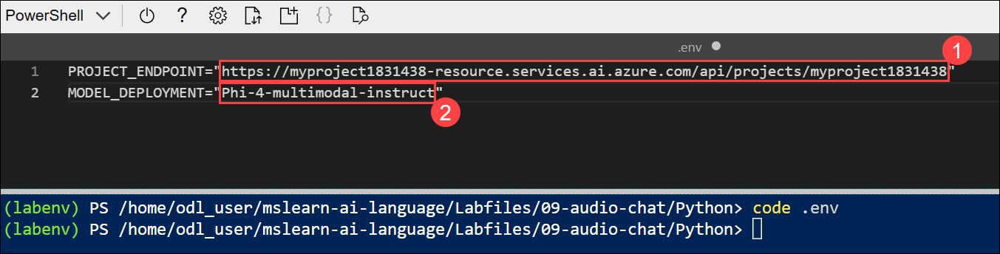

1. After you replace the placeholders, in the code editor, use the **CTRL+S** command or **Right-click > Save** to save your changes and then use the **CTRL+Q** command or **Right-click > Quit** to close the code editor while keeping the cloud shell command line open.

## Task 3: Write code to connect to your project and get a chat client for your model

1. Enter the following command to edit the code file:

    ```
    code audio-chat.py
    ```
    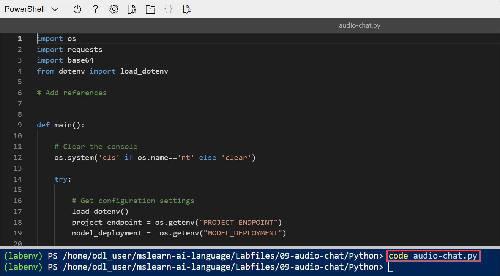

1. In the code file, note the existing statements that have been added at the top of the file to import the necessary SDK namespaces. Then, Find the comment **Add references**, add the following code to reference the namespaces in the libraries you installed previously:

    ```python
    # Add references
    from azure.identity import DefaultAzureCredential
    from azure.ai.projects import AIProjectClient
    ```

    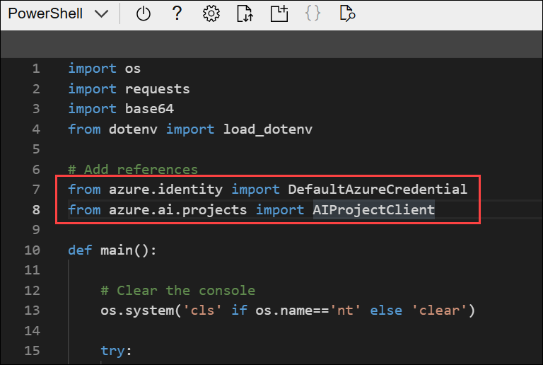

1. In the **main** function, under the comment **Get configuration settings**, note that the code loads the project connection string and model deployment name values you defined in the configuration file.

    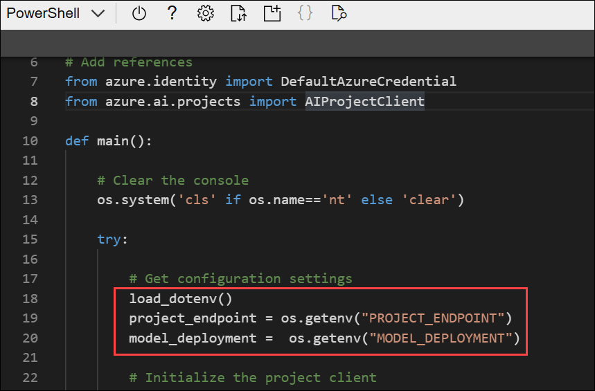

1. Find the comment **Initialize the project client** and add the following code to connect to your Azure AI Foundry project:

    ```python
    # Initialize the project client
    project_client = AIProjectClient(            
        credential=DefaultAzureCredential(
            exclude_environment_credential=True,
            exclude_managed_identity_credential=True
        ),
        endpoint=project_endpoint,
    )
    ```

    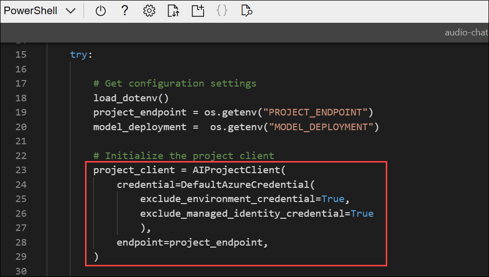

    > **Tip**: Be careful to maintain the correct indentation level for your code.

1. Find the comment **Get a chat client**, add the following code to create a client object for chatting with your model:

    ```python
    # Get a chat client
    openai_client = project_client.get_openai_client(api_version="2024-10-21")
    ```

    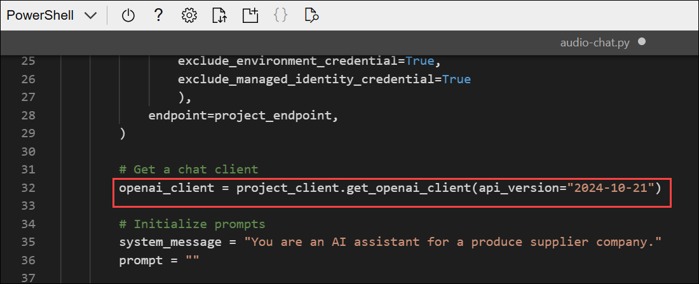

## Task 4: Write code to submit an audio-based prompt

Before submitting the prompt, we need to encode the audio file for the request. Then we can attach the audio data to the user's message with a prompt for the LLM. Note that the code includes a loop to allow the user to input a prompt until they enter "quit". 

1. Under the comment **Encode the audio file**, enter the following code to prepare the following audio file:

    <video controls src="https://github.com/MicrosoftLearning/mslearn-ai-language/raw/refs/heads/main/Instructions/media/avocados.mp4" title="A request for avocados" width="150"></video>

    ```python
    # Encode the audio file
    file_path = "https://github.com/MicrosoftLearning/mslearn-ai-language/raw/refs/heads/main/Labfiles/09-audio-chat/data/avocados.mp3"
    response = requests.get(file_path)
    response.raise_for_status()
    audio_data = base64.b64encode(response.content).decode('utf-8')
    ```

    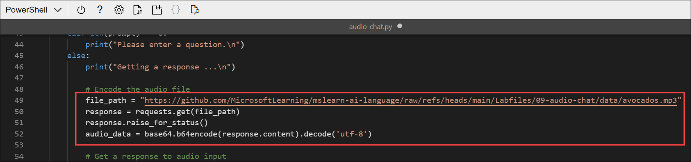

1. Under the comment **Get a response to audio input**, add the following code to submit a prompt:

    ```python
   # Get a response to audio input
    response = openai_client.chat.completions.create(
        model=model_deployment,
        messages=[
            {"role": "system", "content": system_message},
            { "role": "user",
                "content": [
                { 
                    "type": "text",
                    "text": prompt
                },
                {
                    "type": "input_audio",
                    "input_audio": {
                        "data": audio_data,
                        "format": "mp3"
                    }
                }
            ] }
        ]
    )
    print(response.choices[0].message.content)
    ```

    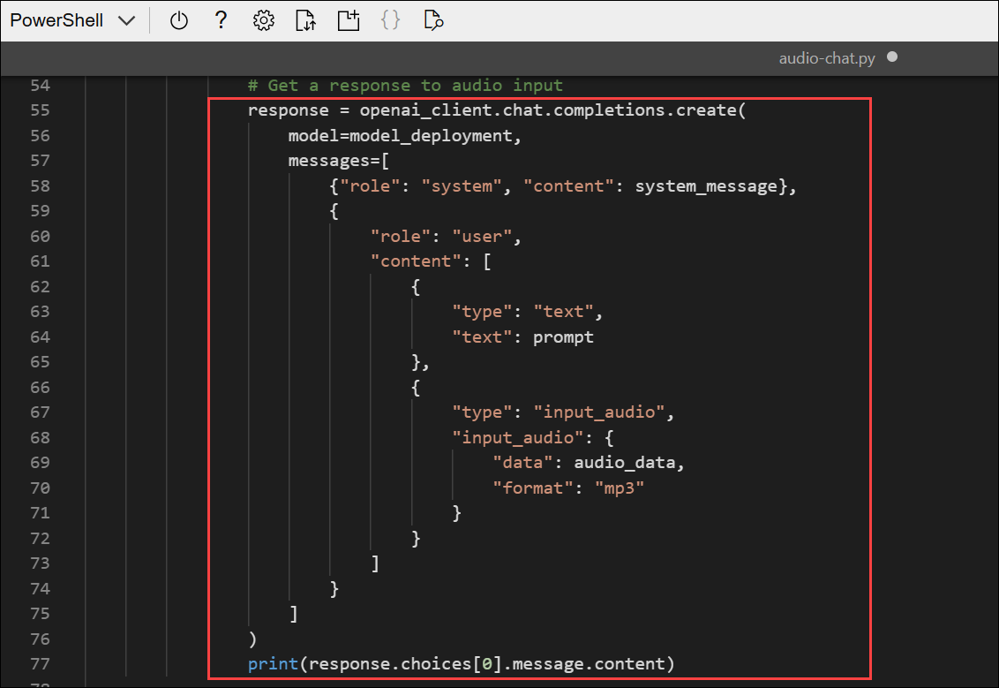

    > **Tip**: As you add code, be sure to maintain the correct indentation.

1. Use the **CTRL+S** command to save your changes to the code file. You can also close the code editor (**CTRL+Q**) if you like.

## Task 5: Sign into Azure and run the app

1. In the cloud shell command-line pane, enter the following command to sign into Azure. Click on the **Link (1)** and copy the **code (2)** provided.

    ```
    az login
    ```

    

1. In the new browser tab, when the **Enter code to allow access** window appears, paste the copied code and select **Next**.

    

1. In the **Pick an account** dialog box, choose **ODL_User<inject key="DeploymentID"></inject>**. 

    

1. In the **Are you trying to sign in to Microsoft Azure CLI?** dialog box, click **Continue**.

    

1. When the **Microsoft Azure Cross-platform Command Line Interface** window pops up, return to the browser tab with Cloud Shell open. 

    

1. In the Cloud Shell console, press **Enter** to select the only available subscription.

    

1. In the cloud shell command-line pane, enter the following command to run the app:

    ```
    python audio-chat.py
    ```

1. When prompted, enter the prompt 

    ```
    Can you summarize this customer's voice message?
    ```
    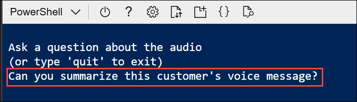

1. Review the response.

    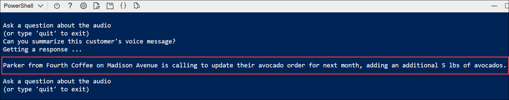

## Task 6: Use a different audio file

1. In the code editor for your app code, find the code you added previously under the comment **Encode the audio file**. Then modify the file path url as follows to use a different audio file for the request (leaving the existing code after the file path):

    ```python
    # Encode the audio file
    file_path = "https://github.com/MicrosoftLearning/mslearn-ai-language/raw/refs/heads/main/Labfiles/09-audio-chat/data/fresas.mp3"
    ```

    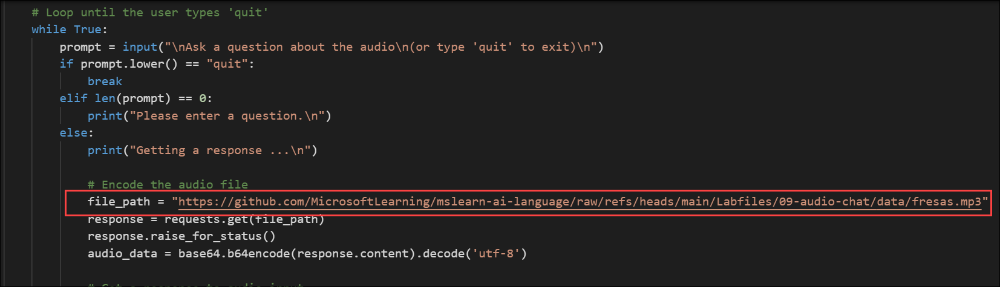

    The new file sounds like this:

    <video controls src="https://github.com/MicrosoftLearning/mslearn-ai-language/raw/refs/heads/main/Instructions/media/fresas.mp4" title="A request for strawberries" width="150"></video>

 1. Use the **CTRL+S** command to save your changes to the code file. You can also close the code editor (**CTRL+Q**) if you like.

1. In the cloud shell command line pane beneath the code editor, enter the following command to run the app:

    ```
    python audio-chat.py
    ```

1. When prompted, enter the following prompt: 
    
    ```
    Can you summarize this customer's voice message? Is it time-sensitive?
    ```

    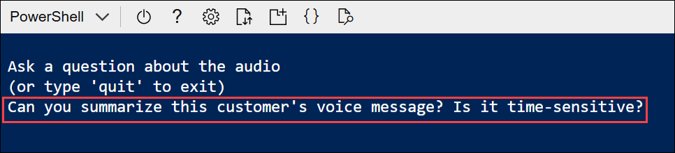

1. Review the response. Then enter `quit` to exit the program.

    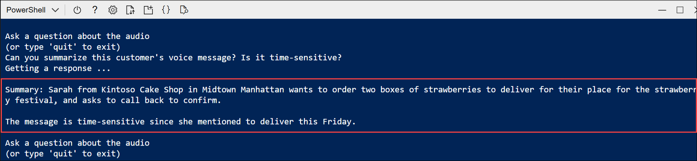

    > **Note**: In this simple app, we haven't implemented logic to retain conversation history; so the model will treat each prompt as a new request with no context of the previous prompt.

1. You can continue to run the app, choosing different prompt types and trying different prompts. When you're finished, enter `quit` to exit the program.

    If you have time, you can modify the code to use a different system prompt and your own internet-accessible audio files.

    > **Note**: In this simple app, we haven't implemented logic to retain conversation history; so the model will treat each prompt as a new request with no context of the previous prompt.

## Summary

In this exercise, you used Azure AI Foundry and the Azure AI Inference SDK to create a client application uses a multimodal model to generate responses to audio.
