# Lab 23: Develop a Voice Live agent
### Estimated Duration: 30 Minutes

## Lab Overview
In this lab, you’ll build an end-to-end solution using **Microsoft Foundry** by creating a project and developing a real-time voice-enabled AI agent. You’ll configure the agent with Azure Speech Voice Live capabilities to enable conversational interactions using speech input and audio responses.

You’ll then set up your development environment in **Visual Studio Code**, clone a sample application, and configure it using environment variables. Using Python and the Voice Live SDK, you’ll implement code to connect to your agent, manage a live voice session, and process audio input and output. Finally, you’ll authenticate with Azure, run the application, and test the agent through real-time voice conversations.

## Lab Objectives

In this lab, you'll perform the following tasks:

* Task 1: Create a Microsoft Foundry project
* Task 2: Create an agent
* Task 3: Configure Azure Speech Voice Live
* Task 4: Use speech to interact with the agent (Read Only)
* Task 5: Create a client application
* Task 6: Run the application

## Task 1: Create a Microsoft Foundry project

In this task, you'll sign in to the Microsoft Foundry portal and create a new project with the required Azure resources.

1. Open a new tab in the browser, right-click on the following link [Foundry portal](https://ai.azure.com), then **Copy link** and paste it in a browser tab to log in to **Microsoft Foundry portal**.

1. Click on **Sign in**.

    

1. If prompted, provide the credentials below:

   - **Email/Username:** <inject key="AzureAdUserEmail"></inject>

   - **Password:** <inject key="AzureAdUserPassword"></inject>

      >**Note:** Close any tips or quick start panes that are opened the first time you sign in, and if necessary, use the **Foundry** logo at the top left to navigate to the home page.

1. At the top of the **Microsoft Foundry** portal, enable the **New Foundry toggle (1)** to switch to the latest Foundry user interface.   

1. From the **Select a project to continue** dialog, click the drop-down under **Select or search for a project**, and then select **Create a new project (2)**.

     

1. In the **Create a project** window, enter **Myproject<inject key="DeploymentID" enableCopy="false"/> (1)** as the project name. Open the **Advanced options (2)** drop-down, fill in the following details, and then click **Create (6)**:

    * Subscription: **Choose Default Subscription (3)**
    * Resource group: **AI-102-RG023 (4)**
    * Microsoft Foundry resource: **Keep as Default**
    * Region: **<inject key="Region"></inject> (5)**

      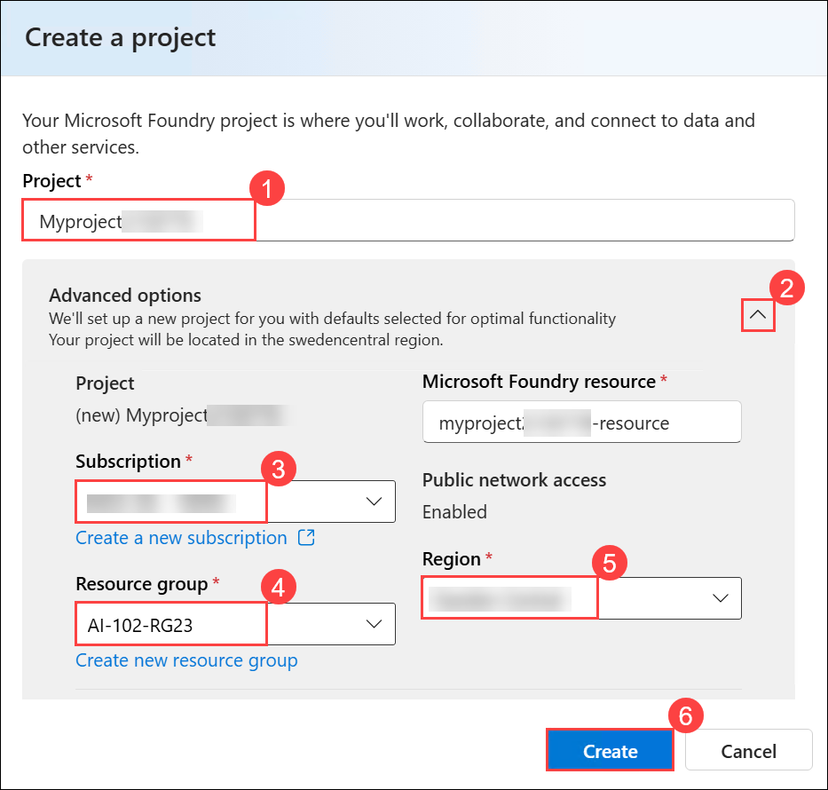 

1. Wait for your project to be created. It may take around 1-2 minutes.

1. If you see the **“Welcome to the new Microsoft Foundry”** window, you can either explore the information using **Next**, or close it by selecting the **X** in the top-right corner to continue.

    

1. On the home page for your project, note the project endpoint, key, and OpenAI endpoint.

    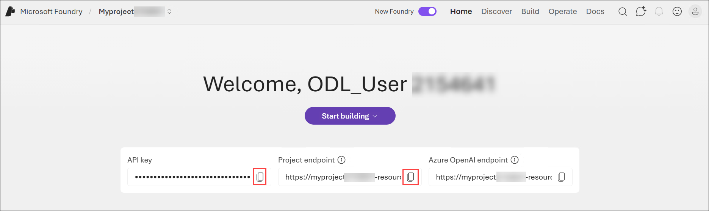

    > **Note:** <span style="color:red"> Copy and save the project endpoint, as you will need them later in the lab.

## Task 2: Create an agent

In this task, you'll create and configure an AI agent with a selected model and define its instructions.

1. In the **Start building (1)** menu, select **Create agents (2)**.

    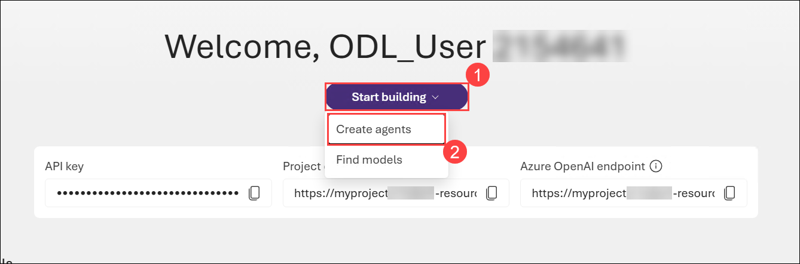

1. When prompted, name the agent `chat-agent` **(1)** and then click **Create (2)**. 

    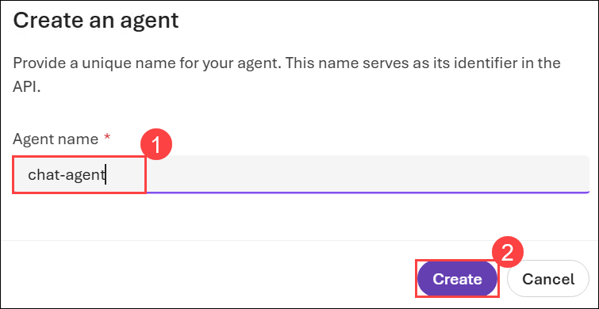

1. When ready, your agent opens in the agent playground.

    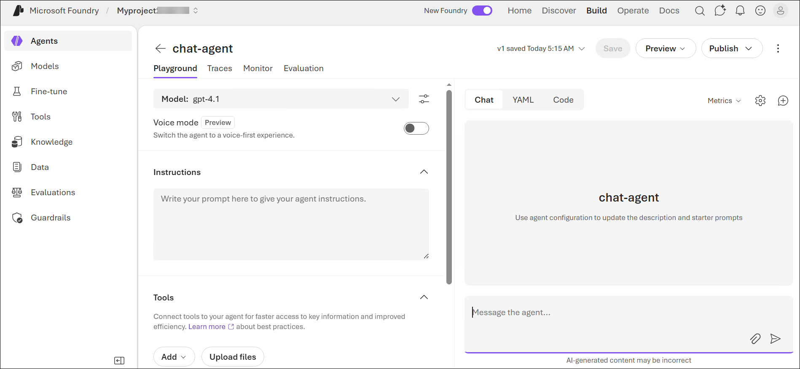

1. In the model drop-down list **(1)**, ensure that a **gpt-4.1** **(2)** model has been deployed and selected for your agent.

    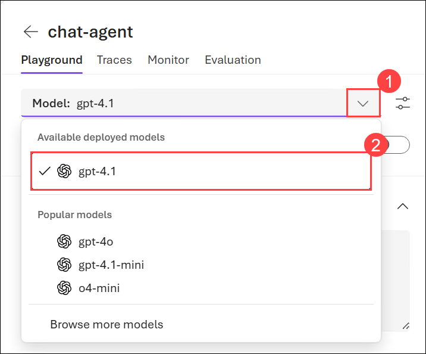

1. Assign your agent the following **Instructions**:

    ```
    You are an AI assistant that helps people find information about AI and related topics. You answer questions concisely and precisely.
    ```

    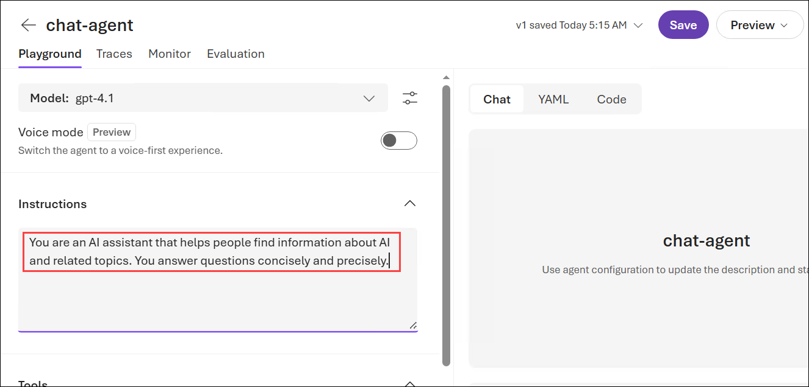

1. Use the **Save** button to save the changes.

    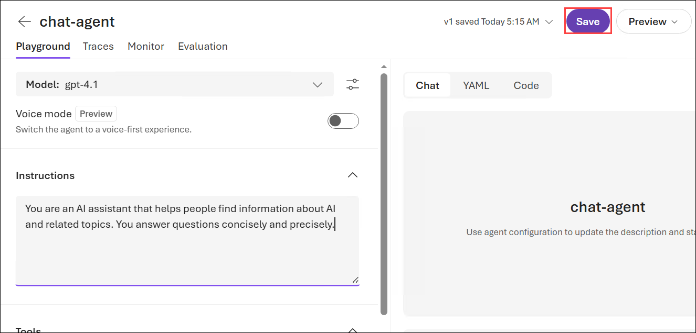

1. Test the agent by entering the following prompt in the **Chat** pane **(1)**, and then select the **Send** icon **(2)**:

    ```
    What can you help me with?
    ```

    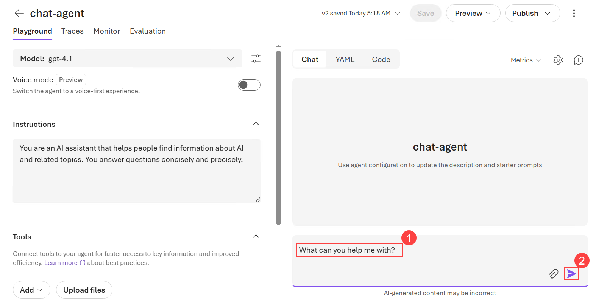

1. The agent should respond with an appropriate answer based on its instructions.

    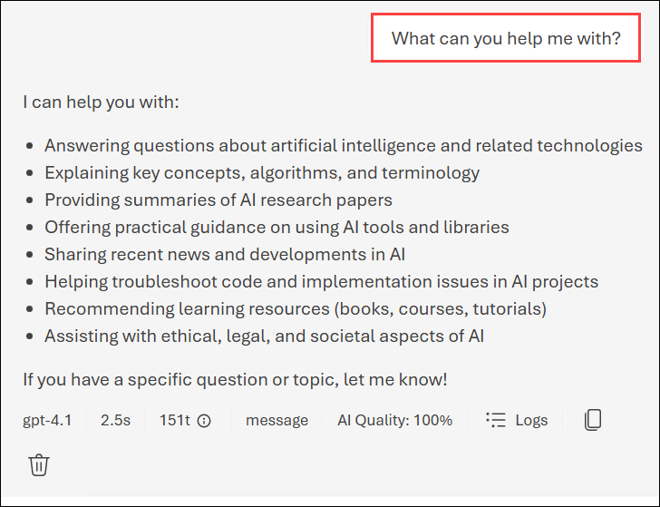

## Task 3: Configure Azure Speech Voice Live

In this task, you'll enable and configure Voice Live capabilities to add speech input and output functionality to your agent.

1. In the pane on the left, under the model selection list, enable **Voice mode (1)**.

    >**Note:** If the **Configuration** pane does not open automatically, use the "cog" icon above the chat interface to open it.

1. In the **Configuration (2)** pane, under **Voice Live**, review the default speech input and output configuration. You can try different voices, previewing them until you decide which one to use.

    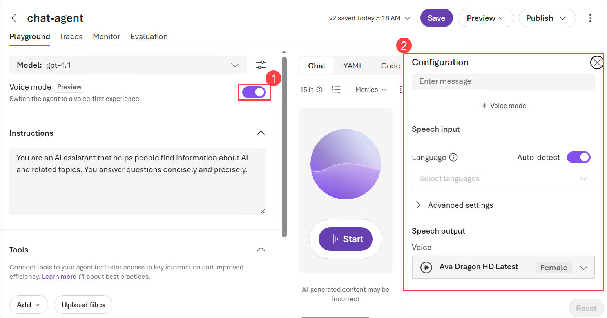

1. Close the **Configuration (1)** pane and use the **Save (2)** button to save the agent.

    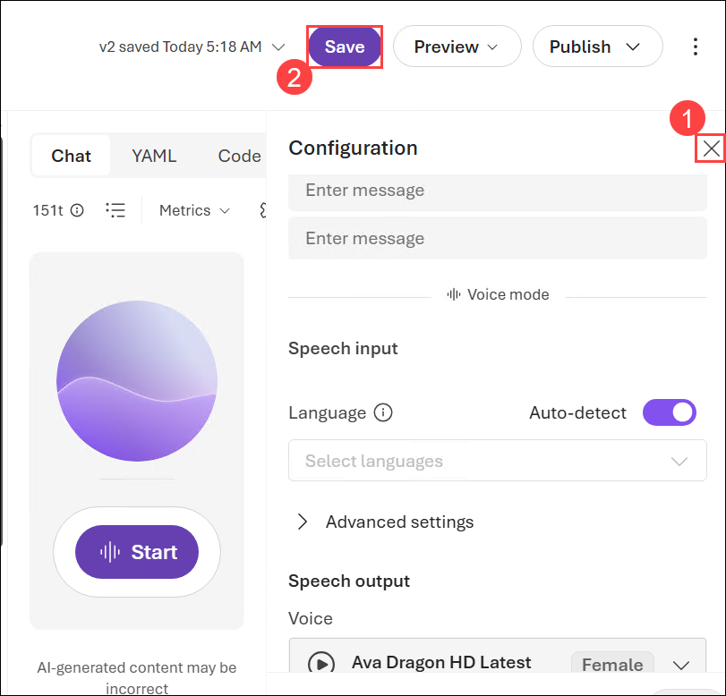

## Task 4: Use speech to interact with the agent (Read Only)

In this task, you'll observe how to interact with the agent using voice input and listen to the generated speech responses.

1. In the Chat pane, use the **Start** button to start a conversation with the agent. If prompted, allow access to the system microphone.

    The agent will start a speech session, and listen for your prompt.

    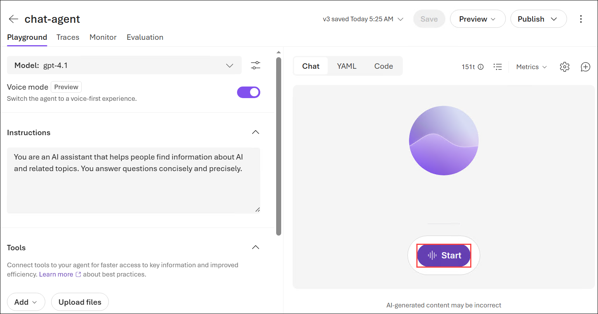

1. When the app status is **Listening…**, say something like "*How does speech recognition work?*" and wait for a response.

    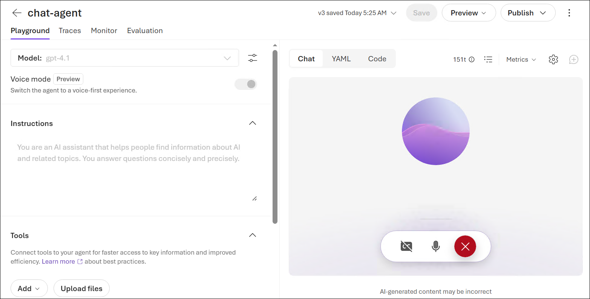

1. Verify that the app status changes to **Processing…**. The app will process the spoken input.

    >**Tip**: The processing speed may be so fast that you do not actually see the status before it changes back to *Speaking*.

1. When the status changes to **Speaking…**, the app uses text-to-speech to vocalize the response from the model. To see the original prompt and the response as text, select the **cc** button on the bottom of the chat screen.

    >**Tip**: The follow-on prompt is submitted just by speaking. You can even interrupt the agent to keep the interaction focused on what you need done. You can also use the **Stop generation** button in the chat pane to stop long-running responses. The button will end the conversation. You will need to start a new conversation to continue using the agent.

1. To continue the conversation, just ask another question, such as "*How does speech synthesis work?*", and review the response.

1. When you have finished chatting with the agent, use the **X** icon to end the session. A transcript of the conversation will be displayed.

## Task 5: Create a client application

In this task, you'll set up your development environment, clone the repository, and configure the application to connect to your agent.

### Get the application files from GitHub

1. On the desktop, locate **Visual Studio Code**, and then double-click the icon to open it.

    

1. Open the Command Palette by pressing **Ctrl+Shift+P** , type **`Git: Clone`** **(1)**, and then select **Git: Clone** (2) from the list.

    

1. In the Command Palette, enter the repository URL `https://github.com/microsoftlearning/mslearn-ai-language` **(1)**, and then select **Clone from URL** **(2)** to clone the repository to a local folder.

    
 
1. In the folder selection window, choose the **Downloads** folder **(1)**, and then select **Select as Repository Destination** **(2)**.

    

1. When prompted, select **Open** to open the cloned repository in Visual Studio Code.

    

1. When prompted, select **Yes, I trust the authors** to trust the folder and enable all features.

    

1. After cloning the repository, in the **Explorer** pane, expand the **Labfiles** folder **(1)**, and then navigate to **06-voice-live > Python > chat-client** **(2)**.

    In this folder, locate the application files **(3)**, which include:

    * **.env:** the application configuration file
    * **requirements.txt:** the Python package dependencies
    * **chat-client.py:** the main application code file

        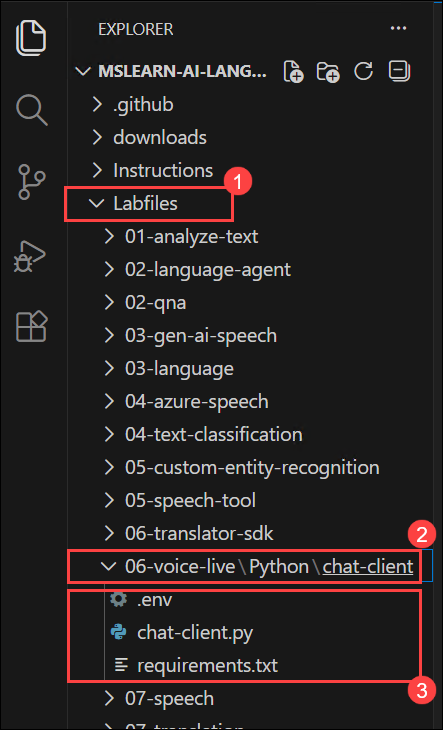

### Configure the application

1. In Visual Studio Code, open the **Extensions** pane **(1)**, search for **Python** **(2)**, select the **Python** extension by Microsoft **(3)**, and then click **Install** **(4)** if it is not already installed.

    

1. In the **Explorer** pane **(1)**, right-click the **requirements.txt** file **(2)**, and then select **Open in Integrated Terminal** **(3)**.

    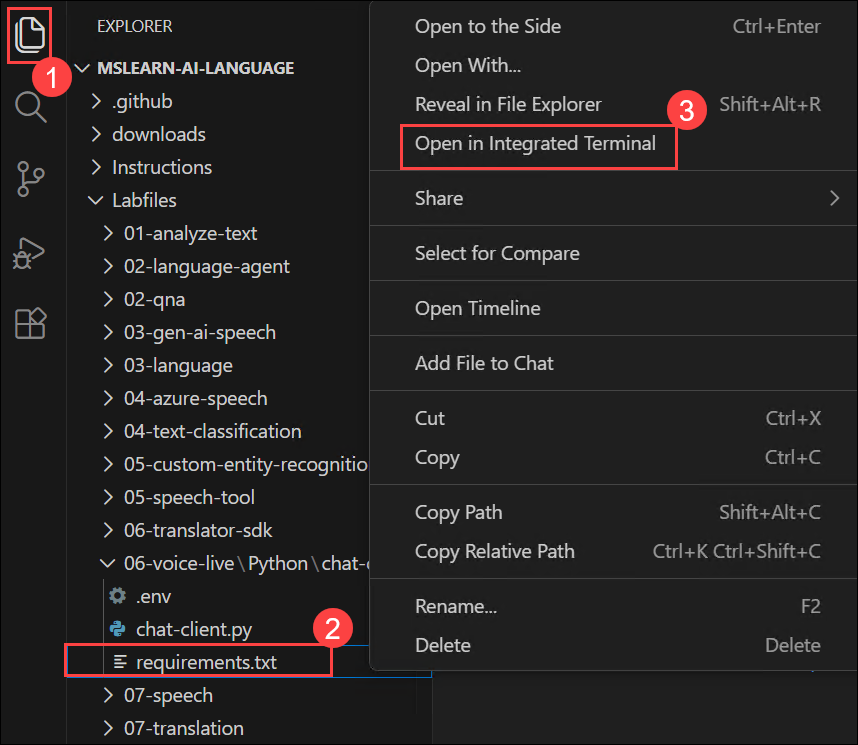

1. In the terminal, enter the following command to install the required Python packages in a virtual environment:

    ```
    python -m venv labenv
    .\labenv\Scripts\Activate.ps1
    ```

    >**Note:** This will create a virtual environment.

1. Ensure that the terminal is open in the **chat-client** folder and verify that the prompt shows **(.labenv)**, indicating that the Python virtual environment is active.

    

1. Install the Foundry SDK package, the Azure Identity package, and other required packages by running the following command:

    ```
    pip install -r requirements.txt azure-identity azure-ai-voicelive==1.2.0b4 --pre azure-ai-projects==2.0.0b4
    ```

1. In the **Explorer** pane, within the **chat-client** folder, select the **.env** file **(1)** to open it. Update the configuration by pasting your Foundry resource **endpoint** (copy the project endpoint from the Foundry portal home page and use only the base URL up to the *.com* domain) into the `FOUNDRY_ENDPOINT` field **(2)**. Then, set the `PROJECT_NAME` to your project name **(3)** and ensure the `AGENT_NAME` is set to **Chat-Agent** (case-sensitive). Finally, press **Ctrl+S** to save the changes.

    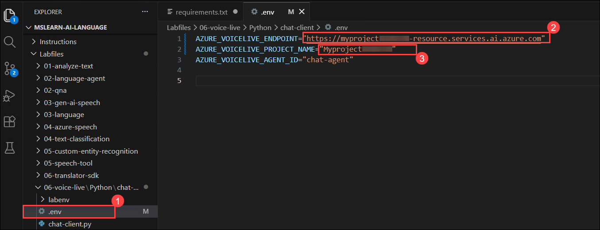

    > **Important:** <span style="color:red"> Modify the pasted endpoint to remove the "/api/projects/{project_name}" suffix - the endpoint should be *https://{your-foundry-resource-name}.services.ai.azure.com*.

### Implement application code

1. In the **Explorer** pane, in the **chat-client** folder,  open the **chat-client.py (1)** file.

    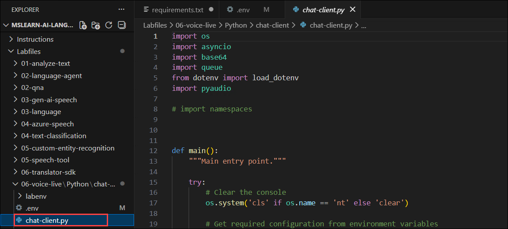

1. Review the existing code. Most of the application scaffolding has been provided - you must implement the key steps required to use the Voice Live SDK to manage a conversation with your agent.

    > **Note:** As you add code to the code file, be sure to maintain the correct indentation.

1. At the top of the code file, under the existing namespace references, find the comment **Import namespaces** and add the following code to import the namespaces you will need:

    ```python
   # import namespaces
   from azure.identity.aio import AzureCliCredential
   from azure.ai.voicelive.aio import connect
   from azure.ai.voicelive.models import (
        InputAudioFormat,
        Modality,
        OutputAudioFormat,
        RequestSession,
        ServerEventType,
        AudioNoiseReduction,
        AudioEchoCancellation,
        AzureSemanticVadMultilingual
   ) 
    ```

    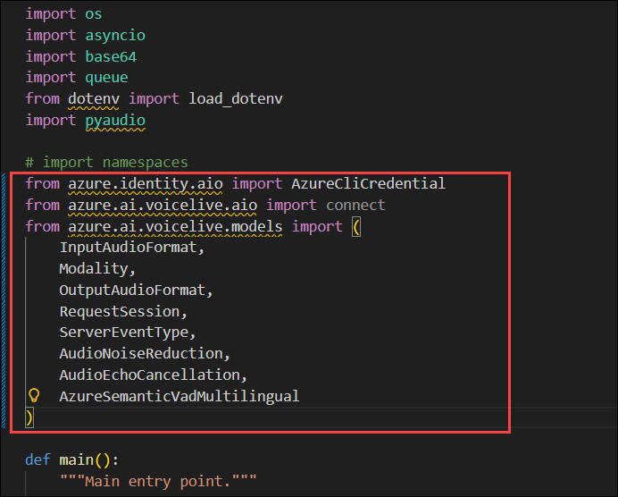

1. In the **main** function, note that code to load the endpoint and key from the configuration file has already been provided, as has code to get an authentication credential and to create and run a **VoiceAssistant** object.

    The **VoiceAssistant** class encapsulates the logic to manage the Voice Live conversation.

1. Under the **main** function, find the **VoiceAssistant** class definition.

    The ****init**** function to initialize an object based on the class has already been implemented.

    You must implement the **start** function, which is the core function to establish the conversation session.

1. Find the comment **STEP 1: Connect Azure VoiceLive to the agent**, and add the following code (being careful to indent it one level in under the **try:** statement):

    ```python
   # STEP 1: Connect Azure VoiceLive to the agent
   async with connect(
        endpoint=self.endpoint,
        credential=self.credential,
        api_version="2026-01-01-preview",
        agent_config=self.agent_config
   ) as connection:
        self.connection = connection
    ```

    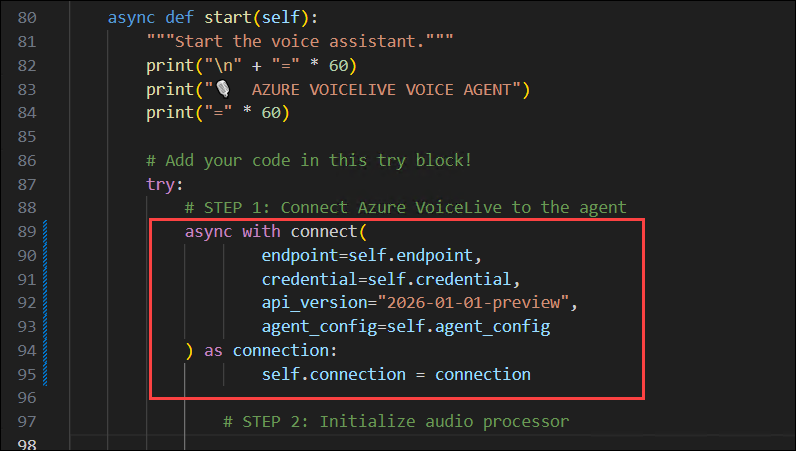

    This step creates a connection to your agent so the Voice Live SDK can establish a conversation with it.

1. Find the comment **STEP 2: Initialize audio processor**, and add the following code (being careful to indent it *another level in* under the step 1 code you just added):

    ```python
   # STEP 2: Initialize audio processor
   self.audio_processor = AudioProcessor(connection)
    ```

    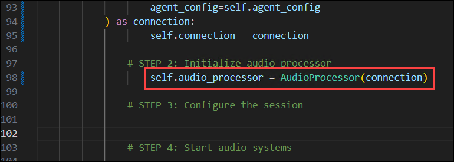

    This code attaches an AudioProcessor object based on the class definition further down in the code file. The AudioProcessor is a utlility class to manage audio hardware I/O.

1. Find the comment **STEP 3: Configure the session**, and add the following code (being careful to maintain the same indentation as the step 2 code above):

    ```python
   # STEP 3: Configure the session
   await self.setup_session()
    ```

    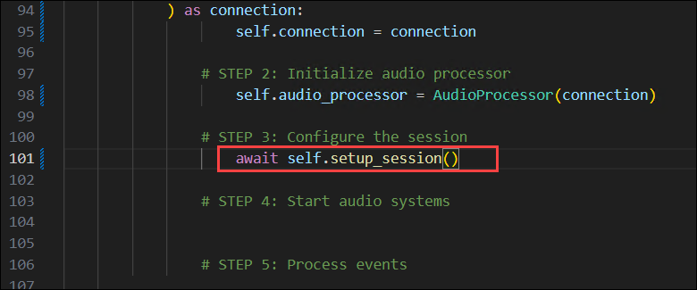

    This code configures the session with the appropriate audio formats, conversational turn-detection semantics, and options to handle echos and background noise.

1. Find the comment **STEP 4: Start audio systems**, and add the following code (being careful to maintain the same indentation as the step 3 code above):

    ```python
   # STEP 4: Start audio systems
   self.audio_processor.start_playback()
            
   print("\n✅ Ready! Start speaking...")
   print("Press Ctrl+C to exit\n")
    ```

    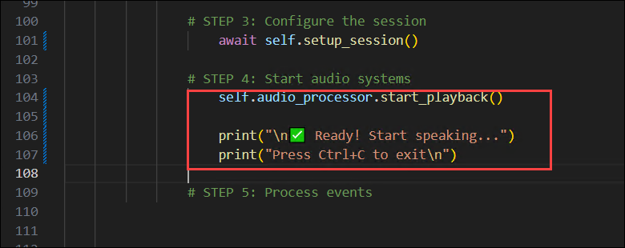

    This code starts the audio processor so that it monitors the microphone for audio input and plays back audio output.

1. Find the comment **STEP 5: Process events**, and add the following code (being careful to maintain the same indentation as the step 4 code above):

    ```python
   # STEP 5: Process events
   await self.process_events()
    ```

    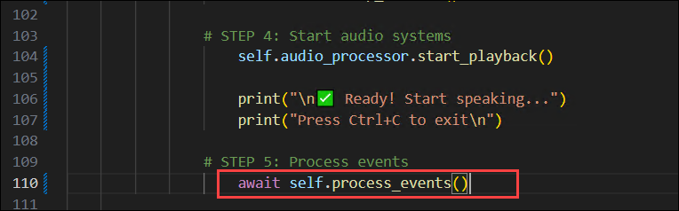

    This code runs the main loop to process events such as speech input, response output, and interruptions.

1. Save the changes to the code file.

    The completed function should look like this:

    ```python
   async def start(self):
            """Start the voice assistant."""
            print("\n" + "=" *60)
            print(f"🎙️   {self.agent_config['agent_name']}")
            print("="* 60)
    
            # Add your code in this try block!
            try:
                # STEP 1: Connect Azure VoiceLive to the agent
                async with connect(
                    endpoint=self.endpoint,
                    credential=self.credential,
                    api_version="2026-01-01-preview",
                    agent_config=self.agent_config
                ) as connection:
                    self.connection = connection
                        
                    # STEP 2: Initialize audio processor
                    self.audio_processor = AudioProcessor(connection)
                                      
                    # STEP 3: Configure the session
                    await self.setup_session()
                    
                    # STEP 4: Start audio systems
                    self.audio_processor.start_playback()
            
                    print("\n✅ Ready! Start speaking...")
                    print("Press Ctrl+C to exit\n")
                    
                    # STEP 5: Process events
                    await self.process_events()
    
            finally:
                if hasattr(self, 'audio_processor'):
                    self.audio_processor.shutdown()
    ```

## Task 6: Run the application

In this task, you'll authenticate with Azure, run the client application, and interact with the agent using real-time voice conversations.

> **Note:** <span style="color:red"> In the current lab environment, audio input (microphone) is not supported due to platform limitations; therefore, while you can perform the steps in this task, you will not be able to provide prompts using voice.


1. In the Visual Studio Code terminal, enter the following command to sign into Azure

   ```powershell
    az login
    ```

    > **Note:** Minimize the VS Code to see the **Sign in** window.

1. In the **Sign in** window, select **Work or school account** **(1)**, and then select **Continue** **(2)**.

    

1. On the **Sign in** page, provide the credentials below:
 
   - **Email/Username:** <inject key="AzureAdUserEmail"></inject>
    
     

   - **Password:** <inject key="AzureAdUserPassword"></inject>
    
     

1. When prompted, select **Yes** to sign in to all apps and websites on this device.

    

1. On the **Account added to this device** window, select **Done** to complete the sign-in process.

    

1. In the Visual Studio Code terminal, press **Enter** to select the default subscription.

    

1. In the Visual Studio Code terminal, confirm the details of your Azure subscription; and then enter the following command to run the client application:

    ```powershell
    python chat-client.py
    ```

1. When prompted, begin a conversation with the agent by asking a question such as "*How is computer speech used in AI?*".

1. Listen to the response and then continue the conversation - note that you can interrupt the agent to ask new questions.

1. When you're finished, press **CTRL+C** to end the conversation and stop the program.

    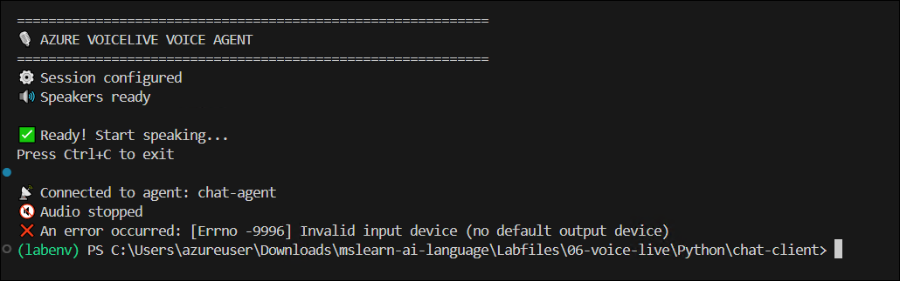

## Summary

In this exercise, you created a voice-enabled AI agent using Microsoft Foundry and integrated it with Azure Speech Voice Live to enable real-time conversational interactions. You configured the agent, enabled voice capabilities, and explored speech-based interactions in the playground. You then built a Python-based client application, authenticated with Azure, and interacted with the agent using live audio input and output. Great work!

### You have successfully completed the Hands-on Lab!