# Lab 23: Explore the Voice Live API

In this lab you create an agent in the Azure AI Foundry and explore the Voice Live API in the Speech Playground.

### Task 1: Create an Azure AI Foundry project

1. Open a new tab in the browser, right-click on the following link [Azure AI Foundry portal](https://ai.azure.com), then **Copy link** and paste it in a browser tab to log in to **Azure AI Foundry portal**.

1. Click on **Sign in**.

    

1. If prompted, provide the credentials below:

   - **Email/Username:** <inject key="AzureAdUserEmail"></inject>

   - **Password:** <inject key="AzureAdUserPassword"></inject>

1. In the home page, select **Create an agent**.   

    

1. When prompted to create a project, enter the project name as **Myproject<inject key="DeploymentID" enableCopy="false"/> (1)** and expand **Advanced options (2)**.

    

1. Under **Advanced options**, provide the below details and leave the rest to deafult:

    - Resource group: Select **AI-102-RG23 (1)**
    - Region: Select **Region**: Select **<inject key="Region" enableCopy="false" /> (2)**
    - Select **Create (3)**

      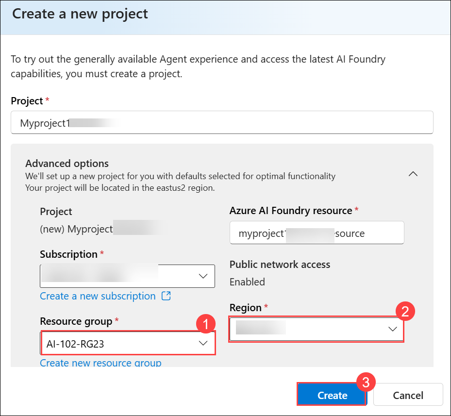    

1. Wait for your project to be created.      

1. When prompted, search for `gpt-4.1` **(1)**, then select **gpt-4.1 (2)** model and then **Confirm (3)**.

    

1. On the **Deploy gpt-4.1** page, select **Global Standard (1)** as the Deployment type and then click on **Customize (2)**.

    

1. On the **Deploy gpt-4.1** page,

    - Tokens per Minute Rate Limit (thousands): `60K` **(1)** (or the maximum available in your subscription if less than 50K)
    - Then select **Deploy (2)**

       

1. When your project is created, the Agents **playground** will be opened.

   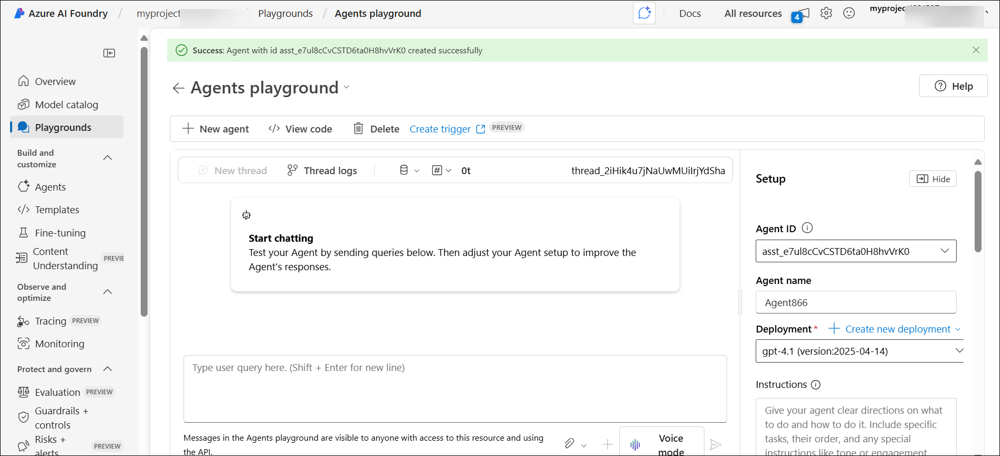

### Task 2: Start a Voice Live sample

In this section of the exercise you interact with one of the agents. 

1. Select **Playgrounds (1)** in the navigation pane. Locate the **Speech playground** group, and select the **Try the Speech playground (2)** button.

   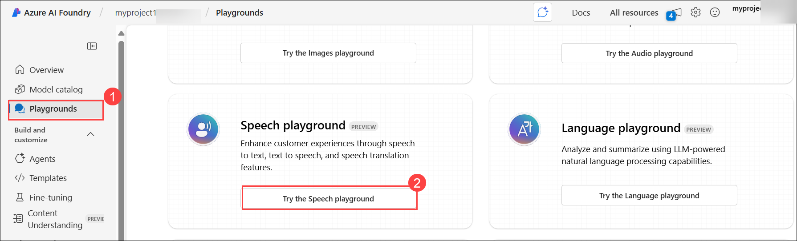

1. The Speech Playground offers many pre-built options. Use the horizontal scroll bar to navigate to the end of the list and select the **Voice Live** tile. 

   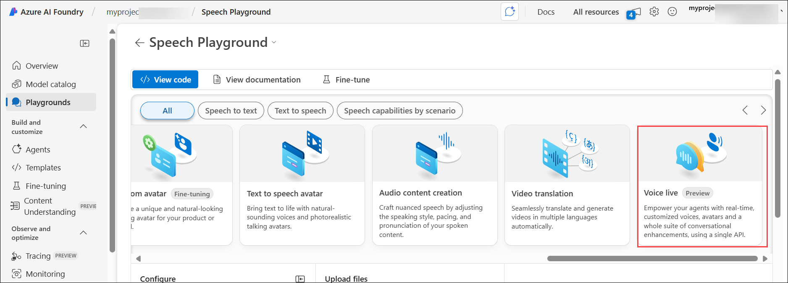

1. Select the **Casual chat** agent sample in **Try with samples** panel.

   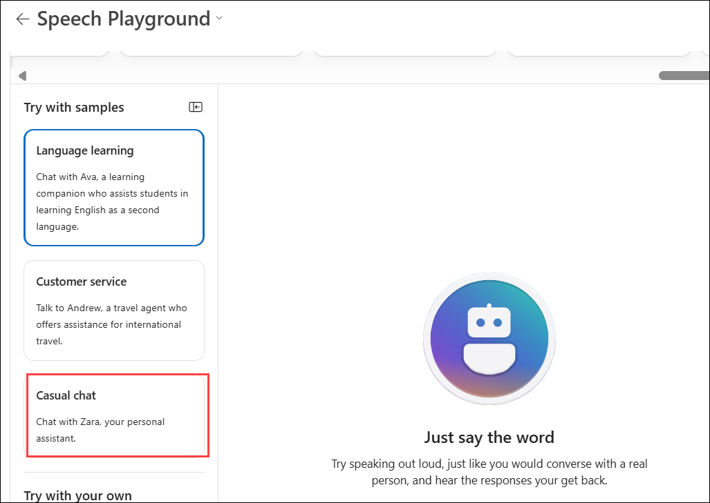
   
1. Ensure your microphone and speakers are working and select the **Start** button at the bottom of the page. 

   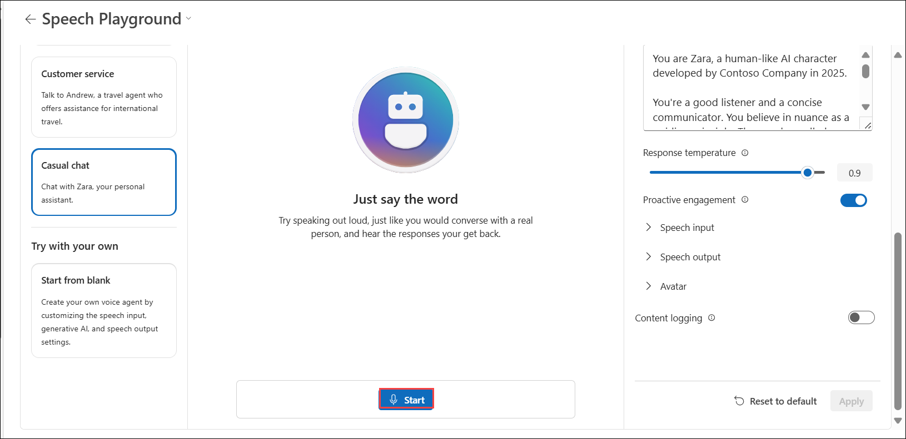

    >**Note**: Select **Allow** to use microphones.

     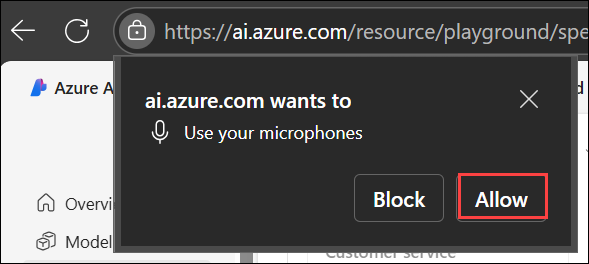

1. As you interact with the agent, notice you can interrupt the agent and it will pause to listen. Try speaking with different lengths of pauses between words and sentences. Notice how quickly the agent recognizes the pauses and fills in the conversation.

1. When you're finished select the **End** button.

    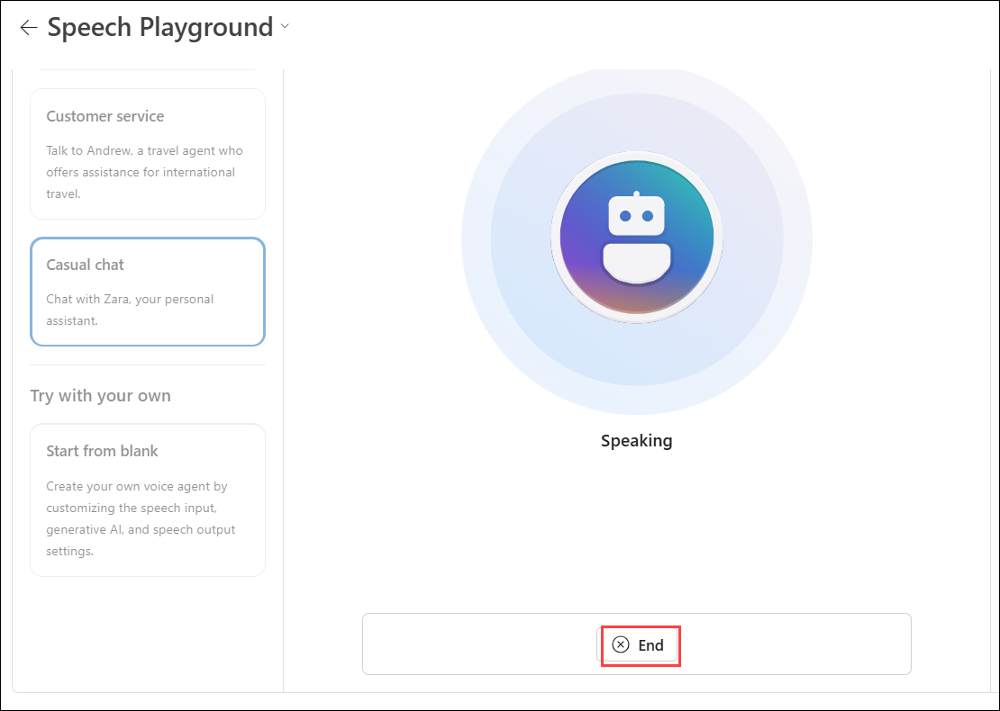

1. Start the other sample agents to explore how they behave.

1. As you explore the different agents note the changes in the  **Response instruction** section in the **Configuration** panel.

    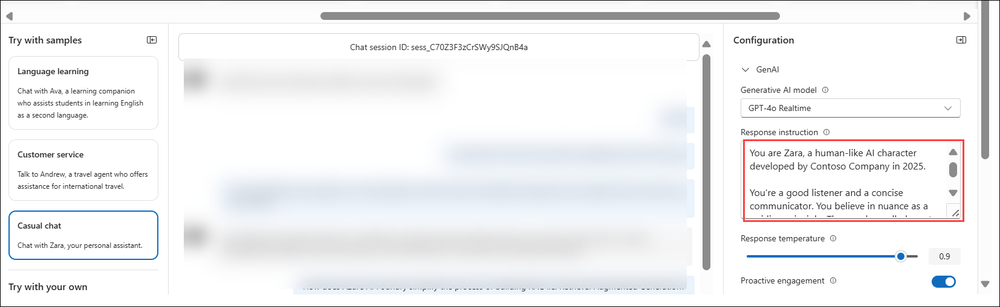


### Task 3: Configure the agent 

In this section you change the voice of the agent, and add an avatar to the **Casual chat** agent. The **Configuration** panel is divided into three sections: **GenAI**, **Speech**, and **Avatar**.

>**Note:** If you change, or interact with, any of the configuration options you need to select the **Apply** button at the bottom of the **Configuration** panel to enable the agent.

1. Select the **Casual chat** agent.

    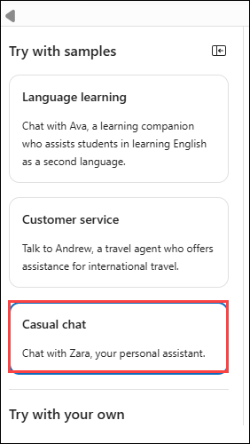 

1. Next, change the voice of the agent, and add an avatar, with the following instructions:

    - Expand  **Speech output (1)** to expand the section and access the options.

    - Select the drop-down menu in the **Voice** option and choose a different voice **(2)**

    - Select **Apply (3)** to save your changes

      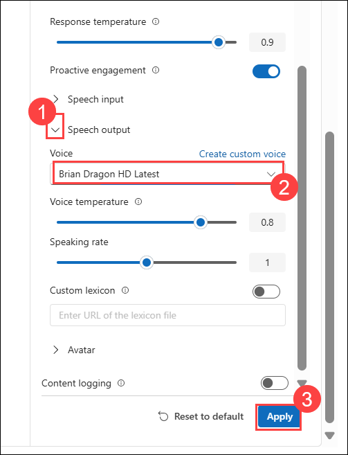  

    - Then **Start** to launch the agent and hear your change.    

      Repeat the previous steps to try a few different voices. Proceed to the next step when you're finished with the voice selection.

    - Expand **> Avatar (1)** section and access the options.

    - Select the toggle button to enable the feature and select one of the avatars **(2)**

    - Select **Apply (3)** to save your changes
    
      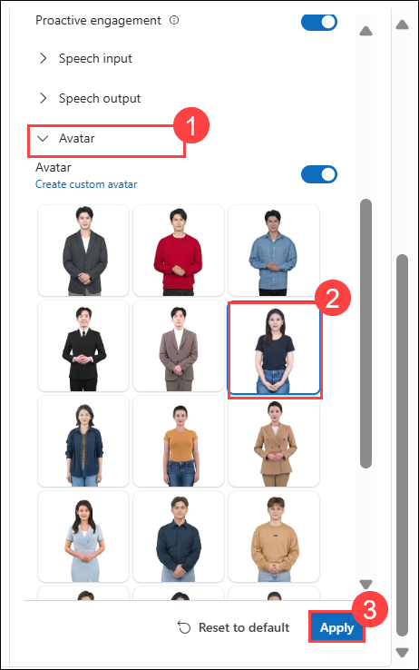      
    
    - Then **Start** to launch the agent. Notice the avatar's animation and synchronization to the audio.

      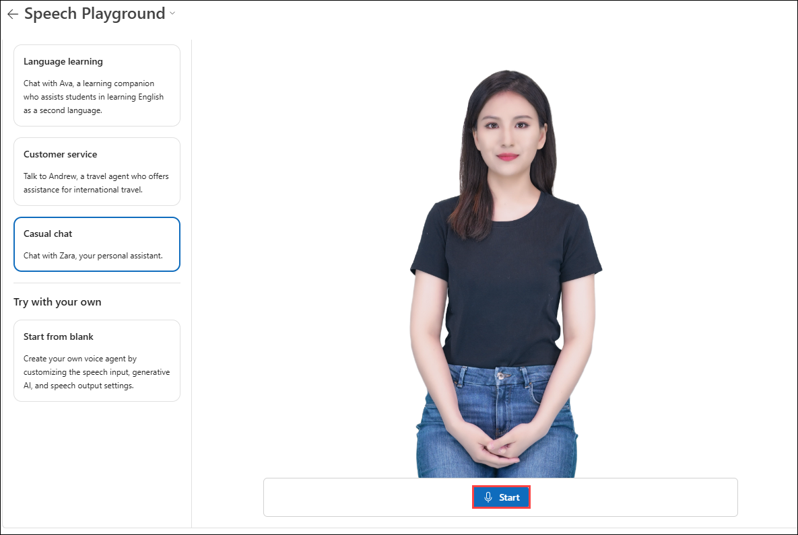   

1. Expand the **> GenAI** section and set the **Proactive engagement** toggle to the `off` position ***(1)**. Next, select **Apply (2)** to save your changes.

    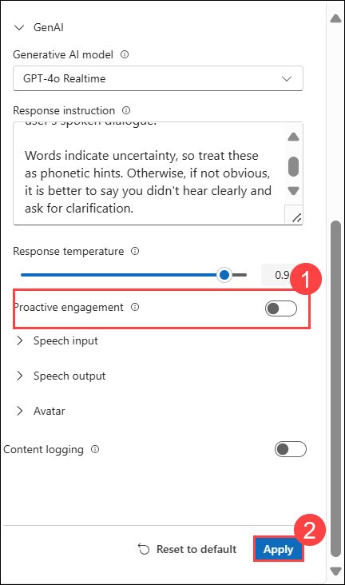  

1. Then **Start** to launch the agent.

    With the **Proactive engagement** turned off, the agent doesn't initiate the conversation. Ask the agent "Can you tell me what you do?" to start the conversation.

1. You can select **Reset to default** and then **Apply** to return the agent to its default behavior.

    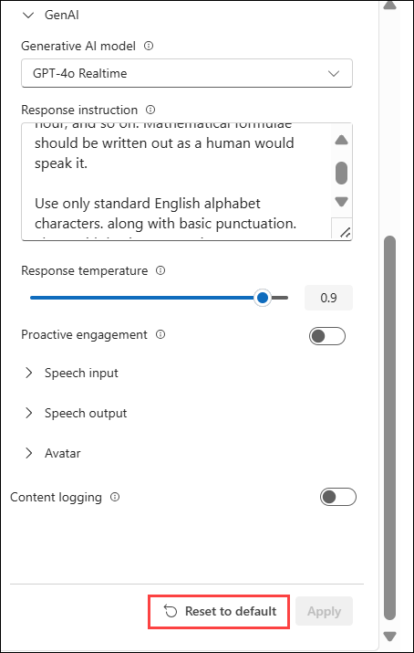  

1. When you're finished, proceed to the next section.

### Task 4: Create a voice agent

In this section you create your own voice agent from scratch.

1. Select **Start from blank (1)** in the **Try with your own** section of the panel. 

    - Expand the **> GenAI** section of the **Configuration** panel.

    - Select the **Generative AI model** drop-down menu and choose the **GPT-4.1 Mini (2)** model.

    - Add the following text in the **Response instruction (3)** section.

      ```
      You are a voice agent named "Ava" who acts as a friendly car rental agent. 
      ```

    - Set the **Response temperature** slider to a value of `0.8` **(4)** 

    - Set the **Proactive engagement** toggle to the **on** position **(5)**

    - Select **Apply (6)** to save your changes

      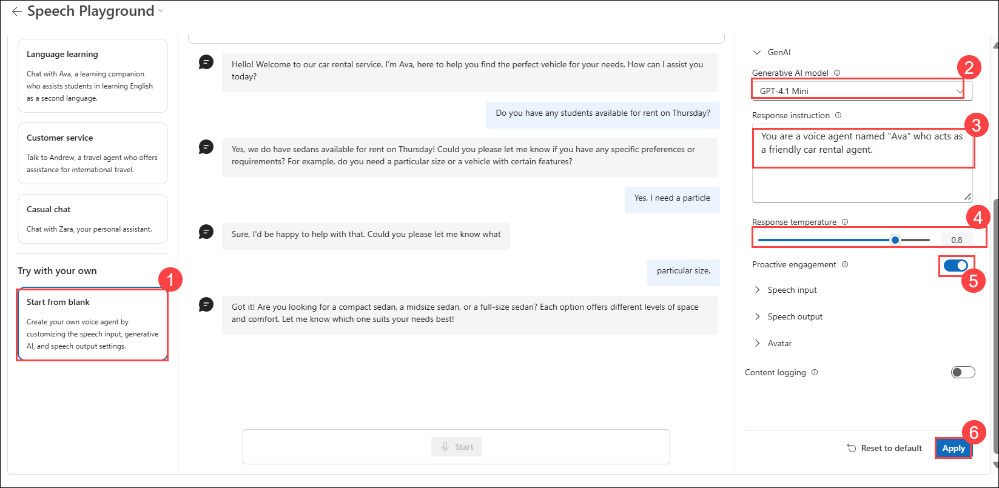  

1. Then **Start** to launch the agent.

    The agent will introduce itself and ask how it can help you today. Ask the agent "Do you have any sedans available for rent on Thursday?" Notice how long it takes the agent to respond. Ask the agent other questions to see how it responds. When you're finished, proceed to the next step.

1. Expand the **Speech input (1)** section of the **Configuration** panel.

    - Set the **End of utterance (EOU)** toggle button to the **on (2)** position.

    - Set the **Audio enhancement** toggle button to the **on (3)** position.

    - Select **Apply (4)** to save your changes.

      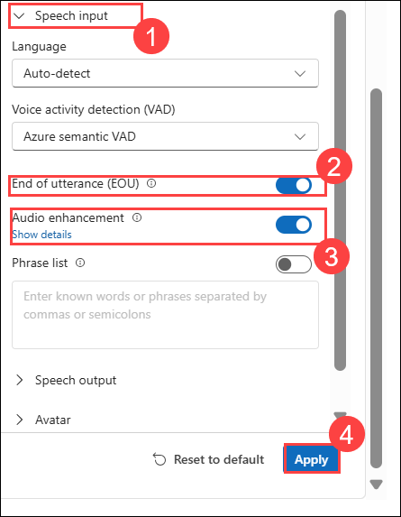  

1. Then **Start** to launch the agent.

    After the agent introduces itself, ask it `Do you have any planes for rent?`. Notice the agent responds more quickly than it did earlier after finishing your question. The **End of utterance (EOU)** setting configures the agent to detect pauses and your end of speech based on context and semantics. This enables it to have a more natural conversation.


