# Translate text and speech
### Estimated Duration: 45 Minutes
## Lab Overview

In this lab, you’ll build an end-to-end solution using **Microsoft Foundry** by creating a project and developing applications for translating both text and speech. You’ll explore **Azure Translator** to perform multilingual text translation and **Azure Speech** to enable real-time speech translation capabilities.

You’ll then set up your development environment in **Visual Studio Code**, clone a sample repository, and configure it using environment variables. Using Python and the Azure SDKs, you’ll implement code to translate text input and process speech translation scenarios. Finally, you’ll authenticate with Azure, run the applications, and test translation outputs across multiple languages.

## Lab Objectives

In this lab, you'll perform the following tasks:

* Task 1: Create a Microsoft Foundry project
* Task 2: Explore Azure Translator in Foundry Tools in the portal
* Task 3: Get application files from GitHub
* Task 4: Create a text translation application
* Task 5: Create a speech translation application (Read Only)

## Task 1: Create a Microsoft Foundry project

In this task, you'll sign in to the Microsoft Foundry portal and create a new project with the required Azure resources.

1. Open a new tab in the browser, right-click on the following link [Foundry portal](https://ai.azure.com), then **Copy link** and paste it in a browser tab to log in to **Microsoft Foundry portal**.

1. Click on **Sign in**.

    

1. If prompted, provide the credentials below:

   - **Email/Username:** <inject key="AzureAdUserEmail"></inject>

   - **Password:** <inject key="AzureAdUserPassword"></inject>

      >**Note:** Close any tips or quick start panes that are opened the first time you sign in, and if necessary, use the **Foundry** logo at the top left to navigate to the home page.

1. At the top of the **Microsoft Foundry** portal, enable the **New Foundry toggle (1)** to switch to the latest Foundry user interface.   

1. From the **Select a project to continue** dialog, click the drop-down under **Select or search for a project**, and then select **Create a new project (2)**.

     

1. In the **Create a project** window, enter **Myproject<inject key="DeploymentID" enableCopy="false"/> (1)** as the project name. Open the **Advanced options (2)** drop-down, fill in the following details, and then click **Create (6)**:

    * Subscription: **Choose Default Subscription (3)**
    * Resource group: **AI-102-RG24 (4)**
    * Microsoft Foundry resource: **Keep as Default**
    * Region: **<inject key="Region"></inject> (5)**

      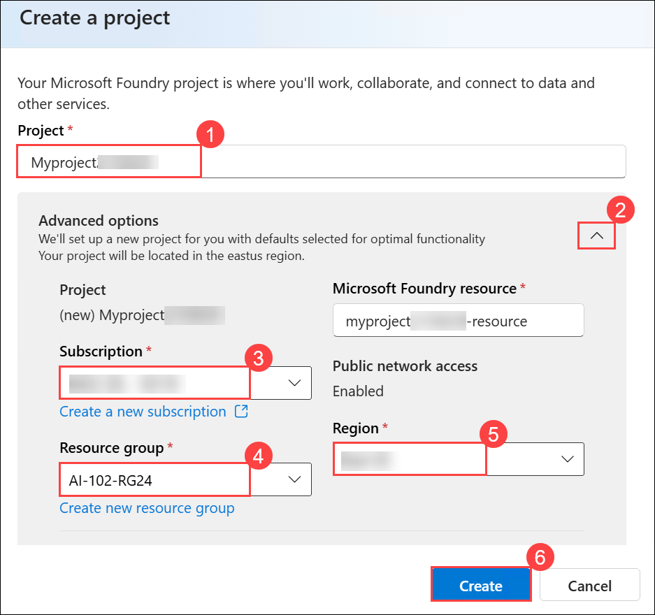 

1. Wait for your project to be created. It may take around 1-2 minutes.

1. If you see the **“Welcome to the new Microsoft Foundry”** window, you can either explore the information using **Next**, or close it by selecting the **X** in the top-right corner to continue.

    

1. On the home page for your project, note the project endpoint, key, and OpenAI endpoint.

    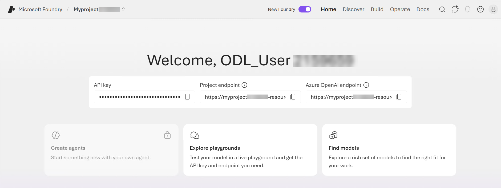

> **Congratulations** on completing the task! Now, it's time to validate it. Here are the steps:
>
> - Hit the Validate button for the corresponding task. If you receive a success message, you can proceed to the next task.
> - If not, carefully read the error message and retry the step, following the instructions in the lab guide.
> - If you need any assistance, please contact us at cloudlabs-support@spektrasystems.com. We are available 24/7 to help.
 
<validation step="437ed274-985b-48e2-b1b8-d0685b80696a" />

## Task 2: Explore Azure Translator in Foundry Tools in the portal

In this task, you'll use the Azure Translator playground in the Foundry portal to explore text translation capabilities across multiple languages.

1. From the homepage, select the **Build** tab.

    

1. On the Build page, select the **Models (1)** tab to view the models in your project.

1. In the **Models** page, select the **AI Services (2)** tab to view the list of Azure services in Foundry Tools.

    

1. In the list of tools, select **Azure Translator - Text translation**.

    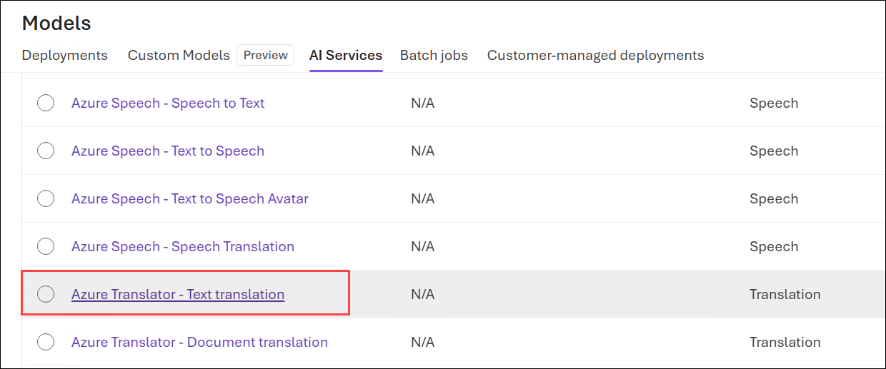

1. In the Text translator playground, in the **Source text (1)** area, enter the text `Hello world!`. Then, in the **Translation** area, select any language **(2)** and use the **Translate (3)** button to generate the translation.

    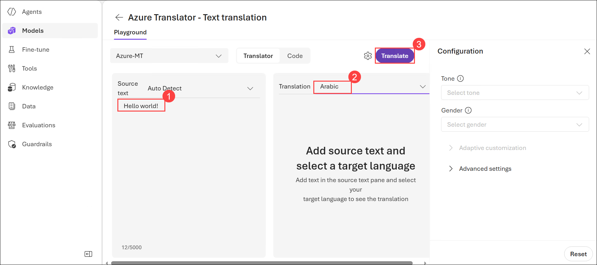

    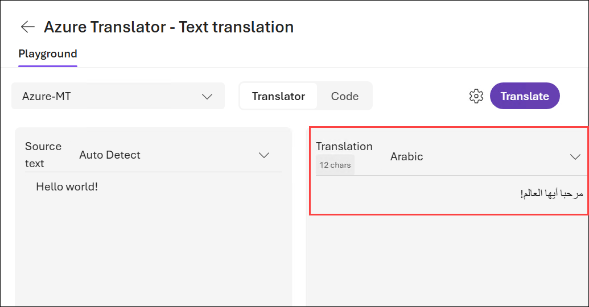

1. You can try a few more languages.

1. Select the **Code (1)** tab to view sample code for using Azure Translator; and note the **ENDPOINT (2)** variable used in the code for the REST API, which should be similar to `https://{foundry-resource-name}.cognitiveservices.azure.com/`.

    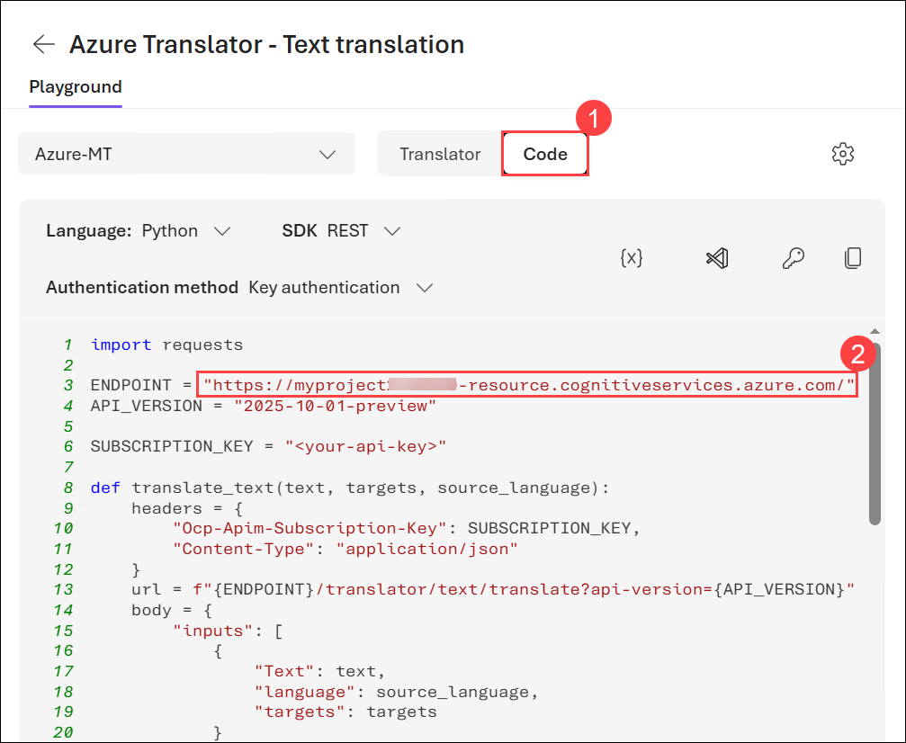

    This endpoint uses an older format for Azure AI Services, but is still used to connect to the Azure Translator resource in a Foundry resource. You can also use it to connect to Azure Speech tools.

    > **Note:** <span style="color:red"> Copy and paste the endpoint in the notepad, as you're going to need the endpoint later!

## Task 3: Get application files from GitHub

In this task, you'll clone the sample repository and set up your development environment in Visual Studio Code.

1. On the desktop, locate **Visual Studio Code**, and then double-click the icon to open it.

    

1. Open the Command Palette by pressing **Ctrl+Shift+P** , type **`Git: Clone`** **(1)**, and then select **Git: Clone** (2) from the list.

    

1. In the Command Palette, enter the repository URL `https://github.com/microsoftlearning/mslearn-ai-language` **(1)**, and then select **Clone from URL** **(2)** to clone the repository to a local folder.

    
 
1. In the folder selection window, choose the **Downloads** folder **(1)**, and then select **Select as Repository Destination** **(2)**.

    

1. When prompted, select **Open** to open the cloned repository in Visual Studio Code.

    

1. When prompted, select **Yes, I trust the authors** to trust the folder and enable all features.

    .

1. In Visual Studio Code, open the **Extensions** pane **(1)**, search for **Python** **(2)**, select the **Python** extension by Microsoft **(3)**, and then click **Install** **(4)** if it is not already installed.

    

## Task 4: Create a text translation application

In this task, you'll configure and implement a Python application to translate text using Azure Translator services.

1. After cloning the repository, in the **Explorer** pane, expand the **Labfiles** folder **(1)**, and then navigate to **07-translation > Python (2)** and then select the folder **translators** **(3)**.

    In this folder, locate the application files **(4)**, which include:

    * **.env:** the application configuration file
    * **requirements.txt:** the Python package dependencies
    * **translate-text.py:** the code file for the text application
    * **translate-speech.py:** the code file for the speech application

        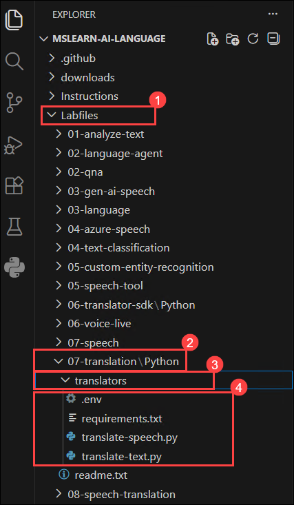

1. In the **Explorer** pane, right-click the **requirements.txt** file **(1)**, and then select **Open in Integrated Terminal** **(2)**.

    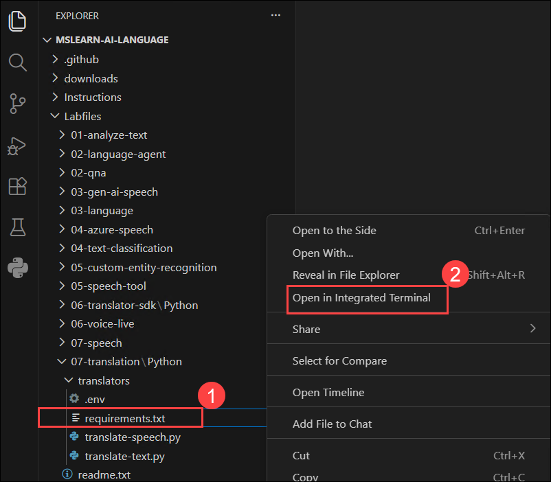

1. In the terminal, enter the following command to install the required Python packages in a virtual environment:

    ```
    python -m venv labenv
    .\labenv\Scripts\Activate.ps1
    pip install -r requirements.txt
    ```
    >**Note:** This will create a virtual environment and install the SDK package and other required packages.

### Task 4.1: Configure your text translation application

1. In the **Explorer** pane, in the **translators** folder, select the **.env (1)** file to open it. Then update the configuration values to reflect the Cognitive Services **endpoint (2)** for your Foundry resource. Finally, press **Ctrl+S** to save the changes.

    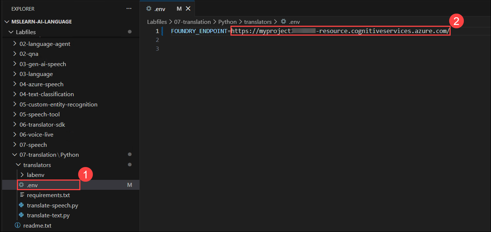

    > **Note:** The endpoint should be *https://{YOUR_FOUNDRY_RESOURCE}.cognitiveservices.azure.com/*. The Foundry Resource name usually takes the form *{project_name}-resource*.

1. Ensure that the terminal is open in the **translators** folder and verify that the prompt shows **(.labenv)**, indicating that the Python virtual environment is active.

### Task 4.2: Add code to translate text

1. In the **Explorer** pane, in the **translators** folder,  open the **translate-text.py** file.

    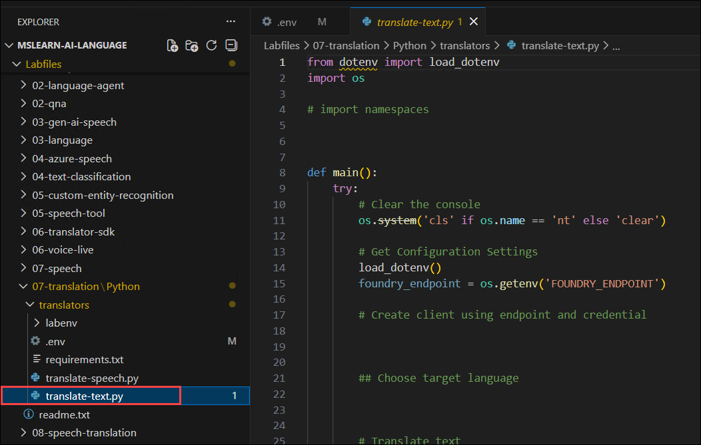

1. Review the existing code. You will add code to work with Azure Translator.

    > **Note:** As you add code to the code file, be sure to maintain the correct indentation.

1. At the top of the code file, under the existing namespace references, find the comment **Import namespaces** and add the following code to import the namespaces you will need to use the Translator SDK:

    ```python
   # import namespaces
   from azure.identity import DefaultAzureCredential
   from azure.ai.translation.text import *
   from azure.ai.translation.text.models import InputTextItem
    ```

    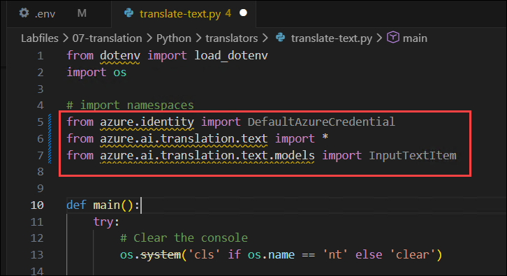

1. In the **main** function, note that the existing code reads the configuration settings.
1. Find the comment **Create client using endpoint and credential** and add the following code:

    ```python
   # Create client using endpoint and credential
   credential = DefaultAzureCredential()
   client = TextTranslationClient(credential=credential, endpoint=foundry_endpoint)
    ```

    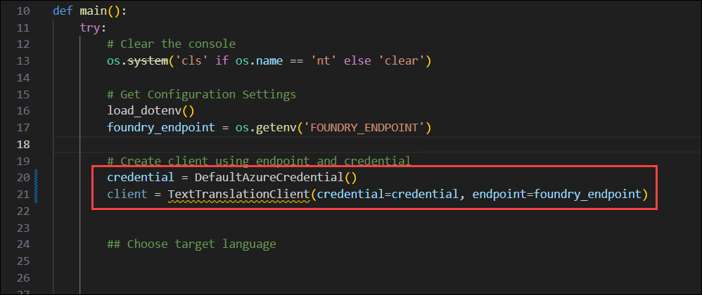

1. Find the comment **Choose target language** and add the following code, which uses the Text Translator service to return list of supported languages for translation, and prompts the user to select a language code for the target language:

    ```python
   # Choose target language
   languagesResponse = client.get_supported_languages(scope="translation")
   print("{} languages supported.".format(len(languagesResponse.translation)))
   print("(See https://learn.microsoft.com/azure/ai-services/translator/language-support#translation)")
   print("Enter a target language code for translation (for example, 'en'):")
   targetLanguage = "xx"
   supportedLanguage = False
   while supportedLanguage == False:
        targetLanguage = input()
        if  targetLanguage in languagesResponse.translation.keys():
            supportedLanguage = True
        else:
            print("{} is not a supported language.".format(targetLanguage))
    ```

    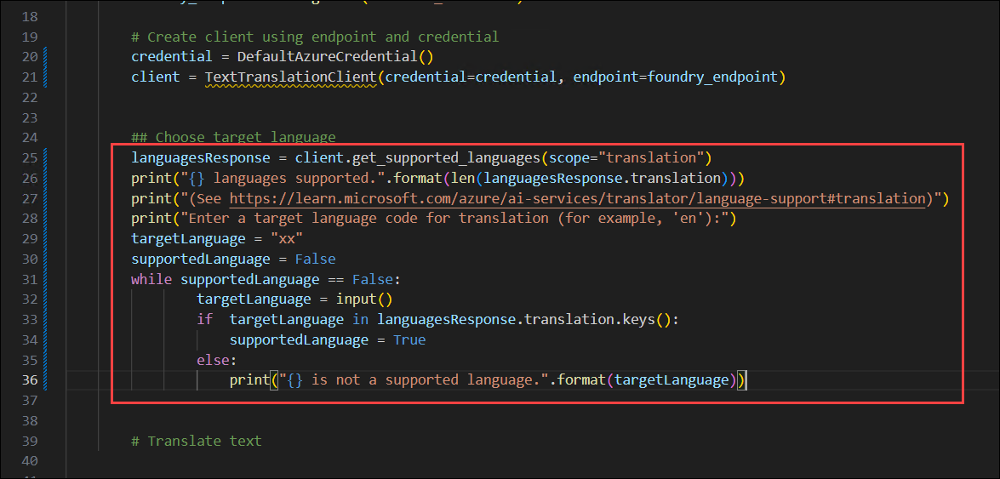

1. Find the comment **Translate text** and add the following code, which repeatedly prompts the user for text to be translated, uses the Azure AI Translator service to translate it to the target language (detecting the source language automatically), and displays the results until the user enters *quit*:

    ```python
   # Translate text
   inputText = ""
   while inputText.lower() != "quit":
        inputText = input("Enter text to translate ('quit' to exit):")
        if inputText != "quit":
            input_text_elements = [InputTextItem(text=inputText)]
            translationResponse = client.translate(body=input_text_elements, to_language=[targetLanguage])
            translation = translationResponse[0] if translationResponse else None
            if translation:
                sourceLanguage = translation.detected_language
                for translated_text in translation.translations:
                    print(f"'{inputText}' was translated from {sourceLanguage.language} to {translated_text.to} as '{translated_text.text}'.")
    ```

    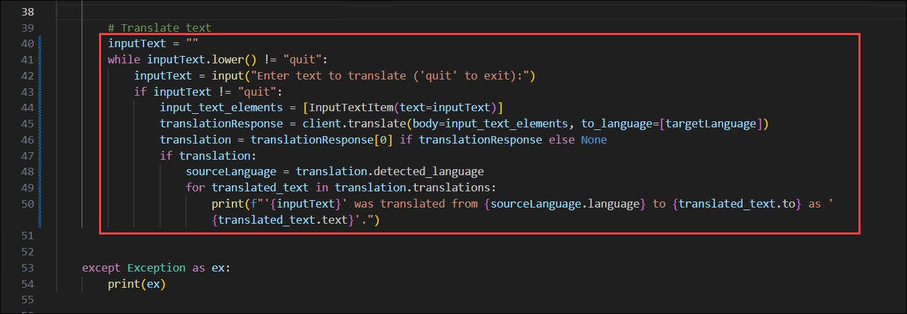

1. Save the changes to the code file by pressing **Ctrl+S**.

1. In the Visual Studio Code terminal, enter the following command to sign into Azure

     ```powershell
     az login
     ```

     > **Note:** Minimize the VS Code to see the **Sign in** window.

1. In the **Sign in** window, select **Work or school account** **(1)**, and then select **Continue** **(2)**.

    

1. On the **Sign in** page, provide the credentials below:
 
    - **Email/Username:** <inject key="AzureAdUserEmail"></inject>
    
      

    - **Password:** <inject key="AzureAdUserPassword"></inject>
    
      

1. When prompted, select **Yes** to sign in to all apps and websites on this device.

    

1. On the **Account added to this device** window, select **Done** to complete the sign-in process.

    

1. In the Visual Studio Code terminal, press **Enter** to select the default subscription.

    

1. After you have signed in, enter the following command to run the application:

    ```
   python translate-text.py
    ```

1. When prompted, enter a valid target language from the list in the link displayed.

    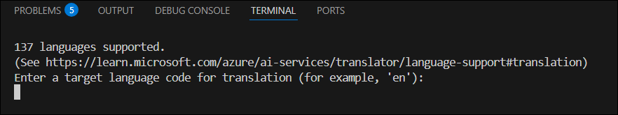

1. Enter a phrase to be translated (for example `This is a test` or `C'est un test`) and view the results, which should detect the source language and translate the text to the target language.

    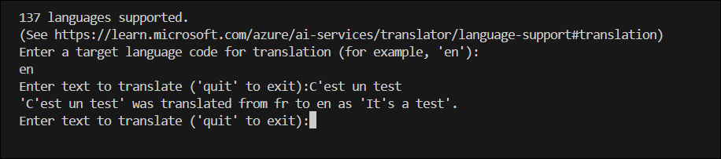

1. When you're done, enter `quit`. You can run the application again and choose a different target language.

## Task 5: Create a speech translation application (Read Only)

In this task, you'll configure and implement a Python application to translate spoken input into multiple languages using Azure Speech services.

> **Note:** <span style="color:red"> In the current lab environment, audio input (microphone) is not supported due to platform limitations; therefore, while you can perform the steps in this task, you will not be able to provide prompts using voice.

### Task 5.1: Configure your speech translation application

1. In the **translators** folder, verify that the .env file contains the  **endpoint** for your Foundry resource (Azure Speech can use the same information as Azure Translator to connect to your Foundry resource).

1. Ensure that the terminal is open in the **translators** folder with the prefix **(.venv)** to indicate that the Python environment you created is active.

1. If you did not previously install the required packages, enter the following command to do so now:

    ```
    pip install -r requirements.txt
    ```

### Task 5.2: Add code to translate speech

1. In the **Explorer** pane, in the **translators** folder,  open the **translate-speech.py** file.

    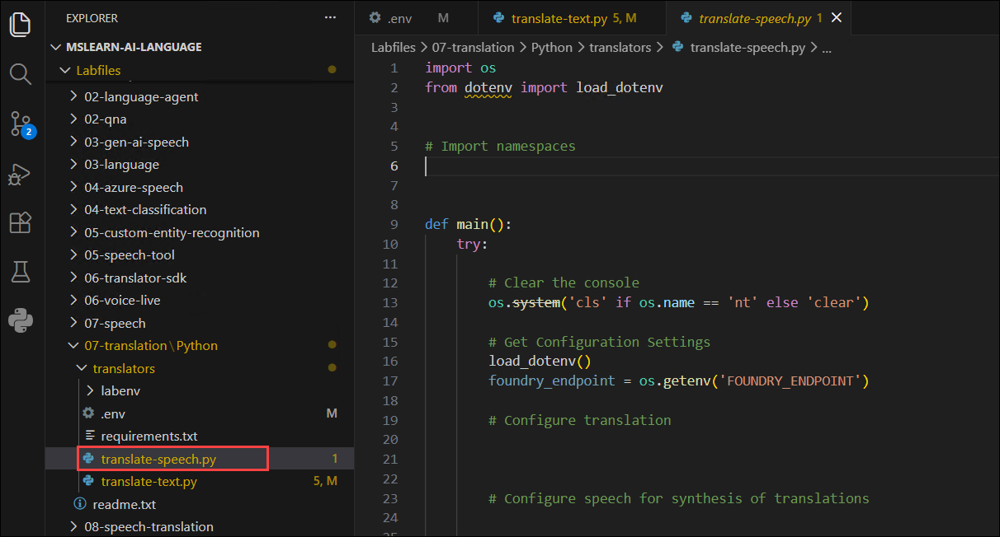

1. Review the existing code. You will add code to work with Azure Speech.

    > **Note:** As you add code to the code file, be sure to maintain the correct indentation.

1. At the top of the code file, under the existing namespace references, find the comment **Import namespaces** and add the following code to import the namespace you will need to use the Speech SDK:

    ```python
    # Import namespaces
    from azure.identity import DefaultAzureCredential
    import azure.cognitiveservices.speech as speech_sdk
    ```

    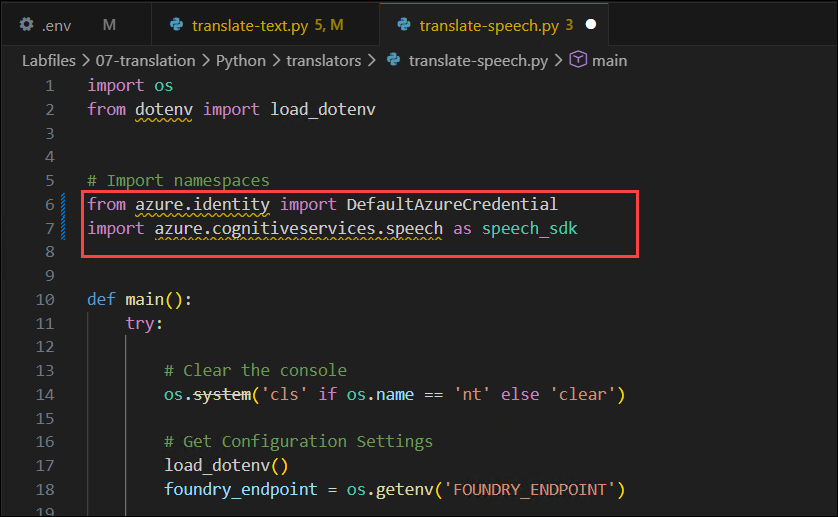

1. In the **main** function, under the comment **Get configuration settings**, note that the code loads the key and endpoint you defined in the configuration file.

1. Find the following code under the comment **Configure translation**, and add the following code to configure your connection to the Foundry endpoint for Azure Speech, and prepare to translate speech in US English to French, Spanish, and Hindi:

    ```python
   # Configure translation
   credential = DefaultAzureCredential()
   translation_cfg = speech_sdk.translation.SpeechTranslationConfig(
            token_credential=credential,
            endpoint=foundry_endpoint
   )
   translation_cfg.speech_recognition_language = 'en-US'
   translation_cfg.add_target_language('fr')
   translation_cfg.add_target_language('es')
   translation_cfg.add_target_language('hi')
   audio_in_cfg = speech_sdk.AudioConfig(use_default_microphone=True)
   translator = speech_sdk.translation.TranslationRecognizer(
        translation_config=translation_cfg,
        audio_config=audio_in_cfg
   )
   print('Ready to translate from',translation_cfg.speech_recognition_language)
    ```

    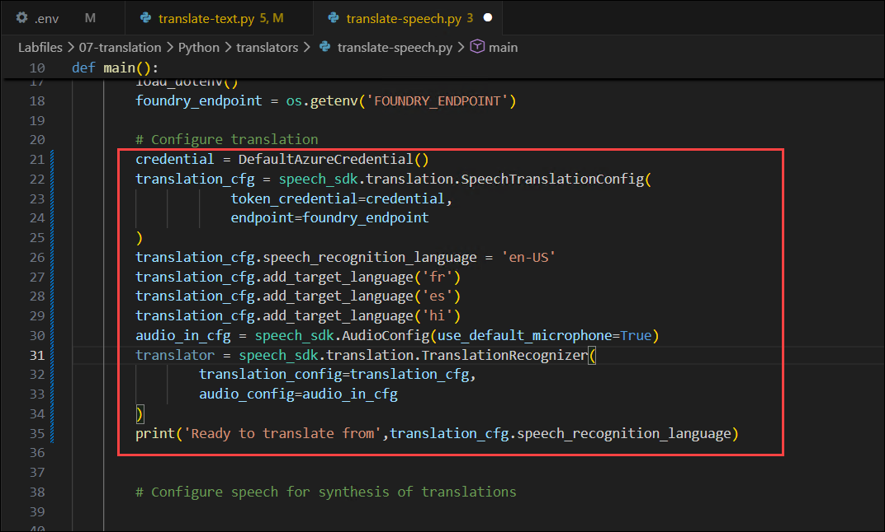

1. You will use the **SpeechTranslationConfig** to translate speech into text, but you will also use a **SpeechConfig** to synthesize translations into speech. Add the following code under the comment **Configure speech for synthesis of translations**:

    ```python
   # Configure speech for synthesis of translations
   speech_cfg = speech_sdk.SpeechConfig(
        token_credential=credential, endpoint=foundry_endpoint)
   audio_out_cfg = speech_sdk.audio.AudioOutputConfig(use_default_speaker=True)
   voices = {
        "fr": "fr-FR-HenriNeural",
        "es": "es-ES-ElviraNeural",
        "hi": "hi-IN-MadhurNeural"
   }
   print('Ready to use speech service.')
    ```

    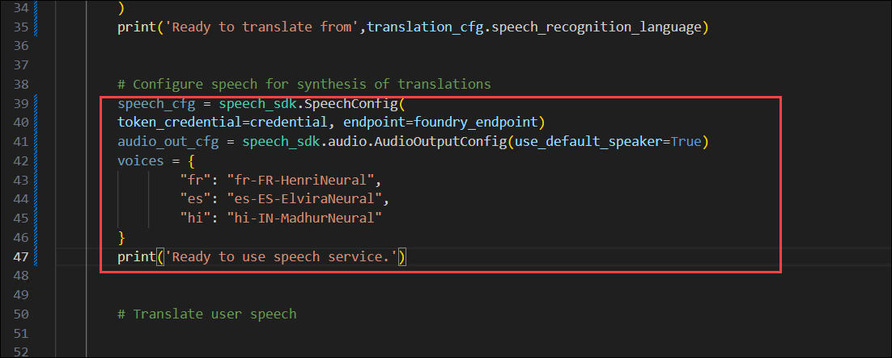

1. Now it's time to add the code to translate the user's speech int the system microphone. Find the comment **Translate user speech**, and add the following code:

    ```python
   # Translate user speech
   print("Speak now...")
   translation_results = translator.recognize_once_async().get()
   print(f"Translating '{translation_results.text}'")
    ```

    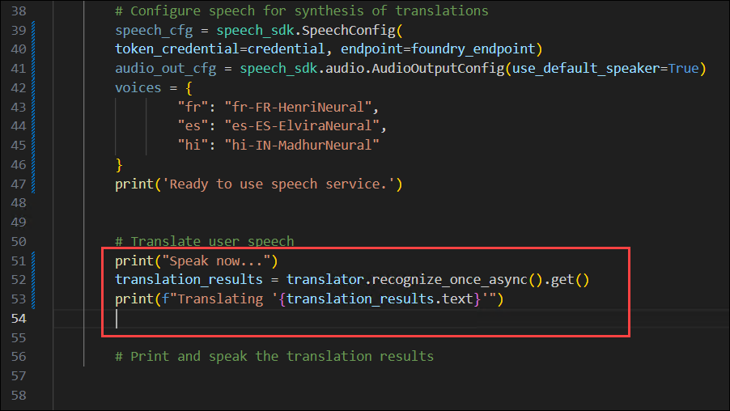

1. When the results are returned, the application will iterate through the translations, printing the text and playing the synthesized speech through the default system speaker. Find the comment **Print and speak the translation results** and add he following code:

    ```python
   # Print and speak the translation results
   translations = translation_results.translations
   for translation_language in translations:

        print(f"{translation_language}: '{translations[translation_language]}'")

        speech_cfg.speech_synthesis_voice_name = voices.get(translation_language)
        audio_out_cfg = speech_sdk.audio.AudioOutputConfig(use_default_speaker=True)
        speech_synthesizer = speech_sdk.SpeechSynthesizer(speech_cfg, audio_out_cfg)
        speak = speech_synthesizer.speak_text_async(translations[translation_language]).get()
        
        if speak.reason != speech_sdk.ResultReason.SynthesizingAudioCompleted:
            print(speak.reason)
    ```

    

1. Save the changes to the code file. 

1. Then, in the terminal pane, if you are not already signed into Azure (or your session may have expired) use the following command to sign into Azure.

    ```powershell
    az login
    ```

    > **Note**: In most scenarios, just using *az login* will be sufficient. However, if you have subscriptions in multiple tenants, you may need to specify the tenant by using the *--tenant* parameter. See [Sign into Azure interactively using the Azure CLI](https://learn.microsoft.com/cli/azure/authenticate-azure-cli-interactively) for details.

1. When prompted, follow the instructions to sign into Azure. Then complete the sign in process in the command line, viewing (and confirming if necessary) the details of the subscription containing your Foundry resource.

1. After you have signed in, enter the following command to run the application:

    ```
   python translate-speech.py
    ```

1. When prompted, say something aloud (for example, "*Hello!"*).

     The program should translate it to the languages specified in the code (French, Spanish, and Hindi), and print and speak the translations.

    > **NOTE**: The translation to Hindi may not always be displayed correctly in the terminal due to character encoding issues.

## Summary

In this exercise, you created translation applications using Microsoft Foundry by integrating Azure Translator and Azure Speech services. You explored text translation in the Foundry portal, built a Python-based application to translate text across multiple languages, and implemented speech translation capabilities. You then authenticated with Azure, ran the applications, and tested multilingual translation outputs. Great work!

## You have successfully completed the Hands-on Lab!