# Lab 26: Read text in images

### Estimated Duration: 30 Minutes

## Lab Overview

In this hands-on lab, you will learn how to build an OCR-enabled application using **Azure AI Vision**. You’ll begin by provisioning a Vision resource in the Azure portal and retrieving its keys and endpoint. Then, you’ll set up a Python client application in Azure Cloud Shell, install the required SDK packages, and configure the app to authenticate with your resource. Next, you’ll extend the application to analyze sample images, extract full lines of text, and generate annotated images. Finally, you’ll enhance the solution to detect individual words, display their confidence scores, and produce word-level annotations on the images.

## Lab Objectives 

- **Task 1:** Provision an Azure AI Vision resource

- **Task 2:** Develop a text extraction app with the Azure AI Vision SDK

- **Task 3:** Add code to read text from an image

- **Task 4:** Add code to return the position of individual words

## Task 1: Provision an Azure AI Vision resource

In this task, you’ll provision an Azure AI Vision resource in the Azure portal. You’ll create a Computer Vision resource, configure its settings, and then copy the endpoint and key values into a Notepad file for later use.

> **Note**: In this exercise, you'll use a standalone **Computer Vision** resource. You can also use Azure AI Vision services in an *Azure AI Services* multi-service resource, either directly or in an *Microsoft Foundry* project.

1. Open the Azure portal at `https://portal.azure.com`, and sign in using the Microsoft account.

1. If prompted, provide the credentials below:

    - **Email/Username:** <inject key="AzureAdUserEmail"></inject>

        

    - **Password:** <inject key="AzureAdUserPassword"></inject>

        

1. When the **Stay signed in?** window appears, select **No**.

    

1. Open the **Azure portal**, search for **Computer vision (1)** and select **Computer vision (2)** from the services.

    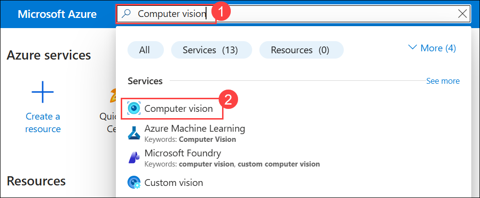

1. On **Microsoft Foundry | Computer Vision** blade, click on **+ Create**.

    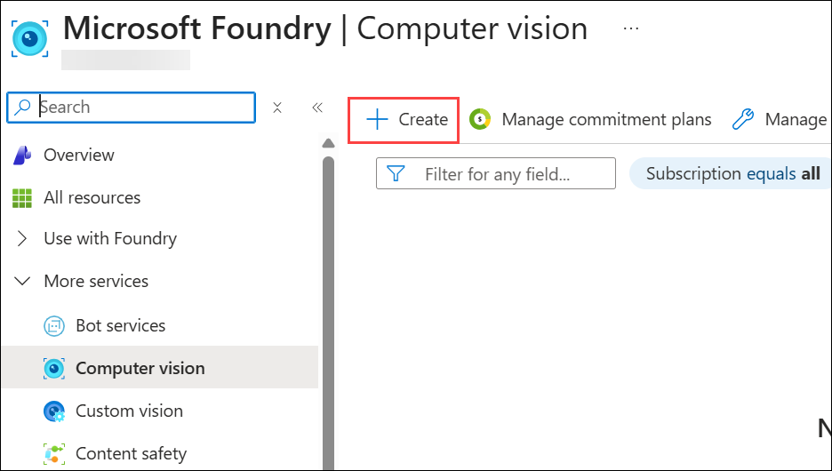

1. Provision the resource using the following settings and then click on **Review + create**:

    - Subscription: **Choose Default Subscription (1)**
    - Resource group: **AI-102-RG25 (2)**
    - Region: **<inject key="Region" enableCopy="false" /> (3)**
    - Name: **computervision<inject key="DeploymentID" enableCopy="false"/> (4)**
    - Pricing tier: **F0 (5)** (*free*), or **S** (*standard*) if F is not available.
    - Responsible AI notice: **Selected (6)**

        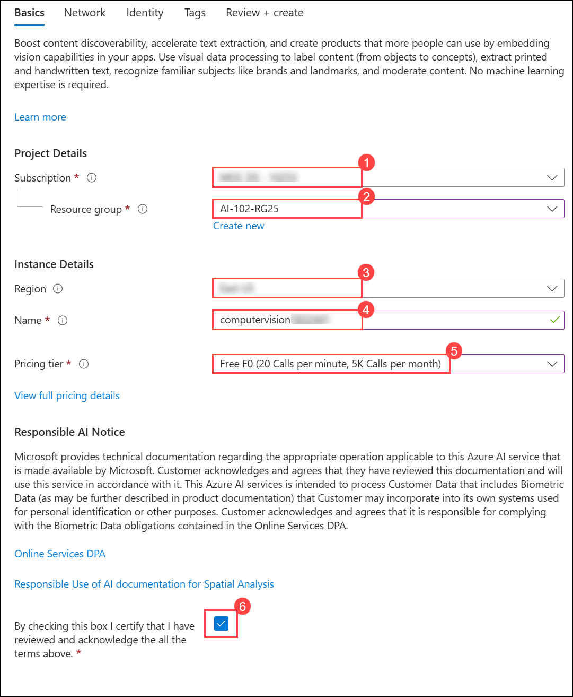

        >**Note:** Azure AI Vision 4.0 full feature sets are currently only available in these regions.

1. On the **Review + create** tab, click **Create** to provision the resource.

    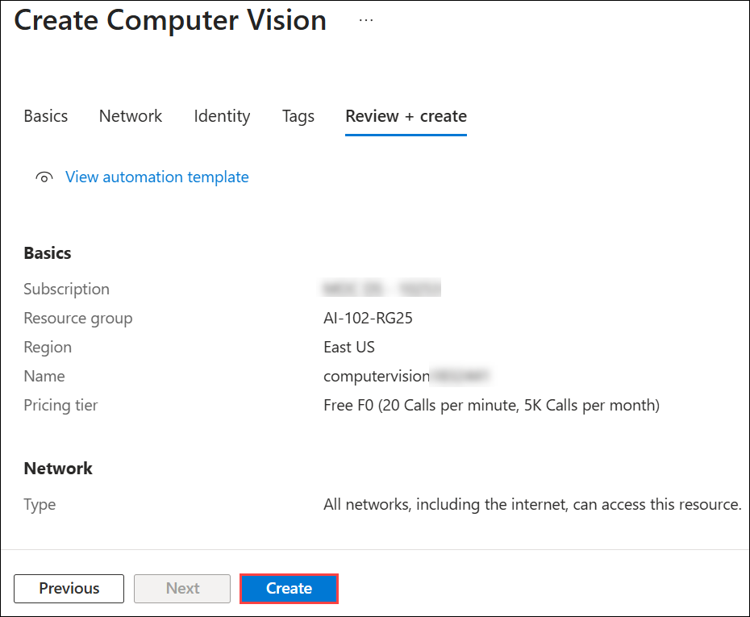

1. Wait for the deployment to finish, then check the deployment details and select **Go to resource**.

    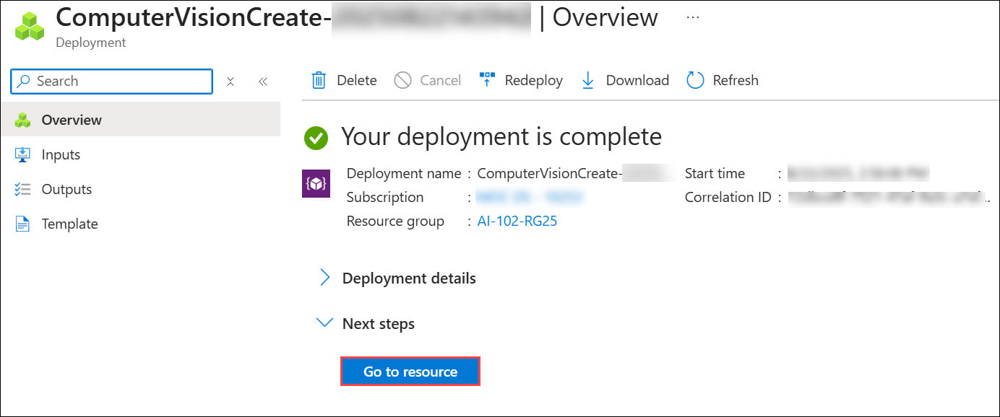

1. From the left navigation pane, open the **Resource management (1)** section and go to the **Keys and Endpoint (2)** page. Copy the **Endpoint (3)** and one of the **Keys (4)**, then paste them into a Notepad file, as you’ll need them in the next task.

    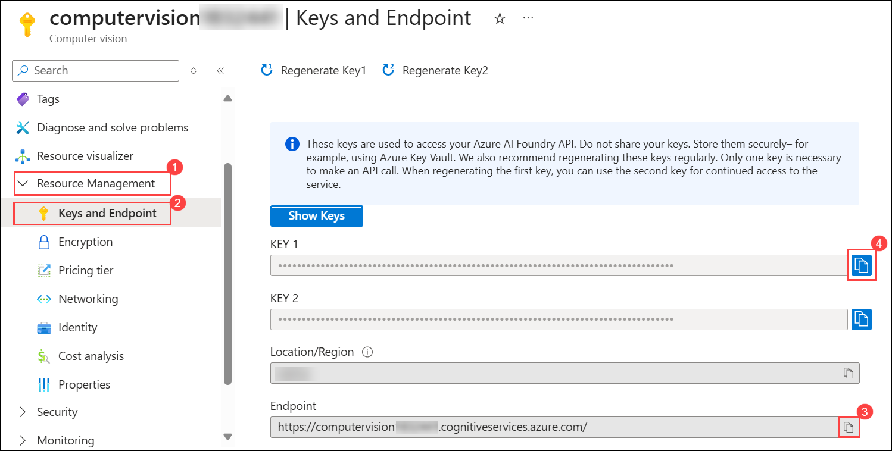

> **Congratulations** on completing the task! Now, it's time to validate it. Here are the steps:
>
> - Hit the Validate button for the corresponding task. If you receive a success message, you can proceed to the next task.
> - If not, carefully read the error message and retry the step, following the instructions in the lab guide.
> - If you need any assistance, please contact us at cloudlabs-support@spektrasystems.com. We are available 24/7 to help.
 
<validation step="5e948647-4de2-4c59-8f0a-ace91a4d0450" />

## Task 2: Develop a text extraction app with the Azure AI Vision SDK

In this exercise, you'll complete a partially implemented client application that uses the Azure AI Vision SDK to extract text from images.

1. On the **Azure portal** homepage, click the **\[>\_] Cloud Shell (1)** button located to the right of the **Copilot** tab at the top. This opens a new Cloud Shell session. In the **Welcome to Azure Cloud Shell** window, choose **PowerShell (2)**.

    

    >**Note:** The cloud shell provides a command-line interface in a pane at the bottom of the Azure portal. You can resize or maximize this pane to make it easier to work in.

    > **Note:** If you have previously created a cloud shell that uses a **Bash** environment, switch it to **PowerShell**.

1. In the **Getting started** window, ensure **No storage account required (1)** is selected. From the **Subscription** drop-down, choose **Default subscription (2)**, then click **Apply (3)**.

    

1. In the Cloud Shell toolbar, open the **Settings (1)** menu and choose **Go to Classic version (2)** from the drop-down.

    

    >**Note:** Ensure you've switched to the classic version of the cloud shell before continuing.

1. In the cloud shell pane, enter the following commands to clone the GitHub repo containing the code files for this exercise (type the command, or copy it to the clipboard and then right-click in the command line and paste as plain text):

    ```
    rm -r mslearn-ai-vision -f
    git clone https://github.com/MicrosoftLearning/mslearn-ai-vision
    ```

    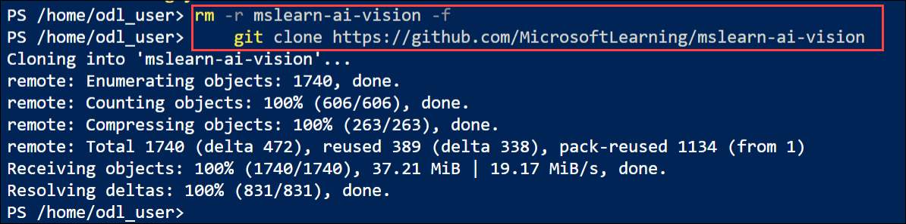

    > **Note:** As you paste commands into the cloudshell, the output may take up a large amount of the screen buffer. You can clear the screen by entering the `cls` command to make it easier to focus on each task.

1. After the repo has been cloned, use the following command to navigate to the application code files:

    ```
    cd mslearn-ai-vision/Labfiles/ocr/python/read-text
    ls -a -l
    ```

    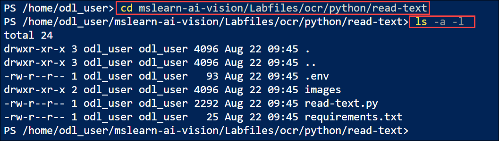

1. The folder contains application configuration and code files for your app. It also contains an **/images** subfolder, which contains some image files for your app to analyze.

1. Install the Azure AI Vision SDK package and other required packages by running the following commands:

    ```
    python -m venv labenv
    ./labenv/bin/Activate.ps1
    pip install -r requirements.txt azure-ai-vision-imageanalysis==1.0.0
    ```

1. Enter the following command to edit the configuration file for your app. The file will be opened in a code editor.

    ```
    code .env
    ```
    
    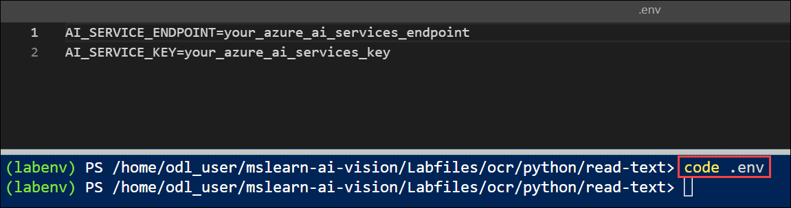

1. In the code file, update the configuration values it contains to reflect the **Endpoint (1)** and an authentication **Key (2)** for your Computer Vision resource (copied from its **Keys and Endpoint** page in the Azure portal).

    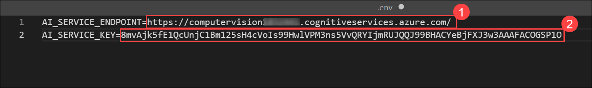

1. After you've replaced the placeholders, use the **CTRL+S** command to save your changes and then use the **CTRL+Q** command to close the code editor while keeping the cloud shell command line open.

## Task 3: Add code to read text from an image

In this task, you’ll extend the client application by adding code that uses the Azure AI Vision SDK to read text from an image. You’ll implement imports, authenticate the client, and write logic to extract and display text lines from sample images.

1. In the cloud shell command line, enter the following command to open the code file for the client application:

    ```
    code read-text.py
    ```

    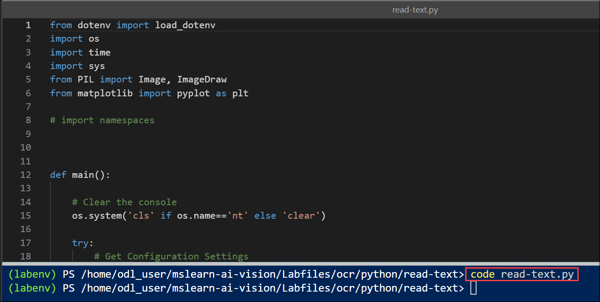

    > **Note:** You might want to maximize the cloud shell pane and move the split-bar between the command line cosole and the code editor so you can see the code more easily.

1. In the code file, find the comment **Import namespaces**, and add the following code to import the namespaces you will need to use the Azure AI Vision SDK:

    ```python
    # import namespaces
    from azure.ai.vision.imageanalysis import ImageAnalysisClient
    from azure.ai.vision.imageanalysis.models import VisualFeatures
    from azure.core.credentials import AzureKeyCredential
    ```

    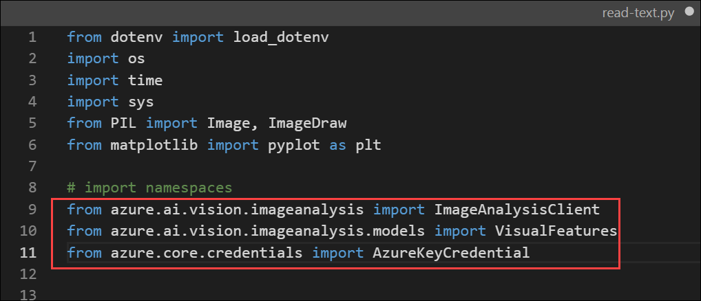

1. In the **Main** function, the code to load the configuration settings and determine the file to be analyzed has been provided. Then find the comment **Authenticate Azure AI Vision client** and add the following language-specific code to create and authenticate an Azure AI Vision Image Analysis client object:

    ```python
    # Authenticate Azure AI Vision client
    cv_client = ImageAnalysisClient(
            endpoint=ai_endpoint,
            credential=AzureKeyCredential(ai_key))
    ```

    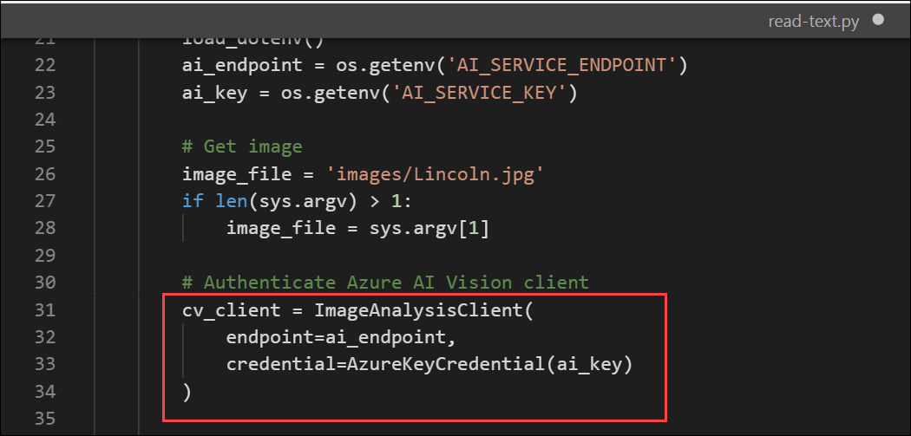

1. In the **Main** function, under the code you just added, find the comment **Read text in image** and add the following code to use the Image Analysis client to read the text in the image:

    ```python
    # Read text in image
    with open(image_file, "rb") as f:
            image_data = f.read()
    print (f"\nReading text in {image_file}")

    result = cv_client.analyze(
            image_data=image_data,
            visual_features=[VisualFeatures.READ])
    ```

    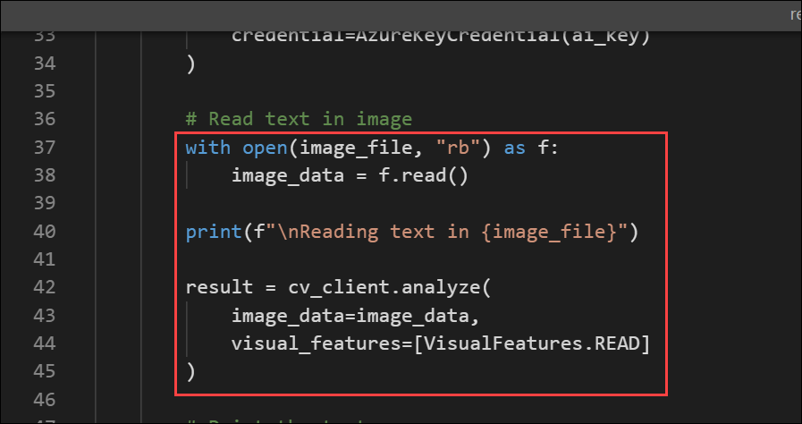

1. Find the comment **Print the text** and add the following code (including the final comment) to print the lines of text that were found and call a function to annotate them in the image (using the **bounding_polygon** returned for each line of text):

    ```python
    # Print the text
        if result.read is not None:
            print("\nText:")

            for line in result.read.blocks[0].lines:
                print(f" {line.text}")

            # Annotate the text in the image
            annotate_lines(image_file, result.read)

            # Find individual words in each line
    ```

    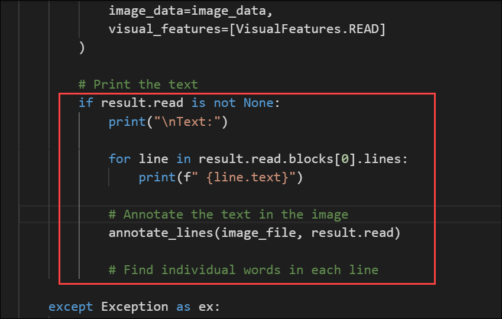

1. Save your changes **CTRL+S** but keep the code editor open in case you need to fix any typo's.

1. Resize the panes so you can see more of the console, then enter the following command to run the program:

    ```
    python read-text.py images/Lincoln.jpg
    ```

    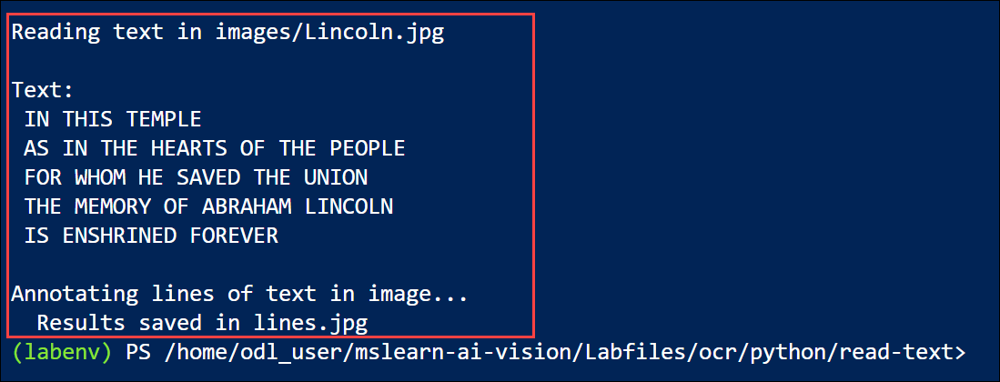

1. The program reads the text in the specified image file (*images/Lincoln.jpg*), which looks like this:

    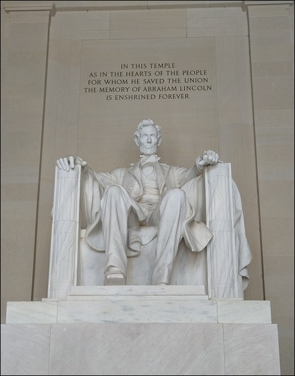

1. In the **read-text** folder, a **lines.jpg** image has been created. Use the (Azure cloud shell-specific) **download** command to download it and then click on **Click here to download your file**.

    ```
    download lines.jpg
    ```

    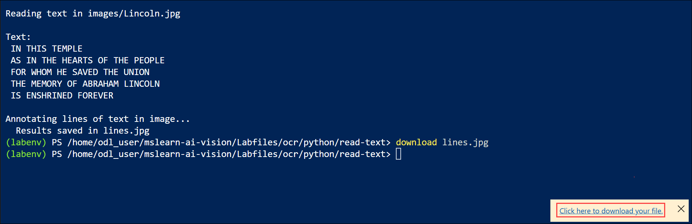

1. The download command creates a popup link at the bottom right of your browser, which you can select to download and open the file. The image should look simlar to this:

    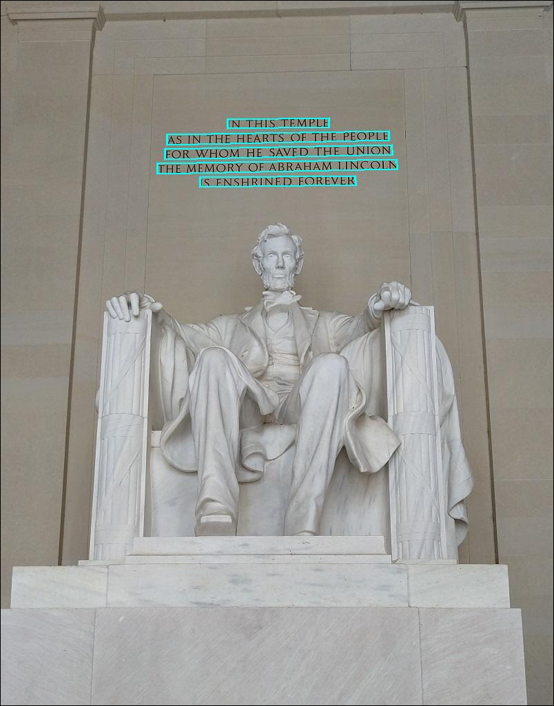

1. Run the program again, this time specifying the parameter *images/Business-card.jpg* to extract text from the following image:

    

    ```
    python read-text.py images/Business-card.jpg
    ```

    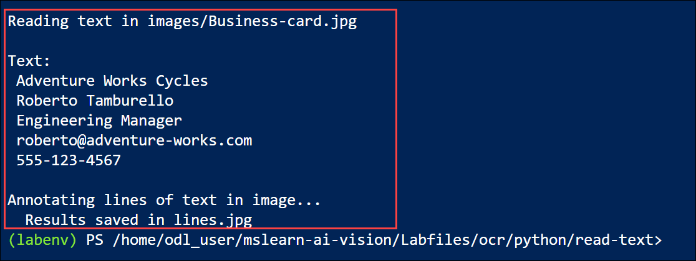

1. Download and view the resulting **lines.jpg** file:

    ```
    download lines.jpg
    ```

    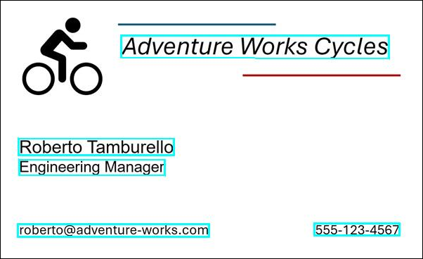

1. Run the program one more time, this time specifying the parameter *images/Note.jpg* to extract text from this image:

    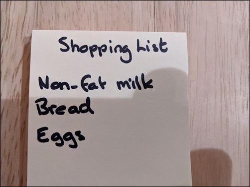

    ```
    python read-text.py images/Note.jpg
    ```

    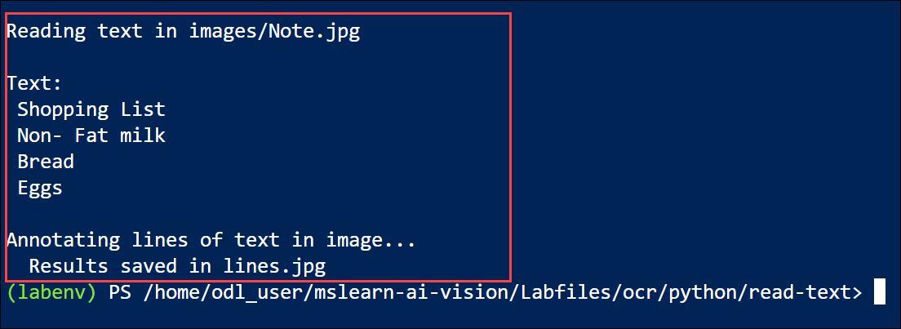

1. Download and view the resulting **lines.jpg** file:

    ```
    download lines.jpg
    ```

    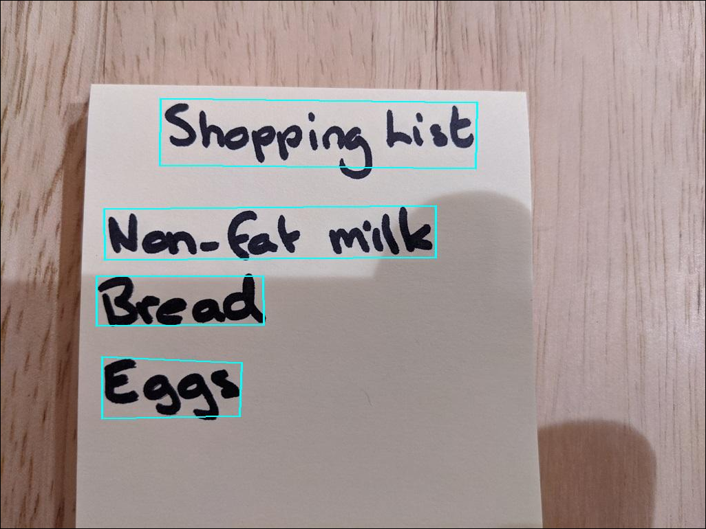

## Task 4: Add code to return the position of individual words

In this task, you’ll enhance the application further to detect and return the individual words in an image. You’ll update the code to print each word with its confidence score, and generate annotated images highlighting the detected words.

1. Resize the panes so you can see more of the code file. Then find the comment **Find individual words in each line** and add the following code (being careful to maintain the correct indentation level):

    ```python
    # Find individual words in each line
    print ("\nIndividual words:")
    for line in result.read.blocks[0].lines:
            for word in line.words:
                print(f"  {word.text} (Confidence: {word.confidence:.2f}%)")
    # Annotate the words in the image
    annotate_words(image_file, result.read)
    ```

    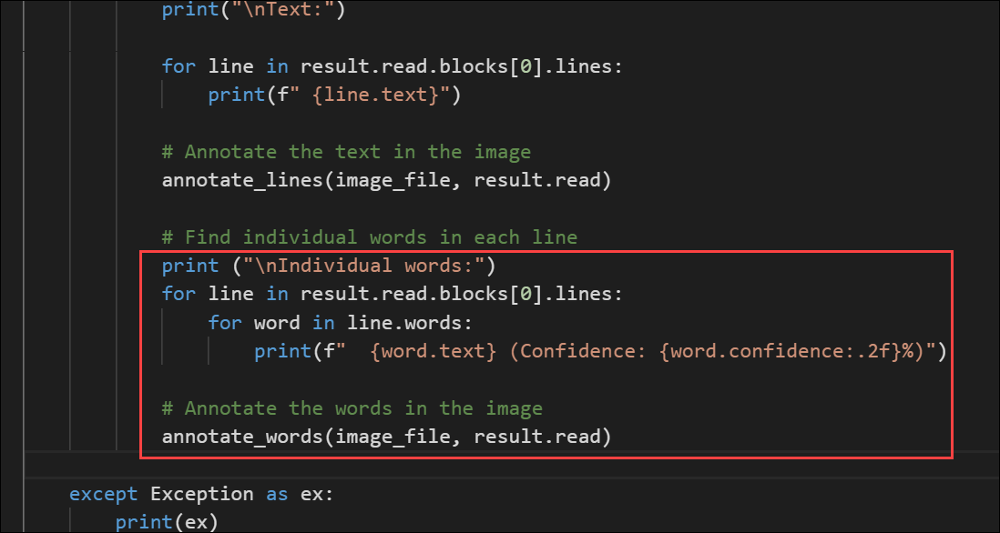

1. Save your changes *CTRL+S**. Then, in the command line pane, rerun the program to extract text from *images/Lincoln.jpg*.

    ```
    python read-text.py images/Lincoln.jpg
    ```

1. Observe the output, which should include each individual word in the image, and the confidence associated with their prediction.

    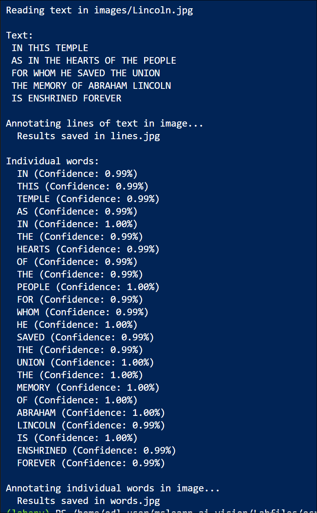

1. In the **read-text** folder, a **words.jpg** image has been created. Use the (Azure cloud shell-specific) **download** command to download and view it:

    ```
    download words.jpg
    ```

    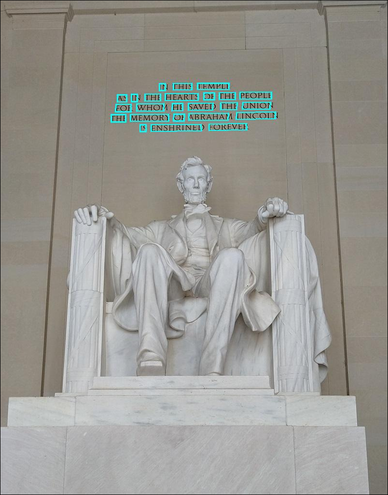

1. Rerun the program for *images/Business-card.jpg* and *images/Note.jpg*; viewing the **words.jpg** file generated for each image.

    ```
    python read-text.py images/Business-card.jpg
    ```

    ```
    python read-text.py images/Note.jpg
    ```

## Summary

In this lab, you provisioned an **Azure AI Vision** resource and configured a Python client application to work with it in Azure Cloud Shell. You set up the environment, cloned the required repository, and updated the configuration with your endpoint and key values. You then extended the application code to authenticate with the Vision service, read text from sample images, and display the extracted lines. Finally, you enhanced the app to detect individual words with confidence scores and generated annotated images highlighting both lines and words. Through these tasks, you gained practical experience in provisioning a Vision resource, integrating the Azure AI Vision SDK, and building an OCR-enabled application to analyze and extract text from images.

## You have successfully completed the Hands-on Lab!