# Lab 27: Detect and analyze faces

### Estimated Duration: 30 Minutes

## Lab Overview

In this hands-on lab, you’ll build a face detection and analysis solution using Azure AI Face. You’ll provision a Face resource, capture its endpoint/key, and configure the Face SDK in Azure Cloud Shell. You’ll implement and run code to detect faces and extract attributes such as head pose, occlusions, and accessories. You’ll generate annotated images with bounding boxes and review results in the console. By the end, you’ll be able to authenticate securely, analyze faces programmatically, and export results for validation and reporting.

## Lab Objectives

- **Task 1:** Provision an Azure AI Face API resource

- **Task 2:** Develop a facial analysis app with the Face SDK

### Task 1: Provision an Azure AI Face API resource

In this task, you’ll create an Azure AI Face resource, then go to Keys and Endpoint to copy the Endpoint and Key. These credentials will be used later to authenticate SDK calls from your app.

1. Open the Azure portal at `https://portal.azure.com`, and sign in using the Microsoft account.

1. If prompted with a sign-in window, kindly sign in using the provided Azure credentials

    - **Email/Username:** <inject key="AzureAdUserEmail"></inject>

        

    - **Password:** <inject key="AzureAdUserPassword"></inject>

        

1. If prompted to **Stay signed in?**, you can click **No**.

    

1. On the **Azure portal**, select **+ Create a resource**.

   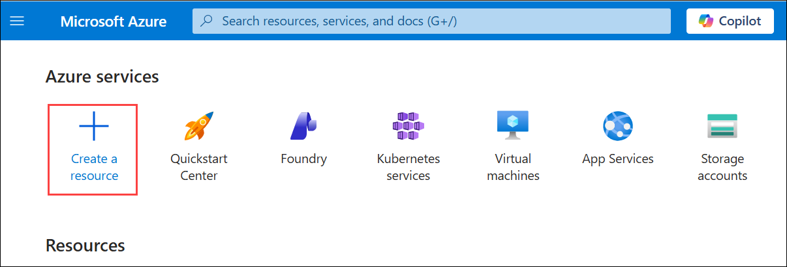

1. In the search bar, search for `Face` **(1)**, select **face (2)**.

   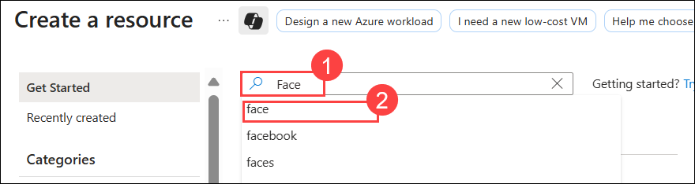

1. Select **Face** resource from the Marketplace.

   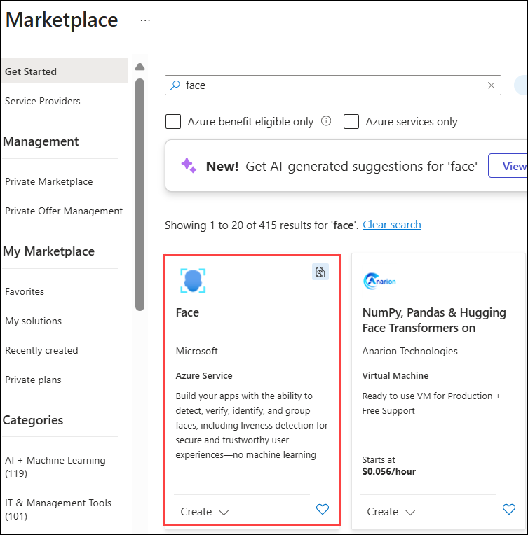

1. Select **Create**.

   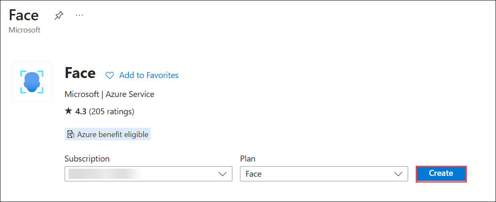

1. Create the resource with the following settings:

    - **Subscription**: Leave your default Azure subscription **(1)**
    - **Resource group**: Select **AI-102-RG24 (2)**
    - Region: Select **<inject key="Region" enableCopy="false" /> (3)**
    - Name: Enter **face<inject key="DeploymentID" enableCopy="false"/> (4)**
    - **Pricing tier**: Select **F0 (5)** 
    - Select **Review + create (6)**

      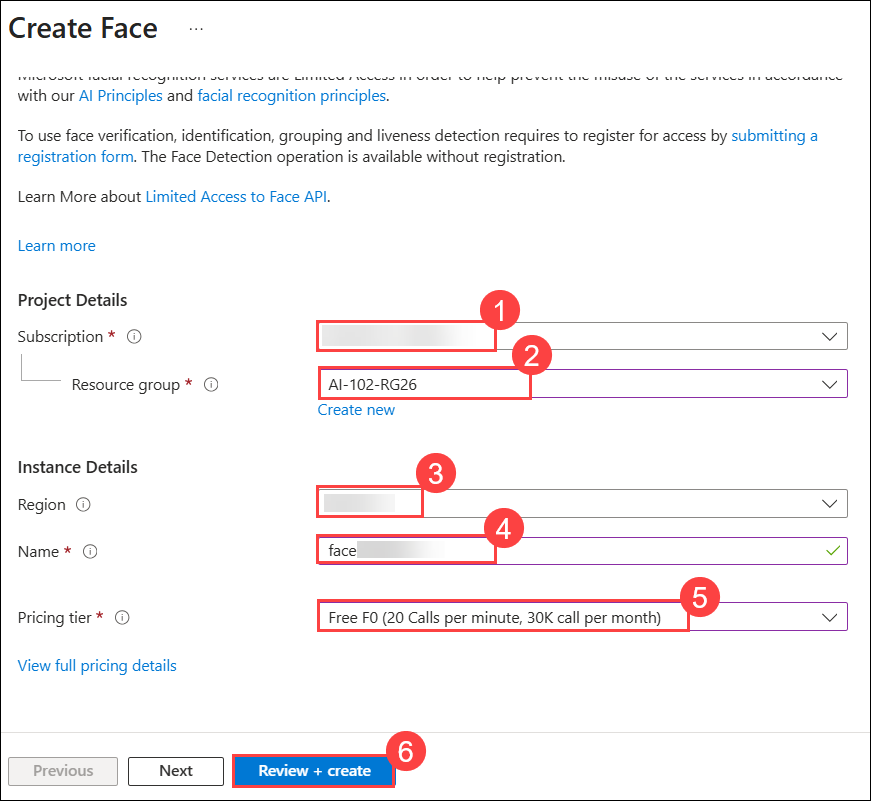  

1. Then select **Create** to provision the resource.

    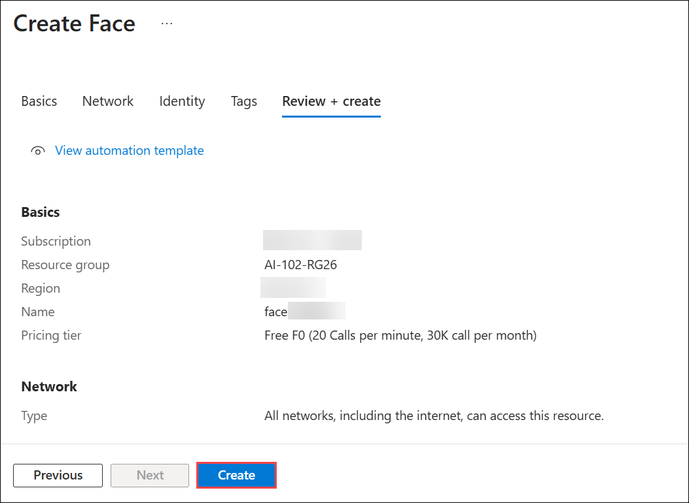

1. Wait for deployment to complete, and select **Go to resource** to go to the resource group.

   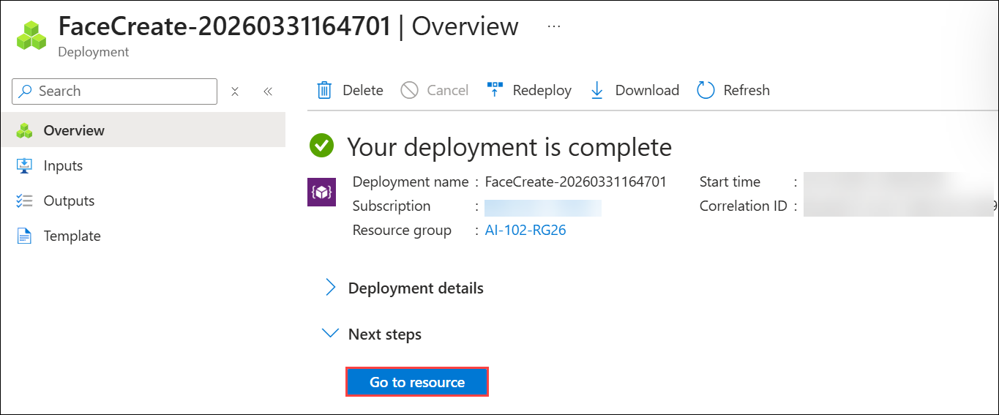

1. Select the Face resource **face<inject key="DeploymentID" enableCopy="false"/>**.

   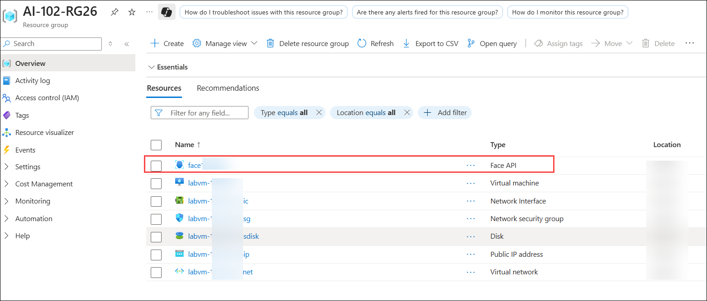

1. Navigate to the **Keys and Endpoint (1)** page. Copy and paste the **KEY 1 (2)** and **Endpoint(3)**. You will need the information on this page later in the lab.

   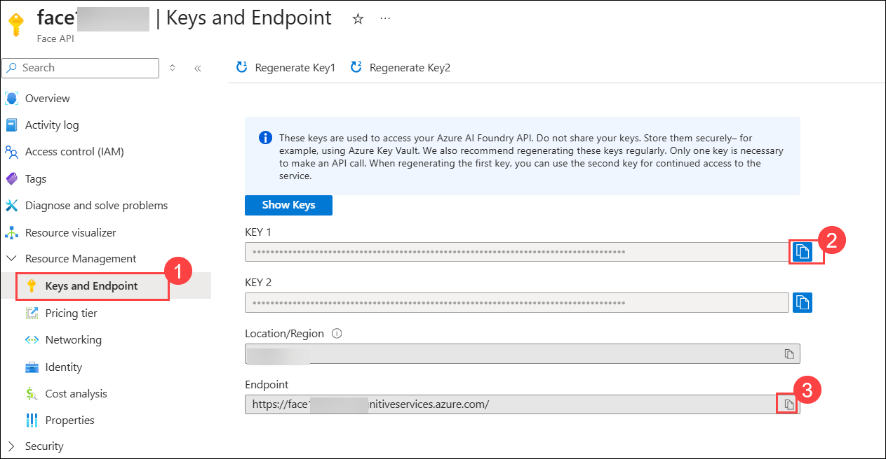    

> **Congratulations** on completing the task! Now, it's time to validate it. Here are the steps:
>
> - Hit the Validate button for the corresponding task. If you receive a success message, you can proceed to the next task.
> - If not, carefully read the error message and retry the step, following the instructions in the lab guide.
> - If you need any assistance, please contact us at cloudlabs-support@spektrasystems.com. We are available 24/7 to help.
 
<validation step="35faa7e9-4587-4371-87c1-6d2fa740ea96" />
 
---      

### Task 2: Develop a facial analysis app with the Face SDK

In this task, you'll complete a partially implemented client application that uses the Azure Face SDK to detect and analyze human faces in images.

### Task 2.1: Prepare the application configuration

In this task, you’ll open Azure Cloud Shell, set up a Python environment, install the Azure AI Vision Face SDK, and add your Endpoint and Key to the app configuration so the SDK can authenticate.

1. On the **Azure portal** homepage, click the **\[>\_] Cloud Shell (1)** button located to the right of the **Copilot** tab at the top. This opens a new Cloud Shell session. In the **Welcome to Azure Cloud Shell** window, choose **PowerShell (2)**.

    

    

1. In the **Getting started** window, ensure **No storage account required (1)** is selected. From the **Subscription** drop-down, choose **Default subscription (2)**, then click **Apply (3)**.

       

1. In the cloud shell toolbar, in the **Settings (1)** menu, select **Go to Classic version (2)** (this is required to use the code editor).

    

     >**Note**: The cloud shell provides a command-line interface in a pane at the bottom of the Azure portal. You can resize or maximize this pane to make it easier to work in.

     >**Note**: Ensure you've switched to the classic version of the cloud shell before continuing.

1. Resize the cloud shell pane so you can still see the **Keys and Endpoint** page for your Face resource.

    > **Tip**" You can resize the pane by dragging the top border. You can also use the minimize and maximize buttons to switch between the cloud shell and the main portal interface.

1. In the cloud shell pane, enter the following commands to clone the GitHub repo containing the code files for this exercise (type the command, or copy it to the clipboard and then right-click in the command line and paste as plain text):

    ```
    rm -r mslearn-ai-vision -f
    git clone https://github.com/MicrosoftLearning/mslearn-ai-vision
    ```

     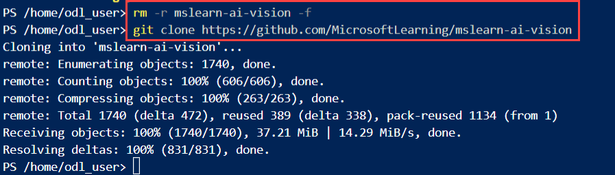 

      >**Tip**: As you paste commands into the cloudshell, the output may take up a large amount of the screen buffer. You can clear the screen by entering the `cls` command to make it easier to focus on each task.

1. After the repo has been cloned, use the following command to navigate to the application code files:

    ```
   cd mslearn-ai-vision/Labfiles/face/python/face-api
   ls -a -l
    ```

     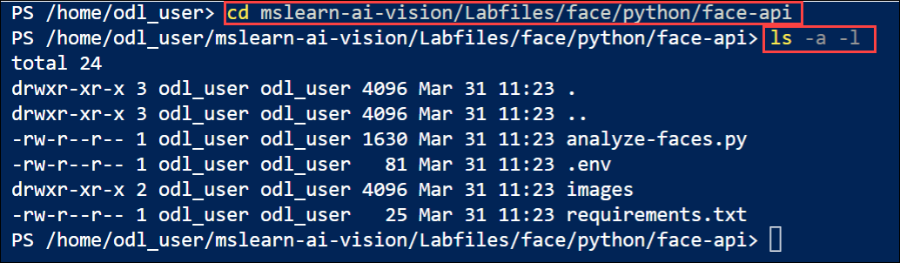     

      The folder contains application configuration and code files for your app. It also contains an **/images** subfolder, which contains some image files for your app to analyze.

1. Install the Azure AI Vision SDK package and other required packages by running the following commands:

    ```
   python -m venv labenv
   ./labenv/bin/Activate.ps1
   pip install -r requirements.txt azure-ai-vision-face==1.0.0b2
    ```

1. Enter the following command to edit the configuration file for your app:

    ```
   code .env
    ```

     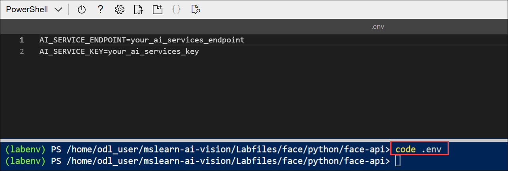     

     The file is opened in a code editor.

1. In the code file, update the configuration values it contains to reflect the **endpoint (1)** and an authentication **key (2)** for your Face resource (copied from its **Keys and Endpoint** page in `Task 1`).

    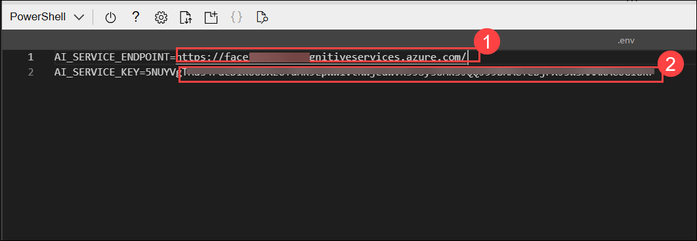 

1. After you've replaced the placeholders, use the **CTRL+S** command to save your changes and then use the **CTRL+Q** command to close the code editor while keeping the cloud shell command line open.


### Task 2.2: Add code to create a Face API client

In this task, you’ll import the required namespaces and instantiate FaceClient with AzureKeyCredential and your endpoint, enabling secure calls to the Face API from your code.

1. In the cloud shell command line, enter the following command to open the code file for the client application:

    ```
   code analyze-faces.py
    ```

     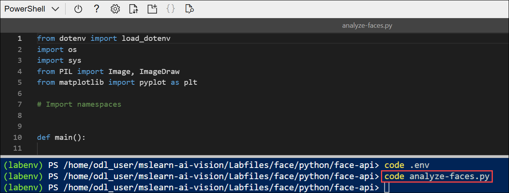   

      >**Tip**: You might want to maximize the cloud shell pane and move the split-bar between the command line cosole and the code editor so you can see the code more easily.

1. In the code file, find the comment **Import namespaces**, and add the following code to import the namespaces you will need to use the Azure AI Vision SDK:

    ```python
   # Import namespaces
   from azure.ai.vision.face import FaceClient
   from azure.ai.vision.face.models import FaceDetectionModel, FaceRecognitionModel, FaceAttributeTypeDetection01
   from azure.core.credentials import AzureKeyCredential
    ```

     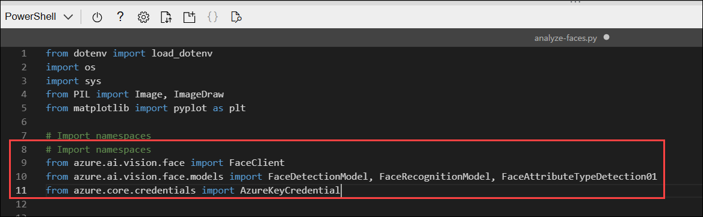      

1. In the **Main** function, note that the code to load the configuration settings and determine the image to be analyzed has been provided. Then find the comment **Authenticate Face client** and add the following code to create and authenticate a **FaceClient** object:

    ```python
   # Authenticate Face client
   face_client = FaceClient(
        endpoint=cog_endpoint,
        credential=AzureKeyCredential(cog_key))
    ```

     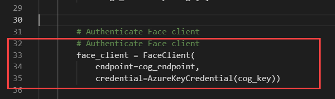

### Task 2.3: Add code to detect and analyze faces

In this task, you’ll specify the facial attributes to return (head pose, occlusions, accessories), call the detect API on sample images, review console output, and generate an output image with bounding boxes around detected faces.

1. In the code file for your application, in the **Main** function, find the comment **Specify facial features to be retrieved** and add the following code:

    ```python
   # Specify facial features to be retrieved
   features = [FaceAttributeTypeDetection01.HEAD_POSE,
                FaceAttributeTypeDetection01.OCCLUSION,
                FaceAttributeTypeDetection01.ACCESSORIES]
    ```

    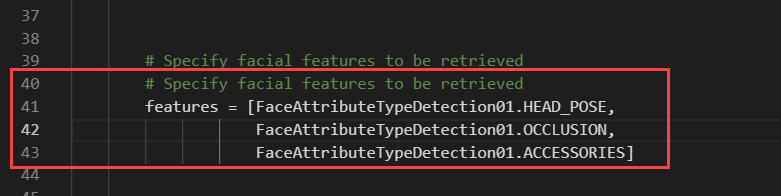    

2. In the **Main** function, under the code you just added, find the comment **Get faces** and add the following code to print the facial feature information and call a function that annotates the image with the bounding box for each detected face (based on the **face_rectangle** property of each face):

    ```python
    # Get faces
    with open(image_file, mode="rb") as image_data:
        detected_faces = face_client.detect(
            image_content=image_data.read(),
            detection_model=FaceDetectionModel.DETECTION01,
            recognition_model=FaceRecognitionModel.RECOGNITION01,
            return_face_id=False,
            return_face_attributes=features,
        )

    face_count = 0
    if len(detected_faces) > 0:
        print(len(detected_faces), 'faces detected.')
        for face in detected_faces:

            # Get face properties
            face_count += 1
            print('\nFace number {}'.format(face_count))
            print(' - Head Pose (Yaw): {}'.format(face.face_attributes.head_pose.yaw))
            print(' - Head Pose (Pitch): {}'.format(face.face_attributes.head_pose.pitch))
            print(' - Head Pose (Roll): {}'.format(face.face_attributes.head_pose.roll))
            print(' - Forehead occluded?: {}'.format(face.face_attributes.occlusion["foreheadOccluded"]))
            print(' - Eye occluded?: {}'.format(face.face_attributes.occlusion["eyeOccluded"]))
            print(' - Mouth occluded?: {}'.format(face.face_attributes.occlusion["mouthOccluded"]))
            print(' - Accessories:')
            for accessory in face.face_attributes.accessories:
                print('   - {}'.format(accessory.type))

        # Annotate faces in the image
        annotate_faces(image_file, detected_faces)
    ```

    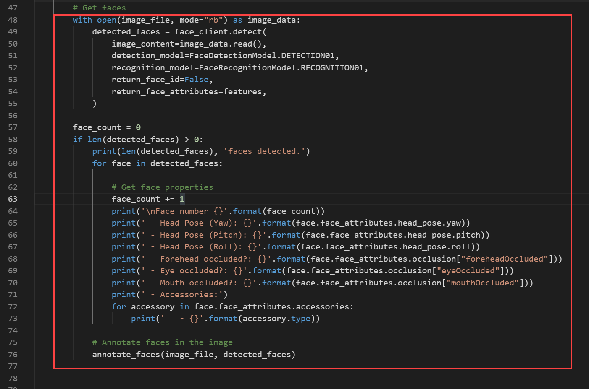       

3. Examine the code you added to the **Main** function. It analyzes an image file and detects any faces it contains, including attributes for head pose, occlusion, and the presence of accessories such as glasses. Additionally, a function is called to annotate the original image with a bounding box for each detected face.

1. Save your changes using **CTRL+S** but keep the code editor open in case you need to fix any typo's.

1. Resize the panes so you can see more of the console, then enter the following command to run the program with the argument **images/face1.jpg**:

    ```
   python analyze-faces.py images/face1.jpg
    ```

    The app runs and analyzes the following image:

       

1. Observe the output, which should include the ID and attributes of each face detected. 

    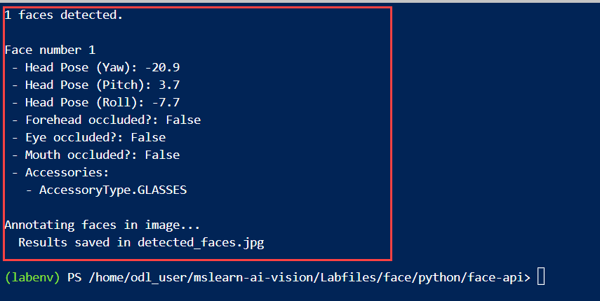 

1. Note that an image file named **detected_faces.jpg** is also generated.

1. Use the (Azure cloud shell-specific) **download** command to download it **(1)**:

    ```
   download detected_faces.jpg
    ```

    - The download command creates a popup link at the bottom right of your browser, which you can select to download and open the file **(2)**

      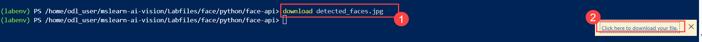     

1. Open the file.

    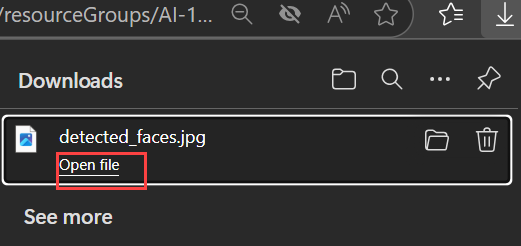 

1. The image should look simlar to this:

    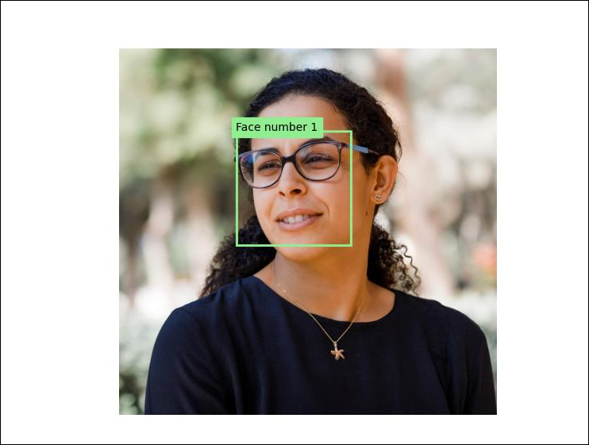 

1. Run the program again, this time specifying the parameter **images/face2.jpg** to extract text from the following image:

      

    ```
   python analyze-faces.py images/face2.jpg
    ```

     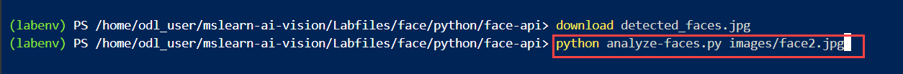 

1. Observe the output, which should include the ID and attributes of each face detected. 

    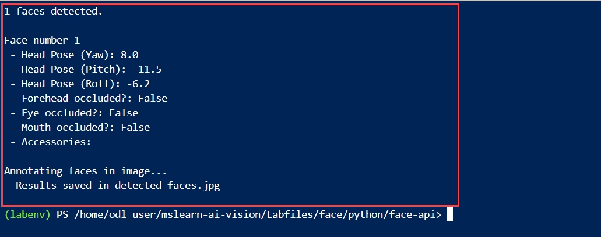 

1. Download and view the resulting **detected_faces.jpg** file:

    ```
   download detected_faces.jpg
    ```

    The resulting image should look like this:

    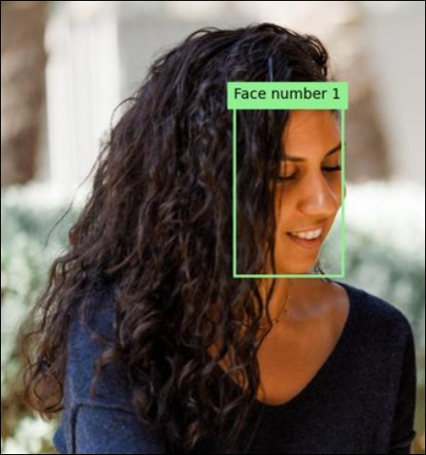 

1. Run the program one more time, this time specifying the parameter `images/faces.jpg` to extract text from this image:

    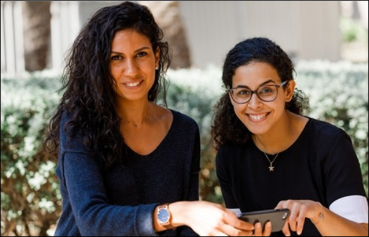 

    ```
   python analyze-faces.py images/faces.jpg
    ```

     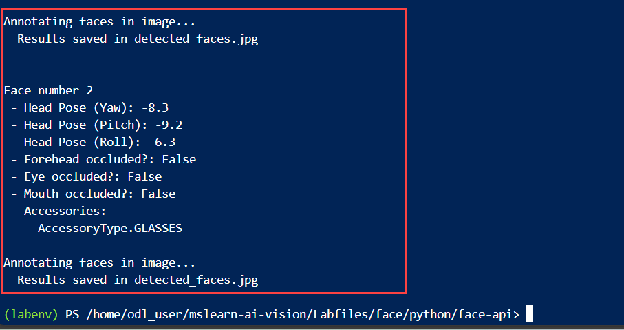     

1. Download and view the resulting **detected_faces.jpg** file:

    ```
   download detected_faces.jpg
    ```

    The resulting image should look like this:

    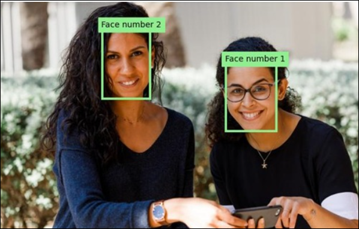  
 

## Summary

In this lab, you built a face detection and analysis solution with Azure AI Face. You provisioned a Face resource, captured its Endpoint and Key, and configured the Face SDK in Azure Cloud Shell. You implemented code to authenticate a FaceClient, detect faces in sample images, and retrieve attributes such as head pose, occlusions, and accessories. You generated annotated images with bounding boxes and reviewed outputs in the console and downloaded files for validation.

### You have successfully completed the Hands-on Lab!
