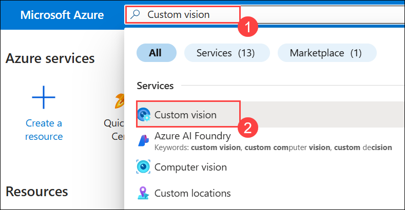
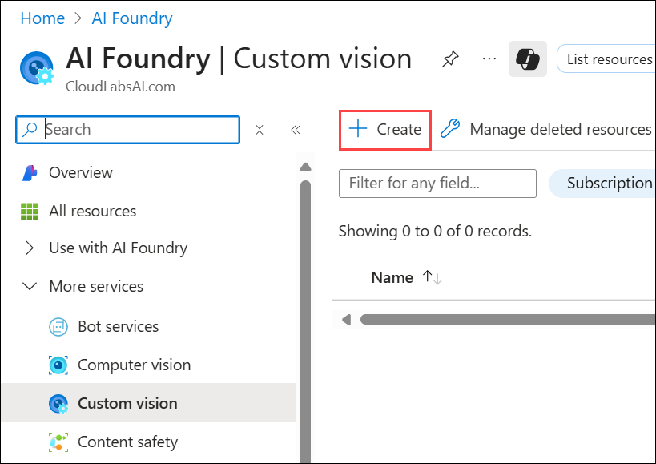
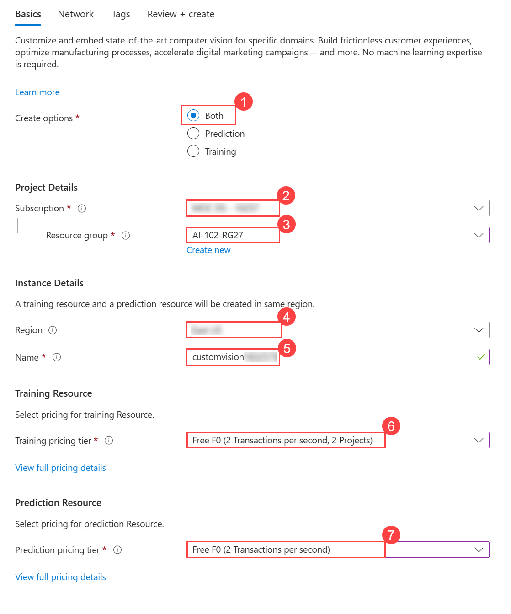
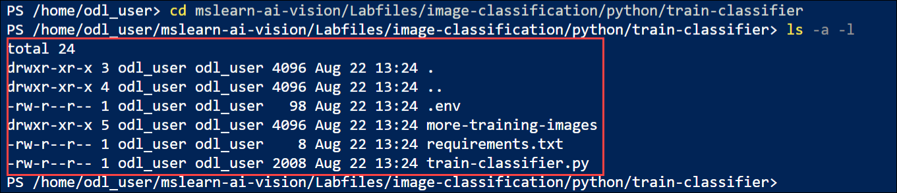

# Lab 27: Classify images

### Estimated Duration : 45 Minutes

## Overview

The **Azure AI Custom Vision** service enables you to create computer vision models that are trained on your own images. You can use it to train *image classification* and *object detection* models; which you can then publish and consume from applications.

In this exercise, you will use the Custom Vision service to train an image classification model that can identify three classes of fruit (apple, banana, and orange).

While this exercise is based on the Azure Custom Vision Python SDK, you can develop vision applications using multiple language-specific SDKs; including:

* [Azure Custom Vision for JavaScript (training)](https://www.npmjs.com/package/@azure/cognitiveservices-customvision-training)
* [Azure Custom Vision for JavaScript (prediction)](https://www.npmjs.com/package/@azure/cognitiveservices-customvision-prediction)
* [Azure Custom Vision for Microsoft .NET (training)](https://www.nuget.org/packages/Microsoft.Azure.CognitiveServices.Vision.CustomVision.Training/)
* [Azure Custom Vision for Microsoft .NET (prediction)](https://www.nuget.org/packages/Microsoft.Azure.CognitiveServices.Vision.CustomVision.Prediction/)
* [Azure Custom Vision for Java (training)](https://search.maven.org/artifact/com.azure/azure-cognitiveservices-customvision-training/1.1.0-preview.2/jar)
* [Azure Custom Vision for Java (prediction)](https://search.maven.org/artifact/com.azure/azure-cognitiveservices-customvision-prediction/1.1.0-preview.2/jar)

This exercise takes approximately **45** minutes.

## Lab Objectives 

- **Task 1:** Create Custom Vision resources

- **Task 2:** Create a Custom Vision project in the Custom Vision portal

- **Task 3:** Add code to read text from an image

- **Task 4:** Add code to return the position of individual words

- **Task 5:** Test the model

- **Task 6:** View the project settings

- **Task 7:** Use the training API

- **Task 8:** Write code to perform model training

- **Task 9:** Use the image classifier in a client application

- **Task 10:** Use the image classifier from a client application

## Task 1: Create Custom Vision resources

Before you can train a model, you will need Azure resources for *training* and *prediction*. You can create **Custom Vision** resources for each of these tasks, or you can create a single resource and use it for both. In this exercise, you'll create **Custom Vision** resources for training and prediction.

1. Open the Azure portal at `https://portal.azure.com`, and sign in using the Microsoft account.

1. If prompted, provide the credentials below:

    - **Email/Username:** <inject key="AzureAdUserEmail"></inject>

        

    - **Password:** <inject key="AzureAdUserPassword"></inject>

        

1. When the **Stay signed in?** window appears, select **No**.

    

    >**Note:** If the **Welcome to Microsoft Azure** window appears, select **Cancel**.

    

1. In the Azure Portal, using the search bar, search for **`Custom vision` (1)**, select **Custom vision (2)** from the result.

    

1. On **AI Foundry | Custom vision** blade, click on **+ Create**.

    

1. Provision the resource using the following settings and the click on **Review + create**:

    - Create options: **Both (1)**
    - Subscription: **Choose Default Subscription (2)**
    - Resource group: **AI-102-RG27 (3)**
    - Region: **<inject key="Region" enableCopy="false" /> (4)**
    - Name: **customvision<inject key="DeploymentID" enableCopy="false"/> (5)**
    - Training pricing tier: **F0 (6)**
    - Prediction pricing tier: **F0 (7)**

        

1. On the **Review + create** tab, click **Create** to provision the resource.

    

1. Create the resource and wait for deployment to complete, and then view the deployment details. Note that two Custom Vision resources are provisioned; one for training, and another for prediction.

    > **Note**: Each resource has its own *endpoint* and *keys*, which are used to manage access from your code. To train an image classification model, your code must use the *training* resource (with its endpoint and key); and to use the trained model to predict image classes, your code must use the *prediction* resource (with its endpoint and key).

1. When the resources have been deployed, **Go to resource group** to view them.

    

1. You should see two custom vision resources, one with the suffix ***-Prediction***.

    

## Task 2: Create a Custom Vision project in the Custom Vision portal

To train an image classification model, you need to create a Custom Vision project based on your training resource. To do this, you'll use the Custom Vision portal.

1. Open a new browser tab (keeping the Azure portal tab open - you'll return to it later).

1. In the new browser tab, open the [Custom Vision portal](https://customvision.ai) at `https://customvision.ai`and click on **Sign in**.

    

1. If prompted, sign in using your Azure credentials and agree to the terms of service.

    - **Email/Username:** <inject key="AzureAdUserEmail"></inject>

    - **Password:** <inject key="AzureAdUserPassword"></inject>

1. In the Terms of Service dialog, **select (1)** the agreement box and then click **I agree (2)**.

    

1. Under the **Project** section, click on **+ NEW PROJECT**, to create a project.

    

1. In the Custom Vision portal, create a new project with the following settings:
    
    - Name: **`Classify Fruit` (1)**
    - Description: **`Image classification for fruit` (2)**
    - Resource: **Your Custom Vision resource (3)**
    - Project Types: **Classification (4)**
    - Classification Types: **Multiclass (Single tag per image) (5)**
    - Domains: **Food (6)**
    - Click **Create Project (7)**

        

## Task 3: Upload and tag images

1. In a new browser tab, download the [training images](https://github.com/MicrosoftLearning/mslearn-ai-vision/raw/main/Labfiles/image-classification/training-images.zip) from `https://github.com/MicrosoftLearning/mslearn-ai-vision/raw/main/Labfiles/image-classification/training-images.zip` 

1. Click on the **Folder** icon to open the **File Explorer**.

    

1. Right-click on the **training-images (1)** and select **Extract All... (2)**.

    

1. In the **Select a Destination and Extract Files** window, set the destination folder to **`C:\LabFiles` (1)** and then click **Extract (2)**.

    

1. In the Custom Vision portal, in your image classification project, click **Add images**.

    

1. In the **Open** window, navigate to **`C:\LabFiles\training-images\apple` (1)**, press **Ctrl+A (2)** to select all files, and then click **Open (3)**.

    

1. Then upload the image files, specifying the tag **`apple` (1)**, and click **Upload 15 files (2)**.

    

1. In the **Image upload** dialogue, click **Done**.

    

1. Use the **Add Images** (**[+]**) toolbar icon to repeat the previous step to upload the images in the **banana** folder with the tag **`banana`**, and the images in the **orange** folder with the tag **`orange`**.

    

1. Explore the images you have uploaded in the Custom Vision project - there should be 15 images of each class, like this:

    

## Task 4: Train a model

1. In the Custom Vision project, above the images, click **Train** (&#9881;<sub>&#9881;</sub>) to train a classification model using the tagged images. Select the **Quick Training** option, and then wait for the training iteration to complete (this may take a minute or so).

    

    

1. When the model iteration has been trained, review the **Precision**, **Recall**, and **AP** performance metrics - these measure the prediction accuracy of the classification model, and should all be high.

    

> **Note**: The performance metrics are based on a probability threshold of 50% for each prediction (in other words, if the model calculates a 50% or higher probability that an image is of a particular class, then that class is predicted). You can adjust this at the top-left of the page.

## Task 5: Test the model

1. Above the performance metrics, click **Quick Test**.

    

1. In the **Image URL** box, type **`https://aka.ms/test-apple`** and click the **Quick test image** (&#10132;) button.

    

1. View the predictions returned by your model - the probability score for **apple** should be the highest, like this:

    

1. Try testing the following images:
    - **`https://aka.ms/test-banana`**

        

    - **`https://aka.ms/test-orange`**

        

1. Close the **Quick Test** window.

## Task 6: View the project settings

The project you have created has been assigned a unique identifier, which you will need to specify in any code that interacts with it.

1. Click the **settings** (&#9881;) icon at the top right of the **Performance** page to view the project settings.

    

1. Under **General** (on the left), note the **Project Id** that uniquely identifies this project.

    

1. On the right, under **Resources** note that the **Key (1)** and **Endpoint (2)** are shown. These are the details for the *training* resource (you can also obtain this information by viewing the resource in the Azure portal).

    

## Task 7: Use the training API

The Custom Vision portal provides a convenient user interface that you can use to upload and tag images, and train models. However, in some scenarios you may want to automate model training by using the Custom Vision training API.

1. Return to the browser tab containing the Azure portal (keeping the Custom Vision portal tab open - you'll return to it later).

1. On the **Azure portal** homepage, click the **\[>\_] Cloud Shell (1)** button located to the right of the **Copilot** tab at the top. This opens a new Cloud Shell session. In the **Welcome to Azure Cloud Shell** window, choose **PowerShell (2)**.

    

    >**Note:** The cloud shell provides a command-line interface in a pane at the bottom of the Azure portal. You can resize or maximize this pane to make it easier to work in.

    > **Note:** If you have previously created a cloud shell that uses a **Bash** environment, switch it to **PowerShell**.

1. In the **Getting started** window, ensure **No storage account required (1)** is selected. From the **Subscription** drop-down, choose **Default subscription (2)**, then click **Apply (3)**.

    

1. In the Cloud Shell toolbar, open the **Settings (1)** menu and choose **Go to Classic version (2)** from the drop-down.

    

    >**Note:** Ensure you've switched to the classic version of the cloud shell before continuing.

1. In the cloud shell pane, enter the following commands to clone the GitHub repo containing the code files for this exercise (type the command, or copy it to the clipboard and then right-click in the command line and paste as plain text):

    ```
    rm -r mslearn-ai-vision -f
    git clone https://github.com/MicrosoftLearning/mslearn-ai-vision
    ```

    

    > **Tip**: As you paste commands into the cloudshell, the ouput may take up a large amount of the screen buffer. You can clear the screen by entering the `cls` command to make it easier to focus on each task.

1. After the repo has been cloned, use the following command to navigate to the application code files:

    ```
    cd mslearn-ai-vision/Labfiles/image-classification/python/train-classifier
    ls -a -l
    ```

    

1. The folder contains application configuration and code files for your app. It also contains an **/more-training-images** subfolder, which contains some image files you'll use to perform additional training of your model.

    

1. Install the Azure AI Custom Vision SDK package for training and any other required packages by running the following commands:

    ```
    python -m venv labenv
    ./labenv/bin/Activate.ps1
    pip install -r requirements.txt azure-cognitiveservices-vision-customvision
    ```

1. Enter the following command to edit the configuration file for your app. The file is opened in a code editor.

    ```
    code .env
    ```

    

1. In the code file, update the configuration values it contains to reflect the  and an authentication  for your Custom Vision **training** resource, and the  for the custom vision project you created previously.

    - YOUR_TRAINING_ENDPOINT: **Endpoint (1)**
    - YOUR_TRAINING_KEY: **Key (2)**
    - YOUR_PROJECT_ID: **Project ID (3)**

        

1. After you've replaced the placeholders, within the code editor, use the **CTRL+S** command to save your changes and then use the **CTRL+Q** command to close the code editor while keeping the cloud shell command line open.

## Task 8: Write code to perform model training

1. In the cloud shell command line, enter the following command to open the code file for the client application:

    ```
    code train-classifier.py
    ```

    

1. Note the following details in the code file:
    - The namespaces for the Azure AI Custom Vision SDK are imported.
    - The **Main** function retrieves the configuration settings, and uses the key and endpoint to create an authenticated.
    - **CustomVisionTrainingClient**, which is then used with the project ID to create a **Project** reference to your project.
    - The **Upload_Images** function retrieves the tags that are defined in the Custom Vision project and then uploads image files from correspondingly named folders to the project, assigning the appropriate tag ID.
    - The **Train_Model** function creates a new training iteration for the project and waits for training to complete.

1. Close the code editor (*CTRL+Q*) and enter the following command to run the program:

    ```
    python train-classifier.py
    ```

    

1. Wait for the program to end. Then return to the browser tab containing the Custom Vision portal, and view the **Training Images** page for your project (refreshing the browser if necessary).

    

1. Verify that some new tagged images have been added to the project. Then view the **Performance** page and verify that a new iteration has been created.

    

## Task 9:  Use the image classifier in a client application

Now you're ready to publish your trained model and use it in a client application.

1. In the Custom Vision portal, on the **Performance** page,  click **&#128504; Publish (1)** to publish the trained model with the following settings:

    - Model name: **`fruit-classifier` (2)**
    - Prediction Resource: **customvision<inject key="Region" enableCopy="false" />-Prediction (3)**
    - Click **Publish (4)**

        

1. At the top left of the **Project Settings** page, click the **Projects Gallery** (&#128065;) icon to return to the Custom Vision portal home page, where your project is now listed.

    

1. On the Custom Vision portal home page, at the top right, click the *settings* (&#9881;) icon to view the settings for your Custom Vision service.

    

1. Then, under **Resources**, find your *prediction* resource which ends with **customvision<inject key="Region" enableCopy="false" />-Prediction (1)** (<u>not</u> the training resource) to determine its **Key (2)** and **Endpoint (3)** values (you can also obtain this information by viewing the resource in the Azure portal).

    

## Task 10: Use the image classifier from a client application

1. Return to the browser tab containing the Azure portal and the cloud shell pane.
1. In cloud shell, run the following commands to switch to the folder for your client application and view the files it contains:

    ```
    cd ../test-classifier
    ls -a -l
    ```

    

1. The folder contains application configuration and code files for your app. It also contains a **/test-images** subfolder, which contains some image files you'll use to test your model.

    

1. Install the Azure AI Custom Vision SDK package for prediction and any other required packages by running the following commands:

    ```
    python -m venv labenv
    ./labenv/bin/Activate.ps1
    pip install -r requirements.txt azure-cognitiveservices-vision-customvision
    ```

1. Enter the following command to edit the configuration file for your app. The file is opened in a code editor.

    ```
    code .env
    ```

    

1. Update the configuration values to reflect the  and  for your Custom Vision *<u>prediction</u>* resource, the  for the classification project, and the name of your published model (which should be *fruit-classifier*). 

    - YOUR_PREDICTION_ENDPOINT: **Endpoint (1)**
    - YOUR_PREDICTION_KEY: **Key (2)**
    - YOUR_PROJECT_ID: **Project ID (3)**

        

1.Save your changes (*CTRL+S*) and close the code editor (*CTRL+Q*).

1. In the cloud shell command line, enter the following command to open the code file for the client application:

    ```
    code test-classifier.py
    ```

    

1. Review the code, noting the following details:
    - The namespaces for the Azure AI Custom Vision SDK are imported.
    - The **Main** function retrieves the configuration settings, and uses the key and endpoint to create an authenticated **CustomVisionPredictionClient**.
    - The prediction client object is used to predict a class for each image in the **test-images** folder, specifying the project ID and model name for each request. Each prediction includes a probability for each possible class, and only predicted tags with a probability greater than 50% are displayed.

1. Close the code editor and enter the following command to run the program:

    ```
    python test-classifier.py
    ```

    The program submits each of the following images to the model for classification:

    

    **IMG_TEST_1.jpg**

    <br/><br/>

    

    **IMG_TEST_2.jpg**

    <br/><br/>

    

    **IMG_TEST_3.jpg**

1. View the label (tag) and probability scores for each prediction.

    


## Summary

