# Lab 28: Classify images

### Estimated Duration: 45 Minutes

## Overview

In this hands-on lab, you will learn how to build an image classification solution using Azure AI Custom Vision. You’ll start by creating training and prediction resources in Azure and setting up a Custom Vision project in the portal. Then, you’ll upload images of apples, bananas, and oranges, tag them appropriately, and train a classification model. Next, you’ll test the model with sample images, review its performance metrics, and use the training API in Azure Cloud Shell to automate retraining with additional data. Finally, you’ll publish the trained model, configure a Python client application with your prediction resource, and run the app to classify new images.

## Lab Objectives 

- **Task 1:** Create Custom Vision resources

- **Task 2:** Create a Custom Vision project in the Custom Vision portal

- **Task 3:** Add code to read text from an image

- **Task 4:** Add code to return the position of individual words

- **Task 5:** Test the model

- **Task 6:** View the project settings

- **Task 7:** Use the training API

- **Task 8:** Write code to perform model training

- **Task 9:** Use the image classifier in a client application

- **Task 10:** Use the image classifier from a client application

## Task 1: Create Custom Vision resources

In this task, you’ll create the required Custom Vision resources in Azure to support both training and prediction. You’ll provision two separate resources, one for training and one for prediction, so that you can build and later use your image classification model.

1. Open the Azure portal at `https://portal.azure.com`, and sign in using the Microsoft account.

1. If prompted, provide the credentials below:

    - **Email/Username:** <inject key="AzureAdUserEmail"></inject>

        

    - **Password:** <inject key="AzureAdUserPassword"></inject>

        

1. When the **Stay signed in?** window appears, select **No**.

    

1. In the Azure Portal, using the search bar, search for **`Custom vision` (1)**, select **Custom vision (2)** from the result.

    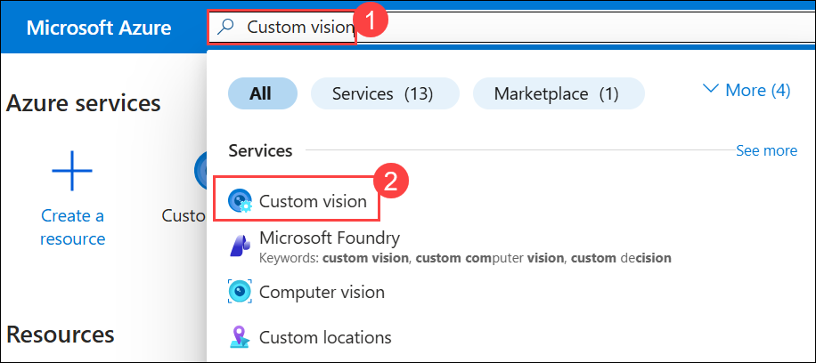

1. On **Microsoft Foundry | Custom vision** blade, click on **+ Create**.

    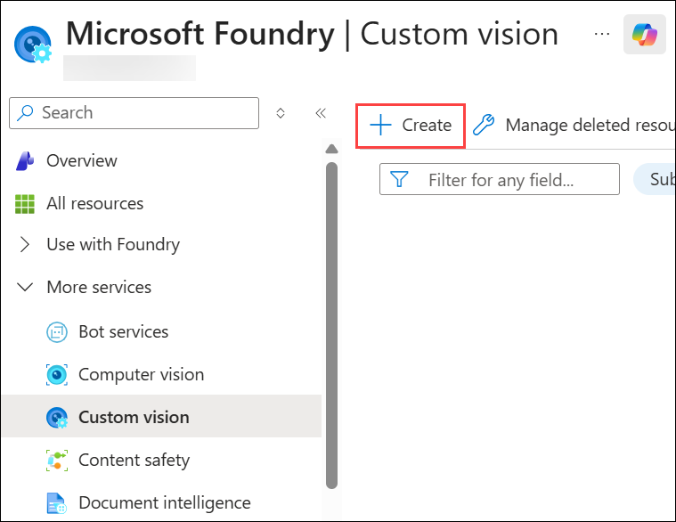

1. Provision the resource using the following settings and then click on **Review + create (8)**:

    - Create options: **Both (1)**
    - Subscription: **Choose Default Subscription (2)**
    - Resource group: **AI-102-RG27 (3)**
    - Region: **<inject key="Region" enableCopy="false" /> (4)**
    - Name: **customvision<inject key="DeploymentID" enableCopy="false"/> (5)**
    - Training pricing tier: **F0 (6)**
    - Prediction pricing tier: **F0 (7)**

        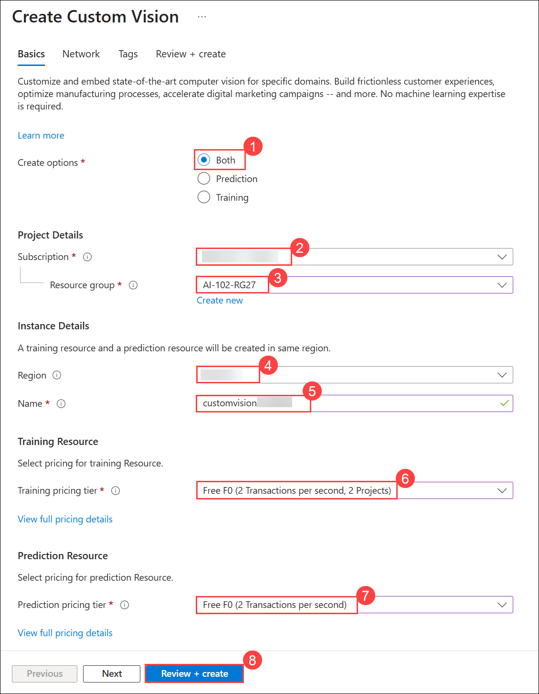

1. On the **Review + create** tab, click **Create** to provision the resource.

    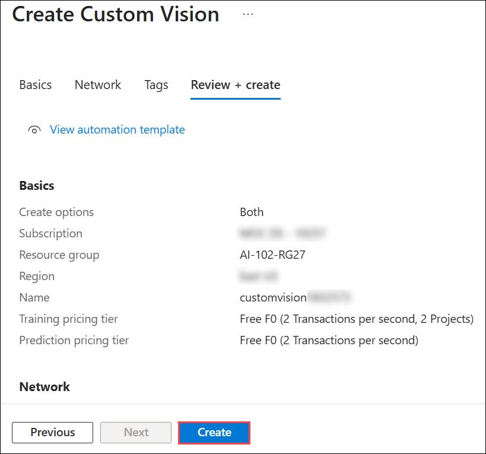

1. Create the resource and wait for deployment to complete, and then view the deployment details. Note that two Custom Vision resources are provisioned; one for training, and another for prediction.

    > **Note**: Each resource has its own *endpoint* and *keys*, which are used to manage access from your code. To train an image classification model, your code must use the *training* resource (with its endpoint and key); and to use the trained model to predict image classes, your code must use the *prediction* resource (with its endpoint and key).

1. When the resources have been deployed, click on **Go to resource group** to view them.

    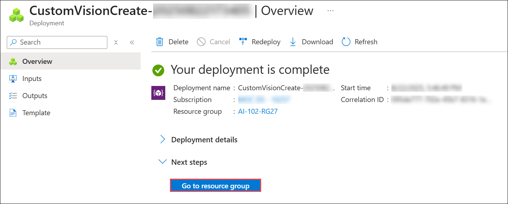

1. You should see two custom vision resources, one with the suffix **-Prediction**.

    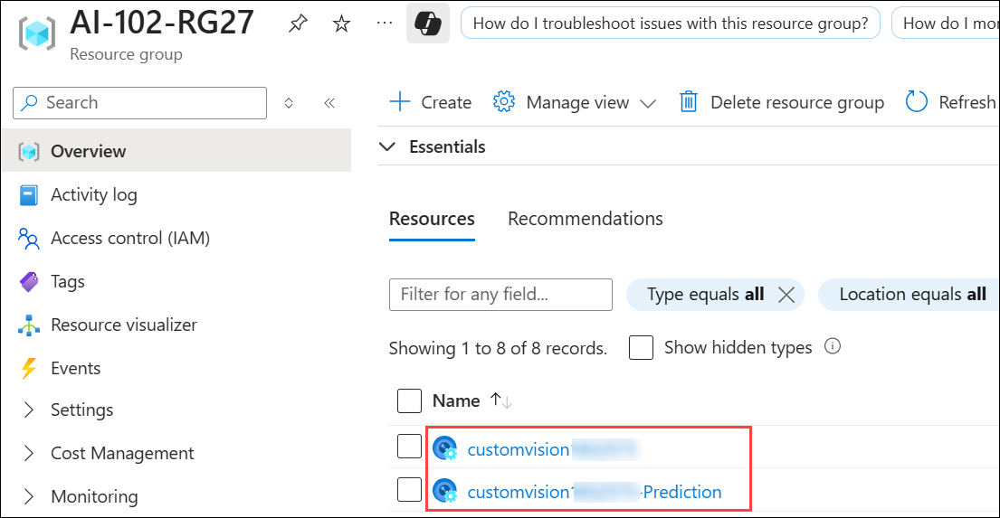


> **Congratulations** on completing the task! Now, it's time to validate it. Here are the steps:
>
> - Hit the Validate button for the corresponding task. If you receive a success message, you can proceed to the next task.
> - If not, carefully read the error message and retry the step, following the instructions in the lab guide.
> - If you need any assistance, please contact us at cloudlabs-support@spektrasystems.com. We are available 24/7 to help.
 
<validation step="4d0bd307-cf2d-45b5-b54f-88114e03af00" />

## Task 2: Create a Custom Vision project in the Custom Vision portal

In this task, you’ll create a Custom Vision project in the Custom Vision portal using your training resource. This project will serve as the foundation for building and training your image classification model.

1. Open a new browser tab (keeping the Azure portal tab open - you'll return to it later).

1. In the new browser tab, open the [Custom Vision portal](https://customvision.ai) at `https://customvision.ai`and click on **Sign in**.

    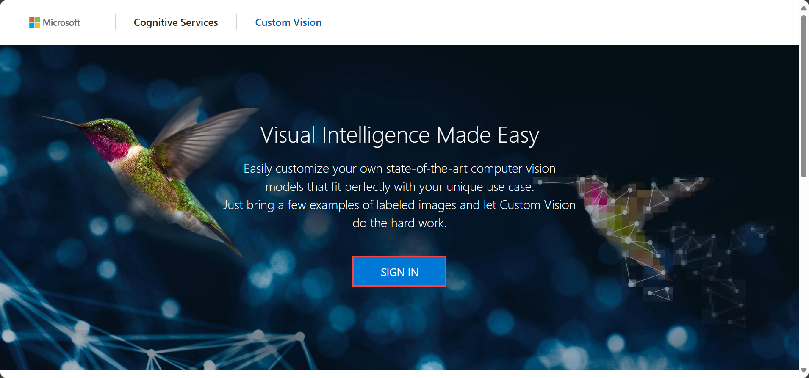

1. If prompted, sign in using your Azure credentials.

    - **Email/Username:** <inject key="AzureAdUserEmail"></inject>

    - **Password:** <inject key="AzureAdUserPassword"></inject>

1. In the Terms of Service dialog, **check (1)** the agreement box and then click **I agree (2)**.

    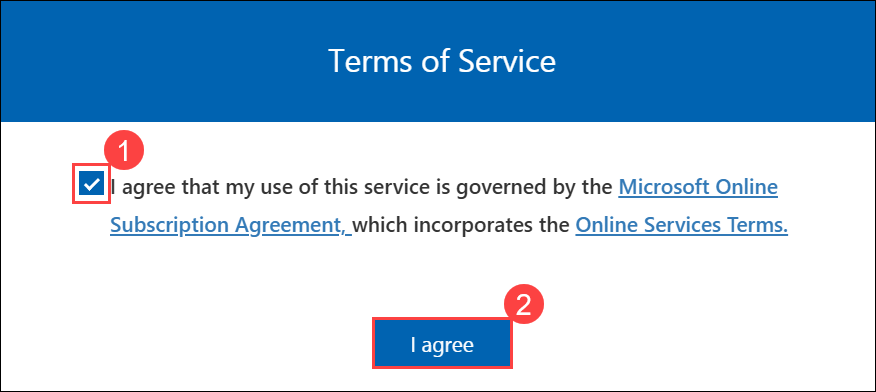

1. Under the **Projects** section, click on **+ NEW PROJECT**, to create a project.

    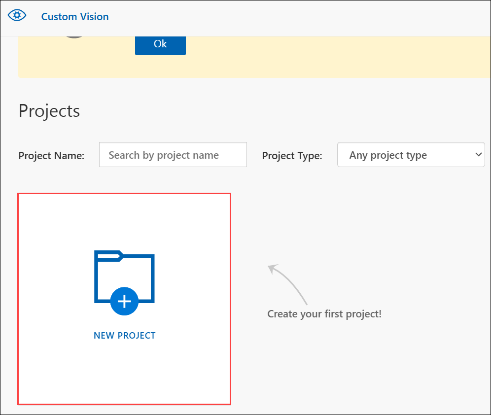

1. In the Custom Vision portal, create a new project with the following settings:
    
    - Name: **`Classify Fruit` (1)**
    - Description: **`Image classification for fruit` (2)**
    - Resource: **customvision<inject key="DeploymentID" enableCopy="false"/> (3)**
    - Project Types: **Classification (4)**
    - Classification Types: **Multiclass (Single tag per image) (5)**
    - Domains: **Food (6)**
    - Click **Create Project (7)**

        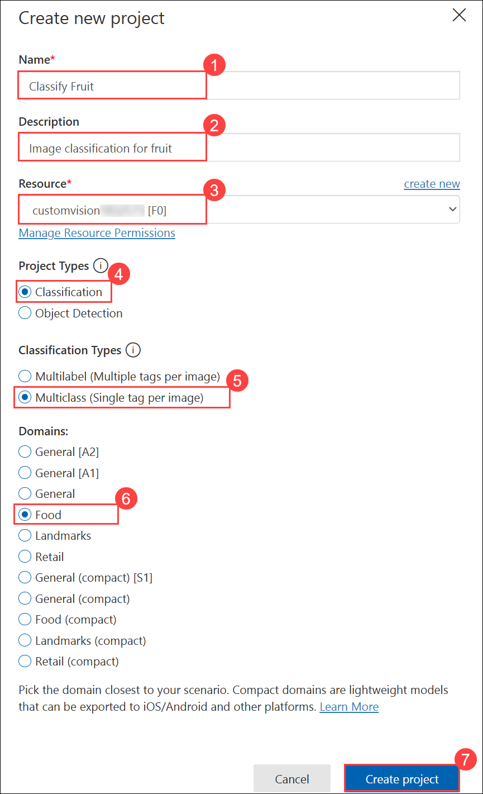


> **Congratulations** on completing the task! Now, it's time to validate it. Here are the steps:
>
> - Hit the Validate button for the corresponding task. If you receive a success message, you can proceed to the next task.
> - If not, carefully read the error message and retry the step, following the instructions in the lab guide.
> - If you need any assistance, please contact us at cloudlabs-support@spektrasystems.com. We are available 24/7 to help.
 
<validation step="fb368b52-d1e7-4436-8c85-1914140be38c" />


## Task 3: Upload and tag images

In this task, you’ll upload training images of apples, bananas, and oranges into your Custom Vision project and tag them appropriately so that the model can learn to classify each fruit.

1. In a new browser tab, download the [training images](https://github.com/MicrosoftLearning/mslearn-ai-vision/raw/main/Labfiles/image-classification/training-images.zip) from `https://github.com/MicrosoftLearning/mslearn-ai-vision/raw/main/Labfiles/image-classification/training-images.zip` 

1. Click on the **Folder** icon to open the **File Explorer**.

    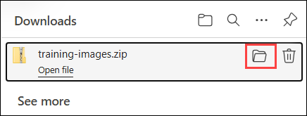

1. Right-click on the **training-images (1)** and select **Extract All... (2)**.

    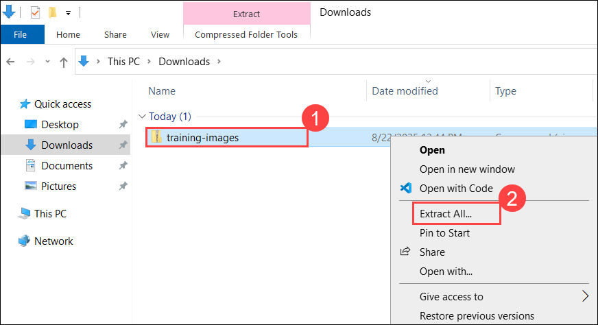

1. In the **Select a Destination and Extract Files** window, set the destination folder to **`C:\LabFiles` (1)** and then click **Extract (2)**.

    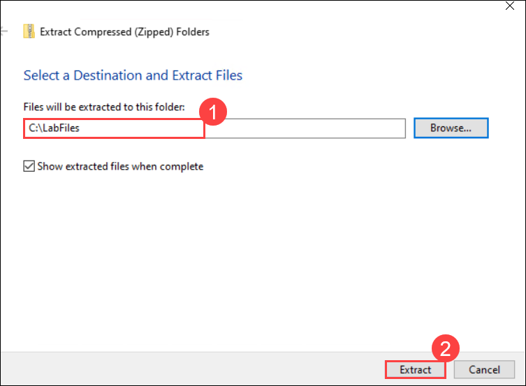

1. In the Custom Vision portal, in your image classification project, click **Add images**.

    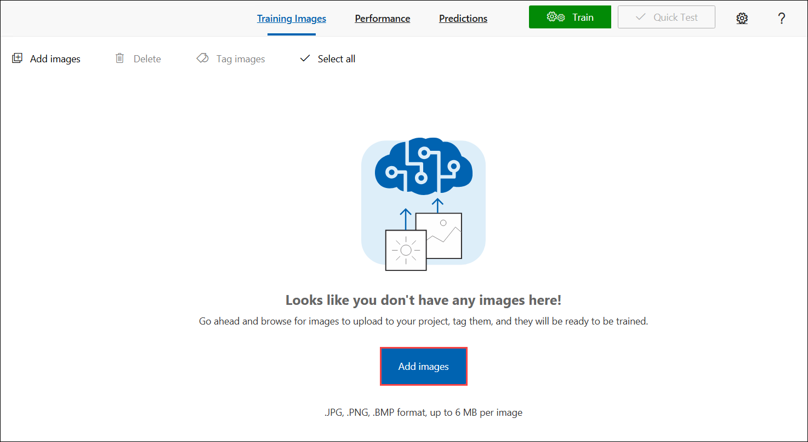

1. In the **Open** window, navigate to **`C:\LabFiles\training-images\apple` (1)**, press **Ctrl+A (2)** to select all files, and then click **Open (3)**.

    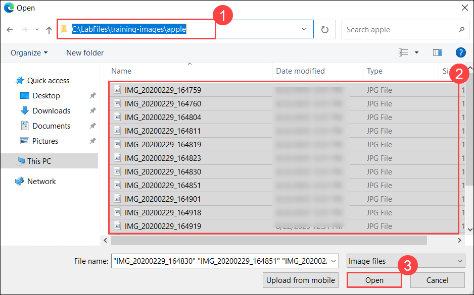

1. Then upload the image files, specifying the tag **`apple` (1)**, and click **Upload 15 files (2)**.

    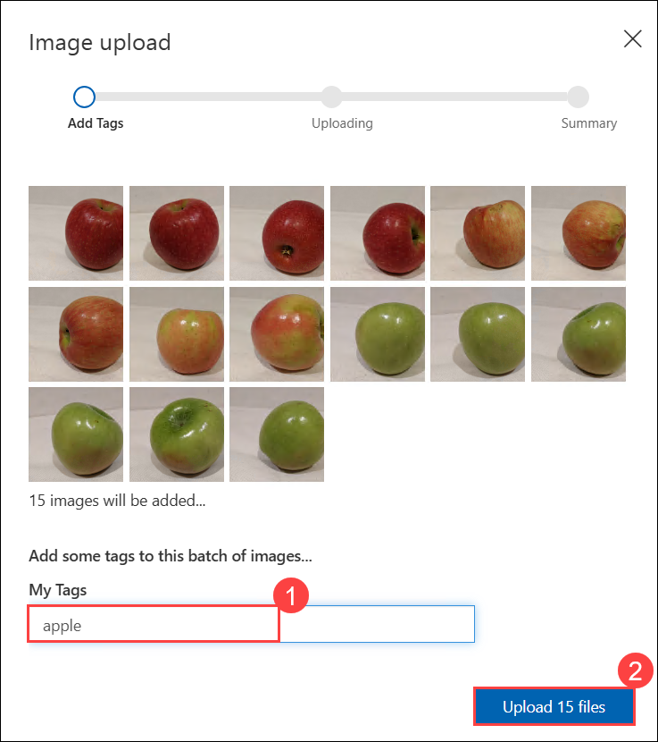

1. In the **Image upload** dialogue, click **Done**.

    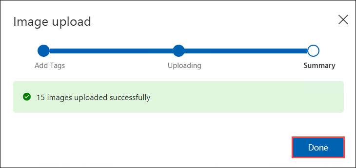

1. Use the **Add Images** (**[+]**) toolbar icon to repeat the previous step to upload the images in the **banana** folder with the tag **`banana`**, and the images in the **orange** folder with the tag **`orange`**.

    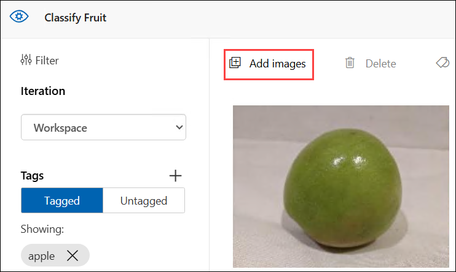

    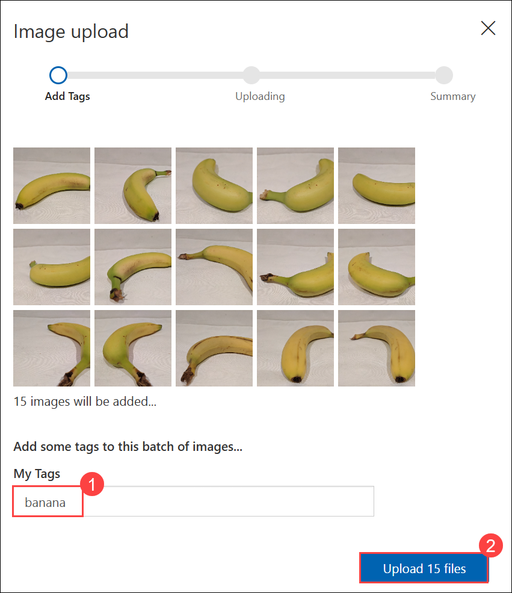

1. Explore the images you have uploaded in the Custom Vision project - there should be 15 images of each class, like this:

    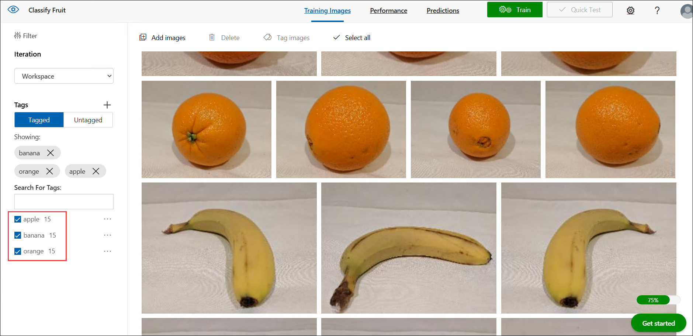

## Task 4: Train a model

In this task, you’ll train a classification model using your tagged images, then review performance metrics like Precision, Recall, and Average Precision (AP) to understand how accurately the model can classify fruit images.

1. In the Custom Vision project, above the images, click **Train** (&#9881;<sub>&#9881;</sub>) to train a classification model using the tagged images.

    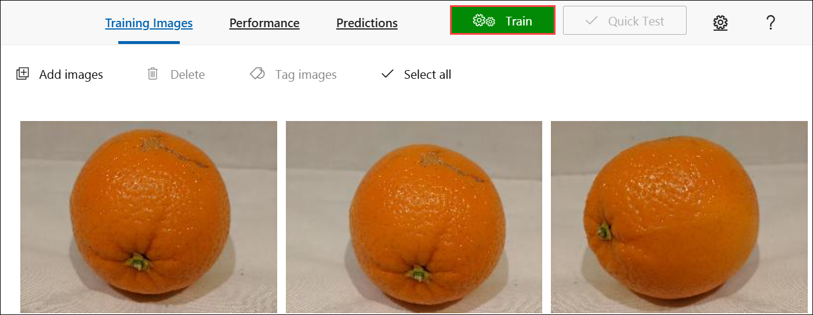

1. Select the **Quick Training (1)** option, and click **Train (2)**. Then wait for the training iteration to complete (this may take a  2-5 minutes or so).

    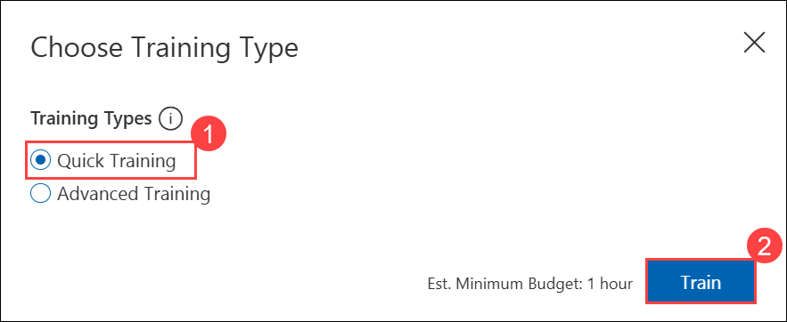

1. When the model iteration has been trained, review the **Precision**, **Recall**, and **AP** performance metrics - these measure the prediction accuracy of the classification model, and should all be high.

    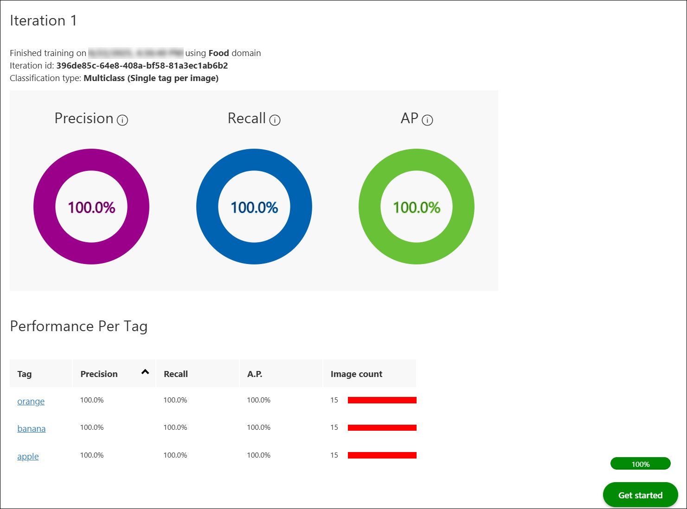

    > **Note**: The performance metrics are based on a probability threshold of 50% for each prediction (in other words, if the model calculates a 50% or higher probability that an image is of a particular class, then that class is predicted). You can adjust this at the top-left of the page.

## Task 5: Test the model

In this task, you’ll test your trained model by submitting sample images through the Quick Test feature. You’ll use the Prediction resource endpoint and key to send images and review the probability scores returned, validating how well the model identifies apples, bananas, and oranges.

1. Above the performance metrics, click **Quick Test**.

    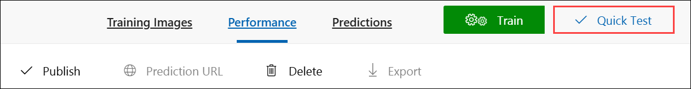

1. In the **Image URL** box, type **`https://aka.ms/test-apple` (1)** and click the **Quick test image (2)** (&#10132;) button.

    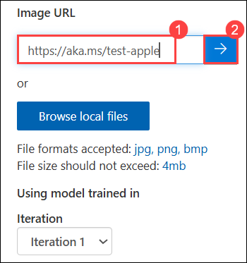

1. View the predictions returned by your model - the probability score for **apple** should be the highest, like this:

    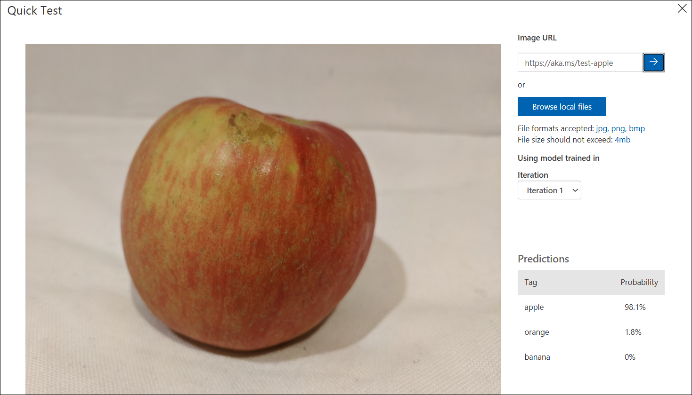

1. Try testing the following images:
    - **`https://aka.ms/test-banana`**

        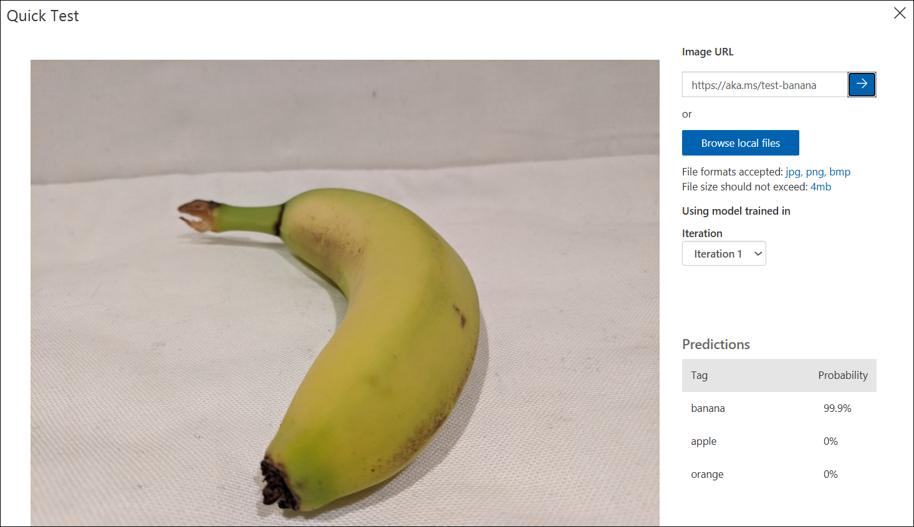

    - **`https://aka.ms/test-orange`**

        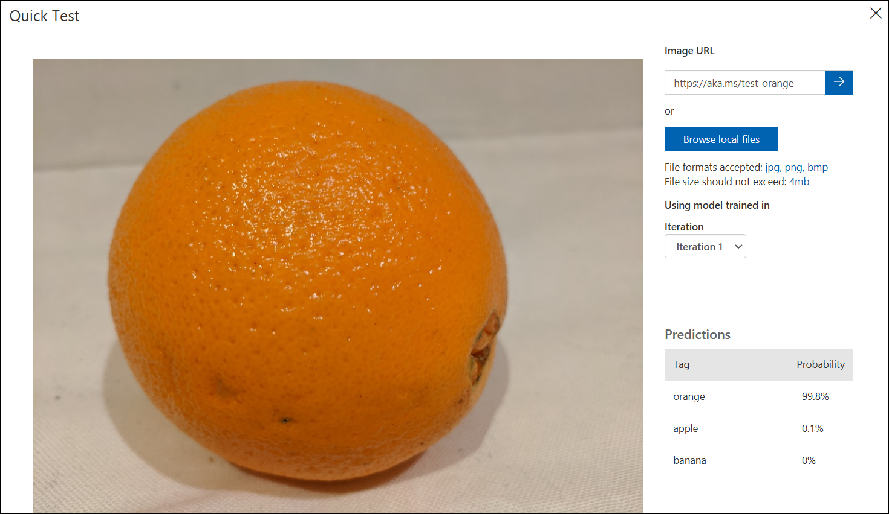

1. Close the **Quick Test** window.

## Task 6: View the project settings

In this task, you’ll review your project’s settings to identify key details required for integration. You’ll locate the unique Project ID along with the training resource Key and Endpoint, which are necessary when connecting applications or code to your Custom Vision project.

1. Click the **settings** (&#9881;) icon at the top right of the **Performance** page to view the project settings.

    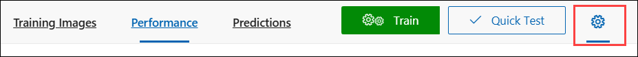

1. Under **General** (on the left), note the **Project Id** that uniquely identifies this project.

    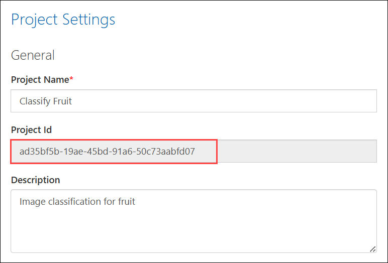

1. On the right, under **Resources** note that the **Key (1)** and **Endpoint (2)** are shown. These are the details for the *training* resource (you can also obtain this information by viewing the resource in the Azure portal).

    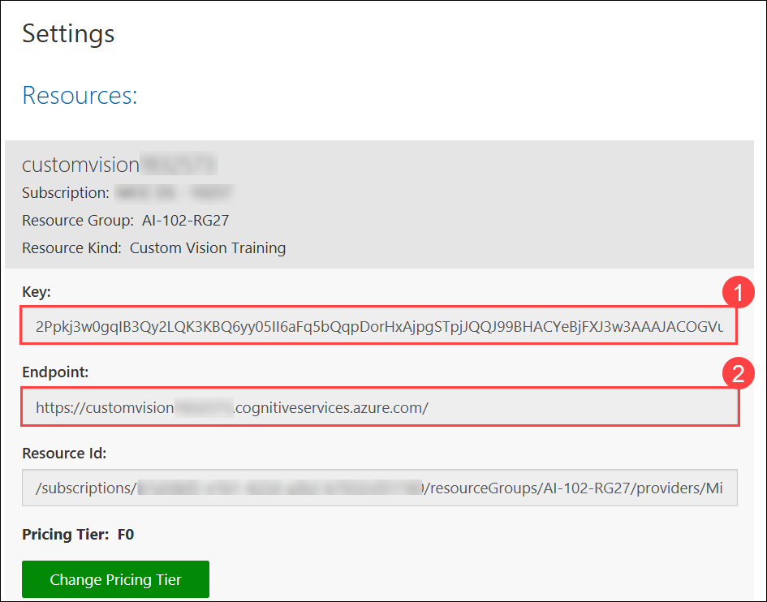

## Task 7: Use the training API

In this task, you’ll use the Custom Vision training API to automate model training. This involves setting up your environment in Cloud Shell, installing the required SDKs, configuring authentication, and running code that connects to your project. By doing this, you’ll learn how to programmatically retrain your model with new images, making the process more efficient and repeatable.

1. Return to the browser tab containing the Azure portal (keeping the Custom Vision portal tab open - you'll return to it later).

1. On the **Azure portal** homepage, click the **\[>\_] Cloud Shell (1)** button located to the right of the **Copilot** tab at the top. This opens a new Cloud Shell session. In the **Welcome to Azure Cloud Shell** window, choose **PowerShell (2)**.

    

    >**Note:** The cloud shell provides a command-line interface in a pane at the bottom of the Azure portal. You can resize or maximize this pane to make it easier to work in.

    > **Note:** If you have previously created a cloud shell that uses a **Bash** environment, switch it to **PowerShell**.

1. In the **Getting started** window, ensure **No storage account required (1)** is selected. From the **Subscription** drop-down, choose **Default subscription (2)**, then click **Apply (3)**.

    

1. In the Cloud Shell toolbar, open the **Settings (1)** menu and choose **Go to Classic version (2)** from the drop-down.

    

    >**Note:** Ensure you've switched to the classic version of the cloud shell before continuing.

1. In the cloud shell pane, enter the following commands to clone the GitHub repo containing the code files for this exercise (type the command, or copy it to the clipboard and then right-click in the command line and paste as plain text):

    ```
    rm -r mslearn-ai-vision -f
    git clone https://github.com/MicrosoftLearning/mslearn-ai-vision
    ```

    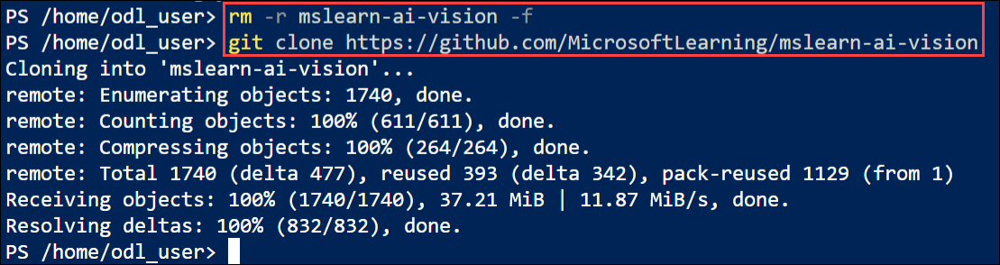

    > **Tip**: As you paste commands into the cloudshell, the ouput may take up a large amount of the screen buffer. You can clear the screen by entering the `cls` command to make it easier to focus on each task.

1. After the repo has been cloned, use the following command to navigate to the application code files:

    ```
    cd mslearn-ai-vision/Labfiles/image-classification/python/train-classifier
    ls -a -l
    ```

    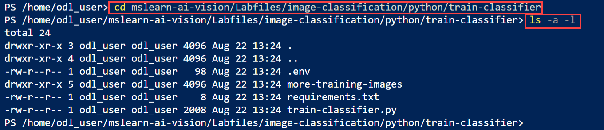

1. The folder contains application configuration and code files for your app. It also contains an **/more-training-images** subfolder, which contains some image files you'll use to perform additional training of your model.

1. Install the Azure AI Custom Vision SDK package for training and any other required packages by running the following commands:

    ```
    python -m venv labenv
    ./labenv/bin/Activate.ps1
    pip install -r requirements.txt azure-cognitiveservices-vision-customvision
    ```

1. Enter the following command to edit the configuration file for your app. The file is opened in a code editor.

    ```
    code .env
    ```

    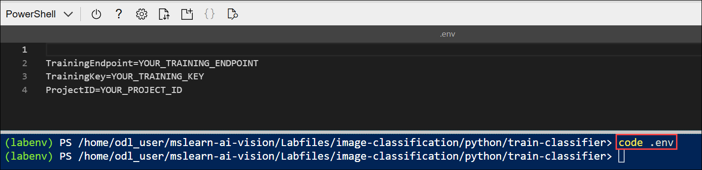

1. In the code file, update the configuration values it contains to reflect the Endpoint and an authentication Key for your Custom Vision **training** resource, and the Project ID for the custom vision project you created previously.

    - YOUR_TRAINING_ENDPOINT: **Endpoint (1)**
    - YOUR_TRAINING_KEY: **Key (2)**
    - YOUR_PROJECT_ID: **Project ID (3)**

        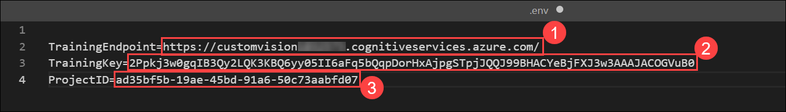

1. After you've replaced the placeholders, within the code editor, use the **CTRL+S** command to save your changes and then use the **CTRL+Q** command to close the code editor while keeping the cloud shell command line open.

## Task 8: Write code to perform model training

In this task, you’ll write and run Python code to train your Custom Vision model. You’ll review how the code authenticates using your project settings, uploads tagged images from local folders, and starts a new training iteration. By the end, you’ll see the newly added images and confirm that a fresh training iteration has been created in the Custom Vision portal.

1. In the cloud shell command line, enter the following command to open the code file for the client application:

    ```
    code train-classifier.py
    ```

    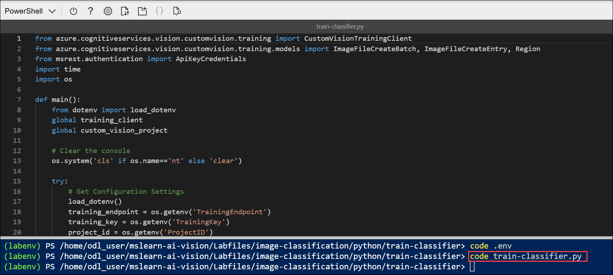

1. Note the following details in the code file:
    - The namespaces for the Azure AI Custom Vision SDK are imported.
    - The **Main** function retrieves the configuration settings, and uses the key and endpoint to create an authenticated.
    - **CustomVisionTrainingClient**, which is then used with the project ID to create a **Project** reference to your project.
    - The **Upload_Images** function retrieves the tags that are defined in the Custom Vision project and then uploads image files from correspondingly named folders to the project, assigning the appropriate tag ID.
    - The **Train_Model** function creates a new training iteration for the project and waits for training to complete.

1. Close the code editor **CTRL+Q** and enter the following command to run the program:

    ```
    python train-classifier.py
    ```

    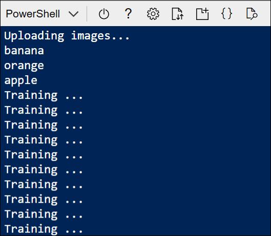

1. Wait for the program to end. Then return to the browser tab containing the Custom Vision portal, and view the **Training Images** page for your project (refreshing the browser if necessary). Verify that some new tagged images have been added to the project.

    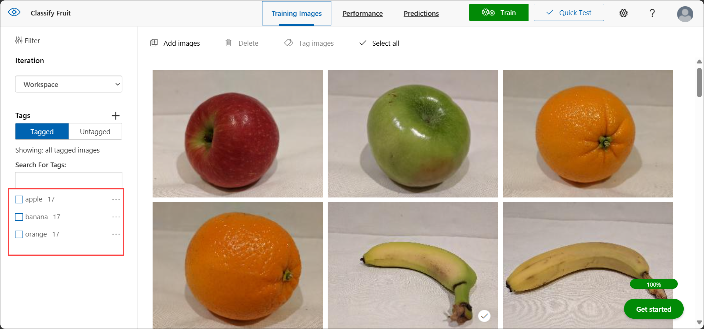

1. Then view the **Performance** page and verify that a new iteration has been created(this may take a minute or so).

    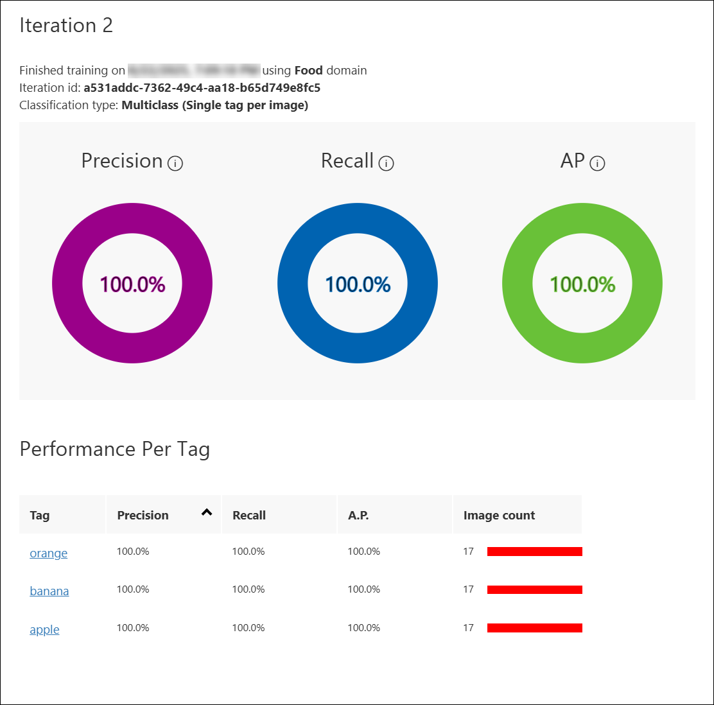

## Task 9:  Use the image classifier in a client application

In this task, you’ll publish your trained Custom Vision model and set it up for use in a client application. You’ll configure the model with a name, link it to the prediction resource, and then retrieve the endpoint and key values needed for prediction. By the end, you’ll have a published model ready to integrate into applications for image classification.

1. In the Custom Vision portal, on the **Performance** page,  click **&#128504; Publish (1)** to publish the trained model with the following settings:

    - Model name: **`fruit-classifier` (2)**
    - Prediction Resource: **customvision<inject key="DeploymentID" enableCopy="false" />-Prediction (3)**
    - Click **Publish (4)**

        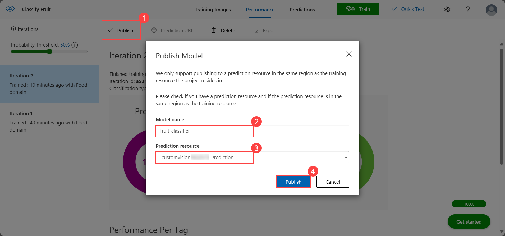

1. At the top left of the **Project Settings** page, click the **Projects Gallery** (&#128065;) icon to return to the Custom Vision portal home page, where your project is now listed.

    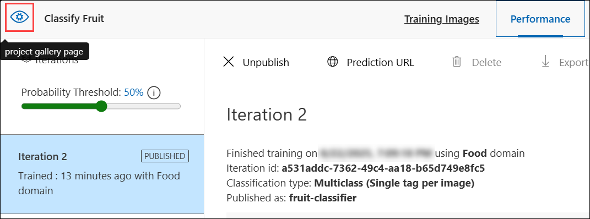

1. On the Custom Vision portal home page, at the top right, click the **Settings** (&#9881;) icon to view the settings for your Custom Vision service.

    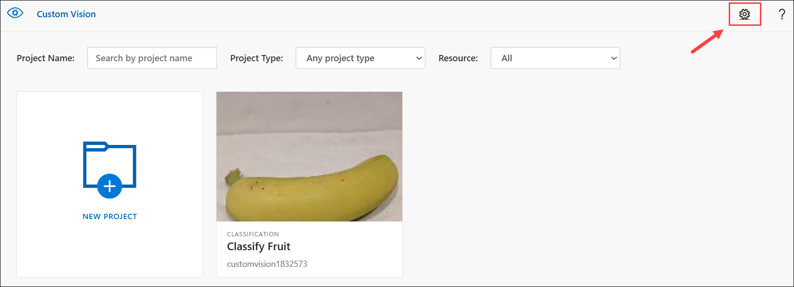

1. Then, under **Resources**, find your *prediction* resource which ends with **customvision<inject key="Deployment" enableCopy="false" />-Prediction (1)** (<u>not</u> the training resource) to determine its **Key (2)** and **Endpoint (3)** values (you can also obtain this information by viewing the resource in the Azure portal).

    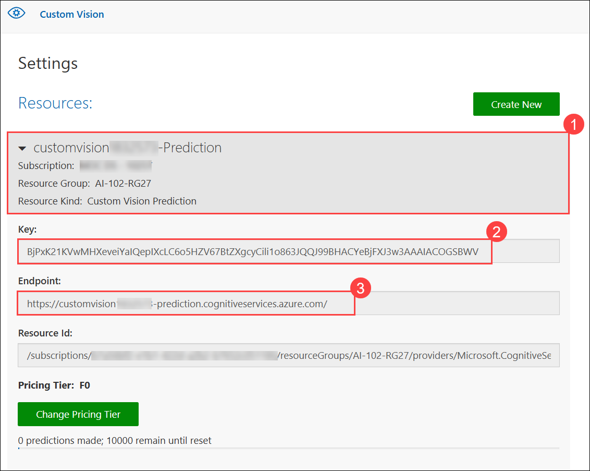

## Task 10: Use the image classifier from a client application

In this task, you’ll use the trained image classification model from a client application. You’ll configure the app with your prediction resource details, project ID, and published model name, then review how the code uses the Azure AI Custom Vision SDK to classify images. Finally, you’ll run the app to test images and see the predicted labels with their probability scores.

1. Return to the browser tab containing the Azure portal and the cloud shell pane.
1. In cloud shell, run the following commands to switch to the folder for your client application and view the files it contains:

    ```
    cd ../test-classifier
    ls -a -l
    ```

    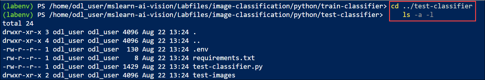

1. The folder contains application configuration and code files for your app. It also contains a **/test-images** subfolder, which contains some image files you'll use to test your model.

    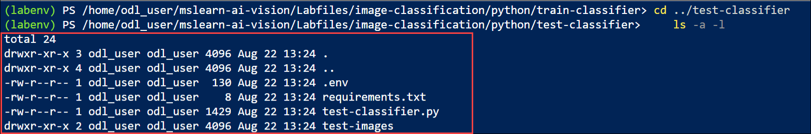

1. Install the Azure AI Custom Vision SDK package for prediction and any other required packages by running the following commands:

    ```
    python -m venv labenv
    ./labenv/bin/Activate.ps1
    pip install -r requirements.txt azure-cognitiveservices-vision-customvision
    ```

1. Enter the following command to edit the configuration file for your app. The file is opened in a code editor.

    ```
    code .env
    ```

    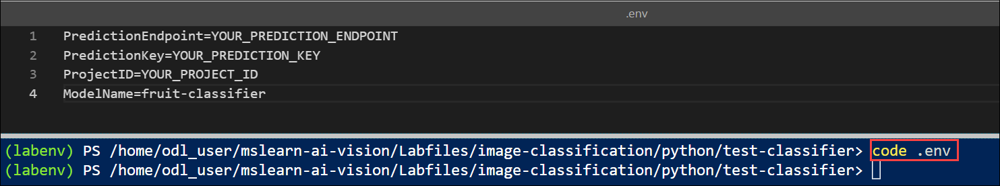

1. Update the configuration values to reflect the Endpoint and an authentication Key for your Custom Vision *<u>prediction</u>* resource, the Project ID for the classification project, and the name of your published model (which should be *fruit-classifier*). 

    - YOUR_PREDICTION_ENDPOINT: **Endpoint (1)**
    - YOUR_PREDICTION_KEY: **Key (2)**
    - YOUR_PROJECT_ID: **Project ID (3)**

        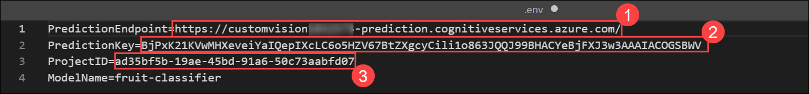

1. Save your changes **CTRL+S** and close the code editor **CTRL+Q**.

1. In the cloud shell command line, enter the following command to open the code file for the client application:

    ```
    code test-classifier.py
    ```

    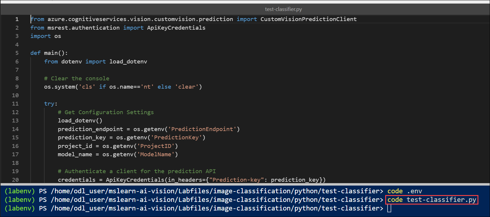

1. Review the code, noting the following details:
    - The namespaces for the Azure AI Custom Vision SDK are imported.
    - The **Main** function retrieves the configuration settings, and uses the key and endpoint to create an authenticated **CustomVisionPredictionClient**.
    - The prediction client object is used to predict a class for each image in the **test-images** folder, specifying the project ID and model name for each request. Each prediction includes a probability for each possible class, and only predicted tags with a probability greater than 50% are displayed.

1. Close the code editor and enter the following command to run the program:

    ```
    python test-classifier.py
    ```

    The program submits each of the following images to the model for classification:

    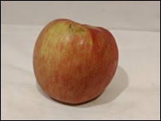

    **IMG_TEST_1.jpg**

    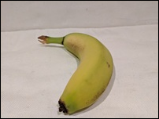

    **IMG_TEST_2.jpg**

    

    **IMG_TEST_3.jpg**

1. View the label (tag) and probability scores for each prediction.

    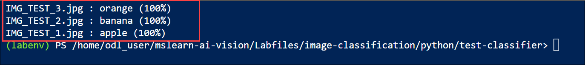


## Summary

In this lab, you created an image classification solution with Azure AI Custom Vision. You provisioned training and prediction resources, set up your environment in Cloud Shell, and configured the sample application with your endpoint and keys. You then built a Custom Vision project, uploaded and labeled images, trained a model, and published it to the prediction resource. Finally, you ran a Python client app to test the model on sample images and view classification results with confidence scores.

Through these steps, you learned how to train, deploy, and consume a Custom Vision model, and integrate it into a client application for real-world image classification tasks.

## You have successfully completed the Hands-on Lab!