# Create a generative AI chat app

### Estimated Duration : 40 Minutes

## Overview

In this lab, you configure role-based access for an Azure AI project by assigning the *Cognitive Services OpenAI User* role to a user in a specific resource group. You use the Azure portal and Azure CLI to sign in, navigate to the appropriate resource group, and grant permissions required for interacting with Azure AI Foundry services.

## Lab Objectives

- **Task 1:** Deploy a model in an Azure AI Foundry project

- **Task 2**: Assign a cognitive service OpenAI role to the user

- **Task 3:** Create a client application to chat with the model

- **Task 4:** Write code to connect to your project and chat with your model

## Task 1: Deploy a model in an Azure AI Foundry project

In this task, you’ll sign in to the Azure AI Foundry portal, locate the **gpt-4.1** model, and create a new project using it. You’ll configure the subscription, resource group, AI Foundry resource, and region, then verify the project and model deployment in the portal.

1. Open a new tab in the browser, right-click on the following link [Azure AI Foundry portal](https://ai.azure.com), then **Copy link** and paste it in a browser tab to log in to **Azure AI Foundry portal**.

1. Click on **Sign in**.
 
    

1. If prompted, provide the credentials below:
 
   - **Email/Username:** <inject key="AzureAdUserEmail"></inject>
    
        

   - **Password:** <inject key="AzureAdUserPassword"></inject>
    
        

1. When the **Stay signed in?** window appears, select **No**.

    

1. Click on **X** to close the **Chat with Foundry Agent** popup window.

    

    >**Note:** Close the **Help** pane if it's open

1. In the home page, in the **Explore models and capabilities** section, search for the **`gpt-4.1`** model **(1)** and select **`gpt-4.1`** **(2)**  which we'll use in our project.    

    

1. At the top of the page for the model, select **Use this model**.

    

1. In the **Create a new project** window, enter **Myproject<inject key="DeploymentID"></inject> (1)** as the project name. Open the **Advanced options (2)** drop-down, fill in the following details, and then click **Create (7)**:

    * Subscription: **Choose Default Subscription (3)**
    * Resource group: **AI-102-RG2a (4)**
    * Azure AI Foundry resource: **Keep as Default (5)**
    * Region: **<inject key="Region"></inject> (6)**

        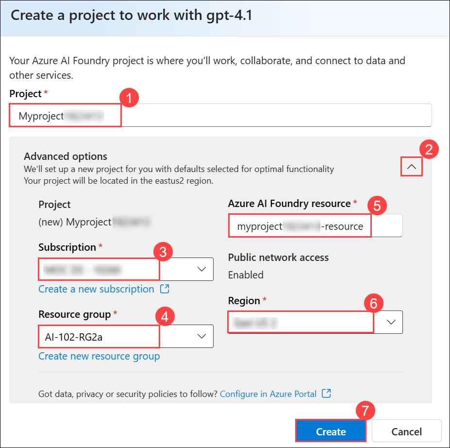
        
        >**Note:** Some Azure AI resources are constrained by regional model quotas. In the event of a quota limit being exceeded later in the exercise, there's a possibility you may need to create another resource in a different region.
        
        >**Note:** The creation of project can take few minutes to complete.

1. When your project is created, the chat playground will be opened automatically so you can test your model:

   

1. In the **Setup** pane, check the name of your model deployment, it should be **gpt-4.1**.

    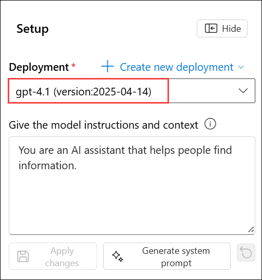

1. You can verify the model deployment by opening the **Models + endpoints (1)** page from the left navigation pane.

    .png)

1. On the **Overview (1)** page in the Azure AI Foundry portal, locate the **Endpoints and keys** section. Select the **Azure AI Foundry (2)** library, then click **Copy Azure AI Foundry project endpoint (3)**. This endpoint will be used to connect your client application to your project and model.

    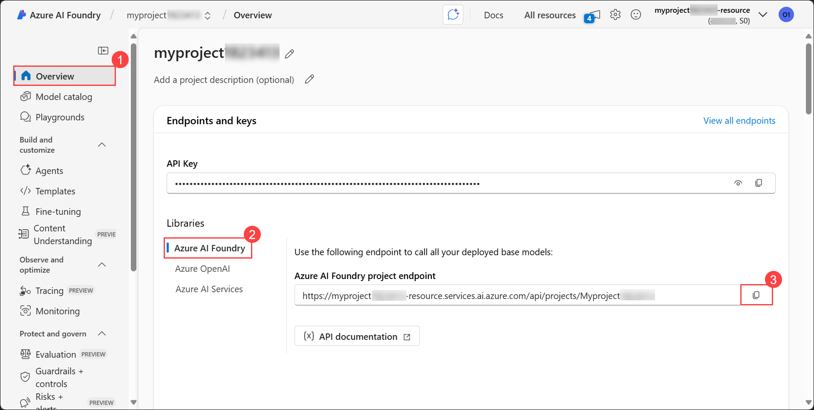

    > **Note:** Save this endpoint in a notepad for future reference.

    > **Note**: You can also use the Azure OpenAI endpoint!

## Task 2: Assign a cognitive service OpenAI role to the user

In this task, you’ll assign the **Cognitive Services OpenAI User** role to your account for the specified Azure resource group. This will give you the required permissions to access and use the Azure OpenAI resources in the lab.


1. Open a new browser tab (keeping the Azure AI Foundry portal open in the existing tab). Then in the new tab, browse to the [Azure portal](https://portal.azure.com) at `https://portal.azure.com`.

1. If prompted, provide the credentials below:

    - **Email/Username:** <inject key="AzureAdUserEmail"></inject>

    - **Password:** <inject key="AzureAdUserPassword"></inject> 

        >**Note:** If the **Welcome to Microsoft Azure** window appears, select **Cancel**.

        

1. In the search bar, type **Resource groups (1)** and select **Resource groups (2)** from the results.

    p1.png)

1. In the Resource groups blade, choose **AI-102-RG2a**.

    p2.png)

1. In the left navigation pane, go to **Access control (IAM) (1)**, click the **+ Add (2)** drop-down, and choose **Add role assignment (3)**.

    p3.png)

1. On the **Add role assignment** page, under **Job function roles**, type **Cognitive Services OpenAI User (1)** in the search bar, select **Cognitive Services OpenAI User (2)** from the results, and click **Next (3)**.

    p4.png)

1. On the **Members** tab, do the following, then click **Select (5)**:

    * **Assign access to**: Choose **Users, group, or service principal (1)**
    * **Members**: Click **+ Select members (2)**
    * **Search**: Enter **<inject key="AzureAdUserEmail"></inject> (3)**
    * **Select members**: Choose **<inject key="AzureAdUserEmail"></inject> (4)**

        p5.png)

1. Confirm that **ODL_User<inject key="DeploymentID"></inject>** is listed under Members, then click **Review + assign**.

    p6.png)

1. Check the details on the **Review + assign** tab, then click **Review + assign**.

    p7.png)


## Task 3: Create a client application to chat with the model

In this task, you’ll connect your deployed Azure OpenAI model to a Python-based chat application by retrieving the project endpoint, cloning the sample code repository, configuring environment variables, and installing the required SDKs. This will allow you to interact with the model directly from your client application.

1. Open a new browser tab (keeping the Azure AI Foundry portal open in the existing tab). Then in the new tab, browse to the [Azure portal](https://portal.azure.com) at `https://portal.azure.com`.

1. If prompted, provide the credentials below:

   - **Email/Username:** <inject key="AzureAdUserEmail"></inject>

   - **Password:** <inject key="AzureAdUserPassword"></inject> 

        >**Note:** If the **Welcome to Microsoft Azure** window appears, select **Cancel**.

        

1. On the **Azure portal** homepage, click the **\[>\_] Cloud Shell (1)** button located to the right of the **Copilot** tab at the top. This opens a new Cloud Shell session. In the **Welcome to Azure Cloud Shell** window, choose **PowerShell (2)**.

    

    >**Note:** The cloud shell provides a command-line interface in a pane at the bottom of the Azure portal. You can resize or maximize this pane to make it easier to work in.

    > **Note:** If you have previously created a cloud shell that uses a **Bash** environment, switch it to **PowerShell**.

1. In the **Getting started** window, ensure **No storage account required (1)** is selected. From the **Subscription** drop-down, choose **Default subscription (2)**, then click **Apply (3)**.

    

1. In the Cloud Shell toolbar, open the **Settings (1)** menu and choose **Go to Classic version (2)** from the drop-down.

    

    >**Note:** Ensure you've switched to the classic version of the cloud shell before continuing.

1. In the Cloud Shell pane, run the following commands to clone the GitHub repository with the code files for this exercise. You can type the command directly, or copy it to the clipboard, then right-click in the command line and paste it as plain text.

    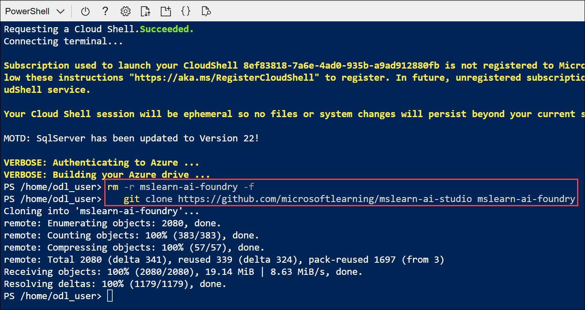
    
    ```
    rm -r mslearn-ai-foundry -f
    git clone https://github.com/microsoftlearning/mslearn-ai-studio mslearn-ai-foundry
    ```

1. Once the repository is cloned, go to the folder with the chat application code files and open them to view their contents.

    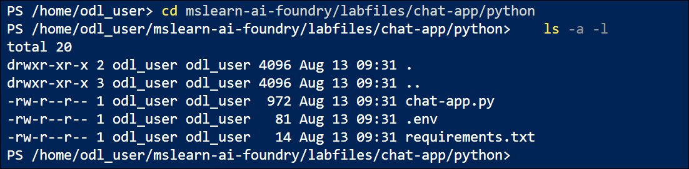

    ```
    cd mslearn-ai-foundry/labfiles/chat-app/python
    ls -a -l
    ```

1. The folder contains a code file as well as a configuration file for application settings and a file defining the project runtime and package requrirements.

1. In the Cloud Shell command-line pane, run the following command to install the required libraries.

    ```
    python -m venv labenv
    ./labenv/bin/Activate.ps1
    pip install -r requirements.txt azure-identity azure-ai-projects openai
    ```

1. Run the following command to open the provided configuration file in a code editor for editing.

    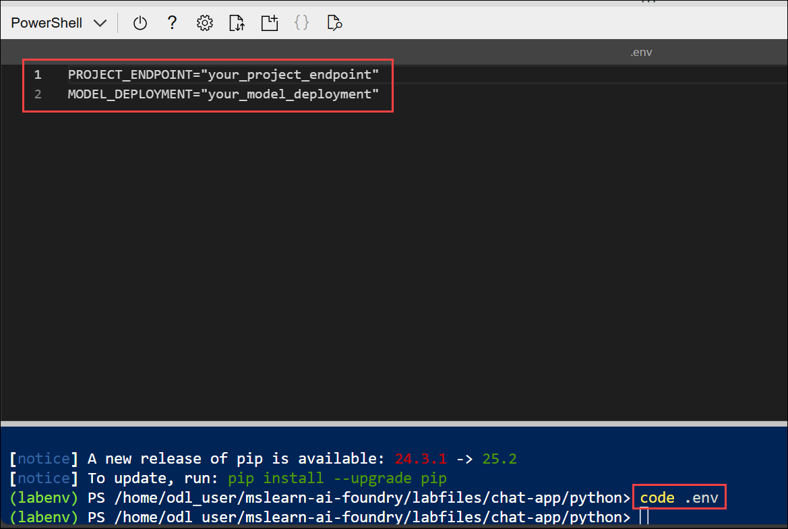

    ```
    code .env
    ```

1. In the code file, replace the placeholder values with the correct details for your project:

    * your\_project\_endpoint : **Azure AI Foundry project endpoint (1)**
    * your\_model\_deployment : **gpt-4.1 (2)**

        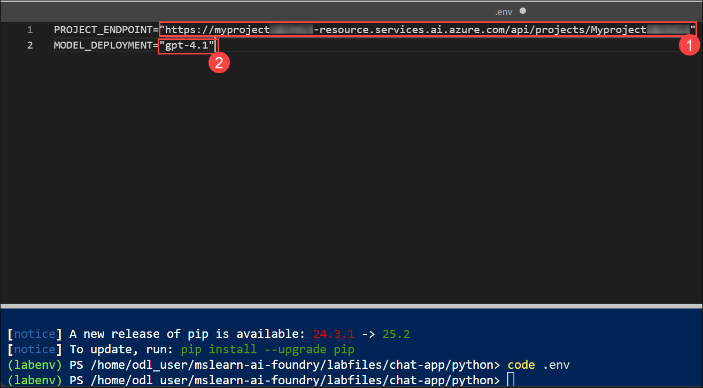

        > **Note:** Paste the Azure AI Foundry project endpoint you copied in the previous task.

1. After replacing the placeholders, save your changes in the code editor using **CTRL+S** or **Right-click > Save**. Then close the editor with **CTRL+Q** or **Right-click > Quit**, leaving the Cloud Shell command line open.

## Task 4: Write code to connect to your project and chat with your model

In this task, you’ll modify the provided Python chat application to connect to your deployed Azure OpenAI model. You’ll add the necessary SDK imports, initialize the Azure AI Foundry client, set up a system prompt, handle user input in a loop, and return model responses while maintaining conversation history. Finally, you’ll run and test the application by chatting with your model from the Cloud Shell environment.

1. Run the following command to open the provided code file for editing.

    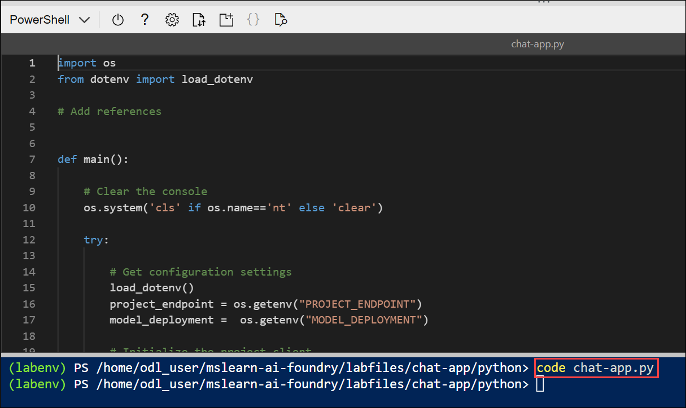

    ```
    code chat-app.py
    ```

1. In the code file, review the existing import statements at the top that bring in the required SDK namespaces. Then, locate the comment **Add references** and insert the following code to include the namespaces from the libraries you installed earlier:

    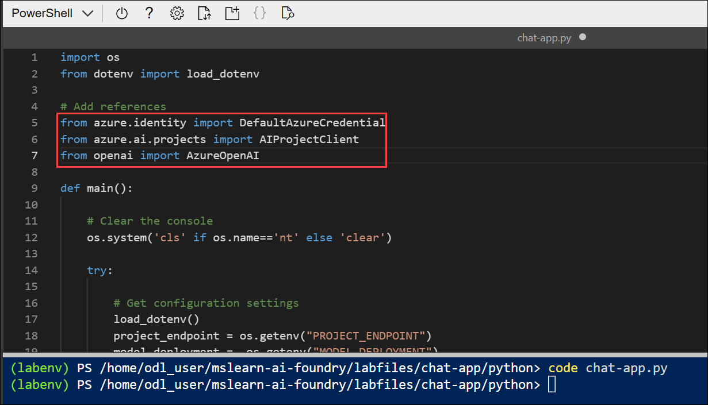

    ```python
    # Add references
    from azure.identity import DefaultAzureCredential
    from azure.ai.projects import AIProjectClient
    from openai import AzureOpenAI
    ```

1. In the **main** function, under the comment **Get configuration settings**, observe that the code retrieves the project connection string and model deployment name values from the configuration file.

    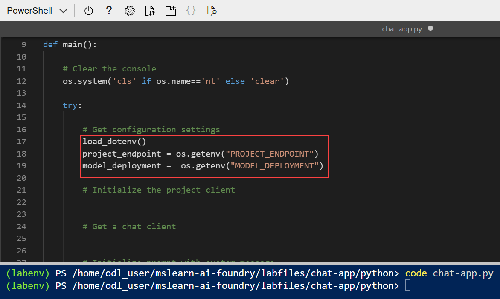

1. Find the comment **Initialize the project client**, and add the following code to connect to your Azure AI Foundry project:

    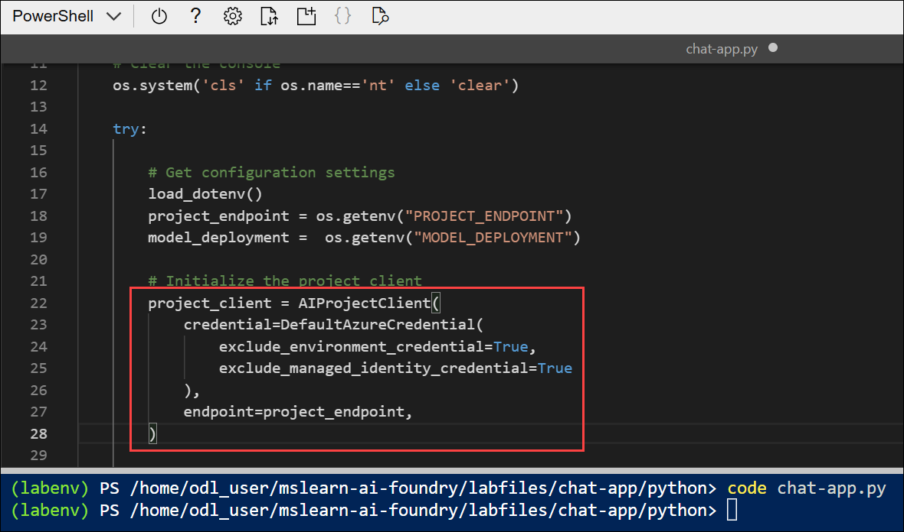

    ```python
   # Initialize the project client
   project_client = AIProjectClient(            
            credential=DefaultAzureCredential(
                exclude_environment_credential=True,
                exclude_managed_identity_credential=True
            ),
            endpoint=project_endpoint,
        )
    ```

    > **Note:** Be careful to maintain the correct indentation level for your code.

1. Find the comment **Get a chat client**, and add the following code to create a client object for chatting with a model:

    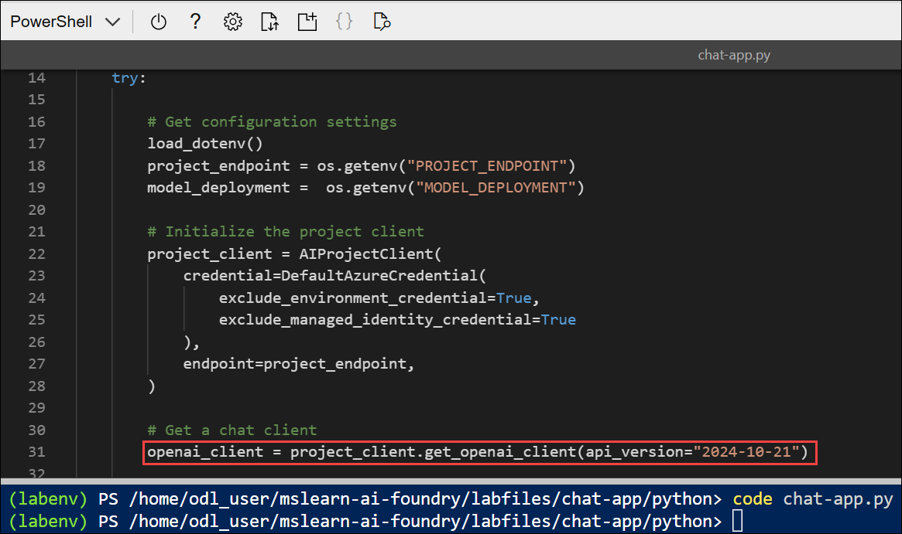

    ```python
   # Get a chat client
   openai_client = project_client.get_openai_client(api_version="2024-10-21")
    ```

1. Locate the comment **Initialize prompt with system message** and insert the following code to set up a message collection starting with a system prompt.

    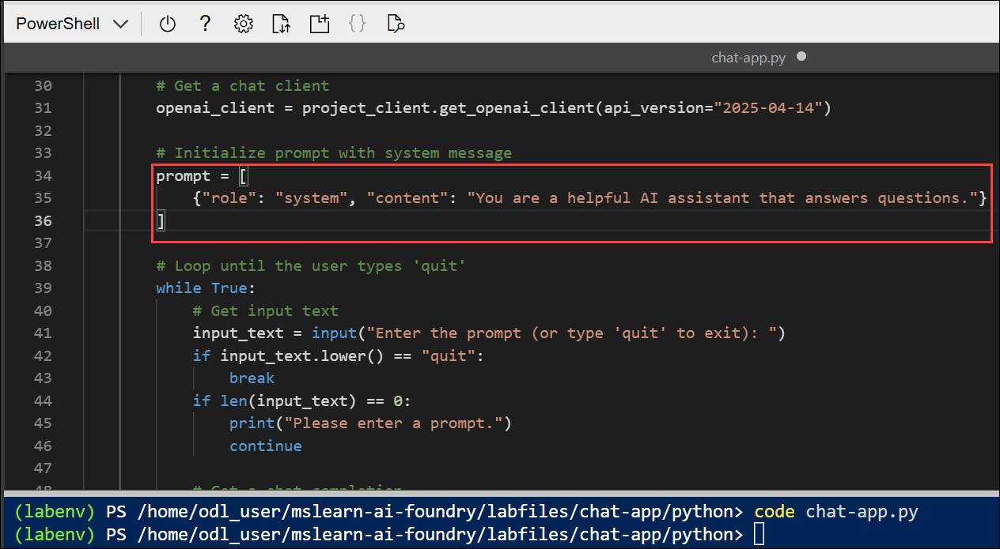

    ```python
   # Initialize prompt with system message
   prompt = [
            {"role": "system", "content": "You are a helpful AI assistant that answers questions."}
        ]
    ```

1. Note that the code includes a loop to allow a user to input a prompt until they enter "quit". Then in the loop section, find the comment **Get a chat completion** and add the following code to add the user input to the prompt, retrieve the completion from your model, and add the completion to the prompt (so that you retain chat history for future iterations):

    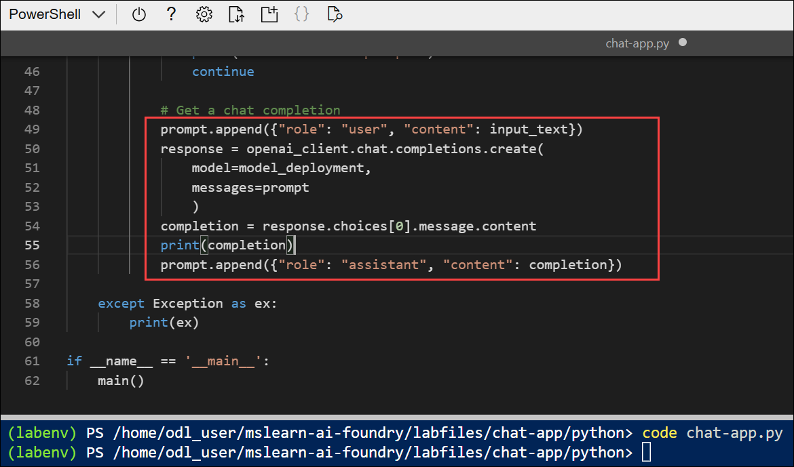

    ```python
   # Get a chat completion
   prompt.append({"role": "user", "content": input_text})
            response = openai_client.chat.completions.create(
                model=model_deployment,
                messages=prompt
                )
            completion = response.choices[0].message.content
            print(completion)
            prompt.append({"role": "assistant", "content": completion})
    ```
    > **Note:** As you add code, be sure to maintain the correct indentation.

1. Press **CTRL+S** to save the changes you made to the code file.

1. In the cloud shell command-line pane, enter the following command to sign into Azure. Click on the **Link (1)** and copy the **code (2)** provided.

    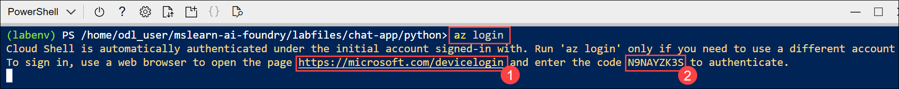

    ```
    az login
    ```
    
1. In the new browser tab, when the **Enter code to allow access** window appears, paste the copied code and select **Next**.

    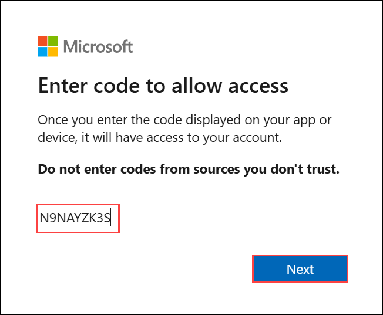

1. In the **Pick an account** dialog box, choose **ODL_User<inject key="DeploymentID"></inject>**. 

    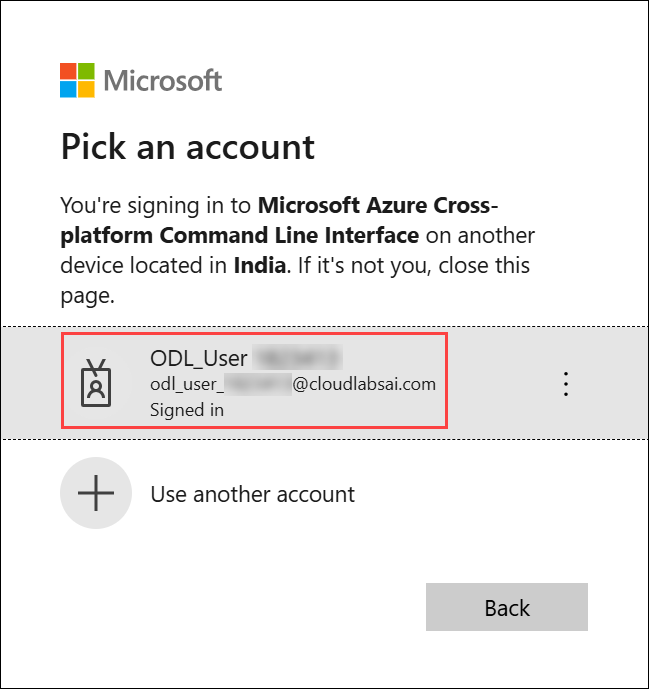

1. In the **Are you trying to sign in to Microsoft Azure CLI?** dialog box, click **Continue**.

    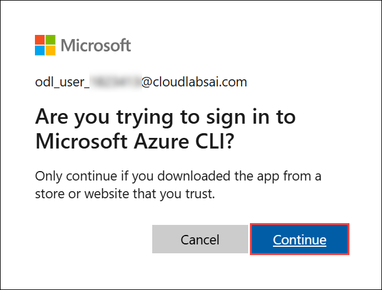

1. When the **Microsoft Azure Cross-platform Command Line Interface** window pops up, return to the browser tab with Cloud Shell open. 

    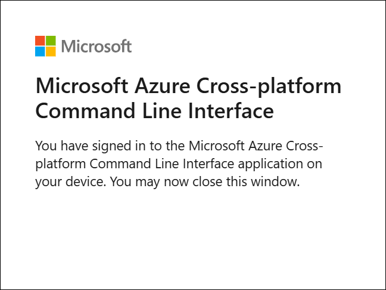

1. In the Cloud Shell console, press **Enter** to select the only available subscription.

    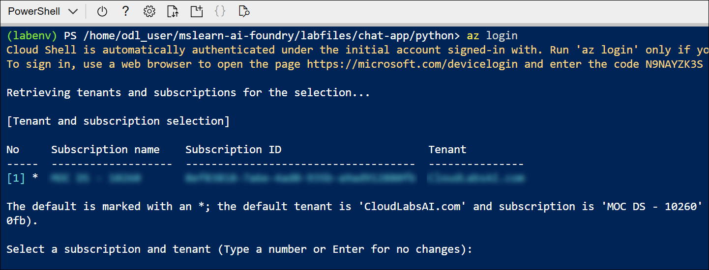

1. After you have signed in, enter the following command to run the application:

    ```
   python chat-app.py
    ```

1. When prompted, enter a question, such as `What is the fastest animal on Earth?` and review the response from your generative AI model.

    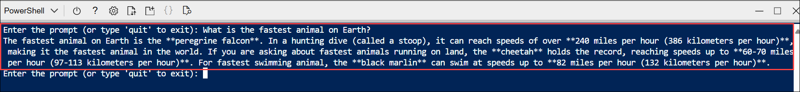

1. Try some follow-up questions, like `Where can I see one?` or `Are they endangered?`. The conversation should continue, using the chat history as context for each iteration.

    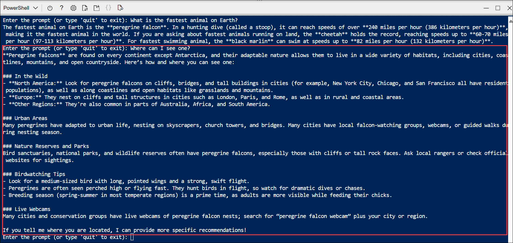

    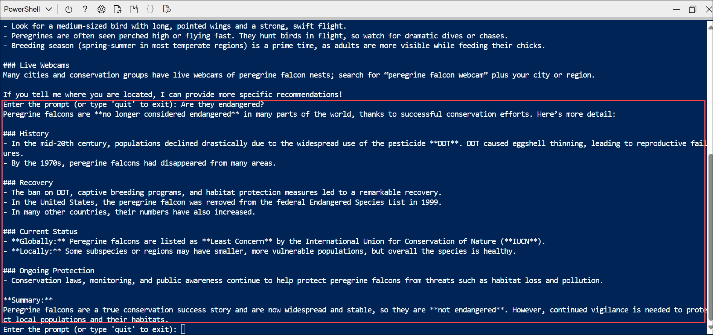

1. When you're finished, enter `quit` to exit the program.

>**Note:** If the app fails because the rate limit is exceeded. Wait a few seconds and try again. If there is insufficient quota available in your subscription, the model may not be able to respond.

## Summary

By completing this lab, you learned how to:

* Sign in to the Azure portal and Azure CLI using your provided credentials.
* Locate and open the target resource group in the Azure portal.
* Assign a role to a user through the **Access control (IAM)** blade.
* Verify the role assignment to ensure the user has the necessary access.
* Use Azure CLI within Cloud Shell to confirm subscription context and manage access.

### You have successfully completed the Hands-on Lab!