# Lab 30: Analyze video

### Estimated Duration: 45 Minutes

## Overview

In this hands-on lab, you will learn how to analyze videos using **Azure Video Indexer**. You’ll start by uploading a video to the Video Indexer portal and allowing the service to extract insights such as transcripts, OCR text, speakers, topics, and sentiments. Next, you’ll review and search these insights directly in the portal to better understand the content and context of the video. You’ll then move to the **Azure portal** and **Cloud Shell**, where you’ll configure and run scripts that interact with the **Video Indexer REST API** using your account ID and API key. Finally, you’ll extend the solution by embedding **Video Indexer widgets**, including the Player and Insights, into a simple HTML application, enabling interactive playback and exploration of extracted insights outside the portal. By the end of this lab, you’ll be proficient in using Video Indexer both through the portal and programmatically via the REST API, and in integrating video insights into custom applications.

## Lab Objectives

- Task 1: Upload a video to Video Indexer

- Task 2: Review video insights

- Task 3: Search for insights

- Task 4: Use the Video Indexer REST API

- Task 5: Get your API details

- Task 6: Use the REST API

- Task 7: Use Video Indexer widgets

## Task 1: Upload a video to Video Indexer

First, you'll need to sign into the Video Indexer portal and upload a video.

1. Right click on the following link [Video Indexer portal](https://www.videoindexer.ai), then select **Copy link**. Then paste the link on your JumpVM;s browser tab.

1. On the **Choose an account to continue** page, select **Microsoft Entra ID (formely Azure AD)**.

   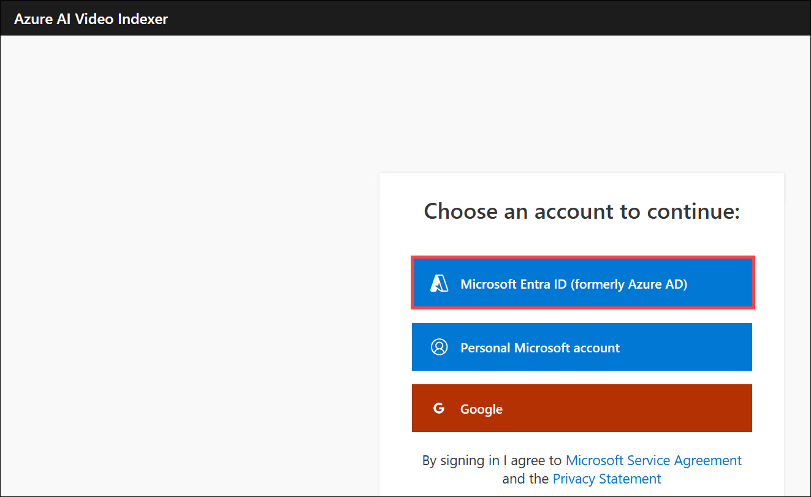

    >**Note**: If this is your first time signing in you might see a pop-up form asking you to verify how you're going to use the service. 

1. Click on **No, thanks** for Sign in pop up.

   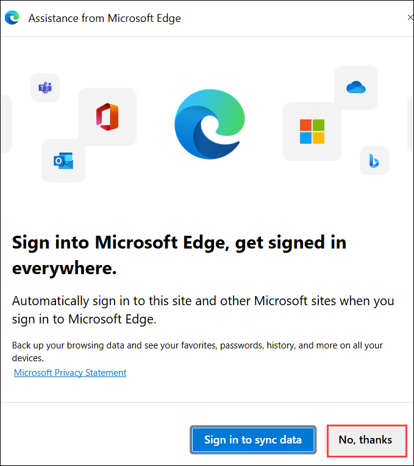

1. You can see the **Video Indexer portal** as below. 

   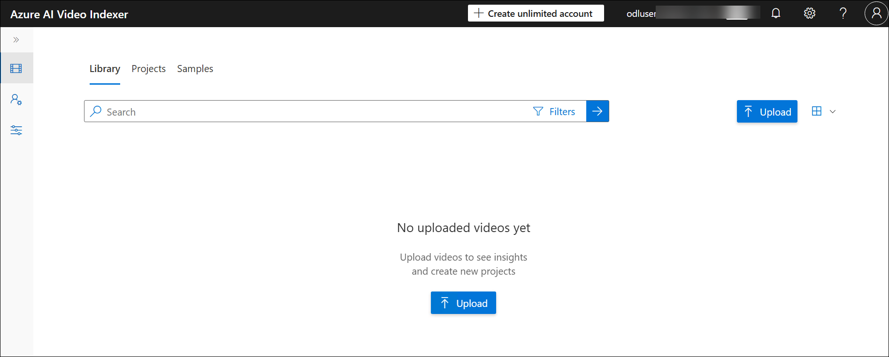

1. In a new tab, download the Responsible AI video by visiting `https://aka.ms/responsible-ai-video`.

1. In **Video Indexer**, select the **Upload** option.

   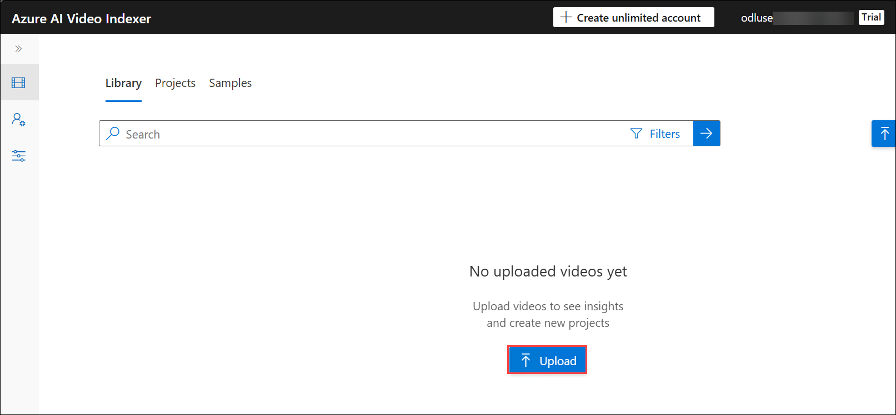

1. Then select the option to **Browse for files**.

   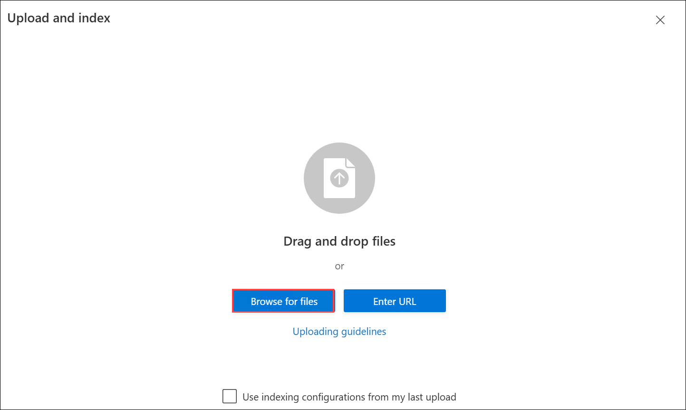

1. Navigate to `C:\Users\azureuser\Downloads` **(1)**, select the downloaded video **(2)**, and click **Open (3)**.

   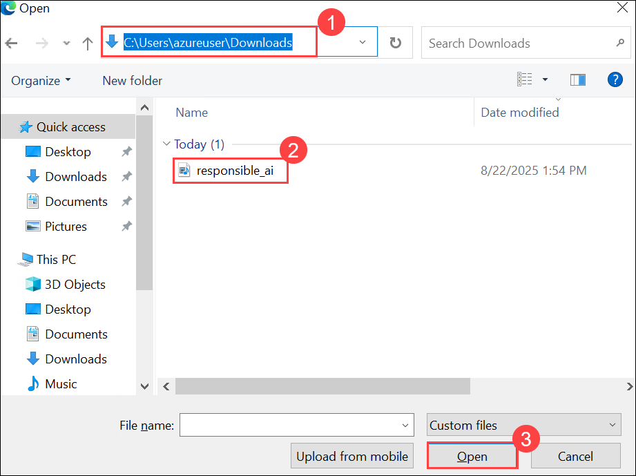

1. Change the text in the **File  name** field to **Responsible AI (1)**. Select **Review + upload (2)**.

   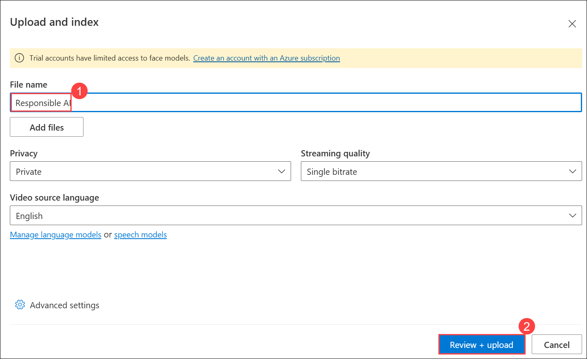

1. Review the summary overview, select the **checkbox (1)** to verify compliance with Microsoft's policies for facial recognition  and then select **Upload + index (2)** to upload the file.

   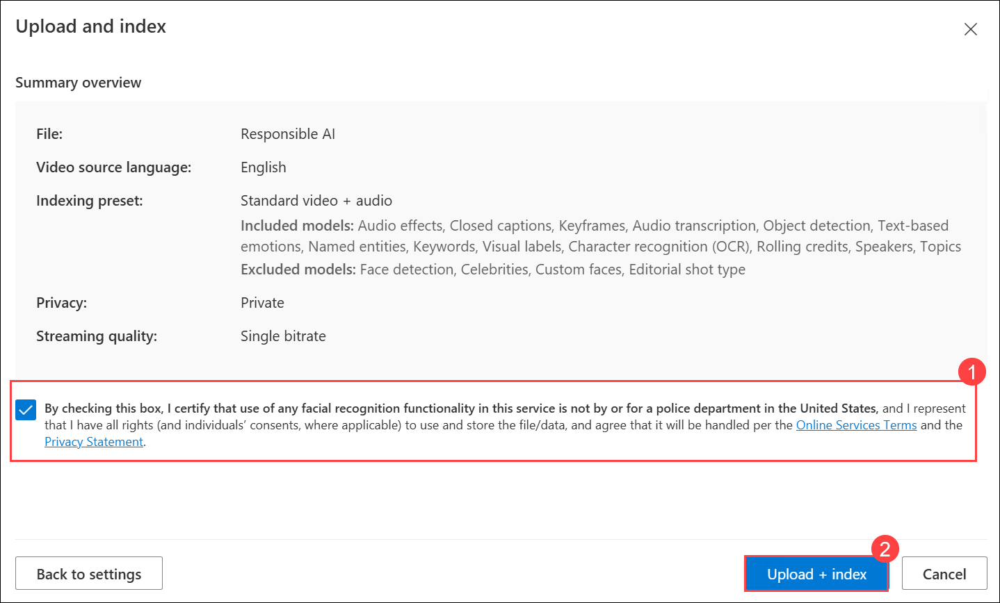

1. Once the Upload is done, close it.

   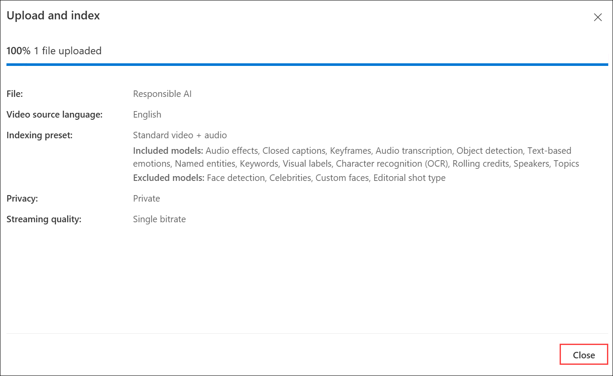

1. After the file is uploaded, wait a few minutes for Video Indexer to complete processing. Allow the indexing to reach **100%**.

    >**Note**: In this lab, we're using this video to explore Video Indexer functionality; but you should take the time to watch it in full when you've finished the lab as it contains useful information and guidance for developing AI-enabled applications responsibly! 

## Task 2: Review video insights

The indexing process extracts insights from the video, which you can view in the portal.

1. In the **Video Indexer portal**, when the video is indexed, select it to view it.

1. You'll see the video player alongside a pane that shows **Insights** extracted from the video.

    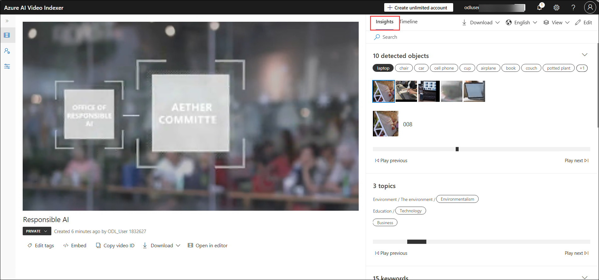

     >**Note**: Due to the limited access policy to protect individuals identities, you may not see names when you index the video.

1. As the video plays, select the **Timeline** tab to view a transcript of the video audio.

    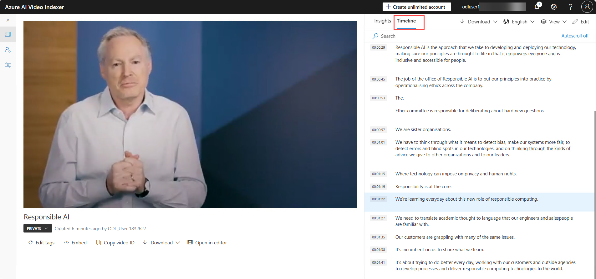

1. At the top right of the portal, select the **View (1)** symbol (which looks similar to &#128455;), and in the list of insights, in addition to **Transcript**, select **OCR** and **Speakers** **(2)**.

    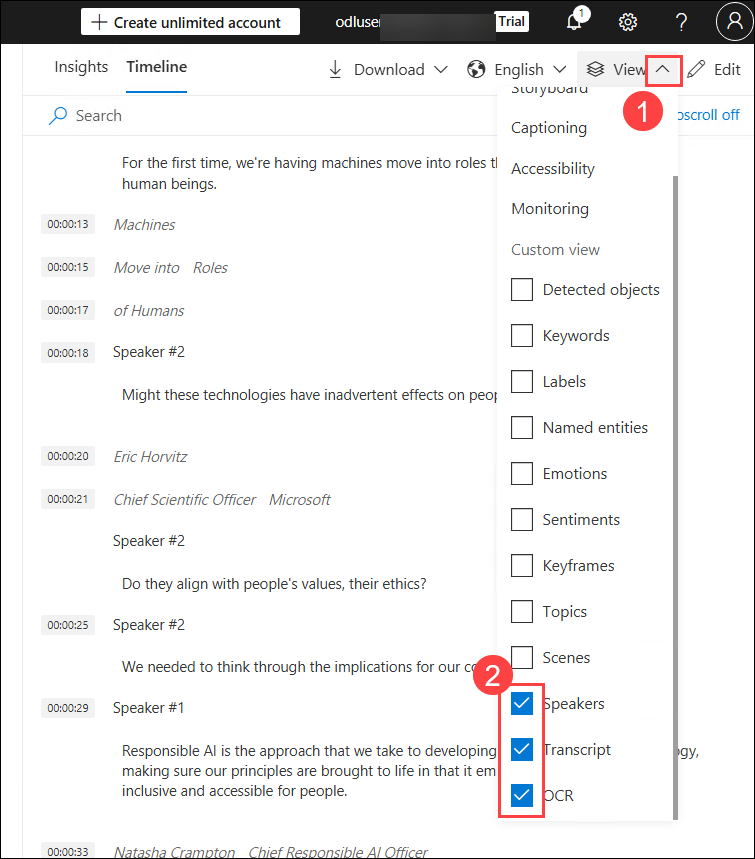

1. Observe that the **Timeline** pane now includes:

    - Transcript of audio narration.
    - Text visible in the video.
    - Indications of speakers who appear in the video. Some well-known people are  automatically recognized by name, others are indicated by number (for example *Speaker #1*).

      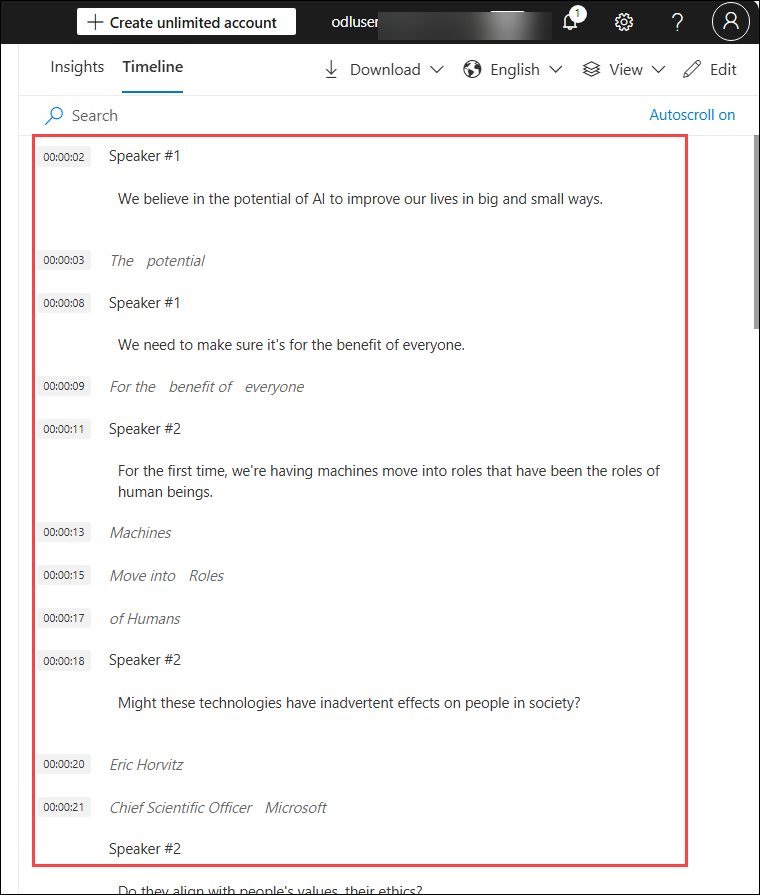

1. Switch back to the **Insights** pane and view the insights show there. They include:

    - Individual people who appear in the video.
    - Topics discussed in the video.
    - Labels for objects that appear in the video.
    - Named entities, such as people and brands that appear in the video.
    - Key scenes.

      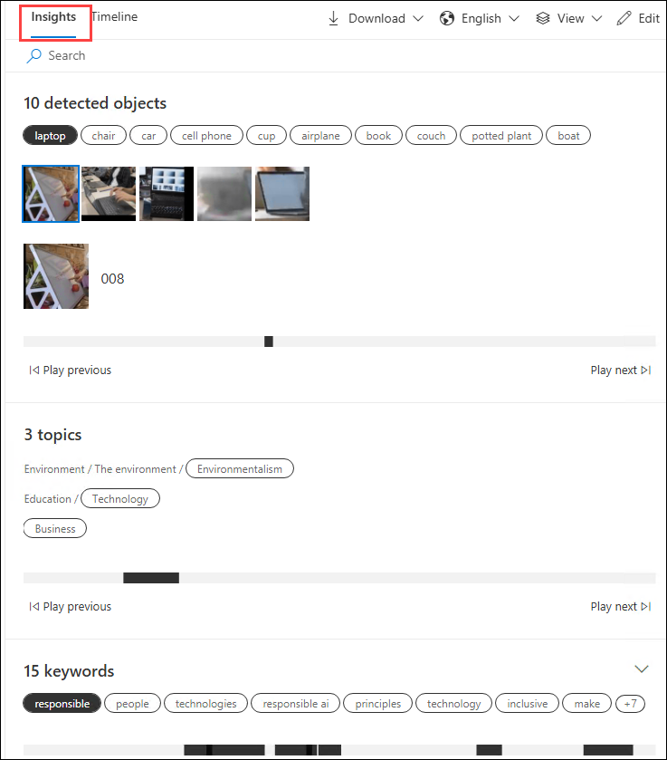

1. With the **Insights** pane visible, select the **View (1)** symbol again, and in the list of insights, add **Keywords (2)** and **Sentiments (3)** to the pane.

    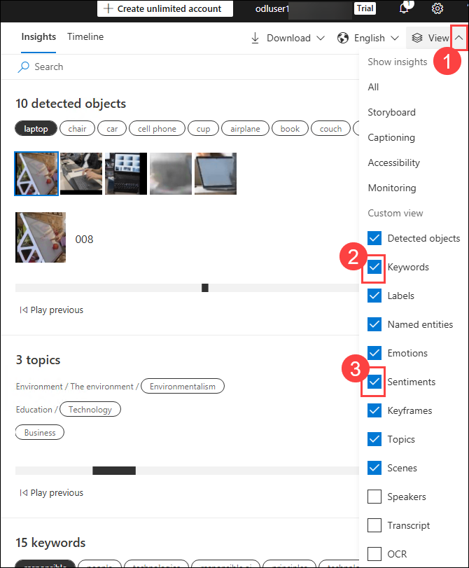

    The insights found can help you determine the main themes in the video. For example, the **topics** for this video show that it is clearly about technology, social responsibility, and ethics.

## Task 3: Search for insights

You can use Video Indexer to search the video for insights.

1. In the **Insights** pane, in the **Search** box, enter `Bee` **(1)**.

    - You may need to scroll down in the Insights pane to see results for all types of insight.
    - Observe that one matching *label* is found, with its location in the video indicated beneath. Select that point **(2)**

      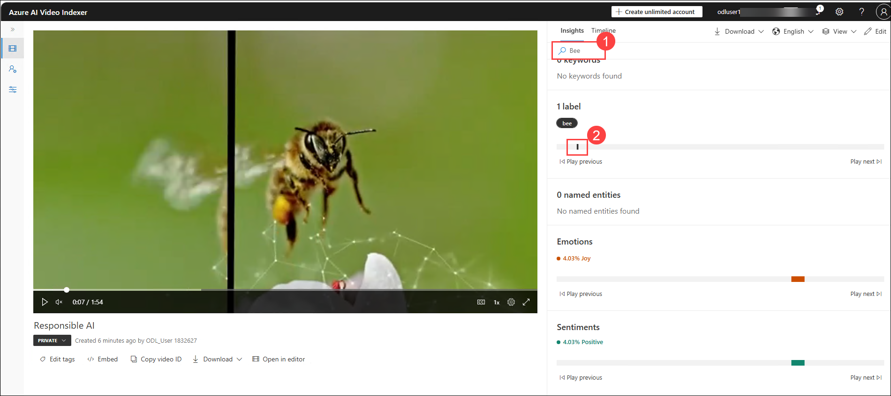

1. Clear the **Search** box to show all insights for the video.


## Task 4: Use the Video Indexer REST API

1. Navigate to [Azure portal](https://portal.azure.com/).

1. If prompted, provide the credentials below:
    
    - **Email/Username:** <inject key="AzureAdUserEmail"></inject>

    - **Password:** <inject key="AzureAdUserPassword"></inject>

1. Use the **[>_] (1)** button to the right of the search bar at the top of the page to create a new **Cloud Shell** in the Azure portal.

    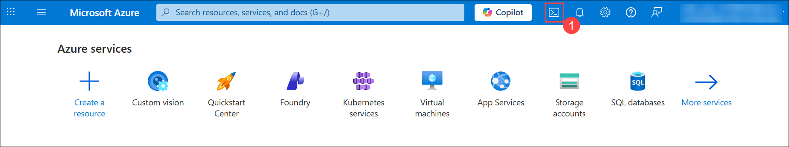 

1. Selecting a **PowerShell** environment.

    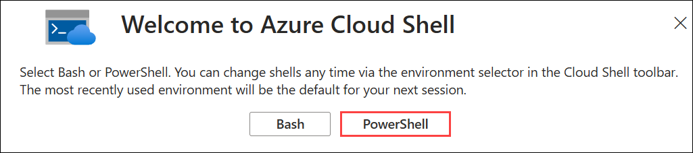 

1. On the **Getting started** page,

    - Select **No storage account required (1)** 
    - Select your subscription **(2)**
    - Click on **Apply (3)**

      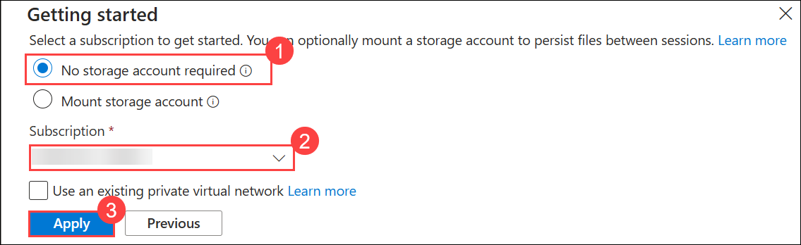 

1. In the cloud shell toolbar, in the **Settings (1)** menu, select **Go to Classic version (2)** (this is required to use the code editor).

    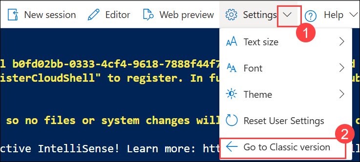

     >**Note**: The cloud shell provides a command-line interface in a pane at the bottom of the Azure portal. You can resize or maximize this pane to make it easier to work in.

     >**Note**: Ensure you've switched to the classic version of the cloud shell before continuing.

1. In the cloud shell pane, enter the following commands to clone the GitHub repo containing the code files for this exercise (type the command, or copy it to the clipboard and then right-click in the command line and paste as plain text):

    ```
    rm -r mslearn-ai-vision -f
    git clone https://github.com/MicrosoftLearning/mslearn-ai-vision
    ```

     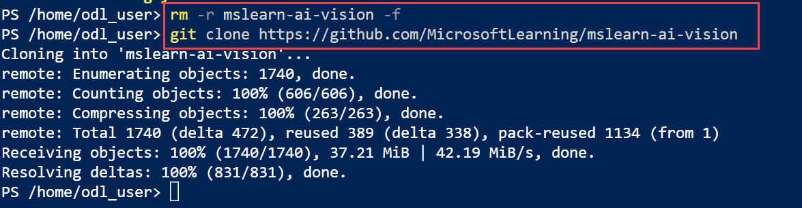    

      >**Tip**: As you paste commands into the cloudshell, the ouput may take up a large amount of the screen buffer. You can clear the screen by entering the `cls` command to make it easier to focus on each task.

1. After the repo has been cloned, navigate to the folder containing the application code file for this exercise:  

    ```
   cd mslearn-ai-vision/Labfiles/video-indexer
    ```

## Task 5: Get your API details

To use the Video Indexer API, you need some information to authenticate requests:

1. In the **Video Indexer portal**, expand the left pane and select the **Account settings (1)** page. Copy and paste the **Account ID (2)** on this page - you will need it later.

    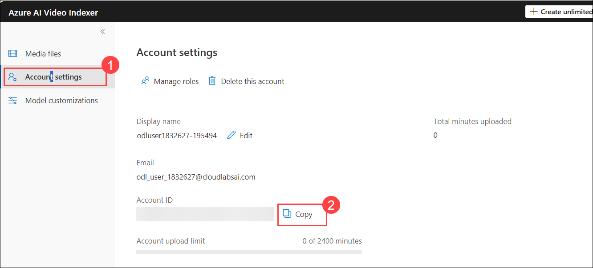 

1. Open a new browser tab and go to the [Video Indexer developer portal](https://api-portal.videoindexer.ai) at `https://api-portal.videoindexer.ai`.

1. Sign in  with your Azure credentials.

    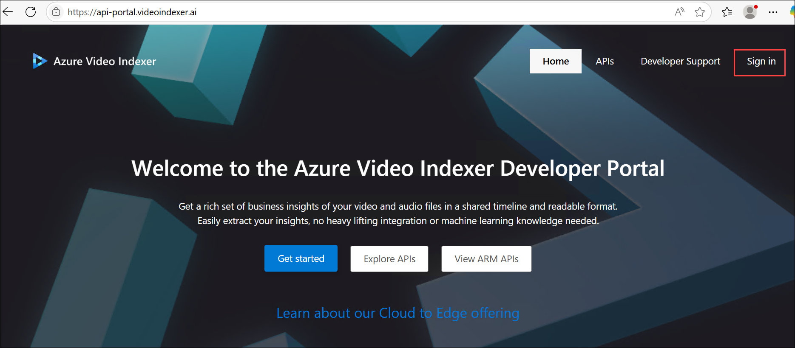

1. If prompted, provide the credentials below:
    
    - **Email/Username:** <inject key="AzureAdUserEmail"></inject>

    - **Password:** <inject key="AzureAdUserPassword"></inject>

1. Select **Profile** tab.

    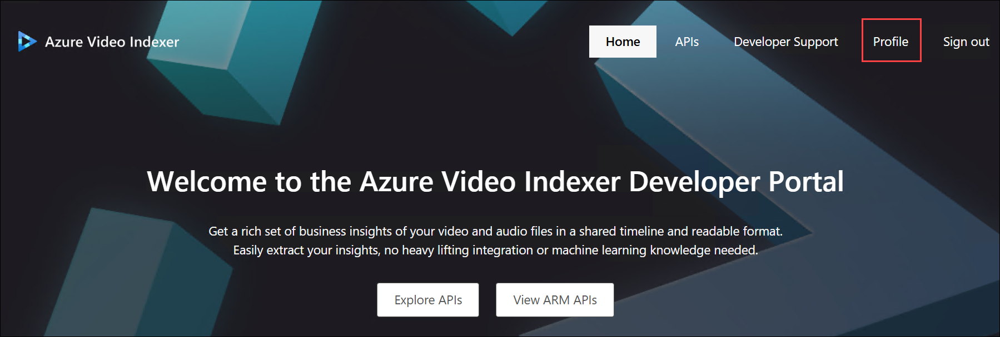 

1. On the **Profile** page view the **Subscriptions** associated with your profile.

    - On the page with your subscription(s), observe that you have been assigned two keys (primary and secondary) for each subscription. Then select **Show (1)** for any of the keys to see it. Copy and paste one of the Keys **(2)**. You will need this key shortly.

      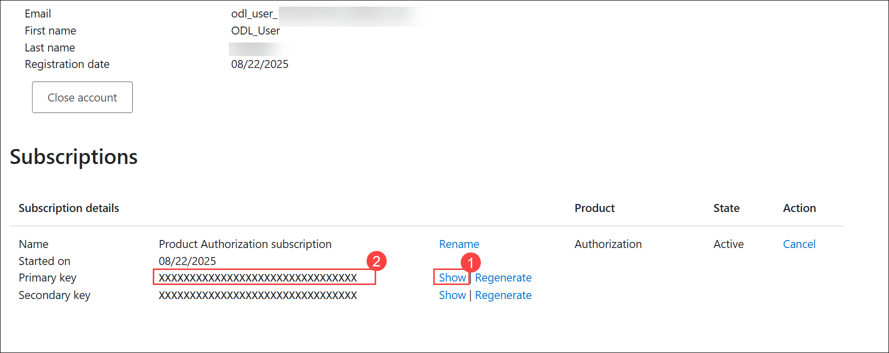     


## Task 6: Use the REST API

Now that you have the account ID and an API key, you can use the REST API to work with videos in your account. In this procedure, you'll use a PowerShell script to make REST calls; but the same principles apply with HTTP utilities such as cURL or Postman, or any programming language capable of sending and receiving JSON over HTTP.

All interactions with the Video Indexer REST API follow the same pattern:

- An initial request to the **AccessToken** method with the API key in the header is used to obtain an access token.
- Subsequent requests use the access token to authenticate when calling REST methods to work with videos.

1. In the cloud shell, use the following command to open the PowerShell script:

    ```
   code get-videos.ps1
    ```
    
     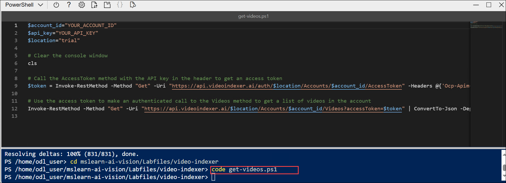  

1. In the PowerShell script, replace the **YOUR_ACCOUNT_ID (1)** and **YOUR_API_KEY (2)** placeholders with the account ID and API key values you identified previously.

    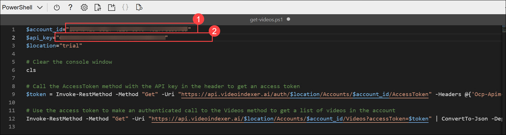

1. Observe that the *location* for a free account is "trial". If you have created an unrestricted Video Indexer account (with an associated Azure resource), you can change this to the location where your Azure resource is provisioned (for example "eastus").

1. Review the code in the script, noting that invokes two REST methods: one to get an access token, and another to list the videos in your account.

1. Save your changes (press *CTRL+S*), close the code editor (press *CTRL+Q*).

1. Then run the following command to execute the script:

    ```
   ./get-videos.ps1
    ```
    
1. View the JSON response from the REST service, which should contain details of the **Responsible AI** video you indexed previously.

    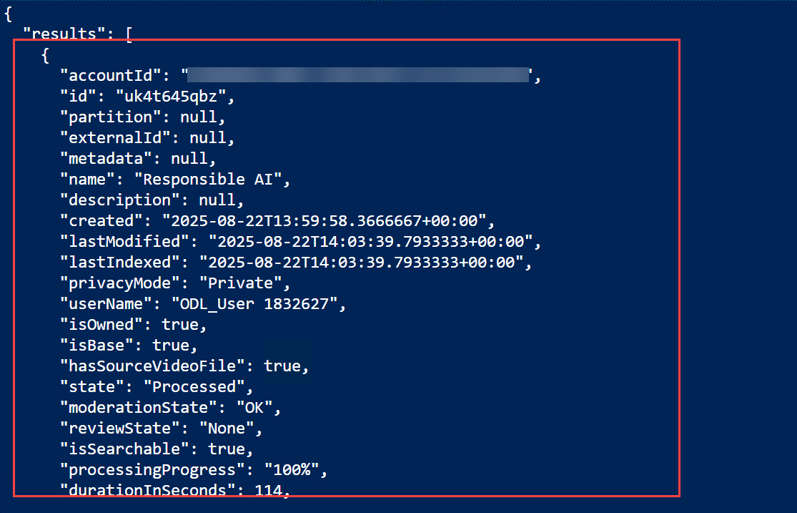


## Task 7: Use Video Indexer widgets

The Video Indexer portal is a useful interface to manage video indexing projects. However, there may be occasions when you want to make the video and its insights available to people who don't have access to your Video Indexer account. Video Indexer provides widgets that you can embed in a web page for this purpose.

1. Use the `ls` **(1)** command,to view the contents of the **video-indexer** folder. Note that it contains a **analyze-video.html (2)** file.

    

1. This is a basic HTML page to which you will add the Video Indexer **Player** and **Insights** widgets.

1. Enter the following command to edit the file:

    ```
   code analyze-video.html
    ```

     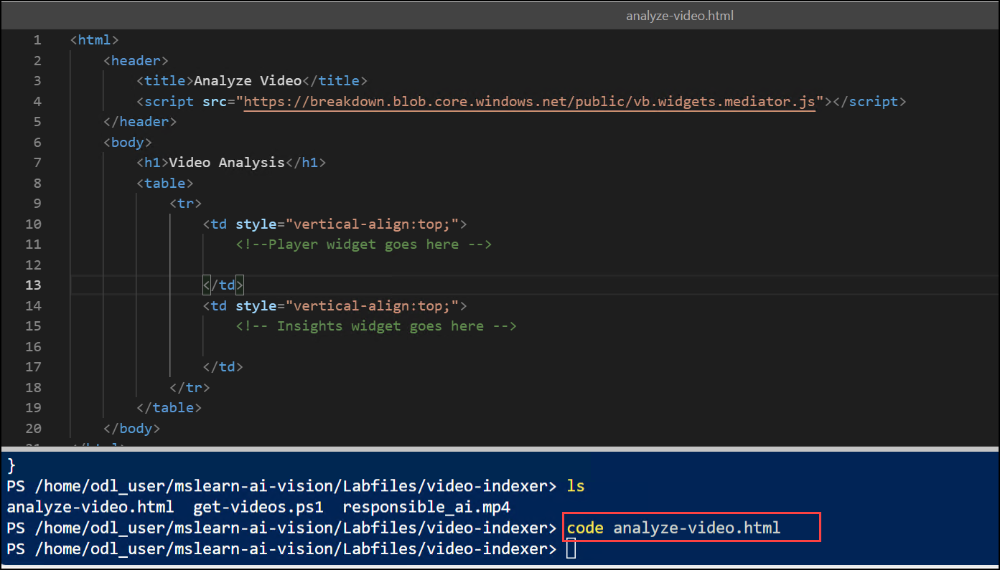    

     The file is opened in a code editor.

1. Note the reference to the **vb.widgets.mediator.js** script in the header - this script enables multiple Video Indexer widgets on the page to interact with one another.

    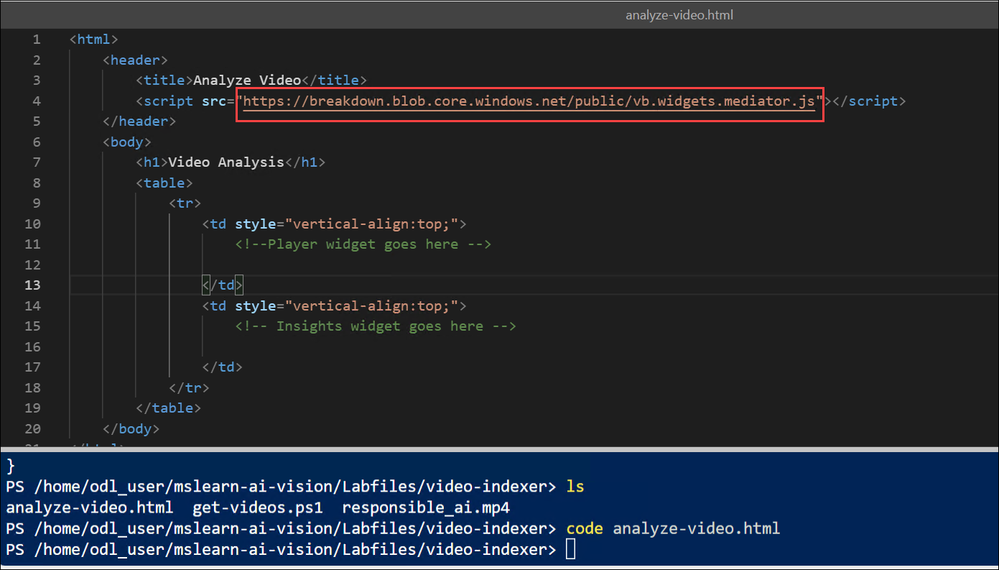 

1. In the **Video Indexer portal**, return to the **Media files (1)** page and open your **Responsible AI** video **(2)**.

    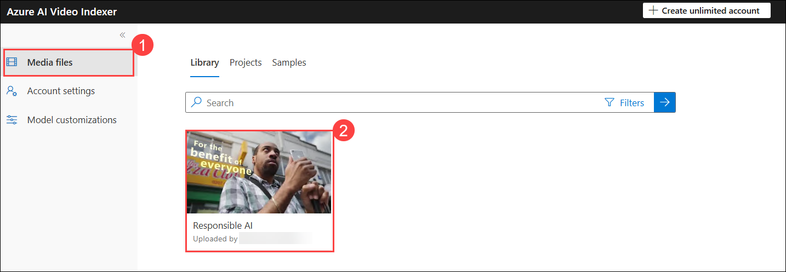

1. Under the video player, select **&lt;/&gt; Embed** to view the HTML iframe code to embed the widgets.

    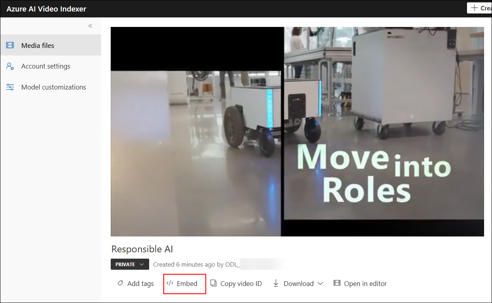

1. In the **Share and Embed** dialog box, select the **Player (1)** widget, set the video size to `560 x 315` **(2)**, and then copy the embed code to the clipboard by clicking on **Copy code (3)**.

    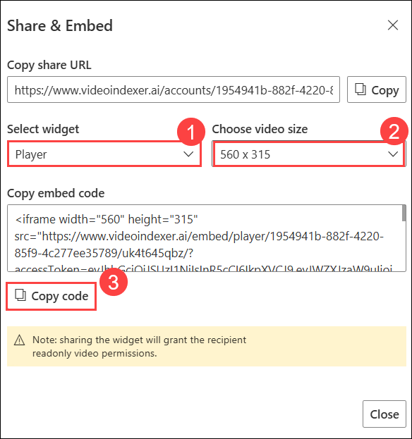

1. In the Azure portal cloud shell, in the code editor for the **analyze-video.html** file, paste the copied code under the comment **&lt;-- Player widget goes here -- &gt;**.

    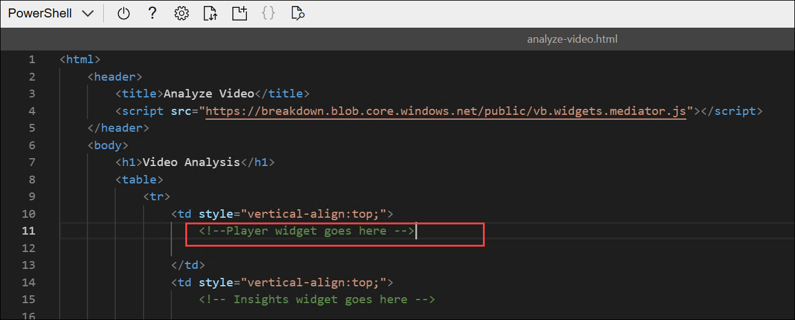
    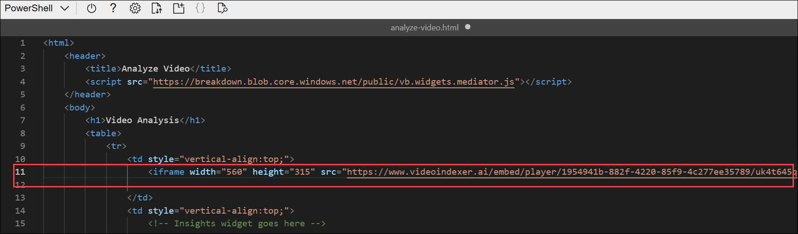    

1. Back in the Video Indexer portal, in the **Share and Embed** dialog box, select the **Insights (1)** widget and then copy the embed code to the clipboard **(2)**.

    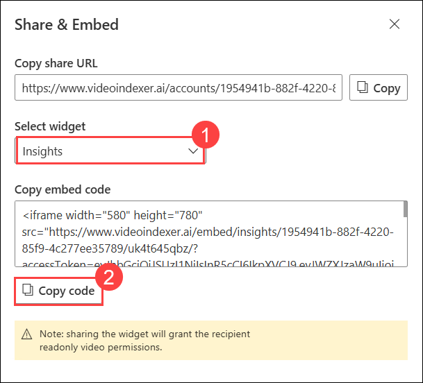  

1. Then close the **Share and Embed** dialog box, switch back to **Azure portal**, and paste the copied code under the comment **&lt;-- Insights widget goes here -- &gt;**.

    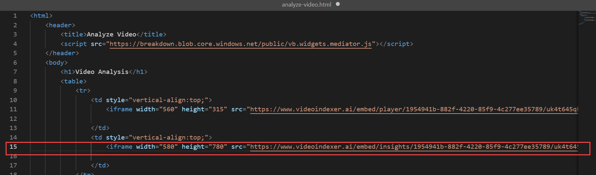

1. After editing the file, within the code editor, save your changes using **CTRL+S** and then close the code editor (*CTRL+Q*) while keeping the cloud shell command line open.

1. In the cloud shell toolbar, enter the following (Cloud shell-specific) command to download the HTML file you edited **(1)**:

    ```
    download analyze-video.html
    ```

    - The download command creates a popup link at the bottom right of your browser, which you can select to download and open the file

      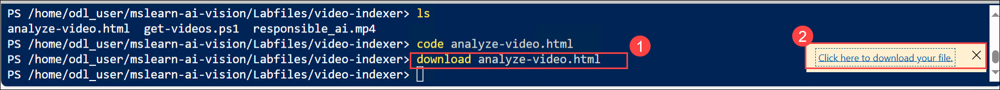

1. Select **Open file**.

    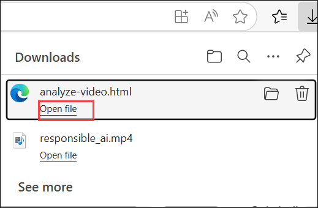

1. The file, which should look like this: 

    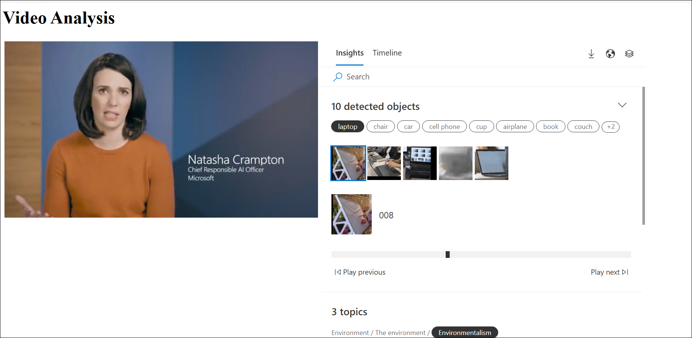

1. Experiment with the widgets, using the **Insights** widget to search for insights and jump to them in the video.     

> **Congratulations** on completing the task! Now, it's time to validate it. Here are the steps:
>
> - Hit the Validate button for the corresponding task. If you receive a success message, you can proceed to the next task.
> - If not, carefully read the error message and retry the step, following the instructions in the lab guide.
> - If you need any assistance, please contact us at cloudlabs-support@spektrasystems.com. We are available 24/7 to help.
 
<validation step="aff1dc2b-575b-4abd-b1a1-e5e92fc6c59f" />
 
---    

## Summary

In this lab, you explored how to analyze videos using **Azure Video Indexer**. You uploaded a sample video to the portal, reviewed extracted insights such as transcripts, OCR text, speakers, topics, keywords, and sentiments, and searched the video for specific insights. You then worked with the **Video Indexer REST API** in Cloud Shell by retrieving your account ID and API key, updating a PowerShell script, and running it to interact with your video programmatically. Finally, you embedded **Video Indexer widgets**, including the Player and Insights, into an HTML page to make video content and insights accessible outside the portal.

Through these steps, you learned how to use the Video Indexer portal, API, and widgets to analyze video content, extract rich metadata, and integrate video insights into custom applications.

## You have successfully completed the Hands-on Lab!


