# Lab 30: Develop a vision-enabled chat app

### Estimated Duration: 30 Minutes

## Overview

In this hands-on lab, you’ll build a vision-enabled chat app using **Azure AI Foundry**. You’ll create a project, deploy the **Phi-4-multimodal-instruct** model, and test it in the **playground** with both text and image inputs. Then, in **Azure Cloud Shell**, you’ll configure a Python client app to connect to your deployed model, extend it to handle URL-based images, and finally enable support for local image files.

By the end, you’ll know how to deploy and use a multimodal model in AI Foundry and integrate it into a custom application for text and image interactions.

## Lab Objectives

- **Task 1:** Choose a model to start a project

- **Task 2:** Test the model in the playground

- **Task 3:** Create a client application

- **Task 4:** Write code to connect to your project and get a chat client for your model

- **Task 5:** Write code to submit a URL-based image prompt

- **Task 6:** Sign into Azure and run the app

- **Task 7:** Modify the code to upload a local image file

## Task 1: Choose a model to start a project

In this task, you’ll create an Azure AI project in the Azure AI Foundry portal. You’ll start by selecting the Phi-4-multimodal-instruct model, then set up a new project that uses it. By the end, you’ll have a deployed model inside a project with an endpoint that you can use later to connect your client application.

> **Note**: AI Foundry projects can be based on an *Azure AI Foundry* resource, which provides access to AI models (including Azure OpenAI), Azure AI services, and other resources for developing AI agents and chat solutions. Alternatively, projects can be based on *AI hub* resources; which include connections to Azure resources for secure storage, compute, and specialized tools. Azure AI Foundry based projects are great for developers who want to manage resources for AI agent or chat app development. AI hub based projects are more suitable for enterprise development teams working on complex AI solutions.

1. Open a new tab in the browser, right-click on the following link [Azure AI Foundry portal](https://ai.azure.com), then **Copy link** and paste it in a browser tab to log in to **Azure AI Foundry portal**.

1. Click on **Sign in**.
 
    

1. If prompted, provide the credentials below:
 
   - **Email/Username:** <inject key="AzureAdUserEmail"></inject>
    
        

   - **Password:** <inject key="AzureAdUserPassword"></inject>
    
        

1. When the **Stay signed in?** window appears, select **No**.

    

1. Click on **X** to close the **Chat with Foundry Agent** popup window.

    

    >**Note:** Close the **Help** pane if it's open

1. In the home page, in the **Explore models and capabilities** section, search for the **`Phi-4-multimodal-instruct` (1)** model and then select **Phi-4-multimodal-instruct (2)** which we'll use in our project.

    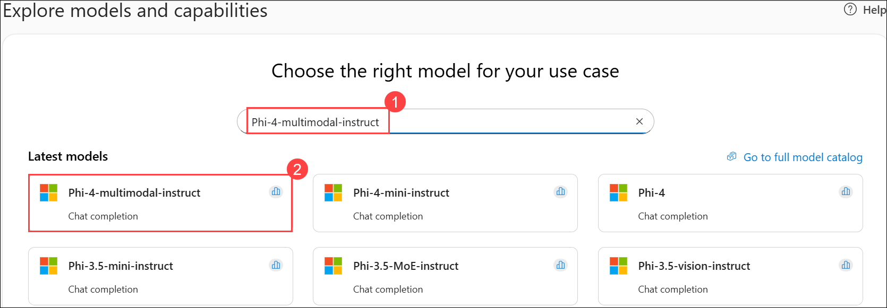

1. Then at the top of the page for the model, select **Use this model**.

    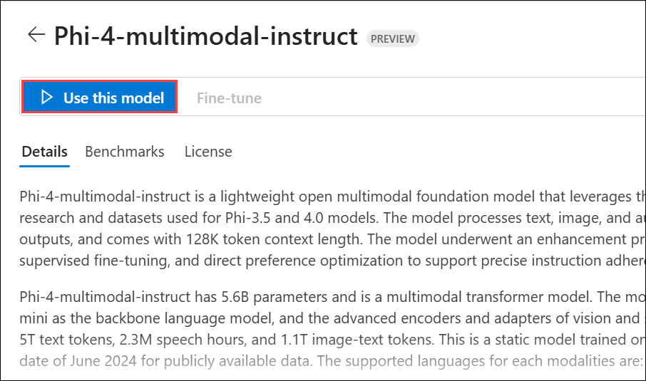

1. In the **Create a new project** window, enter **Myproject<inject key="DeploymentID"></inject> (1)** as the project name. Open the **Advanced options (2)** drop-down, fill in the following details, and then click **Create (7)**:

    * Subscription: **Choose Default Subscription (3)**
    * Resource group: **AI-102-RG30 (4)**
    * Azure AI Foundry resource: **Keep as Default (5)**
    * Region: **<inject key="Region"></inject> (6)**

        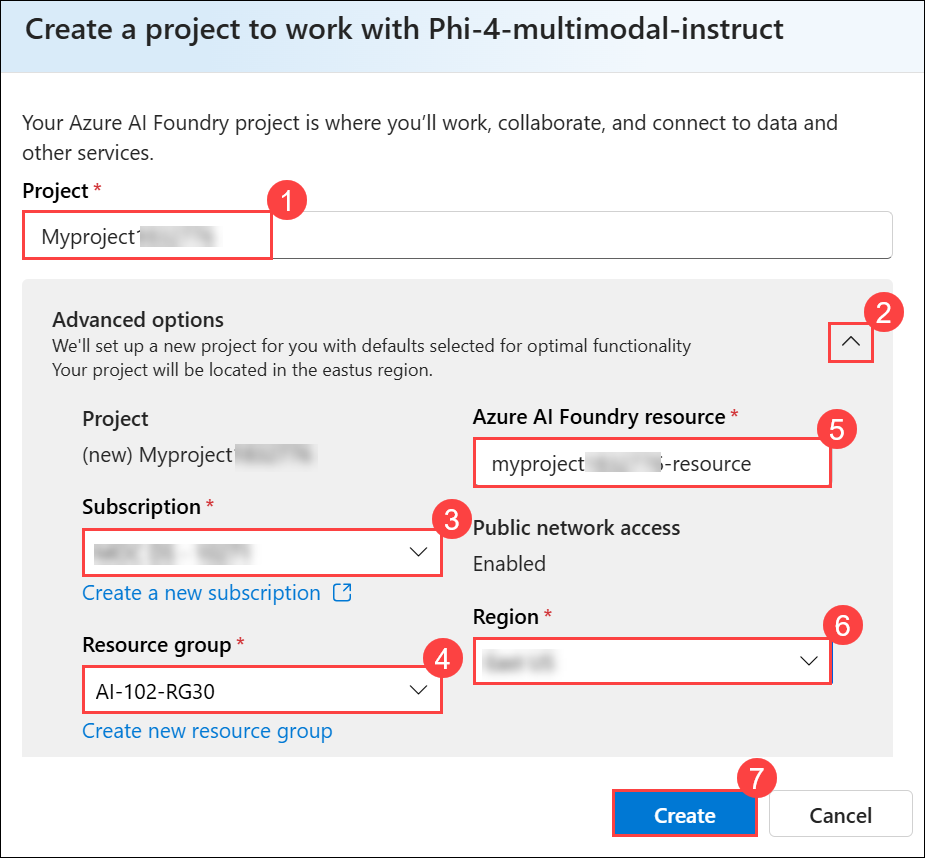

        >**Note:** Some Azure AI resources are constrained by regional model quotas. In the event of a quota limit being exceeded later in the exercise, there's a possibility you may need to create another resource in a different region. You can check the latest regional availability for specific models in the [Azure AI Foundry documentation](https://learn.microsoft.com/azure/ai-foundry/how-to/deploy-models-serverless-availability#region-availability)

        >**Note:** It may take a few moments for the operation to complete.

1. Select **Agree and Proceed** to agree to the model terms.

    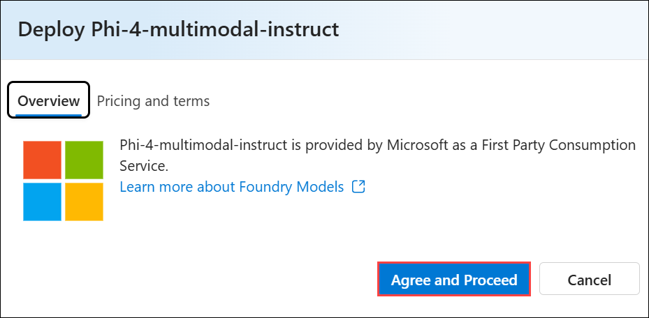

1. Then select **Deploy** to complete the Phi model deployment.

    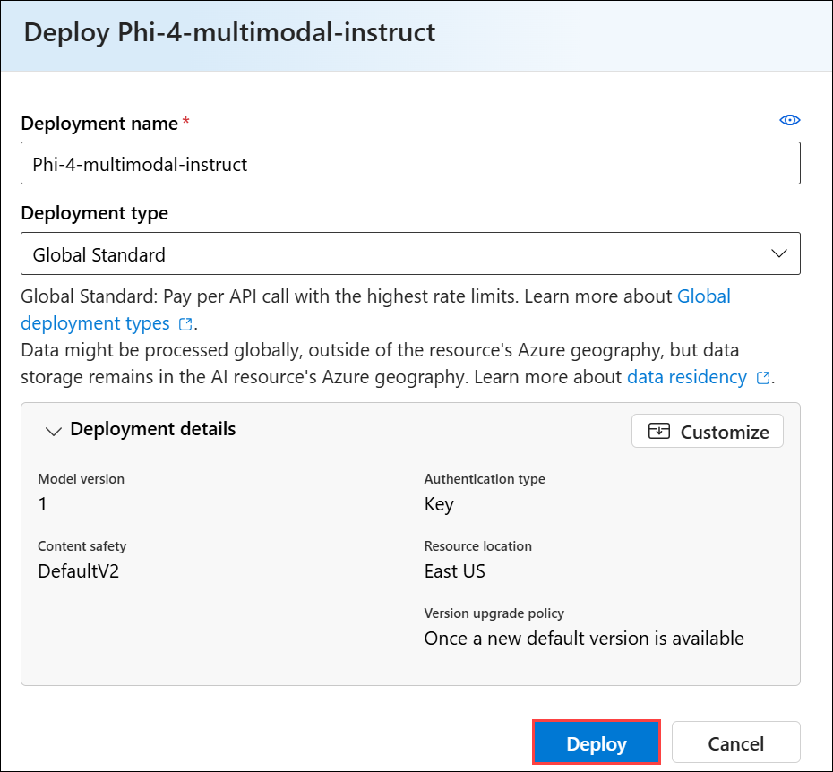

1. When your project is created, the model details will be opened automatically. Note  the name of your model deployment; which should be **Phi-4-multimodal-instruct**.

    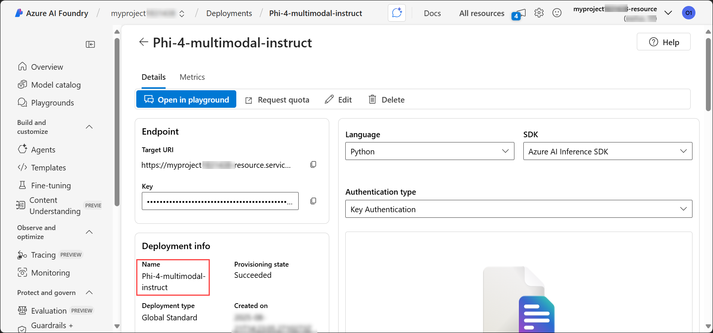

1. On the left navigation pane, click **Overview (1)** to open your project’s main page. In the **Libraries** section, locate the **Azure AI Foundry project endpoint**, then copy it by selecting the **Copy Azure AI Foundry project endpoint (2)** icon. Paste the copied value into a notepad, as you’ll need it in a later task. This endpoint will be used to connect your client application to the project.

    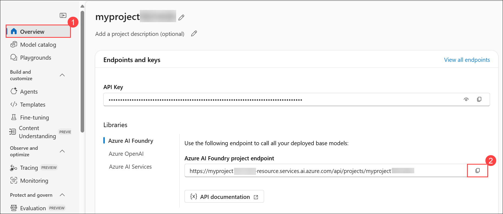

> **Congratulations** on completing the task! Now, it's time to validate it. Here are the steps:
>
> - Hit the Validate button for the corresponding task. If you receive a success message, you can proceed to the next task.
> - If not, carefully read the error message and retry the step, following the instructions in the lab guide.
> - If you need any assistance, please contact us at cloudlabs-support@spektrasystems.com. We are available 24/7 to help.
 
<validation step="4f6932c2-0e42-401c-a086-f9a534a63f9c" />

## Task 2: Test the model in the playground

In this task, you’ll test your Phi-4-multimodal-instruct model deployment in the chat playground. You’ll upload an image of a mango, combine it with a text prompt, and review the model’s response to see how it interprets and reasons over both image and text inputs.

1. Go to **Models + endpoints (1)** under **My Assets**, and select **Phi-4-multimodal-instruct (2)**.

    .png)

1. Click on **Open in playground** on the **Phi-4-multimodal-instruct** blade. 

    .png)

1. In a new browser tab, open [mango.jpeg](https://github.com/MicrosoftLearning/mslearn-ai-vision/raw/refs/heads/main/Labfiles/gen-ai-vision/mango.jpeg) from `https://github.com/MicrosoftLearning/mslearn-ai-vision/raw/refs/heads/main/Labfiles/gen-ai-vision/mango.jpeg`. Right click on the image and select **Save image as**, to save the image to a folder on your local file system.

    

1. In the **Save As** window, enter **mango (1)** as the file name and then click **Save (2)**. 

    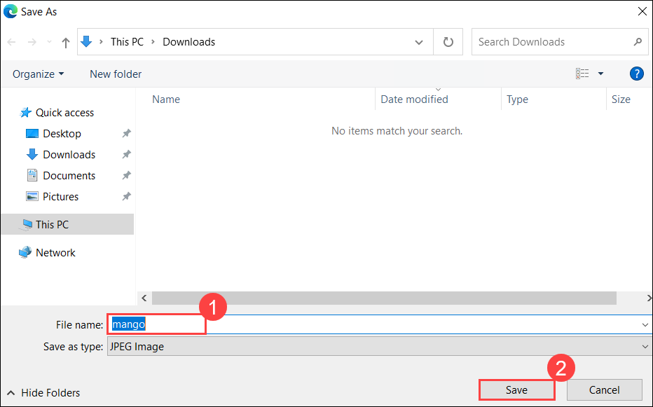

    > **Note:** Ensure that you save the file in the Downloads folder.

1. On the chat playground page, in the **Setup** pane, ensure that your **Phi-4-multimodal-instruct** model deployment is selected.

    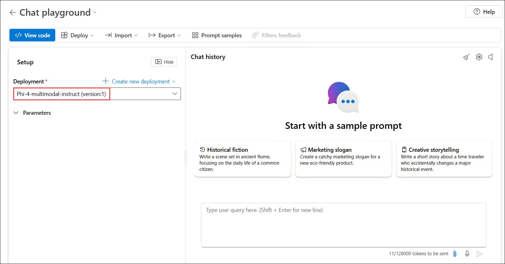

1. In the main chat panel, below the input box, click the **attach button (1)** (**📎**). In the **Open** window, select **Downloads (2)** from the left panel, choose the **mango.jpeg (3)** file, and then click **Open (4)**.

    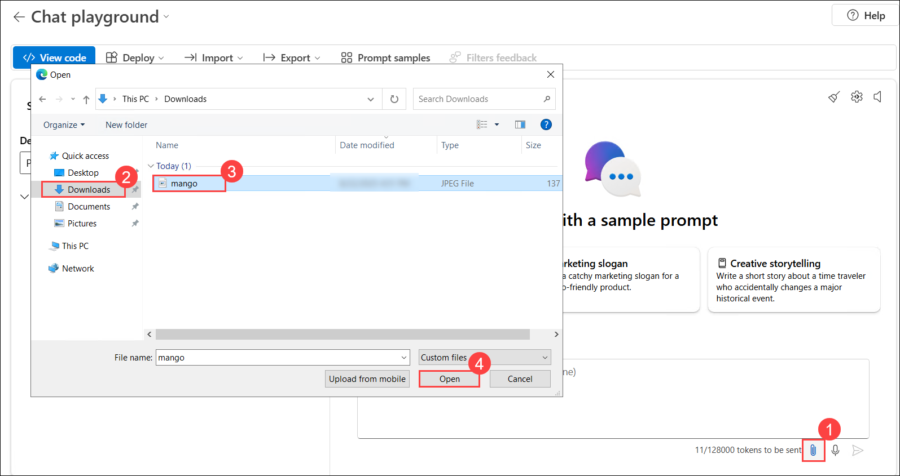

1. Then add the text **`What desserts could I make with this fruit?`** and press **Enter** to submit the prompt.

    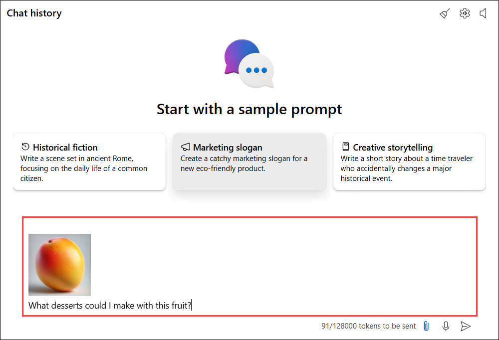

1. Review the response, which should hopefully provide relevant guidance for desserts you can make using a mango.

    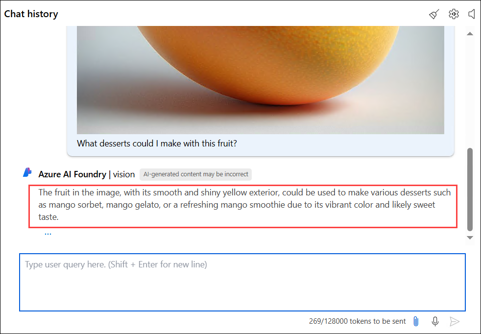

## Task 3: Create a client application

In this task, you’ll create a client application that connects to your Azure AI project. You’ll clone the provided GitHub repo, set up a Python environment in Azure Cloud Shell, install the required libraries, and configure the app with your project’s endpoint and model deployment details. This prepares the client app to interact with your deployed model.

1. On the **[Azure portal](https://portal.azure.com/)** (https://portal.azure.com/) homepage, click the **\[>\_] Cloud Shell (1)** button located to the right of the **Copilot** tab at the top. This opens a new Cloud Shell session. In the **Welcome to Azure Cloud Shell** window, choose **PowerShell (2)**.

    

    >**Note:** The cloud shell provides a command-line interface in a pane at the bottom of the Azure portal. You can resize or maximize this pane to make it easier to work in.

    > **Note:** If you have previously created a cloud shell that uses a **Bash** environment, switch it to **PowerShell**.

1. In the **Getting started** window, ensure **No storage account required (1)** is selected. From the **Subscription** drop-down, choose **Default subscription (2)**, then click **Apply (3)**.

    

1. In the Cloud Shell toolbar, open the **Settings (1)** menu and choose **Go to Classic version (2)** from the drop-down.

    

    >**Note:** Ensure you've switched to the classic version of the cloud shell before continuing.

1. In the cloud shell pane, enter the following commands to clone the GitHub repo containing the code files for this exercise (type the command, or copy it to the clipboard and then right-click in the command line and paste as plain text):

    ```
    rm -r mslearn-ai-vision -f
    git clone https://github.com/MicrosoftLearning/mslearn-ai-vision
    ```

    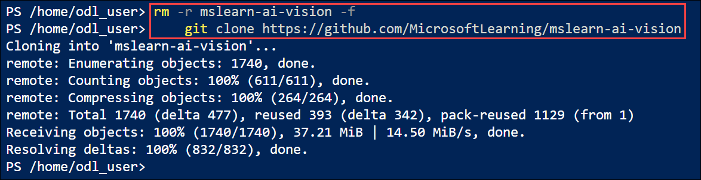

    > **Note:** As you paste commands into the cloudshell, the ouput may take up a large amount of the screen buffer. You can clear the screen by entering the `cls` command to make it easier to focus on each task.

1. After the repo has been cloned, navigate to the folder containing the application code files:  

    ```
    cd mslearn-ai-vision/Labfiles/gen-ai-vision/python
    ```

    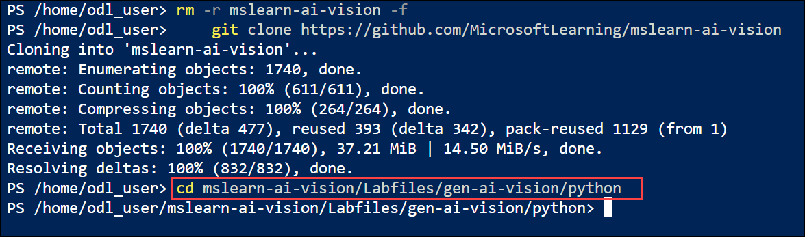

1. In the cloud shell command line pane, enter the following command to install the libraries you'll use:

    ```
    python -m venv labenv
    ./labenv/bin/Activate.ps1
    pip install -r requirements.txt azure-identity azure-ai-projects openai
    ```

1. Enter the following command to edit the configuration file that has been provided. The file is opened in a code editor.

    ```
    code .env
    ```

    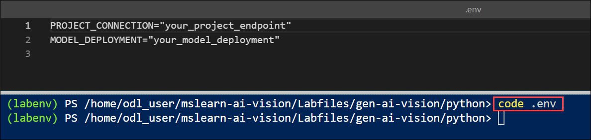

1. In the code file, replace the placeholder values with the correct details for your project:

    - your_project_endpoint: **Azure AI Foundry project endpoint (1)**
    - your_model_deployment: **Phi-4-multimodal-instruct (2)**

        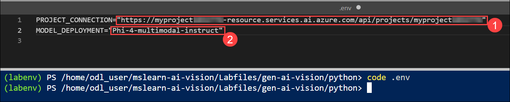

        > **Note:** Paste the **AI Foundry project endpoint** that you copied in the earlier task.

1. After you've replaced the placeholders, in the code editor, use the **CTRL+S** command or **Right-click > Save** to save your changes and then use the **CTRL+Q** command or **Right-click > Quit** to close the code editor while keeping the cloud shell command line open.

## Task 4: Write code to connect to your project and get a chat client for your model

In this task, you’ll extend your client application by writing code to connect it to your Azure AI project. You’ll import the required SDK libraries, load your configuration settings, initialize the AIProjectClient, and create a chat client for your deployed model. This sets up the foundation for sending prompts and receiving responses from the model in later tasks.

1. Enter the following command to edit the code file that has been provided:

    ```
    code chat-app.py
    ```

    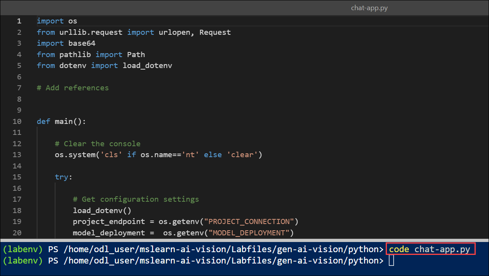

1. In the code file, note the existing statements that have been added at the top of the file to import the necessary SDK namespaces. Then, Find the comment **Add references**, add the following code to reference the namespaces in the libraries you installed previously:

    ```python
    # Add references
    from azure.identity import DefaultAzureCredential
    from azure.ai.projects import AIProjectClient
    from openai import AzureOpenAI
    ```

    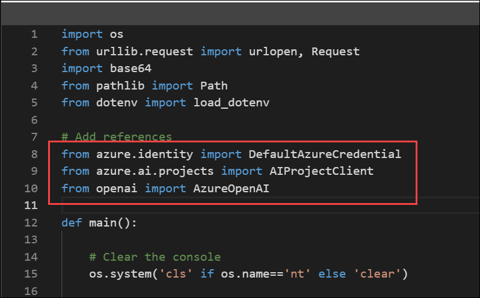

    > **Note:** As you add code, be sure to maintain the correct indentation.

1. In the **main** function, under the comment **Get configuration settings**, note that the code loads the project connection string and model deployment name values you defined in the configuration file.

    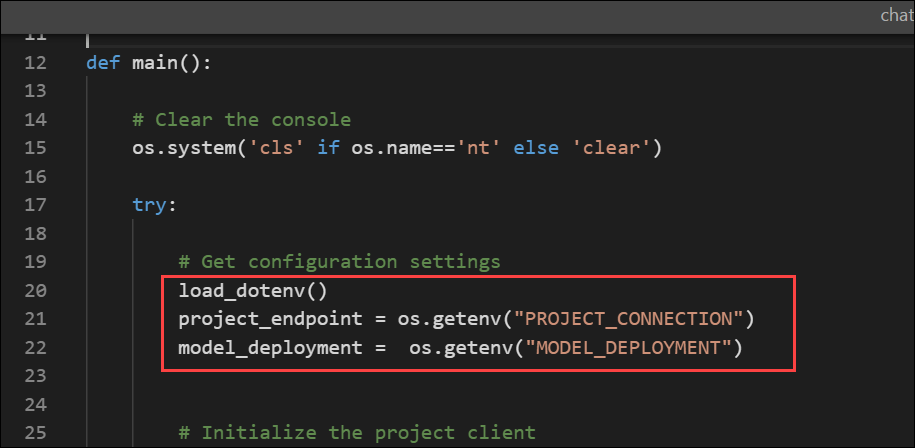

1. Find the comment **Initialize the project client**, and add the following code to connect to your Azure AI Foundry project:

    ```python
    # Initialize the project client
    project_client = AIProjectClient(            
                credential=DefaultAzureCredential(
                    exclude_environment_credential=True,
                    exclude_managed_identity_credential=True
                ),
                endpoint=project_endpoint,
            )
    ```

    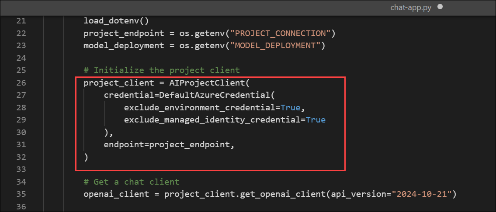

    > **Note:** Be careful to maintain the correct indentation level for your code.

1. Find the comment **Get a chat client**, and add the following code to create a client object for chatting with a model:

    ```python
    # Get a chat client
    openai_client = project_client.get_openai_client(api_version="2024-10-21")
    ```

    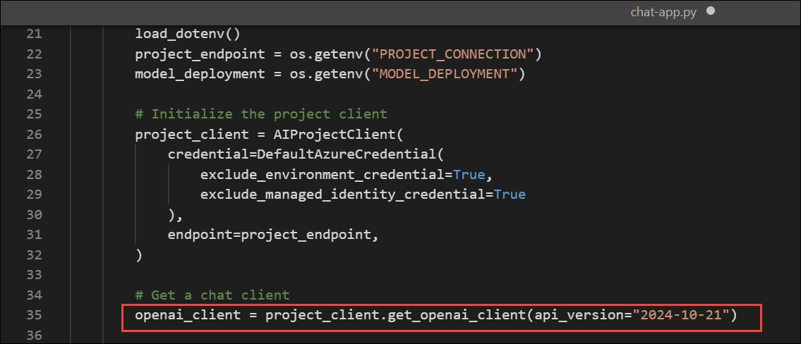

## Task 5: Write code to submit a URL-based image prompt

In this task, you’ll enhance your client application to handle URL-based image prompts. You’ll add code that retrieves an image from the web, encodes it in base64, and submits it along with a user’s text prompt to the model. This allows the application to combine both image and text inputs for richer, multimodal interactions.

1. Note that the code includes a loop to allow a user to input a prompt until they enter "quit". Then in the loop section, find the comment **Get a response to image input**, add the following code to submit a prompt that includes the following image:

    

    ```python
    # Get a response to image input
    image_url = "https://github.com/MicrosoftLearning/mslearn-ai-vision/raw/refs/heads/main/Labfiles/gen-ai-vision/orange.jpeg"
    image_format = "jpeg"
    request = Request(image_url, headers={"User-Agent": "Mozilla/5.0"})
    image_data = base64.b64encode(urlopen(request).read()).decode("utf-8")
    data_url = f"data:image/{image_format};base64,{image_data}"

    response = openai_client.chat.completions.create(
            model=model_deployment,
            messages=[
                {"role": "system", "content": system_message},
                { "role": "user", "content": [  
                    { "type": "text", "text": prompt},
                    { "type": "image_url", "image_url": {"url": data_url}}
                ] } 
            ]
    )
    print(response.choices[0].message.content)
    ```

    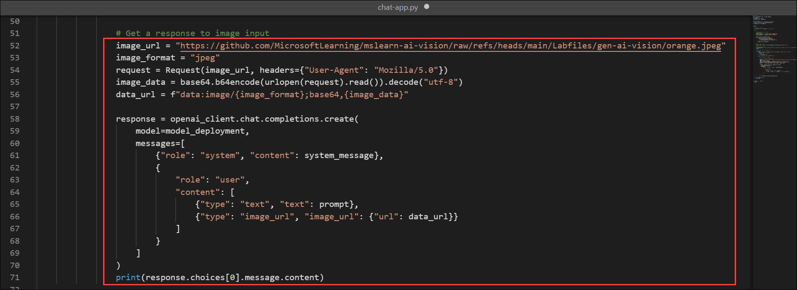

1. Use the **CTRL+S** command to save your changes to the code file - don't close it yet though.

## Task 6: Sign into Azure and run the app

In this task, you’ll sign into Azure from Cloud Shell and run your client application. You’ll authenticate using the Azure CLI, select the correct subscription, and then execute the Python app to test your deployed model. By the end, you’ll be able to send a text-and-image prompt to the model and review its response directly from your application.

1. In the cloud shell command-line pane, enter the following command to sign into Azure. Click on the **Link (1)** and copy the **code (2)** provided.

    ```
    az login
    ```

    

1. In the new browser tab, when the **Enter code to allow access** window appears, paste the copied code and select **Next**.

    

1. In the **Pick an account** dialog box, choose **ODL_User<inject key="DeploymentID"></inject>**. 

    

1. In the **Are you trying to sign in to Microsoft Azure CLI?** dialog box, click **Continue**.

    

1. When the **Microsoft Azure Cross-platform Command Line Interface** window pops up, return to the browser tab with Cloud Shell open. 

    

1. In the Cloud Shell console, press **Enter** to select the only available subscription.

    

1. After you have signed in, enter the following command to run the application:

    ```
    python chat-app.py
    ```

1. When prompted, enter the following prompt:

    ```
    Suggest some recipes that include this fruit
    ```

1. Review the response. Then enter `quit` to exit the program.

    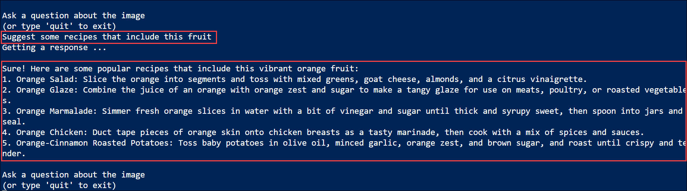

## Task 7: Modify the code to upload a local image file

In this task, you’ll modify your client application to handle local image files instead of relying on URLs. You’ll update the code to load and encode an image from your project folder, send it along with a text prompt to the model, and review the response. This demonstrates how to work with images stored locally on your machine in a multimodal app.

1. In the code editor for your app code, in the loop section, find the code you added previously under the comment **Get a response to image input**. Then modify the code as follows, to upload this local image file:

    

    ```python
    # Get a response to image input
    script_dir = Path(__file__).parent  # Get the directory of the script
    image_path = script_dir / 'mystery-fruit.jpeg'
    mime_type = "image/jpeg"

    # Read and encode the image file
    with open(image_path, "rb") as image_file:
            base64_encoded_data = base64.b64encode(image_file.read()).decode('utf-8')

    # Include the image file data in the prompt
    data_url = f"data:{mime_type};base64,{base64_encoded_data}"
    response = openai_client.chat.completions.create(
                model=model_deployment,
                messages=[
                    {"role": "system", "content": system_message},
                    { "role": "user", "content": [  
                        { "type": "text", "text": prompt},
                        { "type": "image_url", "image_url": {"url": data_url}}
                    ] } 
                ]
    )
    print(response.choices[0].message.content)
    ```

    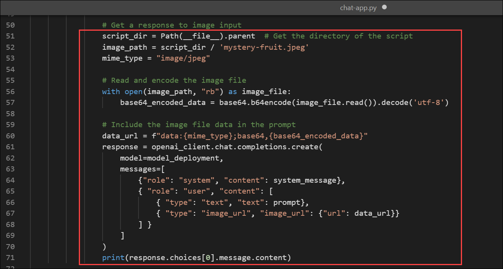

1. Use the **CTRL+S** command to save your changes to the code file. You can also close the code editor (**CTRL+Q**) if you like.

1. In the cloud shell command line pane beneath the code editor, enter the following command to run the app:

    ```
    python chat-app.py
    ```

1. When prompted, enter the following prompt:

    ```
    What is this fruit? What recipes could I use it in?
    ```

1. Review the response. Then enter `quit` to exit the program.

    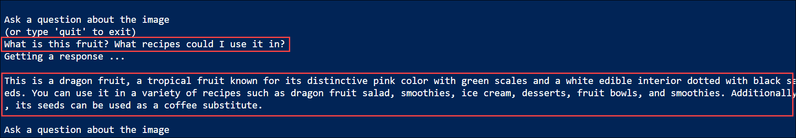

    > **Note**: In this simple app, we haven't implemented logic to retain conversation history; so the model will treat each prompt as a new request with no context of the previous prompt.

## Summary

In this lab, you created a multimodal AI solution using **Azure AI Foundry**. You provisioned an Azure AI project and deployed the **Phi-4-multimodal-instruct** model. You set up your environment in **Azure Cloud Shell**, cloned the sample Python client app, and configured it with your project endpoint and model deployment. You then tested the model in the playground with image-based prompts, extended the app to submit URL-based images, and finally modified it to process local image files.

Through these steps, you learned how to create an Azure AI project, deploy a multimodal model, connect a client application, and interact with the model using both text and image inputs. This lab demonstrates the end-to-end process of building, deploying, and consuming a multimodal AI model in a real-world scenario.

### You have successfully completed the Hands-on Lab!
