# Lab 31: Develop a vision-enabled chat app

### Estimated Duration: 30 Minutes

## Overview

In this lab, you will create a Microsoft Foundry project and deploy a vision-enabled generative AI model. You will test the model using image-based prompts in the playground. Finally, you will build and run a Python application to interact with the model using both URL and local images

## Lab Objectives

- **Task 1:** Create a Microsoft Foundry project

- **Task 2:** Deploy a model

- **Task 3:** Test the model in the playground

- **Task 4:** Create a client application

- **Task 5:** Sign into Azure and run the app

## Task 1: Create a Microsoft Foundry project

In this task, you'll sign in to the Microsoft Foundry portal and create a new project with the required Azure resources.

1. Open a new tab in the browser, right-click on the following link [Foundry portal](https://ai.azure.com), then **Copy link** and paste it in a browser tab to log in to **Microsoft Foundry portal**.

1. Click on **Sign in**.

   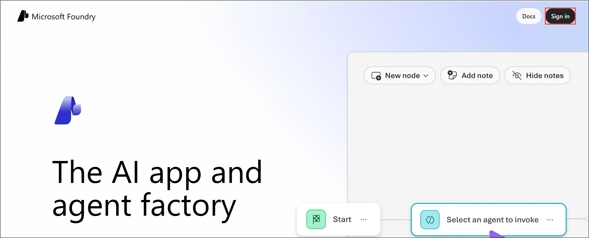 

1. If prompted, provide the credentials below:

   - **Email/Username:** <inject key="AzureAdUserEmail"></inject>

   - **Password:** <inject key="AzureAdUserPassword"></inject>

      >**Note:** Close any tips or quick start panes that are opened the first time you sign in, and if necessary, use the **Foundry** logo at the top left to navigate to the home page.

1. At the top of the **Microsoft Foundry** portal, enable the **New Foundry toggle (1)** to switch to the latest Foundry user interface.   

1. From the **Select a project to continue** dialog, click the drop-down under **Select or search for a project**, and then select **Create a new project (2)**.

    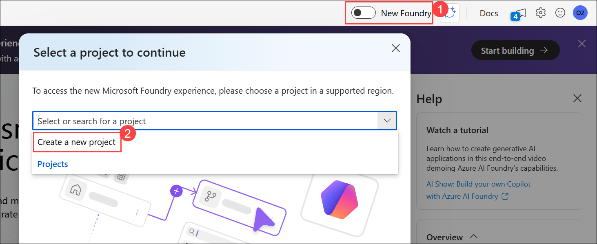 

1. In the **Create a project** window, enter **Myproject<inject key="DeploymentID" enableCopy="false"/> (1)** as the project name. Open the **Advanced options (2)** drop-down, fill in the following details, and then click **Create (6)**:

    * Subscription: **Choose Default Subscription (3)**
    * Resource group: **AI-102-RG030 (4)**
    * Microsoft Foundry resource: **Keep as Default**
    * Region: **<inject key="Region"></inject> (5)**

      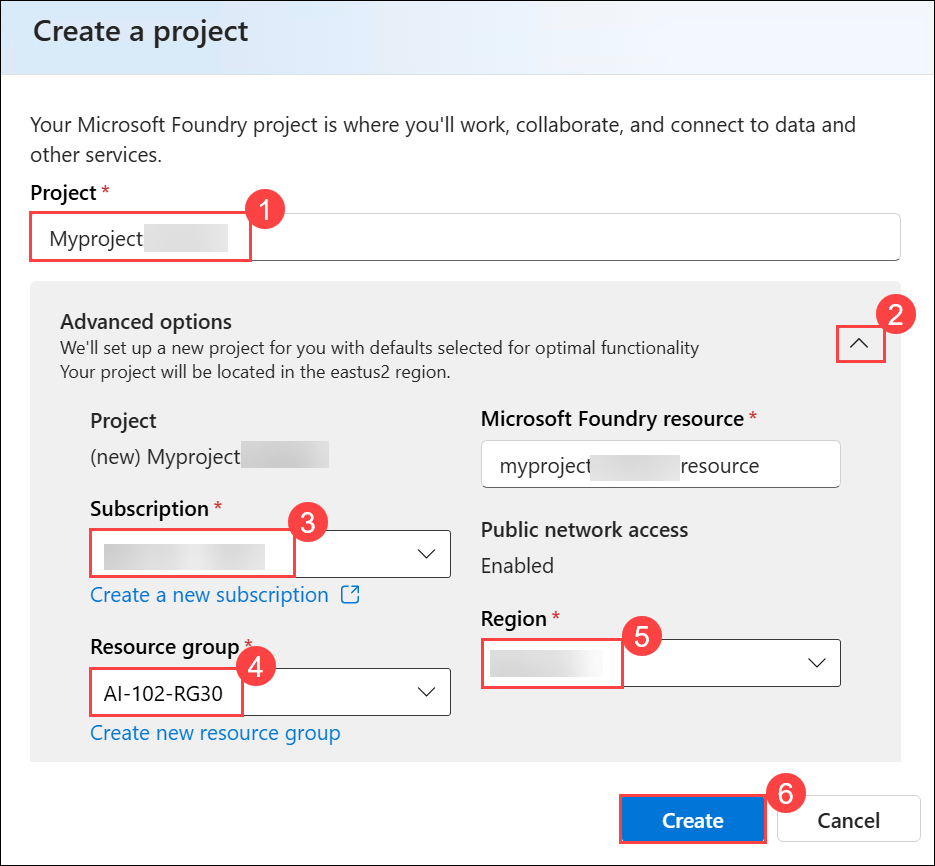 

1. Wait for your project to be created. It may take around 1-2 minutes.

1. If you see the **“Welcome to the new Microsoft Foundry”** window, you can either explore the information using **Next**, or close it by selecting the **X** in the top-right corner to continue.

    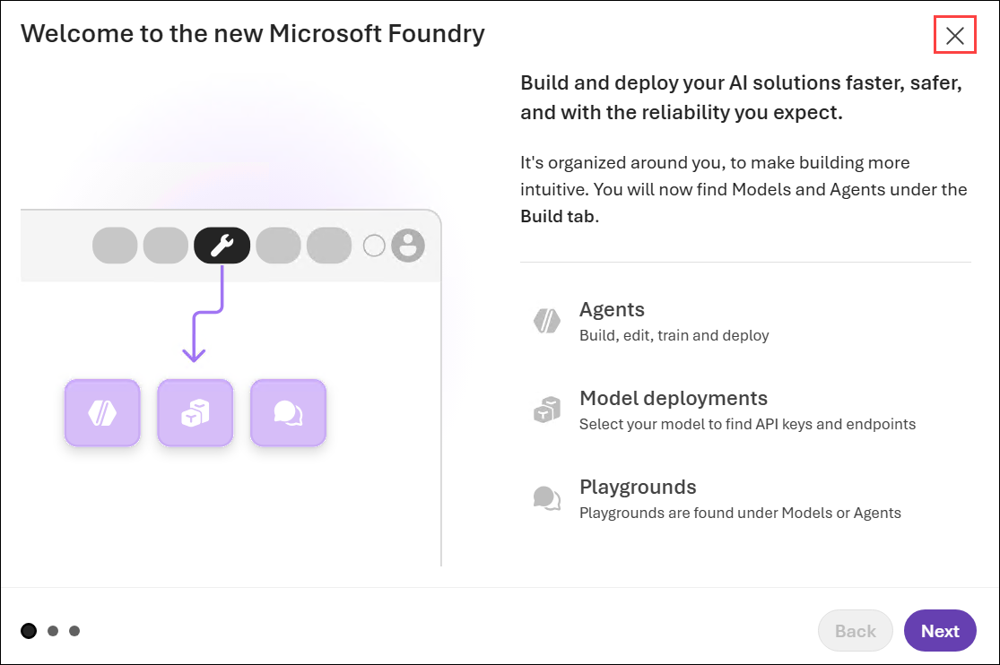

1. On the home page for your project, note the Azure OpenAI endpoint.

    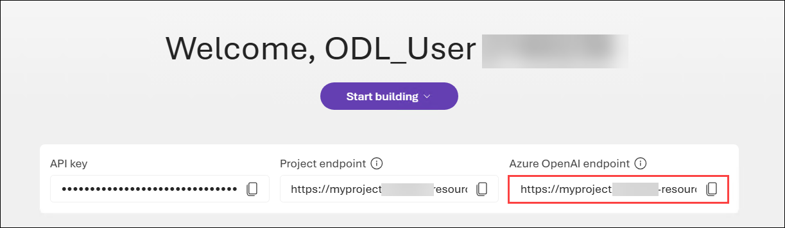

    > **Note:** Copy and save the Azure OpenAI endpoint, as you will need them later in the lab.

## Task 2: Deploy a model

In this task, you will deploy a vision-enabled generative AI model that can process both text and image inputs.

1. On the **Microsoft Foundry** home page, click **Start building (1)**, and then select **Find models (2)** from the drop-down menu.

     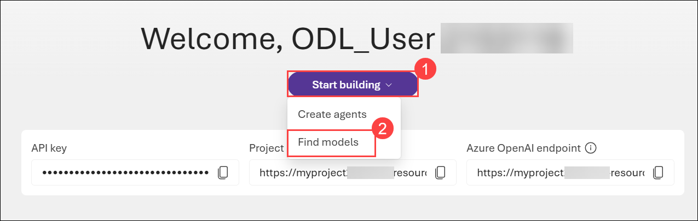

1. On the **Models** page, search for **gpt-4.1 (1)** in the search bar, and then select the **gpt-4.1 (2)** model from the search results.

     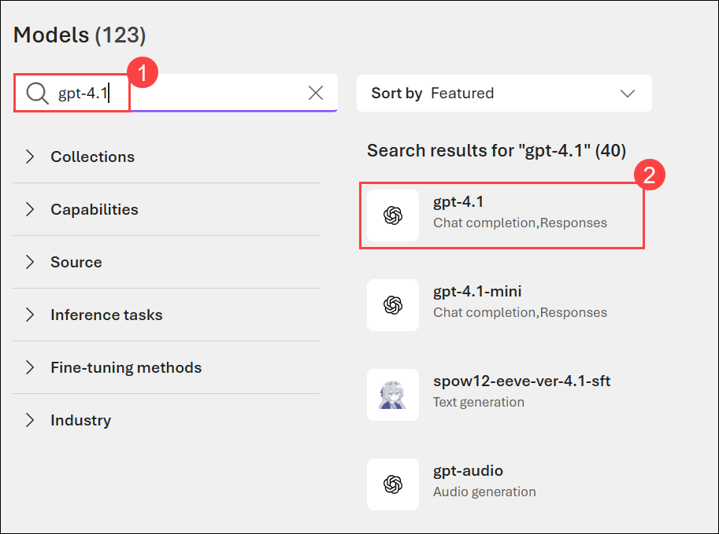

1. On the **gpt-4.1** model details page, click **Deploy (1)**, and then select **Default settings (2)** to deploy the model using the standard configuration.

    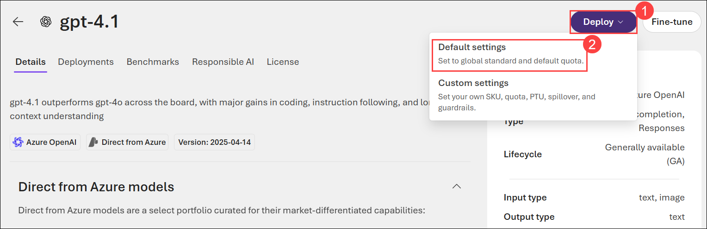

1. Once the model has been deployed, the model playground will open automatically so you can test your model:   

     > **TIP:** Note the model deployment name (which by default should be *gpt-4.1*) - you'll need this later!

> **Congratulations** on completing the task! Now, it's time to validate it. Here are the steps:
>
> - Hit the Validate button for the corresponding task. If you receive a success message, you can proceed to the next task.
> - If not, carefully read the error message and retry the step, following the instructions in the lab guide.
> - If you need any assistance, please contact us at cloudlabs-support@spektrasystems.com. We are available 24/7 to help.
 
<validation step="4f6932c2-0e42-401c-a086-f9a534a63f9c" />

## Task 3: Test the model in the playground

In this task, you will upload an image and test the model’s ability to generate responses based on image and text prompts.

1. In a new browser tab, open [mango.jpeg](https://github.com/MicrosoftLearning/mslearn-ai-vision/raw/refs/heads/main/Labfiles/gen-ai-vision/mango.jpeg) from `https://github.com/MicrosoftLearning/mslearn-ai-vision/raw/refs/heads/main/Labfiles/gen-ai-vision/mango.jpeg`. Right click on the image and select **Save image as**, to save the image to a folder on your local file system.

    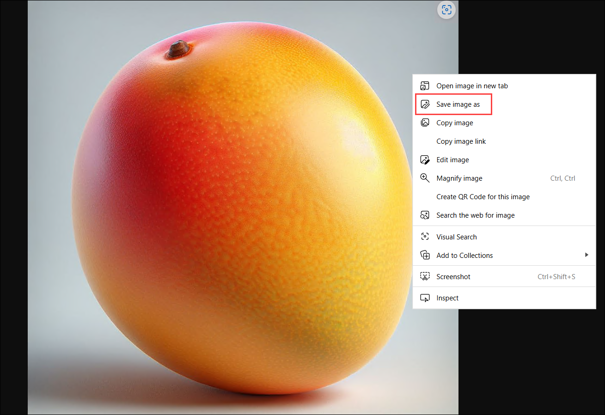

1. In the **Save As** dialog box, select **Downloads (1)**, enter **mango (1)** as the file name, and then click **Save (3)**.

    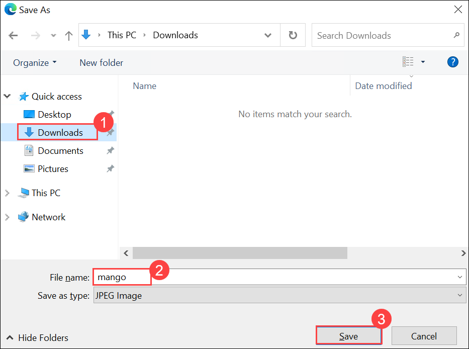

    > **Note:** Ensure that you save the file in the Downloads folder.

1. Navigate back to the chat playground page for your model deployment in the Foundry portal.

1. In the main chat panel, under the input box, click the **attach button** (**📎**). 

    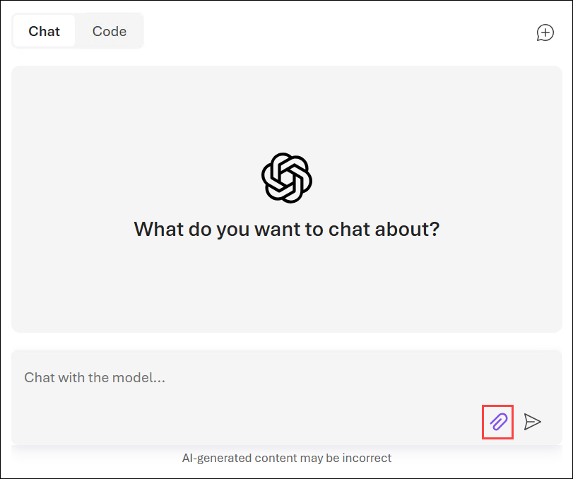

1. In the **Open** dialog box, select **Downloads (1)**, choose the file (2), and then click **Open (3)**.

    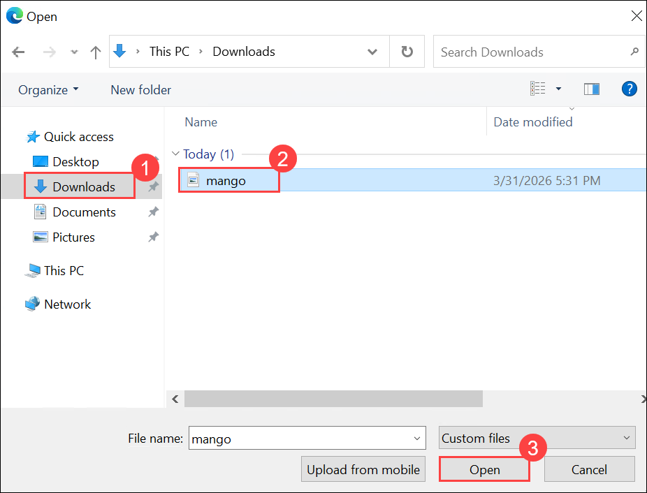

1. Then add the text **`What desserts could I make with this fruit?`** and press **Enter** to submit the prompt.

    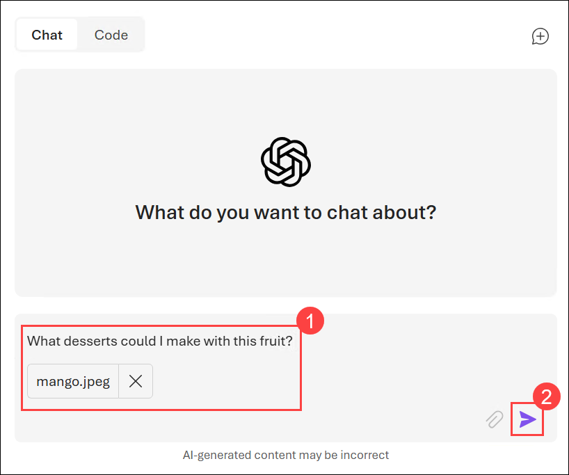

1. Review the response, which should hopefully provide relevant guidance for desserts you can make using a mango.

    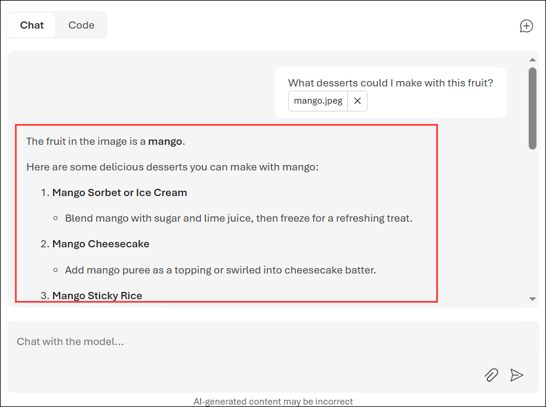

## Task 4: Create a client application

In this task, you will set up a Python-based application, configure it, and write code to interact with the deployed model using image inputs.

### Task 4.1 Get application files from GitHub

In this task, you will clone a GitHub repository and open it in Visual Studio Code to access the starter application files.

1. Open the **Visual Studio Code** from the desktop.

    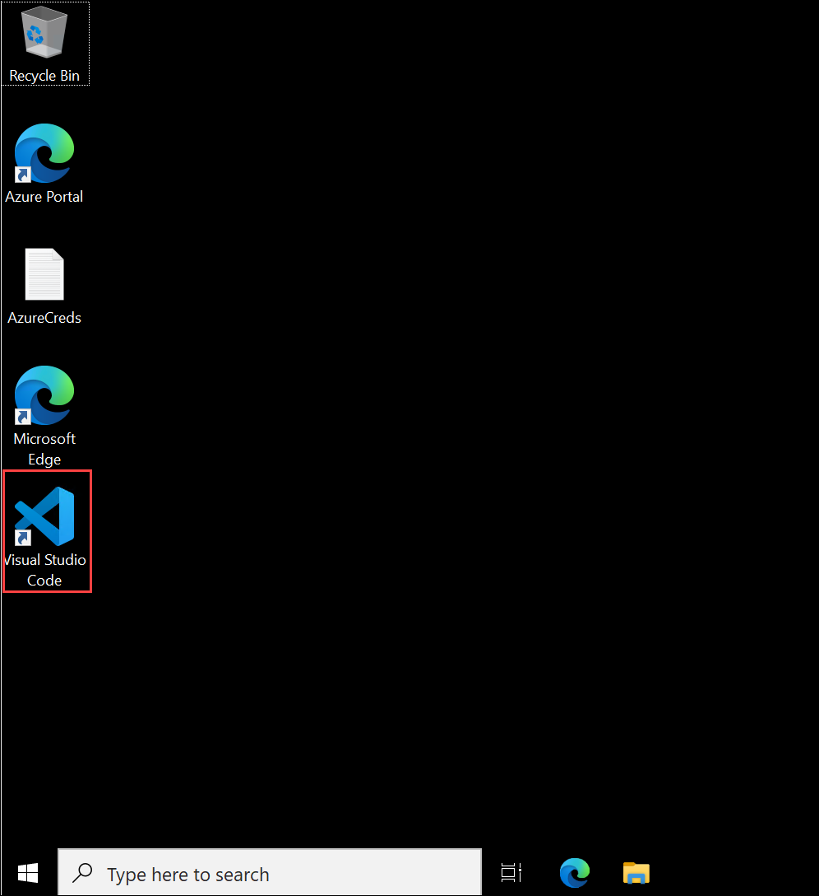

1. Open the Command Palette by pressing **Ctrl+Shift+P** , type **`Git: Clone`** **(1)**, and then select **Git: Clone** (2) from the list.

    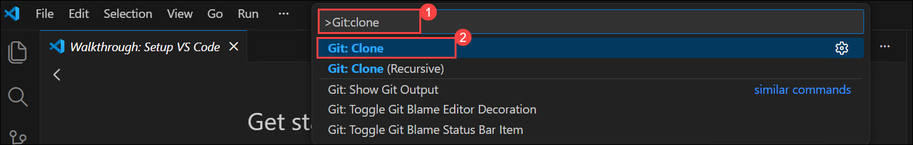

1. In the Command Palette, enter the repository URL `https://github.com/microsoftlearning/mslearn-ai-vision` **(1)**, and then select **Clone from URL** **(2)** to clone the repository to a local folder.

    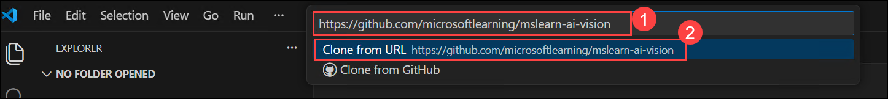
 
1. In the folder selection window, choose the **Downloads** folder **(1)**, and then select **Select as Repository Destination** **(2)**.

    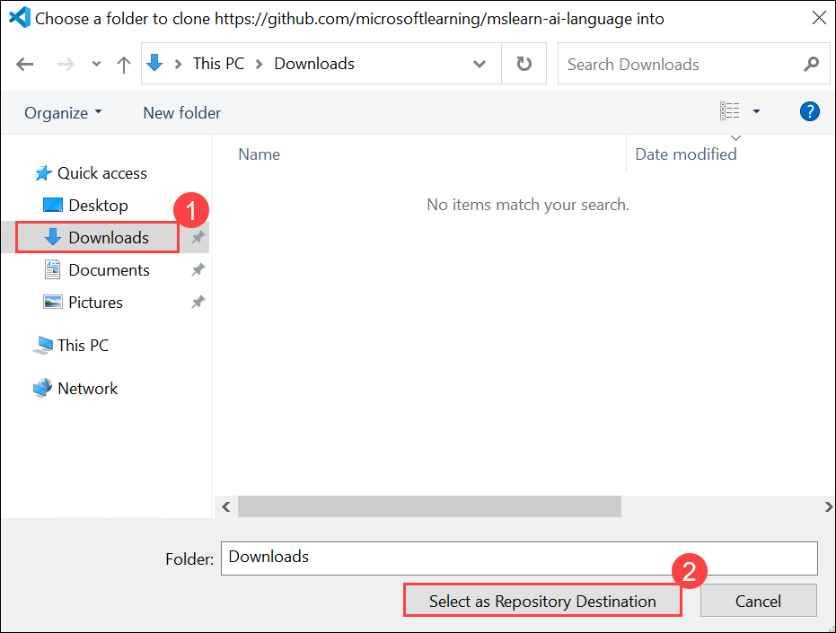

1. When prompted, select **Open** to open the cloned repository in Visual Studio Code.

    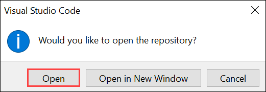

1. When prompted, select **Yes, I trust the authors** to trust the folder and enable all features.

    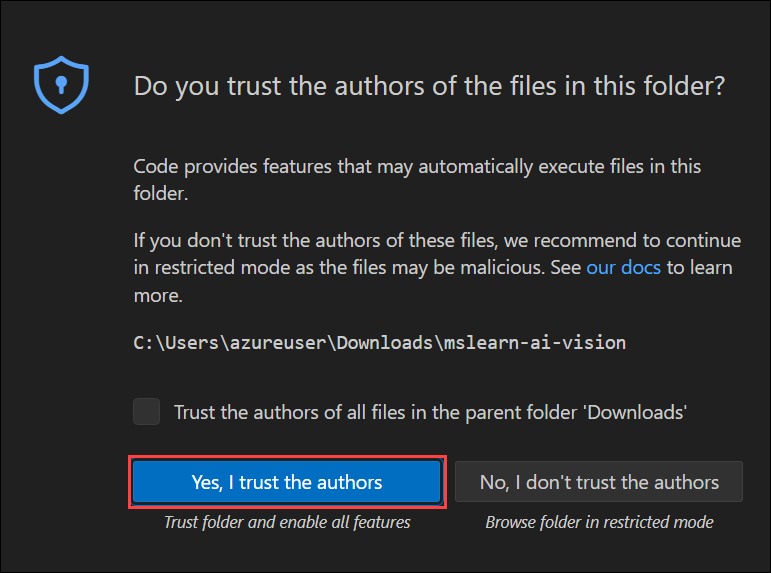

1. In Visual Studio Code, open the **Extensions** pane **(1)**, search for **Python** **(2)**, select the **Python** extension by Microsoft **(3)**, and then click **Install** **(4)** if it is not already installed.

    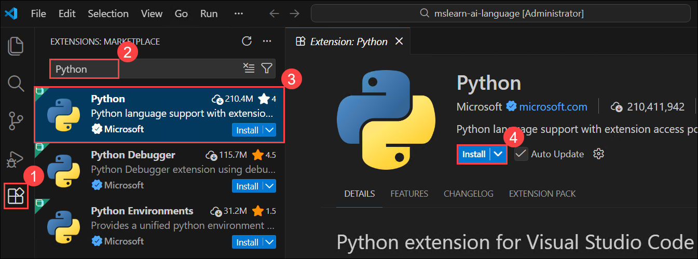

### Task 4.2 Prepare the application configuration

In this task, you will set up the development environment, install required dependencies, and configure the application with your Azure OpenAI endpoint and model details.

1. After cloning the repository, in the **Explorer** pane, expand the **Labfiles** folder **(1)**, and then navigate to **gen-ai-vision (2) > python(3)**.

    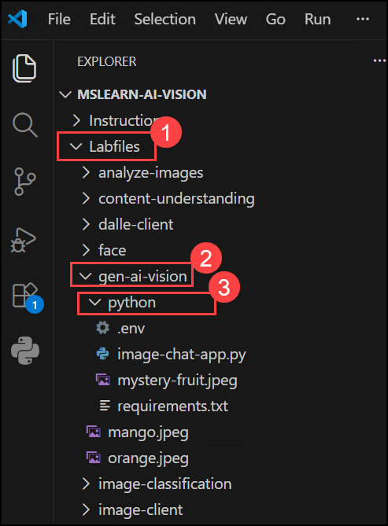

1. In the VS Code Explorer pane, review the files in the folder:

    * `.env` - A configuration file for application settings.
    * `image-chat-app.py` - The Python code file for the image application.
    * `requirements.txt` - A file listing the package dependencies.
    * `mystery-fruit.jpeg` - An image of a fruit.

1. In the **Explorer** pane, right-click the **requirements.txt** file **(1)**, and then select **Open in Integrated Terminal** **(2)**.

    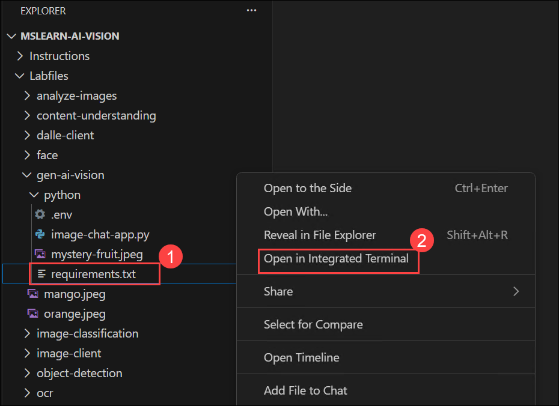

1. In the terminal, enter the following command to install the required Python packages in a virtual environment:

    ```
    python -m venv labenv
    .\labenv\Scripts\Activate.ps1
    pip install -r requirements.txt
    ```

1. In the **Explorer** pane, in the **python** folder, select the **.env (1)** file to open it. Then update the configuration values to include the **Azure OpenAI endpoint (2)** for your Foundry resource, and the model deployment name for the generative AI model you deployed (3). Finally, press **Ctrl+S** to save the changes.

    > **Important**:Be sure to add the `https://{foundry-resource-name}.openai.azure.com/openai/v1/` Azure openAI endpoint, <u>not</u> the project endpoint!

    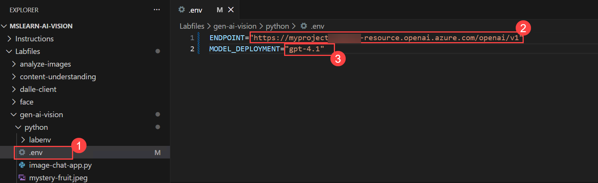

### Task 4.3 Write code to get an OpenAI chat client for your model

In this task, you will add code to authenticate and create a client connection to your deployed model using Azure credentials.

> **Tip**: As you add code, be sure to maintain the correct indentation.

1. In VS Code, open the `image-chat-app.py` file.

    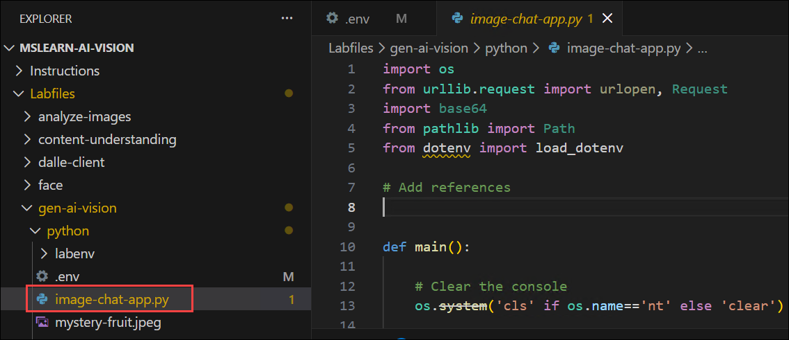

1. In the code file, note the existing statements that have been added at the top of the file to import the necessary SDK namespaces. Then, Find the comment **Add references**, add the following code to reference the namespaces in the libraries you installed previously:

    ```python
   # Add references
   from openai import OpenAI
   from azure.identity import DefaultAzureCredential, get_bearer_token_provider
    ```

    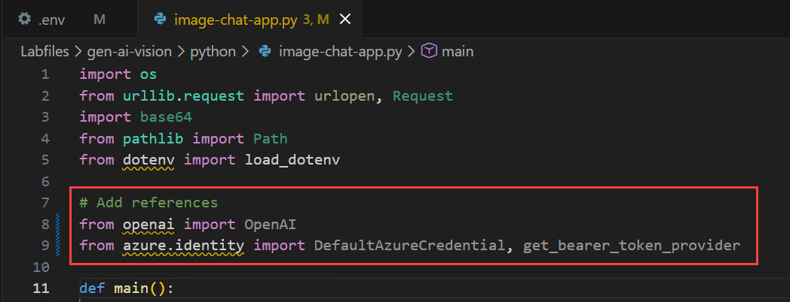

1. In the **main** function, under the comment **Get configuration settings**, note that the code loads the project connection string and model deployment name values you defined in the configuration file.

1. Find the comment **Create an OpenAI client**, and add the following code to connect to your Azure AI Foundry project:

    > **Tip**: Be careful to maintain the correct indentation level for your code.

    ```python
   # Create an OpenAI client
   credential = DefaultAzureCredential()
   token_provider = get_bearer_token_provider(credential, "https://ai.azure.com/.default")
   client = OpenAI(
       base_url=openai_endpoint,
       api_key=token_provider()
   )
    ```

    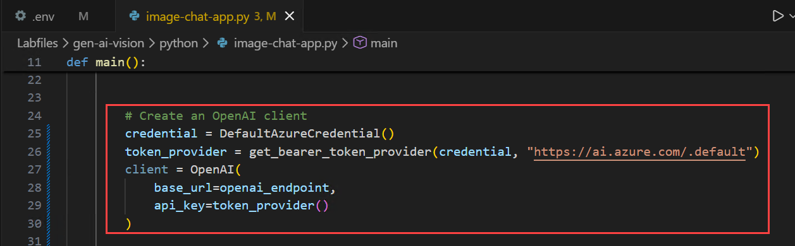

### Task 4.4 Write code to submit a URL-based image prompt

In this task, you will add code to send image-based prompts (using a URL) along with text input to the model and display the response.

1. Note that the code includes a loop to allow a user to input a prompt until they enter "quit". Then in the loop section, find the comment **Get a response to image input**, add the following code to submit a prompt that includes the following image:

    ```python
   # Get a response to image input
   image_url = "https://microsoftlearning.github.io/mslearn-ai-vision/Labfiles/gen-ai-vision/orange.jpeg"
   response = client.responses.create(
        model=model_deployment,
        input=[
            {"role": "developer", "content": system_message},
            { "role": "user", "content": [  
                { "type": "input_text", "text": prompt},
                { "type": "input_image", "image_url": image_url}
            ]} 
        ]
   )
   print(response.output_text)
    ```

    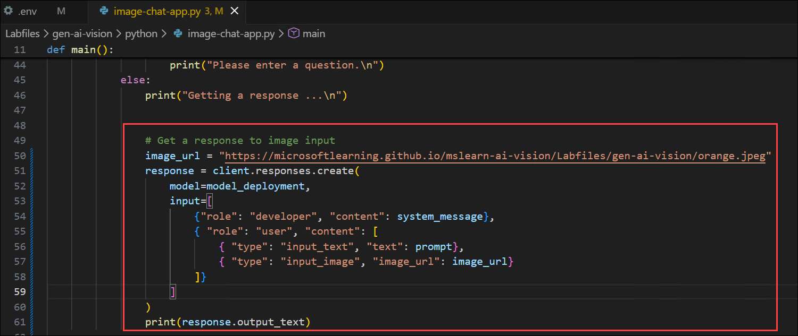

1. Save the changes to the code file by pressing **Ctrl+S**.

## Task 5: Sign into Azure and run the app

In this task, you will authenticate to Azure and run the application to test image-based interactions using both URL and local images.

1. In the Visual Studio Code terminal, enter the following command to sign into Azure

     ```powershell
     az login
     ```

     > **Note:** Minimize the VS Code to see the **Sign in** window.

1. In the **Sign in** window, select **Work or school account** **(1)**, and then select **Continue** **(2)**.

    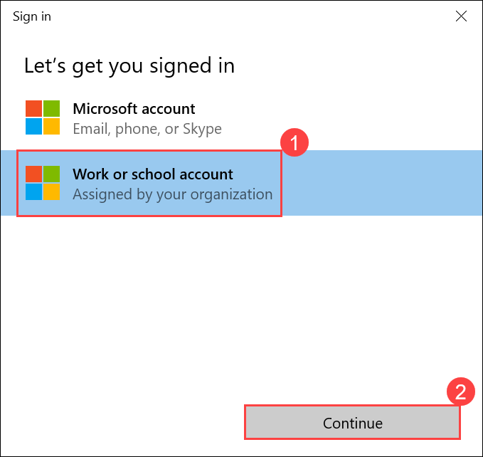

1. On the **Sign in** page, provide the credentials below:
 
    - **Email/Username:** <inject key="AzureAdUserEmail"></inject>
    
      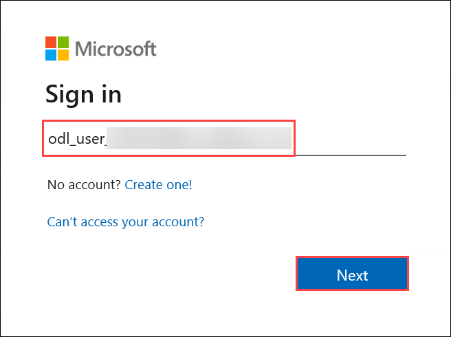

    - **Password:** <inject key="AzureAdUserPassword"></inject>
    
      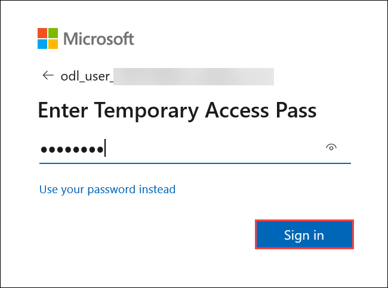

1. When prompted, select **Yes** to sign in to all apps and websites on this device.

    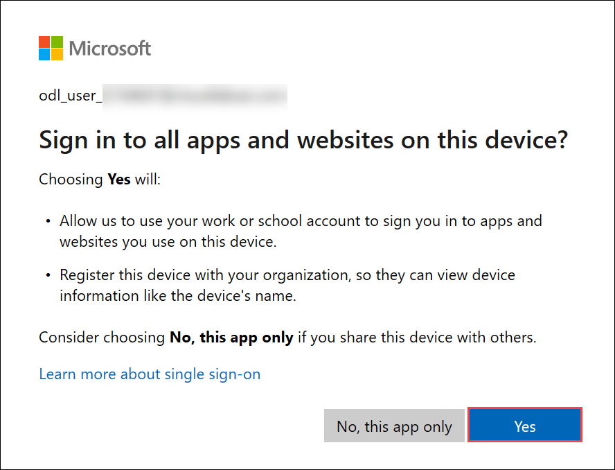

1. On the **Account added to this device** window, select **Done** to complete the sign-in process.

    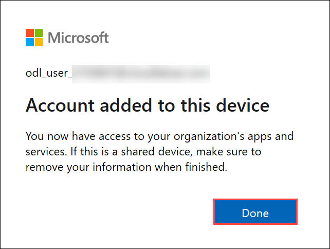

1. In the Visual Studio Code terminal, press **Enter** to select the default subscription.

    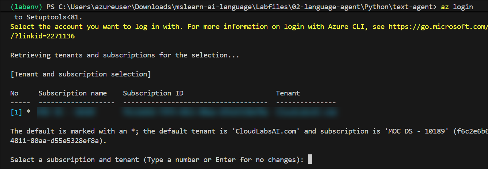

1. After you have signed in, enter the following command to run the application:

    ```
   python image-chat-app.py
    ```

1. When prompted, enter the following prompt:

    ```
   Suggest some recipes that include this fruit
    ```

    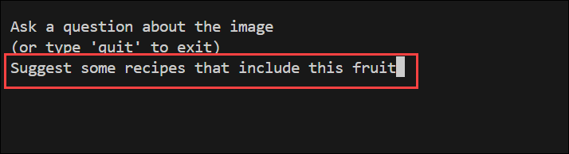

1. Review the response. Then enter `quit` to exit the program.

    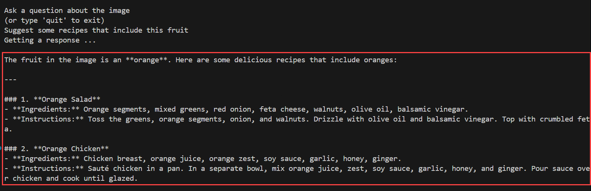

### Task 5.1 Modify the code to upload a local image file

In this task, you will update the application code to send a local image file instead of a URL, enabling the model to process and respond to locally stored images.

1. In the code editor for your app code, in the loop section, find the code you added previously under the comment **Get a response to image input**. Then modify the code as follows, to upload this local image file:

    ```python
    # Get a response to image input
    image_path = Path("mystery-fruit.jpeg")
    image_format = "jpeg"
    with open(image_path, "rb") as image_file:
            image_data = base64.b64encode(image_file.read()).decode("utf-8")

    data_url = f"data:image/{image_format};base64,{image_data}"

    response = client.responses.create(
            model=model_deployment,
            input=[
                {"role": "developer", "content": system_message},
                { "role": "user", "content": [  
                    { "type": "input_text", "text": prompt},
                    { "type": "input_image", "image_url": data_url}
                ]} 
            ]
    )
        print(response.output_text)
    ```
     
     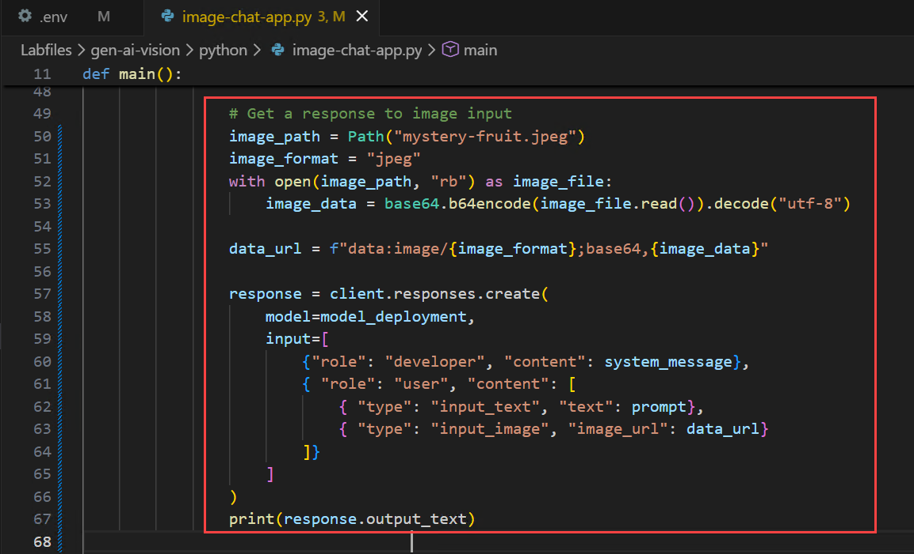

1. Use the **CTRL+S** command to save your changes to the code file.

1. In the terminal, enter the following command to run the app:

    ```
    python image-chat-app.py
    ```

1. When prompted, enter the following prompt:

    ```
    What is this fruit? What recipes could I use it in?
    ```

1. Review the response. Then enter `quit` to exit the program.

     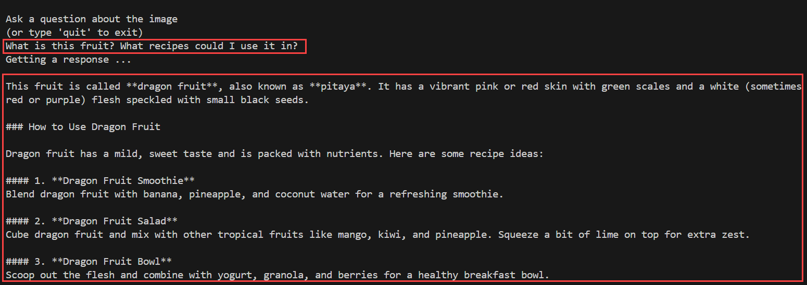

     > **Note:** In this simple app, we haven't implemented logic to retain conversation history; so the model will treat each prompt as a new request with no context of the previous prompt.

## Summary

In this lab, you created a Microsoft Foundry project and deployed a vision-enabled generative AI model. You tested the model using image-based prompts in the playground and set up a Python-based application by cloning a GitHub repository and configuring the environment. You then developed and modified the application to process both URL-based and local images along with text prompts. Finally, you ran and tested the application to understand how vision-enabled generative AI can be integrated into real-world applications.

### You have successfully completed the Hands-on Lab!
