# Lab 31: Generate images with AI

### Estimated Duration : 30 Minutes

## Overview

In this lab, you will explore the Azure OpenAI DALL-E model, a generative AI service for image creation. You’ll provision a project in Azure AI Foundry, configure a Python application in Cloud Shell, and connect it with your DALL-E deployment using endpoint and authentication details. You will then enhance the app by writing code to submit descriptive prompts, generate images, and save results locally. By the end of the lab, you will gain hands-on experience in building AI-powered applications that generate and operationalize images using Azure OpenAI DALL-E.

> **Note**: This exercise is based on pre-release SDK software, which may be subject to change. Where necessary, we've used specific versions of packages; which may not reflect the latest available versions. You may experience some unexpected behavior, warnings, or errors.

## Lab Objectives

In this lab, you'll perform the following tasks:

- **Task 1:** Choose a model to start a project

- **Task 2:** Test the model in the playground
  
- **Task 3:** Create a client application

- **Task 4:** Write code to connect to your project and chat with your model

- **Task 5:** Run the client application

## Task 1: Choose a model to start a project

In this task, you will create a new project in Azure AI Foundry and select the DALL-E model to work with. You will configure the basic project settings.

1.  Open a new tab in the browser, right-click on the following link [Azure AI Foundry portal](https://ai.azure.com), then **Copy link** and paste it in a browser tab to log in to **Azure AI Foundry portal**.

1. Click on **Sign in**.

   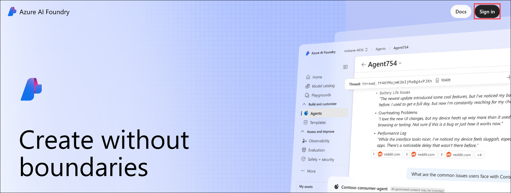 

1. If prompted, provide the credentials below:

   - **Email/Username:** <inject key="AzureAdUserEmail"></inject>

        

   - **Password:** <inject key="AzureAdUserPassword"></inject>

        

1. If prompted to **Stay signed in?**, you can click **No**.

     

1. In the home page, in the **Explore models and capabilities** section, search for the `dall-e-3` **(1)** model and select `dall-e-3` **(2)** from the results.

    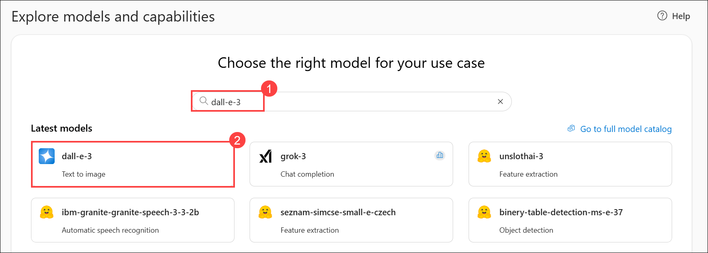 

1. On the **dall-e-3** model details page, click **Use this model** at the top to continue.  

     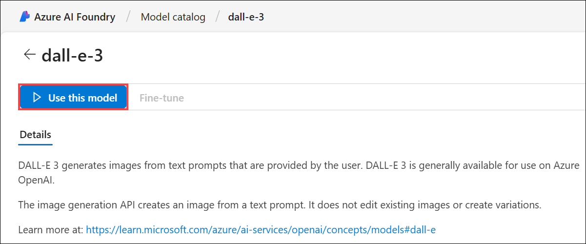 

1. In the **Create a project to work with dall-e-3** window, enter **Myproject<inject key="DeploymentID"></inject> (1)** as the project name. Open the **Advanced options (2)** drop-down, fill in the following details, and then click **Create (6)**:

    * Subscription: **Choose Default Subscription (3)**
    * Resource group: **AI-102-RG31 (4)**
    * Region: **<inject key="Region"></inject> (5)**

      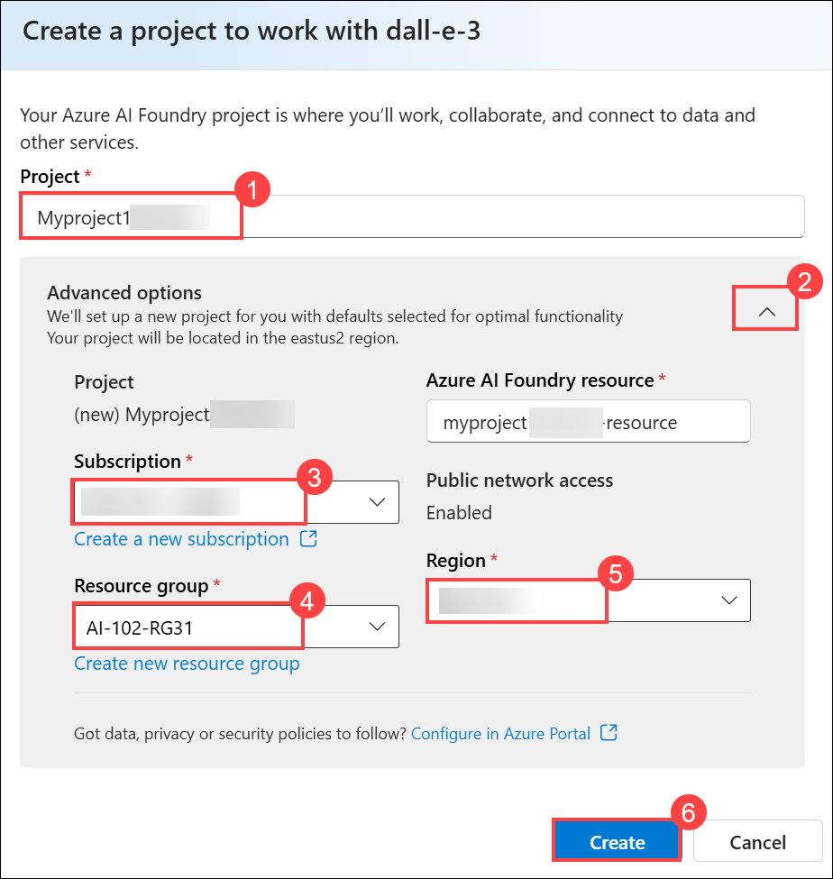 

      >**Note:** Some Azure AI resources are constrained by regional model quotas. In the event of a quota limit being exceeded later in the exercise, there's a possibility you may need to create another resource in a different region.

1. Depending on your model selection you might receive additional prompts during the project creation process. Agree to the terms and finalize the deployment.

1. On the **Deploy dall-e-3** page, keep the default settings, review the deployment details, and then click **Create resource and deploy**.  

    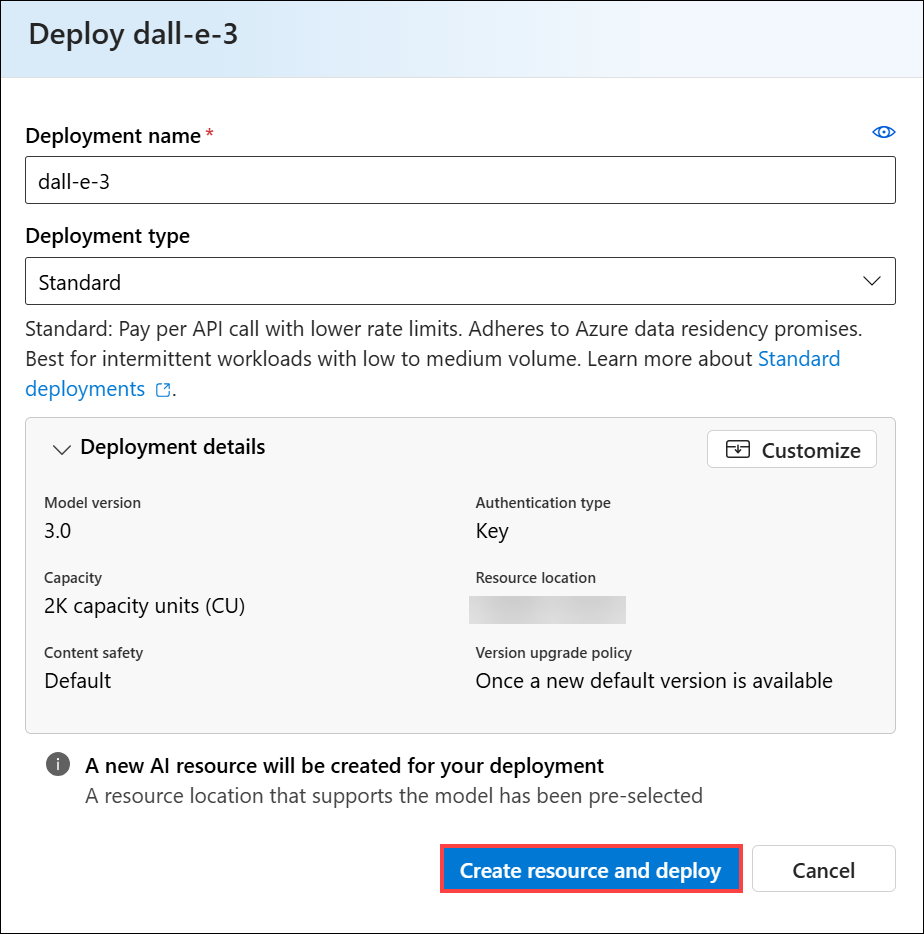 

1. When your project is created, your model will be displayed in the **Models + endpoints** page.


> **Congratulations** on completing the task! Now, it's time to validate it. Here are the steps:
>
> - Hit the Validate button for the corresponding task. If you receive a success message, you can proceed to the next task.
> - If not, carefully read the error message and retry the step, following the instructions in the lab guide.
> - If you need any assistance, please contact us at cloudlabs-support@spektrasystems.com. We are available 24/7 to help.
 
<validation step="45811d69-91ca-4c7d-8c01-61977ae4422f" />
 
---      
## Task 2: Test the model in the playground

In this task, you will use the Images playground in Azure AI Foundry to test the DALL-E model by submitting prompts and reviewing generated outputs.

1. In the left navigation pane, select **Playgrounds (1)**. Under **Images playground**, click **Try the Images playground (2)**.

    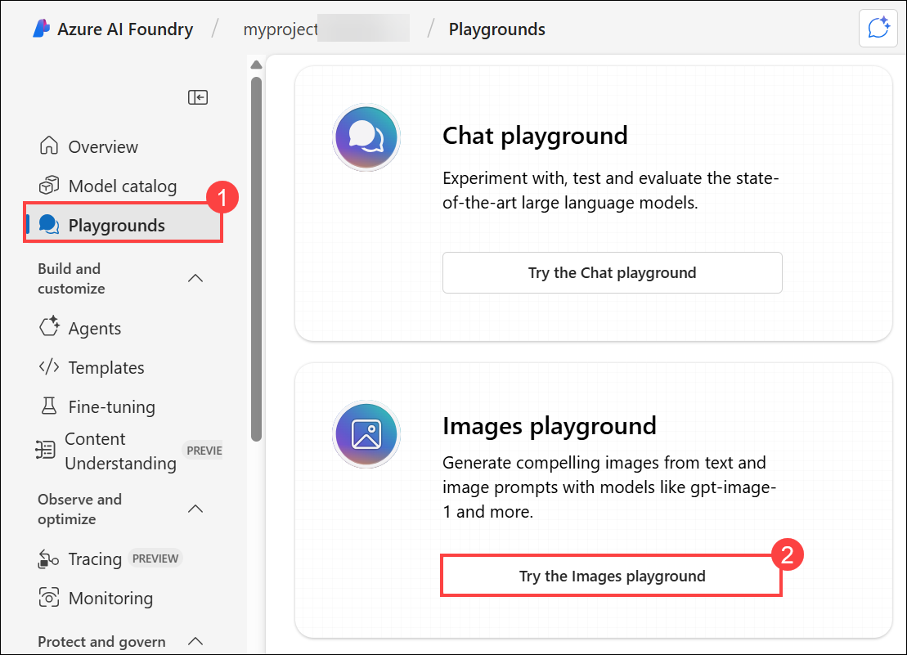 

1. On the **Images playground** page, ensure the **dall-e-3 (1)** deployment is selected. In the prompt box, enter a description such as `Create an image of a robot eating spaghetti` **(2)** and click **Generate (3)** to create the image.  

    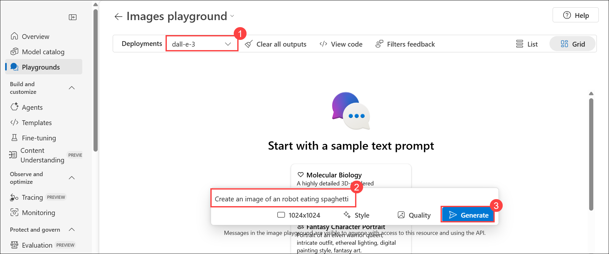 

1. Review the resulting image in the playground:

    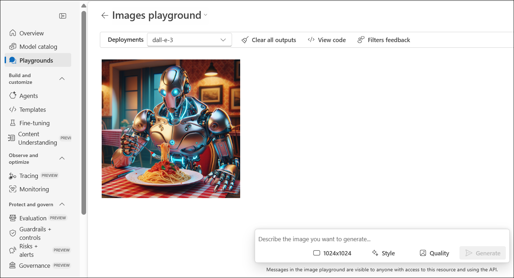 

1. Enter a follow-up prompt such as `Show the robot in a restaurant` **(1)** and click **Generate (2)**.

   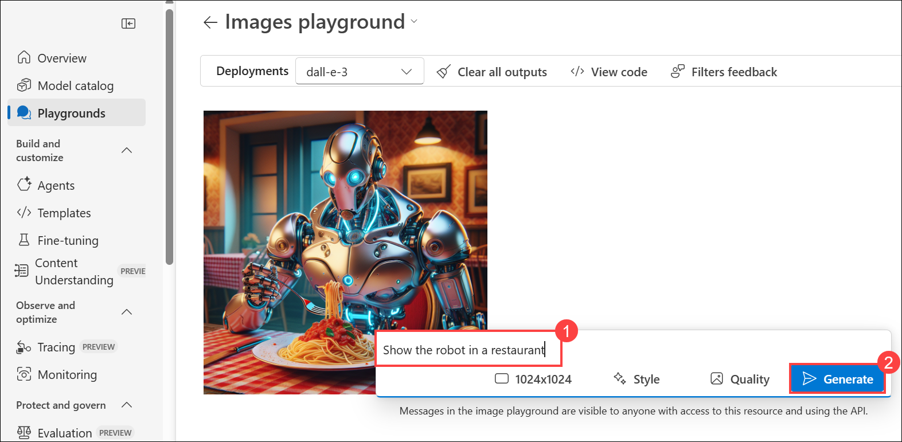

1. Review the generated image displayed in the **Images playground**. 

    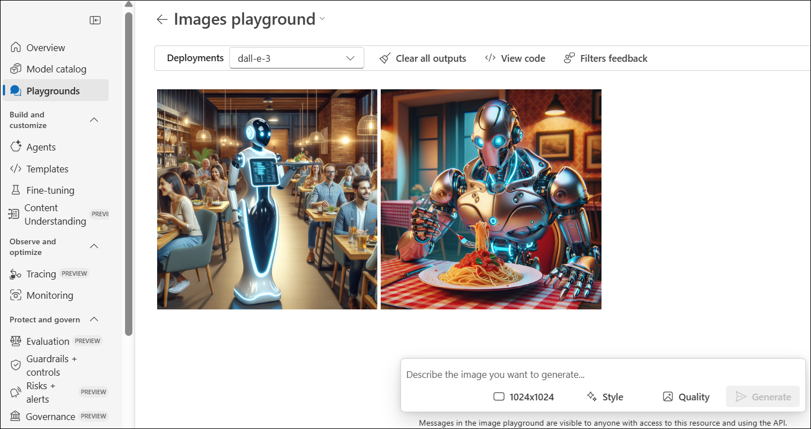 

1. Continue testing with new prompts to refine the image until you are happy with it. 

1. In the **Images playground**, select the **</> View code (1)** button at the top.  

    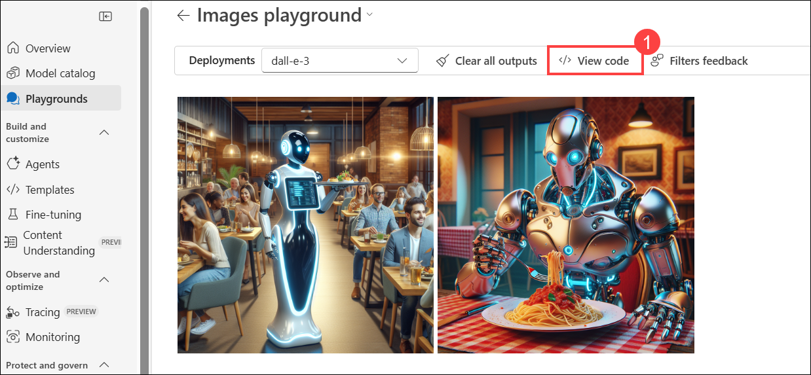 

1. On the **Entra ID authentication (2)** tab, record the following information from your deployment **(3)**:  
    * OpenAI Endpoint: 
    * OpenAI API version: 
    * Deployment name (model name): 

      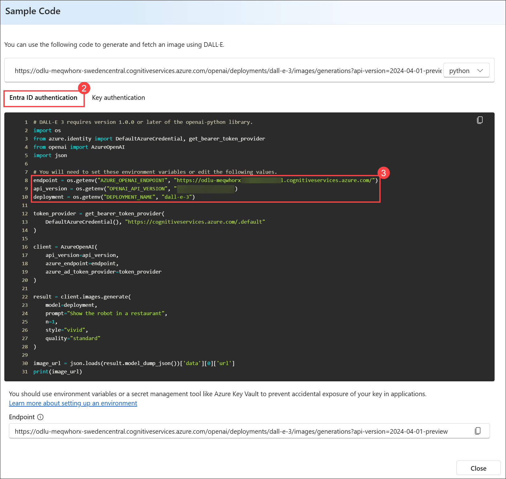 
       
       > **Note:** Copy these values into a Notepad file and save them. You will use them later in the exercise.

## Task 3: Create a client application

In this task, you will configure a Python client app in Azure Cloud Shell, install dependencies, and connect it with your DALL-E deployment.

### Prepare the application configuration

1. Open a new browser tab (keeping the Azure AI Foundry portal open in the existing tab). Then in the new tab, browse to the [Azure portal](https://portal.azure.com) at `https://portal.azure.com`; signing in with your Azure credentials if prompted.

1. On the **Azure portal** homepage, click the **\[>\_] Cloud Shell (1)** button located to the right of the **Copilot** tab at the top. This opens a new Cloud Shell session. In the **Welcome to Azure Cloud Shell** window, choose **PowerShell (2)**.

    

    

    > **Note**: If you have previously created a cloud shell that uses a **Bash** environment, switch it to **PowerShell**.

1. In the **Getting started** window, ensure **No storage account required (1)** is selected. From the **Subscription** drop-down, choose **Default subscription (2)**, then click **Apply (3)**.

    

1. In the Cloud Shell toolbar, open the **Settings (1)** menu and choose **Go to Classic version (2)** from the drop-down.

    

    >**Note:** **<font color="black">Ensure you've switched to the classic version of the cloud shell before continuing.</font>**

1. In the cloud shell pane, enter the following commands to clone the GitHub repo containing the code files for this exercise (type the command, or copy it to the clipboard and then right-click in the command line and paste as plain text):

    ```
    rm -r mslearn-ai-vision -f
    git clone https://github.com/MicrosoftLearning/mslearn-ai-vision
    ```

    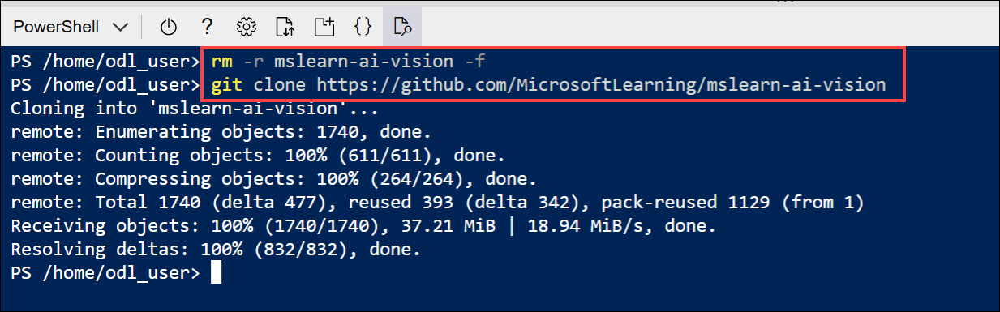 

    > **Tip**: As you paste commands into the cloudshell, the ouput may take up a large amount of the screen buffer. You can clear the screen by entering the `cls` command to make it easier to focus on each task.

1. After the repo has been cloned, navigate to the folder containing the application code files:  

    ```
   cd mslearn-ai-vision/Labfiles/dalle-client/python
    ```

    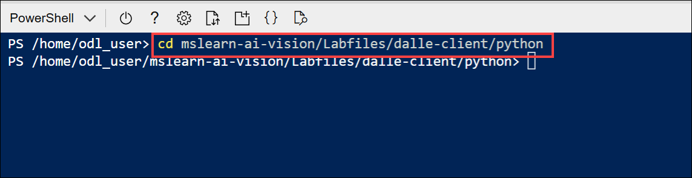 

1. In the cloud shell command line pane, enter the following command to install the libraries you'll use:

    ```
   python -m venv labenv
   ./labenv/bin/Activate.ps1
   pip install -r requirements.txt azure-identity openai requests
    ```

1. Enter the following command to edit the configuration file that has been provided. The file is opened in a code editor.

    ```
   code .env
    ```

    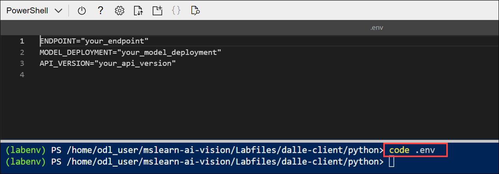 

1. Replace the **your_endpoint**, **your_model_deployment**, and **your_api_version**  placeholders with the values you recorded from the from the **Images playground**.

    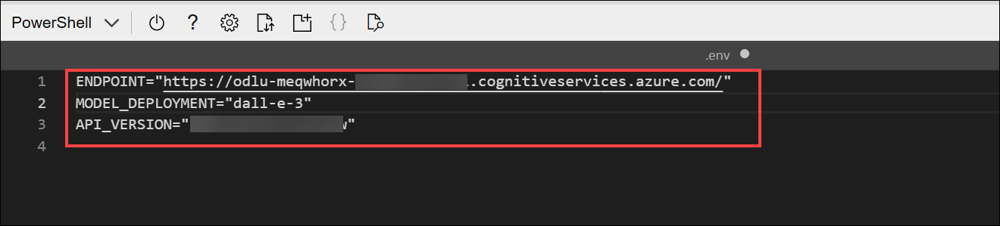 

1. After you've replaced the placeholders, use the **CTRL+S** command to save your changes and then use the **CTRL+Q** command to close the code editor while keeping the cloud shell command line open.

## Task 4: Write code to connect to your project and chat with your model

In this task, you will extend the client app by writing code that submits prompts, generates images through the DALL-E model, and saves results locally.

> **Tip**: As you add code, be sure to maintain the correct indentation.

1. Enter the following command to edit the code file that has been provided:

    ```
   code dalle-client.py
    ```

    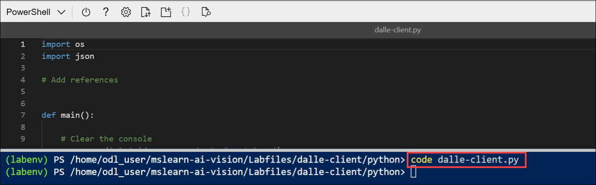 

1. In the code file, note the existing statements that have been added at the top of the file to import the necessary SDK namespaces. Then, under the comment **Add references**, add the following code to reference the namespaces in the libraries you installed previously:

    ```python
   # Add references
   from dotenv import load_dotenv
   from azure.identity import DefaultAzureCredential, get_bearer_token_provider
   from openai import AzureOpenAI
   import requests
    ```

   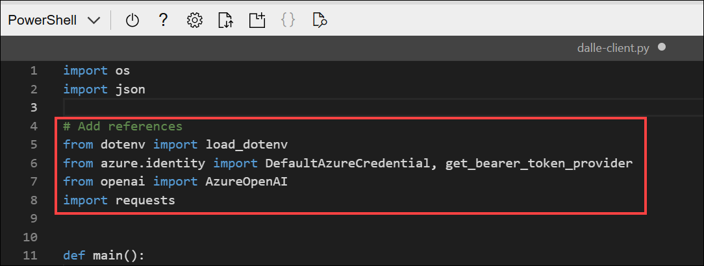 

1. In the **main** function, under the comment **Get configuration settings**, note that the code loads the endpoint, API version, and model deployment name values you defined in the configuration file.

1. Under the comment **Initialize the client**, add the following code to connect to your model using the Azure credentials you are currently signed in with:

    ```python
   # Initialize the client
   token_provider = get_bearer_token_provider(
       DefaultAzureCredential(exclude_environment_credential=True,
           exclude_managed_identity_credential=True), 
       "https://cognitiveservices.azure.com/.default"
   )
    
   client = AzureOpenAI(
       api_version=api_version,
       azure_endpoint=endpoint,
       azure_ad_token_provider=token_provider
   )
    ```

    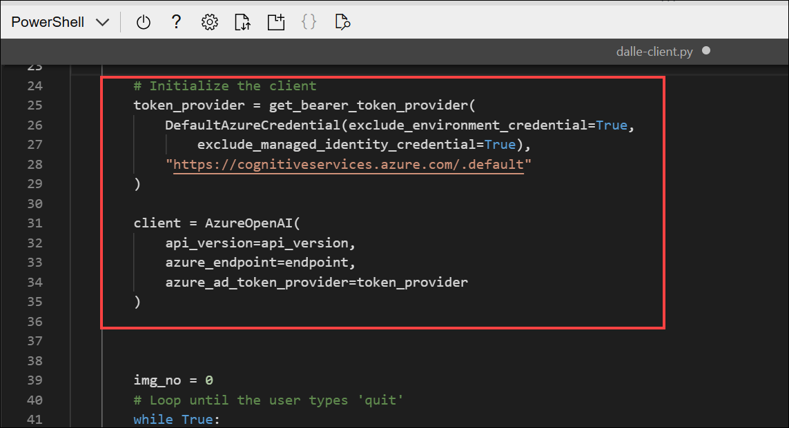 

1. Note that the code includes a loop to allow a user to input a prompt until they enter "quit". Then in the loop section, under the comment **Generate an image**, add the following code to submit the prompt and retrieve the URL for the generated image from your model:

    **Python**

    ```python
   # Generate an image
   result = client.images.generate(
        model=model_deployment,
        prompt=input_text,
        n=1
    )

   json_response = json.loads(result.model_dump_json())
   image_url = json_response["data"][0]["url"] 
    ```

     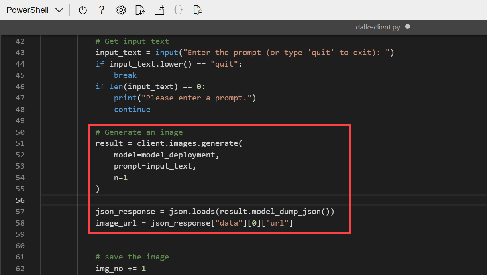 

1. Note that the code in the remainder of the **main** function passes the image URL and a filename to a provided function, which downloads the generated image and saves it as a .png file.

1. Use the **CTRL+S** command to save your changes to the code file and then use the **CTRL+Q** command to close the code editor while keeping the cloud shell command line open.

## Task 5: Run the client application

In this task, you will run the Python app in Cloud Shell, test it with prompts, and download the generated images for verification.

1. In the Cloud Shell command-line pane, enter the following command **(1)** to sign into Azure. Click the **link (2)** displayed in the output and Copy the **code (3)** provided to authenticate.  

    ```
    az login
    ```
    
    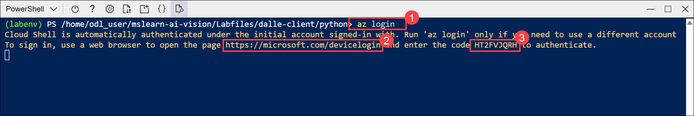
   
    >**Note:** **<font color="red">You must sign into Azure - even though the cloud shell session is already authenticated.</font>**

    >**Note:** In most scenarios, just using *az login* will be sufficient. However, if you have subscriptions in multiple tenants, you may need to specify the tenant by using the *--tenant* parameter. See [Sign into Azure interactively using the Azure CLI](https://learn.microsoft.com/cli/azure/authenticate-azure-cli-interactively) for details.

1. In the new browser tab, when the **Enter code to allow access window** appears, paste the copied code **(1)** and select **Next (2)**.

    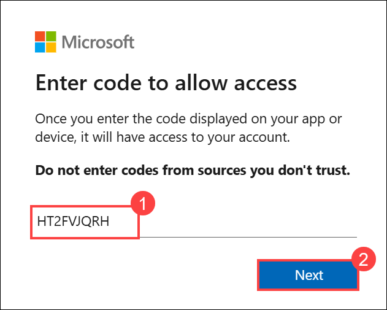

1. On the **Pick an account** page, select the **ODL_User<inject key="DeploymentID"></inject>** to sign in.  

    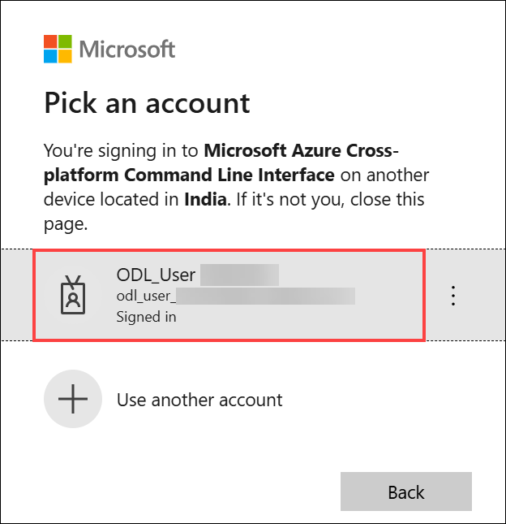

1. In the **Are you trying to sign in to Microsoft Azure CLI?** dialog box, click **Continue**.

     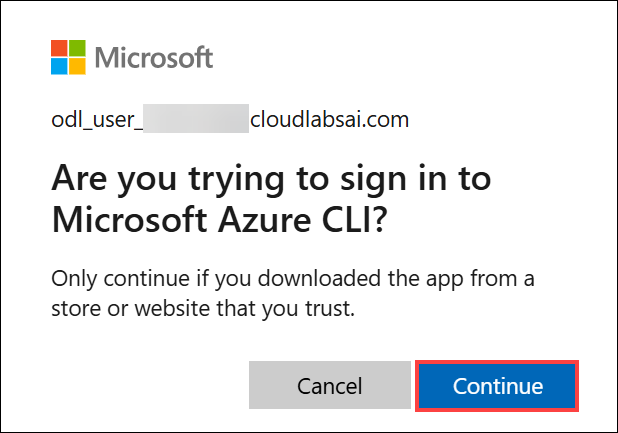

1. When the **Microsoft Azure Cross-platform Command Line Interface** window pops up, return to the browser tab with Cloud Shell open. 

    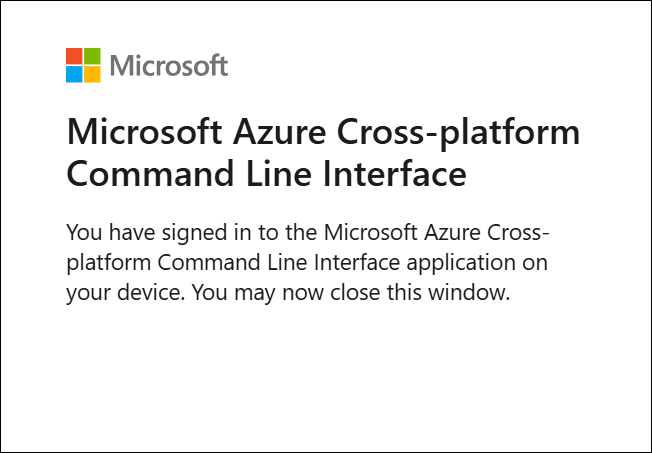

1. In the Cloud Shell console, press **Enter** to select the only available subscription.

    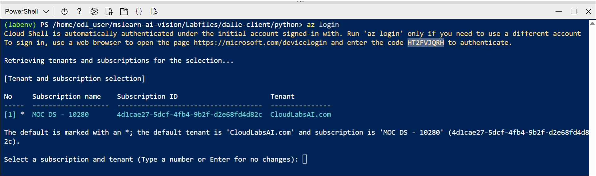

1. In the cloud shell command line pane, enter the following command to run the app:

    ```
   python dalle-client.py
    ```

     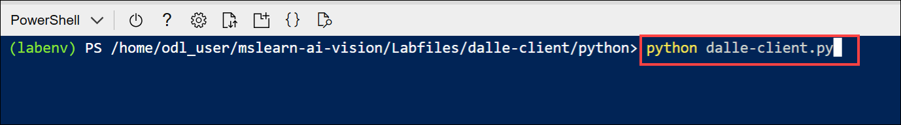

1. When prompted, enter a request for an image, such as `Create an image of a robot eating pizza`. After a moment or two, the app should confirm that the image has been saved.

     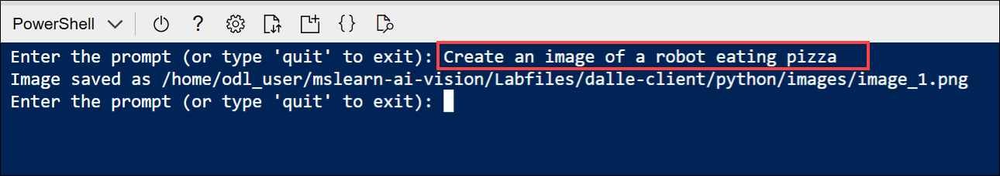

1. Try a few more prompts. When you're finished, enter `quit` to exit the program.

    > **Note**: In this simple app, we haven't implemented logic to retain conversation history; so the model will treat each prompt as a new request with no context of the previous prompt.

1. To download and view the images that were generated by your app, use the cloud shell **download (1)** command - specifying the .png file that was generated:

    ```
   download ./images/image_1.png
    ```
1. The download command creates a popup link at the bottom right of your browser, which you can select to download **(2)** and open the file.

    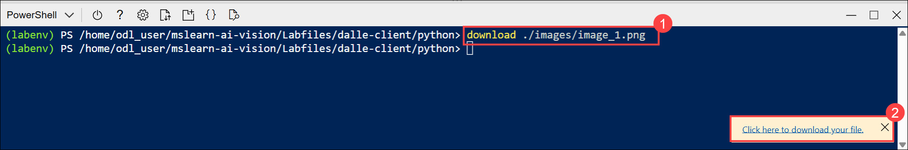

1. In your browser, select the **Download (1)** icon to open the recent download. From the list, select **image_1.png (2)** to open the downloaded file.  

    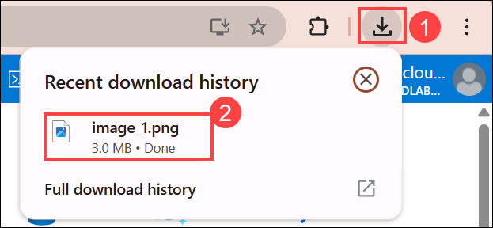

1. The downloaded image should display the generated result, similar to the example shown below:  

    

## Summary

In this lab, you created a project in Azure AI Foundry and deployed the DALL-E model for image generation. You tested the model in the playground by submitting descriptive prompts and refining outputs. You then built a Python client application in Cloud Shell, connected it to your deployment, and added code to generate and save images. Finally, you ran the app to create and download AI-generated images, gaining hands-on experience in operationalizing generative AI solutions with Azure OpenAI.

### You have successfully completed the Hands-on Lab!